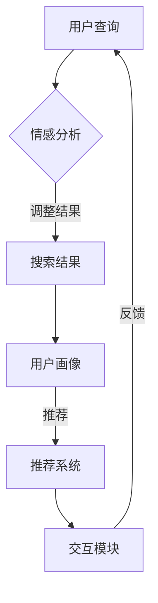

                 

关键词：搜索引擎，情感智能，NLP，机器学习，情感分析，用户体验

> 摘要：随着人工智能技术的不断发展，搜索引擎正在逐步融入情感智能，使搜索结果更加个性化和人性化。本文将探讨搜索引擎在情感智能领域的最新进展，分析其核心技术、应用场景以及未来发展趋势。

## 1. 背景介绍

随着互联网的普及，搜索引擎已经成为人们日常生活中不可或缺的工具。然而，传统的搜索引擎主要基于关键词匹配，对于用户情感的表达和理解能力较弱。随着人工智能技术的发展，特别是自然语言处理（NLP）和机器学习技术的进步，搜索引擎开始尝试融入情感智能，以提供更加个性化、人性化的搜索体验。

情感智能是指计算机在处理自然语言时，能够理解、感知和模拟人类情感的能力。它涉及对文本的情感倾向、情感强度和情感变化的分析。搜索引擎的情感智能发展主要包括以下几个方面：

1. **情感分析技术的应用**：通过情感分析技术，搜索引擎可以识别用户查询中的情感倾向，从而调整搜索结果。
2. **用户画像的构建**：基于用户的查询历史和偏好，搜索引擎可以构建用户画像，为用户提供个性化的搜索结果。
3. **交互式搜索**：通过情感智能，搜索引擎可以与用户进行更自然的交互，提高用户满意度。

## 2. 核心概念与联系

### 2.1. 情感分析

情感分析（Sentiment Analysis）是NLP领域的一个重要分支，它通过自动分类和标注文本中的情感极性，实现对情感的理解和识别。情感分析通常包括以下步骤：

1. **数据预处理**：对文本进行清洗和预处理，包括去除标点符号、停用词过滤、词干提取等。
2. **特征提取**：将预处理后的文本转化为机器学习模型可处理的特征向量，如词袋模型、TF-IDF等。
3. **模型训练**：使用机器学习算法（如SVM、朴素贝叶斯、神经网络等）对情感分类模型进行训练。
4. **情感分类**：将训练好的模型应用于新的文本数据，预测文本的情感极性。

### 2.2. 机器学习

机器学习是使计算机通过数据和经验不断改进其性能的技术。在搜索引擎的情感智能发展中，机器学习主要用于以下方面：

1. **情感倾向预测**：通过训练模型，预测用户查询中的情感倾向，从而调整搜索结果。
2. **用户画像构建**：基于用户的行为数据，训练模型生成用户画像，为用户提供个性化服务。
3. **交互式搜索优化**：通过机器学习算法，优化搜索结果展示和搜索交互过程，提高用户体验。

### 2.3. 用户画像

用户画像是指通过对用户行为数据的分析，构建出反映用户兴趣、偏好、需求等方面的模型。在搜索引擎的情感智能中，用户画像主要用于：

1. **个性化搜索**：基于用户画像，为用户提供个性化的搜索结果。
2. **推荐系统**：结合用户画像和搜索历史，为用户提供相关内容的推荐。

### 2.4. 情感智能架构

搜索引擎的情感智能架构主要包括以下模块：

1. **情感分析模块**：负责处理用户查询和搜索结果中的情感信息。
2. **用户画像模块**：负责构建和分析用户画像。
3. **推荐系统模块**：负责根据用户画像和搜索历史推荐相关内容。
4. **交互模块**：负责与用户进行自然语言交互，收集用户反馈。

## 2.5. Mermaid 流程图

## 3. 核心算法原理 & 具体操作步骤

### 3.1. 算法原理概述

搜索引擎的情感智能主要基于情感分析和机器学习技术。情感分析通过分析文本的情感极性，识别用户的情感需求。机器学习则用于构建用户画像，预测用户偏好，优化搜索结果。

### 3.2. 算法步骤详解

1. **情感分析**：使用词向量模型（如Word2Vec、GloVe等）将文本转化为向量表示，然后利用情感词典和深度学习模型（如LSTM、GRU等）进行情感分类。
2. **用户画像构建**：通过分析用户的查询历史、点击行为等数据，使用聚类算法（如K-means、DBSCAN等）和机器学习算法（如逻辑回归、决策树等）构建用户画像。
3. **搜索结果调整**：根据用户画像和情感分析结果，对搜索结果进行排序和筛选，以提供个性化的搜索结果。
4. **推荐系统**：结合用户画像和搜索历史，使用协同过滤、矩阵分解等算法为用户推荐相关内容。
5. **交互式搜索**：利用自然语言处理技术，如语音识别、对话系统等，与用户进行自然语言交互，收集用户反馈。

### 3.3. 算法优缺点

**优点**：
- 提高搜索结果的个性化和准确性。
- 增强用户满意度，提高用户粘性。
- 为推荐系统提供有力支持。

**缺点**：
- 情感分析的准确性和稳定性有待提高。
- 用户画像构建和机器学习模型的训练过程复杂，对计算资源要求较高。
- 交互式搜索需要解决自然语言理解和处理的问题，技术难度较大。

### 3.4. 算法应用领域

- **电子商务**：为用户提供个性化的商品推荐，提高销售额。
- **社交媒体**：分析用户情感，优化内容推荐和广告投放。
- **金融行业**：分析用户情绪，预测市场趋势和风险。

## 4. 数学模型和公式 & 详细讲解 & 举例说明

### 4.1. 数学模型构建

在搜索引擎的情感智能中，常用的数学模型包括：

1. **词向量模型**：用于文本向量化，如Word2Vec、GloVe等。
2. **情感分类模型**：用于情感分析，如LSTM、GRU等。
3. **用户画像模型**：用于构建用户画像，如K-means、逻辑回归等。

### 4.2. 公式推导过程

以LSTM为例，其核心公式包括：

- **激活函数**：$$f_t = \sigma(W_f \cdot [h_{t-1}, x_t] + b_f)$$
- **遗忘门**：$$g_t = \sigma(W_g \cdot [h_{t-1}, x_t] + b_g)$$
- **输入门**：$$i_t = \sigma(W_i \cdot [h_{t-1}, x_t] + b_i)$$
- **输出门**：$$o_t = \sigma(W_o \cdot [h_{t-1}, x_t] + b_o)$$
- **单元状态**：$$c_t = g_t \odot f_{t-1} + i_t \odot \text{tan

