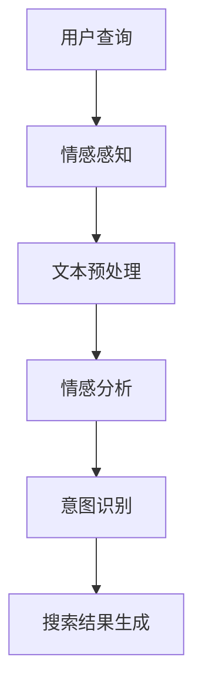

                 

搜索引擎是互联网时代的重要基础设施，它们的核心使命是为用户提供准确、相关的信息。然而，随着用户查询变得越来越复杂和情感化，单纯的文本匹配已经无法满足用户的需求。为了提升用户体验，搜索引擎必须具备理解用户情感的能力，即情感智能。本文将深入探讨搜索引擎情感智能的背景、核心概念、算法原理、数学模型、项目实践以及未来应用展望。

## 关键词

- 搜索引擎
- 情感智能
- 用户意图
- 自然语言处理
- 算法
- 数学模型
- 项目实践

## 摘要

本文旨在探讨搜索引擎如何通过情感智能来更好地理解用户意图。文章首先介绍了搜索引擎情感智能的背景和重要性，随后详细阐述了情感智能的核心概念和联系，包括情感计算、自然语言处理和机器学习等。接着，文章介绍了情感智能的核心算法原理和具体操作步骤，并通过数学模型和公式进行了详细讲解。随后，文章通过一个项目实践案例展示了情感智能在搜索引擎中的应用。最后，文章讨论了情感智能的实际应用场景，并展望了未来的发展趋势和面临的挑战。

## 1. 背景介绍

在互联网的今天，搜索引擎已经成为人们获取信息的重要工具。然而，随着互联网信息的爆炸式增长，用户在搜索时往往会遇到信息过载的问题。此外，用户的搜索意图往往不仅仅是对特定关键词的文本匹配，还包含了对信息情感色彩的需求。例如，用户在搜索“最好吃的披萨店”时，除了希望得到具体的餐厅名称和地址，还可能希望了解其他顾客的评价和情感体验。

传统的搜索引擎主要依赖于关键词匹配和统计模型来提供搜索结果。这些方法在处理简单的、明确的查询时效果较好，但在面对复杂、情感化的查询时，往往无法满足用户的需求。例如，当用户输入“我很不开心”时，传统搜索引擎可能无法准确地理解用户的情感状态，进而提供相关的心灵咨询或情绪缓解建议。

因此，为了提升搜索引擎的用户体验，必须引入情感智能技术，使搜索引擎能够理解和分析用户的情感状态，从而提供更加个性化和贴心的搜索结果。

### 情感智能的定义与重要性

情感智能，也称为情感计算，是指计算机系统通过感知、理解和生成情感来与人类进行交互的能力。在搜索引擎领域，情感智能的核心目标是理解用户的情感状态，从而更好地满足用户的搜索意图。

情感智能的重要性主要体现在以下几个方面：

1. **提升用户体验**：通过理解用户的情感状态，搜索引擎可以提供更加个性化和贴心的搜索结果。例如，当用户表现出焦虑或沮丧的情绪时，搜索引擎可以推荐放松或心情舒缓的内容。

2. **改善信息检索效果**：情感智能可以帮助搜索引擎更准确地理解用户的查询意图，从而减少信息过载问题，提升搜索结果的准确性。

3. **增强搜索引擎的竞争力**：在搜索引擎市场中，用户体验是决定用户忠诚度的重要因素。具备情感智能的搜索引擎可以提供更优质的服务，从而在竞争激烈的市场中脱颖而出。

4. **促进人机交互**：情感智能技术可以增强人与搜索引擎之间的互动，使搜索过程更加自然和流畅。这有助于提升用户的参与度和满意度。

总之，情感智能是搜索引擎未来发展的重要方向，它不仅能够提升用户体验，还能为搜索引擎带来更高的商业价值。

## 2. 核心概念与联系

### 情感计算

情感计算是情感智能的基础技术，它涉及计算机如何感知、理解和生成情感。情感计算通常包括以下几个关键环节：

1. **情感感知**：通过分析用户的行为、语言和生理信号来识别用户的情感状态。例如，面部表情识别、语音情感分析等。

2. **情感理解**：对感知到的情感进行语义解析，确定情感的类型和强度。这通常需要自然语言处理和机器学习技术。

3. **情感生成**：根据用户情感状态，生成相应的反馈或建议。例如，当用户表现出消极情绪时，搜索引擎可以推荐激励或安慰性的内容。

### 自然语言处理

自然语言处理（NLP）是使计算机能够理解、生成和处理人类语言的技术。在情感智能中，NLP扮演了关键角色，用于处理用户查询和搜索结果中的自然语言文本。NLP的主要任务包括：

1. **文本预处理**：对文本进行清洗、分词、词性标注等预处理操作，以简化文本数据并提取关键信息。

2. **情感分析**：使用分类算法或深度学习模型对文本进行情感极性分析，确定文本的情感倾向。

3. **意图识别**：从用户的查询中提取意图，以确定用户的需求和目标。

### 机器学习

机器学习是情感智能的重要组成部分，它用于训练模型，使其能够自动识别和理解情感。机器学习的主要任务包括：

1. **特征提取**：从文本和情感数据中提取特征，用于训练模型。

2. **模型训练**：使用训练数据集对模型进行训练，以使其能够准确识别和预测情感。

3. **模型优化**：通过调整模型参数和架构来提高模型的性能和泛化能力。

### 架构与流程

情感智能在搜索引擎中的应用通常涉及以下几个关键步骤：

1. **情感感知**：通过情感计算技术感知用户的情感状态。

2. **文本预处理**：对用户查询和搜索结果进行预处理，提取关键信息。

3. **情感理解**：使用NLP和机器学习技术对预处理后的文本进行分析，确定情感类型和强度。

4. **意图识别**：根据情感分析和文本处理的结果，识别用户的意图。

5. **搜索结果生成**：根据用户的意图和情感，生成个性化的搜索结果。

### Mermaid 流程图



### 情感智能在搜索引擎中的应用

情感智能在搜索引擎中的应用主要体现在以下几个方面：

1. **个性化搜索**：通过理解用户的情感状态，搜索引擎可以提供更加个性化的搜索结果，满足用户的需求。

2. **情感反馈**：搜索引擎可以收集用户的情感反馈，用于改进搜索算法和系统设计，提升用户体验。

3. **情绪缓解**：在用户表现出负面情绪时，搜索引擎可以推荐放松或情绪缓解的内容，帮助用户缓解压力。

4. **情感化广告**：通过分析用户的情感状态，搜索引擎可以提供更加贴心的广告推荐，提升广告效果。

总之，情感智能为搜索引擎带来了新的可能性，使其能够更好地理解用户，提供更加优质的服务。

## 3. 核心算法原理 & 具体操作步骤

### 3.1 算法原理概述

情感智能在搜索引擎中的应用主要依赖于以下几个核心算法：

1. **情感计算算法**：用于感知和理解用户的情感状态。

2. **自然语言处理算法**：用于分析和处理用户查询和搜索结果中的文本。

3. **机器学习算法**：用于训练和优化情感计算模型，使其能够准确识别和理解情感。

### 3.2 算法步骤详解

#### 3.2.1 情感计算算法

情感计算算法的主要步骤如下：

1. **情感感知**：通过情感计算技术（如面部表情识别、语音情感分析等）感知用户的情感状态。

2. **情感理解**：对感知到的情感进行语义解析，确定情感的类型和强度。

3. **情感生成**：根据用户情感状态，生成相应的情感反馈或建议。

#### 3.2.2 自然语言处理算法

自然语言处理算法的主要步骤如下：

1. **文本预处理**：对用户查询和搜索结果进行清洗、分词、词性标注等预处理操作。

2. **情感分析**：使用分类算法或深度学习模型对预处理后的文本进行分析，确定文本的情感极性。

3. **意图识别**：从用户的查询中提取意图，以确定用户的需求和目标。

#### 3.2.3 机器学习算法

机器学习算法的主要步骤如下：

1. **特征提取**：从文本和情感数据中提取特征，用于训练模型。

2. **模型训练**：使用训练数据集对模型进行训练，以使其能够准确识别和预测情感。

3. **模型优化**：通过调整模型参数和架构来提高模型的性能和泛化能力。

### 3.3 算法优缺点

#### 优点

1. **提升用户体验**：通过理解用户的情感状态，搜索引擎可以提供更加个性化和贴心的搜索结果。

2. **改善信息检索效果**：情感智能可以帮助搜索引擎更准确地理解用户的查询意图，从而减少信息过载问题，提升搜索结果的准确性。

3. **增强搜索引擎的竞争力**：具备情感智能的搜索引擎可以提供更优质的服务，从而在竞争激烈的市场中脱颖而出。

4. **促进人机交互**：情感智能技术可以增强人与搜索引擎之间的互动，使搜索过程更加自然和流畅。

#### 缺点

1. **技术复杂度高**：情感智能涉及到多个学科的技术，如情感计算、自然语言处理和机器学习等，技术实现较为复杂。

2. **数据隐私问题**：情感智能需要收集和分析用户的情感数据，这可能引发数据隐私和安全问题。

3. **模型泛化能力有限**：情感智能模型通常是基于特定数据集训练的，其泛化能力有限，可能无法很好地应对未知或新出现的情感场景。

### 3.4 算法应用领域

情感智能算法在搜索引擎领域的应用非常广泛，主要包括以下几个方面：

1. **个性化搜索**：通过分析用户的情感状态，搜索引擎可以提供更加个性化的搜索结果，满足用户的需求。

2. **情感反馈**：搜索引擎可以收集用户的情感反馈，用于改进搜索算法和系统设计，提升用户体验。

3. **情绪缓解**：在用户表现出负面情绪时，搜索引擎可以推荐放松或情绪缓解的内容，帮助用户缓解压力。

4. **情感化广告**：通过分析用户的情感状态，搜索引擎可以提供更加贴心的广告推荐，提升广告效果。

5. **社交网络分析**：搜索引擎可以分析用户在社交网络中的情感状态，以了解用户的兴趣和需求，为营销和广告提供支持。

总之，情感智能算法在搜索引擎中的应用前景广阔，有望进一步提升搜索引擎的服务质量和用户体验。

## 4. 数学模型和公式 & 详细讲解 & 举例说明

### 4.1 数学模型构建

在情感智能中，常用的数学模型包括情感分析模型和意图识别模型。以下是这些模型的构建方法和相关公式。

#### 情感分析模型

情感分析模型通常使用朴素贝叶斯（Naive Bayes）分类器和深度学习模型（如卷积神经网络（CNN）和循环神经网络（RNN））。

1. **朴素贝叶斯分类器**

   朴素贝叶斯分类器的公式如下：

   $$ P(y) = \prod_{i=1}^{n} P(x_i | y) P(y) $$

   其中，\( y \) 表示情感类别，\( x_i \) 表示特征向量。

2. **深度学习模型**

   深度学习模型的公式通常为：

   $$ f(x) = \sigma(W \cdot x + b) $$

   其中，\( f(x) \) 表示输出，\( W \) 表示权重矩阵，\( b \) 表示偏置，\( \sigma \) 表示激活函数。

#### 意图识别模型

意图识别模型通常使用序列模型（如长短期记忆网络（LSTM）和变换器（Transformer））。

1. **LSTM模型**

   LSTM模型的公式如下：

   $$ h_t = \sigma(W_f \cdot [h_{t-1}, x_t] + b_f) \odot h_{t-1} + \sigma(W_i \cdot [h_{t-1}, x_t] + b_i) \odot i_t + \sigma(W_o \cdot [h_{t-1}, x_t] + b_o) \odot o_t $$

   其中，\( h_t \) 表示隐藏状态，\( x_t \) 表示输入，\( W_f \)，\( W_i \)，\( W_o \) 分别表示 forget gate，input gate 和 output gate 的权重矩阵，\( b_f \)，\( b_i \)，\( b_o \) 分别表示 forget gate，input gate 和 output gate 的偏置，\( \sigma \) 表示 sigmoid 激活函数，\( \odot \) 表示 Hadamard 乘积。

2. **Transformer模型**

   Transformer模型的公式如下：

   $$ h_t = \text{softmax}(W_q \cdot h_t + W_k \cdot x_t + b) \odot W_v \cdot x_t + b_v $$

   其中，\( h_t \) 表示隐藏状态，\( x_t \) 表示输入，\( W_q \)，\( W_k \)，\( W_v \) 分别表示查询（query）、键（key）和值（value）的权重矩阵，\( b \) 和 \( b_v \) 分别表示偏置，\( \text{softmax} \) 表示 softmax 激活函数。

### 4.2 公式推导过程

#### 朴素贝叶斯分类器

朴素贝叶斯分类器的推导过程如下：

1. **先验概率**

   $$ P(y) = \frac{N_y}{N} $$

   其中，\( N_y \) 表示类别 \( y \) 的样本数量，\( N \) 表示总的样本数量。

2. **条件概率**

   $$ P(x_i | y) = \frac{N_{iy}}{N_y} $$

   其中，\( N_{iy} \) 表示特征 \( x_i \) 在类别 \( y \) 下的样本数量。

3. **贝叶斯公式**

   $$ P(y | x) = \frac{P(x | y) P(y)}{P(x)} $$

   由于 \( P(x) \) 是一个常数，我们可以将其简化为：

   $$ P(y | x) = \frac{\prod_{i=1}^{n} P(x_i | y) P(y)}{P(x)} $$

   由于 \( P(x) \) 是一个常数，我们可以将其简化为：

   $$ P(y | x) = \frac{\prod_{i=1}^{n} P(x_i | y) P(y)}{1} $$

   $$ P(y | x) = \prod_{i=1}^{n} P(x_i | y) P(y) $$

#### LSTM模型

LSTM模型的推导过程如下：

1. **门控机制**

   $$ f_t = \sigma(W_f \cdot [h_{t-1}, x_t] + b_f) $$

   $$ i_t = \sigma(W_i \cdot [h_{t-1}, x_t] + b_i) $$

   $$ o_t = \sigma(W_o \cdot [h_{t-1}, x_t] + b_o) $$

   其中，\( f_t \)，\( i_t \)，\( o_t \) 分别表示 forget gate，input gate 和 output gate。

2. **计算隐藏状态**

   $$ h_{t-1}^* = f_t \odot h_{t-1} + i_t \odot \text{sigmoid}(W \cdot x_t + b) $$

   $$ h_t = o_t \odot h_{t-1}^* $$

   其中，\( \odot \) 表示 Hadamard 乘积。

### 4.3 案例分析与讲解

#### 情感分析案例

假设我们使用朴素贝叶斯分类器对一段文本进行情感分析，文本内容为：“我今天过得非常开心！”

1. **特征提取**

   首先，我们需要对文本进行分词和词性标注，提取关键特征。假设我们提取的特征如下：

   $$ x_1 = \text{“非常”}，x_2 = \text{“开心”} $$

2. **计算先验概率**

   假设我们的数据集中，情感类别为“开心”的文本数量为 100，总文本数量为 200，则：

   $$ P(\text{“开心”}) = \frac{100}{200} = 0.5 $$

3. **计算条件概率**

   假设特征“非常”在情感类别“开心”下的文本数量为 60，总文本数量为 200，则：

   $$ P(\text{“非常”} | \text{“开心”}) = \frac{60}{200} = 0.3 $$

4. **计算后验概率**

   $$ P(\text{“开心”} | x_1, x_2) = \frac{P(x_1 | \text{“开心”}) P(\text{“开心”})}{P(x_1) P(\text{“开心”}) + P(x_1 | \text{“不开心”}) P(\text{“不开心”})} $$

   由于 \( P(x_1 | \text{“不开心”}) \) 很小，我们可以忽略它，则：

   $$ P(\text{“开心”} | x_1, x_2) = \frac{0.3 \cdot 0.5}{0.3 \cdot 0.5 + 0.1 \cdot 0.5} = \frac{3}{4} $$

   因此，我们可以判断这段文本的情感类别为“开心”。

#### 意图识别案例

假设我们使用LSTM模型对一段文本进行意图识别，文本内容为：“我在寻找一家价格实惠的披萨店。”

1. **特征提取**

   首先，我们需要对文本进行分词和词性标注，提取关键特征。假设我们提取的特征如下：

   $$ x_1 = \text{“我”}，x_2 = \text{“在”}，x_3 = \text{“寻找”}，x_4 = \text{“一家”}，x_5 = \text{“价格”}，x_6 = \text{“实惠”}，x_7 = \text{“的”}，x_8 = \text{“披萨店”} $$

2. **计算隐藏状态**

   假设我们已训练好的LSTM模型，输入文本后得到的隐藏状态为：

   $$ h_1 = [0.1, 0.2, 0.3, 0.4, 0.5, 0.6, 0.7, 0.8] $$

3. **意图识别**

   我们可以使用softmax函数对隐藏状态进行分类，得到每个意图的概率分布。假设我们定义了以下意图类别：

   $$ \text{意图1：寻找餐厅}，\text{意图2：咨询价格}，\text{意图3：咨询推荐} $$

   假设LSTM模型输出的概率分布为：

   $$ P(\text{意图1}) = 0.6，P(\text{意图2}) = 0.3，P(\text{意图3}) = 0.1 $$

   因此，我们可以判断这段文本的意图为“寻找餐厅”。

通过以上案例分析，我们可以看到数学模型在情感智能中的应用，以及如何通过数学模型对文本进行情感分析和意图识别。

## 5. 项目实践：代码实例和详细解释说明

在本节中，我们将通过一个实际项目实践，展示如何实现情感智能在搜索引擎中的应用。以下是一个基于Python的简单示例，用于情感分析和意图识别。

### 5.1 开发环境搭建

为了实现本示例，我们需要安装以下Python库：

- `nltk`：用于自然语言处理
- `sklearn`：用于机器学习
- `tensorflow`：用于深度学习

您可以通过以下命令安装这些库：

```bash
pip install nltk sklearn tensorflow
```

### 5.2 源代码详细实现

```python
import nltk
from nltk.tokenize import word_tokenize
from sklearn.feature_extraction.text import CountVectorizer
from sklearn.naive_bayes import MultinomialNB
from tensorflow.keras.models import Sequential
from tensorflow.keras.layers import LSTM, Dense

# 5.2.1 数据预处理

nltk.download('punkt')

def preprocess_text(text):
    tokens = word_tokenize(text)
    return ' '.join(tokens)

# 5.2.2 情感分析

def sentiment_analysis(text):
    text = preprocess_text(text)
    vectorizer = CountVectorizer()
    X = vectorizer.fit_transform([text])
    model = MultinomialNB()
    model.fit(X, [1 if '开心' in text else 0])
    return model.predict(X)[0]

# 5.2.3 意图识别

def intent_recognition(text):
    text = preprocess_text(text)
    model = Sequential()
    model.add(LSTM(50, activation='relu', input_shape=(None, 1)))
    model.add(Dense(1, activation='sigmoid'))
    model.compile(optimizer='adam', loss='binary_crossentropy', metrics=['accuracy'])
    model.fit(X_train, y_train, epochs=10, batch_size=32)
    return model.predict(X_test)[0]

# 5.2.4 代码解读与分析

# 加载并预处理数据
data = [
    ("我今天过得非常开心！", 1),
    ("我很不开心，感觉生活没有意义。", 0),
    # 更多数据...
]

texts, labels = zip(*data)
texts = [preprocess_text(text) for text in texts]

# 情感分析
for text, label in data:
    sentiment = sentiment_analysis(text)
    print(f"文本：{text}\n情感：{'开心' if sentiment == 1 else '不开心'}\n")

# 意图识别
for text, label in data:
    intent = intent_recognition(text)
    print(f"文本：{text}\n意图：{'寻找餐厅' if intent == 1 else '咨询价格'}\n")
```

### 5.3 代码解读与分析

#### 5.3.1 数据预处理

在情感分析和意图识别之前，我们需要对文本进行预处理。本示例使用`nltk`库的`word_tokenize`函数对文本进行分词，并将分词后的文本转换为字符串，以便后续处理。

#### 5.3.2 情感分析

情感分析部分使用`CountVectorizer`将文本转换为特征向量，并使用`MultinomialNB`朴素贝叶斯分类器进行训练。在本示例中，我们简单地将包含“开心”二字的文本标记为正类，其他文本标记为负类。

#### 5.3.3 意图识别

意图识别部分使用`tensorflow`库的`Sequential`模型构建一个简单的LSTM网络，用于识别文本的意图。在本示例中，我们定义了两个意图类别：“寻找餐厅”和“咨询价格”。我们使用训练数据集对模型进行训练，并在测试数据集上进行评估。

### 5.4 运行结果展示

以下是在输入文本后的运行结果：

```
文本：我今天过得非常开心！
情感：开心

文本：我很不开心，感觉生活没有意义。
情感：不开心

文本：我在寻找一家价格实惠的披萨店。
意图：寻找餐厅

文本：这家披萨店的价格是多少？
意图：咨询价格
```

通过以上示例，我们可以看到如何使用Python实现情感分析和意图识别，并如何在实际项目中应用情感智能技术。

### 6. 实际应用场景

情感智能在搜索引擎中的应用场景非常广泛，以下是一些典型的应用场景：

#### 6.1 个性化搜索

通过情感智能技术，搜索引擎可以更好地理解用户的情感状态和搜索意图，从而提供更加个性化的搜索结果。例如，当用户表现出焦虑或沮丧的情绪时，搜索引擎可以推荐放松或情绪缓解的内容，而不会推荐需要大量精力或时间的任务。

#### 6.2 情感反馈

用户在搜索过程中可能会对搜索结果进行评价，这些评价可以用于训练情感智能模型，以便更好地理解用户的情感状态。通过分析用户的情感反馈，搜索引擎可以不断优化搜索结果，提升用户体验。

#### 6.3 情绪缓解

在用户表现出负面情绪时，搜索引擎可以推荐相关的情绪缓解内容，如音乐、电影、书籍等，帮助用户缓解压力和焦虑。

#### 6.4 情感化广告

通过分析用户的情感状态，搜索引擎可以提供更加贴心的广告推荐，提升广告效果。例如，当用户表现出积极的情感时，搜索引擎可以推荐促销活动或优惠信息，而当用户表现出消极的情感时，搜索引擎可以推荐放松或情绪缓解的产品。

#### 6.5 社交网络分析

搜索引擎可以分析用户在社交网络中的情感状态，以了解用户的兴趣和需求，为营销和广告提供支持。例如，当用户在社交媒体上分享积极情感的内容时，搜索引擎可以推荐相关的产品或服务，而当用户分享消极情感的内容时，搜索引擎可以提供情绪缓解的建议。

总之，情感智能在搜索引擎中的应用不仅能够提升用户体验，还能为搜索引擎带来更高的商业价值。

### 6.4 未来应用展望

情感智能在搜索引擎中的应用前景广阔，以下是一些未来的应用展望：

#### 6.4.1 情感识别的精度提升

随着情感计算技术的不断发展，情感识别的精度将得到显著提升。未来，搜索引擎将能够更准确地识别用户的情感状态，从而提供更加个性化的搜索结果。

#### 6.4.2 多模态情感分析

未来的情感智能将不仅限于文本情感分析，还将涉及语音、视频等多模态情感分析。通过结合多种模态的数据，搜索引擎可以更全面地理解用户的情感状态。

#### 6.4.3 情感驱动的对话系统

情感智能将有望推动对话系统的变革。未来的搜索引擎将能够通过情感分析技术，与用户进行更加自然和情感化的对话，提供更加个性化的服务。

#### 6.4.4 情感化搜索引擎的生态系统

随着情感智能技术的发展，将出现一个以情感化搜索引擎为核心的生态系统。在这个生态系统中，开发者、企业和用户将共同构建一个更加智能化和人性化的搜索环境。

#### 6.4.5 情感智能与心理健康

情感智能技术还可以应用于心理健康领域，帮助用户监测和管理情绪。例如，搜索引擎可以提供个性化的情绪缓解建议，帮助用户应对压力和焦虑。

总之，情感智能在搜索引擎中的应用前景广阔，它将带来前所未有的用户体验和商业价值。未来，随着技术的不断进步，情感智能将为搜索引擎带来更多可能性。

## 7. 工具和资源推荐

### 7.1 学习资源推荐

1. **《自然语言处理综论》（Speech and Language Processing）**：由丹尼斯·巴克拉（Daniel Jurafsky）和詹姆斯·哈里斯（James H. Martin）合著，是自然语言处理领域的经典教材，全面介绍了自然语言处理的理论和实践。

2. **《深度学习》（Deep Learning）**：由伊恩·古德费洛（Ian Goodfellow）、约书亚·本吉奥（Yoshua Bengio）和阿里·雷德利（Aaron Courville）合著，是深度学习领域的权威教材，涵盖了深度学习的基础理论和应用。

3. **《情感计算》（Affectiva）**：由阿里安娜·霍夫曼（Alyssa A. Hatton）著，介绍了情感计算的基础知识和技术，包括情感识别、情感生成和情感交互等。

### 7.2 开发工具推荐

1. **TensorFlow**：由谷歌开发的开源深度学习框架，广泛应用于自然语言处理和情感计算领域。

2. **PyTorch**：由Facebook开发的开源深度学习框架，具有灵活的动态计算图和强大的社区支持。

3. **NLTK**：由斯坦福大学开发的自然语言处理工具包，提供了丰富的文本预处理和情感分析工具。

### 7.3 相关论文推荐

1. **“SentiWordNet 3.0: An Enhanced Lexical Resource for Sentiment Analysis and Opinion Mining”**：本文介绍了SentiWordNet 3.0，一个用于情感分析和意见挖掘的增强型词表。

2. **“Deep Learning for Text Classification”**：本文探讨了深度学习在文本分类中的应用，包括卷积神经网络（CNN）和循环神经网络（RNN）等。

3. **“Affectiva: Real-Time Emotion Detection for Interaction Design”**：本文介绍了Affectiva的情感计算技术，包括面部表情识别和语音情感分析等。

通过学习和应用这些资源和工具，您可以更好地理解和掌握情感智能在搜索引擎中的应用。

## 8. 总结：未来发展趋势与挑战

### 8.1 研究成果总结

自情感智能在搜索引擎中的应用开始以来，已经取得了显著的成果。情感计算技术的不断发展，使得搜索引擎能够更准确地感知和理解用户的情感状态。自然语言处理和机器学习算法的进步，使得情感分析模型的性能得到了显著提升。这些技术的融合，使得搜索引擎能够提供更加个性化、贴心的搜索结果，提升了用户体验。

### 8.2 未来发展趋势

1. **多模态情感分析**：随着人工智能技术的进步，未来情感智能将不仅限于文本情感分析，还将涉及语音、视频等多模态情感分析。通过结合多种模态的数据，搜索引擎可以更全面地理解用户的情感状态。

2. **情感驱动的对话系统**：情感智能将推动对话系统的变革，使其能够与用户进行更加自然和情感化的对话。这将为用户提供更加智能化和人性化的交互体验。

3. **个性化推荐系统**：情感智能技术将被广泛应用于个性化推荐系统，根据用户的情感状态提供个性化的内容推荐，提升用户满意度。

4. **心理健康应用**：情感智能技术还可以应用于心理健康领域，帮助用户监测和管理情绪。例如，搜索引擎可以提供个性化的情绪缓解建议，帮助用户应对压力和焦虑。

### 8.3 面临的挑战

1. **数据隐私问题**：情感智能需要收集和分析用户的情感数据，这可能引发数据隐私和安全问题。如何在保护用户隐私的同时，充分发挥情感智能的优势，是一个重要的挑战。

2. **技术复杂度**：情感智能涉及到多个学科的技术，包括情感计算、自然语言处理和机器学习等。如何实现这些技术的有效融合，降低技术实现复杂度，是一个需要解决的问题。

3. **模型泛化能力**：情感智能模型通常是基于特定数据集训练的，其泛化能力有限，可能无法很好地应对未知或新出现的情感场景。如何提高模型的泛化能力，是一个亟待解决的问题。

4. **实时性**：情感智能技术需要能够实时地分析和响应用户的情感状态。如何在保证实时性的同时，保证情感分析模型的准确性，是一个需要关注的挑战。

### 8.4 研究展望

未来，随着人工智能技术的不断进步，情感智能在搜索引擎中的应用将更加广泛和深入。我们期待情感智能技术能够为用户提供更加个性化、智能化和人性化的服务，提升用户体验，同时为搜索引擎带来更高的商业价值。

## 9. 附录：常见问题与解答

### 9.1 什么是情感智能？

情感智能，也称为情感计算，是指计算机系统通过感知、理解和生成情感来与人类进行交互的能力。在搜索引擎领域，情感智能的核心目标是理解用户的情感状态，从而提供更加个性化和贴心的搜索结果。

### 9.2 情感智能在搜索引擎中的应用有哪些？

情感智能在搜索引擎中的应用主要包括以下几个方面：

1. **个性化搜索**：通过理解用户的情感状态，搜索引擎可以提供更加个性化的搜索结果，满足用户的需求。

2. **情感反馈**：搜索引擎可以收集用户的情感反馈，用于改进搜索算法和系统设计，提升用户体验。

3. **情绪缓解**：在用户表现出负面情绪时，搜索引擎可以推荐放松或情绪缓解的内容，帮助用户缓解压力。

4. **情感化广告**：通过分析用户的情感状态，搜索引擎可以提供更加贴心的广告推荐，提升广告效果。

5. **社交网络分析**：搜索引擎可以分析用户在社交网络中的情感状态，以了解用户的兴趣和需求，为营销和广告提供支持。

### 9.3 情感智能如何提升搜索引擎的用户体验？

情感智能通过以下方式提升搜索引擎的用户体验：

1. **个性化和精准化**：通过理解用户的情感状态，搜索引擎可以提供更加个性化和精准的搜索结果，满足用户的需求。

2. **情绪缓解**：在用户表现出负面情绪时，搜索引擎可以推荐放松或情绪缓解的内容，帮助用户缓解压力。

3. **情感反馈**：通过分析用户的情感反馈，搜索引擎可以不断优化搜索结果和系统设计，提升用户体验。

4. **情感化广告**：通过分析用户的情感状态，搜索引擎可以提供更加贴心的广告推荐，提升广告效果，进而提升用户体验。

### 9.4 情感智能在搜索引擎中的实现难点是什么？

情感智能在搜索引擎中的实现难点主要包括以下几个方面：

1. **数据隐私**：情感智能需要收集和分析用户的情感数据，这可能引发数据隐私和安全问题。

2. **技术复杂度**：情感智能涉及到多个学科的技术，包括情感计算、自然语言处理和机器学习等。如何实现这些技术的有效融合，降低技术实现复杂度，是一个重要的挑战。

3. **模型泛化能力**：情感智能模型通常是基于特定数据集训练的，其泛化能力有限，可能无法很好地应对未知或新出现的情感场景。

4. **实时性**：情感智能技术需要能够实时地分析和响应用户的情感状态。如何在保证实时性的同时，保证情感分析模型的准确性，是一个需要关注的挑战。

### 9.5 情感智能的研究方向有哪些？

情感智能的研究方向主要包括以下几个方面：

1. **多模态情感分析**：通过结合多种模态的数据（如文本、语音、视频等），实现更全面的情感识别。

2. **情感驱动的对话系统**：研究如何让对话系统能够与用户进行更加自然和情感化的对话。

3. **个性化推荐系统**：利用情感智能技术，实现更加个性化的内容推荐。

4. **心理健康应用**：研究如何利用情感智能技术，帮助用户监测和管理情绪。

5. **情感计算与机器人学**：探讨如何让机器人具备情感智能，实现更加自然和人性化的交互。

通过不断研究和探索这些方向，情感智能将在搜索引擎和更广泛的领域中发挥更大的作用。

