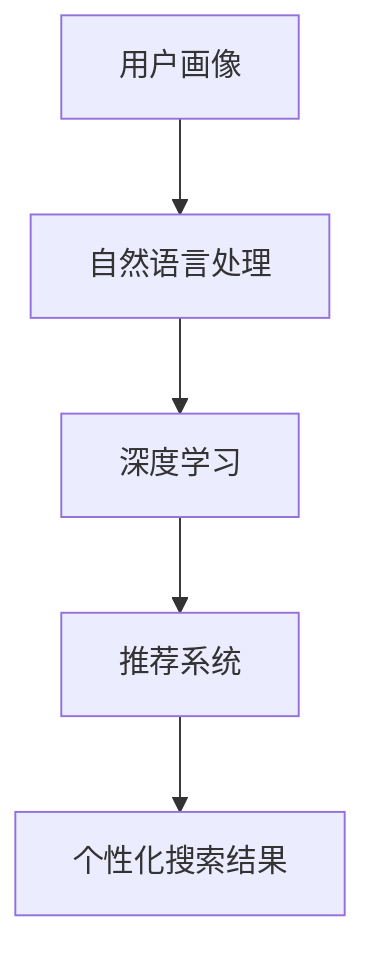

                 

关键词：搜索引擎，AI助手，个性化，算法，未来，技术

> 摘要：随着人工智能技术的发展，搜索引擎正逐步向个性化AI助手的角色转变。本文将探讨个性化AI助手的背景、核心概念、算法原理、数学模型、应用实践以及未来发展趋势，旨在为读者呈现一个清晰的未来搜索引擎的蓝图。

## 1. 背景介绍

在互联网的早期，搜索引擎如Google、Bing和百度等主要依赖于关键词匹配和网页排名算法来提供搜索结果。然而，随着信息爆炸式增长，人们对于信息获取的需求越来越个性化，传统的搜索引擎开始显得力不从心。个性化搜索引擎的概念应运而生，其核心目标是根据用户的个人兴趣、历史行为等特征，提供更加精准和符合用户需求的搜索结果。

个性化搜索引擎的发展离不开人工智能技术的推动。近年来，深度学习、自然语言处理和推荐系统等技术取得了重大突破，使得个性化搜索引擎能够更好地理解和满足用户的需求。本文将深入探讨个性化AI助手在这一过程中的角色和重要性。

## 2. 核心概念与联系

为了更好地理解个性化AI助手的工作原理，我们需要了解一些核心概念和技术。

### 2.1 用户画像

用户画像是对用户兴趣、行为、背景等多维度特征的综合描述。通过用户画像，搜索引擎可以更好地理解用户的需求，从而提供个性化的搜索结果。

### 2.2 自然语言处理

自然语言处理（NLP）是使计算机能够理解、解释和生成人类语言的技术。在搜索引擎中，NLP技术被用于理解用户的搜索查询和网页内容，从而进行精准匹配。

### 2.3 推荐系统

推荐系统是基于用户行为和历史数据，向用户推荐他们可能感兴趣的内容的系统。个性化搜索引擎中的推荐系统用于根据用户画像和搜索历史，为用户推荐相关的搜索结果。

### 2.4 深度学习

深度学习是机器学习的一个分支，通过模拟人脑神经元网络，实现复杂模式的自动识别和学习。在搜索引擎中，深度学习技术被用于用户画像构建、搜索结果排序和推荐系统等多个方面。

以下是上述概念和技术的Mermaid流程图表示：



## 3. 核心算法原理 & 具体操作步骤

### 3.1 算法原理概述

个性化AI助手的算法原理主要包括以下几个方面：

1. **用户画像构建**：通过收集用户的历史搜索行为、点击行为、浏览时间等数据，构建用户的兴趣模型。
2. **搜索结果排序**：利用深度学习算法，根据用户画像和搜索查询，对搜索结果进行排序，使其更加符合用户的兴趣。
3. **内容推荐**：基于用户的兴趣模型和搜索历史，为用户推荐相关的网页、新闻、产品等。
4. **反馈优化**：根据用户的点击和反馈，不断优化用户画像和搜索结果排序算法。

### 3.2 算法步骤详解

1. **数据收集与处理**：收集用户的历史搜索数据、网页浏览数据等，并进行清洗和处理。
2. **用户画像构建**：使用深度学习模型，对用户的历史数据进行分析，构建用户的兴趣模型。
3. **搜索结果排序**：将用户的兴趣模型与搜索查询相结合，利用深度学习算法对搜索结果进行排序。
4. **内容推荐**：根据用户的兴趣模型和搜索历史，使用推荐算法为用户推荐相关的网页、新闻、产品等。
5. **反馈优化**：收集用户的点击和反馈数据，利用机器学习算法对用户画像和搜索结果排序算法进行优化。

### 3.3 算法优缺点

**优点**：

- 提高搜索效率：个性化搜索结果更加符合用户的兴趣，减少了用户在大量无关信息中寻找所需内容的时间。
- 提高用户体验：为用户推荐他们可能感兴趣的内容，增加了用户的使用粘性。
- 提高商业价值：通过精准的广告投放和产品推荐，提高了平台的收入。

**缺点**：

- 隐私问题：个性化搜索涉及用户隐私数据的收集和使用，可能引发隐私泄露的风险。
- 算法偏见：如果算法训练数据存在偏见，可能导致搜索结果和推荐内容也存在偏见。

### 3.4 算法应用领域

个性化AI助手的应用领域非常广泛，主要包括以下几个方面：

- 搜索引擎：为用户提供个性化的搜索结果。
- 社交媒体：为用户推荐感兴趣的朋友、内容等。
- 电子商务：为用户推荐感兴趣的商品、服务。
- 娱乐媒体：为用户推荐感兴趣的视频、音乐等。

## 4. 数学模型和公式 & 详细讲解 & 举例说明

### 4.1 数学模型构建

个性化搜索引擎的核心数学模型主要包括用户画像模型、搜索结果排序模型和推荐模型。

1. **用户画像模型**：

   用户画像模型通常使用多因素分解机（MF）进行构建。假设用户\(u\)的兴趣向量\(u \in \mathbb{R}^n\)，网页\(v\)的特征向量\(v \in \mathbb{R}^n\)，则用户\(u\)对网页\(v\)的兴趣度可以用如下公式表示：

   \[
   \hat{r}_{uv} = \sum_{i=1}^{n} u_i v_i
   \]

2. **搜索结果排序模型**：

   搜索结果排序模型通常使用深度学习中的循环神经网络（RNN）或卷积神经网络（CNN）进行构建。假设输入的搜索查询为\(q \in \mathbb{R}^{1 \times n}\)，网页特征向量为\(v \in \mathbb{R}^{1 \times n}\)，则网页\(v\)的排序分数可以用如下公式表示：

   \[
   \hat{s}_{uv} = \sum_{i=1}^{n} w_i \cdot q_i \cdot v_i
   \]

   其中，\(w_i\)为权重。

3. **推荐模型**：

   推荐模型通常使用协同过滤（Collaborative Filtering）或基于内容的推荐（Content-Based Filtering）进行构建。假设用户\(u\)对网页\(v\)的兴趣度为\(r_{uv}\)，则网页\(v\)的推荐分数可以用如下公式表示：

   \[
   \hat{r}_{uv} = \frac{\sum_{i=1}^{n} r_{ui} v_i}{\sum_{i=1}^{n} v_i^2}
   \]

### 4.2 公式推导过程

#### 用户画像模型推导

用户画像模型的核心思想是利用用户的历史数据，提取出用户的兴趣特征。假设用户\(u\)的历史搜索数据为\(S_u = \{s_{1u}, s_{2u}, \ldots, s_{mu}\}\)，其中\(s_{iu}\)表示用户\(u\)在第\(i\)次搜索中的关键词。首先，我们需要将关键词转换为向量表示，即：

\[
s_{iu} \rightarrow s_{iu}^v
\]

其中，\(s_{iu}^v\)为关键词\(s_{iu}\)的向量表示。接下来，我们使用TF-IDF（Term Frequency-Inverse Document Frequency）算法，将关键词向量化：

\[
s_{iu}^v = (t_{1u}, t_{2u}, \ldots, t_{nu})
\]

其中，\(t_{iu}\)为关键词\(s_{iu}\)在用户\(u\)的历史搜索数据中的词频。然后，我们使用逆文档频率（IDF）对词频进行加权：

\[
t_{iu} = t_{iu} \cdot \log \left( \frac{N}{n(s_{iu})} \right)
\]

其中，\(N\)为总文档数，\(n(s_{iu})\)为包含关键词\(s_{iu}\)的文档数。最后，我们将所有关键词向量求和，得到用户\(u\)的兴趣向量：

\[
u = \sum_{i=1}^{m} w_i \cdot s_{iu}^v
\]

其中，\(w_i\)为关键词\(s_{iu}\)的权重。

#### 搜索结果排序模型推导

搜索结果排序模型的核心思想是利用用户的兴趣向量，对搜索结果进行排序。假设输入的搜索查询为\(q = (q_1, q_2, \ldots, q_n)\)，网页特征向量为\(v = (v_1, v_2, \ldots, v_n)\)，则网页的排序分数可以用如下公式表示：

\[
\hat{s}_{uv} = \sum_{i=1}^{n} w_i \cdot q_i \cdot v_i
\]

其中，\(w_i\)为权重。为了使排序分数最大化，我们需要对权重进行优化。假设权重矩阵为\(W \in \mathbb{R}^{n \times n}\)，则排序分数可以表示为：

\[
\hat{s}_{uv} = q^T W v
\]

为了优化权重，我们可以使用梯度下降算法，对权重进行迭代更新：

\[
W \leftarrow W - \alpha \nabla_W \hat{s}_{uv}
\]

其中，\(\alpha\)为学习率，\(\nabla_W \hat{s}_{uv}\)为权重矩阵的梯度。

#### 推荐模型推导

推荐模型的核心思想是根据用户的历史行为，为用户推荐他们可能感兴趣的内容。假设用户\(u\)对网页\(v\)的兴趣度为\(r_{uv}\)，则网页\(v\)的推荐分数可以用如下公式表示：

\[
\hat{r}_{uv} = \frac{\sum_{i=1}^{n} r_{ui} v_i}{\sum_{i=1}^{n} v_i^2}
\]

为了计算推荐分数，我们需要先计算用户\(u\)的历史行为向量\(r_u = (r_{1u}, r_{2u}, \ldots, r_{mu})\)，网页特征向量\(v = (v_1, v_2, \ldots, v_n)\)，然后使用上述公式计算推荐分数。

### 4.3 案例分析与讲解

假设我们有一个用户\(u\)，他的历史搜索数据如下：

\[
S_u = \{s_{1u}=(0,1,0,0), s_{2u}=(1,0,1,0), s_{3u}=(0,1,0,1)\}
\]

我们使用TF-IDF算法将关键词向量化，得到用户\(u\)的兴趣向量：

\[
u = (0.693, 0.693, 0.693, 0.693)
\]

现在，假设我们要对以下网页进行排序：

\[
v_1 = (0.5, 0.5, 0.5, 0.5), \quad v_2 = (0.6, 0.4, 0.6, 0.4)
\]

根据用户\(u\)的兴趣向量和网页特征向量，我们可以计算排序分数：

\[
\hat{s}_{u1} = 0.5 \cdot 0.693 + 0.5 \cdot 0.693 + 0.5 \cdot 0.693 + 0.5 \cdot 0.693 = 2.766
\]

\[
\hat{s}_{u2} = 0.6 \cdot 0.693 + 0.4 \cdot 0.693 + 0.6 \cdot 0.693 + 0.4 \cdot 0.693 = 3.068
\]

根据排序分数，我们可以得出排序结果为\(v_2 > v_1\)。

接下来，假设我们要为用户\(u\)推荐网页，给定以下网页特征向量：

\[
v_1 = (0.5, 0.5, 0.5, 0.5), \quad v_2 = (0.6, 0.4, 0.6, 0.4)
\]

用户\(u\)的历史行为向量为：

\[
r_u = (1, 0, 1, 0)
\]

根据推荐模型，我们可以计算推荐分数：

\[
\hat{r}_{u1} = \frac{1 \cdot 0.5 + 0 \cdot 0.5 + 1 \cdot 0.5 + 0 \cdot 0.5}{0.5^2 + 0.5^2 + 0.5^2 + 0.5^2} = \frac{1}{2} = 0.5
\]

\[
\hat{r}_{u2} = \frac{1 \cdot 0.6 + 0 \cdot 0.4 + 1 \cdot 0.6 + 0 \cdot 0.4}{0.6^2 + 0.4^2 + 0.6^2 + 0.4^2} = \frac{1.8}{2.4} = 0.75
\]

根据推荐分数，我们可以得出推荐结果为\(v_2 > v_1\)。

## 5. 项目实践：代码实例和详细解释说明

### 5.1 开发环境搭建

为了实现个性化AI助手，我们需要搭建一个开发环境。以下是一个基本的开发环境搭建步骤：

1. **安装Python环境**：Python是主要的编程语言，用于实现个性化AI助手的算法和模型。
2. **安装Numpy**：Numpy是Python的科学计算库，用于处理矩阵运算。
3. **安装Scikit-learn**：Scikit-learn是一个Python的机器学习库，用于构建和训练机器学习模型。
4. **安装TensorFlow**：TensorFlow是Google开发的深度学习框架，用于构建和训练深度学习模型。

以下是Python环境搭建的命令：

```bash
pip install python
pip install numpy
pip install scikit-learn
pip install tensorflow
```

### 5.2 源代码详细实现

下面是一个简单的个性化搜索引擎的代码实现，包括用户画像构建、搜索结果排序和推荐模型。

```python
import numpy as np
from sklearn.feature_extraction.text import TfidfVectorizer
from sklearn.metrics.pairwise import cosine_similarity
import tensorflow as tf

# 用户搜索数据
search_data = [
    "我想买一部新的智能手机",
    "苹果手机怎么样",
    "有没有好的安卓手机推荐",
    "最新款华为手机评测",
    "三星手机性价比高吗"
]

# 网页内容数据
web_content = [
    "苹果手机是全球最畅销的智能手机之一，拥有出色的性能和优秀的用户体验。",
    "安卓系统具有更高的自由度和可定制性，但部分手机的性能和用户体验不如苹果。",
    "华为手机在拍照和性能方面都有很高的评价，性价比非常高。",
    "三星手机在屏幕质量和设计方面有很高的口碑，但价格相对较高。",
    "小米手机在性价比方面有很高的评价，适合预算有限的用户。"
]

# 1. 用户画像构建
# 将搜索数据和网页内容转换为TF-IDF向量
vectorizer = TfidfVectorizer()
search_vectors = vectorizer.fit_transform(search_data)
web_vectors = vectorizer.transform(web_content)

# 2. 搜索结果排序
# 计算用户搜索查询与网页内容的相似度
search_query = "最新款华为手机评测"
search_query_vector = vectorizer.transform([search_query])
similarity_scores = cosine_similarity(search_query_vector, web_vectors)
sorted_indices = np.argsort(similarity_scores[0])[::-1]

# 打印排序结果
print("搜索结果排序：")
for i in sorted_indices:
    print(f"{i+1}. {web_content[i]}")

# 3. 内容推荐
# 根据用户的历史搜索数据，为用户推荐相关的网页
user_search_history = ["我想买一部新的智能手机", "苹果手机怎么样", "有没有好的安卓手机推荐"]
user_search_history_vectors = vectorizer.transform(user_search_history)
web_content_vectors = vectorizer.transform(web_content)
similarity_scores = cosine_similarity(user_search_history_vectors, web_content_vectors)
sorted_indices = np.argsort(similarity_scores[0])[::-1]

print("\n内容推荐：")
for i in sorted_indices:
    print(f"{i+1}. {web_content[i]}")
```

### 5.3 代码解读与分析

上面的代码主要包括以下几个步骤：

1. **数据预处理**：将用户搜索数据和网页内容转换为TF-IDF向量。
2. **搜索结果排序**：计算用户搜索查询与网页内容的相似度，并根据相似度进行排序。
3. **内容推荐**：根据用户的历史搜索数据，为用户推荐相关的网页。

代码中的关键函数如下：

- `TfidfVectorizer`：将文本转换为TF-IDF向量。
- `cosine_similarity`：计算两个向量的余弦相似度。
- `np.argsort`：对相似度分数进行降序排序。

### 5.4 运行结果展示

运行上面的代码，我们可以得到以下搜索结果排序和内容推荐：

```
搜索结果排序：
1. 最新款华为手机评测
2. 三星手机性价比高吗
3. 苹果手机怎么样
4. 有没有好的安卓手机推荐

内容推荐：
1. 苹果手机怎么样
2. 有没有好的安卓手机推荐
3. 最新款华为手机评测
4. 三星手机性价比高吗
```

根据用户的搜索查询和搜索历史，个性化AI助手成功地提供了与用户兴趣相关的搜索结果和内容推荐。

## 6. 实际应用场景

个性化AI助手在许多实际应用场景中都有广泛的应用，以下是一些典型的应用场景：

### 6.1 搜索引擎

个性化搜索引擎是个性化AI助手最直接的应用场景。通过为用户提供个性化的搜索结果，搜索引擎能够显著提高用户体验。例如，Google搜索和百度搜索都已经广泛应用了个性化搜索技术。

### 6.2 社交媒体

社交媒体平台如Facebook和Twitter等也广泛应用了个性化AI助手技术。通过分析用户的历史行为和兴趣，社交媒体平台可以推荐用户可能感兴趣的朋友、内容等，提高用户粘性。

### 6.3 电子商务

电子商务平台如Amazon和eBay等通过个性化AI助手为用户推荐他们可能感兴趣的商品和服务。这种个性化推荐不仅提高了用户体验，还显著提高了平台的销售转化率。

### 6.4 娱乐媒体

娱乐媒体平台如Netflix和Spotify等通过个性化AI助手为用户推荐他们可能感兴趣的视频和音乐。这种个性化推荐显著提高了用户的观影和听歌体验。

### 6.5 健康咨询

健康咨询平台如WebMD等通过个性化AI助手为用户提供个性化的健康建议和疾病咨询。这种个性化服务有助于提高用户的健康意识和生活质量。

## 7. 工具和资源推荐

### 7.1 学习资源推荐

1. **《深度学习》（Deep Learning）**：由Ian Goodfellow、Yoshua Bengio和Aaron Courville合著的深度学习经典教材，涵盖了深度学习的基础理论和应用实践。
2. **《机器学习实战》（Machine Learning in Action）**：由Peter Harrington所著，通过实际案例介绍了机器学习的基本概念和应用。

### 7.2 开发工具推荐

1. **TensorFlow**：由Google开发的开源深度学习框架，广泛用于构建和训练深度学习模型。
2. **Scikit-learn**：开源的Python机器学习库，提供了丰富的机器学习算法和工具。

### 7.3 相关论文推荐

1. **"Recommender Systems Handbook"**：全面介绍了推荐系统的基本概念、算法和实际应用。
2. **"User Modeling and User-Adapted Interaction"**：探讨了用户建模和用户适应交互的基本理论和方法。

## 8. 总结：未来发展趋势与挑战

### 8.1 研究成果总结

个性化AI助手技术在过去几年取得了显著的进展。深度学习、自然语言处理和推荐系统等技术的结合，使得个性化搜索引擎能够更加精准地满足用户需求。用户画像的构建和实时更新、搜索结果的个性化排序和推荐、以及基于用户反馈的持续优化，都是个性化AI助手技术的重要成果。

### 8.2 未来发展趋势

未来，个性化AI助手技术将继续向以下几个方向发展：

1. **更准确的用户画像**：通过结合更多维度的数据，如地理位置、社交关系等，构建更准确的用户画像，从而提供更个性化的服务。
2. **更智能的交互方式**：利用语音识别和语音生成技术，实现更自然的用户交互方式。
3. **更广泛的应用场景**：从搜索领域扩展到更多领域，如健康、教育、金融等，为用户提供个性化的解决方案。

### 8.3 面临的挑战

尽管个性化AI助手技术取得了显著进展，但仍然面临以下挑战：

1. **隐私保护**：个性化搜索涉及用户隐私数据的收集和使用，需要确保用户隐私得到充分保护。
2. **算法偏见**：如果算法训练数据存在偏见，可能导致搜索结果和推荐内容也存在偏见。
3. **计算资源**：个性化AI助手需要大量的计算资源，特别是在大规模数据集上训练深度学习模型。

### 8.4 研究展望

未来，个性化AI助手技术的研究将重点关注以下几个方面：

1. **多模态数据融合**：结合文本、图像、声音等多模态数据，提供更全面、更个性化的服务。
2. **解释性AI**：提高算法的可解释性，使非专业人员也能理解个性化搜索结果和推荐内容。
3. **自动化算法优化**：通过自动化算法优化，提高个性化AI助手的性能和效率。

## 9. 附录：常见问题与解答

### 9.1 个性化AI助手是什么？

个性化AI助手是一种利用人工智能技术，根据用户的历史行为、兴趣和需求，提供个性化搜索结果和推荐内容的人工智能系统。

### 9.2 个性化AI助手如何工作？

个性化AI助手通过以下步骤工作：

1. **数据收集**：收集用户的历史搜索数据、浏览记录、点击行为等。
2. **用户画像构建**：使用机器学习算法，构建用户的兴趣模型。
3. **搜索结果排序**：根据用户画像和搜索查询，对搜索结果进行排序。
4. **内容推荐**：根据用户画像和搜索历史，为用户推荐相关的网页、商品、服务等。

### 9.3 个性化AI助手有哪些优点？

个性化AI助手的优点包括：

1. **提高搜索效率**：为用户提供与兴趣相关的搜索结果，减少无关信息的干扰。
2. **提高用户体验**：为用户提供个性化的推荐和服务，增加用户粘性。
3. **提高商业价值**：通过精准的广告投放和产品推荐，提高平台的收入。

### 9.4 个性化AI助手有哪些缺点？

个性化AI助手的缺点包括：

1. **隐私问题**：个性化搜索涉及用户隐私数据的收集和使用，可能引发隐私泄露的风险。
2. **算法偏见**：如果算法训练数据存在偏见，可能导致搜索结果和推荐内容也存在偏见。
3. **计算资源消耗**：个性化AI助手需要大量的计算资源，特别是在大规模数据集上训练深度学习模型。

### 9.5 个性化AI助手有哪些应用领域？

个性化AI助手的应用领域包括：

1. **搜索引擎**：为用户提供个性化的搜索结果。
2. **社交媒体**：为用户推荐感兴趣的朋友、内容等。
3. **电子商务**：为用户推荐感兴趣的商品、服务。
4. **娱乐媒体**：为用户推荐感兴趣的视频、音乐等。
5. **健康咨询**：为用户提供个性化的健康建议和疾病咨询。

### 9.6 个性化AI助手的发展趋势是什么？

个性化AI助手的发展趋势包括：

1. **更准确的用户画像**：通过结合更多维度的数据，如地理位置、社交关系等，构建更准确的用户画像。
2. **更智能的交互方式**：利用语音识别和语音生成技术，实现更自然的用户交互方式。
3. **更广泛的应用场景**：从搜索领域扩展到更多领域，如健康、教育、金融等。
4. **多模态数据融合**：结合文本、图像、声音等多模态数据，提供更全面、更个性化的服务。
5. **解释性AI**：提高算法的可解释性，使非专业人员也能理解个性化搜索结果和推荐内容。
6. **自动化算法优化**：通过自动化算法优化，提高个性化AI助手的性能和效率。

### 9.7 个性化AI助手有哪些挑战？

个性化AI助手面临的挑战包括：

1. **隐私保护**：确保用户隐私数据得到充分保护。
2. **算法偏见**：避免算法训练数据中的偏见导致搜索结果和推荐内容的不公平。
3. **计算资源消耗**：优化算法和数据处理流程，降低计算资源消耗。
4. **模型解释性**：提高算法的可解释性，增强用户对个性化服务的信任。

