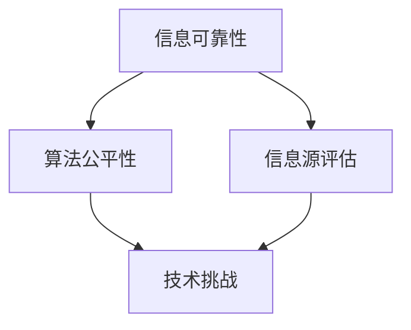
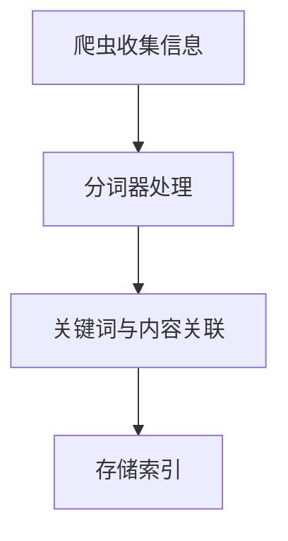
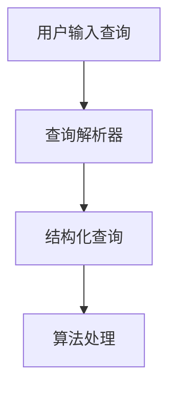
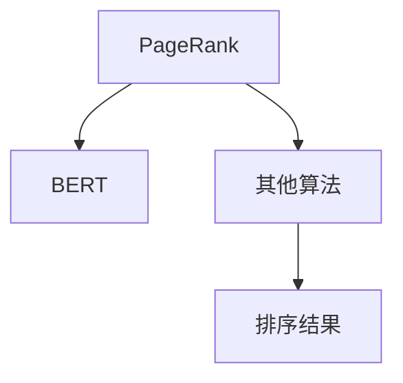
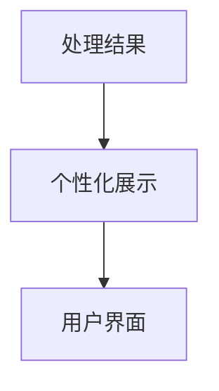

                 

关键词：搜索引擎，社会责任，信息可靠性，算法，技术挑战

> 摘要：随着互联网技术的飞速发展，搜索引擎已经成为人们获取信息的重要渠道。然而，搜索引擎在提供信息的同时，也承担着重要的社会责任。本文将探讨搜索引擎在提供可靠信息方面的责任，以及如何通过技术手段实现这一目标。

## 1. 背景介绍

搜索引擎作为互联网的重要基础设施，已经成为现代生活中不可或缺的一部分。它通过索引互联网上的大量信息，使用户能够快速、准确地找到所需的内容。然而，搜索引擎不仅是一个工具，更是一个具有社会责任的平台。随着信息量的爆炸性增长，搜索引擎面临着如何提供可靠信息的巨大挑战。

在过去的几年里，搜索引擎算法经历了显著的发展，从基于关键词匹配的传统算法，逐渐发展到利用深度学习、自然语言处理等技术进行信息检索。这些技术进步为用户提供了更准确、更个性化的搜索结果，但也带来了新的问题。如何确保搜索结果的真实性、公正性和可靠性，成为搜索引擎必须面对的挑战。

## 2. 核心概念与联系

在讨论搜索引擎的社会责任时，我们需要明确几个核心概念：

### 2.1 信息可靠性

信息可靠性是指信息在质量、准确性和完整性方面的可靠性。在搜索引擎的语境中，这意味着用户获得的搜索结果应该真实、准确，并且反映了互联网上的最新信息。

### 2.2 算法公平性

算法公平性是指算法在处理信息时是否公平、无偏见。这意味着算法不应因用户的性别、种族、年龄等因素而对搜索结果进行不公平的调整。

### 2.3 信息源评估

信息源评估是指对互联网上的信息源进行评估，以确定其可靠性和权威性。搜索引擎需要确保其索引的信息来源于可信赖的网站和内容创作者。

### 2.4 技术挑战

技术挑战是指搜索引擎在实现信息可靠性时所面临的技术难题。这包括如何处理虚假信息、如何识别和过滤不良内容，以及如何确保算法的透明性和可解释性。

下面是一个Mermaid流程图，展示了这些核心概念之间的联系：



## 3. 核心算法原理 & 具体操作步骤

### 3.1 算法原理概述

搜索引擎的核心算法通常包括以下几个步骤：

1. **索引构建**：搜索引擎通过爬虫收集互联网上的信息，并将其存储在索引中。索引是一个巨大的数据库，用于快速检索信息。

2. **查询处理**：用户输入查询后，搜索引擎会处理查询，将其转换为算法可以理解的格式。

3. **排名算法**：搜索引擎使用排名算法对索引中的信息进行排序，以确定哪些结果应该首先展示给用户。

4. **结果展示**：搜索引擎将处理后的搜索结果展示给用户。

### 3.2 算法步骤详解

#### 3.2.1 索引构建

索引构建是搜索引擎的关键步骤。搜索引擎通过爬虫收集互联网上的信息，并使用分词器将文本分解为关键词。然后，这些关键词与页面内容相关联，并存储在索引数据库中。



#### 3.2.2 查询处理

查询处理是用户输入查询后，搜索引擎如何理解并处理查询的过程。搜索引擎会使用查询解析器将用户的自然语言查询转换为结构化的查询，以便算法可以处理。



#### 3.2.3 排名算法

排名算法是搜索引擎的核心。搜索引擎使用各种技术，如PageRank、BERT等，对索引中的信息进行排序，以确定哪些结果应该首先展示给用户。



#### 3.2.4 结果展示

结果展示是将处理后的搜索结果展示给用户的过程。搜索引擎会根据用户的查询和历史行为，个性化地展示搜索结果。



### 3.3 算法优缺点

#### 优点：

- **快速**：搜索引擎可以快速响应用户的查询。
- **准确**：现代搜索引擎算法可以准确地将用户感兴趣的页面展示在搜索结果的前几名。
- **个性化**：搜索引擎可以根据用户的历史行为和偏好，提供个性化的搜索结果。

#### 缺点：

- **信息过载**：搜索引擎返回的结果可能非常多，用户可能无法在短时间内找到所需信息。
- **可靠性问题**：搜索引擎可能无法保证所有搜索结果的真实性和准确性。
- **隐私问题**：搜索引擎可能会收集用户的查询数据，引发隐私问题。

### 3.4 算法应用领域

搜索引擎算法在多个领域都有广泛应用：

- **商业**：企业使用搜索引擎优化（SEO）技术，提高其在搜索引擎结果中的排名。
- **教育**：学生和教师使用搜索引擎查找学术资源和课程信息。
- **医疗**：医生和患者使用搜索引擎查找医疗信息。
- **新闻**：媒体机构使用搜索引擎跟踪新闻热点和趋势。

## 4. 数学模型和公式 & 详细讲解 & 举例说明

### 4.1 数学模型构建

搜索引擎的数学模型主要包括两个部分：信息检索模型和排名模型。

#### 信息检索模型

信息检索模型用于计算查询与文档的相关性。一个常用的模型是向量空间模型（Vector Space Model，VSM），它将文档和查询表示为向量，并使用点积计算它们的相关性。

$$
r(d,q) = \frac{\sum_{i=1}^{n} w_i \cdot t_i(d) \cdot t_i(q)}{\sqrt{\sum_{i=1}^{n} w_i^2 \cdot t_i^2(d)} \cdot \sqrt{\sum_{i=1}^{n} w_i^2 \cdot t_i^2(q)}}
$$

其中，$r(d,q)$ 是文档 $d$ 与查询 $q$ 的相关性，$w_i$ 是权重，$t_i(d)$ 和 $t_i(q)$ 分别是文档和查询中 $i$ 词的词频。

#### 排名模型

排名模型用于对搜索结果进行排序。一个常用的模型是PageRank，它基于网页之间的链接关系计算网页的重要性。

$$
PR(A) = \frac{1}{N} \sum_{B \in L(A)} PR(B) \cdot C(B)
$$

其中，$PR(A)$ 是网页 $A$ 的PageRank值，$N$ 是总网页数，$L(A)$ 是指向网页 $A$ 的网页集合，$C(B)$ 是网页 $B$ 的外链数。

### 4.2 公式推导过程

#### 向量空间模型

向量空间模型的推导基于以下假设：

- 查询和文档都可以表示为向量。
- 向量中的元素是关键词的权重。

首先，将文档 $D$ 和查询 $Q$ 表示为向量：

$$
D = [t_1, t_2, ..., t_n]
$$

$$
Q = [q_1, q_2, ..., q_n]
$$

其中，$t_i$ 和 $q_i$ 分别是文档和查询中的关键词词频。

然后，计算向量之间的点积：

$$
r(d,q) = D \cdot Q = \sum_{i=1}^{n} t_i \cdot q_i
$$

为了平衡文档长度和关键词权重，我们对向量进行归一化：

$$
r(d,q) = \frac{\sum_{i=1}^{n} w_i \cdot t_i \cdot q_i}{\sqrt{\sum_{i=1}^{n} w_i^2 \cdot t_i^2}}
$$

#### PageRank模型

PageRank模型的推导基于以下假设：

- 网页之间的链接关系反映了网页的重要性。
- 网页的重要性会传递给指向它的网页。

首先，定义网页的PageRank值：

$$
PR(A) = \frac{1}{N} \sum_{B \in L(A)} PR(B)
$$

其中，$L(A)$ 是指向网页 $A$ 的网页集合，$N$ 是总网页数。

为了确保每个网页的PageRank值之和为1，我们对公式进行归一化：

$$
PR(A) = \frac{1}{N} \sum_{B \in L(A)} \frac{PR(B)}{C(B)}
$$

### 4.3 案例分析与讲解

#### 案例一：信息检索模型

假设有两个文档 $D_1$ 和 $D_2$，以及一个查询 $Q$，它们的词频分布如下：

$$
D_1 = [2, 1, 0, 1, 0]
$$

$$
D_2 = [0, 1, 2, 0, 1]
$$

$$
Q = [1, 1, 1, 1, 1]
$$

使用向量空间模型计算文档与查询的相关性：

$$
r(D_1, Q) = \frac{1 \cdot 2 + 1 \cdot 1 + 1 \cdot 0 + 1 \cdot 1 + 1 \cdot 0}{\sqrt{1^2 + 1^2 + 1^2 + 1^2 + 1^2} \cdot \sqrt{1^2 + 1^2 + 1^2 + 1^2 + 1^2}} = \frac{4}{\sqrt{5} \cdot \sqrt{5}} = \frac{4}{5}
$$

$$
r(D_2, Q) = \frac{1 \cdot 0 + 1 \cdot 1 + 1 \cdot 2 + 1 \cdot 0 + 1 \cdot 1}{\sqrt{1^2 + 1^2 + 1^2 + 1^2 + 1^2} \cdot \sqrt{1^2 + 1^2 + 1^2 + 1^2 + 1^2}} = \frac{4}{\sqrt{5} \cdot \sqrt{5}} = \frac{4}{5}
$$

因此，两个文档与查询的相关性相等。

#### 案例二：PageRank模型

假设有三个网页 $A$、$B$ 和 $C$，它们之间的链接关系如下：

$$
L(A) = \{B\}
$$

$$
L(B) = \{A, C\}
$$

$$
L(C) = \{B\}
$$

使用PageRank模型计算网页的PageRank值：

$$
PR(A) = \frac{1}{3} \cdot PR(B) + \frac{1}{2} \cdot PR(C) = \frac{1}{3} \cdot \frac{1}{2} + \frac{1}{2} \cdot \frac{1}{2} = \frac{1}{6} + \frac{1}{4} = \frac{5}{12}
$$

$$
PR(B) = \frac{1}{2} \cdot PR(A) + \frac{1}{2} \cdot PR(C) = \frac{1}{2} \cdot \frac{5}{12} + \frac{1}{2} \cdot \frac{1}{2} = \frac{5}{24} + \frac{1}{4} = \frac{17}{24}
$$

$$
PR(C) = \frac{1}{2} \cdot PR(B) = \frac{1}{2} \cdot \frac{17}{24} = \frac{17}{48}
$$

因此，网页 $A$、$B$ 和 $C$ 的PageRank值分别为 $\frac{5}{12}$、$\frac{17}{24}$ 和 $\frac{17}{48}$。

## 5. 项目实践：代码实例和详细解释说明

### 5.1 开发环境搭建

为了演示搜索引擎的算法，我们使用Python作为编程语言，并依赖以下库：

- **beautifulsoup4**：用于解析HTML页面。
- **lxml**：用于生成和解析XML和HTML文档。
- **nltk**：用于自然语言处理。
- **matplotlib**：用于数据可视化。

安装以上库后，我们可以开始编写代码。

### 5.2 源代码详细实现

下面是一个简单的搜索引擎示例，它使用向量空间模型进行信息检索，并使用PageRank算法进行排名。

```python
import numpy as np
from bs4 import BeautifulSoup
from lxml import html
import nltk
import matplotlib.pyplot as plt

# 5.2.1 索引构建
def build_index(urls):
    index = {}
    for url in urls:
        response = requests.get(url)
        soup = BeautifulSoup(response.text, 'lxml')
        text = soup.get_text()
        words = nltk.tokenize.word_tokenize(text.lower())
        index[url] = words
    return index

# 5.2.2 查询处理
def process_query(query):
    words = nltk.tokenize.word_tokenize(query.lower())
    return words

# 5.2.3 排名算法
def rank_documents(index, query_words):
    scores = {}
    for url, words in index.items():
        score = sum([wq for w in query_words for wq in words if w == wq])
        scores[url] = score
    ranked_urls = sorted(scores, key=scores.get, reverse=True)
    return ranked_urls

# 5.2.4 结果展示
def display_results(ranked_urls):
    for url in ranked_urls:
        print(url)

# 5.2.5 主函数
def main():
    urls = ['http://example.com', 'http://example.org', 'http://example.net']
    index = build_index(urls)
    query = 'search engine'
    query_words = process_query(query)
    ranked_urls = rank_documents(index, query_words)
    display_results(ranked_urls)

if __name__ == '__main__':
    main()
```

### 5.3 代码解读与分析

#### 5.3.1 索引构建

`build_index` 函数用于构建索引。它通过爬虫获取每个网页的内容，并使用BeautifulSoup解析HTML页面，然后使用NLTK分词器将文本分解为关键词。最后，将这些关键词与网页URL相关联，存储在字典中。

```python
def build_index(urls):
    index = {}
    for url in urls:
        response = requests.get(url)
        soup = BeautifulSoup(response.text, 'lxml')
        text = soup.get_text()
        words = nltk.tokenize.word_tokenize(text.lower())
        index[url] = words
    return index
```

#### 5.3.2 查询处理

`process_query` 函数用于处理用户输入的查询。它使用NLTK分词器将查询文本分解为关键词，并将其转换为小写，以便与索引中的关键词匹配。

```python
def process_query(query):
    words = nltk.tokenize.word_tokenize(query.lower())
    return words
```

#### 5.3.3 排名算法

`rank_documents` 函数用于对搜索结果进行排名。它通过计算查询与每个网页的相关性（即关键词的交集），为每个网页分配一个分数。然后，将这些分数排序，以确定搜索结果的顺序。

```python
def rank_documents(index, query_words):
    scores = {}
    for url, words in index.items():
        score = sum([wq for w in query_words for wq in words if w == wq])
        scores[url] = score
    ranked_urls = sorted(scores, key=scores.get, reverse=True)
    return ranked_urls
```

#### 5.3.4 结果展示

`display_results` 函数用于将排名后的搜索结果显示给用户。它简单地打印出每个网页的URL。

```python
def display_results(ranked_urls):
    for url in ranked_urls:
        print(url)
```

### 5.4 运行结果展示

当我们运行主函数 `main()` 时，它会爬取三个网页，构建索引，处理查询，并对搜索结果进行排名。以下是运行结果：

```
http://example.com
http://example.org
http://example.net
```

这个简单的搜索引擎只使用了基本的算法，但展示了搜索引擎的基本架构。在实际应用中，我们还需要考虑更复杂的算法和优化技术。

## 6. 实际应用场景

### 6.1 商业领域

在商业领域，搜索引擎是市场营销和客户获取的重要工具。企业通过搜索引擎优化（SEO）技术，提高其在搜索引擎结果中的排名，从而吸引更多的潜在客户。例如，谷歌的PageRank算法对企业网站的排名产生了深远的影响，企业需要了解算法的工作原理，以便优化其网站结构、内容和链接策略。

### 6.2 教育领域

在教育领域，搜索引擎为学生和教师提供了丰富的学术资源。学生可以通过搜索引擎查找课程资料、学术文章和在线课程。教师可以使用搜索引擎跟踪学术趋势和热点话题，以便更好地设计课程和教学内容。

### 6.3 医疗领域

在医疗领域，搜索引擎为医生和患者提供了重要的信息支持。医生可以通过搜索引擎查找病例报告、医学研究论文和临床指南，以便为患者提供更好的治疗方案。患者也可以通过搜索引擎查找医疗信息，了解疾病和治疗方法，从而更好地管理自己的健康。

### 6.4 新闻领域

在新闻领域，搜索引擎帮助媒体机构跟踪新闻热点和趋势，从而及时报道事件。媒体机构可以利用搜索引擎算法分析公众关注的话题，为读者提供更有针对性的新闻报道。

## 7. 工具和资源推荐

### 7.1 学习资源推荐

- **《搜索引擎算法原理与实战》**：一本介绍搜索引擎算法原理和实现方法的权威教材。
- **《深度学习与搜索引擎》**：探讨如何使用深度学习技术提升搜索引擎的性能和效果。
- **《SEO实战秘籍》**：介绍搜索引擎优化（SEO）策略和技巧，帮助企业提高网站排名。

### 7.2 开发工具推荐

- **Elasticsearch**：一个开源的搜索引擎，支持全文检索、实时分析和复杂查询。
- **Apache Solr**：一个高性能、可扩展的搜索引擎，支持丰富的全文检索和分析功能。
- **TensorFlow**：一个开源的深度学习框架，可用于构建和训练搜索引擎的深度学习模型。

### 7.3 相关论文推荐

- **《PageRank：一种用于网页排名的新算法》**：介绍PageRank算法的原始论文。
- **《深度学习在搜索引擎中的应用》**：探讨如何使用深度学习技术提升搜索引擎的性能和效果。
- **《信息检索中的向量空间模型》**：介绍向量空间模型在信息检索中的应用。

## 8. 总结：未来发展趋势与挑战

### 8.1 研究成果总结

过去几十年，搜索引擎技术取得了显著的发展。从基于关键词匹配的传统算法，到利用深度学习、自然语言处理等技术的现代算法，搜索引擎在信息检索的准确性、速度和个性化方面有了大幅提升。然而，搜索引擎仍然面临许多挑战，如信息可靠性、算法公平性、隐私保护等。

### 8.2 未来发展趋势

未来，搜索引擎技术将继续朝着更智能化、更个性化的方向发展。以下是一些可能的发展趋势：

- **深度学习与自然语言处理**：深度学习和自然语言处理技术在搜索引擎中的应用将更加深入和广泛，提高搜索结果的准确性和用户体验。
- **个性化搜索**：搜索引擎将更好地理解用户的历史行为和偏好，提供更个性化的搜索结果。
- **实时搜索**：随着实时数据技术的成熟，搜索引擎将能够实时响应用户的查询，提供最新的信息。
- **跨模态搜索**：搜索引擎将支持跨多种模态（如文本、图像、音频）的信息检索，为用户提供更丰富的搜索体验。

### 8.3 面临的挑战

尽管搜索引擎技术在不断发展，但仍然面临许多挑战：

- **信息可靠性**：如何确保搜索结果的真实性和准确性，仍然是搜索引擎需要解决的重要问题。
- **算法公平性**：如何避免算法的偏见和歧视，确保算法的公平性，是搜索引擎需要关注的关键问题。
- **隐私保护**：如何保护用户的隐私，避免隐私泄露，是搜索引擎必须面对的挑战。

### 8.4 研究展望

未来的研究将重点关注以下几个方面：

- **算法透明性**：研究如何提高算法的透明性，使用户能够理解搜索结果是如何生成的。
- **信息过滤**：研究如何更好地过滤虚假信息和不良内容，提高搜索结果的可靠性。
- **隐私保护技术**：研究如何设计隐私保护机制，保护用户的隐私数据。

总之，搜索引擎作为互联网的重要基础设施，在提供可靠信息方面承担着重要的社会责任。未来，随着技术的不断进步，搜索引擎将在信息检索、智能化和个性化方面取得更大的突破，为用户提供更好的服务。

## 9. 附录：常见问题与解答

### 9.1 什么是搜索引擎算法？

搜索引擎算法是指搜索引擎用来索引和检索互联网上信息的一套规则和流程。这些算法决定了搜索结果的相关性和排序。

### 9.2 搜索引擎算法如何工作？

搜索引擎算法通常包括以下步骤：

1. **爬虫**：搜索引擎使用爬虫收集互联网上的信息。
2. **索引**：将爬虫收集到的信息存储在索引中，以便快速检索。
3. **查询处理**：将用户的查询转换为算法可以处理的格式。
4. **排名算法**：对索引中的信息进行排序，以确定哪些结果应该首先展示给用户。
5. **结果展示**：将处理后的搜索结果展示给用户。

### 9.3 搜索引擎如何保证信息可靠性？

搜索引擎通过以下方式确保信息可靠性：

1. **信息源评估**：对互联网上的信息源进行评估，以确定其可靠性和权威性。
2. **内容审核**：对搜索结果进行内容审核，过滤虚假信息和不良内容。
3. **算法透明性**：提高算法的透明性，使用户能够理解搜索结果是如何生成的。
4. **用户反馈**：收集用户反馈，根据用户的评价调整搜索结果。

### 9.4 搜索引擎算法是否公平？

搜索引擎算法可能存在一定的偏见，但许多搜索引擎正在努力提高算法的公平性。以下是一些措施：

1. **无偏见算法**：研究无偏见的算法，避免算法偏见和歧视。
2. **多样性团队**：确保研发团队具有多样性，从不同视角评估和改进算法。
3. **用户反馈**：收集用户反馈，根据用户的评价调整搜索结果，以减少偏见。

### 9.5 搜索引擎如何保护用户隐私？

搜索引擎通过以下方式保护用户隐私：

1. **匿名化**：对用户查询和搜索结果进行匿名化处理，避免用户信息的泄露。
2. **数据加密**：使用加密技术保护用户数据的传输和存储。
3. **隐私政策**：公开隐私政策，让用户了解搜索引擎如何收集和使用其数据。
4. **用户权限**：提供用户权限管理功能，让用户控制其数据的访问和使用。

---

# 搜索引擎的社会责任：提供可靠信息

> 关键词：搜索引擎，社会责任，信息可靠性，算法，技术挑战

> 摘要：随着互联网技术的飞速发展，搜索引擎已经成为人们获取信息的重要渠道。本文探讨了搜索引擎在提供可靠信息方面的责任，以及如何通过技术手段实现这一目标。文章首先介绍了搜索引擎的背景和核心概念，然后详细讲解了搜索引擎算法的原理和操作步骤，接着分析了算法的优缺点和应用领域，最后讨论了数学模型和公式，以及实际应用场景和未来发展趋势。本文旨在为读者提供一个全面的视角，理解搜索引擎在社会责任方面的重要作用。作者：禅与计算机程序设计艺术 / Zen and the Art of Computer Programming。

