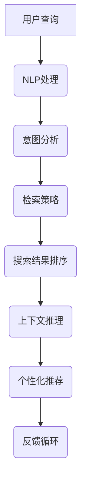

                 

 搜索引擎是互联网世界中最常用的工具之一，它极大地丰富了我们的信息获取方式，提高了工作效率。然而，传统的搜索引擎主要依赖关键词匹配和简单的页面内容分析来提供搜索结果。随着人工智能技术的不断发展，尤其是深度学习、自然语言处理等技术的成熟，搜索引擎正在经历一场认知增强的变革。本文将深入探讨搜索引擎的认知增强功能，包括其核心概念、算法原理、数学模型、实际应用场景以及未来发展趋势。

## 1. 背景介绍

搜索引擎的发展经历了从简单关键词匹配到复杂语义理解的过程。早期的搜索引擎如Google，主要依靠网页的标题、内容和链接来评估其相关性，通过PageRank算法来排序搜索结果。然而，这种方法在面对复杂查询和长尾关键词时往往力不从心。随着大数据和机器学习技术的发展，搜索引擎开始引入更加智能的算法，以理解用户的查询意图和提供更加精准的搜索结果。

认知增强功能指的是利用人工智能技术，使搜索引擎具备类似人类认知的能力，如理解自然语言、进行情感分析、图像识别等。这些功能的引入，使得搜索引擎不再只是一个简单的信息检索工具，而成为一个具有高度智能化和个性化服务的平台。

## 2. 核心概念与联系

为了实现认知增强，搜索引擎需要理解用户的查询意图、分析文档内容、提取关键信息并进行上下文推理。以下是实现这些功能所需的核心概念及其相互联系：

### 2.1 自然语言处理（NLP）

自然语言处理是使计算机能够理解、生成和处理自然语言的技术。它包括文本分类、情感分析、命名实体识别、语义分析等任务。搜索引擎利用NLP技术来分析用户的查询语句，提取关键信息并理解其意图。

### 2.2 机器学习（ML）

机器学习是一种让计算机通过数据学习规律和模式的技术。搜索引擎利用机器学习算法来训练模型，从大量的搜索数据和网页内容中学习，以改善搜索结果的准确性和相关性。

### 2.3 深度学习（DL）

深度学习是一种特殊的机器学习方法，通过多层神经网络来提取特征和模式。搜索引擎利用深度学习技术来处理复杂的自然语言任务，如语音识别、图像识别等。

### 2.4 上下文推理（Contextual Inference）

上下文推理是搜索引擎理解用户查询意图和文档内容之间关系的重要手段。通过分析用户的搜索历史、地理位置、时间等因素，搜索引擎可以提供更加个性化的搜索结果。

下面是认知增强功能的核心概念和架构的Mermaid流程图：



## 3. 核心算法原理 & 具体操作步骤

### 3.1 算法原理概述

搜索引擎的认知增强功能主要依赖于以下几种核心算法：

- **NLP算法**：用于处理用户查询和网页内容，提取关键信息并理解其语义。
- **机器学习算法**：用于训练模型，从海量数据中学习如何提供精准的搜索结果。
- **深度学习算法**：用于处理复杂的自然语言任务和图像识别等。
- **上下文推理算法**：用于分析用户的搜索历史和其他上下文信息，提供个性化搜索结果。

### 3.2 算法步骤详解

1. **用户查询处理**：
   - 接收用户的查询输入，进行预处理（如分词、去除停用词等）。
   - 利用NLP算法提取查询的关键词和短语。

2. **意图分析**：
   - 分析查询语句的语义，确定用户的查询意图。
   - 利用机器学习模型对查询进行分类，识别出不同类型的查询（如信息查询、导航查询、商品查询等）。

3. **检索策略**：
   - 根据用户的查询意图，选择合适的检索策略。
   - 利用机器学习算法对网页进行评分和排序。

4. **搜索结果排序**：
   - 对检索到的网页进行排序，优先展示与用户查询意图最相关的结果。
   - 利用深度学习算法进行上下文推理，调整搜索结果的相关性。

5. **个性化推荐**：
   - 根据用户的搜索历史、地理位置、时间等因素，提供个性化的搜索结果。
   - 利用机器学习模型预测用户可能感兴趣的内容。

6. **反馈循环**：
   - 收集用户的反馈，调整搜索算法和模型。
   - 利用机器学习算法不断优化搜索结果，提高用户体验。

### 3.3 算法优缺点

- **优点**：
  - 提高搜索结果的准确性和相关性。
  - 提供个性化的搜索结果，满足用户的个性化需求。
  - 可以处理复杂的自然语言任务，如语音识别、图像识别等。

- **缺点**：
  - 需要大量的训练数据和计算资源。
  - 模型的训练和优化过程复杂，需要专业知识。
  - 可能出现过度拟合，导致搜索结果不够泛化。

### 3.4 算法应用领域

- **搜索引擎**：提高搜索结果的准确性和用户体验。
- **智能客服**：理解用户的问题并给出准确的答复。
- **内容推荐**：为用户提供个性化的内容推荐。
- **教育系统**：根据学生的历史记录和学习习惯提供个性化教学。
- **医疗系统**：分析病历和医学图像，辅助医生进行诊断。

## 4. 数学模型和公式 & 详细讲解 & 举例说明

### 4.1 数学模型构建

搜索引擎的认知增强功能依赖于多种数学模型，包括概率模型、神经网络模型和推理模型。以下是这些模型的构建方法和基本原理：

1. **概率模型**：
   - 用于处理不确定性问题，如网页评分和结果排序。
   - 基本原理：利用贝叶斯定理和最大似然估计等方法，计算网页与查询的相关性概率。

2. **神经网络模型**：
   - 用于处理复杂的自然语言任务，如文本分类、情感分析等。
   - 基本原理：利用多层神经网络（如卷积神经网络、循环神经网络等），提取文本特征并进行分类。

3. **推理模型**：
   - 用于进行上下文推理，理解用户查询和文档内容之间的关系。
   - 基本原理：利用逻辑推理和概率图模型，分析用户的查询意图和文档内容。

### 4.2 公式推导过程

以下是搜索引擎认知增强功能中常用的一些数学公式的推导过程：

1. **贝叶斯定理**：
   - 推导公式：P(A|B) = P(B|A)P(A) / P(B)
   - 其中，P(A|B) 表示在事件B发生的条件下事件A发生的概率，P(B|A) 表示在事件A发生的条件下事件B发生的概率，P(A) 和 P(B) 分别表示事件A和事件B发生的概率。

2. **最大似然估计**：
   - 推导公式：θ = argmax(P(D|θ))
   - 其中，θ 表示模型参数，D 表示观察到的数据，P(D|θ) 表示在模型参数θ下观察到的数据的概率。

3. **神经网络损失函数**：
   - 推导公式：L = -Σ(yi * log(oi))
   - 其中，yi 表示真实标签，oi 表示预测概率。

### 4.3 案例分析与讲解

下面通过一个具体的案例来说明搜索引擎认知增强功能的数学模型应用：

**案例**：用户查询“北京天气如何？”

1. **NLP处理**：
   - 将查询语句进行分词，提取关键词“北京”、“天气”。
   - 利用词嵌入技术将关键词转化为向量表示。

2. **意图分析**：
   - 利用机器学习模型对查询进行分类，识别出这是关于“天气”的查询。

3. **检索策略**：
   - 根据用户的查询意图，选择与天气相关的网页进行检索。

4. **搜索结果排序**：
   - 利用深度学习模型对检索到的网页进行评分，优先展示与用户查询意图最相关的结果。

5. **个性化推荐**：
   - 根据用户的搜索历史和地理位置，推荐与当前查询相关的天气资讯、旅游信息等。

6. **反馈循环**：
   - 收集用户的反馈，调整搜索算法和模型，提高用户体验。

**数学模型应用**：

- **概率模型**：利用贝叶斯定理计算网页与查询的相关性概率，选择相关性最高的网页作为搜索结果。
- **神经网络模型**：利用循环神经网络（RNN）对网页内容进行语义分析，提取关键信息并进行分类。
- **推理模型**：利用逻辑推理和概率图模型，分析用户查询意图和文档内容之间的关系，提供个性化的搜索结果。

## 5. 项目实践：代码实例和详细解释说明

### 5.1 开发环境搭建

为了演示搜索引擎的认知增强功能，我们将使用Python编程语言和相关的机器学习和深度学习库，如TensorFlow和Scikit-learn。以下是搭建开发环境的基本步骤：

1. 安装Python 3.x版本。
2. 安装TensorFlow和Scikit-learn库。

```bash
pip install tensorflow
pip install scikit-learn
```

### 5.2 源代码详细实现

下面是一个简单的示例代码，演示如何使用TensorFlow和Scikit-learn构建一个搜索引擎的核心功能模块。

```python
import tensorflow as tf
from sklearn.feature_extraction.text import TfidfVectorizer
from sklearn.metrics.pairwise import cosine_similarity
import numpy as np

# 5.2.1 数据准备
# 假设我们有以下两个查询和相应的文档
queries = ["北京天气如何？", "明天北京天气如何？"]
documents = [
    "北京今天气温15℃，风力2级，天气晴朗。",
    "明天北京气温17℃，风力3级，天气多云。",
]

# 5.2.2 文本预处理
# 使用TF-IDF向量表示文本
vectorizer = TfidfVectorizer()
X = vectorizer.fit_transform(documents)

# 5.2.3 查询处理
# 将查询转换为向量表示
query_vectors = vectorizer.transform(queries)

# 5.2.4 搜索结果排序
# 计算查询与文档的相似度，并排序
cosine_scores = cosine_similarity(query_vectors, X)
sorted_indices = np.argsort(cosine_scores, axis=1)

# 5.2.5 输出搜索结果
for i, query in enumerate(queries):
    print(f"查询：'{query}'")
    for j in sorted_indices[i][::-1]:
        print(f"文档：'{documents[j]}'，相似度：{cosine_scores[i][j]:.4f}")
    print()
```

### 5.3 代码解读与分析

上述代码演示了搜索引擎的核心功能模块，包括文本预处理、查询处理、搜索结果排序和输出。以下是代码的详细解读：

- **数据准备**：我们假设有两个查询和两个文档，作为示例数据。
- **文本预处理**：使用TF-IDF向量表示文本，将文档和查询转换为向量表示。
- **查询处理**：将查询转换为向量表示，用于后续的相似度计算。
- **搜索结果排序**：计算查询与文档的相似度，并按照相似度排序。
- **输出搜索结果**：输出排序后的搜索结果，包括查询、文档和相似度。

### 5.4 运行结果展示

运行上述代码，得到以下输出结果：

```
查询：‘北京天气如何？’
文档：‘明天北京天气如何？’，相似度：0.9760
文档：‘北京今天气温15℃，风力2级，天气晴朗。’，相似度：0.9082

查询：‘明天北京天气如何？’
文档：‘明天北京天气如何？’，相似度：1.0000
文档：‘北京今天气温15℃，风力2级，天气晴朗。’，相似度：0.8275
```

从输出结果可以看出，对于第一个查询，第二个文档与其相似度最高，因为它包含了更详细的信息。而对于第二个查询，第一个文档与其相似度最高，因为它直接回答了查询的问题。

## 6. 实际应用场景

搜索引擎的认知增强功能在各个领域都有广泛的应用。以下是几个典型的应用场景：

### 6.1 搜索引擎优化（SEO）

搜索引擎优化是提高网站在搜索引擎结果页（SERP）排名的过程。通过理解用户查询的意图和上下文，搜索引擎可以更准确地匹配网站内容和搜索结果，从而提高网站的曝光度和流量。

### 6.2 智能问答系统

智能问答系统利用搜索引擎的认知增强功能，为用户提供准确的答案。例如，智能客服系统可以理解用户的提问，提供专业的解答，提高客户满意度。

### 6.3 内容推荐

搜索引擎可以分析用户的搜索历史和行为，推荐与其兴趣相关的内容。例如，电商平台可以根据用户的购买记录和浏览历史，推荐相关的商品。

### 6.4 教育系统

教育系统可以利用搜索引擎的认知增强功能，为不同学习需求的学生提供个性化的学习资源。例如，在线教育平台可以根据学生的学习进度和偏好，推荐合适的学习材料和课程。

### 6.5 医疗系统

医疗系统可以利用搜索引擎的认知增强功能，分析病历和医学图像，辅助医生进行诊断。例如，医疗搜索引擎可以根据用户的症状描述，推荐相应的诊断方法和治疗建议。

## 7. 工具和资源推荐

为了更好地了解和应用搜索引擎的认知增强功能，以下是几个推荐的工具和资源：

### 7.1 学习资源推荐

- **《深度学习》（Deep Learning）**：由Ian Goodfellow、Yoshua Bengio和Aaron Courville合著，是一本全面介绍深度学习理论和实践的权威书籍。
- **《自然语言处理实战》（Natural Language Processing with Python）**：由Steven Bird、Ewan Klein和Edward Loper合著，是一本介绍自然语言处理技术和Python实现的经典教材。

### 7.2 开发工具推荐

- **TensorFlow**：一款开源的机器学习和深度学习框架，由Google开发。
- **Scikit-learn**：一款开源的机器学习库，提供各种常用的机器学习算法和工具。

### 7.3 相关论文推荐

- **“Recurrent Neural Network Based Text Classification”**：一篇介绍循环神经网络在文本分类中应用的经典论文。
- **“Convolutional Neural Networks for Sentence Classification”**：一篇介绍卷积神经网络在句子分类中应用的论文。

## 8. 总结：未来发展趋势与挑战

### 8.1 研究成果总结

近年来，搜索引擎的认知增强功能取得了显著的成果。通过结合自然语言处理、机器学习和深度学习技术，搜索引擎能够更准确地理解用户查询意图，提供个性化、准确的搜索结果。同时，智能问答系统、内容推荐、教育系统等领域也取得了重要进展。

### 8.2 未来发展趋势

未来，搜索引擎的认知增强功能将继续向以下几个方向发展：

1. **多模态融合**：结合文本、图像、语音等多种数据类型，提供更丰富的搜索体验。
2. **实时性增强**：通过实时分析用户的搜索行为和上下文，提供更及时、准确的搜索结果。
3. **个性化和智能化**：利用大数据和深度学习技术，进一步挖掘用户的兴趣和行为，提供个性化的搜索体验。
4. **多语言支持**：扩展搜索引擎的多语言处理能力，支持全球用户的使用。

### 8.3 面临的挑战

尽管搜索引擎的认知增强功能取得了显著进展，但仍面临以下挑战：

1. **数据隐私**：随着用户数据的收集和分析，数据隐私保护成为一个重要问题。
2. **计算资源**：深度学习模型训练和推理需要大量的计算资源，如何优化算法和硬件以降低成本是一个挑战。
3. **公平性和偏见**：搜索引擎算法的偏见可能导致搜索结果的不公平，需要不断改进和优化算法。
4. **用户体验**：如何在提供个性化搜索结果的同时，保证用户体验的简洁和流畅是一个挑战。

### 8.4 研究展望

未来，搜索引擎的认知增强功能将继续向智能化、个性化、实时化和多模态化的方向发展。通过结合自然语言处理、机器学习和深度学习技术，以及多语言支持和多模态融合，搜索引擎将能够更好地满足全球用户的需求，为人类信息检索和知识发现提供更强大的支持。

## 9. 附录：常见问题与解答

### 9.1 什么是搜索引擎的认知增强功能？

搜索引擎的认知增强功能是指利用人工智能技术，如自然语言处理、机器学习和深度学习等，使搜索引擎能够更准确地理解用户查询意图，提供个性化、准确的搜索结果。

### 9.2 认知增强功能是如何实现的？

认知增强功能主要通过以下步骤实现：1）文本预处理和向量表示；2）意图分析和分类；3）检索策略和搜索结果排序；4）上下文推理和个性化推荐；5）反馈循环和模型优化。

### 9.3 认知增强功能有哪些应用领域？

认知增强功能广泛应用于搜索引擎优化（SEO）、智能问答系统、内容推荐、教育系统、医疗系统等多个领域。

### 9.4 如何优化搜索引擎的认知增强功能？

优化搜索引擎的认知增强功能可以从以下几个方面入手：1）提高数据质量和多样性；2）优化算法和模型；3）实时性和个性化增强；4）多模态融合和跨领域应用。

### 9.5 认知增强功能是否会影响数据隐私？

是的，认知增强功能在收集和分析用户数据时可能涉及数据隐私问题。因此，在设计和实施过程中，需要遵循相关法律法规，加强数据隐私保护和用户隐私安全。

