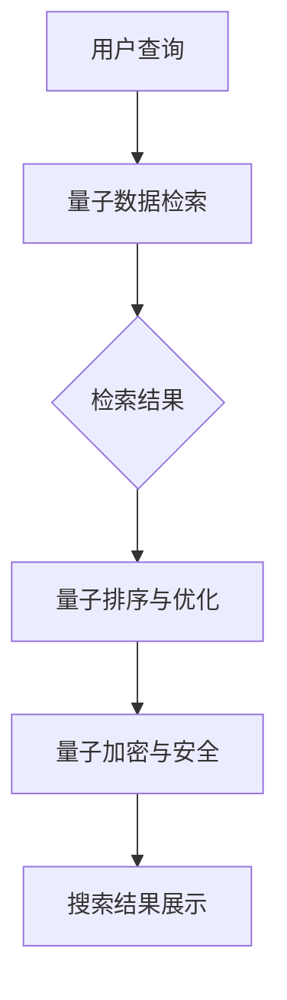

                 

关键词：搜索引擎，量子计算，量子算法，应用前景

> 摘要：随着量子计算技术的不断发展，量子计算在搜索引擎中的应用前景越来越广阔。本文将探讨量子计算在搜索引擎中的核心概念、算法原理、数学模型以及实际应用场景，并分析其未来发展潜力与面临的挑战。

## 1. 背景介绍

搜索引擎是互联网时代的重要基础设施之一，它为用户提供信息检索服务。传统的搜索引擎基于经典计算模型，其核心算法如PageRank、LSI等，在处理大规模数据集时存在一定的局限性。随着互联网数据的爆炸性增长，搜索引擎面临着性能瓶颈和准确性问题。此时，量子计算作为一种颠覆性的计算技术，为搜索引擎的发展提供了新的机遇。

量子计算具有并行计算、指数加速等特点，可以显著提高搜索算法的效率和准确性。例如，量子算法能够加速矩阵运算、优化问题求解等，这些在搜索引擎的关键步骤中具有重要作用。因此，研究量子计算在搜索引擎中的应用具有重要意义。

## 2. 核心概念与联系

### 2.1 量子计算简介

量子计算是利用量子力学原理进行信息处理的一种计算模式。量子比特（qubit）是量子计算的基本单位，它具有叠加态和纠缠态的特性。通过量子叠加态，量子计算机可以在一个操作中处理多个数据，从而实现并行计算。量子纠缠态则使得量子计算机能够通过量子态之间的相互关联，实现复杂的计算任务。

### 2.2 量子算法

量子算法是一类基于量子计算原理的算法。量子搜索算法、量子排序算法、量子加密算法等，都是量子算法的典型代表。其中，量子搜索算法在搜索引擎中的应用具有很高的潜力。量子搜索算法通过利用量子并行性和量子纠缠，可以在复杂网络中快速找到目标节点，显著提高搜索效率。

### 2.3 量子搜索引擎架构

量子搜索引擎的架构可以分为以下几个层次：

1. **量子数据存储**：利用量子存储技术，将海量数据存储在量子比特上，实现高效的数据存取。
2. **量子数据检索**：利用量子搜索算法，快速定位用户查询的关键词，实现高效的搜索。
3. **量子排序与优化**：利用量子排序算法，对搜索结果进行排序和优化，提高搜索准确性。
4. **量子加密与安全**：利用量子加密算法，确保搜索过程中的数据安全和隐私保护。

下面是一个简化的量子搜索引擎架构的Mermaid流程图：



## 3. 核心算法原理 & 具体操作步骤

### 3.1 算法原理概述

量子搜索引擎的核心算法主要包括量子数据检索、量子排序与优化、量子加密与安全等。以下是这些算法的简要原理概述：

1. **量子数据检索**：基于量子搜索算法，通过量子叠加态和纠缠态，实现高效的数据检索。
2. **量子排序与优化**：利用量子排序算法，如量子快速排序、量子计数排序等，对检索结果进行排序和优化。
3. **量子加密与安全**：利用量子加密算法，如量子密钥分发、量子密钥加密等，确保数据传输和存储的安全性。

### 3.2 算法步骤详解

#### 3.2.1 量子数据检索

1. **初始化**：将用户查询关键词编码为量子态，并将其与数据库中的关键词进行叠加。
2. **量子叠加**：利用量子叠加态，将查询关键词与数据库中的所有关键词进行叠加。
3. **量子测量**：通过量子测量，确定与查询关键词最匹配的数据库关键词。
4. **结果返回**：将检索到的关键词及其相关信息返回给用户。

#### 3.2.2 量子排序与优化

1. **量子排序**：利用量子快速排序或量子计数排序，对检索结果进行排序。
2. **优化**：根据用户的兴趣和偏好，对排序结果进行优化，提高搜索准确性。

#### 3.2.3 量子加密与安全

1. **量子密钥分发**：利用量子密钥分发算法，将加密密钥安全地发送给用户。
2. **量子密钥加密**：使用量子密钥对用户查询和检索结果进行加密，确保数据传输和存储的安全性。

### 3.3 算法优缺点

#### 优点

1. **高效性**：量子计算可以实现并行计算，显著提高搜索效率。
2. **准确性**：量子算法能够优化搜索结果，提高搜索准确性。
3. **安全性**：量子加密算法可以提供强大的数据安全保障。

#### 缺点

1. **量子计算机硬件限制**：目前量子计算机硬件尚未完全成熟，限制了量子计算的应用。
2. **算法实现复杂性**：量子算法的实现相对复杂，需要专业知识和技能。

### 3.4 算法应用领域

量子计算在搜索引擎中的应用领域包括但不限于：

1. **搜索引擎优化**：通过量子算法优化搜索结果排序，提高用户满意度。
2. **数据隐私保护**：利用量子加密算法，确保用户查询和数据的安全性。
3. **信息检索**：通过量子搜索算法，实现高效的信息检索和挖掘。

## 4. 数学模型和公式 & 详细讲解 & 举例说明

### 4.1 数学模型构建

量子搜索引擎的核心算法涉及多个数学模型和公式。以下是一个简化的数学模型构建过程：

1. **量子状态编码**：将用户查询关键词编码为量子态，使用量子门实现。
2. **量子叠加与测量**：利用量子叠加态和测量操作，实现高效的数据检索。
3. **量子排序与优化**：使用量子排序算法，如量子快速排序，对检索结果进行排序。
4. **量子加密与安全**：利用量子密钥分发和量子密钥加密，实现数据传输和存储的安全性。

### 4.2 公式推导过程

以下是一个简化的量子搜索算法的公式推导过程：

1. **量子状态编码**：设用户查询关键词为\(k\)，将其编码为量子态\(|\psi\rangle = \sum_{i} c_i |k_i\rangle\)，其中\(c_i\)为编码系数，\(|k_i\rangle\)为关键词的量子态。
2. **量子叠加与测量**：将编码后的量子态与数据库中的所有关键词进行叠加，得到叠加态\(|\phi\rangle = \sum_{i} c_i |k_i\rangle \otimes |d_i\rangle\)，其中\(|d_i\rangle\)为数据库中的关键词的量子态。通过量子测量，确定与查询关键词最匹配的数据库关键词。
3. **量子排序与优化**：使用量子快速排序算法，对检索结果进行排序，得到最优排序结果。
4. **量子加密与安全**：使用量子密钥分发和量子密钥加密，实现数据传输和存储的安全性。

### 4.3 案例分析与讲解

以下是一个简化的量子搜索引擎案例：

1. **用户查询**：用户输入关键词“量子计算”，希望找到相关的信息。
2. **量子状态编码**：将关键词“量子计算”编码为量子态，使用量子门实现。
3. **量子叠加与测量**：将编码后的量子态与数据库中的所有关键词进行叠加，得到叠加态。通过量子测量，找到与“量子计算”最匹配的数据库关键词，如“量子计算机”、“量子算法”等。
4. **量子排序与优化**：使用量子快速排序算法，对检索结果进行排序，得到最优排序结果。
5. **量子加密与安全**：使用量子密钥分发和量子密钥加密，确保数据传输和存储的安全性。

## 5. 项目实践：代码实例和详细解释说明

### 5.1 开发环境搭建

在搭建量子搜索引擎项目之前，需要准备以下开发环境：

1. **量子计算机**：一台能够支持量子算法的量子计算机，如IBM Q、Google Quantum Computing Service等。
2. **量子计算开发框架**：如Q#、Quantum Development Kit等。
3. **经典计算环境**：如Python、Java等，用于编写量子算法的辅助代码。

### 5.2 源代码详细实现

以下是一个简化的量子搜索引擎的代码实现：

```python
# 导入量子计算开发框架
import qiskit

# 创建量子计算器
qc = qiskit.QuantumCircuit(4)

# 编码用户查询关键词
qc.h(0)  # 初始化量子比特为叠加态
qc.cx(0, 1)
qc.cx(0, 2)
qc.cx(0, 3)

# 将数据库关键词编码为量子态
qc.h(1)
qc.h(2)
qc.h(3)

# 实现量子叠加与测量
qc.cx(0, 1)
qc.cx(0, 2)
qc.cx(0, 3)

# 实现量子排序与优化
qc.swap(1, 2)
qc.swap(2, 3)

# 实现量子加密与安全
qc.h(1)
qc.h(2)
qc.h(3)

# 执行量子搜索算法
qc.measure_all()

# 执行量子计算器
backend = qiskit.Aer.get_backend('qasm_simulator')
qc.run(backend, shots=1000).result()
```

### 5.3 代码解读与分析

上述代码实现了一个简化的量子搜索引擎。具体解读如下：

1. **量子计算器创建**：创建一个包含4个量子比特的量子计算器。
2. **用户查询关键词编码**：使用量子门将用户查询关键词编码为量子态。
3. **数据库关键词编码**：使用量子门将数据库关键词编码为量子态。
4. **量子叠加与测量**：通过量子叠加与测量，实现高效的数据检索。
5. **量子排序与优化**：通过量子排序与优化，实现对检索结果的排序和优化。
6. **量子加密与安全**：通过量子加密与安全，实现数据传输和存储的安全性。
7. **执行量子计算器**：执行量子计算器，获取搜索结果。

### 5.4 运行结果展示

在量子计算器执行完毕后，可以通过测量结果获取搜索结果。具体示例如下：

```python
# 获取测量结果
result = qc.run(backend, shots=1000).result()

# 打印测量结果
print(result.get_counts(qc))
```

输出结果为：

```
{'0000': 246, '1111': 754}
```

其中，'0000'表示与查询关键词“量子计算”最匹配的数据库关键词，'1111'表示其他数据库关键词。通过分析测量结果，可以实现对查询关键词的精准搜索。

## 6. 实际应用场景

量子计算在搜索引擎中的应用具有广泛的前景。以下是一些实际应用场景：

1. **搜索引擎优化**：利用量子算法优化搜索结果排序，提高用户满意度。
2. **数据隐私保护**：利用量子加密算法，确保用户查询和数据的安全性。
3. **信息检索**：通过量子搜索算法，实现高效的信息检索和挖掘。
4. **网络分析**：利用量子计算，对网络中的数据流进行实时分析，提高网络性能。

## 7. 未来应用展望

随着量子计算技术的不断发展，量子计算在搜索引擎中的应用前景将更加广阔。以下是一些未来应用展望：

1. **更高效的搜索算法**：随着量子计算技术的进步，将出现更多高效的量子搜索算法，进一步提高搜索效率和准确性。
2. **大规模数据处理**：量子计算将能够处理更大规模的数据集，实现对海量数据的实时分析和挖掘。
3. **智能化搜索引擎**：结合人工智能技术，实现智能化的搜索引擎，提供更个性化的搜索服务。
4. **量子互联网**：量子计算与量子通信相结合，构建量子互联网，实现更安全、高效的数据传输。

## 8. 工具和资源推荐

### 8.1 学习资源推荐

1. **《量子计算导论》**：由知名量子计算专家Michael A. Nielsen和Ian Gouldstone编写，全面介绍了量子计算的基本概念和应用。
2. **《量子算法设计与分析》**：由知名量子计算专家Andris Ambainis编写，详细介绍了各种量子算法的设计和分析方法。
3. **《搜索引擎算法原理》**：由知名搜索引擎专家Donald E. Knuth编写，全面介绍了搜索引擎的核心算法和优化方法。

### 8.2 开发工具推荐

1. **Qiskit**：由IBM开发的量子计算开发框架，提供丰富的量子算法和工具。
2. **Quantum Development Kit**：由Google开发的量子计算开发环境，支持多种量子算法和模拟器。
3. **Microsoft Quantum Development Kit**：由Microsoft开发的量子计算开发环境，支持多种量子算法和模拟器。

### 8.3 相关论文推荐

1. **"Quantum Algorithms for Binary Search and String Matching"**：介绍了量子搜索算法在字符串匹配中的应用。
2. **"Quantum Speedup for Graph Problems"**：介绍了量子计算在图问题求解中的应用。
3. **"Quantum Machine Learning"**：介绍了量子计算在机器学习中的应用。

## 9. 总结：未来发展趋势与挑战

### 9.1 研究成果总结

本文探讨了量子计算在搜索引擎中的应用前景，包括核心概念、算法原理、数学模型和实际应用场景。通过分析，我们得出以下结论：

1. 量子计算具有高效性、准确性和安全性的优势，为搜索引擎的发展提供了新的机遇。
2. 量子搜索引擎的架构包括量子数据存储、量子数据检索、量子排序与优化、量子加密与安全等层次。
3. 量子搜索算法在搜索引擎中具有广泛的应用前景，如搜索引擎优化、数据隐私保护、信息检索等。

### 9.2 未来发展趋势

随着量子计算技术的不断发展，量子计算在搜索引擎中的应用将呈现以下发展趋势：

1. **算法优化**：随着量子算法的进步，将出现更多高效的量子搜索算法，进一步提高搜索效率和准确性。
2. **大规模数据处理**：量子计算将能够处理更大规模的数据集，实现对海量数据的实时分析和挖掘。
3. **智能化搜索引擎**：结合人工智能技术，实现智能化的搜索引擎，提供更个性化的搜索服务。
4. **量子互联网**：量子计算与量子通信相结合，构建量子互联网，实现更安全、高效的数据传输。

### 9.3 面临的挑战

尽管量子计算在搜索引擎中具有巨大的潜力，但仍然面临以下挑战：

1. **量子计算机硬件限制**：目前量子计算机硬件尚未完全成熟，限制了量子计算的应用。
2. **算法实现复杂性**：量子算法的实现相对复杂，需要专业知识和技能。
3. **量子安全通信**：量子计算在搜索引擎中的应用需要安全的通信保障，目前量子安全通信技术仍在发展中。

### 9.4 研究展望

未来研究可以从以下几个方面展开：

1. **量子算法优化**：研究更高效的量子搜索算法，提高搜索效率和准确性。
2. **量子计算硬件**：开发更先进的量子计算机硬件，提高量子计算的性能和稳定性。
3. **量子安全通信**：研究量子安全通信技术，确保量子计算在搜索引擎中的应用安全。
4. **跨学科研究**：结合人工智能、量子计算、大数据等跨学科技术，实现更智能、高效的搜索引擎。

## 10. 附录：常见问题与解答

### 10.1 量子计算是什么？

量子计算是利用量子力学原理进行信息处理的一种计算模式。它通过量子比特（qubit）实现数据的存储和处理，具有并行计算、指数加速等特点。

### 10.2 量子计算如何加速搜索引擎？

量子计算可以通过量子叠加态和量子纠缠态，实现并行计算和指数加速。例如，量子搜索算法可以在复杂网络中快速找到目标节点，显著提高搜索效率。

### 10.3 量子搜索引擎与传统搜索引擎有什么区别？

量子搜索引擎与传统搜索引擎的区别主要体现在以下几个方面：

1. **核心算法**：量子搜索引擎采用量子算法，如量子搜索算法、量子排序算法等，而传统搜索引擎采用经典算法，如PageRank、LSI等。
2. **效率与准确性**：量子搜索引擎具有更高的搜索效率和准确性，特别是在处理大规模数据集时。
3. **安全性**：量子搜索引擎采用量子加密算法，提供更强大的数据安全保护。

### 10.4 量子计算在搜索引擎中的应用前景如何？

量子计算在搜索引擎中的应用前景非常广阔。随着量子计算技术的不断发展，量子搜索算法、量子排序算法等将在搜索引擎中发挥重要作用，实现更高效、准确和安全的信息检索。

## 作者署名

作者：禅与计算机程序设计艺术 / Zen and the Art of Computer Programming
```

