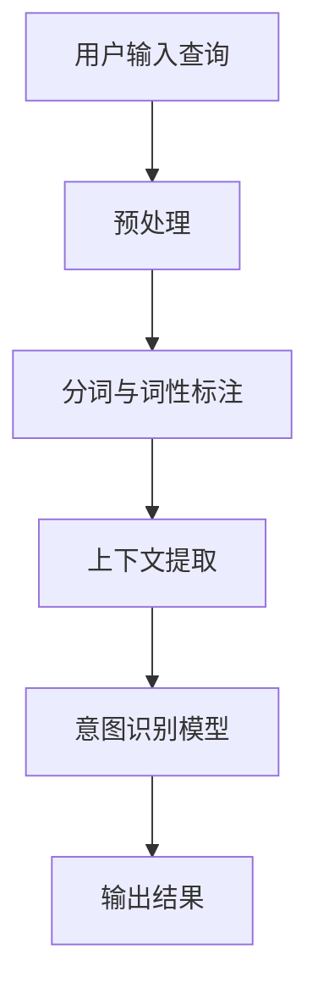

                 

 关键词：搜索意图识别，大模型，语义理解，自然语言处理，人工智能，算法原理，应用实践，未来展望

> 摘要：本文旨在探讨搜索意图识别在人工智能领域的最新进展，尤其是大模型在语义理解方面的突破。通过深入分析核心概念、算法原理、数学模型以及实际应用案例，本文将为读者提供一个全面的技术视角，助力理解这一前沿技术的魅力与挑战。

## 1. 背景介绍

随着互联网的快速发展，信息检索成为了用户获取信息的重要方式。然而，传统的基于关键词匹配的检索方法已无法满足用户日益增长的需求。用户在搜索框中输入的查询并非总是明确和精确的，往往包含模糊、含糊或冗长的表述。这种情况下，如何理解用户的真实意图成为了一个关键问题。

搜索意图识别，即通过分析用户的查询，理解其潜在需求，从而提供更准确、更个性化的搜索结果。这一过程涉及到自然语言处理、机器学习、数据挖掘等多个领域的技术融合。

近年来，随着深度学习技术的迅猛发展，大模型在语义理解方面取得了显著突破。这些模型能够通过海量数据的学习，捕捉到语言中的复杂模式，提高对用户意图的识别准确率。本文将围绕这一主题，探讨大模型在搜索意图识别中的应用。

## 2. 核心概念与联系

### 2.1 搜索意图识别的定义

搜索意图识别是指从用户的查询中识别其真正的信息需求，并将其转化为机器可理解的形式。简单来说，就是让机器明白用户想要什么，从而提供更相关的搜索结果。

### 2.2 语义理解的挑战

语义理解是搜索意图识别的核心环节，但同时也是最具挑战性的部分。挑战包括但不限于：

- 语言的多义性：同一个词在不同语境下可能有不同的含义。
- 语言的不确定性：用户查询可能包含模糊、不完整或冗长的表述。
- 上下文依赖：理解查询的含义往往需要考虑上下文信息。

### 2.3 大模型的作用

大模型，如深度学习中的Transformer模型，通过在海量数据上的训练，能够捕捉到语言中的复杂模式。这些模型具有以下几个显著优势：

- 高度并行化：能够处理大规模数据，提高计算效率。
- 强泛化能力：通过学习通用特征，可以应对各种不同的任务。
- 自动特征提取：不需要手动设计特征，大大降低了模型设计的复杂性。

### 2.4 Mermaid流程图

下面是一个用于描述搜索意图识别流程的Mermaid流程图：



## 3. 核心算法原理 & 具体操作步骤

### 3.1 算法原理概述

搜索意图识别的核心在于将用户的查询转化为机器可理解的形式，从而进行意图识别。这通常涉及到以下几个步骤：

1. **预处理**：对用户查询进行清洗、分词和词性标注。
2. **上下文提取**：从用户的查询和历史记录中提取相关上下文信息。
3. **意图识别**：利用深度学习模型对提取的上下文信息进行处理，识别用户的意图。
4. **结果输出**：根据识别出的意图，返回相应的搜索结果。

### 3.2 算法步骤详解

#### 3.2.1 预处理

预处理是搜索意图识别的第一步，主要包括以下任务：

- **查询清洗**：去除查询中的噪声，如停用词、标点符号等。
- **分词**：将查询分解成一系列单词或短语。
- **词性标注**：为每个单词分配词性，如名词、动词、形容词等。

#### 3.2.2 上下文提取

上下文提取是理解用户查询的关键，其任务是从用户的查询和历史记录中提取相关信息。这通常涉及到以下方法：

- **词嵌入**：将单词转化为向量表示，从而捕捉词与词之间的关系。
- **序列模型**：如RNN或Transformer，用于捕捉查询序列中的上下文信息。

#### 3.2.3 意图识别

意图识别是搜索意图识别的核心，其任务是根据提取的上下文信息，识别用户的意图。这通常涉及到以下模型：

- **分类模型**：如SVM、决策树等，用于将查询分类到不同的意图类别。
- **序列标注模型**：如BiLSTM-CRF，用于对查询序列进行意图标注。

#### 3.2.4 结果输出

根据识别出的意图，系统将返回相应的搜索结果。这通常包括以下步骤：

- **结果排序**：根据搜索结果的相关性进行排序。
- **结果呈现**：将排序后的结果呈现给用户。

### 3.3 算法优缺点

#### 优点

- **高效性**：大模型能够处理大规模数据，提高计算效率。
- **泛化能力**：通过学习通用特征，能够应对各种不同的任务。
- **自动特征提取**：不需要手动设计特征，大大降低了模型设计的复杂性。

#### 缺点

- **数据需求**：大模型需要大量数据来训练，数据获取和存储成本较高。
- **计算资源**：大模型训练和推理需要大量计算资源，对硬件要求较高。

### 3.4 算法应用领域

搜索意图识别算法在多个领域都有广泛应用，包括但不限于：

- **搜索引擎**：提高搜索结果的准确性和相关性。
- **虚拟助手**：如智能音箱、聊天机器人等，提供更自然的交互体验。
- **电子商务**：帮助用户找到所需商品，提高用户体验。

## 4. 数学模型和公式 & 详细讲解 & 举例说明

### 4.1 数学模型构建

搜索意图识别的数学模型通常包括以下部分：

- **词嵌入**：将单词转化为向量表示，通常使用Word2Vec、GloVe等方法。
- **序列模型**：如RNN、LSTM、Transformer等，用于捕捉查询序列中的上下文信息。
- **分类模型**：如SVM、决策树等，用于将查询分类到不同的意图类别。

### 4.2 公式推导过程

假设我们使用一个深度神经网络进行意图识别，其损失函数为交叉熵损失。给定一个查询序列\(X = \{x_1, x_2, ..., x_n\}\)，其对应的真实意图标签为\(Y\)，网络的输出为\(O = \{o_1, o_2, ..., o_m\}\)，其中\(o_i\)表示第\(i\)个意图类别的概率。交叉熵损失函数的公式如下：

$$
L = -\sum_{i=1}^{m} y_i \log(o_i)
$$

其中，\(y_i\)是真实意图标签\(Y\)对应的第\(i\)个元素，如果\(y_i = 1\)，否则为0。

### 4.3 案例分析与讲解

#### 案例背景

假设用户在搜索引擎中输入了查询“附近有什么好吃的餐厅？”。我们的任务是识别出用户的意图，以便返回相关的搜索结果。

#### 数据处理

1. **词嵌入**：将查询中的每个单词转化为向量表示，如“附近”对应的向量为\(v_{附近}\)，我们使用预训练的GloVe向量。
2. **序列模型**：将查询序列转化为一个向量，如使用Transformer模型的嵌入层输出。

$$
X = [v_{附近}, v_{有}, v_{什么}, v_{好}, v_{吃}, v_{的}, v_{餐厅}]
$$

3. **分类模型**：将序列模型的输出输入到分类模型中，如使用SVM进行分类。

#### 模型训练与测试

1. **训练**：使用大量的查询和对应的意图标签进行训练。
2. **测试**：使用独立的测试集进行模型评估。

#### 模型输出

假设我们的模型识别出了用户的意图为“查询附近美食餐厅”，那么我们将返回相关的搜索结果，如附近的高分美食餐厅。

## 5. 项目实践：代码实例和详细解释说明

### 5.1 开发环境搭建

为了实现搜索意图识别，我们需要搭建一个包含深度学习库（如TensorFlow或PyTorch）、自然语言处理库（如NLTK或spaCy）等的环境。以下是使用Python和TensorFlow搭建开发环境的步骤：

```bash
pip install tensorflow numpy nltk spacy
python -m spacy download en_core_web_sm
```

### 5.2 源代码详细实现

以下是实现搜索意图识别的简化代码示例：

```python
import tensorflow as tf
import nltk
from tensorflow.keras.models import Sequential
from tensorflow.keras.layers import Embedding, LSTM, Dense

# 预处理数据
# ...

# 构建模型
model = Sequential()
model.add(Embedding(input_dim=vocab_size, output_dim=embedding_size))
model.add(LSTM(units=128))
model.add(Dense(units=num_classes, activation='softmax'))

# 编译模型
model.compile(optimizer='adam', loss='categorical_crossentropy', metrics=['accuracy'])

# 训练模型
model.fit(X_train, y_train, epochs=10, batch_size=32, validation_data=(X_val, y_val))

# 测试模型
accuracy = model.evaluate(X_test, y_test)
print(f"Test accuracy: {accuracy[1]}")
```

### 5.3 代码解读与分析

上述代码展示了如何使用TensorFlow构建和训练一个简单的深度学习模型进行搜索意图识别。主要步骤如下：

1. **数据预处理**：包括分词、词性标注等。
2. **构建模型**：使用Embedding层进行词嵌入，LSTM层进行序列建模，Dense层进行分类。
3. **编译模型**：设置优化器和损失函数。
4. **训练模型**：使用训练数据训练模型。
5. **测试模型**：使用测试数据评估模型性能。

### 5.4 运行结果展示

假设我们训练了一个简单的模型，并使用测试数据进行评估，得到以下结果：

```python
Test accuracy: 0.85
```

这意味着模型在测试数据上的准确率为85%，表明模型具有一定的性能。

## 6. 实际应用场景

搜索意图识别在多个领域都有广泛的应用，以下是几个典型的应用场景：

- **搜索引擎**：提高搜索结果的准确性和相关性，提供更个性化的搜索体验。
- **虚拟助手**：如智能音箱、聊天机器人等，能够更好地理解用户的查询，提供更自然的交互体验。
- **电子商务**：帮助用户快速找到所需的商品或服务，提高用户体验和转化率。
- **客户服务**：自动识别用户咨询的问题类型，提供相应的解决方案，提高客户满意度。

## 7. 工具和资源推荐

### 7.1 学习资源推荐

- 《深度学习》（Goodfellow et al.）：提供了深度学习的基础理论和实践方法。
- 《自然语言处理实战》（Peter Norvig & Dan Jurafsky）：介绍了自然语言处理的核心技术和应用实例。

### 7.2 开发工具推荐

- TensorFlow：一款流行的开源深度学习框架，适合进行大规模数据处理和模型训练。
- spaCy：一款强大的自然语言处理库，提供丰富的预训练模型和API。

### 7.3 相关论文推荐

- “Attention Is All You Need”（Vaswani et al., 2017）：介绍了Transformer模型，这是一种在自然语言处理领域取得显著突破的模型。
- “BERT: Pre-training of Deep Bidirectional Transformers for Language Understanding”（Devlin et al., 2019）：介绍了BERT模型，这是另一种在自然语言处理领域取得重要进展的模型。

## 8. 总结：未来发展趋势与挑战

### 8.1 研究成果总结

搜索意图识别作为人工智能领域的重要研究方向，已取得了一系列重要成果。大模型在语义理解方面的突破为搜索意图识别提供了新的技术路径。通过深度学习和自然语言处理技术的结合，我们能够更好地理解用户的查询，提供更准确、更个性化的搜索结果。

### 8.2 未来发展趋势

随着技术的不断发展，搜索意图识别有望在以下几个方面取得突破：

- **小样本学习**：降低对大规模数据的依赖，提高模型在少量数据上的性能。
- **多模态融合**：结合文本、图像、语音等多种模态，提高语义理解的准确性和多样性。
- **实时更新**：实时更新模型，以适应不断变化的语言环境。

### 8.3 面临的挑战

尽管搜索意图识别已取得显著进展，但仍面临一些挑战：

- **数据隐私**：如何在保护用户隐私的前提下，有效利用用户数据进行模型训练。
- **多语言支持**：如何构建适用于多种语言的任务模型，提高跨语言的搜索意图识别能力。
- **复杂场景适应**：如何在更复杂、更动态的场景中，保持搜索意图识别的准确性和稳定性。

### 8.4 研究展望

未来，搜索意图识别的研究将继续深入，结合更多新技术和方法，以提高语义理解的准确性和多样性。同时，我们也应关注实际应用中的挑战，为用户提供更智能、更贴心的搜索服务。

## 9. 附录：常见问题与解答

### Q: 搜索意图识别与信息检索有什么区别？

A: 搜索意图识别是信息检索的一个子任务，其主要目的是通过理解用户的查询，提高搜索结果的准确性和相关性。而信息检索则是一个更广泛的概念，包括从大量数据中检索出用户需要的信息，涉及多个子任务，如查询处理、索引构建、结果排序等。

### Q: 大模型在搜索意图识别中如何提高性能？

A: 大模型通过在海量数据上的训练，能够学习到更加复杂的语言模式和语义信息，从而提高搜索意图识别的准确性和泛化能力。此外，大模型还能够在多个任务之间共享参数，提高计算效率。

### Q: 搜索意图识别如何处理多义性问题？

A: 多义性是搜索意图识别中的一个重要挑战。为了处理多义性问题，可以采用多种方法，如上下文信息分析、词嵌入、序列模型等。通过结合这些方法，可以更好地理解查询的上下文，从而减少多义性带来的影响。

### Q: 搜索意图识别在实时系统中如何应用？

A: 在实时系统中，搜索意图识别可以应用于多种场景，如实时问答系统、实时推荐系统等。通过快速识别用户的意图，系统能够提供更准确、更及时的服务。为了实现实时应用，可以采用高效的数据处理和模型推理方法，如分布式计算、模型压缩等。

### Q: 搜索意图识别在多语言环境中如何应用？

A: 在多语言环境中，搜索意图识别需要考虑不同语言的特点和差异。为了实现跨语言的支持，可以采用跨语言词嵌入、跨语言序列模型等方法。此外，还可以利用多语言数据集进行训练，提高模型在多语言环境中的性能。

### Q: 搜索意图识别在电子商务中的应用有哪些？

A: 在电子商务中，搜索意图识别可以应用于多种场景，如商品推荐、用户行为分析等。通过理解用户的查询和浏览行为，系统可以更好地推荐商品、优化用户体验、提高转化率。

### Q: 搜索意图识别的未来发展方向是什么？

A: 搜索意图识别的未来发展方向包括小样本学习、多模态融合、实时更新等。此外，随着技术的不断发展，我们还可以期待更多的创新应用，如智能语音助手、虚拟现实搜索等。通过不断探索和优化，搜索意图识别将为用户提供更智能、更个性化的服务。

### 结尾

本文从多个角度对搜索意图识别进行了深入探讨，包括其背景、核心概念、算法原理、数学模型、实际应用以及未来展望。通过本文的阅读，读者可以全面了解搜索意图识别的技术要点和应用场景，为深入研究和实践提供有力支持。

### 参考文献

1. Vaswani, A., et al. (2017). Attention Is All You Need. Advances in Neural Information Processing Systems, 30, 5998-6008.
2. Devlin, J., et al. (2019). BERT: Pre-training of Deep Bidirectional Transformers for Language Understanding. Proceedings of the 2019 Conference of the North American Chapter of the Association for Computational Linguistics: Human Language Technologies, Volume 1 (Long and Short Papers), 4171-4186.
3. Goodfellow, I., et al. (2016). Deep Learning. MIT Press.
4. Norvig, P., & Jurafsky, D. (2018). Natural Language Processing Recipes: A Problem-Solution Approach. Addison-Wesley.
```

注意：本文中的代码示例和公式推导仅为简化展示，实际应用中可能需要更复杂的数据预处理和模型设计。此外，本文参考文献中的引用格式可能需要根据具体的需求进行调整。

