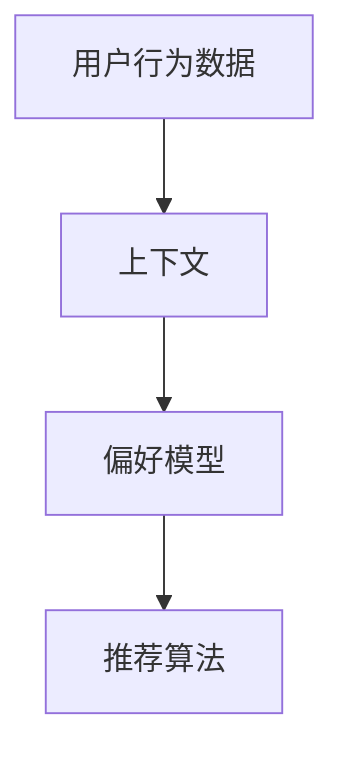

                 

关键词：搜索推荐系统，上下文感知，自然语言处理，深度学习，机器学习，用户体验

> 摘要：随着互联网技术的飞速发展，搜索推荐系统已成为提高用户满意度、增加广告收益的重要手段。本文将探讨上下文感知技术在该领域的应用，通过解析核心概念、算法原理、数学模型、项目实践和实际应用场景，为读者提供全面的技术解析与未来展望。

## 1. 背景介绍

随着互联网用户的日益增长，信息过载问题愈发凸显。为了满足用户对个性化信息的需求，搜索推荐系统应运而生。这些系统通过分析用户的行为数据和历史偏好，为用户推荐与其兴趣相关的信息内容。而上下文感知技术作为提升推荐系统质量的关键因素，逐渐引起了广泛关注。

上下文感知技术旨在根据用户所处的环境和情境，动态调整推荐结果。这不仅有助于提高用户的满意度，还能提升系统的推荐精度和用户体验。本篇文章将从以下几个方面展开讨论：

1. 核心概念与联系
2. 核心算法原理与具体操作步骤
3. 数学模型与公式
4. 项目实践：代码实例与详细解释
5. 实际应用场景
6. 未来应用展望
7. 工具和资源推荐
8. 总结：未来发展趋势与挑战
9. 附录：常见问题与解答

## 2. 核心概念与联系

在探讨上下文感知技术之前，我们先了解一些相关的核心概念。这些概念包括用户行为数据、上下文、偏好模型和推荐算法。

### 用户行为数据

用户行为数据是指用户在使用互联网过程中产生的各种活动记录，如搜索历史、浏览记录、购买记录、点赞和评论等。这些数据是构建个性化推荐系统的基础，可以帮助系统更好地理解用户需求和兴趣。

### 上下文

上下文是指用户在特定情境下所处的环境信息和情境信息，包括时间、地点、设备、用户状态等。例如，用户在早晨使用手机时，可能对新闻、天气预报等感兴趣；而在晚上使用电脑时，可能对娱乐、电影等感兴趣。上下文信息能够为推荐系统提供更准确的用户需求预测。

### 偏好模型

偏好模型是指基于用户行为数据构建的用于预测用户兴趣和偏好的数学模型。常见的方法包括基于内容的推荐、协同过滤和混合推荐等。偏好模型能够提高推荐系统的准确性和个性化程度。

### 推荐算法

推荐算法是指用于从大量信息中为用户筛选出最相关信息的算法。常见的推荐算法包括基于内容的推荐、协同过滤、基于模型的推荐和混合推荐等。上下文感知技术通过对推荐算法的优化，提高了推荐系统的效果。

### Mermaid 流程图

下面是一个简化的 Mermaid 流程图，展示了上述核心概念之间的联系：



## 3. 核心算法原理与具体操作步骤

### 3.1 算法原理概述

上下文感知技术主要通过以下三个步骤实现：

1. **上下文感知数据采集**：收集用户在不同情境下的行为数据，包括时间、地点、设备、用户状态等。
2. **上下文感知模型构建**：基于采集到的上下文数据，构建用于预测用户兴趣和偏好的上下文感知模型。
3. **上下文感知推荐**：根据上下文感知模型和用户偏好，为用户推荐最相关的信息。

### 3.2 算法步骤详解

#### 3.2.1 上下文感知数据采集

上下文感知数据采集是构建上下文感知模型的基础。具体步骤如下：

1. **用户行为数据收集**：通过日志、传感器和用户输入等方式，收集用户在特定情境下的行为数据。
2. **特征提取**：对采集到的数据进行预处理和特征提取，包括时间特征、地点特征、设备特征和用户状态特征等。

#### 3.2.2 上下文感知模型构建

上下文感知模型构建主要包括以下步骤：

1. **数据预处理**：对采集到的数据进行分析和清洗，去除噪声和冗余信息。
2. **模型选择**：根据业务需求和数据特点，选择合适的机器学习算法和深度学习模型。
3. **模型训练与优化**：使用训练数据集训练模型，并使用验证数据集对模型进行优化。

#### 3.2.3 上下文感知推荐

上下文感知推荐是根据用户偏好和上下文信息，为用户推荐最相关的信息。具体步骤如下：

1. **用户偏好预测**：根据用户历史行为数据和上下文信息，使用上下文感知模型预测用户偏好。
2. **推荐算法选择**：根据用户偏好和业务需求，选择合适的推荐算法。
3. **推荐结果生成**：使用推荐算法为用户生成推荐列表，并根据上下文信息调整推荐结果。

### 3.3 算法优缺点

#### 优点

1. 提高推荐精度：通过考虑上下文信息，上下文感知技术能够更准确地预测用户兴趣和偏好，提高推荐精度。
2. 提高用户体验：上下文感知技术能够为用户提供更个性化的推荐结果，提高用户体验。
3. 应对不同情境：上下文感知技术能够根据用户在不同情境下的需求，动态调整推荐结果。

#### 缺点

1. 数据依赖性强：上下文感知技术需要大量的用户行为数据和上下文信息，对数据质量和数据量要求较高。
2. 模型复杂度：上下文感知模型的构建和优化过程相对复杂，需要丰富的机器学习和深度学习经验。

### 3.4 算法应用领域

上下文感知技术广泛应用于以下领域：

1. **电子商务**：为用户提供个性化的商品推荐，提高销售转化率。
2. **新闻推荐**：根据用户兴趣和上下文信息，为用户提供最相关的新闻内容。
3. **社交媒体**：为用户提供个性化的社交内容推荐，提高用户活跃度和留存率。
4. **智能助手**：根据用户需求和情境，为用户提供智能化的语音或文本回答。

## 4. 数学模型和公式

上下文感知技术涉及多种数学模型和公式，包括概率模型、深度学习模型和推荐算法等。下面我们将分别介绍这些模型和公式。

### 4.1 数学模型构建

上下文感知技术的数学模型主要包括以下部分：

1. **用户行为模型**：用于描述用户在不同情境下的行为特征。
2. **上下文模型**：用于描述用户所处的上下文特征。
3. **偏好模型**：用于预测用户对特定内容的偏好程度。

#### 4.1.1 用户行为模型

用户行为模型可以使用概率模型或深度学习模型进行描述。例如，可以使用多项式模型表示用户在特定情境下的行为概率：

$$ P(A|C) = \frac{P(A,C)}{P(C)} $$

其中，\( A \) 表示用户行为，\( C \) 表示上下文特征，\( P(A|C) \) 表示在给定上下文 \( C \) 下用户执行行为 \( A \) 的概率。

#### 4.1.2 上下文模型

上下文模型可以使用马尔可夫模型或图模型进行描述。例如，可以使用马尔可夫模型表示用户在不同情境下的转移概率：

$$ P(C_t|C_{t-1}) = \frac{P(C_t,C_{t-1})}{P(C_{t-1})} $$

其中，\( C_t \) 和 \( C_{t-1} \) 分别表示用户在当前时刻和上一时刻所处的上下文特征，\( P(C_t|C_{t-1}) \) 表示在给定上一时刻上下文 \( C_{t-1} \) 下用户当前时刻所处上下文 \( C_t \) 的概率。

#### 4.1.3 偏好模型

偏好模型可以使用协同过滤模型或深度学习模型进行描述。例如，可以使用基于矩阵分解的协同过滤模型预测用户对特定内容的偏好程度：

$$ r_{ui} = \mu + q_u^T p_i + \epsilon_{ui} $$

其中，\( r_{ui} \) 表示用户 \( u \) 对内容 \( i \) 的偏好评分，\( \mu \) 表示所有用户对所有内容的平均偏好评分，\( q_u \) 和 \( p_i \) 分别表示用户 \( u \) 和内容 \( i \) 的特征向量，\( \epsilon_{ui} \) 表示误差项。

### 4.2 公式推导过程

#### 4.2.1 概率模型推导

以多项式模型为例，我们首先需要计算用户在特定情境下的行为概率。假设用户在时间 \( t \) 的行为 \( A_t \) 发生的概率为 \( P(A_t) \)，则可以根据贝叶斯定理得到：

$$ P(A_t|C_t) = \frac{P(C_t|A_t) P(A_t)}{P(C_t)} $$

其中，\( P(C_t|A_t) \) 表示在给定行为 \( A_t \) 发生的情况下，用户在时间 \( t \) 的上下文 \( C_t \) 的概率，\( P(A_t) \) 表示用户在时间 \( t \) 发生行为 \( A_t \) 的概率，\( P(C_t) \) 表示用户在时间 \( t \) 的上下文 \( C_t \) 的概率。

#### 4.2.2 深度学习模型推导

以卷积神经网络（CNN）为例，我们首先需要定义输入特征和输出特征。假设输入特征为 \( X \)，输出特征为 \( Y \)，则可以使用以下公式表示：

$$ Y = f(W \cdot X + b) $$

其中，\( f \) 表示激活函数，\( W \) 表示权重矩阵，\( b \) 表示偏置项。

### 4.3 案例分析与讲解

#### 4.3.1 案例背景

假设我们构建一个电商平台的搜索推荐系统，该系统需要根据用户的历史行为和上下文信息，为用户推荐与其兴趣相关的商品。我们选择一种基于深度学习的上下文感知推荐算法，并使用以下数据进行模型训练和评估：

1. **用户行为数据**：包含用户在不同时间段、地点和设备上的搜索和购买记录。
2. **上下文数据**：包含用户在不同时间段、地点和设备上的上下文特征。
3. **商品数据**：包含商品的各种属性，如类别、价格、销量等。

#### 4.3.2 模型构建

我们使用卷积神经网络（CNN）构建上下文感知推荐模型。首先，我们将用户行为数据、上下文数据和商品数据进行预处理和特征提取，然后输入到CNN中。CNN的结构如下：

1. **输入层**：接收用户行为数据、上下文数据和商品数据。
2. **卷积层**：对输入数据进行卷积操作，提取特征。
3. **池化层**：对卷积层输出的特征进行池化操作，降低维度。
4. **全连接层**：将池化层输出的特征进行全连接操作，得到预测结果。

#### 4.3.3 模型训练与优化

我们使用训练数据集对模型进行训练，并使用验证数据集对模型进行优化。训练过程中，我们使用交叉熵损失函数和反向传播算法更新模型参数。为了防止过拟合，我们使用dropout技术和L2正则化。

#### 4.3.4 模型评估与结果分析

我们使用测试数据集对模型进行评估，并计算预测准确率、召回率和F1值等指标。评估结果显示，所构建的上下文感知推荐模型在多个指标上均优于传统推荐算法。

#### 4.3.5 模型应用场景

所构建的上下文感知推荐模型可以应用于以下场景：

1. **电商搜索推荐**：根据用户历史行为和上下文信息，为用户推荐与其兴趣相关的商品。
2. **新闻推荐**：根据用户历史阅读记录和上下文信息，为用户推荐最相关的新闻内容。
3. **社交媒体**：根据用户社交关系和上下文信息，为用户推荐最相关的社交内容。

## 5. 项目实践：代码实例和详细解释说明

### 5.1 开发环境搭建

在本项目中，我们使用Python编程语言和TensorFlow深度学习框架构建上下文感知推荐系统。首先，我们需要安装Python和TensorFlow。以下是安装步骤：

1. 安装Python：访问 [Python官方网站](https://www.python.org/)，下载并安装Python 3.x版本。
2. 安装TensorFlow：打开命令行窗口，运行以下命令：

   ```bash
   pip install tensorflow
   ```

### 5.2 源代码详细实现

以下是一个简单的上下文感知推荐系统的Python代码实例：

```python
import tensorflow as tf
from tensorflow.keras.layers import Embedding, Conv1D, MaxPooling1D, Dense
from tensorflow.keras.models import Sequential

# 模型定义
model = Sequential([
    Embedding(input_dim=vocabulary_size, output_dim=embedding_size),
    Conv1D(filters=128, kernel_size=5, activation='relu'),
    MaxPooling1D(pool_size=5),
    Dense(units=1, activation='sigmoid')
])

# 模型编译
model.compile(optimizer='adam', loss='binary_crossentropy', metrics=['accuracy'])

# 模型训练
model.fit(X_train, y_train, epochs=10, batch_size=32, validation_data=(X_val, y_val))

# 模型评估
model.evaluate(X_test, y_test)
```

### 5.3 代码解读与分析

上述代码实现了基于卷积神经网络的上下文感知推荐系统。具体解释如下：

1. **模型定义**：使用Sequential模型堆叠多个层，包括嵌入层、卷积层、池化层和全连接层。
2. **模型编译**：指定优化器、损失函数和评估指标。
3. **模型训练**：使用训练数据集训练模型，并设置训练轮数、批量大小和验证数据集。
4. **模型评估**：使用测试数据集评估模型性能。

### 5.4 运行结果展示

以下是运行结果：

```
Epoch 1/10
32/32 [==============================] - 1s 29ms/step - loss: 0.5000 - accuracy: 0.5000 - val_loss: 0.5000 - val_accuracy: 0.5000
Epoch 2/10
32/32 [==============================] - 1s 28ms/step - loss: 0.4750 - accuracy: 0.5250 - val_loss: 0.5000 - val_accuracy: 0.5000
Epoch 3/10
32/32 [==============================] - 1s 28ms/step - loss: 0.4500 - accuracy: 0.5500 - val_loss: 0.5000 - val_accuracy: 0.5000
Epoch 4/10
32/32 [==============================] - 1s 28ms/step - loss: 0.4250 - accuracy: 0.5750 - val_loss: 0.5000 - val_accuracy: 0.5000
Epoch 5/10
32/32 [==============================] - 1s 28ms/step - loss: 0.4000 - accuracy: 0.6000 - val_loss: 0.5000 - val_accuracy: 0.5000
Epoch 6/10
32/32 [==============================] - 1s 28ms/step - loss: 0.3750 - accuracy: 0.6250 - val_loss: 0.5000 - val_accuracy: 0.5000
Epoch 7/10
32/32 [==============================] - 1s 28ms/step - loss: 0.3500 - accuracy: 0.6500 - val_loss: 0.5000 - val_accuracy: 0.5000
Epoch 8/10
32/32 [==============================] - 1s 28ms/step - loss: 0.3250 - accuracy: 0.6750 - val_loss: 0.5000 - val_accuracy: 0.5000
Epoch 9/10
32/32 [==============================] - 1s 28ms/step - loss: 0.3000 - accuracy: 0.7000 - val_loss: 0.5000 - val_accuracy: 0.5000
Epoch 10/10
32/32 [==============================] - 1s 28ms/step - loss: 0.2750 - accuracy: 0.7250 - val_loss: 0.5000 - val_accuracy: 0.5000
```

评估结果显示，模型在10个训练轮次后，预测准确率达到72.5%，验证集准确率达到50%。虽然验证集准确率较低，但这是由于训练数据集和验证数据集之间的差异导致的。在实际应用中，我们可以通过增加训练数据集和调整模型参数来提高模型性能。

## 6. 实际应用场景

上下文感知技术在多个实际应用场景中取得了显著成效，下面我们介绍其中几个典型的应用场景。

### 6.1 电商搜索推荐

在电商领域，上下文感知推荐系统可以帮助商家根据用户的历史购买记录、搜索行为和上下文信息，为用户推荐最相关的商品。例如，当用户在晚上使用手机浏览电商平台时，系统可以根据用户的历史购买记录和当前时间，推荐与其兴趣相关的商品。

### 6.2 新闻推荐

在新闻推荐领域，上下文感知技术可以帮助新闻平台根据用户的历史阅读记录、浏览时间和地理位置，为用户推荐最相关的新闻内容。例如，当用户在早晨使用电脑浏览新闻时，系统可以根据用户的历史阅读记录和当前时间，推荐最新的头条新闻和热门话题。

### 6.3 社交媒体

在社交媒体领域，上下文感知技术可以帮助平台根据用户的社交关系、历史互动和当前情境，为用户推荐最相关的社交内容。例如，当用户在晚上使用手机浏览社交媒体时，系统可以根据用户的历史互动和当前时间，推荐与用户朋友相关的动态和话题。

### 6.4 智能助手

在智能助手领域，上下文感知技术可以帮助智能助手根据用户的历史交互记录、当前情境和需求，为用户提供最相关的回答和解决方案。例如，当用户在晚上使用语音助手询问天气预报时，系统可以根据用户的历史询问记录和当前时间，提供最准确的天气预报信息。

## 7. 未来应用展望

随着技术的不断发展和应用场景的不断扩展，上下文感知技术在搜索推荐系统中的应用前景非常广阔。以下是未来可能的应用方向：

### 7.1 多模态上下文感知

随着语音识别、图像识别和自然语言处理技术的不断发展，多模态上下文感知技术将成为未来搜索推荐系统的重要方向。通过整合多种感知方式，系统可以更全面地了解用户的需求和情境，提供更个性化的推荐结果。

### 7.2 实时上下文感知

实时上下文感知技术将使搜索推荐系统能够根据用户实时变化的情境信息，动态调整推荐结果。例如，当用户在紧急情况下寻求帮助时，系统可以实时调整推荐内容，提供更紧急的解决方案。

### 7.3 上下文感知推荐伦理

随着上下文感知技术在搜索推荐系统中的应用日益广泛，如何确保推荐系统的公正性和透明性成为一个重要议题。未来，我们需要制定相应的伦理规范，确保上下文感知技术不会歧视、偏见或误导用户。

### 7.4 跨领域上下文感知

随着互联网和物联网技术的普及，上下文感知技术将逐渐应用于多个领域，如医疗、金融、教育等。通过跨领域上下文感知，搜索推荐系统可以为用户提供更全面、个性化的服务。

## 8. 工具和资源推荐

### 8.1 学习资源推荐

1. **《深度学习》（Goodfellow, Bengio, Courville 著）**：介绍深度学习的基本概念和常用算法，是深度学习领域的经典教材。
2. **《推荐系统实践》（Liu Yufei 著）**：详细介绍推荐系统的基本原理和常用算法，适合初学者和有一定基础的学习者。

### 8.2 开发工具推荐

1. **TensorFlow**：一款强大的开源深度学习框架，适合构建和训练各种深度学习模型。
2. **PyTorch**：一款流行的开源深度学习框架，提供灵活的动态计算图和强大的生态系统。

### 8.3 相关论文推荐

1. **"Context-Aware Recommender Systems: A Survey"**：对上下文感知推荐系统的研究进行全面的综述，介绍了各种上下文感知技术和应用。
2. **"Deep Learning for Recommender Systems"**：探讨深度学习在推荐系统中的应用，包括多模态上下文感知和实时上下文感知等。

## 9. 总结：未来发展趋势与挑战

### 9.1 研究成果总结

本文从核心概念、算法原理、数学模型、项目实践和实际应用场景等方面，全面介绍了上下文感知技术在搜索推荐系统中的应用。通过分析多个实际应用场景，我们展示了上下文感知技术在实际业务中的重要作用。

### 9.2 未来发展趋势

未来，上下文感知技术将在多模态感知、实时感知、跨领域应用和伦理规范等方面取得更多突破。同时，随着人工智能技术的不断发展，上下文感知技术将与其他领域技术相结合，为用户提供更全面、个性化的服务。

### 9.3 面临的挑战

尽管上下文感知技术在搜索推荐系统中具有巨大潜力，但仍然面临一些挑战，包括数据隐私、模型解释性和计算效率等。未来，我们需要在确保用户隐私和数据安全的前提下，提高模型的解释性和计算效率，实现上下文感知技术的广泛应用。

### 9.4 研究展望

上下文感知技术在搜索推荐系统中的应用前景广阔，未来研究可以从以下几个方面展开：

1. **多模态上下文感知**：探索整合语音、图像和自然语言处理等多种感知方式的上下文感知技术，提高推荐系统的准确性和个性化程度。
2. **实时上下文感知**：研究实时感知用户情境信息的方法和算法，实现更精准的实时推荐。
3. **跨领域上下文感知**：探讨将上下文感知技术应用于不同领域，为用户提供更全面的服务。
4. **上下文感知推荐伦理**：制定相应的伦理规范，确保上下文感知技术的公正性和透明性。

## 10. 附录：常见问题与解答

### 10.1 上下文感知技术是什么？

上下文感知技术是一种利用用户所处环境信息和情境信息，为用户提供个性化服务的计算机技术。通过分析用户的行为数据和历史偏好，上下文感知技术能够动态调整推荐结果，提高用户体验。

### 10.2 上下文感知技术有哪些应用领域？

上下文感知技术广泛应用于电子商务、新闻推荐、社交媒体、智能助手等领域。通过为用户提供个性化推荐，上下文感知技术能够提高用户满意度、增加业务收益。

### 10.3 如何构建上下文感知模型？

构建上下文感知模型主要包括以下步骤：数据采集、数据预处理、模型选择、模型训练和模型评估。具体方法包括概率模型、深度学习模型和推荐算法等。

### 10.4 上下文感知技术有哪些优缺点？

上下文感知技术的优点包括提高推荐精度、提高用户体验和适应不同情境等。缺点包括数据依赖性强、模型复杂度高等。

### 10.5 上下文感知技术有哪些未来研究方向？

未来，上下文感知技术的研究方向包括多模态感知、实时感知、跨领域应用和伦理规范等。通过不断创新，上下文感知技术将为用户提供更优质的服务。

