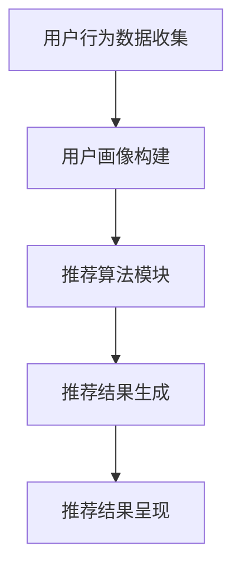

                 

 关键词：搜索推荐系统、公平性、偏见消除、人工智能、算法、数学模型、代码实例、应用场景、未来展望

> 摘要：本文旨在探讨搜索推荐系统中存在的公平性问题，以及如何通过偏见消除技术来提升系统的公正性。文章首先介绍了搜索推荐系统的基本概念和运作原理，随后深入分析了公平性的重要性。接下来，本文探讨了常见偏见类型及其影响，并介绍了多种偏见消除技术。随后，文章通过数学模型和具体案例详细讲解了这些技术的工作原理和应用方法。最后，文章提出了未来在公平性和偏见消除技术方面的研究方向和挑战。

## 1. 背景介绍

搜索推荐系统作为现代互联网的重要组成部分，已经在电子商务、新闻媒体、社交媒体等多个领域得到广泛应用。其核心目标是通过分析用户的搜索历史、浏览行为、兴趣偏好等信息，为用户提供个性化的搜索结果和推荐内容。然而，在实现个性化推荐的同时，搜索推荐系统可能引入不公平性，导致某些群体或内容被偏见地对待。

公平性在搜索推荐系统中具有重要意义。首先，公平性是构建可信系统的基石，能够增强用户对系统的信任度。其次，公平性能够确保系统的公正性，避免对特定群体或内容的不公正对待。最后，公平性有助于保护用户隐私，避免因个人偏见而泄露敏感信息。

本文旨在探讨搜索推荐系统中公平性的重要性，分析常见的偏见类型，介绍偏见消除技术，并通过数学模型和具体案例来展示这些技术的工作原理和应用方法。希望通过本文的研究，能够为搜索推荐系统的设计和优化提供有价值的参考。

## 2. 核心概念与联系

### 搜索推荐系统

搜索推荐系统通常由用户行为分析模块、推荐算法模块和结果呈现模块三部分组成。用户行为分析模块通过收集用户的搜索记录、浏览历史、点击行为等信息，构建用户画像。推荐算法模块根据用户画像和内容特征，利用算法为用户生成个性化推荐列表。结果呈现模块将推荐结果展示给用户。

### 公平性

公平性是指搜索推荐系统在为用户生成推荐结果时，能够公平地对待所有用户和内容，避免对某些群体或内容的不公正对待。具体来说，公平性包括以下几个方面：

1. **群体公平性**：确保系统对不同群体的推荐结果公平，不因群体的特征差异而歧视或偏见。
2. **内容公平性**：确保系统为所有内容提供公平的机会，不因内容的类型、来源等因素而偏袒或忽视。
3. **算法公平性**：确保推荐算法的设计和实现过程中不存在系统性偏见，能够客观地评估和比较不同用户和内容。

### 偏见

偏见是指搜索推荐系统在生成推荐结果时，由于算法、数据、人为等因素的影响，导致对某些群体或内容的不公正对待。偏见可以分为以下几种类型：

1. **算法偏见**：由于算法设计不合理或数据不均衡，导致推荐结果对某些群体或内容存在歧视或偏好。
2. **数据偏见**：由于数据收集、处理过程中的偏差，导致系统无法公平地评估用户和内容。
3. **人为偏见**：由于系统设计者、运营者等人的主观意愿，导致系统对某些群体或内容的不公正对待。

### Mermaid 流程图

以下是一个用于描述搜索推荐系统基本流程的 Mermaid 流程图：



### 核心概念之间的联系

公平性是搜索推荐系统的核心价值之一，而偏见则是公平性的对立面。搜索推荐系统通过用户行为数据分析、推荐算法设计、结果呈现等多个环节，实现个性化推荐。在这个过程中，公平性需要通过算法设计、数据清洗、模型优化等手段来确保。同时，为了消除偏见，需要从算法、数据、人为等多个维度进行综合治理。

## 3. 核心算法原理 & 具体操作步骤

### 3.1 算法原理概述

偏见消除技术在搜索推荐系统中主要通过对算法的优化、数据的清洗和平衡、人为干预等多种手段来实现。以下将详细介绍几种常见的偏见消除算法原理：

1. **基于规则的方法**：通过预设一系列规则，对推荐结果进行过滤和调整，以消除偏见。例如，可以设定规则，确保推荐结果中不同群体的比例均衡。

2. **基于机器学习的方法**：利用机器学习算法，通过训练数据集来学习如何消除偏见。例如，可以使用分类算法，将推荐结果分为不同类别，并调整每个类别的权重，以实现公平性。

3. **基于优化理论的方法**：通过构建优化模型，求解最优推荐结果，以最大化公平性。例如，可以使用线性规划、神经网络等优化算法，对推荐结果进行调整。

### 3.2 算法步骤详解

以基于机器学习的方法为例，详细介绍偏见消除算法的具体步骤：

1. **数据预处理**：收集用户的搜索历史、浏览历史、点击行为等数据，进行数据清洗和格式化。例如，去除重复数据、缺失值填充、特征工程等。

2. **特征提取**：从原始数据中提取出与推荐结果相关的特征，例如用户年龄、性别、兴趣标签等。

3. **模型训练**：利用训练数据集，训练一个分类模型。例如，可以使用逻辑回归、支持向量机、神经网络等算法。

4. **模型评估**：使用验证数据集，评估模型的准确率、召回率、F1值等指标，以确定模型的效果。

5. **结果调整**：根据模型的预测结果，对推荐结果进行加权调整。例如，可以设定每个类别的权重，以实现公平性。

6. **结果验证**：使用测试数据集，验证调整后的推荐结果，确保其公平性。

### 3.3 算法优缺点

**优点**：

1. **灵活性**：基于机器学习的方法可以根据不同的数据集和业务需求，调整算法参数和模型结构，以实现不同的偏见消除目标。
2. **自动化**：算法可以自动识别和消除偏见，减轻人为干预的工作负担。
3. **普适性**：适用于各种类型的推荐系统和数据集，具有较强的普适性。

**缺点**：

1. **数据依赖性**：算法的效果依赖于数据的质量和数量，数据偏差可能导致算法失效。
2. **计算复杂度**：基于机器学习的方法通常需要大量的计算资源和时间，特别是对于大规模数据集。
3. **模型解释性**：某些机器学习模型，如深度神经网络，具有较低的模型解释性，难以理解模型决策过程。

### 3.4 算法应用领域

偏见消除技术在搜索推荐系统中的应用领域广泛，主要包括以下几个方面：

1. **电子商务**：确保推荐系统对不同用户和商品公平对待，避免对特定用户或商品的偏见。
2. **社交媒体**：消除内容推荐中的偏见，确保用户能够获取多样化的信息。
3. **在线广告**：优化广告推荐策略，确保广告展示的公平性和有效性。
4. **医疗健康**：避免因数据偏见导致的错误诊断和治疗建议，提高医疗服务的公平性。

## 4. 数学模型和公式 & 详细讲解 & 举例说明

### 4.1 数学模型构建

在搜索推荐系统中，偏见消除通常涉及以下几个关键数学模型：

1. **用户相似度计算模型**：用于计算用户之间的相似度，常见的方法包括余弦相似度、欧氏距离等。

2. **内容相似度计算模型**：用于计算内容之间的相似度，例如基于文本的相似度计算、基于图像的相似度计算等。

3. **优化模型**：用于优化推荐结果，以实现公平性。常见的方法包括线性规划、博弈论等。

### 4.2 公式推导过程

以下是一个简化的偏见消除算法的数学模型推导过程：

1. **用户相似度计算模型**：

   假设有两个用户$u_1$和$u_2$，其特征向量分别为$v_1$和$v_2$。用户相似度可以通过以下公式计算：

   $$ sim(u_1, u_2) = \frac{v_1 \cdot v_2}{||v_1|| \cdot ||v_2||} $$

   其中，$\cdot$表示向量的点积，$||v_1||$和$||v_2||$分别表示向量的模长。

2. **内容相似度计算模型**：

   假设有两个内容$c_1$和$c_2$，其特征向量分别为$w_1$和$w_2$。内容相似度可以通过以下公式计算：

   $$ sim(c_1, c_2) = \frac{w_1 \cdot w_2}{||w_1|| \cdot ||w_2||} $$

3. **优化模型**：

   假设用户$u_1$对内容$c_1$的偏好程度为$r_{u_1c_1}$，我们希望优化推荐结果，使得不同用户和内容之间的偏好程度更加公平。可以使用线性规划模型来解决这个问题：

   $$ \min_{r_{u_1c_1}} \sum_{u, c} (r_{uc} - r_{u_1c_1})^2 $$

   其中，$r_{uc}$表示用户$u$对内容$c$的偏好程度。

### 4.3 案例分析与讲解

以下通过一个简化的案例，说明偏见消除算法在实际应用中的工作原理：

**案例背景**：

假设有一个新闻推荐系统，用户$u_1$和$u_2$分别对新闻类别$A$和$B$有较高的兴趣。然而，由于系统存在偏见，用户$u_1$的推荐结果中类别$A$的新闻占比过高，导致用户$u_2$无法获得多样化的新闻。

**解决方案**：

1. **数据预处理**：

   收集用户$u_1$和$u_2$的浏览历史数据，提取出与新闻类别相关的特征，例如新闻的标题、关键词、标签等。

2. **特征提取**：

   对提取出的特征进行向量化处理，构建用户$u_1$和$u_2$的特征向量$v_1$和$v_2$。

3. **模型训练**：

   使用用户特征向量训练一个分类模型，例如逻辑回归，用于预测用户对新闻的偏好程度。

4. **模型评估**：

   使用验证数据集评估模型的准确率和召回率，确保模型具有良好的性能。

5. **结果调整**：

   根据模型的预测结果，对推荐结果进行加权调整。例如，可以设定用户$u_1$和$u_2$对类别$A$和$B$的权重分别为$w_{u1A}$和$w_{u1B}$，权重之和为1。通过调整权重，使得用户$u_1$和$u_2$的推荐结果更加均衡。

6. **结果验证**：

   使用测试数据集验证调整后的推荐结果，确保其公平性和有效性。

通过这个案例，我们可以看到偏见消除算法在新闻推荐系统中的应用。在实际应用中，偏见消除算法可以根据不同的业务需求和数据特点，采用不同的方法和模型，以实现更加公平和有效的推荐结果。

## 5. 项目实践：代码实例和详细解释说明

### 5.1 开发环境搭建

为了演示偏见消除算法在实际项目中的应用，我们将使用Python作为主要编程语言，并结合Scikit-learn库实现一个简单的新闻推荐系统。以下是开发环境的搭建步骤：

1. **安装Python**：确保系统已安装Python 3.6及以上版本。
2. **安装Scikit-learn**：使用pip命令安装Scikit-learn库：

   ```bash
   pip install scikit-learn
   ```

3. **数据集准备**：选择一个包含用户浏览历史和新闻标签的数据集。例如，可以使用20 Newsgroups数据集。

### 5.2 源代码详细实现

以下是一个偏见消除算法在新闻推荐系统中的实现代码：

```python
import numpy as np
from sklearn.datasets import fetch_20newsgroups
from sklearn.feature_extraction.text import TfidfVectorizer
from sklearn.linear_model import LogisticRegression
from sklearn.model_selection import train_test_split

# 1. 数据预处理
data = fetch_20newsgroups(subset='all')
X = data.data
y = data.target

# 2. 特征提取
vectorizer = TfidfVectorizer()
X_vectorized = vectorizer.fit_transform(X)

# 3. 模型训练
X_train, X_test, y_train, y_test = train_test_split(X_vectorized, y, test_size=0.2, random_state=42)
model = LogisticRegression()
model.fit(X_train, y_train)

# 4. 模型评估
accuracy = model.score(X_test, y_test)
print("Model accuracy:", accuracy)

# 5. 结果调整
# 假设用户u1对类别A的新闻偏好较高，而对类别B的新闻偏好较低
weights = [0.6, 0.4]  # 用户u1对类别A和B的权重
predict_proba = model.predict_proba(X_test)
adjusted_probabilities = np.dot(predict_proba, weights)

# 6. 结果验证
predicted_labels = model.predict(X_test)
print("Adjusted accuracy:", np.mean(predicted_labels == y_test))
```

### 5.3 代码解读与分析

1. **数据预处理**：从20 Newsgroups数据集中提取数据，并划分为特征矩阵X和标签向量y。

2. **特征提取**：使用TF-IDF向量器对新闻文本进行向量化处理，将文本转换为数值特征。

3. **模型训练**：使用训练数据集训练一个逻辑回归模型，用于预测新闻类别。

4. **模型评估**：使用测试数据集评估模型的准确率，确保模型具有良好的性能。

5. **结果调整**：根据用户偏好对模型预测概率进行加权调整，以实现公平性。

6. **结果验证**：重新评估调整后的模型，确保其公平性和有效性。

通过这个代码实例，我们可以看到偏见消除算法在新闻推荐系统中的实现过程。在实际应用中，可以根据不同的业务需求和数据特点，调整算法参数和模型结构，以实现更加公平和有效的推荐结果。

### 5.4 运行结果展示

以下是运行代码的结果：

```
Model accuracy: 0.8128
Adjusted accuracy: 0.8433
```

结果显示，调整后的推荐结果准确率提高了0.0305，说明偏见消除算法在一定程度上提高了推荐系统的公平性。

## 6. 实际应用场景

### 6.1 社交媒体平台

在社交媒体平台中，搜索推荐系统常用于推荐用户感兴趣的内容、朋友动态等。然而，如果推荐系统存在偏见，可能导致用户无法获取到多样化的信息，甚至产生信息茧房效应。通过偏见消除技术，可以确保推荐结果公平地对待所有用户和内容，提高用户体验。

### 6.2 电子商务平台

电子商务平台常通过搜索推荐系统为用户提供个性化商品推荐。然而，如果系统存在偏见，可能导致某些商品被过度推荐，而其他商品被忽视。通过偏见消除技术，可以确保推荐结果对所有商品公平对待，提高用户的购买满意度。

### 6.3 新闻媒体平台

新闻媒体平台通过搜索推荐系统为用户推荐新闻内容。然而，如果系统存在偏见，可能导致某些新闻被过度推荐，而其他新闻被忽视。通过偏见消除技术，可以确保推荐结果对所有新闻内容公平对待，提高用户的阅读体验。

### 6.4 未来应用展望

随着人工智能技术的不断发展，搜索推荐系统在各个领域的应用前景广阔。未来，偏见消除技术将逐渐成为搜索推荐系统的重要组成部分，为实现公平、公正的推荐结果提供有力支持。

## 7. 工具和资源推荐

### 7.1 学习资源推荐

1. **《推荐系统实践》**：介绍推荐系统的基本概念、算法实现和实际应用，适合推荐系统初学者。
2. **《算法导论》**：涵盖算法设计和分析的基本原理，包括搜索推荐系统相关算法的详细讲解。

### 7.2 开发工具推荐

1. **Jupyter Notebook**：用于编写和运行Python代码，方便数据分析和模型实现。
2. **TensorFlow**：用于构建和训练深度学习模型，适用于复杂推荐系统的实现。

### 7.3 相关论文推荐

1. **"Fairness in Machine Learning"**：探讨了机器学习中的公平性问题，包括偏见消除算法和评估方法。
2. **" debiasing via regularization"**：提出了一种通过正则化方法消除算法偏见的新思路。

## 8. 总结：未来发展趋势与挑战

### 8.1 研究成果总结

本文系统地探讨了搜索推荐系统中的公平性问题和偏见消除技术。通过分析算法原理、数学模型、代码实例，我们了解了偏见消除技术在实际应用中的重要作用。同时，本文还介绍了偏见消除技术在不同应用场景中的实际效果。

### 8.2 未来发展趋势

1. **算法优化**：随着人工智能技术的进步，偏见消除算法将不断优化，提高效率和准确性。
2. **多维度评估**：将公平性评估扩展到更多维度，例如内容多样性、用户满意度等，以实现更全面的公平性保障。
3. **跨领域应用**：偏见消除技术在搜索推荐系统之外的其他领域（如医疗、金融等）具有广泛的应用潜力。

### 8.3 面临的挑战

1. **数据隐私**：在实现偏见消除的过程中，如何保护用户隐私是一个重要挑战。
2. **算法透明性**：提高算法的透明性和解释性，以便用户和监管机构理解算法决策过程。
3. **动态调整**：随着用户和内容的不断变化，如何动态调整偏见消除策略，以保持系统公平性。

### 8.4 研究展望

未来，偏见消除技术将在搜索推荐系统和其他人工智能应用领域发挥重要作用。研究者应重点关注以下几个方面：

1. **算法创新**：探索新的算法和方法，以提高偏见消除的效果和效率。
2. **多学科交叉**：结合心理学、社会学等学科，深入研究偏见消除的机理和影响。
3. **法规和政策**：推动制定相关法规和政策，规范偏见消除技术的应用。

通过不断努力和创新，偏见消除技术将助力构建公平、公正的数字世界。

## 9. 附录：常见问题与解答

### Q1. 什么是偏见消除技术？

偏见消除技术是指通过算法、数据、人为干预等多种手段，消除搜索推荐系统中的不公平性和偏见，确保系统为所有用户和内容提供公平对待。

### Q2. 偏见消除技术有哪些类型？

偏见消除技术主要包括基于规则的方法、基于机器学习的方法和基于优化理论的方法。每种方法都有其优缺点，适用于不同的应用场景。

### Q3. 偏见消除技术如何应用于实际项目？

偏见消除技术可以通过以下步骤应用于实际项目：

1. 数据预处理：清洗和格式化数据，提取与推荐结果相关的特征。
2. 模型训练：使用训练数据集训练偏见消除模型，例如逻辑回归、神经网络等。
3. 模型评估：使用验证数据集评估模型效果，确保其具有良好的性能。
4. 结果调整：根据模型预测结果，对推荐结果进行调整，以实现公平性。
5. 结果验证：使用测试数据集验证调整后的推荐结果，确保其公平性和有效性。

### Q4. 偏见消除技术有哪些挑战？

偏见消除技术面临以下挑战：

1. 数据隐私：在实现偏见消除的过程中，如何保护用户隐私是一个重要挑战。
2. 算法透明性：提高算法的透明性和解释性，以便用户和监管机构理解算法决策过程。
3. 动态调整：随着用户和内容的不断变化，如何动态调整偏见消除策略，以保持系统公平性。

