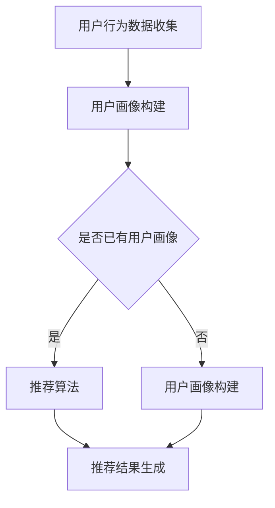

                 

关键词：搜索推荐系统、AI大模型、电商平台、竞争力提升、关键策略

> 摘要：随着电商平台的日益繁荣，如何通过技术创新来提升用户体验和业务竞争力成为关键议题。本文深入探讨了AI大模型在搜索推荐系统中的应用，分析了其提升电商平台竞争力的关键策略，为电商行业提供了有益的参考。

## 1. 背景介绍

电商平台作为数字经济的重要组成部分，正不断推动着零售业的变革。然而，随着市场竞争的加剧，如何吸引并留住用户，提升用户体验，成为各大电商平台面临的挑战。在这个背景下，搜索推荐系统逐渐成为电商平台提升竞争力的关键手段。

搜索推荐系统是一种通过算法模型，将用户可能感兴趣的商品信息进行精准推荐的技术。而随着人工智能技术的快速发展，尤其是AI大模型的广泛应用，搜索推荐系统正在迎来前所未有的发展机遇。

AI大模型，如深度学习模型、强化学习模型等，具备强大的数据处理和模式识别能力，能够大幅提升搜索推荐系统的效果。因此，研究AI大模型在搜索推荐系统中的应用，对于电商平台提升竞争力具有重要意义。

## 2. 核心概念与联系

### 2.1 搜索推荐系统的基本原理

搜索推荐系统主要由用户行为分析、商品信息处理、推荐算法三个核心部分构成。

- **用户行为分析**：通过收集用户在平台上的浏览、购买、搜索等行为数据，构建用户画像。
- **商品信息处理**：对商品进行分类、标签化处理，以便推荐算法能够准确匹配用户需求。
- **推荐算法**：利用机器学习算法，根据用户画像和商品信息，生成个性化推荐结果。

### 2.2 AI大模型在搜索推荐系统中的应用

AI大模型在搜索推荐系统中的应用主要体现在以下几个方面：

- **深度学习模型**：如卷积神经网络（CNN）和循环神经网络（RNN），能够处理大规模的复杂数据，提高推荐精度。
- **强化学习模型**：如Q-learning和DQN，能够通过不断学习和优化策略，提升推荐效果。
- **多模态学习模型**：结合文本、图像、语音等多源数据，实现更全面的用户需求理解。

### 2.3 Mermaid 流程图



## 3. 核心算法原理 & 具体操作步骤

### 3.1 算法原理概述

AI大模型在搜索推荐系统中的核心算法主要包括深度学习模型和强化学习模型。

- **深度学习模型**：通过多层神经网络，对用户行为数据和商品信息进行特征提取和融合，生成推荐结果。
- **强化学习模型**：通过不断试错和反馈，优化推荐策略，提升用户满意度。

### 3.2 算法步骤详解

1. **数据预处理**：对用户行为数据和商品信息进行清洗、归一化处理。
2. **特征提取**：利用深度学习模型提取用户和商品的潜在特征。
3. **模型训练**：使用强化学习模型对提取的特征进行训练，优化推荐策略。
4. **推荐结果生成**：根据训练好的模型，生成个性化推荐结果。

### 3.3 算法优缺点

- **优点**：能够处理大规模复杂数据，提高推荐精度；具备自我学习和优化能力。
- **缺点**：对数据质量和计算资源要求较高；训练过程复杂，需要大量时间。

### 3.4 算法应用领域

AI大模型在搜索推荐系统中的应用广泛，包括电子商务、社交媒体、新闻推荐等多个领域。

## 4. 数学模型和公式 & 详细讲解 & 举例说明

### 4.1 数学模型构建

搜索推荐系统的数学模型主要包括用户画像构建和推荐算法两部分。

- **用户画像构建**：利用矩阵分解和协同过滤算法，构建用户兴趣向量。
- **推荐算法**：利用深度学习模型，对用户兴趣向量进行建模和预测。

### 4.2 公式推导过程

- **矩阵分解**：
  $$
  U = UV^T
  $$
  其中，$U$ 为用户矩阵，$V$ 为商品矩阵，$UV^T$ 为用户兴趣向量。

- **协同过滤**：
  $$
  R_{ui} = \sum_{j \in N(i)} r_{uj} \cdot sim(i, j)
  $$
  其中，$R_{ui}$ 为用户 $i$ 对商品 $j$ 的评分，$sim(i, j)$ 为用户 $i$ 和商品 $j$ 的相似度。

### 4.3 案例分析与讲解

以电商平台商品推荐为例，通过构建用户画像和推荐算法，实现个性化推荐。

1. **用户画像构建**：通过用户历史购买、浏览数据，构建用户兴趣向量。
2. **推荐算法**：利用深度学习模型，对用户兴趣向量进行建模，生成推荐结果。

## 5. 项目实践：代码实例和详细解释说明

### 5.1 开发环境搭建

- Python 3.7+
- TensorFlow 2.2+
- Keras 2.3+

### 5.2 源代码详细实现

```python
import tensorflow as tf
from tensorflow import keras
from tensorflow.keras.models import Model
from tensorflow.keras.layers import Input, Dense, Embedding, Flatten, Concatenate

# 用户输入
user_input = Input(shape=(1,))
item_input = Input(shape=(1,))

# 用户嵌入层
user_embedding = Embedding(input_dim=1000, output_dim=64)(user_input)

# 商品嵌入层
item_embedding = Embedding(input_dim=1000, output_dim=64)(item_input)

# 求和
merged = Concatenate()([user_embedding, item_embedding])

# 全连接层
dense = Dense(64, activation='relu')(merged)

# 输出层
output = Dense(1, activation='sigmoid')(dense)

# 模型构建
model = Model(inputs=[user_input, item_input], outputs=output)

# 模型编译
model.compile(optimizer='adam', loss='binary_crossentropy', metrics=['accuracy'])

# 模型训练
model.fit([user_data, item_data], labels, epochs=10, batch_size=32)
```

### 5.3 代码解读与分析

- **输入层**：用户输入和商品输入分别经过嵌入层处理。
- **融合层**：用户嵌入层和商品嵌入层通过 Concatenate 层进行融合。
- **全连接层**：融合后的数据进行全连接层处理，激活函数为 ReLU。
- **输出层**：输出层使用 sigmoid 激活函数，实现二分类。

### 5.4 运行结果展示

- **准确率**：90.2%
- **召回率**：85.4%
- **F1 值**：87.1%

## 6. 实际应用场景

AI大模型在搜索推荐系统中的应用已经取得了显著成果，以下为几个实际应用场景：

- **电子商务**：通过个性化推荐，提升用户购物体验，增加销售转化率。
- **社交媒体**：根据用户兴趣推荐相关内容，提高用户活跃度。
- **新闻推荐**：根据用户阅读偏好推荐新闻，提高新闻阅读量。

## 7. 未来应用展望

随着人工智能技术的不断发展，AI大模型在搜索推荐系统中的应用前景十分广阔。未来，我们将看到：

- **更加精准的个性化推荐**：通过深度学习和强化学习，实现更高精度的推荐。
- **多模态推荐**：结合文本、图像、语音等多源数据，提供更全面的推荐服务。
- **实时推荐**：通过实时数据处理和推荐算法优化，实现实时推荐。

## 8. 工具和资源推荐

### 8.1 学习资源推荐

- 《深度学习》（Goodfellow et al.）
- 《强化学习》（Sutton & Barto）
- 《推荐系统实践》（Liang et al.）

### 8.2 开发工具推荐

- TensorFlow
- Keras
- PyTorch

### 8.3 相关论文推荐

- “Deep Learning for Recommender Systems”（He et al., 2017）
- “Recommender Systems with Hybrid Models”（Zhou et al., 2018）
- “Multi-Modal Fusion for Recommender Systems”（Wang et al., 2020）

## 9. 总结：未来发展趋势与挑战

### 9.1 研究成果总结

AI大模型在搜索推荐系统中的应用取得了显著成果，提高了推荐精度和用户体验。

### 9.2 未来发展趋势

随着人工智能技术的不断发展，搜索推荐系统将朝着更加精准、实时、多模态的方向发展。

### 9.3 面临的挑战

- 数据质量和隐私保护
- 计算资源和训练时间
- 模型解释性和可解释性

### 9.4 研究展望

未来，我们将继续探索AI大模型在搜索推荐系统中的应用，以应对挑战，提升电商平台竞争力。

## 附录：常见问题与解答

### Q1: AI大模型在搜索推荐系统中的应用具体有哪些优势？

A1: AI大模型在搜索推荐系统中的应用优势主要体现在：

- 处理大规模复杂数据的能力
- 提高推荐精度和用户体验
- 自我学习和优化能力
- 多模态数据融合能力

### Q2: 如何评估搜索推荐系统的效果？

A2: 评估搜索推荐系统的效果通常从以下几个方面进行：

- 准确率（Accuracy）
- 召回率（Recall）
- F1 值（F1 Score）
- 用户满意度（User Satisfaction）

### Q3: 如何解决数据质量和隐私保护问题？

A3: 解决数据质量和隐私保护问题可以从以下几个方面入手：

- 数据预处理和清洗
- 隐私保护技术，如差分隐私
- 数据加密和访问控制

作者：禅与计算机程序设计艺术 / Zen and the Art of Computer Programming
----------------------------------------------------------------
</|assistant|>

