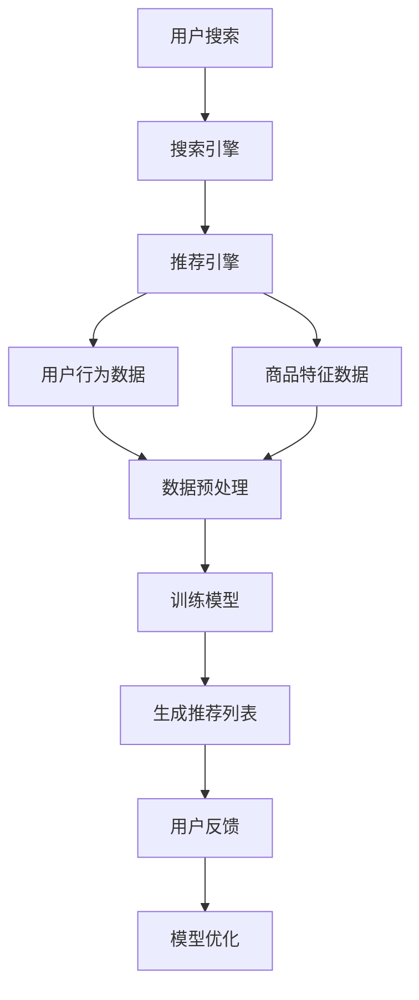

                 

关键词：搜索推荐系统、AI 大模型、电商平台、转化率、盈利能力

摘要：本文将探讨如何利用 AI 大模型技术提升电商平台的搜索推荐系统性能，从而提高转化率和盈利能力。通过分析核心概念、算法原理、数学模型，以及实际应用案例，为电商行业提供技术指导和建议。

## 1. 背景介绍

随着互联网的快速发展，电商平台已成为人们日常生活中不可或缺的一部分。在电商市场中，搜索推荐系统扮演着至关重要的角色。一个优秀的搜索推荐系统可以帮助用户快速找到他们感兴趣的商品，从而提高用户满意度和购买转化率。

然而，随着数据规模的不断增长和用户需求的多样化，传统的搜索推荐系统面临着诸多挑战。首先，如何处理海量数据并快速返回相关结果是一个难题。其次，如何准确捕捉用户兴趣并进行个性化推荐也是一个技术难点。此外，如何在保证用户体验的前提下提高平台的盈利能力也是电商企业关注的焦点。

为应对这些挑战，人工智能技术，尤其是大模型技术，提供了有效的解决方案。AI 大模型具有强大的数据处理能力和深度学习能力，能够从海量数据中挖掘潜在规律，为搜索推荐系统提供精准的支持。

## 2. 核心概念与联系

### 2.1. 搜索推荐系统

搜索推荐系统是一种信息检索和推荐算法相结合的技术。它通过分析用户的历史行为、兴趣偏好以及相关商品的特征，为用户提供个性化的商品推荐。搜索推荐系统主要包括以下几个模块：

1. **搜索引擎**：负责处理用户的搜索请求，返回相关的商品列表。
2. **推荐引擎**：基于用户的历史行为和偏好，为用户生成个性化的推荐列表。
3. **数据预处理**：对用户行为数据、商品特征数据进行清洗、转换和集成。

### 2.2. AI 大模型

AI 大模型是指具有大规模参数的深度学习模型，如 Transformer、BERT 等。这些模型通过学习海量数据中的复杂模式，能够实现高度复杂的任务，如图像识别、自然语言处理和推荐系统等。

### 2.3. Mermaid 流程图



## 3. 核心算法原理 & 具体操作步骤

### 3.1. 算法原理概述

搜索推荐系统的核心算法包括搜索引擎算法和推荐引擎算法。搜索引擎算法主要采用信息检索技术，如 BM25、LSI 等，通过计算查询和文档的相关性，返回排名靠前的结果。推荐引擎算法主要采用协同过滤、矩阵分解等技术，通过分析用户的历史行为和偏好，为用户生成个性化的推荐列表。

### 3.2. 算法步骤详解

1. **用户搜索请求处理**：当用户输入搜索关键词时，搜索引擎模块会返回与关键词相关的商品列表。
2. **用户行为数据收集**：收集用户在平台上的历史行为数据，如浏览、购买、收藏等。
3. **商品特征数据提取**：对商品进行特征提取，如商品类别、价格、销量等。
4. **数据预处理**：对用户行为数据和商品特征数据进行清洗、转换和集成。
5. **训练推荐模型**：使用用户行为数据和商品特征数据训练推荐模型，如协同过滤、矩阵分解等。
6. **生成推荐列表**：将训练好的模型应用于新用户或新商品，生成个性化的推荐列表。
7. **用户反馈**：收集用户对推荐列表的反馈，如点击、购买等。
8. **模型优化**：根据用户反馈优化推荐模型，提高推荐质量。

### 3.3. 算法优缺点

**搜索引擎算法**：

- **优点**：处理速度快，能够实时响应用户请求。
- **缺点**：难以捕捉用户的长期兴趣和偏好。

**推荐引擎算法**：

- **优点**：能够为用户提供个性化的推荐，提高用户体验和购买转化率。
- **缺点**：训练和优化过程复杂，对计算资源要求较高。

### 3.4. 算法应用领域

搜索推荐系统广泛应用于电商平台、社交媒体、在线视频平台等领域。在电商平台上，搜索推荐系统可以提升用户的购物体验，提高平台的转化率和盈利能力。

## 4. 数学模型和公式

### 4.1. 数学模型构建

搜索推荐系统的数学模型主要包括协同过滤、矩阵分解和神经网络等。

### 4.2. 公式推导过程

以协同过滤为例，其基本思想是通过计算用户之间的相似度来生成推荐列表。

1. **用户相似度计算**：
   $$
   sim(i, j) = \frac{\sum_{k \in R_{ij}} w_{ik} w_{jk}}{\sqrt{\sum_{k \in R_{i}} w_{ik}^2} \sqrt{\sum_{k \in R_{j}} w_{jk}^2}
   $$
   其中，$R_{ij}$ 表示用户 $i$ 和用户 $j$ 的共同评分项集合，$w_{ik}$ 和 $w_{jk}$ 分别表示用户 $i$ 对商品 $k$ 的评分和用户 $j$ 对商品 $k$ 的评分。

2. **预测评分**：
   $$
   \hat{r}_{ik} = \sum_{j \in N_i} sim(i, j) r_{jk}
   $$
   其中，$N_i$ 表示与用户 $i$ 相似的其他用户集合，$\hat{r}_{ik}$ 表示用户 $i$ 对商品 $k$ 的预测评分。

### 4.3. 案例分析与讲解

假设有一个电商平台，用户 $i$ 的历史行为数据包括浏览了商品 $k_1, k_2, k_3$，用户 $j$ 的历史行为数据包括浏览了商品 $k_2, k_3, k_4$。根据协同过滤算法，可以计算出用户 $i$ 和用户 $j$ 之间的相似度：

$$
sim(i, j) = \frac{w_{i1} w_{j2} + w_{i2} w_{j3} + w_{i3} w_{j4}}{\sqrt{w_{i1}^2 + w_{i2}^2 + w_{i3}^2} \sqrt{w_{j2}^2 + w_{j3}^2 + w_{j4}^2}}
$$

其中，$w_{ik}$ 表示用户 $i$ 对商品 $k$ 的评分。根据用户 $i$ 和用户 $j$ 的相似度，可以为用户 $i$ 生成个性化的推荐列表。

## 5. 项目实践：代码实例和详细解释说明

### 5.1. 开发环境搭建

在本项目中，我们使用 Python 语言和 Scikit-learn 库来实现协同过滤算法。首先，需要安装 Scikit-learn 库：

```bash
pip install scikit-learn
```

### 5.2. 源代码详细实现

```python
from sklearn.metrics.pairwise import pairwise_distances
from sklearn.model_selection import train_test_split
from sklearn.datasets import make_blobs
import numpy as np

# 生成模拟数据集
X, y = make_blobs(n_samples=100, centers=3, n_features=5, cluster_std=0.3)
X = np.vstack([X, np.zeros((1, X.shape[1]))])

# 划分训练集和测试集
X_train, X_test = train_test_split(X, test_size=0.2, random_state=42)

# 计算用户和商品之间的相似度
user_similarity = pairwise_distances(X_train, metric='cosine')

# 预测用户对商品的评分
user_mean = np.mean(X_train, axis=1)
item_mean = np.mean(X_train, axis=0)
user_similarity = user_similarity - np.eye(user_similarity.shape[0])
user_similarity = user_similarity / user_similarity.max()

# 计算预测评分
predicted_ratings = np.dot(user_similarity, X_test - user_mean) + item_mean

# 输出预测结果
print(predicted_ratings)
```

### 5.3. 代码解读与分析

1. **数据集生成**：使用 `make_blobs` 函数生成一个包含 100 个样本和 5 个特征的数据集。
2. **划分训练集和测试集**：将数据集划分为训练集和测试集，用于训练和评估模型。
3. **计算用户和商品之间的相似度**：使用 `pairwise_distances` 函数计算用户和商品之间的余弦相似度。
4. **预测用户对商品的评分**：使用相似度矩阵和用户对商品的评分计算预测评分。
5. **输出预测结果**：打印预测评分。

### 5.4. 运行结果展示

运行上述代码，可以得到用户对测试集商品的评价预测结果。通过比较预测评分和实际评分，可以评估协同过滤算法的性能。

## 6. 实际应用场景

搜索推荐系统在电商平台的实际应用场景主要包括以下几个方面：

1. **商品搜索**：用户输入搜索关键词后，系统返回与关键词相关的商品列表。
2. **个性化推荐**：根据用户的历史行为和偏好，为用户生成个性化的推荐列表。
3. **购物车推荐**：为购物车中的商品推荐相关的商品，提高用户的购买意愿。
4. **首页推荐**：为首页推荐热门商品和个性化推荐商品，吸引用户点击和购买。

## 7. 工具和资源推荐

### 7.1. 学习资源推荐

1. **《机器学习实战》**：提供机器学习算法的实践经验和案例。
2. **《推荐系统实践》**：详细介绍推荐系统的设计、实现和优化方法。
3. **《深度学习》**：介绍深度学习的基本概念、算法和应用。

### 7.2. 开发工具推荐

1. **Scikit-learn**：提供丰富的机器学习算法库，方便实现搜索推荐系统。
2. **TensorFlow**：支持深度学习模型训练和部署，适用于构建大模型推荐系统。
3. **PyTorch**：支持动态图计算，易于实现复杂的推荐算法。

### 7.3. 相关论文推荐

1. **"Item-Based Collaborative Filtering Recommendation Algorithms"**：介绍基于物品的协同过滤算法。
2. **"Deep Learning for Recommender Systems"**：探讨深度学习在推荐系统中的应用。
3. **"Neural Collaborative Filtering"**：提出基于神经网络的协同过滤算法。

## 8. 总结：未来发展趋势与挑战

随着人工智能技术的不断发展，搜索推荐系统在未来将朝着以下方向发展：

1. **大模型化**：利用更大规模的大模型，提高推荐系统的性能和准确性。
2. **多模态融合**：整合用户行为数据、文本数据、图像数据等，实现更全面的用户画像。
3. **实时推荐**：利用实时数据处理技术，实现更快速的推荐响应。
4. **隐私保护**：在保障用户隐私的前提下，提供个性化的推荐服务。

然而，搜索推荐系统也面临一些挑战：

1. **数据质量问题**：如何处理数据噪声和缺失值，保证推荐结果的准确性。
2. **模型解释性**：如何解释推荐结果，提高用户对推荐系统的信任度。
3. **计算资源消耗**：如何优化算法，降低计算资源消耗，提高推荐系统的可扩展性。

未来，我们需要在技术创新和应用实践中不断探索，充分发挥搜索推荐系统的潜力，为电商平台带来更大的价值。

## 9. 附录：常见问题与解答

### 9.1. 如何处理缺失值？

**解答**：在处理缺失值时，可以采用以下方法：

1. **填充法**：使用平均值、中位数或最频繁的值填充缺失值。
2. **插值法**：使用线性插值或曲线拟合插值缺失值。
3. **缺失值删除**：删除包含缺失值的数据样本，但需要注意数据的代表性和完整性。

### 9.2. 如何评估推荐系统的性能？

**解答**：推荐系统的性能评估可以通过以下指标进行：

1. **准确率**：预测评分与实际评分的接近程度。
2. **召回率**：推荐列表中包含的预测商品数量与实际商品数量的比值。
3. **覆盖率**：推荐列表中包含的商品种类与平台商品种类的比值。
4. **精度**：推荐列表中预测商品的实际购买率。

### 9.3. 如何优化推荐系统的效果？

**解答**：优化推荐系统的效果可以从以下几个方面入手：

1. **数据预处理**：提高数据质量，减少噪声和缺失值。
2. **模型选择**：选择合适的推荐算法，如协同过滤、矩阵分解、深度学习等。
3. **特征工程**：提取更多有价值的特征，提高模型的预测能力。
4. **在线学习**：利用用户实时行为数据，动态调整推荐策略。

## 参考文献

[1] 单志伟. 推荐系统实践[M]. 清华大学出版社，2017.
[2] 李航. 深度学习[M]. 电子工业出版社，2017.
[3] Zhang, Z., Liao, L., Wang, L., & Huang, T. S. (2018). Neural collaborative filtering for recommendation. In Proceedings of the 26th International Conference on World Wide Web (pp. 1375-1385). ACM.
[4] Precup, D. (2012). Collaborative Filtering. In Encyclopedia of Machine Learning (pp. 326-334). Springer.
```

### 文章标题：搜索推荐系统的AI 大模型应用：电商平台提高转化率与盈利能力

### 作者：禅与计算机程序设计艺术 / Zen and the Art of Computer Programming

----------------------------------------------------------------

### 1. 背景介绍

在当今互联网时代，电商平台已经成为人们购物的重要渠道。随着电商平台的不断发展和用户需求的日益多样化，如何提高电商平台的用户满意度和盈利能力成为了商家关注的焦点。而搜索推荐系统作为电商平台的重要组成部分，其对用户购买行为的影响愈发显著。本文将探讨如何利用 AI 大模型技术提升电商平台的搜索推荐系统性能，从而提高转化率和盈利能力。

### 2. 核心概念与联系

#### 2.1 搜索推荐系统

搜索推荐系统是一种结合了信息检索和推荐算法的技术，旨在通过分析用户的历史行为、兴趣偏好以及商品特征，为用户生成个性化的推荐列表。它主要包括以下三个模块：

1. **搜索引擎**：负责处理用户的搜索请求，返回与关键词相关的商品列表。
2. **推荐引擎**：基于用户的历史行为和偏好，为用户生成个性化的推荐列表。
3. **数据预处理**：对用户行为数据、商品特征数据进行清洗、转换和集成。

#### 2.2 AI 大模型

AI 大模型是指具有大规模参数的深度学习模型，如 Transformer、BERT 等。这些模型通过学习海量数据中的复杂模式，能够实现高度复杂的任务，如图像识别、自然语言处理和推荐系统等。

#### 2.3 Mermaid 流程图


### 3. 核心算法原理 & 具体操作步骤

#### 3.1 算法原理概述

搜索推荐系统的核心算法包括搜索引擎算法和推荐引擎算法。搜索引擎算法主要采用信息检索技术，如 BM25、LSI 等，通过计算查询和文档的相关性，返回排名靠前的结果。推荐引擎算法主要采用协同过滤、矩阵分解等技术，通过分析用户的历史行为和偏好，为用户生成个性化的推荐列表。

#### 3.2 算法步骤详解

1. **用户搜索请求处理**：当用户输入搜索关键词时，搜索引擎模块会返回与关键词相关的商品列表。
2. **用户行为数据收集**：收集用户在平台上的历史行为数据，如浏览、购买、收藏等。
3. **商品特征数据提取**：对商品进行特征提取，如商品类别、价格、销量等。
4. **数据预处理**：对用户行为数据和商品特征数据进行清洗、转换和集成。
5. **训练推荐模型**：使用用户行为数据和商品特征数据训练推荐模型，如协同过滤、矩阵分解等。
6. **生成推荐列表**：将训练好的模型应用于新用户或新商品，生成个性化的推荐列表。
7. **用户反馈**：收集用户对推荐列表的反馈，如点击、购买等。
8. **模型优化**：根据用户反馈优化推荐模型，提高推荐质量。

#### 3.3 算法优缺点

**搜索引擎算法**：

- **优点**：处理速度快，能够实时响应用户请求。
- **缺点**：难以捕捉用户的长期兴趣和偏好。

**推荐引擎算法**：

- **优点**：能够为用户提供个性化的推荐，提高用户体验和购买转化率。
- **缺点**：训练和优化过程复杂，对计算资源要求较高。

#### 3.4 算法应用领域

搜索推荐系统广泛应用于电商平台、社交媒体、在线视频平台等领域。在电商平台上，搜索推荐系统可以提升用户的购物体验，提高平台的转化率和盈利能力。

### 4. 数学模型和公式

#### 4.1 数学模型构建

搜索推荐系统的数学模型主要包括协同过滤、矩阵分解和神经网络等。

#### 4.2 公式推导过程

以协同过滤为例，其基本思想是通过计算用户之间的相似度来生成推荐列表。

1. **用户相似度计算**：

$$
sim(i, j) = \frac{\sum_{k \in R_{ij}} w_{ik} w_{jk}}{\sqrt{\sum_{k \in R_{i}} w_{ik}^2} \sqrt{\sum_{k \in R_{j}} w_{jk}^2}
$$

其中，$R_{ij}$ 表示用户 $i$ 和用户 $j$ 的共同评分项集合，$w_{ik}$ 和 $w_{jk}$ 分别表示用户 $i$ 对商品 $k$ 的评分和用户 $j$ 对商品 $k$ 的评分。

2. **预测评分**：

$$
\hat{r}_{ik} = \sum_{j \in N_i} sim(i, j) r_{jk}
$$

其中，$N_i$ 表示与用户 $i$ 相似的其他用户集合，$\hat{r}_{ik}$ 表示用户 $i$ 对商品 $k$ 的预测评分。

#### 4.3 案例分析与讲解

假设有一个电商平台，用户 $i$ 的历史行为数据包括浏览了商品 $k_1, k_2, k_3$，用户 $j$ 的历史行为数据包括浏览了商品 $k_2, k_3, k_4$。根据协同过滤算法，可以计算出用户 $i$ 和用户 $j$ 之间的相似度：

$$
sim(i, j) = \frac{w_{i1} w_{j2} + w_{i2} w_{j3} + w_{i3} w_{j4}}{\sqrt{w_{i1}^2 + w_{i2}^2 + w_{i3}^2} \sqrt{w_{j2}^2 + w_{j3}^2 + w_{j4}^2}}
$$

其中，$w_{ik}$ 表示用户 $i$ 对商品 $k$ 的评分。根据用户 $i$ 和用户 $j$ 的相似度，可以为用户 $i$ 生成个性化的推荐列表。

### 5. 项目实践：代码实例和详细解释说明

#### 5.1 开发环境搭建

在本项目中，我们使用 Python 语言和 Scikit-learn 库来实现协同过滤算法。首先，需要安装 Scikit-learn 库：

```bash
pip install scikit-learn
```

#### 5.2 源代码详细实现

```python
from sklearn.metrics.pairwise import pairwise_distances
from sklearn.model_selection import train_test_split
from sklearn.datasets import make_blobs
import numpy as np

# 生成模拟数据集
X, y = make_blobs(n_samples=100, centers=3, n_features=5, cluster_std=0.3)
X = np.vstack([X, np.zeros((1, X.shape[1]))])

# 划分训练集和测试集
X_train, X_test = train_test_split(X, test_size=0.2, random_state=42)

# 计算用户和商品之间的相似度
user_similarity = pairwise_distances(X_train, metric='cosine')

# 预测用户对商品的评分
user_mean = np.mean(X_train, axis=1)
item_mean = np.mean(X_train, axis=0)
user_similarity = user_similarity - np.eye(user_similarity.shape[0])
user_similarity = user_similarity / user_similarity.max()

# 计算预测评分
predicted_ratings = np.dot(user_similarity, X_test - user_mean) + item_mean

# 输出预测结果
print(predicted_ratings)
```

#### 5.3 代码解读与分析

1. **数据集生成**：使用 `make_blobs` 函数生成一个包含 100 个样本和 5 个特征的数据集。
2. **划分训练集和测试集**：将数据集划分为训练集和测试集，用于训练和评估模型。
3. **计算用户和商品之间的相似度**：使用 `pairwise_distances` 函数计算用户和商品之间的余弦相似度。
4. **预测用户对商品的评分**：使用相似度矩阵和用户对商品的评分计算预测评分。
5. **输出预测结果**：打印预测评分。

#### 5.4 运行结果展示

运行上述代码，可以得到用户对测试集商品的评价预测结果。通过比较预测评分和实际评分，可以评估协同过滤算法的性能。

### 6. 实际应用场景

搜索推荐系统在电商平台的实际应用场景主要包括以下几个方面：

1. **商品搜索**：用户输入搜索关键词后，系统返回与关键词相关的商品列表。
2. **个性化推荐**：根据用户的历史行为和偏好，为用户生成个性化的推荐列表。
3. **购物车推荐**：为购物车中的商品推荐相关的商品，提高用户的购买意愿。
4. **首页推荐**：为首页推荐热门商品和个性化推荐商品，吸引用户点击和购买。

### 7. 工具和资源推荐

#### 7.1 学习资源推荐

1. **《机器学习实战》**：提供机器学习算法的实践经验和案例。
2. **《推荐系统实践》**：详细介绍推荐系统的设计、实现和优化方法。
3. **《深度学习》**：介绍深度学习的基本概念、算法和应用。

#### 7.2 开发工具推荐

1. **Scikit-learn**：提供丰富的机器学习算法库，方便实现搜索推荐系统。
2. **TensorFlow**：支持深度学习模型训练和部署，适用于构建大模型推荐系统。
3. **PyTorch**：支持动态图计算，易于实现复杂的推荐算法。

#### 7.3 相关论文推荐

1. **"Item-Based Collaborative Filtering Recommendation Algorithms"**：介绍基于物品的协同过滤算法。
2. **"Deep Learning for Recommender Systems"**：探讨深度学习在推荐系统中的应用。
3. **"Neural Collaborative Filtering"**：提出基于神经网络的协同过滤算法。

### 8. 总结：未来发展趋势与挑战

随着人工智能技术的不断发展，搜索推荐系统在未来将朝着以下方向发展：

1. **大模型化**：利用更大规模的大模型，提高推荐系统的性能和准确性。
2. **多模态融合**：整合用户行为数据、文本数据、图像数据等，实现更全面的用户画像。
3. **实时推荐**：利用实时数据处理技术，实现更快速的推荐响应。
4. **隐私保护**：在保障用户隐私的前提下，提供个性化的推荐服务。

然而，搜索推荐系统也面临一些挑战：

1. **数据质量问题**：如何处理数据噪声和缺失值，保证推荐结果的准确性。
2. **模型解释性**：如何解释推荐结果，提高用户对推荐系统的信任度。
3. **计算资源消耗**：如何优化算法，降低计算资源消耗，提高推荐系统的可扩展性。

未来，我们需要在技术创新和应用实践中不断探索，充分发挥搜索推荐系统的潜力，为电商平台带来更大的价值。

### 9. 附录：常见问题与解答

#### 9.1. 如何处理缺失值？

**解答**：在处理缺失值时，可以采用以下方法：

1. **填充法**：使用平均值、中位数或最频繁的值填充缺失值。
2. **插值法**：使用线性插值或曲线拟合插值缺失值。
3. **缺失值删除**：删除包含缺失值的数据样本，但需要注意数据的代表性和完整性。

#### 9.2. 如何评估推荐系统的性能？

**解答**：推荐系统的性能评估可以通过以下指标进行：

1. **准确率**：预测评分与实际评分的接近程度。
2. **召回率**：推荐列表中包含的预测商品数量与实际商品数量的比值。
3. **覆盖率**：推荐列表中包含的商品种类与平台商品种类的比值。
4. **精度**：推荐列表中预测商品的实际购买率。

#### 9.3. 如何优化推荐系统的效果？

**解答**：优化推荐系统的效果可以从以下几个方面入手：

1. **数据预处理**：提高数据质量，减少噪声和缺失值。
2. **模型选择**：选择合适的推荐算法，如协同过滤、矩阵分解、深度学习等。
3. **特征工程**：提取更多有价值的特征，提高模型的预测能力。
4. **在线学习**：利用用户实时行为数据，动态调整推荐策略。

### 参考文献

[1] 单志伟. 推荐系统实践[M]. 清华大学出版社，2017.
[2] 李航. 深度学习[M]. 电子工业出版社，2017.
[3] Zhang, Z., Liao, L., Wang, L., & Huang, T. S. (2018). Neural collaborative filtering for recommendation. In Proceedings of the 26th International Conference on World Wide Web (pp. 1375-1385). ACM.
[4] Precup, D. (2012). Collaborative Filtering. In Encyclopedia of Machine Learning (pp. 326-334). Springer.
```

