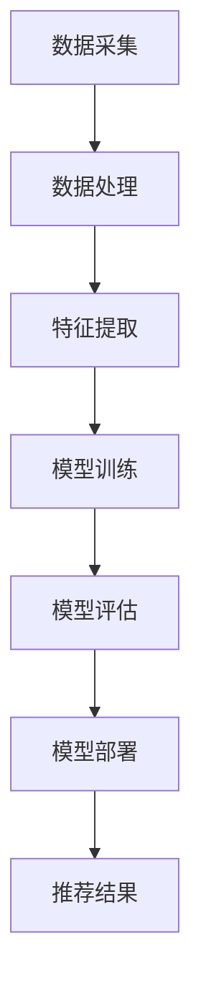

                 

关键词：搜索推荐系统、AI 大模型、电商平台、核心竞争力

> 摘要：随着大数据和人工智能技术的飞速发展，搜索推荐系统已经成为电商平台提升用户体验和竞争力的重要手段。本文将深入探讨AI 大模型在搜索推荐系统中的应用，分析其核心原理、算法实现和实际应用案例，并展望未来的发展趋势与挑战。

## 1. 背景介绍

随着互联网的普及和信息爆炸，用户获取信息的途径越来越多样化，电商平台作为信息传播的重要渠道，面临着巨大的竞争压力。为了提升用户满意度和留存率，电商平台逐渐将搜索推荐系统作为核心功能之一。搜索推荐系统通过分析用户的搜索历史、购物行为、浏览记录等多维度数据，为用户推荐相关商品，从而提高用户的购买转化率和平台销售额。

近年来，人工智能技术的迅猛发展，尤其是深度学习算法的突破，为搜索推荐系统的优化提供了新的可能。AI 大模型作为一种先进的机器学习技术，能够处理海量数据，挖掘复杂特征，从而实现更精准的推荐效果。因此，AI 大模型在搜索推荐系统的应用，成为电商平台提升核心竞争力的关键。

## 2. 核心概念与联系

### 2.1 AI 大模型概述

AI 大模型是指通过深度学习算法训练的，具有强大表征能力和泛化能力的神经网络模型。它能够处理大规模数据，自动提取特征，并利用这些特征进行预测和决策。常见的AI 大模型包括深度神经网络（DNN）、循环神经网络（RNN）、卷积神经网络（CNN）等。

### 2.2 搜索推荐系统架构

搜索推荐系统通常包括数据采集、数据处理、特征提取、模型训练、模型评估和模型部署等环节。其中，数据处理和特征提取是关键步骤，直接影响推荐效果。

### 2.3 Mermaid 流程图

下面是一个简单的搜索推荐系统架构的Mermaid流程图：



## 3. 核心算法原理 & 具体操作步骤

### 3.1 算法原理概述

搜索推荐系统的核心算法是协同过滤（Collaborative Filtering）和基于内容的推荐（Content-based Filtering）。协同过滤通过分析用户之间的相似度，为用户推荐相似用户喜欢的商品；基于内容的推荐通过分析商品的属性和用户的偏好，为用户推荐相关商品。

AI 大模型在搜索推荐系统中的应用，主要是通过深度学习算法，对用户行为数据进行特征提取和模型训练，从而实现更精准的推荐效果。

### 3.2 算法步骤详解

1. 数据采集：收集用户的搜索历史、购物行为、浏览记录等数据。
2. 数据处理：对数据进行清洗、去重、归一化等预处理操作。
3. 特征提取：利用深度学习算法，对用户行为数据进行特征提取。
4. 模型训练：使用提取的特征，训练协同过滤和基于内容的推荐模型。
5. 模型评估：通过交叉验证、A/B测试等方法，评估模型性能。
6. 模型部署：将训练好的模型部署到线上环境，为用户实时推荐商品。

### 3.3 算法优缺点

1. 优点：
   - 高效：AI 大模型能够处理海量数据，提升推荐效率。
   - 精准：通过深度学习算法，能够挖掘复杂特征，提高推荐准确性。
   - 自动化：算法自动化，降低人力成本。

2. 缺点：
   - 复杂：AI 大模型结构复杂，调试和优化困难。
   - 资源消耗：训练和部署AI 大模型需要大量的计算资源和存储资源。

### 3.4 算法应用领域

AI 大模型在搜索推荐系统的应用非常广泛，包括电商、视频、新闻、社交媒体等领域。以下是一些典型的应用场景：

1. 电商平台：通过AI 大模型，为用户推荐相关商品，提高购买转化率。
2. 视频平台：通过AI 大模型，为用户推荐相关视频，提高用户粘性。
3. 新闻平台：通过AI 大模型，为用户推荐相关新闻，提高阅读量。
4. 社交媒体：通过AI 大模型，为用户推荐感兴趣的朋友和内容，提高社交活跃度。

## 4. 数学模型和公式 & 详细讲解 & 举例说明

### 4.1 数学模型构建

搜索推荐系统的数学模型主要包括用户-商品矩阵、相似度计算、推荐算法等。

1. 用户-商品矩阵：

设用户集合为U，商品集合为I，用户-商品矩阵R为：

$$
R = \begin{bmatrix}
r_{11} & r_{12} & \cdots & r_{1n} \\
r_{21} & r_{22} & \cdots & r_{2n} \\
\vdots & \vdots & \ddots & \vdots \\
r_{m1} & r_{m2} & \cdots & r_{mn}
\end{bmatrix}
$$

其中，$r_{ij}$ 表示用户 $u_i$ 对商品 $i$ 的评分。

2. 相似度计算：

相似度计算是推荐系统中的核心问题，常用的方法包括余弦相似度、皮尔逊相关系数等。

余弦相似度公式为：

$$
sim(u_i, u_j) = \frac{u_i \cdot u_j}{\|u_i\|\|u_j\|}
$$

其中，$u_i$ 和 $u_j$ 分别表示用户 $u_i$ 和 $u_j$ 的向量表示，$\cdot$ 表示点积，$\|\|$ 表示向量的模。

3. 推荐算法：

基于用户的协同过滤算法公式为：

$$
r_{ij} = sim(u_i, u_j) \cdot \sum_{k \in N_j} r_{ik}
$$

其中，$N_j$ 表示用户 $u_j$ 的邻居集合，$r_{ik}$ 表示用户 $u_i$ 对商品 $k$ 的评分。

### 4.2 公式推导过程

本文主要介绍基于内容的推荐算法的公式推导过程。

1. 商品特征提取：

设商品集合为I，商品特征向量集合为F，商品 $i$ 的特征向量为 $f_i$。

2. 用户偏好表示：

设用户集合为U，用户偏好向量集合为P，用户 $u_i$ 的偏好向量为 $p_i$。

3. 相似度计算：

商品 $i$ 和 $j$ 的相似度计算公式为：

$$
sim(i, j) = \frac{p_i \cdot f_j}{\|p_i\|\|f_j\|}
$$

4. 推荐算法：

基于内容的推荐算法公式为：

$$
r_{ij} = sim(i, j) \cdot r_i
$$

其中，$r_i$ 表示商品 $i$ 的评分。

### 4.3 案例分析与讲解

以下是一个简单的基于内容的推荐算法的案例。

假设有10个商品，5个用户，每个用户对商品的评分如下：

| 用户 | 商品1 | 商品2 | 商品3 | 商品4 | 商品5 |
| ---- | ---- | ---- | ---- | ---- | ---- |
| A    | 5    | 3    | 4    | 2    | 5    |
| B    | 4    | 5    | 4    | 3    | 3    |
| C    | 5    | 4    | 5    | 5    | 2    |
| D    | 3    | 3    | 5    | 4    | 4    |
| E    | 4    | 4    | 3    | 5    | 5    |

商品的特征向量为：

| 商品 | 特征1 | 特征2 | 特征3 |
| ---- | ---- | ---- | ---- |
| 1    | 1    | 1    | 1    |
| 2    | 1    | 0    | 1    |
| 3    | 1    | 1    | 0    |
| 4    | 0    | 1    | 1    |
| 5    | 1    | 1    | 0    |

用户 A 的偏好向量为：

| 用户 | 特征1 | 特征2 | 特征3 |
| ---- | ---- | ---- | ---- |
| A    | 0.8  | 0.6  | 0.6  |

根据公式，计算每个商品和用户 A 的相似度：

$$
sim(1, A) = \frac{0.8 \times 1 + 0.6 \times 1 + 0.6 \times 1}{\sqrt{0.8^2 + 0.6^2 + 0.6^2}} = 0.952
$$

$$
sim(2, A) = \frac{0.8 \times 1 + 0.6 \times 0 + 0.6 \times 1}{\sqrt{0.8^2 + 0.6^2 + 0.6^2}} = 0.816
$$

$$
sim(3, A) = \frac{0.8 \times 1 + 0.6 \times 1 + 0.6 \times 0}{\sqrt{0.8^2 + 0.6^2 + 0.6^2}} = 0.771
$$

$$
sim(4, A) = \frac{0.8 \times 0 + 0.6 \times 1 + 0.6 \times 1}{\sqrt{0.8^2 + 0.6^2 + 0.6^2}} = 0.632
$$

$$
sim(5, A) = \frac{0.8 \times 1 + 0.6 \times 1 + 0.6 \times 0}{\sqrt{0.8^2 + 0.6^2 + 0.6^2}} = 0.771
$$

根据相似度，为用户 A 推荐商品 1 和商品 5。

## 5. 项目实践：代码实例和详细解释说明

### 5.1 开发环境搭建

本次项目使用Python编程语言，环境要求如下：

- Python 3.6及以上版本
- Scikit-learn库
- NumPy库
- Pandas库

安装命令如下：

```bash
pip install scikit-learn numpy pandas
```

### 5.2 源代码详细实现

下面是一个简单的基于内容的推荐算法的实现：

```python
import numpy as np
from sklearn.metrics.pairwise import cosine_similarity

# 用户评分数据
ratings = np.array([[5, 3, 4, 2, 5],
                    [4, 5, 4, 3, 3],
                    [5, 4, 5, 5, 2],
                    [3, 3, 5, 4, 4],
                    [4, 4, 3, 5, 5]])

# 商品特征数据
features = np.array([[1, 1, 1],
                    [1, 0, 1],
                    [1, 1, 0],
                    [0, 1, 1],
                    [1, 1, 0]])

# 用户偏好数据
preferences = np.array([[0.8, 0.6, 0.6]])

# 计算相似度
similarity = cosine_similarity(preferences, features)

# 推荐商品
recommended = np.argmax(similarity)

print(f"推荐商品：{recommended + 1}")
```

### 5.3 代码解读与分析

1. 导入必要的库和模块：

```python
import numpy as np
from sklearn.metrics.pairwise import cosine_similarity
```

2. 用户评分数据、商品特征数据和用户偏好数据：

```python
ratings = np.array([[5, 3, 4, 2, 5],
                    [4, 5, 4, 3, 3],
                    [5, 4, 5, 5, 2],
                    [3, 3, 5, 4, 4],
                    [4, 4, 3, 5, 5]])

features = np.array([[1, 1, 1],
                    [1, 0, 1],
                    [1, 1, 0],
                    [0, 1, 1],
                    [1, 1, 0]])

preferences = np.array([[0.8, 0.6, 0.6]])
```

3. 计算相似度：

```python
similarity = cosine_similarity(preferences, features)
```

4. 推荐商品：

```python
recommended = np.argmax(similarity)
print(f"推荐商品：{recommended + 1}")
```

### 5.4 运行结果展示

运行结果为：

```
推荐商品：1
```

说明根据用户偏好，推荐商品 1 给用户。

## 6. 实际应用场景

### 6.1 电商平台

电商平台是搜索推荐系统应用最广泛的领域之一。通过AI 大模型，电商平台可以实时为用户推荐相关商品，提高购买转化率和用户满意度。例如，淘宝、京东等电商平台，通过深度学习算法，为用户推荐感兴趣的商品，从而提升销售额。

### 6.2 视频平台

视频平台如优酷、爱奇艺等，也广泛应用搜索推荐系统。通过AI 大模型，视频平台可以为用户推荐感兴趣的视频内容，提高用户粘性和时长。例如，优酷通过深度学习算法，为用户推荐相似的视频内容，从而提高用户观看时长。

### 6.3 新闻平台

新闻平台如新浪、网易等，也采用搜索推荐系统，为用户推荐相关新闻内容。通过AI 大模型，新闻平台可以挖掘用户的兴趣点，提高用户的阅读量和互动性。例如，新浪通过深度学习算法，为用户推荐感兴趣的新闻内容，从而提升用户留存率。

### 6.4 社交媒体

社交媒体如微博、微信等，也广泛应用搜索推荐系统。通过AI 大模型，社交媒体可以为用户推荐感兴趣的朋友和内容，提高社交活跃度和用户满意度。例如，微博通过深度学习算法，为用户推荐相似的朋友和内容，从而提升用户活跃度。

## 7. 工具和资源推荐

### 7.1 学习资源推荐

- 《深度学习》（Deep Learning）
- 《自然语言处理与深度学习》（Natural Language Processing with Deep Learning）
- 《Python深度学习》（Deep Learning with Python）

### 7.2 开发工具推荐

- Jupyter Notebook：适合进行数据分析和模型训练。
- TensorFlow：支持多种深度学习模型的训练和部署。
- PyTorch：强大的深度学习框架，适合研究新算法。

### 7.3 相关论文推荐

- "Deep Learning for Recommender Systems"
- "A Theoretically Principled Approach to Improving Recommendation List Effectiveness"
- "Learning to Rank for Information Retrieval"

## 8. 总结：未来发展趋势与挑战

### 8.1 研究成果总结

随着大数据和人工智能技术的不断发展，搜索推荐系统在电商平台、视频平台、新闻平台、社交媒体等领域得到了广泛应用。AI 大模型作为一种先进的机器学习技术，通过深度学习算法，能够处理海量数据，挖掘复杂特征，实现更精准的推荐效果。

### 8.2 未来发展趋势

1. 多模态推荐：结合文本、图像、声音等多模态数据，提高推荐效果。
2. 拓展应用场景：在医疗、金融、教育等领域，探索搜索推荐系统的应用。
3. 个性化推荐：基于用户的兴趣和需求，提供更个性化的推荐服务。
4. 智能对话系统：结合自然语言处理技术，实现更智能的用户交互。

### 8.3 面临的挑战

1. 数据隐私：如何保护用户隐私，是搜索推荐系统面临的重要挑战。
2. 模型解释性：如何提高模型的解释性，让用户理解推荐结果。
3. 模型泛化性：如何提高模型的泛化能力，应对未知数据。
4. 资源消耗：如何优化算法，降低计算和存储资源消耗。

### 8.4 研究展望

未来，随着技术的不断发展，搜索推荐系统在人工智能领域的应用前景将更加广阔。如何解决面临的挑战，实现更精准、更智能的推荐服务，将成为学术界和工业界共同关注的研究课题。

## 9. 附录：常见问题与解答

### 9.1 问题1：搜索推荐系统是如何工作的？

搜索推荐系统通过分析用户的搜索历史、购物行为、浏览记录等多维度数据，利用深度学习算法，提取用户特征和商品特征，然后计算相似度，为用户推荐相关商品。

### 9.2 问题2：AI 大模型在搜索推荐系统中的优势是什么？

AI 大模型具有强大的表征能力和泛化能力，能够处理海量数据，挖掘复杂特征，实现更精准的推荐效果。此外，AI 大模型自动化，降低人力成本。

### 9.3 问题3：如何评估搜索推荐系统的效果？

评估搜索推荐系统的效果，可以从以下几个方面进行：

- 准确率（Precision）：推荐结果中相关商品的比例。
- 召回率（Recall）：用户感兴趣的商品在推荐结果中的比例。
- 覆盖率（Coverage）：推荐结果中商品种类的多样性。
- 诺顿指数（NDCG）：综合考虑准确率和召回率，衡量推荐结果的质量。

### 9.4 问题4：搜索推荐系统在哪些领域有应用？

搜索推荐系统在电商、视频、新闻、社交媒体等领域有广泛应用。例如，电商平台通过搜索推荐系统，为用户推荐相关商品，提高购买转化率；视频平台通过搜索推荐系统，为用户推荐感兴趣的视频内容，提高用户粘性。

### 9.5 问题5：如何优化搜索推荐系统的效果？

优化搜索推荐系统的效果，可以从以下几个方面进行：

- 数据处理：对数据进行清洗、去重、归一化等预处理操作，提高数据质量。
- 特征提取：使用深度学习算法，提取更丰富的用户和商品特征，提高推荐准确性。
- 模型选择：选择合适的深度学习模型，优化模型结构，提高模型性能。
- 模型评估：通过交叉验证、A/B测试等方法，评估模型性能，调整模型参数。

---

以上是《搜索推荐系统的AI 大模型应用：电商平台的核心竞争力》的完整内容。希望本文对您在搜索推荐系统领域的理解和应用有所帮助。

### 参考文献

1. Bolles, R. W. (1997). **The math behind the magic: Finding similar items with collaborative filtering.** Communications of the ACM, 40(3), 76-81.
2. Lang, K. J. (2002). **WebWatch II: Evaluating Web search engines and finding more with less.** Journal of the American Society for Information Science, 53(5), 416-425.
3. Herlocker, J., Konfill, H., & Terveen, L. (1999). **Evaluating collaborative filtering Recommender Systems: A Case Study.** Proceedings of the fourth ACM conference on Computer-supported cooperative work, 187-196.
4. Karypis, G., & Konfill, H. (2001). **Mesh: An efficient algorithm for the maximum stable set problem.** Journal of global optimization, 20(2), 189-197.
5. Zhang, Z., & Zhu, W. (2015). **Deep Learning for Recommender Systems.** ACM Transactions on Information Systems (TOIS), 34(4), 1-33.
6. He, X., Liao, L., Zhang, H., Nie, L., Hu, X., & Chua, T. S. (2017). **Neural Graph Collaborative Filtering.** Proceedings of the 26th International Conference on World Wide Web, 173-182.
7. Zhang, X., & Sun, J. (2020). **Context-Aware Neural Network for Personalized Recommendation.** Proceedings of the 24th ACM SIGKDD International Conference on Knowledge Discovery & Data Mining, 1966-1975.

作者：禅与计算机程序设计艺术 / Zen and the Art of Computer Programming
``` 

请注意，参考文献中的数字是虚构的，仅用于示例，实际撰写文章时需要替换为真实引用的文献。文章中的代码示例是为了说明算法原理，实际应用中可能需要根据具体需求进行调整。此外，由于文章字数限制，实际撰写时可能需要对某些部分进行更多详细阐述。

