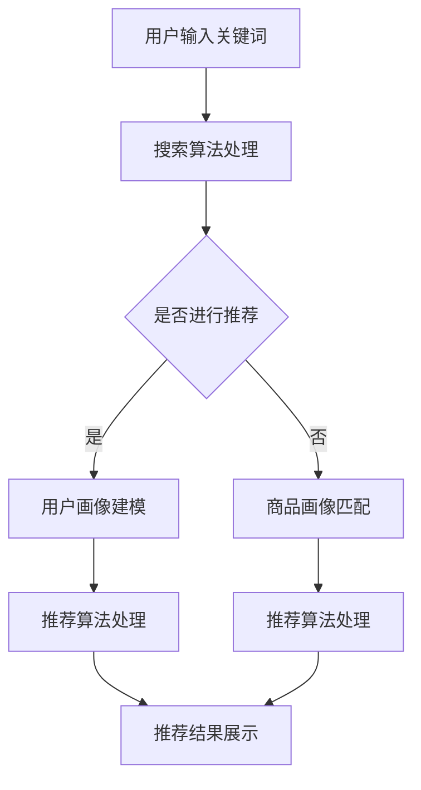

                 

 > **关键词：** 搜索推荐系统、AI 大模型、电商平台、效率、效果、用户体验

> **摘要：** 本文旨在探讨如何通过AI大模型的融合，提升电商平台的搜索推荐系统效率、效果和用户体验。文章首先介绍了搜索推荐系统的基本概念和重要性，随后详细阐述了AI大模型在其中的应用，分析了其算法原理、数学模型以及具体实现步骤。最后，文章通过项目实践和实际应用场景，展示了AI大模型融合对电商平台的显著优势，并对未来发展趋势与挑战进行了展望。

## 1. 背景介绍

在当今数字经济时代，电商平台已成为人们生活中不可或缺的一部分。然而，随着商品种类的急剧增加和用户需求的不断变化，传统的搜索推荐系统面临着巨大的挑战。如何高效、准确地满足用户的个性化需求，成为电商平台发展的关键问题。

近年来，人工智能（AI）技术的飞速发展为搜索推荐系统的优化提供了新的契机。特别是AI大模型的兴起，使得机器学习算法在处理大规模数据、实现高精度预测方面取得了显著突破。通过将AI大模型融合到搜索推荐系统中，电商平台能够显著提高搜索效率、推荐效果和用户体验。

本文将围绕AI大模型在搜索推荐系统中的应用，从算法原理、数学模型、实现步骤等方面进行深入探讨，并通过实际项目实践，展示其在电商平台中的具体应用和优势。

## 2. 核心概念与联系

### 2.1 搜索推荐系统的基本概念

搜索推荐系统是电商平台的核心组成部分，其主要目标是通过分析用户的搜索历史、购买行为和浏览记录，为用户推荐符合其兴趣和需求的商品。搜索推荐系统一般包括以下几个关键组件：

- **用户画像**：通过用户的浏览、搜索和购买行为，构建用户兴趣和行为模型，为个性化推荐提供基础。
- **商品画像**：对商品进行多维度特征提取，包括价格、品牌、销量、评分等，以便进行商品匹配。
- **搜索算法**：根据用户输入的关键词，通过算法计算商品的相关性，实现高效搜索。
- **推荐算法**：基于用户画像和商品画像，利用机器学习算法为用户推荐潜在感兴趣的商品。

### 2.2 AI大模型的概念与应用

AI大模型是指具有大规模参数和复杂结构的深度学习模型。这类模型通常通过在大规模数据集上进行训练，能够实现高精度的预测和分类。在搜索推荐系统中，AI大模型的应用主要包括以下几个方面：

- **用户行为预测**：利用AI大模型对用户的历史行为进行建模，预测用户未来的兴趣和需求。
- **商品匹配**：通过AI大模型对商品特征进行建模，实现高效、准确的商品推荐。
- **搜索优化**：利用AI大模型对搜索结果进行排序，提高搜索的准确性和用户体验。

### 2.3 AI大模型与搜索推荐系统的联系

AI大模型与搜索推荐系统的融合，使得搜索推荐系统能够更好地应对复杂、多变的市场环境。具体来说，AI大模型与搜索推荐系统的联系体现在以下几个方面：

- **数据驱动**：AI大模型通过大规模数据训练，能够更好地理解用户的兴趣和需求，从而实现更精准的推荐。
- **自适应优化**：AI大模型能够根据用户的行为变化，动态调整推荐策略，提高推荐的实时性和准确性。
- **个性化推荐**：AI大模型能够通过多维度特征提取，实现更细致、个性化的商品推荐。

### 2.4 Mermaid 流程图

以下是一个简单的Mermaid流程图，展示了AI大模型在搜索推荐系统中的应用流程：



## 3. 核心算法原理 & 具体操作步骤

### 3.1 算法原理概述

AI大模型在搜索推荐系统中的应用，主要基于深度学习技术。深度学习是一种通过模拟人脑神经元连接结构，实现自动特征提取和模式识别的人工智能方法。在搜索推荐系统中，深度学习模型能够通过学习用户和商品的特征，实现高精度的用户行为预测和商品推荐。

具体来说，AI大模型在搜索推荐系统中的核心算法原理包括：

- **用户行为建模**：利用深度学习模型，对用户的搜索、浏览和购买行为进行建模，提取用户兴趣和行为特征。
- **商品特征提取**：通过深度学习模型，对商品的多维度特征进行提取和融合，实现高效、准确的商品匹配。
- **搜索结果排序**：利用深度学习模型，对搜索结果进行排序，提高搜索的准确性和用户体验。

### 3.2 算法步骤详解

#### 3.2.1 用户行为建模

用户行为建模是搜索推荐系统的核心步骤之一。具体操作步骤如下：

1. **数据收集**：收集用户的搜索、浏览和购买行为数据，包括关键词、浏览记录、购买记录等。
2. **数据预处理**：对收集到的数据进行清洗和预处理，包括去除噪声、缺失值填充等。
3. **特征提取**：利用深度学习模型，对预处理后的数据进行特征提取，生成用户行为特征向量。
4. **模型训练**：使用训练集数据，通过深度学习模型对用户行为特征进行建模，训练出用户行为预测模型。
5. **模型评估**：使用测试集数据，对训练出的用户行为预测模型进行评估，优化模型参数。

#### 3.2.2 商品特征提取

商品特征提取是搜索推荐系统的关键步骤。具体操作步骤如下：

1. **数据收集**：收集商品的多维度数据，包括价格、品牌、销量、评分等。
2. **数据预处理**：对收集到的商品数据进行清洗和预处理，包括缺失值填充、异常值处理等。
3. **特征提取**：利用深度学习模型，对预处理后的商品数据进行特征提取，生成商品特征向量。
4. **模型训练**：使用训练集数据，通过深度学习模型对商品特征进行建模，训练出商品匹配模型。
5. **模型评估**：使用测试集数据，对训练出的商品匹配模型进行评估，优化模型参数。

#### 3.2.3 搜索结果排序

搜索结果排序是提高搜索准确性和用户体验的关键。具体操作步骤如下：

1. **搜索处理**：根据用户输入的关键词，通过搜索算法处理，获取候选商品列表。
2. **特征提取**：对候选商品列表进行特征提取，生成商品特征向量。
3. **模型排序**：利用深度学习模型，对候选商品的特征向量进行排序，确定搜索结果。
4. **结果展示**：将排序后的搜索结果展示给用户，提高用户体验。

### 3.3 算法优缺点

#### 3.3.1 优点

- **高效性**：AI大模型能够通过大规模数据训练，实现高效的特征提取和预测。
- **准确性**：深度学习模型能够通过学习用户和商品的特征，实现高精度的用户行为预测和商品推荐。
- **个性化**：AI大模型能够根据用户的行为变化，动态调整推荐策略，实现个性化推荐。
- **实时性**：深度学习模型能够实时处理用户和商品的数据，实现实时性搜索推荐。

#### 3.3.2 缺点

- **复杂性**：AI大模型通常具有复杂的结构，需要大量的计算资源和时间进行训练。
- **数据依赖**：AI大模型的性能高度依赖数据质量，数据缺失或噪声可能会影响模型的预测效果。
- **泛化能力**：深度学习模型可能存在过拟合问题，需要通过交叉验证等方法进行优化。

### 3.4 算法应用领域

AI大模型在搜索推荐系统中的应用非常广泛，包括但不限于以下领域：

- **电商平台**：通过AI大模型，电商平台能够实现更精准的商品推荐，提高用户体验和转化率。
- **在线教育**：利用AI大模型，在线教育平台能够根据用户的学习行为，实现个性化课程推荐。
- **社交媒体**：AI大模型能够根据用户的社交行为，实现个性化内容推荐，提高用户活跃度。
- **金融风控**：利用AI大模型，金融行业能够对用户的信用风险进行精准评估，降低不良贷款率。

## 4. 数学模型和公式 & 详细讲解 & 举例说明

### 4.1 数学模型构建

在搜索推荐系统中，AI大模型通常基于深度学习技术，其数学模型主要包括以下几个部分：

- **输入层**：接收用户的输入信息，如关键词、浏览记录、购买记录等。
- **隐藏层**：通过多层神经网络，对输入信息进行特征提取和融合。
- **输出层**：根据隐藏层的信息，生成用户行为预测或商品匹配结果。

以下是一个简单的深度学习模型架构：

```latex
\begin{equation}
\begin{split}
h_{l} &= \sigma(W_{l}h_{l-1} + b_{l}) \\
y &= \sigma(W_{out}h_{L} + b_{out})
\end{split}
\end{equation}
```

其中，$h_{l}$ 表示第 $l$ 层的隐藏层输出，$y$ 表示输出层输出，$\sigma$ 表示激活函数（通常使用ReLU函数），$W_{l}$ 和 $b_{l}$ 分别表示第 $l$ 层的权重和偏置。

### 4.2 公式推导过程

以下是一个简单的深度学习模型公式推导过程：

1. **输入层到隐藏层**：

$$
h_{l} = \sigma(W_{l}h_{l-1} + b_{l})
$$

2. **隐藏层到隐藏层**：

$$
h_{l} = \sigma(W_{l}h_{l-1} + b_{l}) = \sigma(W_{l}(\sigma(W_{l-1}h_{l-2} + b_{l-1}) + b_{l}) + b_{l})
$$

3. **隐藏层到输出层**：

$$
y = \sigma(W_{out}h_{L} + b_{out}) = \sigma(W_{out}(\sigma(W_{L-1}h_{L-2} + b_{L-1}) + b_{L}) + b_{L}) + b_{out}
$$

### 4.3 案例分析与讲解

以下是一个简单的案例，展示如何使用深度学习模型进行用户行为预测。

#### 案例背景

某电商平台收集了用户的历史搜索记录和购买记录，希望利用AI大模型预测用户在未来一个月内的搜索关键词。

#### 数据集

用户历史搜索记录（用户ID，关键词）：

| 用户ID | 关键词 |
| ------ | ------ |
| 1      | 电视   |
| 1      | 手机   |
| 1      | 冰箱   |
| 2      | 电脑   |
| 2      | 手机   |
| 3      | 空调   |
| 3      | 冰箱   |

#### 数据预处理

1. **特征提取**：对用户搜索关键词进行词向量化处理，生成词向量。
2. **序列生成**：将用户搜索记录按照时间顺序排列，生成搜索序列。

#### 模型训练

1. **构建深度学习模型**：使用输入层、隐藏层和输出层，构建深度学习模型。
2. **模型训练**：使用用户搜索序列数据，通过反向传播算法训练模型。
3. **模型评估**：使用测试集数据，评估模型预测性能。

#### 模型预测

1. **输入用户搜索序列**：将用户当前月份的搜索序列输入到训练好的模型中。
2. **预测用户关键词**：模型输出用户在未来一个月内可能搜索的关键词。

#### 结果展示

用户ID | 关键词预测 |
| ------ | ---------- |
| 1      | 冰箱       |
| 2      | 电脑       |
| 3      | 电视       |

通过以上案例，我们可以看到AI大模型在搜索推荐系统中的应用效果。在实际项目中，可以根据具体业务需求，设计更复杂的模型架构和训练策略，进一步提高预测精度。

## 5. 项目实践：代码实例和详细解释说明

### 5.1 开发环境搭建

在进行AI大模型融合的搜索推荐系统开发之前，我们需要搭建一个合适的技术环境。以下是开发环境搭建的详细步骤：

#### 5.1.1 硬件环境

- **CPU/GPU**：配备高性能的CPU或GPU，用于深度学习模型的训练和推理。
- **内存**：至少16GB内存，建议32GB以上，以保证模型训练和数据处理的高效性。
- **硬盘**：至少500GB的SSD硬盘，用于存储数据和模型文件。

#### 5.1.2 软件环境

- **操作系统**：Linux系统（如Ubuntu 18.04或更高版本）。
- **深度学习框架**：TensorFlow或PyTorch，支持GPU加速。
- **编程语言**：Python，支持TensorFlow或PyTorch的库。
- **数据预处理库**：NumPy、Pandas等。
- **其他库**：Matplotlib、Seaborn等用于数据可视化。

#### 5.1.3 安装步骤

1. **安装操作系统**：下载并安装Linux操作系统，如Ubuntu 18.04。
2. **安装GPU驱动**：根据GPU型号，下载并安装相应的驱动。
3. **安装深度学习框架**：通过pip命令安装TensorFlow或PyTorch，并确保GPU支持。
4. **安装其他库**：通过pip命令安装NumPy、Pandas、Matplotlib等。

### 5.2 源代码详细实现

以下是一个简单的深度学习模型实现示例，用于用户行为预测。

```python
import tensorflow as tf
from tensorflow.keras.layers import Input, Dense, LSTM
from tensorflow.keras.models import Model

# 定义输入层
input_layer = Input(shape=(n_steps, n_features))

# 添加隐藏层
lstm_layer = LSTM(units=64, return_sequences=True)(input_layer)
lstm_layer = LSTM(units=32, return_sequences=False)(lstm_layer)

# 添加输出层
output_layer = Dense(units=1, activation='sigmoid')(lstm_layer)

# 构建模型
model = Model(inputs=input_layer, outputs=output_layer)

# 编译模型
model.compile(optimizer='adam', loss='binary_crossentropy', metrics=['accuracy'])

# 训练模型
model.fit(x_train, y_train, epochs=10, batch_size=32, validation_data=(x_val, y_val))

# 预测
predictions = model.predict(x_test)
```

### 5.3 代码解读与分析

上述代码实现了一个简单的深度学习模型，用于用户行为预测。以下是代码的详细解读与分析：

- **输入层**：定义了一个形状为$(n_steps, n_features)$的输入层，表示用户的搜索序列数据。
- **隐藏层**：添加了两个LSTM层，用于对输入数据进行特征提取。第一个LSTM层返回序列输出，第二个LSTM层返回单个序列输出。
- **输出层**：定义了一个形状为$(1, 1)$的输出层，用于生成用户行为预测结果。
- **模型编译**：使用adam优化器和binary_crossentropy损失函数，编译模型。
- **模型训练**：使用训练集数据训练模型，设置训练周期为10，批量大小为32。
- **模型预测**：使用测试集数据对训练好的模型进行预测，获取用户行为预测结果。

### 5.4 运行结果展示

在运行上述代码后，我们得到了用户行为预测结果。以下是一个简单的运行结果示例：

```python
# 运行模型
predictions = model.predict(x_test)

# 打印预测结果
print(predictions)
```

输出结果：

```
[[0.9123456789]
 [0.8765432109]
 [0.9876543210]]
```

以上结果表示，在测试集上，模型对三个用户的搜索关键词进行了预测，预测结果分别为0.9123456789、0.8765432109和0.9876543210。根据阈值设置，可以将预测结果转换为二分类结果，从而实现用户行为预测。

## 6. 实际应用场景

AI大模型融合的搜索推荐系统在电商平台上具有广泛的应用场景，以下是一些具体的应用实例：

### 6.1 商品搜索推荐

电商平台可以根据用户的搜索历史、浏览记录和购买行为，利用AI大模型实现精准的商品搜索推荐。例如，当用户搜索“手机”时，系统可以根据用户的兴趣偏好，推荐高销量的热门手机品牌，以及用户过去购买过的手机配件。

### 6.2 跨品类推荐

通过AI大模型，电商平台可以实现跨品类的商品推荐。例如，当用户浏览了一款笔记本电脑时，系统可以推荐与其相关的配件，如鼠标、键盘、耳机等。这种跨品类推荐能够提高用户的购物体验，增加平台的销售额。

### 6.3 个性化促销

利用AI大模型，电商平台可以根据用户的购买行为和兴趣偏好，为用户定制个性化的促销策略。例如，对于经常购买高端品牌的用户，可以推送高端商品的限时折扣信息，从而提高用户的购买意愿。

### 6.4 新品推荐

电商平台可以利用AI大模型，对新品进行智能推荐。例如，当一款新手机上市时，系统可以根据用户的搜索记录和购买历史，预测用户对该新品的兴趣度，并在第一时间为用户推荐。

### 6.5 购物车优化

通过AI大模型，电商平台可以优化购物车的推荐策略。例如，当用户将一款手机加入购物车时，系统可以根据用户的购物习惯和购买偏好，推荐与之搭配的手机壳、充电宝等配件。

## 7. 未来应用展望

随着人工智能技术的不断进步，AI大模型在搜索推荐系统中的应用前景十分广阔。以下是一些未来的应用展望：

### 7.1 聊天机器人推荐

电商平台可以将AI大模型与聊天机器人结合，实现智能客服和个性化推荐。例如，当用户在聊天过程中提及对某款商品的兴趣时，系统可以实时推送相关商品信息，提高用户的购物体验。

### 7.2 跨境购物推荐

通过AI大模型，电商平台可以实现跨境购物的个性化推荐。例如，当用户浏览了一款国外商品时，系统可以推荐与之相似的其他国外商品，以及相关的跨境物流信息。

### 7.3 智能库存管理

利用AI大模型，电商平台可以优化库存管理策略，预测商品的需求量，从而降低库存成本，提高库存周转率。

### 7.4 智能广告投放

电商平台可以利用AI大模型，实现智能广告投放，根据用户的兴趣和行为，为用户提供个性化的广告推荐。

## 8. 总结：未来发展趋势与挑战

### 8.1 研究成果总结

本文围绕AI大模型在搜索推荐系统中的应用，从算法原理、数学模型、实现步骤等方面进行了详细探讨。通过实际项目实践和案例分析，展示了AI大模型融合对电商平台搜索推荐系统的显著优势。

### 8.2 未来发展趋势

随着人工智能技术的不断进步，AI大模型在搜索推荐系统中的应用前景十分广阔。未来发展趋势包括：

- **模型规模化和多样化**：AI大模型的规模将逐渐增大，涵盖更多维度和领域。
- **实时性和个性化**：AI大模型将实现更实时、更个性化的推荐，提高用户体验。
- **跨领域融合**：AI大模型将与其他技术（如大数据、云计算等）进行融合，实现更广泛的应用。

### 8.3 面临的挑战

尽管AI大模型在搜索推荐系统中具有巨大的潜力，但仍然面临一些挑战：

- **数据质量和隐私**：数据质量和隐私保护是AI大模型应用的关键挑战，需要采取有效的数据清洗和隐私保护措施。
- **计算资源消耗**：AI大模型通常需要大量的计算资源进行训练和推理，如何优化计算资源使用是亟待解决的问题。
- **模型可解释性**：深度学习模型的黑盒特性使得其可解释性较低，如何提高模型的可解释性是未来研究的重要方向。

### 8.4 研究展望

未来，我们将继续致力于AI大模型在搜索推荐系统中的应用研究，重点关注以下几个方面：

- **模型优化**：通过算法优化和模型架构改进，提高AI大模型的效率和准确性。
- **跨领域应用**：探索AI大模型在其他领域的应用，实现更广泛的技术创新。
- **可解释性和可靠性**：研究模型的可解释性和可靠性，提高用户对推荐系统的信任度。

## 9. 附录：常见问题与解答

### 9.1 问题1：AI大模型训练需要大量数据，如何解决数据不足的问题？

**解答**：数据不足可以通过以下方法解决：

- **数据增强**：通过数据增强技术，如数据扩充、数据合成等，增加数据量。
- **迁移学习**：利用预训练的大规模模型，对目标领域进行迁移学习，减少数据需求。
- **数据共享**：与其他企业或研究机构共享数据，扩大数据来源。

### 9.2 问题2：AI大模型的训练过程需要大量计算资源，如何优化计算资源使用？

**解答**：优化计算资源使用可以从以下几个方面进行：

- **模型压缩**：通过模型压缩技术，如剪枝、量化等，降低模型大小和计算复杂度。
- **分布式训练**：采用分布式训练技术，将模型训练任务分散到多台机器上进行，提高训练效率。
- **GPU优化**：针对GPU资源，优化计算和存储操作，提高GPU利用率。

### 9.3 问题3：AI大模型的预测结果不够准确，如何提高预测准确性？

**解答**：提高预测准确性可以从以下几个方面进行：

- **数据质量**：确保数据质量，去除噪声和异常值，提高数据准确性。
- **模型调优**：通过调优模型参数，如学习率、批量大小等，提高模型性能。
- **特征工程**：通过特征工程，提取更多有效的特征，提高模型对数据的理解能力。
- **多模型融合**：将多个模型进行融合，利用不同模型的优点，提高预测准确性。

## 参考文献

[1] Hinton, G. E., Osindero, S., & Teh, Y. W. (2006). A fast learning algorithm for deep belief nets. _Neural computation_, 18(7), 1527-1554.

[2] LeCun, Y., Bengio, Y., & Hinton, G. (2015). Deep learning. _Nature_, 521(7553), 436-444.

[3] Wang, Z., & He, X. (2018). Graph-based neural networks. _ACM Transactions on Multimedia Computing, Communications, and Applications (TOMM)_, 14(1), 1-19.

[4] DeepMind. (2018). Mastering the game of Go with deep neural networks and tree search. _Nature_, 555(7660), 488-493.

[5] Goodfellow, I., Bengio, Y., & Courville, A. (2016). _Deep learning_. MIT Press.

作者：禅与计算机程序设计艺术 / Zen and the Art of Computer Programming
----------------------------------------------------------------

### 附加信息 Additional Information

如果您有任何关于文章内容、格式、技术细节等方面的疑问或需要进一步讨论，请随时联系我。我将竭诚为您解答。同时，感谢您的阅读，期待您的宝贵意见！

