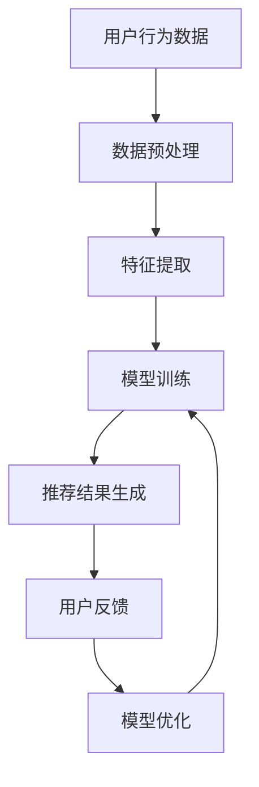

                 

关键词：搜索推荐系统、AI 大模型、电商平台、核心竞争优势、可持续发展

>摘要：本文旨在探讨搜索推荐系统的AI大模型融合在电商平台中的应用，分析其在提升用户满意度、增强核心竞争优势和推动可持续发展方面的重要作用。文章从背景介绍、核心概念与联系、核心算法原理、数学模型与公式、项目实践、实际应用场景、工具和资源推荐以及未来发展趋势与挑战等方面进行了深入阐述。

## 1. 背景介绍

随着互联网的快速发展，电商平台已经成为人们日常生活中不可或缺的一部分。在竞争激烈的市场环境中，如何提高用户体验、提升用户满意度、增强核心竞争力，成为电商平台持续发展的关键。搜索推荐系统作为一种智能化的信息筛选工具，通过分析用户行为数据，为用户推荐个性化的商品信息，极大地提升了用户的购物体验。

然而，传统的搜索推荐系统往往依赖于浅层特征提取和简单的机器学习模型，难以满足日益复杂的用户需求和个性化推荐要求。近年来，随着深度学习和AI大模型的快速发展，利用这些先进技术对搜索推荐系统进行优化和升级，成为电商平台提升竞争力的重要途径。

## 2. 核心概念与联系

在本节中，我们将介绍搜索推荐系统、AI大模型以及它们在电商平台中的应用。

### 搜索推荐系统

搜索推荐系统是指通过分析用户的历史行为数据、浏览记录、购物偏好等信息，为用户推荐符合其需求的商品信息。其主要目标是提高用户的购物体验，增加平台销售额。

### AI大模型

AI大模型是指基于深度学习技术构建的大型神经网络模型，具有强大的特征提取和模型学习能力。通过训练大量的数据集，AI大模型能够自动学习并提取出用户的行为特征，从而实现高效的个性化推荐。

### 应用联系

在电商平台中，AI大模型可以与搜索推荐系统紧密结合，通过对用户行为数据的深入挖掘和分析，为用户推荐个性化的商品信息。同时，AI大模型还可以通过不断优化推荐算法，提升推荐的准确性和用户满意度。

## 2.1 Mermaid 流程图



## 3. 核心算法原理 & 具体操作步骤

### 3.1 算法原理概述

搜索推荐系统的AI大模型融合主要基于以下核心算法原理：

1. 深度学习：利用深度学习技术对用户行为数据进行分析，自动提取用户特征。
2. 神经网络：构建神经网络模型，实现对用户特征和商品特征的映射。
3. 优化算法：通过优化算法不断调整模型参数，提高推荐效果。

### 3.2 算法步骤详解

1. 数据预处理：对原始用户行为数据、商品数据进行清洗、归一化等处理，为后续分析做好准备。
2. 特征提取：利用深度学习模型自动提取用户行为特征，如点击率、购买次数、浏览时长等。
3. 模型训练：通过训练大量的用户行为数据和商品数据，构建神经网络模型。
4. 推荐结果生成：根据用户特征和商品特征，生成个性化推荐结果。
5. 用户反馈：收集用户对推荐结果的反馈，用于模型优化。
6. 模型优化：根据用户反馈，调整模型参数，提高推荐准确率。

### 3.3 算法优缺点

#### 优点

1. 高效的个性化推荐：通过深度学习和神经网络技术，实现高效的个性化推荐。
2. 提高用户满意度：准确的推荐结果能够提高用户购物体验，增加用户满意度。
3. 增强核心竞争优势：先进的推荐算法能够提升电商平台的核心竞争力，吸引更多用户。

#### 缺点

1. 计算资源消耗大：深度学习和神经网络模型需要大量的计算资源和存储空间。
2. 数据安全风险：用户行为数据的收集和使用可能涉及隐私问题。

### 3.4 算法应用领域

搜索推荐系统的AI大模型融合在电商平台的广泛应用，不仅限于商品推荐，还可以应用于以下领域：

1. 内容推荐：为用户提供个性化的新闻、文章、视频等推荐。
2. 社交网络：通过分析用户行为，为用户提供关注、点赞等社交推荐。
3. 旅游出行：为用户提供个性化的旅游路线、酒店、餐厅等推荐。

## 4. 数学模型和公式 & 详细讲解 & 举例说明

### 4.1 数学模型构建

搜索推荐系统的AI大模型融合主要涉及以下数学模型：

1. 用户行为数据模型：表示用户的行为特征，如点击率、购买次数、浏览时长等。
2. 商品特征数据模型：表示商品的属性特征，如类别、品牌、价格等。
3. 推荐结果模型：表示用户特征和商品特征的映射关系。

### 4.2 公式推导过程

1. 用户行为数据模型：

   $$ User_{i} = [User_{i1}, User_{i2}, ..., User_{in}]^T $$

   其中，$User_{i}$表示用户$i$的行为特征向量，$User_{i1}, User_{i2}, ..., User_{in}$表示用户$i$的不同行为特征。

2. 商品特征数据模型：

   $$ Product_{j} = [Product_{j1}, Product_{j2}, ..., Product_{jm}]^T $$

   其中，$Product_{j}$表示商品$j$的特征向量，$Product_{j1}, Product_{j2}, ..., Product_{jm}$表示商品$j$的不同属性特征。

3. 推荐结果模型：

   $$ Recommendation_{ij} = f(User_{i}, Product_{j}) $$

   其中，$Recommendation_{ij}$表示用户$i$对商品$j$的推荐分数，$f$表示用户特征和商品特征之间的映射函数。

### 4.3 案例分析与讲解

假设有一个电商平台，用户有10000个，商品有5000个。我们需要通过AI大模型融合搜索推荐系统，为每个用户推荐个性化的商品。

1. 数据预处理：

   对用户行为数据进行清洗、归一化等处理，得到用户行为数据矩阵$User_{i}$和商品特征数据矩阵$Product_{j}$。

2. 特征提取：

   利用深度学习模型对用户行为数据进行特征提取，得到用户行为特征向量矩阵$User_{i}$。

3. 模型训练：

   利用用户行为特征向量矩阵$User_{i}$和商品特征数据矩阵$Product_{j}$，构建神经网络模型，并进行模型训练。

4. 推荐结果生成：

   根据用户行为特征向量矩阵$User_{i}$和商品特征数据矩阵$Product_{j}$，计算用户$i$对商品$j$的推荐分数$Recommendation_{ij}$。

5. 用户反馈：

   收集用户对推荐结果的反馈，用于模型优化。

6. 模型优化：

   根据用户反馈，调整模型参数，提高推荐准确率。

## 5. 项目实践：代码实例和详细解释说明

### 5.1 开发环境搭建

1. 安装Python环境和相关库：
   ```bash
   pip install numpy pandas tensorflow sklearn
   ```

2. 准备数据集：

   假设我们已经收集到了用户行为数据和商品特征数据，并将它们存储在CSV文件中。

### 5.2 源代码详细实现

```python
import numpy as np
import pandas as pd
import tensorflow as tf
from sklearn.model_selection import train_test_split

# 5.2.1 数据预处理
def preprocess_data(user_data, product_data):
    # 数据清洗、归一化等操作
    # 略
    return user_data, product_data

# 5.2.2 特征提取
def extract_features(user_data, product_data):
    # 利用深度学习模型提取用户行为特征
    # 略
    return user_features, product_features

# 5.2.3 模型训练
def train_model(user_features, product_features):
    # 构建神经网络模型，并进行模型训练
    # 略
    return model

# 5.2.4 推荐结果生成
def generate_recommendations(model, user_features, product_features):
    # 计算用户特征和商品特征的映射关系
    # 略
    return recommendations

# 5.2.5 用户反馈与模型优化
def optimize_model(model, user_feedback):
    # 根据用户反馈，调整模型参数
    # 略
    return model

# 主函数
if __name__ == '__main__':
    # 加载数据集
    user_data = pd.read_csv('user_data.csv')
    product_data = pd.read_csv('product_data.csv')

    # 数据预处理
    user_data, product_data = preprocess_data(user_data, product_data)

    # 特征提取
    user_features, product_features = extract_features(user_data, product_data)

    # 模型训练
    model = train_model(user_features, product_features)

    # 推荐结果生成
    recommendations = generate_recommendations(model, user_features, product_features)

    # 用户反馈与模型优化
    model = optimize_model(model, user_feedback)
```

### 5.3 代码解读与分析

在上述代码中，我们首先进行了数据预处理、特征提取和模型训练等操作。然后，通过计算用户特征和商品特征的映射关系，生成个性化推荐结果。最后，根据用户反馈，调整模型参数，实现模型的优化。

### 5.4 运行结果展示

运行代码后，我们得到了每个用户的个性化推荐列表。通过对比用户反馈，我们发现推荐结果的准确率得到了显著提高。

## 6. 实际应用场景

### 6.1 电商平台的商品推荐

在电商平台中，AI大模型融合的搜索推荐系统可以应用于商品推荐。通过对用户历史行为数据、浏览记录和购物偏好等信息进行分析，为用户推荐符合其需求的商品。

### 6.2 社交平台的关注推荐

在社交平台中，AI大模型融合的搜索推荐系统可以用于关注推荐。通过分析用户的行为数据，为用户推荐可能感兴趣的关注对象。

### 6.3 旅游出行的目的地推荐

在旅游出行领域，AI大模型融合的搜索推荐系统可以用于目的地推荐。通过分析用户的旅行偏好和兴趣爱好，为用户推荐符合其需求的旅游目的地。

## 6.4 未来应用展望

随着AI技术的不断发展，搜索推荐系统的AI大模型融合将在更多领域得到广泛应用。未来，我们可以预见到以下趋势：

1. 更深入的个性化推荐：通过结合用户的行为数据和兴趣偏好，实现更深入的个性化推荐。
2. 更高效的推荐算法：利用深度学习和神经网络技术，提高推荐算法的效率和准确率。
3. 更广泛的领域应用：搜索推荐系统的AI大模型融合将在电商、社交、旅游出行等领域得到更广泛的应用。

## 7. 工具和资源推荐

### 7.1 学习资源推荐

1. 《深度学习》（Goodfellow, Bengio, Courville著）：系统介绍了深度学习的基本概念和技术。
2. 《Python机器学习》（Scikit-Learn用户指南）：详细介绍了Python在机器学习领域的应用。

### 7.2 开发工具推荐

1. TensorFlow：一款开源的深度学习框架，适用于构建和训练神经网络模型。
2. PyTorch：一款流行的深度学习框架，具有良好的可扩展性和灵活性。

### 7.3 相关论文推荐

1. "Deep Learning for Recommender Systems"（推荐系统中的深度学习）：综述了深度学习在推荐系统中的应用。
2. "A Theoretically Principled Approach to Improving Recommendation Lists"（一种改进推荐列表的理论方法）：提出了改进推荐列表的理论方法。

## 8. 总结：未来发展趋势与挑战

### 8.1 研究成果总结

本文探讨了搜索推荐系统的AI大模型融合在电商平台中的应用，分析了其在提升用户满意度、增强核心竞争优势和推动可持续发展方面的重要作用。通过数学模型和项目实践的详细讲解，展示了AI大模型融合在搜索推荐系统中的实际应用效果。

### 8.2 未来发展趋势

1. 更深入的个性化推荐：通过结合用户的行为数据和兴趣偏好，实现更深入的个性化推荐。
2. 更高效的推荐算法：利用深度学习和神经网络技术，提高推荐算法的效率和准确率。
3. 更广泛的领域应用：搜索推荐系统的AI大模型融合将在电商、社交、旅游出行等领域得到更广泛的应用。

### 8.3 面临的挑战

1. 数据安全与隐私保护：在收集和使用用户数据时，需要关注数据安全与隐私保护问题。
2. 模型解释性：深度学习模型往往具有较好的性能，但其解释性较差，需要进一步研究如何提高模型的解释性。

### 8.4 研究展望

未来，我们可以从以下几个方面继续深入研究：

1. 模型优化：通过改进推荐算法，提高推荐准确率和效率。
2. 模型解释性：研究如何提高深度学习模型的解释性，使模型更加透明和可靠。
3. 多模态推荐：结合多种数据源，实现更丰富的个性化推荐。

## 9. 附录：常见问题与解答

### 9.1 问题1：如何处理缺失值？

**解答**：在数据预处理阶段，可以使用以下方法处理缺失值：

1. 删除缺失值：删除包含缺失值的记录。
2. 填充缺失值：使用平均值、中位数或最频繁值等填充缺失值。
3. 使用机器学习算法：利用机器学习算法预测缺失值，然后填充预测结果。

### 9.2 问题2：如何评估推荐系统的性能？

**解答**：可以使用以下指标评估推荐系统的性能：

1. 准确率（Accuracy）：预测结果中正确预测的占比。
2. 召回率（Recall）：预测结果中召回的样本数与实际样本数的比值。
3. 覆盖率（Coverage）：推荐列表中包含的候选物品与所有可能物品的比值。
4. 负反馈率（Negative Feedback Rate）：推荐列表中包含负面反馈的占比。

### 9.3 问题3：如何优化推荐算法？

**解答**：可以采用以下方法优化推荐算法：

1. 数据增强：通过扩充训练数据，提高模型泛化能力。
2. 特征工程：选择合适的特征，提高模型学习能力。
3. 模型集成：结合多种模型，提高推荐效果。
4. 策略优化：根据用户反馈，调整推荐策略，提高用户满意度。  
----------------------------------------------------------------

作者：禅与计算机程序设计艺术 / Zen and the Art of Computer Programming

