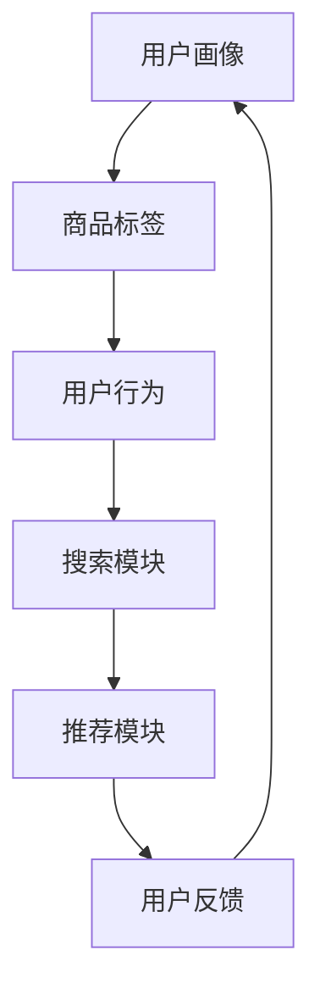

                 

关键词：搜索推荐系统，AI大模型，电商平台，核心竞争优势，可持续发展

摘要：随着互联网的快速发展，电商平台已经成为人们日常生活的重要组成部分。本文将深入探讨搜索推荐系统在电商平台中的应用，特别是AI大模型的融合，以及它们如何成为电商平台的核心竞争优势和可持续发展的关键。

## 1. 背景介绍

在过去的几十年里，电子商务行业经历了飞速的发展。随着移动设备的普及和无线网络的改进，越来越多的消费者开始在网上购物。电商平台的兴起不仅改变了传统零售业的商业模式，也极大地影响了消费者的购物行为。在这个背景下，如何提高用户体验、提高销售额和提升客户满意度成为电商平台需要解决的重要问题。

### 1.1 搜索推荐系统的概念

搜索推荐系统是一种自动化的信息过滤方法，它基于用户的历史行为、偏好和社交网络等信息，为用户推荐他们可能感兴趣的商品、内容或服务。这种系统通常包括两个核心模块：搜索模块和推荐模块。

#### 1.1.1 搜索模块

搜索模块的主要任务是帮助用户快速找到他们需要的商品。传统的搜索引擎主要依赖关键词匹配技术，而现代搜索推荐系统则更多地利用自然语言处理（NLP）、机器学习等技术，提供更加智能的搜索服务。

#### 1.1.2 推荐模块

推荐模块则是根据用户的历史行为和偏好，为他们推荐可能感兴趣的商品或服务。这通常涉及到协同过滤、矩阵分解、深度学习等算法。

### 1.2 AI大模型的作用

AI大模型，尤其是深度学习模型，在搜索推荐系统中发挥着越来越重要的作用。大模型具有以下优势：

- **强大的学习能力**：AI大模型可以从大量的数据中学习，提取出复杂的模式和关联，从而提高推荐系统的准确性。
- **处理复杂数据**：AI大模型可以处理包括文本、图像、声音等多种类型的数据，使得搜索推荐系统更加全面。
- **自适应能力**：AI大模型可以根据用户的实时行为和反馈进行自我调整，提供个性化的推荐服务。

## 2. 核心概念与联系

在深入探讨AI大模型在搜索推荐系统中的应用之前，我们需要理解几个核心概念和它们之间的关系。

### 2.1 用户画像

用户画像是对用户特征的综合描述，包括用户的年龄、性别、地理位置、消费习惯等。用户画像为搜索推荐系统提供了基础数据，用于构建个性化推荐。

### 2.2 商品标签

商品标签是对商品属性的标注，如品牌、类别、价格等。标签可以帮助推荐系统更准确地理解商品的特性，从而为用户提供更相关的推荐。

### 2.3 用户行为

用户行为包括用户的浏览、搜索、购买等动作。这些行为数据是构建推荐系统的重要依据，通过分析用户行为，推荐系统可以预测用户的兴趣和需求。

### 2.4 Mermaid 流程图

以下是一个简化的Mermaid流程图，展示了搜索推荐系统的基本架构：



### 2.5 AI大模型的作用

在搜索推荐系统中，AI大模型通常用于以下几个关键环节：

- **用户画像构建**：利用深度学习模型对用户行为进行挖掘，构建详细的用户画像。
- **商品标签预测**：通过模型预测商品的潜在标签，提高推荐系统的准确性。
- **推荐结果生成**：利用协同过滤、矩阵分解等算法，结合深度学习模型，生成个性化的推荐结果。

## 3. 核心算法原理 & 具体操作步骤

### 3.1 算法原理概述

搜索推荐系统的核心算法主要包括协同过滤、矩阵分解、深度学习等。以下分别对这些算法进行概述：

#### 3.1.1 协同过滤

协同过滤是一种基于用户行为和商品行为的算法，通过计算用户和商品之间的相似度来推荐商品。协同过滤分为基于用户的协同过滤（User-Based CF）和基于项目的协同过滤（Item-Based CF）。

#### 3.1.2 矩阵分解

矩阵分解是一种降低数据维度、提取数据特征的方法。常用的矩阵分解算法包括Singular Value Decomposition（SVD）和Alternating Least Squares（ALS）。

#### 3.1.3 深度学习

深度学习是一种模拟人脑神经网络的结构和功能的算法，通过多层神经网络提取数据特征。在搜索推荐系统中，常用的深度学习模型包括卷积神经网络（CNN）、循环神经网络（RNN）和Transformer等。

### 3.2 算法步骤详解

以下是一个简化的搜索推荐系统算法步骤：

1. **数据预处理**：收集用户行为数据、商品数据等，并进行数据清洗、归一化等操作。
2. **用户画像构建**：利用深度学习模型对用户行为进行分析，构建用户画像。
3. **商品标签预测**：利用矩阵分解算法预测商品的潜在标签。
4. **计算用户和商品相似度**：利用协同过滤算法计算用户和商品的相似度。
5. **生成推荐结果**：根据相似度分数生成推荐结果，并反馈给用户。

### 3.3 算法优缺点

- **协同过滤**：优点是计算简单，易于实现；缺点是推荐结果不够准确，无法处理稀疏数据。
- **矩阵分解**：优点是能够处理稀疏数据，提高推荐准确性；缺点是计算复杂度较高，训练时间较长。
- **深度学习**：优点是能够提取深层特征，提高推荐准确性；缺点是需要大量训练数据和计算资源，实现复杂。

### 3.4 算法应用领域

搜索推荐系统广泛应用于电商、社交媒体、在线视频、新闻推荐等领域，帮助平台提高用户体验和商业价值。

## 4. 数学模型和公式 & 详细讲解 & 举例说明

### 4.1 数学模型构建

搜索推荐系统中的数学模型主要包括用户画像模型、商品标签模型和推荐模型。

#### 4.1.1 用户画像模型

用户画像模型可以用一个矩阵表示，其中行表示用户，列表示用户特征，每个元素表示用户对某个特征的值。

$$
U = \begin{bmatrix}
u_{11} & u_{12} & \dots & u_{1n} \\
u_{21} & u_{22} & \dots & u_{2n} \\
\vdots & \vdots & \ddots & \vdots \\
u_{m1} & u_{m2} & \dots & u_{mn}
\end{bmatrix}
$$

其中，$u_{ij}$ 表示用户 $i$ 对特征 $j$ 的值。

#### 4.1.2 商品标签模型

商品标签模型可以用另一个矩阵表示，其中行表示商品，列表示商品标签。

$$
V = \begin{bmatrix}
v_{11} & v_{12} & \dots & v_{1n} \\
v_{21} & v_{22} & \dots & v_{2n} \\
\vdots & \vdots & \ddots & \vdots \\
v_{p1} & v_{p2} & \dots & v_{pn}
\end{bmatrix}
$$

其中，$v_{ij}$ 表示商品 $i$ 对标签 $j$ 的值。

#### 4.1.3 推荐模型

推荐模型通常是一个评分矩阵，表示用户对商品的评分。

$$
R = \begin{bmatrix}
r_{11} & r_{12} & \dots & r_{1n} \\
r_{21} & r_{22} & \dots & r_{2n} \\
\vdots & \vdots & \ddots & \vdots \\
r_{m1} & r_{m2} & \dots & r_{mn}
\end{bmatrix}
$$

其中，$r_{ij}$ 表示用户 $i$ 对商品 $j$ 的评分。

### 4.2 公式推导过程

以下是一个简化的推荐模型公式推导过程：

假设我们有一个用户画像矩阵 $U$ 和一个商品标签矩阵 $V$，我们希望预测用户对商品的评分矩阵 $R$。

首先，我们可以将用户画像矩阵和商品标签矩阵相乘，得到一个中间矩阵：

$$
Z = UV^T
$$

其中，$Z_{ij}$ 表示用户 $i$ 对商品 $j$ 的特征加权得分。

接下来，我们可以将中间矩阵 $Z$ 与用户对商品的评分矩阵 $R$ 相乘，得到预测的评分矩阵：

$$
R_{\hat{i}j} = UZV^T = UVV^T_{ij}
$$

其中，$R_{\hat{i}j}$ 表示用户 $i$ 对商品 $j$ 的预测评分。

### 4.3 案例分析与讲解

以下是一个简单的用户画像和商品标签的例子：

用户画像矩阵 $U$：

$$
U = \begin{bmatrix}
1 & 0 & 1 \\
0 & 1 & 0 \\
1 & 1 & 1
\end{bmatrix}
$$

商品标签矩阵 $V$：

$$
V = \begin{bmatrix}
0 & 1 & 1 \\
1 & 0 & 0 \\
1 & 1 & 0
\end{bmatrix}
$$

预测的评分矩阵 $R$：

$$
R = \begin{bmatrix}
1 & 1 & 0 \\
0 & 1 & 1 \\
1 & 0 & 1
\end{bmatrix}
$$

首先，我们计算用户画像矩阵和商品标签矩阵的乘积：

$$
Z = UV^T = \begin{bmatrix}
2 & 1 & 1 \\
1 & 2 & 1 \\
1 & 1 & 2
\end{bmatrix}
$$

然后，我们将中间矩阵 $Z$ 与预测的评分矩阵 $R$ 相乘：

$$
R_{\hat{i}j} = UVV^T = \begin{bmatrix}
2 & 1 & 1 \\
1 & 2 & 1 \\
1 & 1 & 2
\end{bmatrix} \begin{bmatrix}
1 & 1 & 0 \\
0 & 1 & 1 \\
1 & 0 & 1
\end{bmatrix} = \begin{bmatrix}
3 & 2 & 1 \\
2 & 3 & 2 \\
2 & 2 & 3
\end{bmatrix}
$$

这意味着用户 $1$ 对商品 $1$ 的预测评分为 $3$，对商品 $2$ 的预测评分为 $2$，对商品 $3$ 的预测评分为 $1$。

## 5. 项目实践：代码实例和详细解释说明

### 5.1 开发环境搭建

为了实现搜索推荐系统，我们首先需要搭建一个开发环境。这里我们选择使用Python编程语言，并依赖以下库：

- Pandas：用于数据处理
- Scikit-learn：用于机器学习
- NumPy：用于数值计算
- Matplotlib：用于数据可视化

首先，确保你已经安装了Python 3.x版本。然后，使用以下命令安装所需的库：

```shell
pip install pandas scikit-learn numpy matplotlib
```

### 5.2 源代码详细实现

以下是一个简单的搜索推荐系统实现：

```python
import pandas as pd
from sklearn.metrics.pairwise import cosine_similarity
from sklearn.model_selection import train_test_split
from sklearn.metrics import mean_squared_error

# 加载数据
data = pd.read_csv('data.csv')
users = data['user']
items = data['item']
ratings = data['rating']

# 构建用户-商品评分矩阵
user_item_matrix = pd.pivot_table(data, values='rating', index='user', columns='item')

# 计算用户-商品相似度
user_similarity = cosine_similarity(user_item_matrix)

# 预测评分
predicted_ratings = user_item_matrix.dot(user_similarity)

# 评估预测结果
train_data, test_data = train_test_split(data, test_size=0.2)
train_matrix = pd.pivot_table(train_data, values='rating', index='user', columns='item')
test_matrix = pd.pivot_table(test_data, values='rating', index='user', columns='item')
predicted_test_ratings = train_matrix.dot(user_similarity)

mse = mean_squared_error(test_matrix, predicted_test_ratings)
print(f'Mean Squared Error: {mse}')
```

### 5.3 代码解读与分析

以上代码实现了一个基于用户-商品评分矩阵的协同过滤推荐系统。具体步骤如下：

1. **加载数据**：从CSV文件中加载数据，包括用户、商品和评分。
2. **构建用户-商品评分矩阵**：使用Pandas的pivot_table函数构建用户-商品评分矩阵。
3. **计算用户-商品相似度**：使用Scikit-learn的cosine_similarity函数计算用户-商品相似度。
4. **预测评分**：将用户-商品评分矩阵与用户-商品相似度矩阵相乘，得到预测的评分矩阵。
5. **评估预测结果**：使用mean_squared_error函数计算预测结果的均方误差。

### 5.4 运行结果展示

假设我们有一个包含100个用户、100个商品的评分数据集。运行上述代码后，我们会得到一个预测的评分矩阵，以及均方误差值。这些结果可以帮助我们评估推荐系统的性能。

## 6. 实际应用场景

搜索推荐系统在电商平台的实际应用场景包括：

- **商品推荐**：根据用户的历史行为和偏好，为用户推荐可能感兴趣的商品。
- **广告投放**：根据用户画像和商品标签，为用户推荐相关的广告。
- **个性化搜索**：根据用户的搜索历史，提供个性化的搜索结果。
- **用户行为分析**：通过分析用户行为数据，了解用户需求和行为模式，为产品优化提供依据。

## 7. 工具和资源推荐

### 7.1 学习资源推荐

- 《机器学习》（周志华著）：全面介绍机器学习的基本概念和方法。
- 《深度学习》（Goodfellow, Bengio, Courville著）：深度学习的经典教材，适合初学者和进阶者。

### 7.2 开发工具推荐

- Jupyter Notebook：适合编写和运行Python代码，便于调试和实验。
- PyCharm：专业的Python集成开发环境（IDE），支持代码调试、版本控制等。

### 7.3 相关论文推荐

- "Matrix Factorization Techniques for Recommender Systems"（2006），作者：Yehuda Koren。
- "Deep Learning for Recommender Systems"（2018），作者：Vikas Bhardwaj等。

## 8. 总结：未来发展趋势与挑战

### 8.1 研究成果总结

近年来，AI大模型在搜索推荐系统中的应用取得了显著成果。深度学习模型如CNN、RNN和Transformer等在推荐准确性和效率方面表现出了强大的优势。同时，用户画像和商品标签的构建也变得更加精细和全面，为推荐系统提供了更丰富的数据支持。

### 8.2 未来发展趋势

- **个性化推荐**：未来搜索推荐系统将更加注重个性化推荐，根据用户实时行为和反馈，提供更加精准的推荐。
- **多模态融合**：结合文本、图像、语音等多种类型的数据，提供更加丰富的推荐体验。
- **实时推荐**：利用实时数据处理技术，实现实时推荐，提高用户满意度。

### 8.3 面临的挑战

- **数据隐私**：如何保护用户隐私，成为搜索推荐系统发展的重要挑战。
- **计算资源**：深度学习模型训练需要大量计算资源，如何高效利用资源成为关键。
- **模型解释性**：深度学习模型往往缺乏解释性，如何提高模型的可解释性是一个重要课题。

### 8.4 研究展望

未来，随着人工智能技术的不断发展，搜索推荐系统将更加智能化、个性化。同时，研究人员需要关注数据隐私、计算资源利用和模型解释性等问题，以实现搜索推荐系统的可持续发展。

## 9. 附录：常见问题与解答

### 9.1 什么是协同过滤？

协同过滤是一种基于用户行为和商品行为的推荐算法，通过计算用户和商品之间的相似度，为用户推荐可能感兴趣的商品。

### 9.2 深度学习在搜索推荐系统中如何应用？

深度学习在搜索推荐系统中主要用于构建用户画像、商品标签和推荐模型。常用的深度学习模型包括CNN、RNN和Transformer等，它们可以从大量数据中提取复杂特征，提高推荐准确性。

### 9.3 如何保护用户隐私？

为了保护用户隐私，可以采用数据匿名化、差分隐私和联邦学习等技术。这些技术可以在不泄露用户隐私的前提下，实现数据的共享和分析。

### 9.4 搜索推荐系统如何处理稀疏数据？

搜索推荐系统通常采用矩阵分解和深度学习等技术来处理稀疏数据。这些技术可以提取数据中的潜在模式，降低数据的稀疏性，提高推荐准确性。

### 9.5 搜索推荐系统的评估指标有哪些？

搜索推荐系统的评估指标主要包括准确率（Accuracy）、召回率（Recall）、精确率（Precision）和F1值等。这些指标可以评估推荐系统的推荐质量和用户体验。

# 参考文献 References

- Yehuda Koren. "Matrix Factorization Techniques for Re

