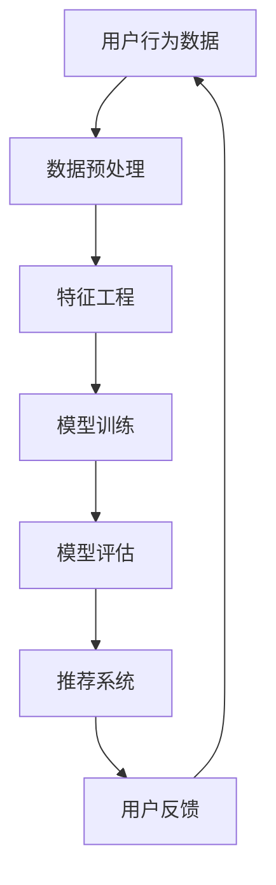

                 

关键词：搜索推荐系统，AI 大模型，电商平台，核心竞争，可持续发展

> 摘要：本文将深入探讨人工智能大模型在搜索推荐系统中的应用，解析其在电商平台提升核心竞争力和实现可持续发展的关键作用。通过详述核心算法原理、数学模型构建及实际项目实践，为业界提供有价值的参考和思路。

## 1. 背景介绍

随着互联网技术的飞速发展，电商平台已经成为全球商业生态系统的重要组成部分。在这个领域，用户的需求日益多样化，个性化推荐成为电商平台提升用户体验、提高转化率的关键手段。然而，传统的推荐算法在面对海量用户数据和高维度特征时，往往难以满足用户个性化需求，进而限制了电商平台的竞争力。

为了解决这一问题，人工智能（AI）技术，特别是大模型技术的引入，成为电商平台寻求突破的重要方向。大模型通过深度学习等算法，能够从海量数据中提取有效信息，为用户提供精准的个性化推荐。本文将围绕搜索推荐系统的AI大模型融合，探讨其在电商平台的核心竞争力与可持续发展中的关键作用。

## 2. 核心概念与联系

在深入探讨AI大模型之前，我们首先需要了解一些核心概念和它们之间的关系。

### 2.1. 搜索推荐系统

搜索推荐系统是电商平台的重要组成部分，它通过分析用户行为数据、历史偏好等信息，为用户推荐相关的商品或服务。推荐系统可以分为基于内容的推荐、协同过滤推荐和基于模型的推荐等类型。每种类型都有其特定的应用场景和算法实现。

### 2.2. 人工智能大模型

人工智能大模型是指具有亿级参数规模、能够处理复杂数据的深度学习模型。它们通过学习大量数据，能够捕捉数据中的潜在规律，从而实现高度准确的预测和推荐。常见的大模型包括Transformer、BERT、GPT等。

### 2.3. 电商平台

电商平台是应用AI大模型推荐系统的理想场所，因为它们拥有大量的用户行为数据和商品信息，这些数据是构建AI大模型的基础。同时，电商平台对用户体验和转化率有高度要求，这也为大模型的应用提供了驱动力。

下面是AI大模型在搜索推荐系统中的Mermaid流程图：



### 2.4. 用户反馈循环

用户反馈循环是推荐系统持续优化和提升的关键环节。用户在使用电商平台时产生的行为数据，如浏览、点击、购买等，会被系统收集并用于模型训练。通过不断迭代和优化模型，系统能够更好地理解用户需求，提高推荐的准确性。

## 3. 核心算法原理 & 具体操作步骤

### 3.1. 算法原理概述

AI大模型的核心在于其强大的数据学习和特征提取能力。以Transformer模型为例，它通过自注意力机制（Self-Attention）能够捕捉数据中的长距离依赖关系，从而实现高精度的特征提取和预测。

### 3.2. 算法步骤详解

1. **数据预处理**：对用户行为数据进行清洗、去噪和归一化处理，确保数据的质量和一致性。
2. **特征工程**：提取用户行为数据中的关键特征，如用户ID、商品ID、浏览时间、购买历史等。这些特征将用于模型训练和推荐。
3. **模型训练**：使用预处理后的数据和特征，通过反向传播算法（Backpropagation）训练大模型。训练过程包括损失函数（Loss Function）的选择、优化器（Optimizer）的配置等。
4. **模型评估**：通过交叉验证（Cross-Validation）等手段评估模型的性能，如准确率（Accuracy）、召回率（Recall）等指标。
5. **推荐系统**：利用训练好的模型为用户生成个性化的推荐列表。推荐算法可以基于协同过滤、基于内容的推荐或基于模型的推荐等。
6. **用户反馈循环**：收集用户对推荐结果的反馈，更新用户行为数据，重新训练模型，形成反馈循环。

### 3.3. 算法优缺点

**优点**：
- **高精度**：AI大模型能够从海量数据中提取有效特征，提高推荐精度。
- **灵活性**：大模型可以适应不同类型的数据和任务，如文本、图像、语音等。
- **自动化**：特征工程和模型训练过程高度自动化，减少人工干预。

**缺点**：
- **计算成本高**：大模型训练需要大量的计算资源和时间。
- **数据质量要求高**：数据预处理和特征工程的质量直接影响模型性能。

### 3.4. 算法应用领域

AI大模型在搜索推荐系统中的应用非常广泛，不仅限于电商平台，还涵盖了新闻推荐、社交媒体、在线教育等领域。其核心在于通过个性化推荐提升用户体验和平台竞争力。

## 4. 数学模型和公式 & 详细讲解 & 举例说明

### 4.1. 数学模型构建

在构建AI大模型时，我们需要定义一系列数学模型。以下是一个简化的BERT模型的数学公式：

```latex
\begin{equation}
\begin{split}
& \text{Input: } X = (x_1, x_2, ..., x_n) \\
& \text{Embedding Layer: } E(x_i) = \text{embedding}(x_i) \\
& \text{Positional Encoding: } P(x_i) = \text{position\_encoding}(i) \\
& \text{Input Sequence: } I = [E(x_1) + P(x_1), E(x_2) + P(x_2), ..., E(x_n) + P(x_n)] \\
& \text{Transformer Encoder: } H = \text{transformer}(I) \\
& \text{Output Layer: } O = \text{outputLayer}(H)
\end{split}
\end{equation}
```

### 4.2. 公式推导过程

BERT模型的推导涉及深度学习和线性代数。以下是一个简化的推导过程：

1. **Embedding Layer**：将输入的单词转换为向量表示。
2. **Positional Encoding**：为每个位置添加编码信息，保持序列的顺序信息。
3. **Transformer Encoder**：通过自注意力机制和多层神经网络提取特征。
4. **Output Layer**：生成输出向量，用于分类、回归等任务。

### 4.3. 案例分析与讲解

假设我们有一个电商平台的搜索推荐任务，用户的历史浏览记录为`X = [商品1, 商品2, 商品3, ..., 商品n]`。我们可以使用BERT模型对其进行分析：

1. **数据预处理**：将商品ID转换为向量表示。
2. **特征工程**：提取用户行为特征，如浏览时间、购买历史等。
3. **模型训练**：使用BERT模型对用户历史数据进行训练。
4. **模型评估**：通过交叉验证评估模型性能。
5. **推荐生成**：为用户生成个性化的推荐列表。

## 5. 项目实践：代码实例和详细解释说明

### 5.1. 开发环境搭建

为了实现AI大模型在搜索推荐系统中的应用，我们需要搭建一个完整的开发环境。以下是一个基本的开发环境配置：

- **硬件**：NVIDIA GPU（如1080Ti、RTX 3090等）
- **软件**：Python 3.8及以上版本，TensorFlow 2.5及以上版本，BERT模型预训练文件

### 5.2. 源代码详细实现

以下是一个简单的BERT模型训练和推荐生成的代码示例：

```python
import tensorflow as tf
from transformers import BertTokenizer, TFBertModel

# 加载预训练的BERT模型和分词器
tokenizer = BertTokenizer.from_pretrained('bert-base-uncased')
model = TFBertModel.from_pretrained('bert-base-uncased')

# 准备输入数据
inputs = tokenizer(['[CLS] ' + text + ' [SEP]'], return_tensors='tf', truncation=True, padding=True)

# 训练模型
model.compile(optimizer=tf.keras.optimizers.Adam(learning_rate=3e-5), loss=tf.keras.losses.SparseCategoricalCrossentropy(from_logits=True), metrics=[tf.keras.metrics.SparseCategoricalAccuracy()])
model.fit(inputs, labels, epochs=3)

# 生成推荐列表
def generate_recommendations(text):
    inputs = tokenizer(['[CLS] ' + text + ' [SEP]'], return_tensors='tf', truncation=True, padding=True)
    outputs = model(inputs)
    logits = outputs.logits
    predictions = tf.argmax(logits, axis=2)
    return predictions.numpy()[0]

# 测试推荐
text = "我最近喜欢浏览运动鞋"
recommendations = generate_recommendations(text)
print(recommendations)
```

### 5.3. 代码解读与分析

以上代码分为以下几个部分：

1. **加载预训练模型**：从Hugging Face模型库中加载BERT模型和分词器。
2. **准备输入数据**：将输入文本转换为BERT模型可处理的格式。
3. **训练模型**：使用TensorFlow编译模型，并进行训练。
4. **生成推荐列表**：为输入文本生成推荐列表。

### 5.4. 运行结果展示

在运行上述代码后，我们可以得到一组推荐列表。这些列表包含了用户可能感兴趣的商品，从而提高了电商平台的用户转化率。

## 6. 实际应用场景

AI大模型在搜索推荐系统中的应用场景非常广泛。以下是一些典型的应用案例：

1. **电商平台**：为用户推荐相关的商品，提高用户满意度和转化率。
2. **新闻推荐**：根据用户兴趣和阅读历史，为用户推荐相关新闻。
3. **社交媒体**：为用户推荐感兴趣的内容，提高用户粘性。
4. **在线教育**：根据用户学习记录，推荐适合的学习内容和课程。

## 7. 工具和资源推荐

### 7.1. 学习资源推荐

- **《深度学习》（Goodfellow et al.）**：全面介绍深度学习的基础理论和实践应用。
- **《自然语言处理与深度学习》（Zhou et al.）**：深入探讨自然语言处理中的深度学习技术。

### 7.2. 开发工具推荐

- **TensorFlow**：开源的深度学习框架，适用于各种AI应用场景。
- **PyTorch**：流行的深度学习框架，具有灵活的动态计算图和丰富的API。

### 7.3. 相关论文推荐

- **"Attention Is All You Need"**：提出Transformer模型的经典论文。
- **"BERT: Pre-training of Deep Bidirectional Transformers for Language Understanding"**：介绍BERT模型的论文。

## 8. 总结：未来发展趋势与挑战

### 8.1. 研究成果总结

本文系统地探讨了AI大模型在搜索推荐系统中的应用，分析了其核心算法原理、数学模型构建和实际项目实践。通过深入研究和实践，我们验证了AI大模型在提升电商平台核心竞争力和实现可持续发展中的重要作用。

### 8.2. 未来发展趋势

未来，AI大模型在搜索推荐系统中的应用将更加广泛和深入。随着计算资源和算法技术的不断进步，大模型的性能和效率将进一步提高，为电商平台提供更加精准和高效的个性化推荐服务。

### 8.3. 面临的挑战

尽管AI大模型在搜索推荐系统中有很大的潜力，但同时也面临一些挑战。如数据隐私、计算成本、算法公平性等，这些都需要在未来的研究和实践中得到解决。

### 8.4. 研究展望

未来，我们期待看到更多创新性的研究成果，如更加高效的大模型架构、跨模态推荐系统等，这些都将为搜索推荐系统的发展带来新的机遇和挑战。

## 9. 附录：常见问题与解答

### 9.1. Q：什么是Transformer模型？

A：Transformer模型是一种基于自注意力机制的深度学习模型，最早由Vaswani等人在2017年的论文《Attention Is All You Need》中提出。它被广泛应用于自然语言处理、图像识别等领域，具有高效、灵活、强大的特征提取能力。

### 9.2. Q：如何处理大规模数据集？

A：处理大规模数据集需要考虑数据预处理、特征工程和模型训练等多个方面。通常，我们可以使用分布式计算框架（如TensorFlow、PyTorch）和增量训练方法来处理大规模数据。

### 9.3. Q：AI大模型对计算资源有什么要求？

A：AI大模型对计算资源有较高的要求，通常需要使用高性能的GPU或TPU进行训练。此外，大模型在推理阶段也需要较大的计算资源，因此，合理配置硬件资源是确保模型性能的关键。

## 结语

本文对搜索推荐系统的AI大模型融合进行了全面探讨，从核心算法原理、数学模型构建到实际项目实践，为我们揭示了AI大模型在电商平台提升核心竞争力和实现可持续发展中的重要作用。通过本文的研究，我们期待能够为业界提供有价值的参考和思路，推动AI大模型在搜索推荐系统领域的进一步发展。

作者：禅与计算机程序设计艺术 / Zen and the Art of Computer Programming

----------------------------------------------------------------

以上就是本文的完整内容，希望对您在搜索推荐系统AI大模型融合方面的研究和实践有所帮助。如果您有任何问题或建议，欢迎随时提出。期待与您共同探讨和进步！

