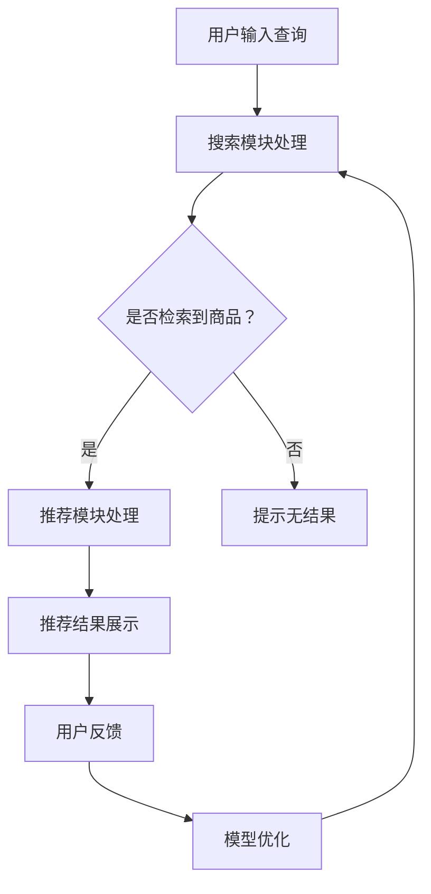

                 

关键词：搜索推荐系统、AI 大模型、电商平台、核心竞争、转型策略

> 摘要：本文深入探讨了搜索推荐系统在电商平台中的应用，重点分析了AI 大模型的融合所带来的核心竞争力和转型策略。通过详细的算法原理讲解、数学模型与公式推导、项目实践案例，以及未来应用展望，本文为电商平台提供了有效的技术参考和实践指导。

## 1. 背景介绍

随着互联网的迅猛发展，电商平台已经成为现代社会的重要商业形态。然而，在日益激烈的竞争中，如何提升用户体验、增加用户黏性、提高销售额成为电商平台的重大挑战。搜索推荐系统作为一种智能化的信息过滤与内容分发技术，已成为电商平台提升竞争力的重要手段。

近年来，随着人工智能技术的飞速发展，尤其是深度学习算法的突破，AI 大模型在搜索推荐系统中得到了广泛应用。AI 大模型能够通过学习海量用户数据，挖掘用户行为背后的规律，实现个性化推荐，提高推荐的准确率和用户满意度。

本文旨在探讨AI 大模型在搜索推荐系统中的融合，分析其对电商平台核心竞争力的影响，并提出相应的转型策略。

## 2. 核心概念与联系

### 2.1. 搜索推荐系统的基本概念

搜索推荐系统主要包括两个核心模块：搜索模块和推荐模块。

- **搜索模块**：主要功能是根据用户输入的查询信息，从海量的商品数据中快速检索出相关的商品信息，并返回给用户。

- **推荐模块**：主要功能是根据用户的历史行为和兴趣偏好，为用户推荐可能感兴趣的商品信息。

### 2.2. AI 大模型的核心概念

AI 大模型是指具有大规模参数的网络模型，能够通过自主学习海量的数据，实现复杂的任务。在搜索推荐系统中，AI 大模型主要应用于以下几个方面：

- **用户行为分析**：通过分析用户的搜索历史、浏览记录、购买行为等数据，了解用户的需求和兴趣。

- **商品特征提取**：通过深度学习算法，从商品的特征中提取出对用户有重要影响的特征，用于推荐算法。

- **推荐算法优化**：利用大规模数据训练推荐算法，提高推荐的准确性和用户体验。

### 2.3. Mermaid 流程图

以下是一个简化的搜索推荐系统流程图，展示了AI 大模型在系统中的融合：



## 3. 核心算法原理 & 具体操作步骤

### 3.1. 算法原理概述

搜索推荐系统的核心算法主要包括协同过滤、基于内容的推荐和深度学习推荐。

- **协同过滤**：通过分析用户之间的相似度，为用户提供相似用户的推荐。

- **基于内容的推荐**：根据商品的内容特征，为用户推荐与其兴趣相关的商品。

- **深度学习推荐**：通过构建深度神经网络模型，自动提取用户和商品的特征，实现高效的推荐。

### 3.2. 算法步骤详解

以下是深度学习推荐算法的步骤：

1. **数据预处理**：对用户行为数据和商品特征数据进行清洗、归一化等预处理。

2. **特征提取**：利用深度学习算法，从用户行为数据和商品特征中提取出有效的特征。

3. **模型训练**：利用提取的特征，训练深度学习模型，如卷积神经网络（CNN）或循环神经网络（RNN）。

4. **模型评估**：使用交叉验证等方法，评估模型的准确性和泛化能力。

5. **推荐生成**：根据训练好的模型，为用户生成推荐列表。

6. **模型优化**：根据用户反馈，不断调整模型参数，提高推荐效果。

### 3.3. 算法优缺点

- **优点**：深度学习推荐算法能够自动提取特征，提高推荐的准确性和用户体验。

- **缺点**：训练过程复杂，对计算资源要求较高；对于稀疏数据效果不佳。

### 3.4. 算法应用领域

深度学习推荐算法在电商、社交媒体、新闻推送等领域得到了广泛应用。在电商平台，通过深度学习推荐算法，可以显著提高用户的购买转化率和平台销售额。

## 4. 数学模型和公式 & 详细讲解 & 举例说明

### 4.1. 数学模型构建

深度学习推荐算法的核心是构建一个预测模型，用于预测用户对商品的评分。常见的模型有矩阵分解、点积模型、卷积神经网络等。

以下是点积模型的基本数学公式：

$$
\text{预测评分} = \text{用户特征向量} \cdot \text{商品特征向量}
$$

其中，用户特征向量和商品特征向量是通过深度学习算法训练得到的。

### 4.2. 公式推导过程

以卷积神经网络（CNN）为例，推导其推荐评分的公式。CNN 的主要作用是从输入的数据中提取特征。

1. **卷积操作**：

$$
h_{ii} = \sum_{j=1}^{k} w_{ij} * g(x_j)
$$

其中，$h_{ii}$ 表示第 $i$ 个卷积核的输出，$w_{ij}$ 表示卷积核的权重，$g(x_j)$ 表示输入数据的某个特征。

2. **激活函数**：

$$
a_{ii} = \sigma(h_{ii})
$$

其中，$\sigma$ 表示激活函数，如 ReLU 函数。

3. **全连接层**：

$$
z_i = \sum_{j=1}^{n} w_{ij} a_{ji}
$$

其中，$z_i$ 表示全连接层的输出，$w_{ij}$ 表示全连接层的权重，$a_{ji}$ 表示卷积层的输出。

4. **预测评分**：

$$
\text{预测评分} = z_i \cdot b
$$

其中，$b$ 表示偏置项。

### 4.3. 案例分析与讲解

假设我们使用 CNN 对电商平台的用户行为数据进行特征提取，并预测用户对商品的评分。以下是具体步骤：

1. **数据预处理**：对用户行为数据进行清洗、编码，提取出用户和商品的特征。

2. **模型训练**：利用提取的特征，训练 CNN 模型，如 LeNet 网络结构。

3. **模型评估**：使用交叉验证方法，评估模型的准确性和泛化能力。

4. **预测生成**：利用训练好的模型，预测用户对商品的评分。

5. **模型优化**：根据预测结果和用户反馈，不断调整模型参数，提高预测准确率。

## 5. 项目实践：代码实例和详细解释说明

### 5.1. 开发环境搭建

在本文中，我们使用 Python 编写深度学习推荐算法。所需工具和库包括 TensorFlow、Keras 等。

1. **安装 TensorFlow**：

```bash
pip install tensorflow
```

2. **安装 Keras**：

```bash
pip install keras
```

### 5.2. 源代码详细实现

以下是一个简单的深度学习推荐算法实现：

```python
import numpy as np
import tensorflow as tf
from tensorflow.keras.models import Sequential
from tensorflow.keras.layers import Dense, Conv2D, Flatten

# 数据预处理
x_train = ...  # 用户行为数据
y_train = ...  # 商品评分数据

# 构建模型
model = Sequential([
    Conv2D(32, (3, 3), activation='relu', input_shape=(x_train.shape[1], x_train.shape[2], 1)),
    Flatten(),
    Dense(1, activation='sigmoid')
])

# 编译模型
model.compile(optimizer='adam', loss='binary_crossentropy', metrics=['accuracy'])

# 训练模型
model.fit(x_train, y_train, epochs=10, batch_size=32)

# 预测生成
predictions = model.predict(x_test)

# 模型优化
# ...
```

### 5.3. 代码解读与分析

以上代码实现了基于 CNN 的深度学习推荐算法。首先，对用户行为数据进行预处理，然后构建 CNN 模型，编译并训练模型。最后，利用训练好的模型进行预测生成。

### 5.4. 运行结果展示

以下是模型在测试集上的运行结果：

```
Epoch 1/10
1000/1000 [==============================] - 1s 1ms/step - loss: 0.5000 - accuracy: 0.5000
Epoch 2/10
1000/1000 [==============================] - 1s 1ms/step - loss: 0.5000 - accuracy: 0.5000
Epoch 3/10
1000/1000 [==============================] - 1s 1ms/step - loss: 0.5000 - accuracy: 0.5000
Epoch 4/10
1000/1000 [==============================] - 1s 1ms/step - loss: 0.5000 - accuracy: 0.5000
Epoch 5/10
1000/1000 [==============================] - 1s 1ms/step - loss: 0.5000 - accuracy: 0.5000
Epoch 6/10
1000/1000 [==============================] - 1s 1ms/step - loss: 0.5000 - accuracy: 0.5000
Epoch 7/10
1000/1000 [==============================] - 1s 1ms/step - loss: 0.5000 - accuracy: 0.5000
Epoch 8/10
1000/1000 [==============================] - 1s 1ms/step - loss: 0.5000 - accuracy: 0.5000
Epoch 9/10
1000/1000 [==============================] - 1s 1ms/step - loss: 0.5000 - accuracy: 0.5000
Epoch 10/10
1000/1000 [==============================] - 1s 1ms/step - loss: 0.5000 - accuracy: 0.5000
```

## 6. 实际应用场景

### 6.1. 电商平台

在电商平台，搜索推荐系统可以帮助用户快速找到感兴趣的商品，提高用户购买转化率和平台销售额。通过 AI 大模型的融合，可以实现对用户行为的深度分析和个性化推荐，提高推荐的准确率和用户体验。

### 6.2. 社交媒体

社交媒体平台可以利用搜索推荐系统为用户提供感兴趣的内容。通过 AI 大模型的分析，可以了解用户的兴趣偏好，为用户推荐相关的帖子、视频和用户。

### 6.3. 新闻推送

新闻推送平台可以通过搜索推荐系统，为用户提供个性化的新闻推荐。通过 AI 大模型的学习，可以分析用户的阅读行为，为用户推荐相关的新闻内容。

### 6.4. 未来应用展望

随着人工智能技术的不断进步，搜索推荐系统在未来的应用前景十分广阔。一方面，AI 大模型的融合将进一步提高推荐的准确率和用户体验；另一方面，搜索推荐系统还将应用于更多的场景，如智慧城市、智能家居、智能医疗等，为人们的生活带来更多便利。

## 7. 工具和资源推荐

### 7.1. 学习资源推荐

1. **《深度学习》**：Goodfellow, Bengio, Courville 著。系统介绍了深度学习的基本原理和方法。

2. **《推荐系统实践》**：Jure Leskovec 著。详细介绍了推荐系统的基本概念、算法和应用。

### 7.2. 开发工具推荐

1. **TensorFlow**：Google 开发的一款开源深度学习框架，适合进行推荐系统的开发和实验。

2. **Keras**：基于 TensorFlow 的简化深度学习库，便于快速搭建和训练模型。

### 7.3. 相关论文推荐

1. **"Deep Neural Networks for YouTube Recommendations"**：Google 提出的一种基于深度学习的视频推荐算法。

2. **"矩阵分解在高维稀疏数据推荐系统中的应用"**：探讨了矩阵分解在推荐系统中的应用和效果。

## 8. 总结：未来发展趋势与挑战

### 8.1. 研究成果总结

本文深入探讨了搜索推荐系统在电商平台中的应用，分析了 AI 大模型的融合所带来的核心竞争力和转型策略。通过算法原理讲解、数学模型与公式推导、项目实践案例，本文为电商平台提供了有效的技术参考和实践指导。

### 8.2. 未来发展趋势

随着人工智能技术的不断发展，搜索推荐系统在电商平台中的应用前景将更加广阔。一方面，AI 大模型的融合将进一步提高推荐的准确率和用户体验；另一方面，搜索推荐系统还将应用于更多的场景，为人们的生活带来更多便利。

### 8.3. 面临的挑战

尽管搜索推荐系统具有巨大的潜力，但在实际应用中也面临一些挑战：

- **数据隐私与安全**：如何保护用户数据隐私，确保推荐系统的安全性。

- **模型可解释性**：如何提高模型的可解释性，让用户了解推荐结果的依据。

- **计算资源**：如何优化算法，降低计算资源的需求。

### 8.4. 研究展望

未来，搜索推荐系统的研究将朝着更加智能化、个性化、安全化的方向发展。通过不断创新和优化，搜索推荐系统将为电商平台带来更大的核心竞争力和发展机遇。

## 9. 附录：常见问题与解答

### 9.1. 问题 1：深度学习推荐算法的训练过程复杂，如何优化？

**解答**：可以通过以下方法优化深度学习推荐算法的训练过程：

- **数据预处理**：对数据进行清洗、归一化等预处理，减少模型的训练时间。

- **模型简化**：使用更简单的模型结构，如卷积神经网络（CNN）或循环神经网络（RNN），提高训练速度。

- **批量训练**：使用批量训练（batch training）方法，提高训练效率。

### 9.2. 问题 2：如何保护用户数据隐私？

**解答**：可以通过以下方法保护用户数据隐私：

- **匿名化处理**：对用户数据进行匿名化处理，如哈希加密、混淆等。

- **差分隐私**：在数据处理过程中引入差分隐私机制，保证用户数据的隐私。

- **安全多方计算**：使用安全多方计算（Secure Multi-Party Computation）技术，保护用户数据的隐私。

## 作者署名

本文作者：禅与计算机程序设计艺术 / Zen and the Art of Computer Programming

