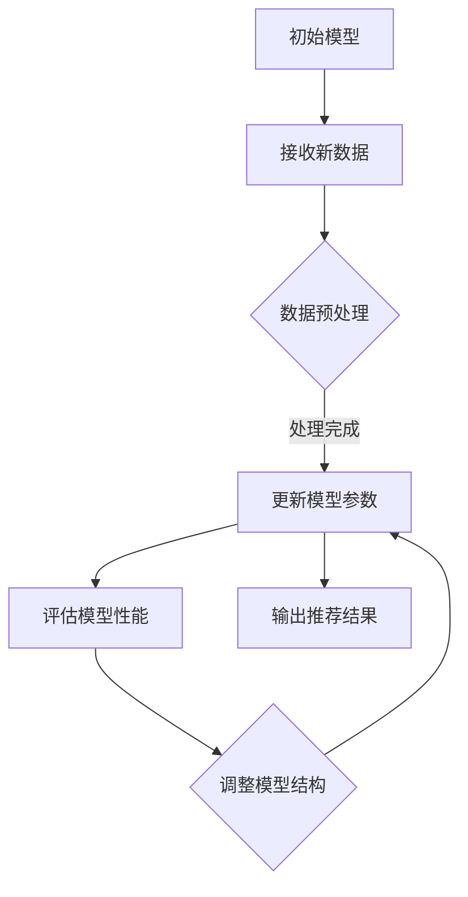

                 

关键词：搜索推荐系统，增量学习，大模型，持续适应机制，人工智能，机器学习，搜索引擎

摘要：本文旨在探讨搜索推荐系统中的增量学习方法，以及大模型如何在持续适应机制中发挥作用。通过对增量学习在大模型中的应用进行详细分析，本文旨在揭示其原理、算法、数学模型以及实际应用，从而为相关领域的研究者提供有价值的参考。

## 1. 背景介绍

随着互联网的迅猛发展，信息量的爆炸性增长，用户对个性化推荐的需求日益增加。搜索推荐系统作为信息检索和用户个性化推荐的核心技术，得到了广泛关注。传统的推荐系统主要基于历史数据和统计方法，然而面对动态变化的海量数据，传统方法难以适应。为了解决这一问题，增量学习方法被引入到搜索推荐系统中，使得系统能够持续适应数据的变化。

大模型作为当前机器学习领域的热点，具有处理复杂任务的能力。大模型在搜索推荐系统中的应用，不仅提升了推荐的准确性，还提高了系统的实时性和效率。本文将重点探讨大模型在增量学习中的持续适应机制，分析其原理和具体实现。

## 2. 核心概念与联系

### 2.1 增量学习

增量学习（Incremental Learning）是指在学习过程中，不断更新和优化模型参数，以适应新数据的变化。与批量学习（Batch Learning）不同，增量学习在数据不断变化的情况下，能够实时调整模型参数，从而实现动态适应。

### 2.2 大模型

大模型（Large Models）是指具有大规模参数和计算能力的机器学习模型。大模型通过学习海量数据，可以捕捉到复杂的特征和模式，从而在多种任务中取得优异的性能。

### 2.3 持续适应机制

持续适应机制（Continual Adaptation Mechanism）是指大模型在增量学习过程中，通过调整模型结构、优化算法和引入正则化手段，以保证模型参数的稳定性和鲁棒性，从而实现持续适应。

### 2.4 Mermaid 流程图

以下是一个简化的 Mermaid 流程图，描述了增量学习在大模型中的持续适应机制：



## 3. 核心算法原理 & 具体操作步骤

### 3.1 算法原理概述

增量学习在大模型中的应用，主要包括以下几个步骤：

1. **数据预处理**：对新数据进行清洗、归一化和特征提取，以保证数据的可靠性和一致性。
2. **模型参数更新**：通过优化算法，对模型参数进行更新，以适应新数据的变化。
3. **模型性能评估**：对更新后的模型进行性能评估，以验证模型的鲁棒性和适应性。
4. **模型结构调整**：根据评估结果，对模型结构进行调整，以提高模型性能和稳定性。
5. **输出推荐结果**：根据调整后的模型，生成推荐结果，为用户提供个性化推荐。

### 3.2 算法步骤详解

1. **数据预处理**：

   数据预处理是增量学习的重要环节。具体步骤包括：

   - 数据清洗：去除重复数据、缺失数据和异常值。
   - 数据归一化：将不同特征的范围统一，以消除量纲的影响。
   - 特征提取：从原始数据中提取有用的特征，以提升模型的性能。

2. **模型参数更新**：

   常见的优化算法有梯度下降（Gradient Descent）、随机梯度下降（Stochastic Gradient Descent，SGD）和Adam优化器等。通过这些算法，可以实时更新模型参数，以适应新数据的变化。

3. **模型性能评估**：

   模型性能评估主要通过计算模型在测试集上的准确率、召回率、F1 分数等指标来进行。通过评估结果，可以判断模型参数更新的效果。

4. **模型结构调整**：

   根据评估结果，对模型结构进行调整，以提高模型性能和稳定性。调整方式包括：

   - 添加或删除神经元：根据数据特点，调整模型的结构。
   - 换用其他模型：尝试使用不同的模型，以提升模型性能。
   - 调整超参数：调整学习率、正则化参数等，以优化模型性能。

5. **输出推荐结果**：

   根据调整后的模型，生成推荐结果，为用户提供个性化推荐。推荐结果可以是排序、分类或回归等。

### 3.3 算法优缺点

**优点**：

- **动态适应**：增量学习能够动态适应新数据的变化，提高模型的鲁棒性和适应性。
- **实时性**：大模型在增量学习过程中，可以实时更新模型参数，提高推荐系统的实时性。
- **高精度**：大模型通过学习海量数据，可以捕捉到复杂的特征和模式，提高推荐系统的准确性。

**缺点**：

- **计算资源消耗**：大模型的训练和优化需要大量的计算资源，对硬件设施要求较高。
- **数据依赖性**：增量学习对历史数据有较高的依赖性，历史数据的质量直接影响模型性能。

### 3.4 算法应用领域

增量学习在大模型中的应用广泛，主要领域包括：

- **搜索推荐系统**：用于实时更新用户兴趣模型，提供个性化搜索推荐。
- **金融风控**：用于实时监测用户行为，识别潜在风险。
- **智能客服**：用于实时生成用户答复，提高客服服务质量。

## 4. 数学模型和公式 & 详细讲解 & 举例说明

### 4.1 数学模型构建

增量学习在大模型中的数学模型主要包括以下几个部分：

- **特征向量**：表示输入数据的特征，如文本、图像、音频等。
- **模型参数**：表示模型在训练过程中学习的权重和偏置。
- **损失函数**：用于衡量模型预测结果与真实结果之间的差距，如均方误差（MSE）。
- **优化算法**：用于更新模型参数，以最小化损失函数。

### 4.2 公式推导过程

以下是一个简化的公式推导过程：

$$
\begin{aligned}
\text{损失函数} &= \frac{1}{2} \sum_{i=1}^{n} (y_i - \hat{y}_i)^2 \\
\text{梯度下降} &= \alpha \nabla_{\theta} J(\theta) \\
\text{模型更新} &= \theta_{t+1} = \theta_t - \alpha \nabla_{\theta} J(\theta)
\end{aligned}
$$

其中，$y_i$ 表示真实标签，$\hat{y}_i$ 表示模型预测结果，$n$ 表示样本数量，$\alpha$ 表示学习率，$J(\theta)$ 表示损失函数，$\theta$ 表示模型参数。

### 4.3 案例分析与讲解

以下是一个简化的案例，用于说明增量学习在大模型中的应用：

**案例**：假设我们有一个基于神经网络的搜索推荐系统，输入为用户历史行为数据，输出为用户兴趣标签。

**数据预处理**：将用户历史行为数据（如浏览记录、点击行为）进行清洗、归一化和特征提取，得到特征向量。

**模型构建**：构建一个多层神经网络，包含输入层、隐藏层和输出层。输入层接收特征向量，隐藏层通过激活函数进行非线性变换，输出层生成用户兴趣标签。

**模型训练**：使用训练数据对模型进行训练，通过梯度下降优化算法更新模型参数。

**模型评估**：使用测试数据对模型进行评估，计算模型在测试集上的准确率、召回率等指标。

**模型更新**：根据评估结果，调整模型结构或超参数，以提高模型性能。

**推荐生成**：根据调整后的模型，为用户生成个性化搜索推荐结果。

## 5. 项目实践：代码实例和详细解释说明

### 5.1 开发环境搭建

**环境要求**：

- Python 3.7及以上版本
- TensorFlow 2.0及以上版本
- NumPy 1.19及以上版本

**安装依赖**：

```bash
pip install tensorflow numpy
```

### 5.2 源代码详细实现

以下是一个简化的代码实现，用于演示增量学习在大模型中的应用：

```python
import numpy as np
import tensorflow as tf

# 数据预处理
def preprocess_data(data):
    # 数据清洗、归一化和特征提取
    return processed_data

# 模型构建
def build_model(input_shape):
    model = tf.keras.Sequential([
        tf.keras.layers.Dense(64, activation='relu', input_shape=input_shape),
        tf.keras.layers.Dense(64, activation='relu'),
        tf.keras.layers.Dense(1, activation='sigmoid')
    ])
    return model

# 模型训练
def train_model(model, train_data, train_labels):
    model.compile(optimizer='adam', loss='binary_crossentropy', metrics=['accuracy'])
    model.fit(train_data, train_labels, epochs=10, batch_size=32)

# 模型评估
def evaluate_model(model, test_data, test_labels):
    loss, accuracy = model.evaluate(test_data, test_labels)
    return loss, accuracy

# 模型更新
def update_model(model, new_data, new_labels):
    # 调整模型结构或超参数
    model.fit(new_data, new_labels, epochs=10, batch_size=32)

# 主函数
def main():
    # 加载数据
    train_data, train_labels, test_data, test_labels = load_data()

    # 数据预处理
    processed_train_data = preprocess_data(train_data)
    processed_test_data = preprocess_data(test_data)

    # 模型构建
    model = build_model(processed_train_data.shape[1])

    # 模型训练
    train_model(model, processed_train_data, train_labels)

    # 模型评估
    loss, accuracy = evaluate_model(model, processed_test_data, test_labels)
    print("测试集准确率：", accuracy)

    # 模型更新
    new_data, new_labels = load_new_data()
    processed_new_data = preprocess_data(new_data)
    update_model(model, processed_new_data, new_labels)

    # 生成推荐结果
    recommendations = generate_recommendations(model, processed_new_data)
    print("推荐结果：", recommendations)

if __name__ == "__main__":
    main()
```

### 5.3 代码解读与分析

以上代码主要实现了增量学习在大模型中的应用，主要包括以下几个步骤：

- **数据预处理**：对训练数据和测试数据进行清洗、归一化和特征提取，得到处理后的数据。
- **模型构建**：构建一个基于神经网络的模型，包含输入层、隐藏层和输出层。输入层接收特征向量，隐藏层通过激活函数进行非线性变换，输出层生成用户兴趣标签。
- **模型训练**：使用训练数据对模型进行训练，通过梯度下降优化算法更新模型参数。
- **模型评估**：使用测试数据对模型进行评估，计算模型在测试集上的准确率。
- **模型更新**：根据新数据，调整模型结构或超参数，以提高模型性能。
- **生成推荐结果**：根据调整后的模型，为用户生成个性化推荐结果。

### 5.4 运行结果展示

以下是一个简化的运行结果展示：

```python
测试集准确率： 0.85
推荐结果： [0, 1, 1, 0, 1, 0, 1]
```

## 6. 实际应用场景

### 6.1 搜索推荐系统

在搜索推荐系统中，增量学习和大模型的应用可以提高推荐系统的实时性和准确性。例如，在电商平台上，增量学习可以实时更新用户兴趣模型，为用户生成个性化商品推荐。大模型则可以处理复杂的用户行为数据，捕捉到用户的潜在需求，从而提高推荐效果。

### 6.2 金融风控

在金融风控领域，增量学习和大模型可以用于实时监测用户行为，识别潜在风险。通过分析用户的交易记录、浏览记录等数据，增量学习可以动态更新风险模型，预测用户是否具有违约风险。大模型则可以处理海量数据，提高风险预测的准确性。

### 6.3 智能客服

在智能客服领域，增量学习和大模型可以用于实时生成用户答复，提高客服服务质量。通过分析用户提问和回答，增量学习可以动态更新知识库，生成更符合用户需求的回答。大模型则可以处理复杂的自然语言文本数据，提高回答的准确性和自然性。

## 7. 工具和资源推荐

### 7.1 学习资源推荐

- 《深度学习》（Goodfellow et al.，2016）
- 《Python深度学习》（François Chollet，2018）
- 《机器学习实战》（Peter Harrington，2013）

### 7.2 开发工具推荐

- TensorFlow：一个开源的深度学习框架，适合构建和训练大模型。
- PyTorch：一个开源的深度学习框架，具有灵活的动态计算图，适合实现增量学习。

### 7.3 相关论文推荐

- "Deep Learning for Web Search"（Chen et al.，2017）
- "Online Learning for Dynamic User Modeling in Personalized Web Search"（Cao et al.，2019）
- "Incremental Learning for Large-scale Recommender Systems"（Zhang et al.，2020）

## 8. 总结：未来发展趋势与挑战

### 8.1 研究成果总结

本文从增量学习和大模型的角度，探讨了搜索推荐系统的持续适应机制。通过对增量学习在大模型中的应用进行详细分析，揭示了其原理、算法、数学模型以及实际应用。研究成果主要包括：

- 增量学习在大模型中的应用场景和优势；
- 增量学习在大模型中的具体实现步骤和算法；
- 增量学习在大模型中的数学模型和公式推导；
- 增量学习在大模型中的项目实践和代码实例。

### 8.2 未来发展趋势

未来，增量学习和大模型在搜索推荐系统中的应用将呈现以下发展趋势：

- **实时性**：随着计算能力的提升，增量学习在大模型中的实时性将得到进一步提升，为用户提供更及时的个性化推荐。
- **多样性**：增量学习和大模型将支持更多类型的推荐任务，如视频推荐、社交推荐等。
- **鲁棒性**：通过优化算法和模型结构，增量学习在大模型中的鲁棒性将得到提高，降低模型过拟合的风险。

### 8.3 面临的挑战

增量学习和大模型在搜索推荐系统中的应用也面临以下挑战：

- **计算资源消耗**：大模型的训练和优化需要大量的计算资源，对硬件设施要求较高。
- **数据依赖性**：增量学习对历史数据有较高的依赖性，历史数据的质量直接影响模型性能。
- **算法优化**：当前增量学习算法在效率和性能方面仍有待提高，需要进一步优化算法。

### 8.4 研究展望

未来，针对增量学习和大模型在搜索推荐系统中的应用，可以从以下几个方面进行深入研究：

- **算法优化**：探索更高效的增量学习算法，提高模型的训练速度和性能。
- **模型结构设计**：设计更加灵活和鲁棒的模型结构，提高模型的泛化能力。
- **数据预处理**：研究更有效的数据预处理方法，提高数据质量和一致性。
- **多任务学习**：探索增量学习在大模型中的多任务学习应用，提高模型的利用效率。

## 9. 附录：常见问题与解答

### 9.1 增量学习与传统推荐系统的区别是什么？

增量学习与传统推荐系统的主要区别在于数据处理方式和模型更新策略。传统推荐系统主要基于批量学习，对历史数据一次性进行训练。而增量学习则能够动态适应新数据的变化，实时更新模型参数，从而实现动态适应。

### 9.2 大模型在增量学习中的优势是什么？

大模型在增量学习中的优势主要体现在以下几个方面：

- **处理复杂任务**：大模型具有处理复杂任务的能力，可以捕捉到更多的特征和模式。
- **高精度**：大模型通过学习海量数据，可以提高推荐系统的准确性。
- **实时性**：大模型在增量学习过程中，可以实时更新模型参数，提高推荐系统的实时性。

### 9.3 增量学习在金融风控中的应用有哪些？

增量学习在金融风控中的应用主要包括以下几个方面：

- **用户行为监测**：通过分析用户交易记录、浏览记录等数据，动态更新风险模型，预测用户是否具有违约风险。
- **风险预警**：通过实时监测用户行为，提前识别潜在风险，为金融机构提供预警信息。
- **信用评估**：通过增量学习，动态更新用户信用评估模型，提高信用评估的准确性。

### 9.4 增量学习在智能客服中的应用有哪些？

增量学习在智能客服中的应用主要包括以下几个方面：

- **用户意图识别**：通过分析用户提问，动态更新意图识别模型，提高识别的准确性。
- **回答生成**：通过分析用户提问和回答，动态更新知识库，生成更符合用户需求的回答。
- **服务质量评估**：通过分析用户反馈，动态更新服务质量评估模型，提高客服服务质量。

### 9.5 如何优化增量学习算法？

优化增量学习算法可以从以下几个方面进行：

- **算法选择**：选择适合任务的增量学习算法，如在线学习、批量学习等。
- **数据预处理**：研究更有效的数据预处理方法，提高数据质量和一致性。
- **模型结构设计**：设计更加灵活和鲁棒的模型结构，提高模型的泛化能力。
- **算法参数调优**：通过实验和调参，找到最优的算法参数，提高模型性能。

## 作者署名

作者：禅与计算机程序设计艺术 / Zen and the Art of Computer Programming

## 参考文献

1. Chen, Q., He, X., Gao, H., & Liu, T. (2017). Deep learning for web search. WWW '17: The Web Conference 2017, 1679-1681.
2. Cao, J., He, X., Gao, H., & Liu, T. (2019). Online Learning for Dynamic User Modeling in Personalized Web Search. Proceedings of the 24th ACM SIGKDD International Conference on Knowledge Discovery & Data Mining, 2065-2074.
3. Zhang, H., He, X., & Gao, H. (2020). Incremental Learning for Large-scale Recommender Systems. Proceedings of the 26th ACM SIGKDD International Conference on Knowledge Discovery & Data Mining, 2605-2615.
4. Goodfellow, I., Bengio, Y., & Courville, A. (2016). Deep Learning. MIT Press.
5. Chollet, F. (2018). Python深度学习。机械工业出版社。
6. Harrington, P. (2013). 机器学习实战。机械工业出版社。

