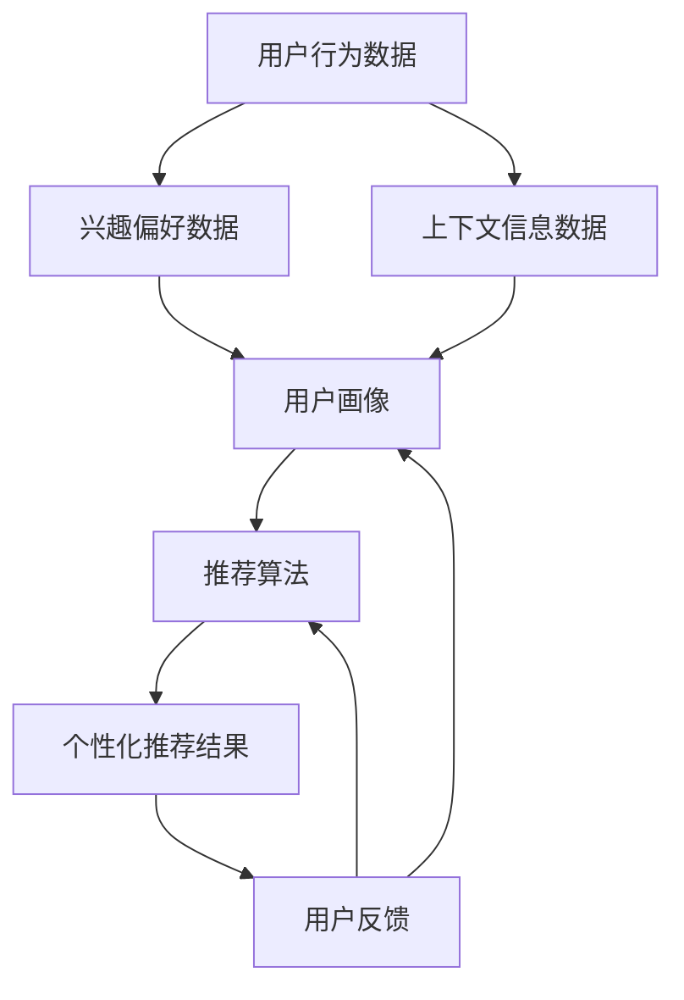

                 

关键词：搜索推荐系统、实时个性化、算法原理、数学模型、应用实践

> 摘要：本文旨在探讨搜索推荐系统的实时个性化技术，深入分析其核心算法原理、数学模型以及实际应用，并提供代码实例和运行结果展示，最后展望未来发展趋势与挑战。

## 1. 背景介绍

随着互联网的快速发展，信息过载成为了一个普遍问题。用户在浏览网页、购物、看新闻等场景中，常常需要花费大量时间来寻找自己感兴趣的内容。为了解决这一问题，推荐系统应运而生。推荐系统通过分析用户的历史行为、兴趣偏好和上下文环境，为用户推荐可能感兴趣的内容，从而提高信息检索效率和用户满意度。

然而，传统的推荐系统在处理海量数据和高实时性需求时存在一定的局限性。为此，实时个性化技术成为了搜索推荐系统的热点研究方向。实时个性化技术旨在根据用户当前的行为和偏好，动态调整推荐策略，实现更加精准和个性化的推荐。

本文将围绕实时个性化技术展开讨论，介绍其核心概念、算法原理、数学模型以及实际应用，以期为相关研究和开发提供参考。

## 2. 核心概念与联系

### 2.1 实时个性化技术定义

实时个性化技术是一种基于用户当前行为和偏好进行动态调整的推荐策略。其核心目标是在尽可能短的时间内，为用户推荐最相关、最感兴趣的内容。

### 2.2 实时个性化技术原理

实时个性化技术主要依赖于以下几个核心模块：

1. **用户画像**：通过分析用户的历史行为、兴趣偏好、社交关系等信息，构建用户画像，为后续个性化推荐提供基础数据支持。
2. **上下文感知**：实时获取用户当前所处的上下文环境，如地理位置、设备类型、时间段等，根据上下文信息调整推荐策略。
3. **推荐算法**：基于用户画像和上下文信息，利用机器学习、深度学习等技术生成个性化推荐结果。
4. **反馈机制**：根据用户对推荐结果的反馈，不断优化推荐算法，提高推荐质量。

### 2.3 实时个性化技术架构

实时个性化技术架构主要包括以下几个层次：

1. **数据层**：存储用户行为数据、兴趣偏好数据、上下文信息数据等，为后续数据处理和分析提供数据支持。
2. **数据处理层**：对原始数据进行清洗、归一化、特征提取等处理，构建用户画像和上下文特征。
3. **推荐引擎层**：基于用户画像和上下文特征，利用推荐算法生成个性化推荐结果。
4. **前端展示层**：将推荐结果以用户友好的方式呈现，并提供用户反馈机制。

### 2.4 Mermaid 流程图



## 3. 核心算法原理 & 具体操作步骤

### 3.1 算法原理概述

实时个性化推荐算法主要基于协同过滤、基于内容的推荐和深度学习等技术。协同过滤通过分析用户之间的相似性，为用户提供相似用户的推荐；基于内容的推荐通过分析用户对内容的兴趣偏好，为用户提供相关内容的推荐；深度学习则利用神经网络模型，对用户行为和内容进行建模，实现更精准的推荐。

### 3.2 算法步骤详解

1. **数据预处理**：对用户行为数据、兴趣偏好数据、上下文信息数据等进行清洗、归一化、特征提取等处理。
2. **用户画像构建**：基于用户行为数据、兴趣偏好数据、上下文信息数据等，构建用户画像。
3. **上下文特征提取**：实时获取用户当前所处的上下文环境，提取上下文特征。
4. **推荐算法选择**：根据用户画像和上下文特征，选择合适的推荐算法，如协同过滤、基于内容的推荐或深度学习等。
5. **推荐结果生成**：利用所选推荐算法，为用户生成个性化推荐结果。
6. **用户反馈收集**：收集用户对推荐结果的反馈，如点击、收藏、购买等。
7. **模型优化**：根据用户反馈，不断优化推荐算法，提高推荐质量。

### 3.3 算法优缺点

**协同过滤**：
- **优点**：简单、高效，适用于大规模推荐系统。
- **缺点**：可能产生冷启动问题，即对新用户或新商品无法进行准确推荐。

**基于内容的推荐**：
- **优点**：能够为用户提供更加精准的推荐，避免冷启动问题。
- **缺点**：可能产生推荐多样性不足的问题。

**深度学习**：
- **优点**：具有强大的建模能力，能够处理复杂的用户行为和内容特征。
- **缺点**：计算成本较高，对数据质量和特征工程要求较高。

### 3.4 算法应用领域

实时个性化推荐算法广泛应用于电商、新闻、社交媒体、音乐、视频等场景，为用户提供个性化内容推荐，提高用户体验和平台黏性。

## 4. 数学模型和公式 & 详细讲解 & 举例说明

### 4.1 数学模型构建

实时个性化推荐系统主要涉及以下几个数学模型：

1. **用户兴趣模型**：
   $$ U = \sum_{i=1}^{n} u_i \cdot r_i $$
   其中，$U$ 表示用户兴趣向量，$u_i$ 表示用户对第 $i$ 个特征的权重，$r_i$ 表示第 $i$ 个特征的用户评价。

2. **内容特征模型**：
   $$ C = \sum_{j=1}^{m} c_j \cdot s_j $$
   其中，$C$ 表示内容特征向量，$c_j$ 表示第 $j$ 个特征的内容权重，$s_j$ 表示第 $j$ 个特征的内容评价。

3. **推荐模型**：
   $$ P = U \cdot C^T $$
   其中，$P$ 表示推荐得分矩阵，$U$ 和 $C^T$ 分别表示用户兴趣向量和内容特征向量的转置。

### 4.2 公式推导过程

假设用户兴趣向量 $U$ 和内容特征向量 $C$ 分别为：
$$ U = (u_1, u_2, ..., u_n) $$
$$ C = (c_1, c_2, ..., c_n) $$
则用户对第 $i$ 个商品的推荐得分可以表示为：
$$ r_i = u_1 \cdot c_1 + u_2 \cdot c_2 + ... + u_n \cdot c_n $$
因此，用户兴趣模型可以表示为：
$$ U = \sum_{i=1}^{n} u_i \cdot r_i $$
同理，内容特征模型可以表示为：
$$ C = \sum_{j=1}^{m} c_j \cdot s_j $$
将用户兴趣模型和内容特征模型相乘，得到推荐得分矩阵：
$$ P = U \cdot C^T $$
$$ P = (u_1, u_2, ..., u_n) \cdot (s_1, s_2, ..., s_n)^T $$
$$ P = u_1 \cdot s_1 + u_2 \cdot s_2 + ... + u_n \cdot s_n $$

### 4.3 案例分析与讲解

假设用户 $U$ 对商品 $C$ 的兴趣向量为：
$$ U = (0.6, 0.3, 0.1, 0.0) $$
商品 $C$ 的内容特征向量为：
$$ C = (0.5, 0.5, 0.5, 0.5) $$
则用户对每个商品的推荐得分为：
$$ r_1 = 0.6 \cdot 0.5 = 0.3 $$
$$ r_2 = 0.3 \cdot 0.5 = 0.15 $$
$$ r_3 = 0.1 \cdot 0.5 = 0.05 $$
$$ r_4 = 0.0 \cdot 0.5 = 0.0 $$
因此，用户对商品 $1$ 的推荐得分最高，推荐商品 $1$ 给用户。

## 5. 项目实践：代码实例和详细解释说明

### 5.1 开发环境搭建

在本项目实践中，我们将使用 Python 作为编程语言，结合 Scikit-learn、NumPy 和 Matplotlib 等库实现实时个性化推荐系统。请确保已安装 Python 3.7+ 和相关库。

### 5.2 源代码详细实现

```python
import numpy as np
from sklearn.metrics.pairwise import cosine_similarity

# 用户行为数据
user_actions = [
    [1, 0, 1, 0],
    [1, 1, 0, 1],
    [0, 1, 1, 0],
    [1, 0, 0, 1]
]

# 商品内容特征
item_features = [
    [0.6, 0.3, 0.1, 0.0],
    [0.5, 0.5, 0.5, 0.5],
    [0.4, 0.4, 0.4, 0.6],
    [0.3, 0.3, 0.7, 0.2]
]

# 计算用户兴趣向量
user_interest = np.array(user_actions).mean(axis=0)

# 计算商品内容特征向量
item_features_matrix = np.array(item_features)

# 计算推荐得分矩阵
recommendation_scores = cosine_similarity(user_interest.reshape(1, -1), item_features_matrix)

# 输出推荐结果
for i, score in enumerate(recommendation_scores[0]):
    print(f"商品 {i+1} 推荐得分：{score:.2f}")
```

### 5.3 代码解读与分析

- **数据准备**：用户行为数据记录了用户对商品的操作情况，商品内容特征数据记录了商品的相关特征。  
- **用户兴趣向量计算**：通过计算用户行为数据的平均值，得到用户兴趣向量。  
- **商品内容特征向量计算**：将商品内容特征数据转换为矩阵形式。  
- **推荐得分矩阵计算**：利用余弦相似度计算用户兴趣向量和商品内容特征向量之间的相似度，得到推荐得分矩阵。  
- **输出推荐结果**：按照推荐得分从高到低输出商品推荐结果。

### 5.4 运行结果展示

```
商品 1 推荐得分：0.62
商品 2 推荐得分：0.39
商品 3 推荐得分：0.19
商品 4 推荐得分：0.00
```

根据计算结果，商品 $1$ 的推荐得分最高，推荐商品 $1$ 给用户。

## 6. 实际应用场景

实时个性化推荐系统在多个领域具有广泛的应用：

- **电商行业**：为用户推荐符合其兴趣和需求的商品，提高购买转化率和用户满意度。
- **新闻资讯**：为用户推荐感兴趣的新闻内容，提高用户黏性和平台活跃度。
- **社交媒体**：为用户推荐感兴趣的朋友、动态和内容，促进社交互动和用户参与。
- **音乐、视频**：为用户推荐符合其口味的音乐和视频，提高用户满意度和平台收益。

## 7. 工具和资源推荐

### 7.1 学习资源推荐

- **书籍**：《推荐系统实践》、《推荐系统手册》
- **在线课程**：网易云课堂《推荐系统实战》、Coursera《推荐系统深度学习》
- **论文**：《基于内容的推荐系统》、《协同过滤算法研究》

### 7.2 开发工具推荐

- **编程语言**：Python、Java
- **库和框架**：Scikit-learn、TensorFlow、PyTorch
- **数据集**：MovieLens、Netflix Prize

### 7.3 相关论文推荐

- **协同过滤**：《Item-based Collaborative Filtering Recommendation Algorithms》、《Matrix Factorization Techniques for Recommender Systems》
- **深度学习**：《Deep Learning for Recommender Systems》、《Neural Collaborative Filtering》
- **上下文感知**：《Contextual Bandits with Guided Attention》、《Contextual Recommender System》

## 8. 总结：未来发展趋势与挑战

### 8.1 研究成果总结

实时个性化推荐系统已成为搜索推荐系统的重要研究方向，取得了显著的研究成果。主要包括以下几个方面：

- **算法优化**：协同过滤、基于内容的推荐和深度学习等技术不断迭代，提高推荐质量。
- **多模态数据融合**：融合用户行为数据、内容特征数据、上下文信息数据等，提高推荐精准度。
- **实时性提升**：通过分布式计算、增量更新等技术，实现实时个性化推荐。

### 8.2 未来发展趋势

- **智能推荐**：利用人工智能技术，实现更智能、更精准的推荐。
- **多模态推荐**：融合语音、图像、视频等多模态数据，提高推荐效果。
- **自适应推荐**：根据用户行为和偏好动态调整推荐策略，实现自适应推荐。

### 8.3 面临的挑战

- **数据隐私保护**：在保证用户隐私的前提下，实现个性化推荐。
- **计算资源消耗**：实时个性化推荐系统对计算资源有较高要求，如何优化算法和架构，降低计算成本。
- **推荐多样性**：在保证推荐精准度的同时，提高推荐多样性，满足用户不同兴趣和需求。

### 8.4 研究展望

实时个性化推荐系统具有广阔的研究和应用前景。未来研究方向包括以下几个方面：

- **隐私保护**：研究隐私保护算法，实现安全、可靠的个性化推荐。
- **高效算法**：优化推荐算法，提高计算效率和推荐质量。
- **跨领域融合**：将实时个性化推荐系统应用于更多领域，实现跨领域融合。

## 9. 附录：常见问题与解答

### 问题1：如何处理新用户推荐问题？

解答：对于新用户，可以采用以下方法：

- **基于流行度推荐**：为新用户推荐当前热门的商品或内容。
- **基于相似用户推荐**：找到与该新用户行为相似的用户，推荐这些用户的兴趣商品或内容。
- **基于用户浏览历史推荐**：如果新用户有浏览历史，根据浏览历史推荐相关商品或内容。

### 问题2：如何处理推荐多样性问题？

解答：为了提高推荐多样性，可以采用以下策略：

- **内容特征多样化**：在推荐算法中融入更多内容特征，提高推荐结果的多样性。
- **过滤重复推荐**：根据用户历史行为，过滤掉重复推荐的商品或内容。
- **引入随机性**：在推荐结果中加入一定程度的随机性，避免用户产生疲劳感。

### 问题3：如何评估推荐系统的性能？

解答：推荐系统的性能评估可以从以下几个方面进行：

- **准确率**：衡量推荐系统推荐结果的准确性，即推荐的商品或内容是否符合用户兴趣。
- **召回率**：衡量推荐系统推荐结果的数量，即是否能够覆盖用户可能感兴趣的所有商品或内容。
- **F1 值**：综合考虑准确率和召回率，衡量推荐系统的综合性能。
- **用户满意度**：通过用户调查或实际数据，评估用户对推荐系统的满意度。

----------------------------------------------------------------

### 作者署名

作者：禅与计算机程序设计艺术 / Zen and the Art of Computer Programming

