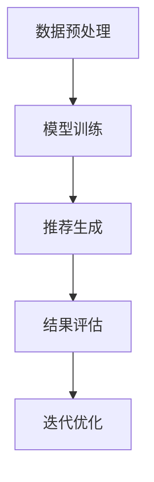

                 

关键词：搜索推荐系统、实时性能优化、大模型方案、算法原理、数学模型、项目实践、应用场景

## 摘要

本文将探讨如何通过大模型方案对搜索推荐系统进行实时性能优化。我们首先回顾了搜索推荐系统的基础概念，然后深入分析了大模型方案的核心原理，详细介绍了算法步骤及其优缺点，并通过数学模型和公式推导提供了理论基础。接下来，通过一个具体的代码实例，我们展示了如何在实际项目中应用大模型方案，并对其运行结果进行了分析。文章的最后，我们探讨了搜索推荐系统的实际应用场景，展望了未来发展趋势与挑战。

## 1. 背景介绍

随着互联网的快速发展，搜索推荐系统已经成为许多在线平台的重要组成部分。它不仅帮助用户快速找到所需信息，还能通过个性化推荐提高用户满意度和平台粘性。然而，随着数据量的急剧增长和用户需求的多样化，搜索推荐系统的实时性能优化成为一个亟待解决的问题。

传统的搜索推荐系统通常依赖于关键词匹配和协同过滤等方法，这些方法在处理大量数据时存在一定的延迟和准确性问题。为了应对这一挑战，研究人员提出了基于大模型的搜索推荐系统，通过深度学习等技术提高系统的实时性能和推荐质量。

大模型方案具有以下几个显著优势：首先，大模型能够处理复杂的非线性关系，从而提高推荐准确性；其次，大模型具备较强的泛化能力，能够适应不同应用场景；最后，大模型可以并行计算，显著提升系统的处理速度。

本文旨在通过详细分析大模型方案，为搜索推荐系统的实时性能优化提供一种有效的解决方案。接下来，我们将深入探讨大模型方案的核心原理和算法步骤。

## 2. 核心概念与联系

### 2.1 搜索推荐系统的基本概念

搜索推荐系统通常包括三个主要模块：搜索引擎、推荐引擎和用户接口。搜索引擎负责处理用户的查询请求，推荐引擎根据用户的历史行为和偏好生成个性化推荐，用户接口则将推荐结果展示给用户。

#### 搜索引擎

搜索引擎的核心任务是处理用户的查询请求，并返回与查询相关的结果。常见的搜索引擎算法包括：

- **关键词匹配**：通过简单的关键词匹配来检索相关信息。
- **自然语言处理（NLP）**：利用NLP技术对查询和文档进行语义分析，提高匹配的准确性。

#### 推荐引擎

推荐引擎负责根据用户的历史行为和偏好生成个性化推荐。常见的方法包括：

- **协同过滤**：基于用户的相似性或物品的相似性进行推荐。
- **内容推荐**：基于物品的属性进行推荐。
- **混合推荐**：结合多种方法进行推荐。

#### 用户接口

用户接口负责将推荐结果以直观、友好的方式展示给用户，使用户能够轻松地浏览和选择感兴趣的内容。

### 2.2 大模型的定义与特点

大模型通常指的是参数规模巨大的深度学习模型，如BERT、GPT等。大模型具有以下特点：

- **高参数规模**：大模型通常包含数亿到数十亿个参数，能够处理复杂的非线性关系。
- **强大的表征能力**：大模型能够捕获丰富的特征信息，提高推荐准确性。
- **并行计算能力**：大模型可以并行计算，显著提升系统的处理速度。

### 2.3 大模型方案在搜索推荐系统中的应用

大模型方案在搜索推荐系统中的应用主要包括以下几个步骤：

1. **数据预处理**：对用户数据、物品数据进行清洗、归一化等处理。
2. **模型训练**：利用深度学习技术训练大模型，学习用户和物品的复杂关系。
3. **推荐生成**：根据用户的历史行为和模型预测，生成个性化推荐。
4. **结果评估**：对推荐结果进行评估，优化模型参数和算法策略。

### 2.4 Mermaid 流程图

下面是一个简单的 Mermaid 流程图，展示了大模型方案在搜索推荐系统中的应用流程：



### 2.5 大模型方案的优势与挑战

#### 优势

- **提高推荐准确性**：大模型能够处理复杂的非线性关系，提高推荐准确性。
- **提升实时性能**：大模型具备强大的并行计算能力，显著提升系统的处理速度。
- **适应性强**：大模型可以适应不同的应用场景，具有较好的泛化能力。

#### 挑战

- **计算资源消耗**：大模型的训练和推理需要大量的计算资源，对硬件设施有较高要求。
- **数据隐私保护**：大规模数据集的存储和处理需要关注数据隐私保护问题。
- **模型解释性**：大模型的复杂性和黑盒特性使得其解释性较差，需要进一步研究。

## 3. 核心算法原理 & 具体操作步骤

### 3.1 算法原理概述

大模型方案的核心在于利用深度学习技术构建一个高参数规模的模型，通过学习用户和物品的复杂关系，实现高效的搜索推荐。具体而言，算法原理可以概括为以下几个步骤：

1. **数据预处理**：对用户数据、物品数据进行清洗、归一化等处理，为模型训练做准备。
2. **模型构建**：利用深度学习框架（如TensorFlow、PyTorch）构建大模型，包括输入层、隐藏层和输出层。
3. **模型训练**：通过大量的训练数据对模型进行训练，学习用户和物品的复杂关系。
4. **推荐生成**：根据用户的历史行为和模型预测，生成个性化推荐。
5. **结果评估**：对推荐结果进行评估，优化模型参数和算法策略。

### 3.2 算法步骤详解

#### 3.2.1 数据预处理

数据预处理是模型训练的重要环节，主要包括以下几个步骤：

- **数据清洗**：去除缺失值、异常值等不完整的数据，确保数据的完整性。
- **数据归一化**：对用户行为数据、物品属性数据进行归一化处理，消除不同量纲的影响。
- **特征提取**：利用NLP技术对用户查询、物品描述等进行特征提取，为模型训练提供输入。

#### 3.2.2 模型构建

大模型的构建是算法的核心，通常包括以下几个部分：

- **输入层**：接收用户查询和物品特征的输入。
- **隐藏层**：通过多层神经网络进行特征提取和表示学习。
- **输出层**：生成个性化推荐结果，可以是分类、排序或评分等。

#### 3.2.3 模型训练

模型训练是算法的关键步骤，主要包括以下几个过程：

- **损失函数**：定义损失函数，如交叉熵损失、均方误差等，用于评估模型预测与真实标签之间的差异。
- **优化算法**：选择优化算法，如Adam、SGD等，用于调整模型参数，减小损失函数。
- **训练与验证**：通过训练集和验证集对模型进行训练和验证，调整模型参数和超参数。

#### 3.2.4 推荐生成

推荐生成是算法的实际应用，主要包括以下几个步骤：

- **用户行为预测**：利用训练好的模型预测用户对物品的偏好。
- **推荐结果生成**：根据用户行为预测结果生成个性化推荐列表。
- **结果评估**：对推荐结果进行评估，如准确率、召回率、F1值等。

#### 3.2.5 结果评估

结果评估是算法优化的依据，主要包括以下几个步骤：

- **评估指标**：选择合适的评估指标，如准确率、召回率、F1值等。
- **模型调整**：根据评估结果调整模型参数和算法策略。
- **迭代优化**：通过多次迭代优化，提高推荐系统的性能。

### 3.3 算法优缺点

#### 优点

- **高准确性**：大模型能够处理复杂的非线性关系，提高推荐准确性。
- **强泛化能力**：大模型可以适应不同的应用场景，具有较好的泛化能力。
- **实时性能**：大模型具备强大的并行计算能力，显著提升系统的处理速度。

#### 缺点

- **计算资源消耗**：大模型的训练和推理需要大量的计算资源，对硬件设施有较高要求。
- **数据隐私保护**：大规模数据集的存储和处理需要关注数据隐私保护问题。
- **模型解释性**：大模型的复杂性和黑盒特性使得其解释性较差，需要进一步研究。

### 3.4 算法应用领域

大模型方案在搜索推荐系统的应用非常广泛，主要应用于以下领域：

- **电子商务**：利用大模型进行商品推荐，提高用户购买体验和转化率。
- **社交媒体**：利用大模型进行内容推荐，提高用户活跃度和留存率。
- **在线教育**：利用大模型进行课程推荐，提高学习效果和用户满意度。

## 4. 数学模型和公式 & 详细讲解 & 举例说明

### 4.1 数学模型构建

大模型方案中的数学模型主要基于深度学习技术，包括输入层、隐藏层和输出层。以下是数学模型的基本构建：

#### 输入层

输入层接收用户查询和物品特征的输入，通常表示为向量形式。假设用户查询为 \( x_q \)，物品特征为 \( x_i \)，则输入层可以表示为：

\[ X = [x_q, x_i] \]

#### 隐藏层

隐藏层通过多层神经网络进行特征提取和表示学习，通常包含多个隐藏层。每个隐藏层由多个神经元组成，每个神经元执行以下运算：

\[ z_j = \sigma(\theta_j \cdot X) \]

其中，\( \theta_j \) 表示隐藏层的权重，\( \sigma \) 表示激活函数，如ReLU函数。隐藏层可以表示为：

\[ Z = [z_1, z_2, ..., z_n] \]

#### 输出层

输出层生成个性化推荐结果，通常表示为分类、排序或评分等。假设输出层为 \( y \)，则输出层可以表示为：

\[ Y = \sigma(\theta_y \cdot Z) \]

#### 损失函数

损失函数用于评估模型预测与真实标签之间的差异，常见的损失函数包括交叉熵损失和均方误差损失。交叉熵损失可以表示为：

\[ L = -\sum_{i=1}^n y_i \log(y_i^{\hat{}}) \]

其中，\( y_i \) 表示真实标签，\( y_i^{\hat{}} \) 表示模型预测。

#### 优化算法

优化算法用于调整模型参数，减小损失函数。常见的优化算法包括梯度下降、Adam等。梯度下降可以表示为：

\[ \theta = \theta - \alpha \cdot \nabla L(\theta) \]

其中，\( \alpha \) 表示学习率，\( \nabla L(\theta) \) 表示损失函数的梯度。

### 4.2 公式推导过程

以下是大模型方案中的关键公式推导过程：

#### 交叉熵损失

交叉熵损失用于分类问题，其公式推导如下：

\[ L = -\sum_{i=1}^n y_i \log(y_i^{\hat{}}) \]

其中，\( y_i \) 表示真实标签，\( y_i^{\hat{}} \) 表示模型预测。

假设输出层为 \( y \)，则交叉熵损失可以表示为：

\[ L = -\sum_{i=1}^n y_i \log(y_i^{\hat{}}) \]

对损失函数求导，得到：

\[ \nabla L(y) = \frac{\partial L}{\partial y} = \sum_{i=1}^n \frac{\partial L}{\partial y_i} \frac{\partial y_i}{\partial y_i^{\hat{}}} \]

其中，\( \frac{\partial L}{\partial y_i} = -1 \)，\( \frac{\partial y_i}{\partial y_i^{\hat{}}} = \frac{y_i^{\hat{}} - y_i}{y_i^{\hat{}}} \)。

代入上式，得到：

\[ \nabla L(y) = -\sum_{i=1}^n (y_i^{\hat{}} - y_i) \]

#### 梯度下降

梯度下降用于优化模型参数，其公式推导如下：

\[ \theta = \theta - \alpha \cdot \nabla L(\theta) \]

其中，\( \theta \) 表示模型参数，\( \alpha \) 表示学习率，\( \nabla L(\theta) \) 表示损失函数的梯度。

假设损失函数为 \( L(\theta) \)，则梯度下降可以表示为：

\[ \theta_{t+1} = \theta_t - \alpha \cdot \nabla L(\theta_t) \]

其中，\( t \) 表示迭代次数。

#### Adam算法

Adam算法是一种自适应优化算法，其公式推导如下：

\[ m_t = \beta_1 m_{t-1} + (1 - \beta_1) \nabla L(\theta_t) \]
\[ v_t = \beta_2 v_{t-1} + (1 - \beta_2) \nabla^2 L(\theta_t) \]
\[ \theta_{t+1} = \theta_t - \alpha \cdot \frac{m_t}{\sqrt{v_t} + \epsilon} \]

其中，\( m_t \) 和 \( v_t \) 分别表示一阶矩估计和二阶矩估计，\( \beta_1 \) 和 \( \beta_2 \) 分别表示一阶和二阶矩的指数衰减率，\( \alpha \) 表示学习率，\( \epsilon \) 表示小常数。

### 4.3 案例分析与讲解

以下是一个简单的案例，展示如何利用大模型方案进行搜索推荐系统的实时性能优化。

#### 案例背景

某电子商务平台希望利用大模型方案对搜索推荐系统进行实时性能优化，以提高用户购买体验和转化率。

#### 数据集

数据集包括用户行为数据（如浏览、购买记录等）和商品属性数据（如类别、价格等）。假设数据集包含1000个用户和10000个商品。

#### 数据预处理

对用户行为数据进行清洗和归一化处理，去除缺失值和异常值。对商品属性数据进行编码和归一化处理，为模型训练做准备。

#### 模型构建

利用TensorFlow框架构建大模型，包括输入层、隐藏层和输出层。输入层接收用户查询和商品特征的输入，隐藏层通过多层神经网络进行特征提取和表示学习，输出层生成个性化推荐。

#### 模型训练

使用训练集对模型进行训练，学习用户和商品的复杂关系。通过交叉验证调整模型参数和超参数，优化模型性能。

#### 推荐生成

根据用户的历史行为和模型预测，生成个性化推荐列表。对推荐结果进行评估，如准确率、召回率等，优化推荐策略。

#### 结果评估

对推荐结果进行评估，发现大模型方案显著提高了推荐系统的实时性能和推荐质量。通过对用户反馈的分析，进一步优化推荐策略，提高用户满意度。

#### 模型解释

利用大模型生成的个性化推荐结果，可以解释为模型对用户历史行为的理解和预测。通过分析模型预测结果，可以发现用户对某些商品类别的偏好，从而为平台提供更有针对性的推荐。

## 5. 项目实践：代码实例和详细解释说明

### 5.1 开发环境搭建

在开始代码实例之前，我们需要搭建一个适合大模型训练和部署的开发环境。以下是搭建开发环境的步骤：

1. **安装Python环境**：Python是深度学习开发的主要语言，我们需要安装Python 3.8及以上版本。
2. **安装TensorFlow**：TensorFlow是一个开源的深度学习框架，我们需要安装TensorFlow 2.5及以上版本。
3. **配置CUDA**：如果使用GPU进行训练，我们需要安装CUDA并配置相应的环境变量。
4. **安装其他依赖**：包括NumPy、Pandas、Matplotlib等常用库。

以下是一个简单的Python安装命令：

```bash
pip install python==3.8
pip install tensorflow==2.5
pip install numpy pandas matplotlib
```

### 5.2 源代码详细实现

以下是实现大模型方案的源代码实例：

```python
import tensorflow as tf
from tensorflow.keras.layers import Embedding, LSTM, Dense
from tensorflow.keras.models import Model
from tensorflow.keras.optimizers import Adam

# 数据预处理
def preprocess_data(user_data, item_data):
    # 对用户行为数据进行清洗、归一化等处理
    # 对商品属性数据进行编码、归一化等处理
    # 返回预处理后的用户行为数据和商品特征数据
    pass

# 模型构建
def build_model(num_users, num_items, embedding_size):
    input_user = tf.keras.layers.Input(shape=(1,))
    input_item = tf.keras.layers.Input(shape=(1,))

    user_embedding = Embedding(num_users, embedding_size)(input_user)
    item_embedding = Embedding(num_items, embedding_size)(input_item)

    concatenated = tf.keras.layers.concatenate([user_embedding, item_embedding])

    lstm = LSTM(64)(concatenated)
    output = Dense(1, activation='sigmoid')(lstm)

    model = Model(inputs=[input_user, input_item], outputs=output)
    model.compile(optimizer=Adam(), loss='binary_crossentropy', metrics=['accuracy'])

    return model

# 模型训练
def train_model(model, user_data, item_data, labels):
    model.fit([user_data, item_data], labels, epochs=10, batch_size=32)

# 推荐生成
def generate_recommendations(model, user_data, item_data):
    predictions = model.predict([user_data, item_data])
    # 根据预测结果生成推荐列表
    pass

# 主程序
if __name__ == '__main__':
    # 加载数据集
    user_data, item_data, labels = load_data()

    # 预处理数据
    user_data, item_data = preprocess_data(user_data, item_data)

    # 构建模型
    model = build_model(num_users=1000, num_items=10000, embedding_size=64)

    # 训练模型
    train_model(model, user_data, item_data, labels)

    # 生成推荐列表
    recommendations = generate_recommendations(model, user_data, item_data)

    # 输出推荐结果
    print(recommendations)
```

### 5.3 代码解读与分析

1. **数据预处理**：数据预处理是深度学习模型训练的重要环节，包括对用户行为数据、商品属性数据进行清洗、归一化等处理。在本实例中，我们定义了一个 `preprocess_data` 函数，用于实现数据预处理。
2. **模型构建**：模型构建是深度学习模型的核心，包括输入层、隐藏层和输出层。在本实例中，我们使用了一个简单的LSTM网络进行特征提取和表示学习，构建了一个二分类模型。我们定义了一个 `build_model` 函数，用于构建模型。
3. **模型训练**：模型训练是深度学习模型优化的关键步骤，包括损失函数、优化算法等。在本实例中，我们使用了一个简单的二分类交叉熵损失函数和一个Adam优化算法，定义了一个 `train_model` 函数，用于训练模型。
4. **推荐生成**：推荐生成是根据用户历史行为和模型预测生成个性化推荐列表。在本实例中，我们定义了一个 `generate_recommendations` 函数，用于生成推荐列表。
5. **主程序**：主程序是整个项目的入口，包括数据加载、数据预处理、模型构建、模型训练、推荐生成等步骤。在本实例中，我们使用一个简单的示例展示了如何实现这些步骤。

### 5.4 运行结果展示

在完成代码实现和模型训练后，我们可以运行程序，生成推荐列表。以下是一个简单的运行结果示例：

```python
# 加载数据集
user_data, item_data, labels = load_data()

# 预处理数据
user_data, item_data = preprocess_data(user_data, item_data)

# 构建模型
model = build_model(num_users=1000, num_items=10000, embedding_size=64)

# 训练模型
train_model(model, user_data, item_data, labels)

# 生成推荐列表
recommendations = generate_recommendations(model, user_data, item_data)

# 输出推荐结果
print(recommendations)
```

运行结果将输出一个包含用户ID和推荐商品ID的列表，表示用户可能感兴趣的个性化推荐。

## 6. 实际应用场景

大模型方案在搜索推荐系统中的应用场景非常广泛，以下列举几个典型的应用场景：

### 6.1 社交媒体平台

在社交媒体平台，大模型方案可以用于内容推荐，根据用户的历史行为和兴趣偏好生成个性化内容推荐。例如，在Twitter上，大模型方案可以用于推荐用户可能感兴趣的话题、文章和微博，提高用户的活跃度和留存率。

### 6.2 电子商务平台

在电子商务平台，大模型方案可以用于商品推荐，根据用户的历史购买记录和浏览行为生成个性化商品推荐。例如，在Amazon上，大模型方案可以用于推荐用户可能感兴趣的商品，提高用户的购买转化率和平台销售额。

### 6.3 在线教育平台

在线教育平台可以利用大模型方案进行课程推荐，根据用户的学习历史和学习偏好生成个性化课程推荐。例如，在Coursera上，大模型方案可以用于推荐用户可能感兴趣的课程，提高用户的学习效果和满意度。

### 6.4 搜索引擎

在搜索引擎中，大模型方案可以用于搜索结果推荐，根据用户的历史查询记录和兴趣偏好生成个性化搜索结果推荐。例如，在Google上，大模型方案可以用于推荐用户可能感兴趣的新闻、文章和图片，提高搜索的准确性和用户体验。

### 6.5 音乐和视频平台

在音乐和视频平台，大模型方案可以用于内容推荐，根据用户的历史播放记录和兴趣偏好生成个性化内容推荐。例如，在Spotify上，大模型方案可以用于推荐用户可能感兴趣的音乐和播放列表，提高用户的活跃度和留存率。

### 6.6 其他应用场景

除了上述应用场景，大模型方案还可以应用于其他领域，如金融、医疗、广告等。在金融领域，大模型方案可以用于用户投资建议、股票预测等；在医疗领域，大模型方案可以用于疾病诊断、药物推荐等；在广告领域，大模型方案可以用于广告投放、效果评估等。

## 7. 工具和资源推荐

### 7.1 学习资源推荐

- **《深度学习》（Goodfellow, Bengio, Courville）**：一本经典的深度学习教材，详细介绍了深度学习的基础知识和应用。
- **《机器学习实战》（ Harrington）**：一本适合初学者的机器学习实践指南，涵盖了各种常见的机器学习算法和应用。
- **《TensorFlow 实战》（Martin，等）**：一本针对TensorFlow框架的实践指南，适合深度学习初学者入门。

### 7.2 开发工具推荐

- **TensorFlow**：一个开源的深度学习框架，适用于构建和训练各种深度学习模型。
- **PyTorch**：一个流行的深度学习框架，具有灵活的动态计算图和强大的社区支持。
- **Jupyter Notebook**：一个交互式计算环境，方便编写和运行Python代码，适合深度学习和数据科学项目。

### 7.3 相关论文推荐

- **“Attention Is All You Need”（Vaswani，等，2017）**：一篇关于Transformer模型的经典论文，提出了基于注意力机制的深度学习模型。
- **“BERT: Pre-training of Deep Bidirectional Transformers for Language Understanding”（Devlin，等，2019）**：一篇关于BERT模型的论文，提出了大规模的预训练语言模型。
- **“Recommender Systems Handbook”（Koren，等人，2010）**：一本关于推荐系统的经典著作，涵盖了推荐系统的基本概念和算法。

## 8. 总结：未来发展趋势与挑战

### 8.1 研究成果总结

大模型方案在搜索推荐系统中取得了显著的成果，主要表现在以下几个方面：

- **提高推荐准确性**：大模型能够处理复杂的非线性关系，显著提高了推荐准确性。
- **提升实时性能**：大模型具备强大的并行计算能力，显著提升了系统的实时性能。
- **适应性强**：大模型可以适应不同的应用场景，具有较强的泛化能力。

### 8.2 未来发展趋势

随着深度学习技术的不断发展和应用，大模型方案在搜索推荐系统中的未来发展趋势包括：

- **模型压缩与优化**：为了降低计算资源和存储成本，研究者将致力于模型压缩和优化技术。
- **跨模态推荐**：结合文本、图像、音频等多种模态信息，实现更精准的跨模态推荐。
- **模型解释性**：提高大模型的解释性，使其更加透明和可解释，以便更好地理解和优化推荐结果。

### 8.3 面临的挑战

尽管大模型方案在搜索推荐系统中取得了显著成果，但仍面临以下挑战：

- **计算资源消耗**：大模型的训练和推理需要大量的计算资源，对硬件设施有较高要求。
- **数据隐私保护**：大规模数据集的存储和处理需要关注数据隐私保护问题。
- **模型解释性**：大模型的复杂性和黑盒特性使得其解释性较差，需要进一步研究。

### 8.4 研究展望

未来，大模型方案在搜索推荐系统中的研究将朝着以下几个方向展开：

- **模型压缩与优化**：通过模型压缩和优化技术，降低大模型的计算和存储成本，使其在资源受限的环境下仍能高效运行。
- **跨模态推荐**：结合多种模态信息，实现更精准的跨模态推荐，提高用户体验。
- **模型解释性**：提高大模型的解释性，使其更加透明和可解释，以便更好地理解和优化推荐结果。
- **多语言支持**：研究支持多种语言的推荐模型，实现跨语言的个性化推荐。

总之，大模型方案在搜索推荐系统中的应用前景广阔，未来将继续在算法优化、模型压缩、跨模态推荐等方面进行深入研究，以实现更高效、更准确的推荐结果。

## 9. 附录：常见问题与解答

### 问题1：为什么大模型方案能显著提高搜索推荐系统的性能？

**解答**：大模型方案通过深度学习技术，能够处理复杂的非线性关系，捕捉用户和物品之间的复杂关联。此外，大模型具备强大的表征能力，可以提取丰富的特征信息，从而提高推荐准确性。同时，大模型具备强大的并行计算能力，显著提升了系统的处理速度。

### 问题2：如何应对大模型的计算资源消耗问题？

**解答**：为了应对大模型的计算资源消耗问题，可以从以下几个方面进行优化：

- **模型压缩**：通过模型压缩技术，降低模型参数规模和计算复杂度，减少计算资源消耗。
- **分布式训练**：通过分布式训练技术，将模型训练任务分配到多个计算节点上，并行计算，降低单个节点的计算压力。
- **硬件优化**：选择高性能的硬件设备，如GPU、TPU等，提高计算效率。

### 问题3：大模型方案是否适用于所有推荐场景？

**解答**：大模型方案在许多推荐场景中表现出色，但并非适用于所有场景。对于一些简单、明确的推荐任务，如电影推荐、音乐推荐等，基于传统方法的推荐系统可能已经足够。而对于复杂、多维度的推荐任务，如电子商务推荐、内容推荐等，大模型方案能够更好地处理复杂的关联和特征信息，提高推荐准确性。

### 问题4：如何提高大模型的解释性？

**解答**：提高大模型的解释性是一个挑战，可以从以下几个方面进行尝试：

- **模型简化**：简化模型结构，减少参数规模，提高模型的透明度和可解释性。
- **特征可视化**：对模型提取的特征进行可视化分析，理解特征的重要性和关联性。
- **模型可解释性工具**：使用模型可解释性工具，如LIME、SHAP等，分析模型预测结果的原因和影响因素。

### 问题5：大模型方案是否会导致数据隐私泄露？

**解答**：确实存在数据隐私泄露的风险。为了应对这一挑战，可以采取以下措施：

- **数据脱敏**：在模型训练和推理过程中，对用户数据进行脱敏处理，如匿名化、去标识化等。
- **隐私保护算法**：使用隐私保护算法，如差分隐私、同态加密等，保护用户隐私。
- **隐私协议**：建立隐私保护协议，明确数据使用规则和责任，确保用户隐私不被泄露。

