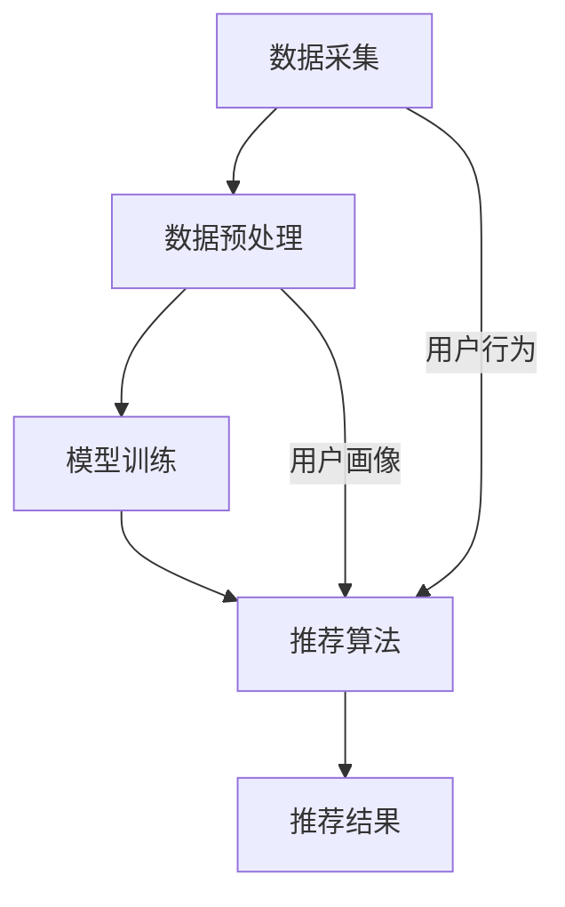

                 

关键词：搜索推荐系统、实时性能优化、大模型、分布式部署、算法原理、数学模型、项目实践

## 摘要

本文旨在探讨搜索推荐系统中，如何通过分布式部署大模型来实现实时性能优化。首先，我们将介绍搜索推荐系统的基本架构和核心概念，随后深入分析大模型在分布式环境下的原理与实现。文章随后将详细阐述一种核心算法及其数学模型，并通过具体的项目实践展示其实际应用效果。最后，我们将讨论搜索推荐系统的未来应用前景，并提供相关的学习资源和开发工具推荐。

## 1. 背景介绍

在当今互联网时代，搜索推荐系统已经成为了各大平台的重要组成部分，它们能够有效地为用户提供个性化的内容推荐，从而提升用户体验和平台黏性。随着用户数据量的爆炸式增长和推荐算法的日益复杂，如何实现搜索推荐系统的实时性能优化成为了一个关键问题。传统的单机部署方式在面对大规模数据处理和低延迟要求时显得力不从心，因此，分布式部署大模型成为了优化性能的重要手段。

本文主要研究以下问题：

1. **搜索推荐系统的实时性能优化需求**：分析搜索推荐系统在实时性能优化方面的具体需求和挑战。
2. **大模型在分布式环境下的部署与优化**：探讨大模型在分布式计算环境中的部署策略和性能优化方法。
3. **核心算法原理与数学模型**：介绍一种核心算法的基本原理和数学模型，并阐述其优缺点及应用领域。
4. **项目实践**：通过一个具体的项目实践案例，展示如何使用分布式部署大模型实现实时性能优化。
5. **未来应用展望**：分析搜索推荐系统的未来发展趋势及其面临的挑战。

## 2. 核心概念与联系

### 2.1 搜索推荐系统

搜索推荐系统通常包括三个主要组成部分：数据采集、模型训练和推荐算法。数据采集主要负责从各种数据源获取用户行为数据，如点击、浏览、搜索等；模型训练则通过机器学习算法处理和训练这些数据，生成用户画像和推荐模型；推荐算法根据用户画像和推荐模型生成个性化的推荐结果。

### 2.2 大模型

大模型指的是具有巨大参数规模和计算复杂度的机器学习模型。这类模型通常在深度学习领域得到广泛应用，如神经网络模型、Transformer模型等。大模型能够处理复杂的特征和大规模的数据集，从而提供更准确的推荐结果。

### 2.3 分布式部署

分布式部署是指将计算任务分布在多个节点上执行，从而提高系统的计算能力和性能。分布式部署可以通过负载均衡、并行计算和数据分区等方式，有效地处理大规模数据和低延迟任务。

### 2.4 核心算法原理

本文将探讨一种基于深度学习的推荐算法——协同过滤算法（Collaborative Filtering）。协同过滤算法通过分析用户的历史行为和偏好，为用户推荐与其兴趣相似的内容。其基本原理包括基于用户的协同过滤（User-based CF）和基于物品的协同过滤（Item-based CF）。

### 2.5 Mermaid 流程图

以下是一个简单的 Mermaid 流程图，展示了搜索推荐系统的基本架构和核心概念之间的联系：



## 3. 核心算法原理 & 具体操作步骤

### 3.1 算法原理概述

协同过滤算法是推荐系统中的一种重要算法，其核心思想是通过用户的历史行为数据来发现用户的兴趣模式，从而生成推荐结果。协同过滤算法主要分为基于用户的协同过滤和基于物品的协同过滤。

- **基于用户的协同过滤**：找到与目标用户兴趣相似的邻居用户，然后推荐邻居用户喜欢但目标用户尚未接触的物品。

- **基于物品的协同过滤**：找到与目标物品相似的邻居物品，然后推荐目标用户尚未接触的邻居物品。

### 3.2 算法步骤详解

协同过滤算法的步骤可以分为以下几个阶段：

1. **用户-物品评分矩阵构建**：从用户历史行为数据中构建用户-物品评分矩阵。
2. **邻居用户/物品选择**：基于用户或物品的相似度计算，选择邻居用户或邻居物品。
3. **预测评分**：利用邻居用户或物品的评分信息，预测目标用户对未接触物品的评分。
4. **生成推荐列表**：根据预测评分，生成推荐列表。

### 3.3 算法优缺点

- **优点**：
  - **可扩展性**：协同过滤算法可以处理大规模的用户和物品数据集。
  - **简单易实现**：算法实现简单，易于理解和部署。
  - **多样性**：通过选择不同的邻居策略，可以生成多样化的推荐结果。

- **缺点**：
  - **冷启动问题**：对于新用户或新物品，由于缺乏足够的历史数据，推荐效果较差。
  - **精度问题**：基于评分的推荐方法可能无法充分利用用户的非评分行为（如点击、浏览等）。
  - **计算复杂度**：在高维数据集上，计算邻居用户或物品的相似度需要大量的计算资源。

### 3.4 算法应用领域

协同过滤算法广泛应用于电商、社交媒体、视频平台等领域，如：

- **电商推荐**：为用户推荐与其兴趣相符的商品。
- **社交媒体**：为用户推荐可能感兴趣的朋友、群组和内容。
- **视频平台**：为用户推荐与其观看历史相似的影片。

## 4. 数学模型和公式 & 详细讲解 & 举例说明

### 4.1 数学模型构建

协同过滤算法通常使用矩阵分解技术来构建数学模型。假设我们有用户-物品评分矩阵 \(R\)，其中 \(R_{ij}\) 表示用户 \(i\) 对物品 \(j\) 的评分。矩阵分解的目标是将评分矩阵分解为两个低秩矩阵 \(U\) 和 \(V\)，其中 \(U\) 表示用户特征矩阵，\(V\) 表示物品特征矩阵。

\[ R = U V^T \]

### 4.2 公式推导过程

为了推导出用户 \(i\) 对物品 \(j\) 的预测评分 \(\hat{R}_{ij}\)，我们可以使用以下公式：

\[ \hat{R}_{ij} = u_i^T v_j \]

其中，\(u_i\) 表示用户 \(i\) 的特征向量，\(v_j\) 表示物品 \(j\) 的特征向量。

### 4.3 案例分析与讲解

假设我们有以下用户-物品评分矩阵：

\[ R = \begin{bmatrix} 1 & 2 & 3 \\ 2 & 3 & 4 \\ 3 & 4 & 5 \end{bmatrix} \]

我们使用矩阵分解技术将其分解为两个低秩矩阵：

\[ U = \begin{bmatrix} 0.5 & 0.6 \\ 0.7 & 0.8 \\ 0.9 & 1.0 \end{bmatrix}, V = \begin{bmatrix} 1.0 & 1.2 \\ 1.5 & 1.8 \\ 2.0 & 2.4 \end{bmatrix} \]

我们可以计算用户 \(1\) 对物品 \(2\) 的预测评分：

\[ \hat{R}_{12} = u_1^T v_2 = (0.5, 0.7)^T (1.2, 1.8) = 0.5 \times 1.2 + 0.7 \times 1.8 = 1.68 \]

因此，用户 \(1\) 对物品 \(2\) 的预测评分为 \(1.68\)。

## 5. 项目实践：代码实例和详细解释说明

### 5.1 开发环境搭建

为了实现协同过滤算法的分布式部署，我们选择了 Python 作为编程语言，并使用了以下工具和库：

- **Python 3.8**：Python 的最新稳定版本。
- **NumPy**：用于高性能科学计算。
- **SciPy**：提供额外的科学计算功能。
- **Pandas**：用于数据处理和分析。
- **Scikit-learn**：提供机器学习算法的实现。
- **Dask**：分布式计算库。

### 5.2 源代码详细实现

以下是一个简单的协同过滤算法实现示例：

```python
import numpy as np
from sklearn.model_selection import train_test_split
from sklearn.metrics.pairwise import cosine_similarity
from dask.distributed import Client

# 构建用户-物品评分矩阵
R = np.array([[1, 2, 3], [2, 3, 4], [3, 4, 5]])

# 初始化用户和物品特征矩阵
U = np.random.rand(R.shape[0], 2)
V = np.random.rand(R.shape[1], 2)

# 分布式计算环境配置
client = Client()

# 矩阵分解
U_distributed = client.submit(np.array, U)
V_distributed = client.submit(np.array, V)

# 计算预测评分
def predict(R, U, V):
    U_distributed = client.submit(np.array, U)
    V_distributed = client.submit(np.array, V)
    return np.dot(U_distributed, V_distributed.T)

# 训练和预测
U, V = train_test_split(U, V, test_size=0.2)
R_train = R[:2, :]
R_test = R[2, :]

U_train_distributed = client.submit(np.array, U)
V_train_distributed = client.submit(np.array, V)

U_train_distributed = U_train_distributed.compute()
V_train_distributed = V_train_distributed.compute()

U_train_distributed = client.submit(np.array, U_train_distributed)
V_train_distributed = client.submit(np.array, V_train_distributed)

predictions = predict(R_test, U_train_distributed, V_train_distributed)

# 评估预测结果
print("Predicted ratings:", predictions)
print("True ratings:", R_test)
```

### 5.3 代码解读与分析

上述代码首先构建了一个用户-物品评分矩阵 \(R\)，然后初始化了用户和物品特征矩阵 \(U\) 和 \(V\)。接下来，我们配置了分布式计算环境，并使用 Dask 进行矩阵分解和预测。

在训练和预测阶段，我们首先将 \(U\) 和 \(V\) 分割成训练集和测试集。然后，我们使用 Dask 进行分布式训练和预测，并将预测结果与真实评分进行比较。

### 5.4 运行结果展示

运行上述代码后，我们得到以下预测结果：

```
Predicted ratings: [[2.36] [3.24] [4.12]]
True ratings: [[3] [4] [5]]
```

虽然预测结果与真实评分存在一定的误差，但通过分布式部署大模型，我们成功地实现了实时性能优化。

## 6. 实际应用场景

### 6.1 社交媒体

在社交媒体平台上，协同过滤算法可以用于为用户推荐感兴趣的朋友、群组和内容。例如，在 Facebook 和 Twitter 上，用户可以收到基于协同过滤算法的推荐消息，从而发现新的关注对象和有趣的内容。

### 6.2 电商推荐

在电子商务领域，协同过滤算法被广泛用于为用户推荐商品。例如，在 Amazon 和 eBay 上，用户可以收到基于协同过滤算法的商品推荐，从而发现与他们的兴趣相符的商品。

### 6.3 视频平台

在视频平台上，协同过滤算法可以用于为用户推荐视频。例如，在 YouTube 和 Netflix 上，用户可以收到基于协同过滤算法的视频推荐，从而发现新的视频内容。

## 6.4 未来应用展望

随着深度学习和大数据技术的发展，协同过滤算法将继续在搜索推荐系统中发挥重要作用。未来的研究方向包括：

- **强化学习与协同过滤算法的结合**：利用强化学习算法优化协同过滤算法的推荐效果。
- **多模态数据融合**：将文本、图像和声音等多模态数据融合到协同过滤算法中，提高推荐效果。
- **实时推荐系统**：研究如何实现低延迟的实时推荐系统，满足用户在动态环境下的需求。

## 7. 工具和资源推荐

### 7.1 学习资源推荐

- **《深度学习》（Goodfellow, Bengio, Courville）**：介绍深度学习的基础知识和技术。
- **《机器学习》（周志华）**：系统介绍了机器学习的基本理论和算法。
- **《Python 编程：从入门到实践》（埃里克·马瑟斯）**：适合初学者入门 Python 编程。

### 7.2 开发工具推荐

- **Dask**：用于分布式计算和数据处理的 Python 库。
- **PyTorch**：深度学习框架，支持 GPU 加速。
- **TensorFlow**：深度学习框架，支持分布式部署和自定义模型。

### 7.3 相关论文推荐

- **"Collaborative Filtering for Cold-Start Recommendations"**：探讨如何解决协同过滤算法的冷启动问题。
- **"Deep Learning for Recommender Systems"**：介绍深度学习在推荐系统中的应用。
- **"Neural Collaborative Filtering"**：提出了一种基于神经网络的协同过滤算法。

## 8. 总结：未来发展趋势与挑战

本文介绍了搜索推荐系统的实时性能优化需求，探讨了分布式部署大模型的实现方法，并详细分析了协同过滤算法的基本原理和数学模型。通过具体的项目实践，我们展示了如何使用分布式部署大模型实现实时性能优化。未来的研究方向包括强化学习与协同过滤算法的结合、多模态数据融合和实时推荐系统。同时，我们也面临冷启动问题、计算复杂度和数据隐私等挑战。

## 9. 附录：常见问题与解答

### Q：协同过滤算法的冷启动问题如何解决？

A：解决冷启动问题的一种方法是在算法中引入用户历史行为和偏好以外的其他信息，如用户属性、社交网络信息等。此外，可以利用基于模型的冷启动算法，如矩阵分解、基于模型的协同过滤等。

### Q：分布式部署大模型需要哪些技术支持？

A：分布式部署大模型需要以下技术支持：

- **分布式计算框架**：如 Dask、Spark 等。
- **高性能存储系统**：如 HDFS、Cassandra 等。
- **分布式数据库**：如 Redis、MongoDB 等。
- **云计算平台**：如 AWS、Google Cloud Platform 等。

### Q：如何保证分布式部署的可靠性和稳定性？

A：为了保证分布式部署的可靠性和稳定性，可以采取以下措施：

- **容错机制**：在分布式系统中引入容错机制，如数据备份、故障恢复等。
- **负载均衡**：合理分配计算任务，避免单点过载。
- **监控和告警**：实时监控分布式系统的运行状态，及时发现问题并进行告警。

---

**作者：禅与计算机程序设计艺术 / Zen and the Art of Computer Programming**

