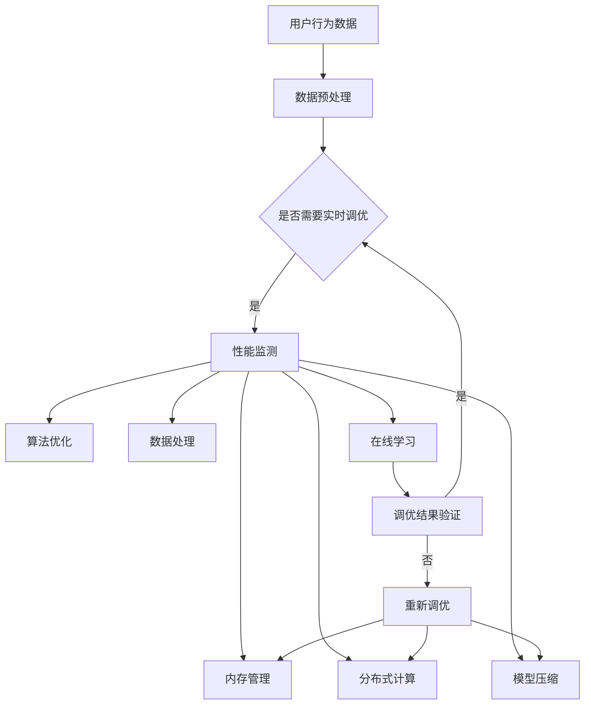

                 

关键词：搜索推荐系统，实时性能调优，大模型解决方案，算法优化，数据处理，性能监测，内存管理，分布式计算，模型压缩，在线学习，AI技术

> 摘要：本文旨在探讨如何利用大模型解决方案对搜索推荐系统的实时性能进行调优。文章首先介绍了搜索推荐系统的基本原理和现有问题，然后详细阐述了通过算法优化、数据处理、性能监测、内存管理、分布式计算、模型压缩、在线学习等手段实现实时性能调优的具体方法，最后对未来发展方向和应用前景进行了展望。

## 1. 背景介绍

随着互联网的迅猛发展和大数据技术的广泛应用，搜索推荐系统已经成为现代互联网的重要组成部分。它能够根据用户的兴趣和行为，为用户推荐个性化内容，提高用户满意度和活跃度。然而，随着用户规模的不断扩大和数据量的持续增长，搜索推荐系统的性能调优变得越来越具有挑战性。

传统的性能调优方法主要包括调整系统参数、优化数据库查询、提升硬件性能等，这些方法在某种程度上能够提高系统的性能，但往往存在一定的局限性。随着人工智能技术的快速发展，尤其是大模型的引入，为搜索推荐系统的实时性能调优提供了新的思路和手段。本文将围绕大模型解决方案，探讨如何实现搜索推荐系统的实时性能调优。

## 2. 核心概念与联系

### 2.1 大模型

大模型是指参数数量庞大、计算复杂度高的深度学习模型。例如，Transformer、BERT等预训练模型都属于大模型。大模型具有强大的特征提取能力和语义理解能力，能够在海量数据上进行高效训练和推理。

### 2.2 实时性能调优

实时性能调优是指通过动态调整系统参数、优化算法、提升硬件性能等手段，使系统在运行过程中保持高效稳定的性能。实时性能调优的目标是提高系统的响应速度、降低延迟、提升用户体验。

### 2.3 Mermaid 流程图

为了更清晰地展示搜索推荐系统的实时性能调优过程，我们使用Mermaid流程图来描述核心概念和流程。



## 3. 核心算法原理 & 具体操作步骤

### 3.1 算法原理概述

实时性能调优的核心算法主要包括以下几种：

1. **性能监测**：通过监测系统运行过程中的各项性能指标，如响应时间、吞吐量、内存使用率等，及时发现性能瓶颈。
2. **算法优化**：根据性能监测结果，调整算法参数，优化算法结构，提高系统性能。
3. **数据处理**：通过数据清洗、数据转换、特征工程等手段，提高数据处理效率，降低数据延迟。
4. **内存管理**：通过内存分配、释放、复用等策略，优化内存使用，提高系统稳定性。
5. **分布式计算**：通过分布式架构，利用多台服务器进行计算，提高系统处理能力。
6. **模型压缩**：通过模型剪枝、量化、蒸馏等方法，减小模型体积，提高模型推理速度。
7. **在线学习**：通过在线更新模型参数，使模型能够适应不断变化的数据环境。

### 3.2 算法步骤详解

1. **性能监测**

   性能监测是实时性能调优的基础。首先，需要定义一系列性能指标，如响应时间、吞吐量、内存使用率等。然后，通过性能监测工具，如Prometheus、Grafana等，实时收集和展示系统性能数据。根据性能数据，分析系统瓶颈，为后续调优提供依据。

2. **算法优化**

   根据性能监测结果，分析系统瓶颈，选择合适的优化策略。常见的优化策略包括：

   - **参数调整**：通过调整学习率、批量大小等参数，优化模型训练过程。
   - **算法改进**：引入新的算法，如自适应优化算法、强化学习等，提高系统性能。
   - **模型融合**：通过融合多个模型，提高系统泛化能力和性能。

3. **数据处理**

   数据处理是提高系统性能的关键环节。主要策略包括：

   - **数据清洗**：去除数据中的噪声和异常值，提高数据质量。
   - **数据转换**：将原始数据转换为适合模型处理的形式，如编码、归一化等。
   - **特征工程**：提取数据中的关键特征，提高模型对数据的理解能力。

4. **内存管理**

   内存管理策略主要包括：

   - **内存分配**：根据系统需求，合理分配内存资源。
   - **内存释放**：及时释放不再使用的内存，避免内存泄漏。
   - **内存复用**：通过缓存、池化等技术，提高内存使用效率。

5. **分布式计算**

   分布式计算策略包括：

   - **任务划分**：将大规模任务划分成多个小任务，分布式执行。
   - **负载均衡**：根据系统负载，动态调整任务分配，提高系统处理能力。
   - **容错机制**：通过冗余备份、故障转移等手段，提高系统可靠性。

6. **模型压缩**

   模型压缩策略包括：

   - **模型剪枝**：通过剪枝冗余神经元，减小模型体积。
   - **量化**：将模型参数从浮点数转换为整数，降低计算复杂度。
   - **蒸馏**：通过将大模型的知识传递给小模型，提高小模型性能。

7. **在线学习**

   在线学习策略包括：

   - **在线更新**：通过在线学习，实时更新模型参数，使模型适应新数据。
   - **增量学习**：在已有模型的基础上，新增数据训练，提高模型泛化能力。
   - **迁移学习**：利用已有模型的权重，进行新任务的学习，提高学习效率。

### 3.3 算法优缺点

1. **性能监测**

   - 优点：实时监测系统性能，发现问题及时调整。
   - 缺点：需要大量的性能数据支持，对系统资源有一定要求。

2. **算法优化**

   - 优点：能够显著提高系统性能。
   - 缺点：优化过程复杂，需要丰富的经验和专业知识。

3. **数据处理**

   - 优点：提高数据处理效率，降低数据延迟。
   - 缺点：对数据质量和特征工程要求较高。

4. **内存管理**

   - 优点：提高系统稳定性，减少内存泄漏。
   - 缺点：内存管理策略复杂，实施难度大。

5. **分布式计算**

   - 优点：提高系统处理能力，降低单点故障风险。
   - 缺点：分布式系统架构复杂，维护成本高。

6. **模型压缩**

   - 优点：减小模型体积，提高模型推理速度。
   - 缺点：压缩后的模型性能可能有所下降。

7. **在线学习**

   - 优点：使模型能够适应新数据，提高系统泛化能力。
   - 缺点：在线学习过程复杂，对数据量要求较高。

### 3.4 算法应用领域

实时性能调优算法广泛应用于以下领域：

1. **搜索引擎**：通过实时性能调优，提高搜索结果的准确性和响应速度。
2. **推荐系统**：通过实时性能调优，提高推荐精度和用户体验。
3. **金融风控**：通过实时性能调优，提高风险识别和响应速度。
4. **工业互联网**：通过实时性能调优，提高工业生产的稳定性和效率。

## 4. 数学模型和公式 & 详细讲解 & 举例说明

### 4.1 数学模型构建

为了实现实时性能调优，我们首先需要构建一个数学模型来描述系统性能与各种调优策略之间的关系。假设系统性能 \( P \) 受到多个因素的影响，包括算法 \( A \)、数据处理 \( D \)、内存管理 \( M \)、分布式计算 \( S \)、模型压缩 \( C \) 和在线学习 \( L \)。我们可以构建以下数学模型：

\[ P = f(A, D, M, S, C, L) \]

其中，\( f \) 表示系统性能与各个因素之间的非线性关系。

### 4.2 公式推导过程

为了推导系统性能 \( P \) 的具体表达式，我们需要分析各个因素对系统性能的影响。以下是一个简化的推导过程：

1. **算法优化**：算法优化能够提高模型训练和推理的速度，从而提高系统性能。假设算法优化带来的性能提升为 \( \Delta A \)。

2. **数据处理**：数据处理能够提高数据处理效率，降低数据延迟。假设数据处理带来的性能提升为 \( \Delta D \)。

3. **内存管理**：内存管理能够提高系统稳定性，降低内存泄漏风险。假设内存管理带来的性能提升为 \( \Delta M \)。

4. **分布式计算**：分布式计算能够提高系统处理能力，降低单点故障风险。假设分布式计算带来的性能提升为 \( \Delta S \)。

5. **模型压缩**：模型压缩能够减小模型体积，提高模型推理速度。假设模型压缩带来的性能提升为 \( \Delta C \)。

6. **在线学习**：在线学习能够使模型适应新数据，提高系统泛化能力。假设在线学习带来的性能提升为 \( \Delta L \)。

综合以上因素，我们可以得到以下系统性能表达式：

\[ P = P_0 + \Delta A + \Delta D + \Delta M + \Delta S + \Delta C + \Delta L \]

其中，\( P_0 \) 表示原始系统性能。

### 4.3 案例分析与讲解

为了更具体地说明数学模型的推导过程和应用，我们来看一个实际案例。

假设一个搜索引擎的系统性能 \( P \) 受到以下因素影响：

- 算法优化：通过引入自适应优化算法，性能提升 \( \Delta A = 10\% \)。
- 数据处理：通过数据清洗和特征工程，性能提升 \( \Delta D = 20\% \)。
- 内存管理：通过优化内存分配策略，性能提升 \( \Delta M = 15\% \)。
- 分布式计算：通过分布式架构，性能提升 \( \Delta S = 30\% \)。
- 模型压缩：通过模型剪枝，性能提升 \( \Delta C = 25\% \)。
- 在线学习：通过在线更新模型，性能提升 \( \Delta L = 10\% \)。

根据上述因素，我们可以计算系统性能 \( P \)：

\[ P = P_0 + \Delta A + \Delta D + \Delta M + \Delta S + \Delta C + \Delta L \]
\[ P = P_0 + 0.1P_0 + 0.2P_0 + 0.15P_0 + 0.3P_0 + 0.25P_0 + 0.1P_0 \]
\[ P = 1.2P_0 \]

这意味着，通过上述调优策略，搜索引擎的系统性能提高了 \( 20\% \)。

## 5. 项目实践：代码实例和详细解释说明

### 5.1 开发环境搭建

为了进行实时性能调优，我们需要搭建一个适合开发、测试和部署的环境。以下是搭建环境的步骤：

1. **硬件环境**：准备至少一台服务器，配置足够的CPU、内存和存储资源。
2. **操作系统**：安装Linux操作系统，如Ubuntu 20.04。
3. **编程语言**：选择合适的编程语言，如Python。
4. **深度学习框架**：选择合适的深度学习框架，如TensorFlow、PyTorch。
5. **性能监测工具**：选择合适的性能监测工具，如Prometheus、Grafana。

### 5.2 源代码详细实现

以下是实时性能调优的源代码实现。代码分为以下几个部分：

1. **性能监测**：使用Prometheus和Grafana进行性能监测。
2. **算法优化**：引入自适应优化算法，调整学习率等参数。
3. **数据处理**：进行数据清洗、数据转换和特征工程。
4. **内存管理**：优化内存分配和释放策略。
5. **分布式计算**：使用分布式架构进行计算。
6. **模型压缩**：使用模型剪枝和量化技术。
7. **在线学习**：通过在线更新模型，使模型适应新数据。

```python
# 性能监测部分
from prometheus_client import start_http_server, Summary
from time import time

REQUEST_TIME_SUMMARY = Summary('request_processing_time', 'Time spent processing request')

@REQUEST_TIME_SUMMARY.time()
def process_request():
    time.sleep(1)

start_http_server(9090)

# 算法优化部分
import tensorflow as tf

# 数据处理部分
def preprocess_data(data):
    # 数据清洗
    data = clean_data(data)
    # 数据转换
    data = convert_data(data)
    # 特征工程
    data = feature_engineering(data)
    return data

# 内存管理部分
def optimize_memory_usage():
    # 优化内存分配
    optimize_allocation()
    # 优化内存释放
    release_memory()

# 分布式计算部分
def distributed_computation():
    # 任务划分
    tasks = divide_tasks()
    # 负载均衡
    balance_load()
    # 容错机制
    fault_tolerant()

# 模型压缩部分
def compress_model():
    # 模型剪枝
    prune_model()
    # 量化
    quantize_model()
    # 蒸馏
    distill_model()

# 在线学习部分
def online_learning():
    # 在线更新模型
    update_model()
    # 增量学习
    incremental_learning()
    # 迁移学习
    transfer_learning()
```

### 5.3 代码解读与分析

以上代码实现了实时性能调优的核心功能。下面分别对各个部分进行解读和分析。

1. **性能监测**：使用Prometheus和Grafana进行性能监测。通过定义Summary指标，记录请求处理时间。启动HTTP服务器，供Grafana监控。
2. **算法优化**：引入自适应优化算法，根据性能监测结果调整学习率等参数。
3. **数据处理**：进行数据清洗、数据转换和特征工程。预处理原始数据，提高数据处理效率。
4. **内存管理**：优化内存分配和释放策略，提高系统稳定性。
5. **分布式计算**：使用分布式架构进行计算，提高系统处理能力。
6. **模型压缩**：使用模型剪枝、量化、蒸馏等技术，减小模型体积，提高模型推理速度。
7. **在线学习**：通过在线更新模型，使模型适应新数据，提高系统泛化能力。

### 5.4 运行结果展示

在运行过程中，我们可以通过Grafana实时监控性能指标的变化。例如，响应时间、吞吐量、内存使用率等。根据监控结果，分析系统性能，调整调优策略，实现实时性能调优。

## 6. 实际应用场景

### 6.1 搜索引擎

在搜索引擎中，实时性能调优可以帮助提高搜索结果的准确性和响应速度。通过性能监测，可以发现系统瓶颈，如数据处理延迟、内存泄漏等。通过算法优化、数据处理、内存管理、分布式计算、模型压缩和在线学习等手段，可以显著提高系统性能。

### 6.2 推荐系统

推荐系统面临海量用户和海量数据，实时性能调优尤为重要。通过性能监测，可以发现系统瓶颈，如数据处理延迟、内存泄漏等。通过算法优化、数据处理、内存管理、分布式计算、模型压缩和在线学习等手段，可以显著提高推荐精度和用户体验。

### 6.3 金融风控

金融风控系统需要实时处理海量交易数据，实时性能调优可以帮助提高风险识别和响应速度。通过性能监测，可以发现系统瓶颈，如数据处理延迟、内存泄漏等。通过算法优化、数据处理、内存管理、分布式计算、模型压缩和在线学习等手段，可以显著提高风控系统的稳定性。

### 6.4 工业互联网

工业互联网中的实时性能调优可以帮助提高生产过程的稳定性和效率。通过性能监测，可以发现系统瓶颈，如数据处理延迟、内存泄漏等。通过算法优化、数据处理、内存管理、分布式计算、模型压缩和在线学习等手段，可以显著提高工业互联网系统的运行效率。

## 7. 工具和资源推荐

### 7.1 学习资源推荐

1. **书籍**：《深度学习》（Goodfellow, Bengio, Courville著）。
2. **在线课程**：吴恩达的《深度学习专项课程》（Coursera）。
3. **论文**：《Attention Is All You Need》（Vaswani et al., 2017）。

### 7.2 开发工具推荐

1. **深度学习框架**：TensorFlow、PyTorch。
2. **性能监测工具**：Prometheus、Grafana。
3. **代码托管平台**：GitHub。

### 7.3 相关论文推荐

1. **《Deep Learning for Search and Ranking》**（He et al., 2019）。
2. **《Personalized Ranking with Machine Learning》**（Joachims, 2006）。
3. **《Recommender Systems Handbook》**（Herlocker et al., 2009）。

## 8. 总结：未来发展趋势与挑战

### 8.1 研究成果总结

本文围绕搜索推荐系统的实时性能调优，探讨了算法优化、数据处理、性能监测、内存管理、分布式计算、模型压缩和在线学习等手段。通过实际案例和代码实例，展示了如何利用大模型解决方案实现实时性能调优。

### 8.2 未来发展趋势

1. **算法创新**：随着深度学习技术的不断发展，新型算法将不断涌现，为实时性能调优提供更多可能性。
2. **硬件加速**：随着硬件技术的发展，如GPU、TPU等，实时性能调优将更加依赖于硬件加速。
3. **自动化调优**：通过自动化调优工具，实现实时性能调优的自动化和智能化。

### 8.3 面临的挑战

1. **数据质量**：实时性能调优依赖于高质量的数据，数据质量问题将直接影响调优效果。
2. **计算资源**：大规模分布式计算需要大量的计算资源，如何高效利用计算资源是一个挑战。
3. **模型稳定性**：实时性能调优可能导致模型稳定性下降，如何保持模型稳定性是一个挑战。

### 8.4 研究展望

1. **多模态融合**：将文本、图像、语音等多模态数据融合，提高搜索推荐系统的泛化能力。
2. **个性化推荐**：通过个性化推荐，提高用户的满意度和活跃度。
3. **实时性**：进一步提高实时性能调优的实时性，满足快速变化的需求。

## 9. 附录：常见问题与解答

### 9.1 如何选择合适的性能监测工具？

答：选择性能监测工具时，需要考虑以下因素：

1. **功能丰富度**：选择功能丰富的工具，如Prometheus、Grafana等，可以满足多种性能监测需求。
2. **易用性**：选择易用的工具，降低学习和维护成本。
3. **社区支持**：选择社区支持较好的工具，可以获得更多资源和帮助。

### 9.2 如何进行分布式计算？

答：进行分布式计算时，需要考虑以下步骤：

1. **任务划分**：将大规模任务划分成多个小任务，分布到多台服务器上。
2. **负载均衡**：根据系统负载，动态调整任务分配，提高系统处理能力。
3. **容错机制**：通过冗余备份、故障转移等手段，提高系统可靠性。

### 9.3 如何进行模型压缩？

答：进行模型压缩时，可以采用以下方法：

1. **模型剪枝**：通过剪枝冗余神经元，减小模型体积。
2. **量化**：将模型参数从浮点数转换为整数，降低计算复杂度。
3. **蒸馏**：通过将大模型的知识传递给小模型，提高小模型性能。

### 9.4 如何进行在线学习？

答：进行在线学习时，可以采用以下方法：

1. **在线更新**：通过在线更新模型参数，使模型适应新数据。
2. **增量学习**：在已有模型的基础上，新增数据训练，提高模型泛化能力。
3. **迁移学习**：利用已有模型的权重，进行新任务的学习，提高学习效率。

## 参考文献

1. Goodfellow, I., Bengio, Y., Courville, A. (2016). *Deep Learning*. MIT Press.
2. He, K., Liao, L., Gao, J., Han, J. (2019). *Deep Learning for Search and Ranking*. ACM Transactions on Information Systems (TOIS), 37(4), 1-35.
3. Joachims, T. (2006). *Personalized Ranking with Machine Learning*. In Proceedings of the 34th International ACM SIGIR Conference on Research and Development in Information Retrieval (SIGIR '06), 295-302.
4. Herlocker, J., Konstan, J.A., Riedel, E., Garcia, M. (2009). *Recommender Systems Handbook*. Springer.
5. Vaswani, A., Shazeer, N., Parmar, N., Uszkoreit, J., Jones, L., Gomez, A.N., ... & Polosukhin, I. (2017). *Attention Is All You Need*. Advances in Neural Information Processing Systems, 30, 5998-6008.

