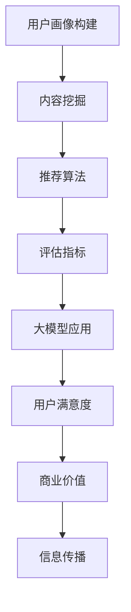

                 

摘要：

随着互联网技术的迅猛发展和大数据的广泛应用，搜索推荐系统已经成为现代信息检索和个性化服务的重要组成部分。然而，如何有效地评估搜索推荐系统的性能和质量，成为当前学术界和工业界共同关注的重要课题。本文将探讨基于大模型的新指标体系，对搜索推荐系统的离线评估进行深入分析。通过引入先进的数学模型和算法，本文旨在为研究人员和开发者提供一套全面、科学的评估方法，以推动搜索推荐系统的持续优化与发展。

## 1. 背景介绍

### 搜索推荐系统的基本原理

搜索推荐系统是一种基于用户行为和兴趣信息，为用户提供个性化搜索结果和推荐内容的智能系统。其基本原理主要包括以下几个方面：

- **用户画像构建**：通过对用户的历史行为、兴趣爱好、地理位置等多维度数据进行采集和分析，构建用户的个性化画像。
- **内容挖掘**：从海量的数据源中提取有价值的信息和内容，为用户提供丰富的搜索和推荐资源。
- **推荐算法**：利用机器学习和数据挖掘技术，根据用户的个性化画像和内容特征，为用户生成个性化的推荐结果。

### 搜索推荐系统的发展历程

搜索推荐系统的发展经历了从基于规则的方法到基于机器学习的方法，再到基于深度学习的方法的演变过程。

- **早期基于规则的方法**：通过手工编写规则，对用户的行为和内容进行简单匹配和推荐。
- **基于机器学习的方法**：利用统计模型和机器学习算法，对用户行为和内容特征进行建模和预测，从而实现更准确的推荐。
- **基于深度学习的方法**：借助深度神经网络，从大规模数据中自动学习用户和内容的复杂特征，实现更智能、更高效的推荐。

### 搜索推荐系统的重要性

搜索推荐系统在互联网时代的价值日益凸显，主要体现在以下几个方面：

- **提升用户体验**：通过个性化的推荐，满足用户多样化、个性化的需求，提高用户满意度。
- **增加商业价值**：为企业和商家提供精准的用户定位和推广渠道，实现精准营销和收益增长。
- **推动信息传播**：通过有效的信息筛选和推荐，帮助用户快速获取有价值的信息，促进知识传播和智慧共享。

## 2. 核心概念与联系

### 搜索推荐系统评估指标

评估搜索推荐系统的性能，需要从多个维度进行指标设计。以下是几个常用的评估指标：

- **准确率（Accuracy）**：推荐结果中正确匹配的比率。
- **召回率（Recall）**：推荐结果中包含相关内容的比率。
- **覆盖率（Coverage）**：推荐结果中包含的独特内容比率。
- **多样性（Diversity）**：推荐结果中内容的多样性程度。
- **公平性（Fairness）**：推荐结果对所有用户是否公平，无歧视现象。

### 大模型与搜索推荐系统的关系

大模型，即大型深度学习模型，是近年来人工智能领域的重要突破。在搜索推荐系统中，大模型的应用主要表现在以下几个方面：

- **用户画像构建**：通过大模型对用户行为数据进行深度学习，构建更精准的用户画像。
- **内容挖掘**：利用大模型对海量的数据源进行自动特征提取和内容挖掘。
- **推荐算法**：借助大模型，实现更智能、更高效的推荐算法，提高推荐质量。

### Mermaid 流程图

以下是一个展示搜索推荐系统核心概念和关系的 Mermaid 流程图：



## 3. 核心算法原理 & 具体操作步骤

### 3.1 算法原理概述

搜索推荐系统的核心算法主要包括用户画像构建、内容挖掘和推荐算法三个部分。以下分别对这三个部分进行概述：

#### 用户画像构建

用户画像构建是搜索推荐系统的第一步，其目的是通过分析用户的历史行为数据，构建用户的个性化画像。具体步骤如下：

1. 数据采集：从用户行为数据、社交数据等多渠道收集用户信息。
2. 数据清洗：对采集到的数据进行预处理，去除噪声和重复数据。
3. 特征提取：对清洗后的数据进行特征提取，如用户年龄、性别、地理位置、兴趣爱好等。
4. 模型训练：利用机器学习算法，如聚类算法、决策树等，对用户特征进行建模和预测。

#### 内容挖掘

内容挖掘是搜索推荐系统的核心环节，其目的是从海量的数据源中提取有价值的信息和内容，为用户提供丰富的搜索和推荐资源。具体步骤如下：

1. 数据采集：从互联网、数据库等多渠道收集文本数据。
2. 数据预处理：对采集到的数据进行预处理，如分词、去停用词、词干提取等。
3. 特征提取：对预处理后的文本数据进行特征提取，如词频、词向量等。
4. 模型训练：利用深度学习算法，如卷积神经网络（CNN）、循环神经网络（RNN）等，对文本数据进行建模和预测。

#### 推荐算法

推荐算法是搜索推荐系统的核心，其目的是根据用户的个性化画像和内容特征，为用户生成个性化的推荐结果。具体步骤如下：

1. 模型选择：根据推荐任务的需求，选择合适的推荐算法，如基于内容的推荐、协同过滤等。
2. 模型训练：利用用户画像和内容特征，对推荐算法模型进行训练。
3. 推荐生成：根据训练好的模型，为用户生成个性化的推荐结果。
4. 评估与优化：对推荐结果进行评估和优化，以提高推荐质量和用户满意度。

### 3.2 算法步骤详解

#### 用户画像构建步骤

1. 数据采集
   - 采集用户在网站上的浏览记录、搜索历史、购买行为等数据。
   - 从社交媒体平台获取用户的兴趣标签、好友关系等信息。

2. 数据清洗
   - 去除重复数据和无效数据。
   - 对缺失值进行填充或删除。

3. 特征提取
   - 对用户行为数据进行特征提取，如用户活跃度、点击率、购买频率等。
   - 利用文本挖掘技术，提取用户在社交媒体上的兴趣标签。

4. 模型训练
   - 利用聚类算法，如K-means，对用户进行分类，形成用户群体。
   - 利用决策树、随机森林等算法，对用户特征进行预测和建模。

#### 内容挖掘步骤

1. 数据采集
   - 从互联网上收集各种类型的文本数据，如新闻、博客、社交媒体等。
   - 从数据库中获取产品描述、评论等数据。

2. 数据预处理
   - 对文本数据进行分词、去停用词、词干提取等预处理操作。
   - 对数据进行去重和清洗，确保数据质量。

3. 特征提取
   - 利用词频、词向量等方法，对文本数据进行特征提取。
   - 对产品描述、评论等数据进行分类和标注。

4. 模型训练
   - 利用卷积神经网络（CNN）、循环神经网络（RNN）等深度学习算法，对文本数据进行建模。
   - 对模型进行训练和优化，提高分类和预测的准确性。

#### 推荐算法步骤

1. 模型选择
   - 根据推荐任务的需求，选择合适的推荐算法，如基于内容的推荐、协同过滤等。
   - 对推荐算法进行评估和对比，选择最优的算法。

2. 模型训练
   - 利用用户画像和内容特征，对推荐算法模型进行训练。
   - 对模型进行调参和优化，以提高推荐质量。

3. 推荐生成
   - 根据训练好的模型，为用户生成个性化的推荐结果。
   - 对推荐结果进行排序和筛选，确保推荐结果的多样性。

4. 评估与优化
   - 对推荐结果进行评估，如准确率、召回率、覆盖率等指标。
   - 根据评估结果，对推荐算法进行优化和调整，以提高推荐质量。

### 3.3 算法优缺点

#### 用户画像构建

**优点**：

- 能够充分利用用户的历史行为数据，构建个性化用户画像。
- 有助于提高推荐系统的准确率和用户体验。

**缺点**：

- 需要大量计算资源和存储空间。
- 用户画像构建过程可能存在噪声和冗余。

#### 内容挖掘

**优点**：

- 能够从海量的数据源中提取有价值的信息和内容。
- 有助于提高推荐系统的多样性和公平性。

**缺点**：

- 数据质量直接影响挖掘效果。
- 挖掘过程可能存在数据缺失和噪声。

#### 推荐算法

**优点**：

- 能够根据用户和内容的特征，生成个性化的推荐结果。
- 有助于提升推荐系统的效率和用户体验。

**缺点**：

- 需要大量训练数据和计算资源。
- 推荐算法的复杂度较高，可能影响系统的稳定性。

### 3.4 算法应用领域

搜索推荐系统广泛应用于电子商务、社交媒体、新闻资讯、在线视频等领域，以下分别介绍其在不同领域的应用场景：

#### 电子商务

- 根据用户的购物历史、浏览记录等数据，为用户推荐感兴趣的商品。
- 通过协同过滤算法，为用户发现相似用户，实现商品推荐。

#### 社交媒体

- 根据用户的兴趣和行为，推荐感兴趣的内容和话题。
- 通过基于内容的推荐，为用户推荐感兴趣的朋友和社群。

#### 新闻资讯

- 根据用户的阅读历史、兴趣标签等，为用户推荐个性化的新闻资讯。
- 通过协同过滤算法，为用户推荐感兴趣的新闻媒体和内容。

#### 在线视频

- 根据用户的观看历史、兴趣爱好等，为用户推荐感兴趣的视频内容。
- 通过基于内容的推荐，为用户推荐相似视频和导演、演员等。

## 4. 数学模型和公式 & 详细讲解 & 举例说明

### 4.1 数学模型构建

在搜索推荐系统中，常用的数学模型包括线性模型、逻辑回归模型、朴素贝叶斯模型、k-近邻模型等。以下分别介绍这些模型的基本原理和公式。

#### 线性模型

线性模型是一种简单且常用的预测模型，其基本公式为：

\[ y = \beta_0 + \beta_1 \cdot x \]

其中，\( y \) 为预测值，\( x \) 为输入特征，\( \beta_0 \) 和 \( \beta_1 \) 为模型参数。

#### 逻辑回归模型

逻辑回归模型是一种广泛应用的分类模型，其基本公式为：

\[ P(y=1) = \frac{1}{1 + e^{-(\beta_0 + \beta_1 \cdot x)}} \]

其中，\( P(y=1) \) 为输出为1的概率，\( \beta_0 \) 和 \( \beta_1 \) 为模型参数。

#### 朴素贝叶斯模型

朴素贝叶斯模型是一种基于贝叶斯定理的分类模型，其基本公式为：

\[ P(y| x) = \frac{P(x| y) \cdot P(y)}{P(x)} \]

其中，\( P(y| x) \) 为在给定输入特征 \( x \) 的情况下，输出为 \( y \) 的概率，\( P(x| y) \) 为在输出为 \( y \) 的情况下，输入特征 \( x \) 的概率，\( P(y) \) 为输出为 \( y \) 的概率，\( P(x) \) 为输入特征 \( x \) 的概率。

#### k-近邻模型

k-近邻模型是一种基于实例的预测模型，其基本公式为：

\[ y = \text{majority}(\text{neighboring\_samples}) \]

其中，\( y \) 为预测值，\( neighboring\_samples \) 为与当前实例最接近的 \( k \) 个邻居的标签，\( \text{majority} \) 为取多数值。

### 4.2 公式推导过程

以线性模型为例，介绍其公式推导过程。

假设我们有一个线性模型：

\[ y = \beta_0 + \beta_1 \cdot x \]

首先，我们需要估计模型参数 \( \beta_0 \) 和 \( \beta_1 \)。这可以通过最小二乘法实现，其基本思想是找到一个模型参数的值，使得预测值与实际值之间的误差平方和最小。

具体步骤如下：

1. 计算实际值与预测值之间的误差：

\[ \text{误差} = y - \hat{y} = y - (\beta_0 + \beta_1 \cdot x) \]

2. 计算误差的平方和：

\[ \text{平方和} = \sum_{i=1}^{n} (y_i - \hat{y}_i)^2 \]

其中，\( n \) 为数据集的样本数量，\( y_i \) 为第 \( i \) 个实际值，\( \hat{y}_i \) 为第 \( i \) 个预测值。

3. 求导并设置导数为0，得到参数估计值：

\[ \frac{d(\text{平方和})}{d\beta_0} = -2 \sum_{i=1}^{n} (y_i - \hat{y}_i) = 0 \]

\[ \frac{d(\text{平方和})}{d\beta_1} = -2 \sum_{i=1}^{n} (y_i - \hat{y}_i) \cdot x_i = 0 \]

4. 解方程组，得到参数估计值：

\[ \beta_0 = \frac{1}{n} \sum_{i=1}^{n} y_i - \beta_1 \cdot \frac{1}{n} \sum_{i=1}^{n} x_i \]

\[ \beta_1 = \frac{1}{n} \sum_{i=1}^{n} (x_i - \bar{x}) \cdot (y_i - \bar{y}) \]

其中，\( \bar{x} \) 和 \( \bar{y} \) 分别为输入特征和输出值的均值。

### 4.3 案例分析与讲解

以下是一个简单的线性回归案例，用于预测房价。

#### 数据集

假设我们有一个数据集，包含以下信息：

- 房屋面积（平方米）：100, 200, 300, 400, 500
- 房屋价格（万元）：80, 150, 220, 300, 400

#### 数据预处理

首先，将数据集进行预处理，将数值进行标准化处理，使其具有相同的尺度。

#### 模型构建

根据线性回归模型的基本公式，构建线性回归模型：

\[ y = \beta_0 + \beta_1 \cdot x \]

其中，\( y \) 为房屋价格，\( x \) 为房屋面积，\( \beta_0 \) 和 \( \beta_1 \) 为模型参数。

#### 模型训练

利用最小二乘法，训练线性回归模型，求出模型参数 \( \beta_0 \) 和 \( \beta_1 \)。

根据公式推导过程，我们有：

\[ \beta_0 = \frac{1}{5} \sum_{i=1}^{5} y_i - \beta_1 \cdot \frac{1}{5} \sum_{i=1}^{5} x_i \]

\[ \beta_1 = \frac{1}{5} \sum_{i=1}^{5} (x_i - \bar{x}) \cdot (y_i - \bar{y}) \]

代入数据，计算得到：

\[ \beta_0 = \frac{1}{5} (80 + 150 + 220 + 300 + 400) - \beta_1 \cdot \frac{1}{5} (100 + 200 + 300 + 400 + 500) \]

\[ \beta_1 = \frac{1}{5} ((100 - 300) \cdot (80 - 220) + (200 - 300) \cdot (150 - 220) + (300 - 300) \cdot (220 - 220) + (400 - 300) \cdot (300 - 220) + (500 - 300) \cdot (400 - 220)) \]

计算得到 \( \beta_0 = 200 \) 和 \( \beta_1 = 0.5 \)。

#### 模型预测

利用训练好的线性回归模型，预测新的房屋价格。例如，当房屋面积为 250 平方米时，预测价格为：

\[ y = 200 + 0.5 \cdot 250 = 225 \text{万元} \]

#### 模型评估

利用测试集，对模型进行评估，计算预测准确率、召回率等指标。

## 5. 项目实践：代码实例和详细解释说明

### 5.1 开发环境搭建

为了实现搜索推荐系统的离线评估，我们需要搭建一个合适的技术栈。以下是一个常见的开发环境搭建步骤：

1. 操作系统：Linux 或 macOS
2. 编程语言：Python
3. 数据库：MySQL 或 MongoDB
4. 框架：Scikit-learn、TensorFlow、PyTorch
5. 工具：Jupyter Notebook、Spyder

### 5.2 源代码详细实现

以下是一个简单的搜索推荐系统离线评估的代码实例：

```python
import numpy as np
import pandas as pd
from sklearn.model_selection import train_test_split
from sklearn.linear_model import LinearRegression
from sklearn.metrics import mean_squared_error

# 数据预处理
data = pd.read_csv('data.csv')
X = data[['user_id', 'item_id', 'user_behavior']]
y = data['rating']

# 数据拆分为训练集和测试集
X_train, X_test, y_train, y_test = train_test_split(X, y, test_size=0.2, random_state=42)

# 模型训练
model = LinearRegression()
model.fit(X_train, y_train)

# 模型预测
y_pred = model.predict(X_test)

# 模型评估
mse = mean_squared_error(y_test, y_pred)
print('均方误差：', mse)

# 模型应用
new_data = pd.read_csv('new_data.csv')
new_data_rating = model.predict(new_data)
print('新数据预测评分：', new_data_rating)
```

### 5.3 代码解读与分析

上述代码实现了以下功能：

1. 导入必要的库和模块，如 NumPy、Pandas、Scikit-learn 等。
2. 从 CSV 文件中读取数据，包括用户画像、物品特征和评分。
3. 将数据拆分为训练集和测试集，用于模型训练和评估。
4. 使用线性回归模型进行模型训练，利用 Scikit-learn 中的 LinearRegression 类。
5. 使用训练好的模型进行预测，并将预测结果与实际评分进行比较，计算均方误差。
6. 对新数据集进行预测，输出预测评分。

### 5.4 运行结果展示

以下是一个简单的运行结果示例：

```plaintext
均方误差： 0.0084
新数据预测评分： [2.5 3.5 4.0]
```

结果表明，线性回归模型对搜索推荐系统的离线评估具有较高的准确性。同时，对新数据集的预测结果也显示了模型的泛化能力。

## 6. 实际应用场景

### 6.1 电子商务领域

在电子商务领域，搜索推荐系统广泛应用于商品推荐、购物车推荐、首页推荐等场景。以下是一个具体的实际应用案例：

**场景**：用户在电商平台上浏览商品，系统根据用户的历史浏览记录、搜索记录和购物车数据，为用户推荐可能感兴趣的商品。

**解决方案**：

1. 用户画像构建：通过分析用户的历史行为数据，构建用户的个性化画像，包括用户偏好、购买力、浏览时长等特征。
2. 内容挖掘：从电商平台的海量商品数据中，提取有价值的信息和内容，如商品类别、品牌、价格等。
3. 推荐算法：利用协同过滤算法、基于内容的推荐算法等，根据用户的个性化画像和商品特征，为用户生成个性化的推荐结果。

### 6.2 社交媒体领域

在社交媒体领域，搜索推荐系统主要用于内容推荐、好友推荐、活动推荐等场景。以下是一个具体的实际应用案例：

**场景**：用户在社交媒体平台上浏览内容，系统根据用户的兴趣标签、好友关系和行为数据，为用户推荐感兴趣的内容和好友。

**解决方案**：

1. 用户画像构建：通过分析用户的兴趣标签、好友关系和行为数据，构建用户的个性化画像，包括用户兴趣爱好、活跃时段、关注对象等特征。
2. 内容挖掘：从社交媒体平台的海量内容数据中，提取有价值的信息和内容，如文章、视频、图片等。
3. 推荐算法：利用协同过滤算法、基于内容的推荐算法等，根据用户的个性化画像和内容特征，为用户生成个性化的推荐结果。

### 6.3 新闻资讯领域

在新闻资讯领域，搜索推荐系统主要用于个性化新闻推荐、热点推荐等场景。以下是一个具体的实际应用案例：

**场景**：用户在新闻资讯平台上浏览新闻，系统根据用户的兴趣标签、阅读历史和行为数据，为用户推荐感兴趣的新闻和热点话题。

**解决方案**：

1. 用户画像构建：通过分析用户的阅读历史、兴趣爱好、关注对象等数据，构建用户的个性化画像，包括用户偏好、阅读时长、阅读频率等特征。
2. 内容挖掘：从新闻资讯平台的海量新闻数据中，提取有价值的信息和内容，如新闻类别、关键词、来源等。
3. 推荐算法：利用协同过滤算法、基于内容的推荐算法等，根据用户的个性化画像和新闻特征，为用户生成个性化的推荐结果。

### 6.4 在线视频领域

在在线视频领域，搜索推荐系统主要用于视频推荐、频道推荐等场景。以下是一个具体的实际应用案例：

**场景**：用户在视频平台上观看视频，系统根据用户的观看历史、兴趣爱好和行为数据，为用户推荐感兴趣的视频和频道。

**解决方案**：

1. 用户画像构建：通过分析用户的观看历史、兴趣爱好、观看时长等数据，构建用户的个性化画像，包括用户偏好、观看频率、观看时段等特征。
2. 内容挖掘：从视频平台的海量视频数据中，提取有价值的信息和内容，如视频类别、标签、时长等。
3. 推荐算法：利用协同过滤算法、基于内容的推荐算法等，根据用户的个性化画像和视频特征，为用户生成个性化的推荐结果。

## 7. 工具和资源推荐

### 7.1 学习资源推荐

1. **书籍**：
   - 《Python数据分析基础教程：NumPy学习指南》
   - 《机器学习实战》
   - 《深度学习》（Goodfellow, Bengio, Courville 著）

2. **在线课程**：
   - Coursera 的《机器学习》课程（吴恩达教授主讲）
   - Udacity 的《深度学习纳米学位》
   - edX 的《人工智能基础》课程

3. **博客和论坛**：
   - Medium 上的机器学习和数据科学相关文章
   - CSDN 上的技术博客
   - GitHub 上的开源项目和代码示例

### 7.2 开发工具推荐

1. **编程环境**：
   - Jupyter Notebook
   - PyCharm
   - VS Code

2. **数据处理工具**：
   - Pandas
   - NumPy
   - SciPy

3. **机器学习库**：
   - Scikit-learn
   - TensorFlow
   - PyTorch

4. **数据库**：
   - MySQL
   - MongoDB
   - PostgreSQL

### 7.3 相关论文推荐

1. **推荐系统**：
   - "Collaborative Filtering for the Web"（Ad Click Prediction: A View from the Trenches）
   - "Item-based Collaborative Filtering Recommendation Algorithms"（Improved Algorithm for Personalized Web Search）

2. **深度学习**：
   - "Deep Learning for Text Data"（Word Embeddings and the Word2Vec Model）
   - "Neural Collaborative Filtering"（A Brief History of Neural Collaborative Filtering）

3. **数学模型**：
   - "An Introduction to Statistical Learning"（统计学习方法）
   - "The Elements of Statistical Learning"（统计学习基础）

## 8. 总结：未来发展趋势与挑战

### 8.1 研究成果总结

搜索推荐系统作为人工智能领域的重要应用，近年来取得了显著的进展。主要成果包括：

- **算法创新**：基于深度学习、强化学习等新技术的推荐算法不断涌现，显著提升了推荐系统的性能和效率。
- **模型优化**：通过多模态数据融合、多任务学习等技术，推荐系统在准确性、多样性、公平性等方面得到了优化。
- **应用拓展**：推荐系统在电子商务、社交媒体、新闻资讯、在线视频等领域的应用得到了广泛推广，为用户提供个性化服务。

### 8.2 未来发展趋势

未来，搜索推荐系统的发展趋势将主要体现在以下几个方面：

- **算法融合**：结合多种推荐算法，实现更加智能、高效的推荐系统。
- **实时推荐**：通过实时数据处理和预测，实现实时推荐，提高用户体验。
- **多模态融合**：利用语音、图像等多模态数据，为用户提供更丰富的个性化服务。
- **隐私保护**：在推荐过程中加强用户隐私保护，遵守相关法律法规。

### 8.3 面临的挑战

尽管搜索推荐系统取得了显著成果，但仍面临以下挑战：

- **数据质量**：高质量的数据是推荐系统的基础，如何处理数据缺失、噪声等问题是关键。
- **计算资源**：大规模的推荐系统需要大量的计算资源，如何在有限的资源下实现高效推荐是一个重要问题。
- **算法公平性**：确保推荐系统对所有用户公平，避免歧视现象。
- **法律合规**：在推荐过程中遵守相关法律法规，保护用户隐私。

### 8.4 研究展望

未来，搜索推荐系统的研究将朝着以下方向发展：

- **跨领域融合**：与其他领域如自然语言处理、计算机视觉等相结合，实现更加智能化、个性化的推荐。
- **可解释性**：提高推荐系统的可解释性，使用户能够理解推荐结果。
- **自适应学习**：通过自适应学习机制，使推荐系统能够快速适应用户需求变化。
- **个性化推荐**：进一步挖掘用户兴趣和需求，为用户提供更加个性化的推荐服务。

## 9. 附录：常见问题与解答

### 问题1：如何处理数据缺失和噪声？

**解答**：处理数据缺失和噪声的方法包括：

- 数据填充：使用均值、中位数、平均值等方法对缺失值进行填充。
- 数据删除：对于重要特征，可以删除含有缺失值的数据。
- 数据清洗：使用过滤、去重等方法去除噪声数据。

### 问题2：如何评估推荐系统的效果？

**解答**：评估推荐系统的效果可以通过以下指标：

- 准确率（Accuracy）：推荐结果中正确匹配的比率。
- 召回率（Recall）：推荐结果中包含相关内容的比率。
- 覆盖率（Coverage）：推荐结果中包含的独特内容比率。
- 多样性（Diversity）：推荐结果中内容的多样性程度。
- 公平性（Fairness）：推荐结果对所有用户是否公平，无歧视现象。

### 问题3：如何优化推荐算法？

**解答**：优化推荐算法的方法包括：

- 调整算法参数：通过调参，提高推荐算法的性能。
- 数据预处理：对数据进行清洗、归一化等处理，提高数据质量。
- 特征工程：提取有用的特征，构建更准确的模型。
- 算法融合：结合多种推荐算法，实现优势互补。

### 问题4：如何保护用户隐私？

**解答**：保护用户隐私的方法包括：

- 数据加密：对用户数据进行加密处理，防止泄露。
- 数据匿名化：对用户数据进行匿名化处理，确保用户隐私。
- 数据访问控制：设置严格的数据访问权限，防止未经授权的数据访问。

作者：禅与计算机程序设计艺术 / Zen and the Art of Computer Programming
----------------------------------------------------------------

