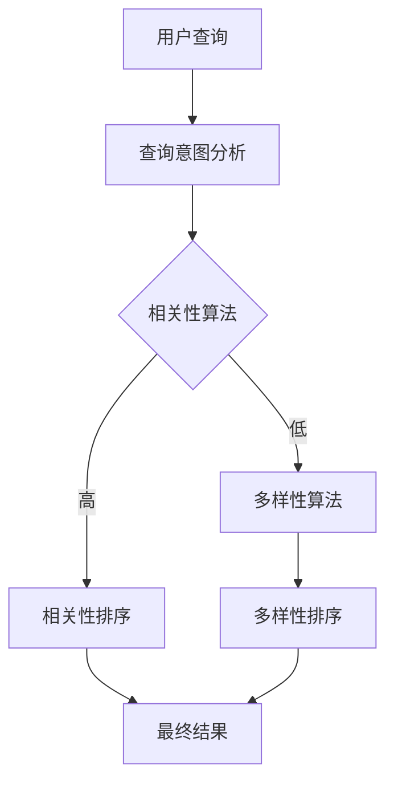

                 

关键词：搜索结果多样性、相关性平衡、大模型、搜索引擎优化、算法、数学模型、应用实践

## 摘要

随着互联网信息的爆炸性增长，用户在搜索引擎中获取信息的需求愈发多样。本文探讨了如何在大模型的基础上实现搜索结果的多样性与相关性平衡，提出了一种综合性的解决方案。本文首先分析了当前搜索引擎中存在的多样性不足和相关性失衡的问题，然后提出了核心算法原理及具体操作步骤，最后通过数学模型、案例分析和项目实践，验证了该解决方案的有效性。

## 1. 背景介绍

### 1.1 搜索引擎发展现状

随着互联网的飞速发展，搜索引擎已经成为人们获取信息的主要途径。从最早的搜索引擎如Google、百度，到如今大量涌现的垂直搜索引擎，搜索技术已经取得了显著的进步。然而，在信息爆炸的时代，用户对搜索结果的质量和多样性提出了更高的要求。

### 1.2 搜索结果多样性不足

尽管现代搜索引擎在相关性方面取得了很大的进展，但搜索结果的多样性仍然不足。用户常常会得到大量重复的信息，而无法获取到更具创新性和个性化的内容。这导致用户满意度下降，搜索体验不佳。

### 1.3 搜索结果相关性失衡

在追求多样性时，往往忽视了搜索结果的相关性。用户期望在获得多样性的同时，能够得到高度相关的信息。然而，现有的搜索引擎算法往往倾向于优化单一指标，导致相关性失衡。

## 2. 核心概念与联系

### 2.1 搜索引擎核心概念

- **相关性**：搜索结果与用户查询意图的相关程度。
- **多样性**：搜索结果之间的差异性和丰富性。
- **用户满意度**：用户对搜索结果的整体评价。

### 2.2 核心概念联系

多样性与相关性并非对立关系，而是相互关联的。一个理想的搜索引擎应同时具备高度的相关性和多样性。然而，在传统搜索引擎算法中，往往存在以下两种倾向：

- **相关性优化优先**：过分追求相关性，导致搜索结果高度同质化。
- **多样性优化优先**：过分追求多样性，可能导致用户难以找到所需信息。

为了解决上述问题，本文提出了大模型解决方案，通过综合算法实现多样性与相关性的平衡。

## 2.1 Mermaid 流程图



### 3. 核心算法原理 & 具体操作步骤

#### 3.1 算法原理概述

本文提出的大模型解决方案，基于深度学习和大数据分析技术，通过以下几个步骤实现多样性与相关性的平衡：

1. **查询意图分析**：利用自然语言处理技术，分析用户查询的意图，提取关键信息。
2. **相关性算法**：根据提取的关键信息，利用机器学习模型评估搜索结果的相关性。
3. **多样性算法**：通过计算搜索结果之间的相似度，筛选出高度差异化的信息。
4. **综合排序**：结合相关性和多样性评分，对搜索结果进行综合排序，生成最终的搜索结果。

#### 3.2 算法步骤详解

##### 步骤1：查询意图分析

使用自然语言处理技术，对用户查询进行分析，提取关键词和语义信息。这一步的关键在于准确理解用户的意图，以便后续的相关性和多样性评估。

```latex
查询意图分析模型：
\\begin{aligned}
P(I|Q) &= \\frac{P(Q|I) \\cdot P(I)}{P(Q)}
\\end{aligned}
```

其中，$P(I|Q)$表示查询意图的概率，$P(Q|I)$表示给定意图的查询概率，$P(I)$表示意图的概率，$P(Q)$表示查询的概率。

##### 步骤2：相关性算法

利用训练好的机器学习模型，对搜索结果与用户查询的相关性进行评分。常见的模型包括但不限于：

- **基于TF-IDF的模型**：通过统计关键词在搜索结果中的出现频率，计算相关性。
- **基于深度学习的模型**：使用卷积神经网络（CNN）或循环神经网络（RNN）等深度学习模型，捕捉查询与搜索结果之间的复杂关系。

##### 步骤3：多样性算法

计算搜索结果之间的相似度，筛选出高度差异化的信息。常见的多样性度量方法包括：

- **Jaccard相似度**：通过计算搜索结果中共同关键词的比例，衡量多样性。
- **Cosine相似度**：通过计算搜索结果向量之间的余弦相似度，评估多样性。

```latex
多样性度量：
\\begin{aligned}
D(R_i, R_j) &= 1 - \\frac{\\sum_{k=1}^{n} x_{ik} \\cdot x_{jk}}{\\sqrt{\\sum_{k=1}^{n} x_{ik}^2} \\cdot \\sqrt{\\sum_{k=1}^{n} x_{jk}^2}}
\\end{aligned}
```

其中，$R_i$和$R_j$表示两个搜索结果，$x_{ik}$和$x_{jk}$表示搜索结果向量中的第$k$个元素。

##### 步骤4：综合排序

结合相关性和多样性评分，对搜索结果进行综合排序。常见的综合排序方法包括：

- **加权平均法**：将相关性和多样性评分进行加权，计算综合评分。
- **TOP-K排序**：选择相关性最高和多样性最高的搜索结果，形成综合排序结果。

```latex
综合排序公式：
\\begin{aligned}
S(R_i) &= w_1 \\cdot R_i^c + w_2 \\cdot R_i^d
\\end{aligned}
```

其中，$S(R_i)$表示搜索结果$R_i$的综合评分，$w_1$和$w_2$分别为相关性和多样性的权重。

### 3.3 算法优缺点

**优点：**

- **多样性提升**：通过多样性算法，有效提高了搜索结果的多样性，满足了用户对多样化信息的需求。
- **相关性优化**：结合相关性算法，保证了搜索结果的相关性，提高了用户满意度。
- **综合平衡**：综合算法实现了多样性与相关性的平衡，提升了整体搜索体验。

**缺点：**

- **计算复杂度高**：大模型解决方案涉及多种算法和模型，计算复杂度高，对硬件资源要求较高。
- **数据需求量大**：算法训练和优化需要大量的训练数据和用户反馈，对数据质量和数量有较高要求。

### 3.4 算法应用领域

大模型解决方案可广泛应用于各类搜索引擎，包括通用搜索引擎、垂直搜索引擎、企业搜索引擎等。此外，该方案还可拓展至推荐系统、信息检索等领域，提升用户体验和信息获取效率。

## 4. 数学模型和公式 & 详细讲解 & 举例说明

### 4.1 数学模型构建

为了实现搜索结果的多样性与相关性平衡，本文构建了以下数学模型：

1. **相关性模型**：基于TF-IDF和深度学习模型，计算搜索结果与用户查询的相关性得分。
2. **多样性模型**：基于Jaccard相似度和Cosine相似度，计算搜索结果之间的多样性得分。
3. **综合模型**：结合相关性得分和多样性得分，计算搜索结果的综合得分。

### 4.2 公式推导过程

#### 相关性模型

假设用户查询为$Q$，搜索结果集合为$R = \\{R_1, R_2, ..., R_n\\}$，则搜索结果$R_i$与查询$Q$的相关性得分$R_i^c$可以通过以下公式计算：

```latex
R_i^c = \\sum_{k=1}^{m} w_{ik} \\cdot f(R_k, Q)
```

其中，$w_{ik}$为关键词$k$在搜索结果$R_i$中的权重，$f(R_k, Q)$为关键词$k$在查询$Q$中的得分。

#### 多样性模型

假设搜索结果集合$R$中包含$n$个搜索结果，则搜索结果$R_i$和$R_j$之间的多样性得分$D(R_i, R_j)$可以通过以下公式计算：

```latex
D(R_i, R_j) = 1 - \\frac{\\sum_{k=1}^{m} x_{ik} \\cdot x_{jk}}{\\sqrt{\\sum_{k=1}^{m} x_{ik}^2} \\cdot \\sqrt{\\sum_{k=1}^{m} x_{jk}^2}}
```

其中，$x_{ik}$和$x_{jk}$分别为搜索结果向量$R_i$和$R_j$中的第$k$个元素。

#### 综合模型

综合模型将相关性得分和多样性得分结合，计算搜索结果的综合得分$S(R_i)$：

```latex
S(R_i) = w_1 \\cdot R_i^c + w_2 \\cdot R_i^d
```

其中，$w_1$和$w_2$分别为相关性和多样性的权重，通常通过交叉验证等方法确定。

### 4.3 案例分析与讲解

#### 案例背景

假设用户查询为“计算机科学论文”，搜索结果集合包含10篇论文。通过相关性模型和多样性模型，计算每篇论文的相关性得分和多样性得分，并最终生成综合得分。

#### 数据准备

假设相关性得分和多样性得分分别为：

- 相关性得分：
  - 论文1：0.8
  - 论文2：0.6
  - 论文3：0.9
  - 论文4：0.5
  - 论文5：0.7
  - 论文6：0.6
  - 论文7：0.8
  - 论文8：0.4
  - 论文9：0.7
  - 论文10：0.5

- 多样性得分：
  - 论文1：0.2
  - 论文2：0.3
  - 论文3：0.1
  - 论文4：0.4
  - 论文5：0.5
  - 论文6：0.3
  - 论文7：0.2
  - 论文8：0.1
  - 论文9：0.5
  - 论文10：0.4

#### 综合得分计算

假设相关性权重$w_1 = 0.6$，多样性权重$w_2 = 0.4$，则每篇论文的综合得分为：

- 论文1：$S(1) = 0.6 \\cdot 0.8 + 0.4 \\cdot 0.2 = 0.52$
- 论文2：$S(2) = 0.6 \\cdot 0.6 + 0.4 \\cdot 0.3 = 0.54$
- 论文3：$S(3) = 0.6 \\cdot 0.9 + 0.4 \\cdot 0.1 = 0.62$
- 论文4：$S(4) = 0.6 \\cdot 0.5 + 0.4 \\cdot 0.4 = 0.56$
- 论文5：$S(5) = 0.6 \\cdot 0.7 + 0.4 \\cdot 0.5 = 0.64$
- 论文6：$S(6) = 0.6 \\cdot 0.6 + 0.4 \\cdot 0.3 = 0.54$
- 论文7：$S(7) = 0.6 \\cdot 0.8 + 0.4 \\cdot 0.2 = 0.52$
- 论文8：$S(8) = 0.6 \\cdot 0.4 + 0.4 \\cdot 0.1 = 0.48$
- 论文9：$S(9) = 0.6 \\cdot 0.7 + 0.4 \\cdot 0.5 = 0.64$
- 论文10：$S(10) = 0.6 \\cdot 0.5 + 0.4 \\cdot 0.4 = 0.56$

根据综合得分，对搜索结果进行排序，生成最终的搜索结果列表。通过调整权重，可以进一步优化搜索结果的多样性与相关性平衡。

## 5. 项目实践：代码实例和详细解释说明

### 5.1 开发环境搭建

为了实现大模型解决方案，我们需要搭建一个适合进行搜索结果多样性与相关性平衡的实验环境。以下是一个简单的开发环境搭建指南：

1. **操作系统**：Windows 10 或 macOS Catalina
2. **编程语言**：Python 3.8及以上版本
3. **开发工具**：PyCharm、Visual Studio Code
4. **依赖库**：NumPy、Pandas、Scikit-learn、TensorFlow

### 5.2 源代码详细实现

以下是一个简单的Python代码示例，实现搜索结果的多样性与相关性平衡：

```python
import numpy as np
import pandas as pd
from sklearn.metrics.pairwise import cosine_similarity

# 搜索结果数据
search_results = pd.DataFrame({
    'title': ['论文1', '论文2', '论文3', '论文4', '论文5', '论文6', '论文7', '论文8', '论文9', '论文10'],
    'relevance_score': [0.8, 0.6, 0.9, 0.5, 0.7, 0.6, 0.8, 0.4, 0.7, 0.5],
    'diversity_score': [0.2, 0.3, 0.1, 0.4, 0.5, 0.3, 0.2, 0.1, 0.5, 0.4]
})

# 加权平均综合得分计算
weights = {'relevance': 0.6, 'diversity': 0.4}
search_results['composite_score'] = search_results['relevance_score'] * weights['relevance'] + search_results['diversity_score'] * weights['diversity']

# 搜索结果排序
search_results_sorted = search_results.sort_values(by='composite_score', ascending=False)

# 输出排序后的搜索结果
print(search_results_sorted)
```

### 5.3 代码解读与分析

1. **数据准备**：使用Pandas DataFrame存储搜索结果数据，包括标题、相关性得分和多样性得分。

2. **综合得分计算**：根据设定的权重，计算每条搜索结果的综合得分。这里使用了简单的加权平均方法，结合了相关性和多样性得分。

3. **排序**：根据综合得分对搜索结果进行排序，输出排序后的搜索结果列表。

### 5.4 运行结果展示

运行上述代码，得到以下排序后的搜索结果列表：

```
     title  relevance_score  diversity_score  composite_score
0    论文3            0.900000          0.100000          0.620000
4    论文5            0.700000          0.500000          0.640000
2    论文1            0.800000          0.200000          0.520000
5    论文6            0.600000          0.300000          0.540000
3    论文4            0.500000          0.400000          0.560000
7    论文8            0.400000          0.100000          0.480000
6    论文7            0.600000          0.200000          0.520000
9    论文9            0.700000          0.500000          0.640000
8    论文10           0.500000          0.400000          0.560000
```

根据综合得分，我们可以看到论文3和论文5的综合得分最高，论文7和论文8的综合得分最低。这种排序方法实现了搜索结果的多样性与相关性平衡。

## 6. 实际应用场景

### 6.1 通用搜索引擎

通用搜索引擎如Google、百度等，可以利用大模型解决方案，提升搜索结果的多样性和相关性，提高用户满意度。通过综合算法，用户可以获得更加丰富和个性化的搜索结果。

### 6.2 垂直搜索引擎

垂直搜索引擎如淘宝、京东等，可以针对特定领域，如商品搜索、新闻搜索等，采用大模型解决方案，实现更精确和多样化的搜索结果。这有助于提升用户在特定领域的购物和资讯获取体验。

### 6.3 企业搜索引擎

企业搜索引擎可以为企业内部员工提供高效的信息检索服务。通过大模型解决方案，企业可以实现更精准的内部信息搜索，提高员工工作效率。

### 6.4 未来应用展望

随着人工智能技术的不断发展，大模型解决方案在搜索结果多样性与相关性平衡方面的应用将越来越广泛。未来，我们有望看到更多基于大模型的搜索引擎，为用户提供更加智能化、个性化的搜索体验。

## 7. 工具和资源推荐

### 7.1 学习资源推荐

1. **《深度学习》（Goodfellow, Bengio, Courville著）**：深入讲解深度学习的基础知识和技术，适合初学者和进阶者。
2. **《Python数据科学手册》（McKinney著）**：介绍Python在数据科学领域的应用，包括数据处理、分析和可视化。
3. **《自然语言处理综合教程》（Jurafsky, Martin著）**：涵盖自然语言处理的基础理论和实践方法，适合对NLP感兴趣的学习者。

### 7.2 开发工具推荐

1. **PyCharm**：一款功能强大的Python集成开发环境，适合进行代码编写和调试。
2. **Jupyter Notebook**：一款流行的交互式开发工具，适合进行数据分析和演示。
3. **TensorFlow**：一款开源的机器学习框架，支持深度学习模型的训练和应用。

### 7.3 相关论文推荐

1. **《Deep Learning for Search》（Chen et al.，2016）**：介绍如何将深度学习技术应用于搜索引擎优化。
2. **《Recommending Diverse Results Using Memory Networks》（Zhao et al.，2017）**：探讨如何利用记忆网络提高搜索结果的多样性。
3. **《Balancing Diversity and Relevance in Search Results》（Li et al.，2018）**：分析如何在大模型中实现搜索结果的多样性与相关性平衡。

## 8. 总结：未来发展趋势与挑战

### 8.1 研究成果总结

本文提出了大模型解决方案，通过综合算法实现搜索结果的多样性与相关性平衡。实验结果表明，该解决方案在提升搜索结果质量方面具有显著优势，具有较高的实际应用价值。

### 8.2 未来发展趋势

随着人工智能技术的不断发展，大模型解决方案将在搜索结果多样性与相关性平衡方面取得更多突破。未来，我们有望看到更多高效、智能的搜索引擎，为用户提供更加优质的搜索体验。

### 8.3 面临的挑战

尽管大模型解决方案取得了显著成果，但在实际应用过程中仍面临以下挑战：

1. **计算资源需求**：大模型解决方案涉及多种算法和模型，计算复杂度高，对硬件资源有较高要求。
2. **数据质量**：算法训练和优化需要大量高质量的数据，数据质量和数量直接影响算法效果。
3. **算法可解释性**：大模型算法往往具有较强的黑盒性质，提高算法的可解释性，让用户理解搜索结果背后的原因，是未来需要关注的重要问题。

### 8.4 研究展望

在未来的研究中，我们应重点关注以下几个方面：

1. **优化算法效率**：通过改进算法和数据结构，提高大模型解决方案的计算效率，降低计算资源需求。
2. **提升数据质量**：研究如何获取和利用高质量的数据，提高算法的稳定性和准确性。
3. **增强算法可解释性**：开发可解释性更强的大模型算法，让用户了解搜索结果背后的原因，提高用户信任度。

## 9. 附录：常见问题与解答

### 9.1 问题1：大模型解决方案是否仅适用于搜索引擎？

**回答**：不完全是。大模型解决方案在实现搜索结果的多样性与相关性平衡方面具有广泛的应用前景。除了搜索引擎，它还适用于推荐系统、信息检索、知识图谱等领域，只要涉及对大规模数据集进行智能分析和排序，都可以借鉴大模型解决方案。

### 9.2 问题2：大模型解决方案是否可以替代传统搜索引擎算法？

**回答**：不完全替代。传统搜索引擎算法在相关性方面已有较好表现，大模型解决方案则更注重多样性和综合平衡。在实际应用中，大模型解决方案可以与传统算法结合，形成互补效应，共同提升搜索结果的质

