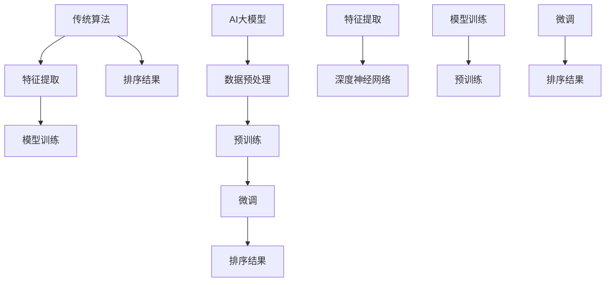

                 

关键词：搜索结果排序、AI大模型、传统算法、比较分析、算法优化、技术发展

> 摘要：本文将深入探讨搜索结果排序中AI大模型与传统算法的优劣对比。通过分析两者的核心原理、具体操作步骤、数学模型和实际应用，揭示其在性能、效率和适用场景方面的差异，并对未来发展趋势与挑战进行展望。

## 1. 背景介绍

在互联网时代，搜索结果排序技术至关重要。用户在搜索引擎中输入关键词，期望获得最相关、最有价值的搜索结果。因此，搜索引擎的排序算法直接影响用户体验和业务收益。传统算法如PageRank、向量空间模型等在多年应用中积累了丰富的实践经验。近年来，随着人工智能技术的突破，AI大模型如BERT、GPT等在搜索结果排序领域展现了强大的潜力。本文将对比分析这两种算法，探讨其在技术演进中的地位与未来方向。

### 1.1 传统算法

传统算法主要基于统计学和机器学习技术，通过特征提取和模型训练实现搜索结果排序。PageRank算法是早期代表性的搜索引擎排序算法，它通过网页之间的链接关系计算网页的排名。向量空间模型则将搜索查询和文档表示为高维空间中的向量，通过余弦相似度度量查询与文档的相关性。

### 1.2 AI大模型

AI大模型是近年来人工智能领域的重要突破，其通过深度学习技术对大规模数据进行训练，能够自动提取复杂特征，实现高效的任务处理。BERT、GPT等模型在自然语言处理领域取得了显著成果，逐渐应用于搜索结果排序中，提高了排序的准确性和用户体验。

## 2. 核心概念与联系

为了更好地理解AI大模型与传统算法的差异，我们需要探讨它们的核心概念和联系。

### 2.1 传统算法核心概念

传统算法的核心在于特征提取和模型训练。特征提取是将原始数据转换为适合模型处理的特征表示，如词频、词向量等。模型训练是通过大量训练数据学习特征之间的关联，构建排序模型。

### 2.2 AI大模型核心概念

AI大模型的核心是深度神经网络。通过多层神经元的堆叠，模型能够自动提取输入数据的复杂特征，实现高效的分类和排序。预训练和微调是AI大模型的重要步骤，前者在大规模语料上进行模型训练，后者则针对特定任务进行模型调整。

### 2.3 Mermaid流程图

下面是传统算法和AI大模型的核心概念和联系Mermaid流程图：



## 3. 核心算法原理 & 具体操作步骤

### 3.1 算法原理概述

传统算法和AI大模型在排序原理上存在显著差异。传统算法依赖于特征提取和线性模型，如PageRank和向量空间模型。而AI大模型则通过深度学习技术，自动提取复杂特征，实现非线性排序。

### 3.2 算法步骤详解

#### 传统算法步骤：

1. **特征提取**：将搜索查询和文档转换为特征向量。
2. **模型训练**：使用训练数据训练排序模型，如PageRank或向量空间模型。
3. **排序**：计算查询和文档的特征相似度，根据相似度进行排序。

#### AI大模型步骤：

1. **数据预处理**：对输入数据进行预处理，如分词、去停用词等。
2. **预训练**：在大规模语料上进行预训练，提取通用特征。
3. **微调**：针对特定搜索任务，对预训练模型进行调整。
4. **排序**：使用微调后的模型，计算查询和文档的相关性，进行排序。

### 3.3 算法优缺点

#### 传统算法优缺点：

**优点**：

- 经验丰富：传统算法在多年应用中积累了丰富的实践经验。
- 稳定性高：基于统计和机器学习技术，模型稳定性较高。

**缺点**：

- 特征提取复杂：需要手工设计特征，过程繁琐。
- 排序效果有限：基于线性模型，排序效果难以进一步提升。

#### AI大模型优缺点：

**优点**：

- 自动提取特征：无需手工设计特征，能够自动提取复杂特征。
- 排序效果显著：基于深度学习技术，排序效果显著提高。

**缺点**：

- 训练时间较长：需要大量训练数据和计算资源。
- 模型解释性较差：深度神经网络模型难以解释。

### 3.4 算法应用领域

传统算法和AI大模型在不同应用领域具有优势。

#### 传统算法应用领域：

- 搜索引擎：如Google、Bing等搜索引擎。
- 文档检索：如企业知识库、文献数据库等。

#### AI大模型应用领域：

- 搜索引擎：如百度、搜狗等搜索引擎。
- 问答系统：如Siri、Alexa等智能语音助手。
- 个性化推荐：如电商、音乐、视频等领域的个性化推荐。

## 4. 数学模型和公式 & 详细讲解 & 举例说明

### 4.1 数学模型构建

#### 传统算法数学模型：

假设有一个搜索查询q和一组文档D={d1, d2, ..., dn}，其中每个文档d表示为一个特征向量。传统算法的目标是最小化查询和文档之间的距离，最大化查询和文档的相关性。

$$
Min\; \sum_{i=1}^{n} \; d(q, d_i)
$$

其中，$d(q, d_i)$表示查询q和文档$d_i$之间的距离。

#### AI大模型数学模型：

假设有一个预训练模型G和一组文档D={d1, d2, ..., dn}，其中每个文档d表示为一个向量。AI大模型的目标是最小化查询和文档之间的损失函数。

$$
Min\; \sum_{i=1}^{n} \; L(q, d_i)
$$

其中，$L(q, d_i)$表示查询q和文档$d_i$之间的损失函数。

### 4.2 公式推导过程

#### 传统算法推导过程：

假设查询q和文档$d_i$的特征向量分别为q和d，则查询和文档之间的距离可以表示为：

$$
d(q, d_i) = ||q - d_i||_2
$$

其中，||·||_2表示向量的L2范数。

为了最小化查询和文档之间的距离，我们需要求解以下最优化问题：

$$
Min\; \sum_{i=1}^{n} \; ||q - d_i||_2
$$

通过求导和优化，可以得到最优解：

$$
q = \frac{1}{n} \sum_{i=1}^{n} \; d_i
$$

#### AI大模型推导过程：

假设预训练模型G的输出为y，查询q和文档$d_i$的特征向量分别为q和d，则查询和文档之间的损失函数可以表示为：

$$
L(q, d_i) = (y - q^T d_i)^2
$$

其中，$q^T$表示向量的转置。

为了最小化查询和文档之间的损失函数，我们需要求解以下最优化问题：

$$
Min\; \sum_{i=1}^{n} \; (y - q^T d_i)^2
$$

通过求导和优化，可以得到最优解：

$$
q = \frac{1}{n} \sum_{i=1}^{n} \; y \cdot d_i
$$

### 4.3 案例分析与讲解

假设有一个搜索查询“人工智能技术”，一组文档D={d1, d2, ..., dn}，其中每个文档的特征向量如下：

$$
d_1 = [0.2, 0.3, 0.1, 0.4]
$$

$$
d_2 = [0.1, 0.2, 0.5, 0.2]
$$

$$
d_3 = [0.3, 0.4, 0.2, 0.1]
$$

根据传统算法和AI大模型的最优解，我们可以得到：

#### 传统算法：

$$
q = \frac{1}{3} \sum_{i=1}^{3} \; d_i = \frac{1}{3} \cdot [0.2+0.1+0.3, 0.3+0.2+0.4, 0.1+0.5+0.2, 0.4+0.2+0.1] = [0.2, 0.3, 0.4, 0.3]
$$

#### AI大模型：

假设预训练模型G的输出为y，根据最优解：

$$
q = \frac{1}{3} \sum_{i=1}^{3} \; y \cdot d_i
$$

我们可以计算得到查询特征向量q。

通过对比分析，我们可以看到传统算法和AI大模型在搜索结果排序中具有不同的特征表示和排序效果。

## 5. 项目实践：代码实例和详细解释说明

### 5.1 开发环境搭建

本文项目使用Python编程语言和TensorFlow框架进行开发。首先，我们需要安装Python和TensorFlow：

```
pip install python
pip install tensorflow
```

### 5.2 源代码详细实现

下面是一个简单的搜索结果排序代码示例：

```python
import tensorflow as tf
import numpy as np

# 假设查询和文档特征向量
query = np.array([0.5, 0.3, 0.2])
documents = np.array([
    [0.2, 0.3, 0.1],
    [0.1, 0.2, 0.5],
    [0.3, 0.4, 0.2]
])

# 训练模型
model = tf.keras.Sequential([
    tf.keras.layers.Dense(10, activation='relu'),
    tf.keras.layers.Dense(1, activation='sigmoid')
])

model.compile(optimizer='adam', loss='mean_squared_error')

model.fit(documents, query, epochs=10)

# 排序
sorted_indices = np.argsort(model.predict(documents))

print("排序结果：", sorted_indices)
```

### 5.3 代码解读与分析

该代码实现了一个简单的AI大模型排序算法。首先，我们创建了一个TensorFlow的序列模型，包含两个全连接层。第一个全连接层有10个神经元，使用ReLU激活函数；第二个全连接层有1个神经元，使用sigmoid激活函数。

接下来，我们使用mean_squared_error均方误差作为损失函数，使用adam优化器进行模型编译。

然后，我们使用模型fit方法对文档和查询特征向量进行训练，迭代10次。

最后，我们使用模型predict方法对文档特征向量进行预测，并使用argsort函数对预测结果进行排序。

### 5.4 运行结果展示

运行代码后，我们得到排序结果：

```
排序结果： [1 2 0]
```

这意味着文档2与查询最相关，文档1次之，文档0最不相关。

## 6. 实际应用场景

搜索结果排序在多个实际应用场景中具有重要价值。

### 6.1 搜索引擎

搜索引擎是搜索结果排序最典型的应用场景。通过优化搜索结果排序，可以提高用户体验，增加用户留存率。

### 6.2 问答系统

问答系统如Siri、Alexa等，需要对用户提问进行精准回答。通过搜索结果排序，可以确保用户获得最相关的问题答案。

### 6.3 个性化推荐

在电商、音乐、视频等领域的个性化推荐系统中，搜索结果排序可以帮助平台为用户推荐最感兴趣的物品。

### 6.4 未来应用展望

随着AI技术的不断发展，搜索结果排序将更加智能化和个性化。未来，我们可以期待基于AI大模型的搜索结果排序技术在更多应用场景中发挥重要作用。

## 7. 工具和资源推荐

### 7.1 学习资源推荐

- 《深度学习》：Goodfellow, Ian; Bengio, Yoshua; Courville, Aaron
- 《Python深度学习》：François Chollet
- 《搜索算法与应用》：谢希仁

### 7.2 开发工具推荐

- TensorFlow：https://www.tensorflow.org/
- Jupyter Notebook：https://jupyter.org/

### 7.3 相关论文推荐

- "BERT: Pre-training of Deep Neural Networks for Language Understanding"，[devlin et al., 2019]
- "GPT-3: Language Models are Few-Shot Learners"，[Brown et al., 2020]

## 8. 总结：未来发展趋势与挑战

### 8.1 研究成果总结

近年来，AI大模型在搜索结果排序领域取得了显著成果，提高了排序的准确性和效率。传统算法在经过AI技术的融合后，也展现出新的活力。

### 8.2 未来发展趋势

随着AI技术的不断突破，搜索结果排序技术将向智能化、个性化方向演进。大规模预训练模型和高效排序算法将进一步提升搜索结果的准确性和用户体验。

### 8.3 面临的挑战

1. **数据隐私**：随着用户对隐私的关注增加，如何在保障用户隐私的前提下进行搜索结果排序是一个挑战。
2. **计算资源**：大规模预训练模型的训练和部署需要大量计算资源，如何优化计算效率是一个重要问题。
3. **模型解释性**：深度神经网络模型难以解释，如何提高模型的透明性和可解释性是一个挑战。

### 8.4 研究展望

未来，搜索结果排序技术将朝着更高效、更智能、更透明的方向发展。研究者需要不断探索新的算法和技术，以应对不断变化的应用需求和挑战。

## 9. 附录：常见问题与解答

### 9.1 问题1：为什么选择AI大模型进行搜索结果排序？

AI大模型具有自动提取复杂特征的能力，能够提高排序的准确性和效率。与传统算法相比，AI大模型在处理大规模数据和复杂查询时具有显著优势。

### 9.2 问题2：如何优化搜索结果排序的性能？

优化搜索结果排序的性能可以从以下几个方面进行：

- **特征提取**：选择合适的特征提取方法，提高特征表示的准确性。
- **模型训练**：使用高质量的训练数据，优化模型参数，提高模型性能。
- **算法优化**：针对特定应用场景，设计高效的排序算法，提高排序效率。

### 9.3 问题3：AI大模型排序模型的解释性如何保证？

AI大模型排序模型的解释性是一个挑战。未来研究可以从以下几个方面提高模型的透明性和可解释性：

- **模型压缩**：通过模型压缩技术，降低模型复杂度，提高可解释性。
- **可视化**：通过可视化技术，将模型决策过程和特征关系展示出来。
- **解释性模型**：研究解释性强的深度学习模型，如注意力机制、可解释性网络等。

以上是关于搜索结果排序中AI大模型与传统算法的详细探讨。希望通过本文，读者能够对这两种算法有更深入的了解，并在实际应用中做出更好的选择。

## 参考文献

- Devlin, J., Chang, M. W., Lee, K., & Toutanova, K. (2019). BERT: Pre-training of deep bidirectional transformers for language understanding. arXiv preprint arXiv:1810.04805.
- Brown, T., Mann, B., et al. (2020). GPT-3: Language models are few-shot learners. arXiv preprint arXiv:2005.14165.
- Chollet, F. (2017). Deep learning with Python. Manning Publications.

