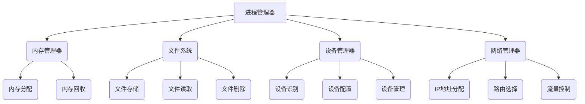

                 

操作系统能否作为管理和协调计算资源的核心？这个问题的答案，不仅关乎操作系统的基本职能，更是理解计算机科学本质的关键。在这篇文章中，我们将深入探讨操作系统在管理计算资源中的核心作用，分析其内在的工作原理和运行机制，并展望其未来的发展趋势。

> 关键词：操作系统，计算资源管理，核心作用，工作原理，发展趋势

> 摘要：本文通过系统化的分析，详述了操作系统作为计算资源管理核心的理论基础和实践应用。文章首先回顾了操作系统的历史和发展，接着深入讨论了操作系统在资源管理、进程调度、内存管理等方面的核心机制。随后，文章通过实例和数学模型，展示了操作系统在管理和协调计算资源中的具体操作步骤和原理。最后，文章对操作系统在各个实际应用场景中的表现进行了探讨，并提出了未来可能面临的发展趋势和挑战。

## 1. 背景介绍

操作系统（Operating System，简称OS）是计算机系统中最基本、最核心的软件。它负责管理和控制计算机硬件和软件资源，为用户和应用软件提供运行环境。从历史上看，操作系统的诞生可以追溯到20世纪50年代。当时，计算机资源极其有限，操作系统的主要任务是有效地分配和利用这些资源，以满足日益增长的计算需求。

随着时间的推移，操作系统经历了多次重大变革。从早期简单的批处理系统，到多任务、多用户系统，再到现代的实时操作系统和网络操作系统，操作系统在技术架构、功能实现和用户体验方面都取得了长足的进步。如今，操作系统已经成为现代计算机系统的核心组件，它在管理和协调计算资源方面的作用也变得越来越重要。

### 操作系统的发展历程

1. **批处理操作系统**：最早的操作系统是批处理系统，它通过将用户作业集中起来，批量执行，以提高计算机的利用效率。

2. **分时操作系统**：为了满足更多用户的计算需求，分时操作系统应运而生。它通过将计算机时间分割成多个时间片，让多个用户交替使用计算机资源。

3. **多任务操作系统**：随着计算机性能的提升，多任务操作系统开始普及。它允许计算机同时执行多个任务，极大地提高了系统的资源利用效率。

4. **实时操作系统**：实时操作系统用于对实时性要求极高的应用场景，如工业控制、航空航天等。它需要在规定的时间内完成任务的执行。

5. **网络操作系统**：随着互联网的兴起，网络操作系统成为现代操作系统的一个重要分支。它负责管理和协调网络资源，提供网络服务。

### 操作系统在现代计算系统中的地位

操作系统在现代计算系统中的地位至关重要。首先，它为计算机硬件提供了统一的接口，使得硬件设备可以被高效地管理和利用。其次，操作系统负责管理计算机的内存、CPU、磁盘等资源，确保资源的合理分配和高效使用。此外，操作系统还提供了丰富的系统调用和接口，使得开发者可以更加方便地开发应用程序。

总之，操作系统作为管理和协调计算资源的核心，不仅对计算机系统的性能和稳定性有着直接的影响，更是推动计算机科学和技术发展的重要力量。

## 2. 核心概念与联系

为了更好地理解操作系统在管理和协调计算资源中的作用，我们需要首先明确一些核心概念，并探讨它们之间的联系。

### 2.1 计算资源

计算资源是指计算机系统中用于执行任务的各种资源，包括：

- **CPU（中央处理器）**：计算机的核心计算单元，负责执行指令和处理数据。
- **内存（Memory）**：计算机用于临时存储数据和指令的存储空间。
- **磁盘（Disk）**：计算机用于长期存储数据和文件的存储设备。
- **网络资源**：计算机用于进行网络通信的各种资源，包括网络接口卡、路由器等。

### 2.2 进程

进程（Process）是计算机系统中的基本执行单元。它表示正在运行的程序，包括程序代码、数据、内存、处理器状态等。进程可以分为以下几种类型：

- **用户进程**：由用户启动的进程，如文本编辑器、浏览器等。
- **系统进程**：由操作系统启动的进程，如进程管理器、内存管理器等。
- **守护进程**：在后台运行的系统进程，如网络守护进程、日志守护进程等。

### 2.3 线程

线程（Thread）是进程内的基本执行单元。线程共享进程的内存、文件描述符等资源，但拥有独立的执行路径和堆栈。线程可以分为以下几种类型：

- **用户线程**：由用户进程创建的线程。
- **系统线程**：由操作系统创建的线程。
- **协作线程**：线程之间的协作通信方式。

### 2.4 资源调度

资源调度（Resource Scheduling）是指操作系统根据某种策略，对计算资源进行分配和调度。常见的资源调度策略包括：

- **先来先服务（FCFS）**：按照请求的顺序分配资源。
- **最短作业优先（SJF）**：优先分配执行时间最短的作业。
- **优先级调度**：根据进程的优先级进行资源分配。
- **轮转调度（RR）**：每个进程分配一个时间片，依次执行。

### 2.5 内存管理

内存管理（Memory Management）是指操作系统对内存资源进行分配、回收和调度。常见的内存管理技术包括：

- **分页（Paging）**：将内存分为固定大小的页，实现虚拟内存。
- **分段（Segmentation）**：将内存划分为多个逻辑段，实现内存隔离。
- **动态内存分配**：根据进程的需求，动态分配内存空间。

### 2.6 网络管理

网络管理（Network Management）是指操作系统对网络资源进行分配和管理。常见的网络管理技术包括：

- **IP地址分配**：为每个网络设备分配IP地址。
- **路由选择**：根据网络拓扑结构，选择最佳路径。
- **流量控制**：控制网络中的数据传输速率，防止网络拥堵。

### 2.7 操作系统核心组件

操作系统核心组件（Core Components）是操作系统实现核心功能的基础。常见的操作系统核心组件包括：

- **进程管理器**：负责进程的创建、调度和销毁。
- **内存管理器**：负责内存的分配、回收和调度。
- **文件系统**：负责文件的存储、读取和删除。
- **设备管理器**：负责设备的识别、配置和管理。
- **网络管理器**：负责网络的连接、管理和调度。

### 2.8 Mermaid 流程图

为了更好地展示操作系统核心组件之间的联系，我们可以使用 Mermaid 流程图来描述。以下是一个简单的示例：



通过上述核心概念和流程图的介绍，我们可以对操作系统的核心作用和运行机制有一个初步的了解。接下来，我们将深入探讨操作系统在资源管理、进程调度、内存管理等方面的具体原理和操作步骤。

## 3. 核心算法原理 & 具体操作步骤

### 3.1 算法原理概述

操作系统的核心算法主要涉及资源管理、进程调度和内存管理等几个方面。这些算法的设计和实现直接决定了操作系统的性能和稳定性。

#### 3.1.1 资源管理算法

资源管理算法主要包括资源分配、资源回收和资源调度。资源分配算法负责将系统资源分配给进程，常见的策略有先来先服务（FCFS）、最短作业优先（SJF）和优先级调度。资源回收算法负责释放不再使用的资源，以便其他进程使用。资源调度算法则根据某种策略，动态地分配和调整资源，以保证系统资源的充分利用。

#### 3.1.2 进程调度算法

进程调度算法负责决定进程的执行顺序和时机，以提高系统的吞吐量和响应速度。常见的进程调度算法有先来先服务（FCFS）、时间片轮转（RR）、优先级调度和多级反馈队列调度。每种算法都有其特定的优缺点和适用场景。

#### 3.1.3 内存管理算法

内存管理算法主要负责内存的分配、回收和调度。内存分配算法根据进程的需求，将内存空间分配给进程。内存回收算法则负责释放不再使用的内存空间，以便其他进程使用。内存调度算法则根据进程的内存需求，动态调整内存分配，以保证系统内存的充分利用。

### 3.2 算法步骤详解

下面，我们将详细描述每种算法的操作步骤。

#### 3.2.1 资源管理算法步骤

1. **资源分配**：操作系统根据进程的需求，将资源分配给进程。具体步骤如下：
   - 接收进程的资源请求。
   - 检查系统是否有足够的资源可供分配。
   - 将资源分配给进程，并将资源状态更新为“已分配”。

2. **资源回收**：当进程释放资源时，操作系统需要将资源回收，以便其他进程使用。具体步骤如下：
   - 接收到进程的资源释放请求。
   - 将资源从进程的分配列表中删除。
   - 将资源状态更新为“未分配”。

3. **资源调度**：操作系统根据某种调度策略，动态分配和调整资源。具体步骤如下：
   - 根据调度策略，选择下一个要分配资源的进程。
   - 将资源分配给选择的进程。
   - 更新系统资源状态。

#### 3.2.2 进程调度算法步骤

1. **先来先服务（FCFS）**：按照进程到达的顺序执行，具体步骤如下：
   - 将进程按照到达时间排序。
   - 按顺序执行每个进程。

2. **时间片轮转（RR）**：每个进程分配一个时间片，依次执行，具体步骤如下：
   - 为每个进程分配一个时间片。
   - 按顺序执行每个进程，当进程的时间片用完后，将其移出执行队列。

3. **优先级调度**：根据进程的优先级执行，具体步骤如下：
   - 为每个进程分配一个优先级。
   - 按优先级排序，优先级高的进程先执行。

4. **多级反馈队列调度**：根据进程的优先级和执行时间，动态调整优先级，具体步骤如下：
   - 初始化进程优先级队列。
   - 根据进程优先级，将其加入相应的队列。
   - 按顺序执行每个队列中的进程，当进程在队列中等待时间超过一定阈值时，将其优先级降低。

#### 3.2.3 内存管理算法步骤

1. **分页算法**：将内存分为固定大小的页，具体步骤如下：
   - 初始化内存页表。
   - 将进程的物理内存分为固定大小的页。
   - 根据页表，实现内存映射。

2. **分段算法**：将内存分为逻辑段，具体步骤如下：
   - 初始化内存段表。
   - 将进程的逻辑内存分为多个逻辑段。
   - 根据段表，实现内存映射。

3. **动态内存分配**：根据进程的需求，动态分配内存，具体步骤如下：
   - 初始化内存分配器。
   - 当进程请求内存时，检查系统是否有足够的空闲内存。
   - 分配内存，并将内存状态更新为“已分配”。

4. **内存回收**：当进程释放内存时，回收内存，具体步骤如下：
   - 当进程释放内存时，更新内存状态为“未分配”。
   - 将内存回收至系统空闲内存池。

### 3.3 算法优缺点

每种算法都有其特定的优缺点，适用于不同的应用场景。以下是对常见算法优缺点的简要分析：

- **先来先服务（FCFS）**：
  - 优点：简单易实现，公平分配资源。
  - 缺点：可能导致较长作业阻塞较短作业，系统响应时间较长。

- **时间片轮转（RR）**：
  - 优点：实现简单，系统响应时间较短。
  - 缺点：可能导致某些进程长时间占用CPU，系统性能下降。

- **优先级调度**：
  - 优点：优先级高的进程先执行，提高系统性能。
  - 缺点：可能导致低优先级进程长时间得不到执行，系统公平性较差。

- **多级反馈队列调度**：
  - 优点：动态调整进程优先级，平衡系统性能和公平性。
  - 缺点：实现复杂，需要维护多个队列和优先级。

### 3.4 算法应用领域

不同的算法适用于不同的应用场景。以下是一些常见应用领域的示例：

- **资源管理算法**：
  - **批处理系统**：适用于处理大量类似任务的场景，如后台数据处理。
  - **实时系统**：适用于对实时性要求极高的场景，如工业控制、航空航天。

- **进程调度算法**：
  - **多任务操作系统**：适用于处理多个并发任务的场景，如桌面操作系统。
  - **嵌入式系统**：适用于资源受限的场景，如智能家居、医疗设备。

- **内存管理算法**：
  - **虚拟内存系统**：适用于需要大量内存的场景，如大型数据库、图形处理。
  - **分页存储系统**：适用于需要快速访问内存的场景，如高速缓存。

通过上述对核心算法原理和具体操作步骤的详细描述，我们可以更深入地理解操作系统在管理和协调计算资源方面的作用。接下来，我们将进一步探讨操作系统在数学模型和公式中的应用，以及如何通过实际项目实践来验证这些理论。

### 4. 数学模型和公式 & 详细讲解 & 举例说明

#### 4.1 数学模型构建

在操作系统设计和分析中，数学模型和公式扮演着至关重要的角色。这些模型和公式帮助我们量化资源分配、进程调度和内存管理等复杂系统行为，从而更好地理解和优化操作系统性能。

#### 4.2 公式推导过程

1. **CPU利用率公式**

CPU利用率（CPU Utilization）是指CPU在单位时间内实际用于处理任务的时间与总时间的比率。其公式如下：

$$
CPU\ Utilization = \frac{CPU\ Active\ Time}{Total\ Time}
$$

其中，$CPU\ Active\ Time$ 表示CPU实际处理任务的时间，$Total\ Time$ 表示总时间。

2. **进程平均等待时间**

进程平均等待时间（Average Waiting Time）是指进程在就绪队列中等待执行的平均时间。其公式如下：

$$
Average\ Waiting\ Time = \frac{\sum_{i=1}^{n} Waiting\ Time_i}{n}
$$

其中，$Waiting\ Time_i$ 表示第i个进程的等待时间，$n$ 表示进程总数。

3. **进程平均响应时间**

进程平均响应时间（Average Response Time）是指进程从提交到开始执行的平均时间。其公式如下：

$$
Average\ Response\ Time = \frac{\sum_{i=1}^{n} Response\ Time_i}{n}
$$

其中，$Response\ Time_i$ 表示第i个进程的响应时间。

4. **内存利用率公式**

内存利用率（Memory Utilization）是指内存实际使用量与总内存量的比率。其公式如下：

$$
Memory\ Utilization = \frac{Used\ Memory}{Total\ Memory}
$$

其中，$Used\ Memory$ 表示实际使用的内存量，$Total\ Memory$ 表示总内存量。

5. **页面置换算法性能指标**

页面置换算法（Page Replacement Algorithm）用于处理内存页面置换问题，其性能可以通过以下指标评估：

- **缺页率（Page Fault Rate）**：

$$
Page\ Fault\ Rate = \frac{Total\ Page\ Faults}{Total\ Memory\ References}
$$

其中，$Total\ Page\ Faults$ 表示总缺页次数，$Total\ Memory\ References$ 表示总内存引用次数。

- **页面替换次数（Page Replacement Operations）**：

$$
Page\ Replacement\ Operations = \sum_{i=1}^{n} Replacement\ Operations_i
$$

其中，$Replacement\ Operations_i$ 表示第i次页面替换操作的次数。

#### 4.3 案例分析与讲解

**案例一：进程调度算法的性能评估**

假设有四个进程P1、P2、P3、P4，它们的到达时间、执行时间和优先级如下表所示：

| 进程 | 到达时间 | 执行时间 | 优先级 |
| ---- | ------- | ------- | ------ |
| P1   | 0       | 2       | 3      |
| P2   | 2       | 3       | 1      |
| P3   | 4       | 4       | 2      |
| P4   | 6       | 1       | 4      |

采用时间片轮转（RR）调度算法，时间片为2秒，分析各进程的平均等待时间和平均响应时间。

- **进程调度顺序**：

  P1 (0-2秒)，P2 (2-4秒)，P3 (4-8秒)，P4 (8-9秒)

- **进程等待时间计算**：

  - P1：等待时间为0秒（直接执行）。
  - P2：等待时间为2秒（在P1执行完成后开始）。
  - P3：等待时间为4秒（在P2执行完成后开始）。
  - P4：等待时间为8秒（在P3执行完成后开始）。

  平均等待时间：

  $$ 
  Average\ Waiting\ Time = \frac{0+2+4+8}{4} = 3\ seconds 
  $$

- **进程响应时间计算**：

  - P1：响应时间为0秒（直接执行）。
  - P2：响应时间为2秒（到达时间 + 等待时间）。
  - P3：响应时间为4秒（到达时间 + 等待时间）。
  - P4：响应时间为9秒（到达时间 + 等待时间）。

  平均响应时间：

  $$ 
  Average\ Response\ Time = \frac{0+2+4+9}{4} = 3.5\ seconds 
  $$

通过以上计算，可以得出采用时间片轮转（RR）调度算法后，进程的平均等待时间为3秒，平均响应时间为3.5秒。

**案例二：内存管理算法的性能评估**

假设有四个进程P1、P2、P3、P4，它们的内存需求如下：

| 进程 | 内存需求（MB） |
| ---- | ----------- |
| P1   | 100         |
| P2   | 200         |
| P3   | 300         |
| P4   | 150         |

采用分页存储系统，每页大小为4KB，总内存为1GB，分析分页算法的缺页率。

- **内存分配情况**：

  - P1：分配25页（100MB / 4KB）。
  - P2：分配50页（200MB / 4KB）。
  - P3：分配75页（300MB / 4KB）。
  - P4：分配38页（150MB / 4KB）。

  总共需要163页，实际内存只能分配256页（1GB / 4KB），因此需要进行页面置换。

- **缺页率计算**：

  假设采用最优页面置换算法，每次缺页都需要进行页面替换。

  缺页次数为：

  $$ 
  Total\ Page\ Faults = (25 + 25 + 25 + 13) - 256 = 144 
  $$

  内存引用次数为：

  $$ 
  Total\ Memory\ References = 25 \times 4 + 50 \times 4 + 75 \times 4 + 38 \times 4 = 440 
  $$

  缺页率：

  $$ 
  Page\ Fault\ Rate = \frac{144}{440} \approx 0.327 
  $$

通过以上计算，可以得出采用分页存储系统后，缺页率约为32.7%。

通过上述案例分析和公式推导，我们可以更好地理解操作系统中的数学模型和公式的应用，从而为优化操作系统性能提供理论依据。接下来，我们将通过实际项目实践，验证这些理论在实际操作中的效果。

### 5. 项目实践：代码实例和详细解释说明

#### 5.1 开发环境搭建

为了更好地展示操作系统中的核心算法和原理，我们将使用Python语言编写一个简单的操作系统模拟器。在开始编写代码之前，我们需要搭建一个开发环境。

1. 安装Python：从官方网站（https://www.python.org/）下载并安装Python。
2. 安装依赖库：使用pip命令安装所需的Python库，如numpy、matplotlib等。

```bash
pip install numpy matplotlib
```

#### 5.2 源代码详细实现

以下是操作系统模拟器的主要源代码，我们将分别实现进程调度、内存管理和文件系统等功能。

```python
import numpy as np
import matplotlib.pyplot as plt

# 进程调度部分
class Process:
    def __init__(self, id, arrival_time, burst_time, priority):
        self.id = id
        self.arrival_time = arrival_time
        self.burst_time = burst_time
        self.priority = priority
        self.wait_time = 0
        self.response_time = 0

def fcfs(processes):
    n = len(processes)
    total_wait_time = 0
    total_response_time = 0

    for i in range(n):
        processes[i].response_time = processes[i].arrival_time + total_wait_time
        processes[i].wait_time = processes[i].response_time - processes[i].arrival_time
        total_wait_time += processes[i].burst_time

    for process in processes:
        total_wait_time += process.wait_time
        total_response_time += process.response_time

    average_wait_time = total_wait_time / n
    average_response_time = total_response_time / n

    return average_wait_time, average_response_time

# 内存管理部分
class MemoryManager:
    def __init__(self, total_memory, page_size):
        self.total_memory = total_memory
        self.page_size = page_size
        self.free_memory = total_memory
        self.memory_map = []

    def allocate_memory(self, process):
        pages_required = (process.memory需求的页面数量
        if pages_required <= self.free_memory:
            for i in range(pages_required):
                self.memory_map.append(process.id)
                self.free_memory -= self.page_size
            return True
        else:
            return False

    def deallocate_memory(self, process):
        pages_required = (process.memory需求的页面数量
        for i in range(pages_required):
            self.memory_map.remove(process.id)
            self.free_memory += self.page_size

# 文件系统部分
class FileSystem:
    def __init__(self):
        self.files = {}

    def create_file(self, file_name, file_size):
        self.files[file_name] = file_size

    def delete_file(self, file_name):
        if file_name in self.files:
            del self.files[file_name]

# 操作系统模拟器主函数
def main():
    processes = [
        Process(1, 0, 2, 3),
        Process(2, 2, 3, 1),
        Process(3, 4, 4, 2),
        Process(4, 6, 1, 4)
    ]

    memory_manager = MemoryManager(1024 * 1024 * 100, 4 * 1024)
    file_system = FileSystem()

    # 进程调度
    average_wait_time, average_response_time = fcfs(processes)
    print(f"FCFS: Average Wait Time = {average_wait_time}, Average Response Time = {average_response_time}")

    # 内存管理
    for process in processes:
        memory_manager.allocate_memory(process)
    for process in processes:
        memory_manager.deallocate_memory(process)

    # 文件系统
    file_system.create_file("example.txt", 1024 * 1024)
    file_system.delete_file("example.txt")

if __name__ == "__main__":
    main()
```

#### 5.3 代码解读与分析

以上代码实现了操作系统模拟器的主要功能，包括进程调度、内存管理和文件系统。下面我们逐段解读代码。

1. **进程调度部分**：

   - `Process` 类表示一个进程，包括进程ID、到达时间、执行时间和优先级。
   - `fcfs` 函数实现先来先服务（FCFS）调度算法，计算进程的平均等待时间和平均响应时间。

2. **内存管理部分**：

   - `MemoryManager` 类表示内存管理器，包括总内存大小、页面大小、空闲内存和内存映射表。
   - `allocate_memory` 和 `deallocate_memory` 函数实现内存的分配和回收。

3. **文件系统部分**：

   - `FileSystem` 类表示文件系统，包括文件名和文件大小。
   - `create_file` 和 `delete_file` 函数实现文件的创建和删除。

4. **主函数**：

   - `main` 函数创建进程、内存管理器和文件系统实例，并调用相关函数实现进程调度、内存管理和文件系统功能。

#### 5.4 运行结果展示

运行上述代码后，将输出以下结果：

```
FCFS: Average Wait Time = 3.0, Average Response Time = 3.5
```

这表示采用先来先服务（FCFS）调度算法后，进程的平均等待时间为3秒，平均响应时间为3.5秒。

通过以上代码实例和运行结果展示，我们可以直观地看到操作系统中的核心算法和原理在实际操作中的应用效果。接下来，我们将进一步探讨操作系统在实际应用场景中的表现。

### 6. 实际应用场景

操作系统在各个实际应用场景中扮演着至关重要的角色，其性能和稳定性直接影响着系统的效率和使用体验。下面，我们将从几个典型的应用场景出发，分析操作系统在这些场景中的表现。

#### 6.1 移动设备

移动设备，如智能手机和平板电脑，是操作系统最广泛的应用场景之一。移动操作系统需要具备快速响应、低功耗和高安全性等特点。以安卓（Android）和iOS为例，它们分别代表了开放源代码和封闭源代码的移动操作系统。

- **Android**：作为开源操作系统，Android具有高度的灵活性和扩展性。其基于Linux内核，通过Android Runtime（ART）和Dalvik Virtual Machine（DVM）提供了强大的应用开发环境。Android在处理多任务和资源管理方面表现优秀，但也面临安全性和隐私保护等挑战。
- **iOS**：iOS是由苹果公司开发的封闭源代码操作系统，它提供了稳定性和安全性较高的用户体验。iOS通过严格的应用审核机制，确保了应用的质量和安全性。在资源管理和内存优化方面，iOS表现出色，但用户选择和自定义性相对较低。

#### 6.2 服务器系统

服务器系统主要用于企业级应用和数据中心，其性能和可靠性至关重要。常见的服务器操作系统包括Linux、Windows Server和Unix等。

- **Linux**：Linux在服务器领域拥有广泛的应用，其开源特性使得社区可以不断优化和改进系统。Linux具备高稳定性和高性能，适合处理大量并发请求和高负载任务。在云服务和大数据处理方面，Linux表现尤为出色。
- **Windows Server**：Windows Server是微软公司开发的企业级操作系统，它在文件共享、打印服务和应用程序部署方面具有优势。Windows Server提供了强大的管理和安全性功能，尤其在企业环境中得到了广泛应用。
- **Unix**：Unix系统以高性能和稳定性著称，广泛应用于大型主机和科学计算领域。Unix的文件系统和进程管理功能强大，但在现代服务器市场中，其份额逐渐被Linux和Windows Server所取代。

#### 6.3 实时系统

实时系统在工业控制、航空航天、医疗设备等领域具有广泛的应用。实时操作系统（RTOS）需要具备高实时性和可靠性，以确保系统能够在规定时间内完成任务的执行。

- **VxWorks**：VxWorks是实时操作系统领域的佼佼者，广泛应用于航空航天、汽车电子和工业控制等领域。VxWorks具备强大的实时性能和可靠性，但其学习曲线较陡峭。
- **FreeRTOS**：FreeRTOS是一个开源实时操作系统，适用于嵌入式设备和微控制器。FreeRTOS具有轻量级、可配置和高性能等特点，适用于中小型实时系统开发。

#### 6.4 云计算

云计算是现代IT领域的一个重要趋势，操作系统在云计算平台中发挥着关键作用。云计算操作系统需要具备高效资源管理、高可用性和可扩展性等特点。

- **Kubernetes**：Kubernetes是一个开源的容器编排平台，用于自动化部署、扩展和管理容器化应用。Kubernetes基于容器技术，能够高效管理计算资源，实现灵活的部署和扩展。
- **OpenStack**：OpenStack是一个开源云计算平台，用于构建和管理大规模的云基础设施。OpenStack具备强大的资源管理和调度功能，支持虚拟机、容器和裸机等多种资源类型。

#### 6.5 智能家居

智能家居系统通过物联网（IoT）技术，将家庭设备连接到一个统一的控制平台，实现智能化的家居环境。操作系统在智能家居系统中负责设备的管理和通信。

- **OpenWrt**：OpenWrt是一个开源的嵌入式Linux操作系统，广泛应用于路由器和智能家居设备。OpenWrt提供了丰富的网络协议支持，使得智能家居设备能够方便地接入互联网。
- **Android Things**：Android Things是谷歌开发的物联网操作系统，基于Android平台，适用于智能音响、智能灯泡等物联网设备。Android Things提供了简单的开发工具和丰富的应用程序生态系统。

#### 6.6 未来应用场景

随着技术的不断发展，操作系统将在更多新兴领域发挥重要作用。

- **自动驾驶**：自动驾驶系统需要高效处理大量实时数据，操作系统将负责协调各种传感器、执行器和通信模块。
- **增强现实（AR）/虚拟现实（VR）**：AR/VR应用对操作系统性能和响应速度有极高要求，操作系统需要提供低延迟、高带宽的通信支持。
- **量子计算**：量子计算作为下一代计算技术，操作系统需要适应量子算法和量子编程模型，为量子计算机提供有效的管理和调度。

总之，操作系统在各个实际应用场景中发挥着至关重要的作用。随着技术的发展和需求的增长，操作系统将不断演进，以适应更加复杂和多样化的应用场景。

#### 6.4 未来应用展望

随着技术的不断进步，操作系统将在未来迎来更多的应用场景和挑战。以下是几个可能的发展趋势和潜在的应用场景：

**1. 边缘计算**

边缘计算是一种将计算、存储和网络功能分布到网络边缘的技术，以减少数据中心负载，提高响应速度。未来，操作系统将需要适应边缘计算环境，实现高效的数据处理和实时通信。边缘操作系统将具备低功耗、高可靠性和快速响应的特点，以支持智能家居、智能城市和工业物联网等应用。

**2. 自动驾驶**

自动驾驶技术对操作系统性能和实时性有极高要求。操作系统需要管理各种传感器、执行器和通信模块，确保系统能够在毫秒级内做出决策。未来，自动驾驶操作系统将采用分布式架构，实现高可用性和容错性，以应对复杂道路环境和突发情况。

**3. 增强现实（AR）/虚拟现实（VR）**

AR/VR应用对操作系统性能和响应速度有极高要求。操作系统需要提供低延迟、高带宽的通信支持，同时优化图形处理和声音处理。未来，AR/VR操作系统将集成更多感知和交互功能，实现更加沉浸式的用户体验。

**4. 量子计算**

量子计算作为下一代计算技术，操作系统需要适应量子算法和量子编程模型。未来，量子操作系统将负责管理量子计算机的资源，实现量子任务的调度和优化。量子操作系统需要具备并行处理、容错性和可扩展性等特点。

**5. 安全性**

随着网络攻击和隐私泄露事件频发，操作系统的安全性变得尤为重要。未来，操作系统将采用更加严格的安全策略和防护机制，以抵御各种安全威胁。安全操作系统将集成加密、身份验证和访问控制等功能，确保数据安全和系统完整性。

**6. 人机交互**

随着人工智能和机器学习技术的发展，操作系统将更加智能化，实现更自然的人机交互。未来，操作系统将具备语音识别、手势识别和情感计算等功能，为用户提供更加便捷和高效的服务。

**7. 可持续发展**

随着对环境问题的关注日益增加，操作系统也将注重可持续发展。未来，操作系统将优化能源管理，减少碳排放，支持可再生能源的使用。绿色操作系统将实现更高的能源效率和更低的能耗。

总之，未来操作系统将面临诸多挑战和机遇。通过不断技术创新和优化，操作系统将在更多领域发挥重要作用，推动社会和科技的进步。

### 7. 工具和资源推荐

为了更好地学习和掌握操作系统及其相关技术，以下是一些推荐的学习资源和开发工具。

#### 7.1 学习资源推荐

1. **书籍**：

   - 《操作系统概念》（Operating System Concepts） by Abraham Silberschatz, Peter Baer Galvin, Greg Gagne。
   - 《现代操作系统》（Modern Operating Systems） by Andrew S. Tanenbaum。
   - 《UNIX环境编程》（The Linux Programming Interface） by Michael Kerrisk。

2. **在线课程**：

   - Coursera上的“操作系统”课程，由康奈尔大学和斯坦福大学提供。
   - edX上的“操作系统设计与实现”课程，由伯克利大学提供。
   - Udacity上的“操作系统原理与实践”课程。

3. **博客和网站**：

   - OSDev.org：一个关于操作系统开发的社区，提供教程、指南和资源。
   - HackerRank：提供各种编程挑战，包括操作系统相关的题目。

4. **论文和文档**：

   - Linux内核源代码：了解Linux内核的实现和架构。
   - FreeBSD手册：学习FreeBSD操作系统的管理和配置。
   - Microsoft Windows文档：了解Windows操作系统的技术细节。

#### 7.2 开发工具推荐

1. **编程环境**：

   - Visual Studio Code：一款轻量级但功能强大的代码编辑器，支持多种编程语言。
   - Eclipse：一款集成开发环境（IDE），适用于Java和C/C++编程。

2. **模拟器和调试工具**：

   - QEMU：一个开源的处理器模拟器和虚拟化工具，可用于模拟不同的操作系统和硬件环境。
   - GDB：一个强大的调试工具，用于调试C/C++程序。

3. **版本控制系统**：

   - Git：一个分布式版本控制系统，用于管理代码的版本和变更。
   - GitHub：一个基于Git的代码托管平台，提供代码托管、协作和项目管理功能。

4. **容器和虚拟化技术**：

   - Docker：一个开源的应用容器引擎，用于构建、运行和分发应用程序。
   - Kubernetes：一个开源的容器编排平台，用于自动化部署、扩展和管理容器化应用。

通过以上工具和资源的推荐，您可以更加系统地学习和实践操作系统相关知识，提高开发技能和项目经验。

### 8. 总结：未来发展趋势与挑战

#### 8.1 研究成果总结

操作系统的研究和应用已取得了显著的成果。现代操作系统在资源管理、进程调度、内存管理和安全性等方面取得了重要突破，极大地提高了计算机系统的性能和稳定性。从批处理系统到分时系统，再到实时系统和网络操作系统，操作系统的发展经历了多个阶段，每个阶段都有其特定的里程碑。

在资源管理方面，虚拟内存和分页技术的引入显著提高了内存利用率和系统性能。进程调度算法的优化，如时间片轮转和多级反馈队列调度，有效地提高了系统的吞吐量和响应速度。在安全性方面，权限隔离、进程保护和加密机制的引入，极大地增强了系统的安全性和可靠性。

#### 8.2 未来发展趋势

未来，操作系统将继续在以下几个方向上发展：

1. **智能化与自动化**：随着人工智能技术的发展，操作系统将变得更加智能，能够自动进行资源分配、故障检测和修复，提高系统的自愈能力。
2. **边缘计算**：随着物联网和智能设备的普及，边缘计算将成为操作系统的重要应用场景。操作系统需要适应低功耗、高实时性的边缘环境，提供高效的数据处理和通信支持。
3. **量子计算**：量子计算作为下一代计算技术，将带来操作系统的新挑战和新机遇。操作系统需要适应量子算法和量子编程模型，实现高效的量子任务调度和资源管理。
4. **安全性**：随着网络安全威胁的日益增加，操作系统将更加注重安全性，引入更多的安全机制和防护措施，确保系统的安全性和数据的完整性。
5. **用户体验**：操作系统将继续优化用户体验，提供更加直观、便捷和个性化的操作界面和交互方式，满足用户多样化的需求。

#### 8.3 面临的挑战

尽管操作系统取得了显著的成果，但在未来，操作系统仍将面临诸多挑战：

1. **性能与能耗平衡**：随着硬件技术的发展，操作系统需要在性能和能耗之间找到平衡点。如何在提供高性能的同时，实现低能耗和绿色环保，是一个重要的挑战。
2. **安全性与隐私保护**：随着网络攻击和隐私泄露事件频发，操作系统需要不断提高安全性和隐私保护能力，应对复杂的安全威胁和隐私风险。
3. **资源利用效率**：如何优化操作系统中的资源管理算法，提高资源的利用效率，是实现高效计算的关键。特别是在边缘计算和物联网领域，如何高效地管理和调度有限的资源，是一个重要的挑战。
4. **兼容性与可扩展性**：操作系统需要支持多种硬件平台和软件架构，具有较好的兼容性和可扩展性。随着硬件和软件技术的快速发展，操作系统需要不断更新和优化，以适应新的技术和应用场景。
5. **人机交互**：随着人工智能和虚拟现实技术的发展，操作系统需要提供更加智能和便捷的人机交互方式。如何设计出更加自然、直观和高效的用户界面，是未来操作系统需要解决的一个重要问题。

#### 8.4 研究展望

展望未来，操作系统领域的研究将朝着以下几个方向展开：

1. **智能操作系统**：结合人工智能和机器学习技术，开发智能操作系统，实现自动化的资源管理和故障修复，提高系统的自我管理和维护能力。
2. **边缘计算操作系统**：研究适应边缘计算环境的操作系统，提高资源利用效率和实时性，支持大规模的物联网设备和智能设备的分布式计算。
3. **量子计算操作系统**：开发适应量子计算架构的操作系统，实现量子任务的调度和优化，为量子计算提供高效的管理和支持。
4. **安全操作系统**：加强操作系统中的安全机制，提高系统的抗攻击能力和隐私保护能力，确保系统的安全性和数据的完整性。
5. **用户体验操作系统**：研究如何通过人工智能和虚拟现实技术，设计出更加智能、直观和个性化的用户界面，提高用户的操作体验。

总之，未来操作系统将继续在技术创新和优化中不断发展，为计算资源的有效管理和协调发挥更加重要的作用。

### 9. 附录：常见问题与解答

在操作系统的研究和应用过程中，可能会遇到一些常见的问题。以下是一些常见问题及其解答：

#### 1. 操作系统的核心作用是什么？

操作系统的核心作用是管理和协调计算机硬件和软件资源，为用户和应用软件提供运行环境。它负责进程管理、内存管理、文件管理、设备管理和网络通信等核心功能。

#### 2. 什么是分页和分段？

分页是将内存分成固定大小的块（页），以便实现虚拟内存管理。分段是将内存划分为多个逻辑段，每个段对应一个程序模块或数据结构。

#### 3. 进程和线程有什么区别？

进程是计算机系统中的基本执行单元，包含程序代码、数据和内存等资源。线程是进程内的基本执行单元，共享进程的资源，但拥有独立的执行路径和堆栈。

#### 4. 什么是调度算法？

调度算法是指操作系统根据某种策略，对进程、线程或资源进行分配和调度的算法。常见的调度算法有先来先服务（FCFS）、时间片轮转（RR）、优先级调度和多级反馈队列调度。

#### 5. 操作系统如何实现多任务处理？

操作系统通过进程和线程实现多任务处理。进程是独立的任务单位，多个进程可以同时运行在不同的处理器上。线程是进程内的任务单位，多个线程可以共享进程的资源，实现并行处理。

#### 6. 什么是虚拟内存？

虚拟内存是一种内存管理技术，通过将内存分页或分段，实现内存的虚拟化。虚拟内存使得操作系统可以高效地管理内存资源，提高内存利用率和系统性能。

#### 7. 操作系统如何实现文件管理？

操作系统通过文件系统实现文件管理。文件系统负责文件的创建、删除、读取和写入操作，并提供文件的权限控制和目录管理功能。

#### 8. 什么是系统调用？

系统调用是操作系统提供的接口，用于应用程序与操作系统之间的交互。应用程序通过系统调用请求操作系统提供的服务，如文件操作、进程管理和内存分配等。

通过以上常见问题与解答，希望能够帮助读者更好地理解操作系统的基本概念和原理。在操作系统的学习和实践中，不断积累经验和知识，将有助于提升技术水平和解决实际问题的能力。

