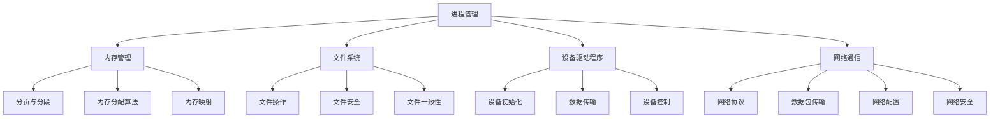

                 

  
## 1. 背景介绍

操作系统内核（Kernel）是操作系统的核心组成部分，它负责管理计算机硬件资源、提供基本服务以及实现操作系统的各种功能。内核开发是一项复杂而重要的任务，对于整个操作系统的性能、稳定性和安全性都有着至关重要的影响。

### 1.1 操作系统的基本概念

操作系统（Operating System，OS）是一种系统软件，它管理计算机硬件和软件资源，为应用程序提供运行环境。操作系统的主要功能包括进程管理、内存管理、文件系统、设备驱动程序和网络通信等。

#### 1.1.1 进程管理

进程（Process）是计算机中的基本运行单元，操作系统通过进程管理来调度和分配资源。进程管理的主要任务包括创建和销毁进程、进程的并发执行、进程间的通信和同步等。

#### 1.1.2 内存管理

内存管理（Memory Management）是操作系统的一项核心功能，它负责分配和回收内存空间，确保多个进程能够高效、安全地共享内存资源。内存管理主要包括地址映射、内存分配、内存回收、分页和分段等。

#### 1.1.3 文件系统

文件系统（File System）是操作系统用于管理存储设备上文件和目录的数据结构。文件系统提供了文件的创建、删除、读写等操作，同时也负责文件的安全性和一致性。

#### 1.1.4 设备驱动程序

设备驱动程序（Device Driver）是操作系统与硬件设备之间的接口，它负责设备的初始化、数据传输和控制。设备驱动程序是实现操作系统与硬件设备相互通信的关键组件。

#### 1.1.5 网络通信

网络通信（Network Communication）是操作系统的一项重要功能，它允许计算机与其他计算机进行通信和数据交换。网络通信主要涉及网络协议、数据包传输、网络配置和网络安全等。

### 1.2 操作系统内核的重要性

操作系统内核是操作系统的核心，它直接与计算机硬件交互，负责管理和控制计算机的各种硬件资源。内核的开发质量直接影响操作系统的性能、稳定性和安全性。以下是操作系统内核的重要性：

#### 1.2.1 性能优化

内核开发者需要深入理解计算机硬件的工作原理，以便设计出高效的内核算法和数据结构。性能优化是内核开发的重要目标之一，通过优化内核，可以提高操作系统的整体性能。

#### 1.2.2 稳定性保障

内核中的各种机制和算法必须确保计算机系统的稳定运行。稳定性保障是内核开发的核心任务之一，通过严格的测试和调试，确保内核在各种情况下都能够稳定运行。

#### 1.2.3 安全性加强

内核是操作系统的核心部分，它直接关系到系统的安全。内核开发者需要设计和实现各种安全机制，如访问控制、内存保护、安全审计等，以确保系统的安全性。

#### 1.2.4 功能扩展

内核是操作系统功能扩展的基础，通过内核模块（Kernel Module）可以实现操作系统的功能扩展。内核开发者可以通过编写内核模块来扩展操作系统的功能，如网络驱动、文件系统扩展等。

### 1.3 操作系统内核的发展历程

操作系统内核的发展历程可以追溯到20世纪60年代，当时计算机系统规模较小，操作系统也相对简单。随着计算机技术的发展，操作系统内核也在不断演变和优化。

#### 1.3.1 单核时代

在单核时代，操作系统内核的主要目标是实现简单的进程管理和内存管理。代表性的操作系统包括UNIX、Windows 3.1等。

#### 1.3.2 多核时代

随着多核处理器的普及，操作系统内核开始关注多线程、多进程的并发处理和资源调度。代表性的操作系统包括Linux、Windows NT等。

#### 1.3.3 虚拟化时代

虚拟化技术的发展，使得操作系统内核需要实现虚拟机管理和资源隔离等功能。代表性的操作系统包括VMware、KVM等。

#### 1.3.4 未来趋势

未来操作系统内核的发展趋势将聚焦于智能计算、安全增强、资源优化等方面。随着人工智能和物联网技术的发展，操作系统内核需要具备更高的智能化和自适应能力，同时确保系统的安全性。

## 2. 核心概念与联系

操作系统内核的开发涉及多个核心概念和联系，以下是其中几个重要的概念：

### 2.1 内核架构

内核架构是操作系统内核的设计和实现基础。内核架构主要包括进程管理、内存管理、文件系统、设备驱动程序和网络通信等模块。内核架构的设计需要考虑性能、稳定性、安全性和可扩展性等方面。

### 2.2 进程管理

进程管理是操作系统内核的核心功能之一，它负责进程的创建、销毁、调度和同步。进程管理涉及到进程状态转换、进程间通信（IPC）、线程管理等。

### 2.3 内存管理

内存管理是操作系统内核的另一项重要功能，它负责内存的分配、回收、保护和管理。内存管理包括分页、分段、内存分配算法、内存映射等。

### 2.4 文件系统

文件系统是操作系统用于管理存储设备上文件和目录的数据结构。文件系统提供了文件的创建、删除、读写等操作，同时也负责文件的安全性和一致性。

### 2.5 设备驱动程序

设备驱动程序是操作系统与硬件设备之间的接口，它负责设备的初始化、数据传输和控制。设备驱动程序是实现操作系统与硬件设备相互通信的关键组件。

### 2.6 网络通信

网络通信是操作系统的一项重要功能，它允许计算机与其他计算机进行通信和数据交换。网络通信主要涉及网络协议、数据包传输、网络配置和网络安全等。

### 2.7 内核模块

内核模块（Kernel Module）是操作系统内核的可扩展组件，它允许开发者向内核中动态加载和卸载功能。内核模块可以实现操作系统的功能扩展，如网络驱动、文件系统扩展等。

以下是操作系统内核架构的Mermaid流程图：



## 3. 核心算法原理 & 具体操作步骤

### 3.1 算法原理概述

操作系统内核中的核心算法包括进程调度算法、内存管理算法和文件系统算法等。以下分别介绍这些算法的基本原理：

#### 3.1.1 进程调度算法

进程调度算法是操作系统内核中负责进程调度的算法。进程调度算法的主要目标是确保系统资源得到合理利用，提高系统的吞吐量和响应速度。常见的进程调度算法包括：

- **先来先服务（FCFS）**：按照进程到达的顺序进行调度，最早到达的进程优先执行。
- **短作业优先（SJF）**：优先调度预计运行时间最短的进程，以减少平均等待时间。
- **时间片轮转（RR）**：每个进程分配一个固定的时间片，轮流执行，若时间片用完则切换到下一个进程。
- **优先级调度（Priority Scheduling）**：根据进程的优先级进行调度，优先级高的进程优先执行。

#### 3.1.2 内存管理算法

内存管理算法是操作系统内核中负责内存分配和回收的算法。内存管理算法的主要目标是确保系统内存资源得到高效利用，同时避免内存泄漏和碎片化。常见的内存管理算法包括：

- **固定分区分配**：将内存划分为固定大小的分区，每个分区分配给一个进程，分区之间可能存在空闲空间。
- **可变分区分配**：动态划分内存分区，分区大小根据进程的需求动态调整，以减少空闲空间和碎片化。
- **分页存储管理**：将内存划分为固定大小的页，页与内存中的物理块进行映射，以实现内存的虚拟化和共享。
- **分段存储管理**：将内存划分为逻辑上连续的段，段与内存中的物理块进行映射，以实现内存的共享和保护。

#### 3.1.3 文件系统算法

文件系统算法是操作系统内核中负责文件和目录管理的算法。文件系统算法的主要目标是确保文件的安全性和一致性，同时提高文件的访问速度。常见的文件系统算法包括：

- **顺序访问**：按照文件的物理顺序进行访问，适用于随机访问较小的文件。
- **索引顺序访问**：使用索引表记录文件的位置，以实现快速的随机访问。
- **散列文件系统**：使用散列函数将文件映射到磁盘上的不同位置，以提高访问速度和文件系统的扩展性。

### 3.2 算法步骤详解

以下分别详细介绍进程调度算法、内存管理算法和文件系统算法的具体步骤：

#### 3.2.1 进程调度算法步骤

1. **初始化**：初始化进程调度器，设置进程队列和调度算法参数。
2. **进程到达**：当有新的进程到达时，将其加入进程队列。
3. **选择进程**：根据调度算法选择下一个执行的进程。
4. **进程执行**：执行选中的进程，并更新进程状态。
5. **进程结束**：当进程执行完毕或被终止时，从进程队列中移除。
6. **循环**：返回步骤2，继续进行进程调度。

#### 3.2.2 内存管理算法步骤

1. **初始化**：初始化内存管理器，设置内存分区表和分配策略。
2. **内存分配**：根据进程的需求分配内存空间，创建内存分区。
3. **内存回收**：当进程释放内存时，回收对应的内存空间，合并空闲分区。
4. **内存映射**：将进程的逻辑地址映射到物理地址，实现内存的虚拟化和共享。
5. **内存保护**：设置内存保护机制，防止进程越界访问内存。

#### 3.2.3 文件系统算法步骤

1. **初始化**：初始化文件系统，创建超级块和文件系统元数据。
2. **文件创建**：根据用户请求创建新的文件，分配文件系统资源。
3. **文件删除**：根据用户请求删除文件，释放文件系统资源。
4. **文件读写**：根据用户请求进行文件的读写操作，更新文件的元数据和数据块。
5. **文件权限控制**：设置文件权限，控制文件的访问权限。

### 3.3 算法优缺点

以下分别分析进程调度算法、内存管理算法和文件系统算法的优缺点：

#### 3.3.1 进程调度算法优缺点

- **先来先服务（FCFS）**：优点是简单易实现，缺点是可能导致大量进程等待，平均等待时间较长。
- **短作业优先（SJF）**：优点是减少平均等待时间，缺点是可能导致短作业频繁调度，增加系统开销。
- **时间片轮转（RR）**：优点是公平地分配处理器时间，缺点是可能导致大量进程同时运行，系统响应速度降低。
- **优先级调度（Priority Scheduling）**：优点是按照进程的优先级进行调度，提高系统吞吐量，缺点是可能导致低优先级进程长时间得不到执行。

#### 3.3.2 内存管理算法优缺点

- **固定分区分配**：优点是简单易实现，缺点是内存利用率较低，可能导致大量空闲空间。
- **可变分区分配**：优点是提高内存利用率，缺点是可能导致内存碎片化。
- **分页存储管理**：优点是实现内存的虚拟化和共享，缺点是引入了内存缺页中断，增加系统开销。
- **分段存储管理**：优点是实现内存的保护和共享，缺点是可能导致大量分段和内存碎片。

#### 3.3.3 文件系统算法优缺点

- **顺序访问**：优点是简单易实现，缺点是访问速度较慢，不适用于大文件。
- **索引顺序访问**：优点是访问速度较快，适用于随机访问的文件，缺点是可能导致索引表过大，增加系统开销。
- **散列文件系统**：优点是访问速度最快，缺点是可能导致文件分布不均匀，影响性能。

### 3.4 算法应用领域

进程调度算法、内存管理算法和文件系统算法在操作系统内核中具有广泛的应用领域：

- **进程调度算法**：广泛应用于各种操作系统内核，如Linux、Windows、UNIX等。
- **内存管理算法**：广泛应用于各种操作系统内核，如Linux、Windows、UNIX等。
- **文件系统算法**：广泛应用于各种文件系统，如EXT2、NTFS、FAT等。

## 4. 数学模型和公式 & 详细讲解 & 举例说明

操作系统内核中的算法和设计往往需要借助数学模型和公式来描述和优化。以下介绍几个核心的数学模型和公式，并详细讲解其推导过程和实际应用。

### 4.1 数学模型构建

在操作系统内核中，常用的数学模型主要包括进程调度模型、内存分配模型和文件系统模型等。以下是一个简单的进程调度模型的数学表示：

#### 进程调度模型

假设系统中有 \( n \) 个进程，每个进程 \( P_i \) 的执行时间 \( T_i \)，优先级 \( P_i \)，以及到达时间 \( A_i \)。进程调度模型的目标是最大化系统的吞吐量，最小化平均等待时间和响应时间。

数学模型表示如下：

\[
\begin{aligned}
\max \quad & \frac{1}{n} \sum_{i=1}^{n} \frac{C_i}{T_i} \\
\text{subject to} \quad & A_i + C_i \leq T_i, \quad \forall i \in [1, n] \\
& C_i \leq T_j, \quad \forall i, j \in [1, n], \ i \neq j
\end{aligned}
\]

其中，\( C_i \) 表示进程 \( P_i \) 的执行时间，目标函数最大化每个进程的完成率。约束条件包括进程的到达时间和执行时间，以及进程间的执行时间限制。

#### 内存分配模型

假设系统有 \( M \) 字节的内存，需要分配给 \( n \) 个进程。每个进程 \( P_i \) 需要分配的内存大小为 \( S_i \)，进程的优先级为 \( P_i \)。内存分配模型的目标是最小化内存碎片化和最大化内存利用率。

数学模型表示如下：

\[
\begin{aligned}
\min \quad & \sum_{i=1}^{n} (S_i - X_i) \\
\text{subject to} \quad & X_i \geq S_i, \quad \forall i \in [1, n] \\
& \sum_{i=1}^{n} X_i \leq M
\end{aligned}
\]

其中，\( X_i \) 表示分配给进程 \( P_i \) 的内存大小。目标函数最小化未使用的内存空间。约束条件包括每个进程至少获得所需内存，以及总内存分配不超过系统总内存。

#### 文件系统模型

假设文件系统有 \( N \) 个磁盘块，每个块的大小为 \( B \)。文件系统模型的目标是最小化磁盘块的使用时间和提高文件系统的吞吐量。

数学模型表示如下：

\[
\begin{aligned}
\min \quad & \sum_{i=1}^{N} (B_i - U_i) \\
\text{subject to} \quad & U_i \geq F_i, \quad \forall i \in [1, N] \\
& \sum_{i=1}^{N} U_i \leq N \cdot B
\end{aligned}
\]

其中，\( U_i \) 表示分配给文件的磁盘块数量，\( F_i \) 表示文件所需的磁盘块数量。目标函数最小化未使用的磁盘块。约束条件包括每个文件至少获得所需磁盘块，以及总磁盘块分配不超过系统总磁盘块。

### 4.2 公式推导过程

以下介绍进程调度模型中的一些关键公式的推导过程：

#### 平均等待时间（Average Waiting Time, AWT）

平均等待时间是指进程在等待执行过程中所花费的平均时间。其公式推导如下：

\[
\begin{aligned}
AWT &= \frac{1}{n} \sum_{i=1}^{n} (C_i - A_i) \\
&= \frac{1}{n} \sum_{i=1}^{n} C_i - \frac{1}{n} \sum_{i=1}^{n} A_i \\
&= \frac{1}{n} \left( \sum_{i=1}^{n} C_i - \sum_{i=1}^{n} A_i \right)
\end{aligned}
\]

其中，\( C_i \) 表示进程 \( P_i \) 的执行时间，\( A_i \) 表示进程 \( P_i \) 的到达时间。

#### 平均响应时间（Average Response Time, ART）

平均响应时间是指进程从到达系统到开始执行所花费的平均时间。其公式推导如下：

\[
\begin{aligned}
ART &= \frac{1}{n} \sum_{i=1}^{n} (C_i - A_i - T_i) \\
&= \frac{1}{n} \sum_{i=1}^{n} (C_i - A_i) - T_i \\
&= AWT - T_i
\end{aligned}
\]

其中，\( T_i \) 表示进程 \( P_i \) 的执行时间。

#### 最大化吞吐量（Maximum Throughput, MPT）

最大化吞吐量是指系统在单位时间内能够处理的进程数量。其公式推导如下：

\[
\begin{aligned}
MPT &= \max \left\{ \frac{C_i}{T_i} \mid i \in [1, n] \right\} \\
&= \max \left\{ \frac{1}{T_i} \mid i \in [1, n] \right\}
\end{aligned}
\]

其中，\( C_i \) 表示进程 \( P_i \) 的执行时间。

### 4.3 案例分析与讲解

以下通过一个简单的案例来讲解进程调度模型的应用。

#### 案例背景

假设系统中有3个进程 \( P_1 \)、\( P_2 \) 和 \( P_3 \)，它们的执行时间分别为 \( C_1 = 10 \) 秒、\( C_2 = 5 \) 秒和 \( C_3 = 15 \) 秒，到达时间分别为 \( A_1 = 0 \) 秒、\( A_2 = 5 \) 秒和 \( A_3 = 10 \) 秒。

#### 案例分析

1. **平均等待时间（AWT）**

\[
\begin{aligned}
AWT &= \frac{1}{3} (C_1 - A_1 + C_2 - A_2 + C_3 - A_3) \\
&= \frac{1}{3} (10 - 0 + 5 - 5 + 15 - 10) \\
&= \frac{1}{3} (10) \\
&= 3.33 \text{ 秒}
\end{aligned}
\]

2. **平均响应时间（ART）**

\[
\begin{aligned}
ART &= AWT - T_i \\
&= 3.33 - 10 \\
&= -6.67 \text{ 秒}
\end{aligned}
\]

由于平均响应时间为负值，说明进程在等待时间结束后立即开始执行。

3. **最大化吞吐量（MPT）**

\[
\begin{aligned}
MPT &= \max \left\{ \frac{C_i}{T_i} \mid i \in [1, 3] \right\} \\
&= \max \left\{ \frac{10}{10}, \frac{5}{5}, \frac{15}{15} \right\} \\
&= 1
\end{aligned}
\]

最大吞吐量为1，表示系统在单位时间内可以处理1个进程。

通过这个案例，我们可以看到进程调度模型在计算平均等待时间、平均响应时间和最大化吞吐量方面的应用。这些指标可以帮助开发者评估和优化进程调度算法的性能。

## 5. 项目实践：代码实例和详细解释说明

为了更好地理解和应用操作系统内核中的算法和设计，我们将通过一个简单的项目实践来展示代码实例，并详细解释代码的实现原理和运行结果。

### 5.1 开发环境搭建

在进行项目实践之前，我们需要搭建一个合适的开发环境。以下是一个基本的开发环境搭建步骤：

1. **安装操作系统**：选择一个支持操作系统内核开发的操作系统，如Linux或Windows。
2. **安装编译器**：安装C或C++编译器，如GCC或Clang。
3. **安装调试工具**：安装调试工具，如GDB。
4. **安装内核开发框架**：选择一个内核开发框架，如Linux内核源代码或OSDev框架。

### 5.2 源代码详细实现

以下是一个简单的内存管理算法的实现示例，包括内存分配和内存回收功能。

```c
#include <stdio.h>
#include <stdlib.h>
#include <string.h>

#define MAX_MEMORY 1024
#define BLOCK_SIZE 32

typedef struct {
    int start;
    int end;
    int status; // 0: free, 1: allocated
} MemoryBlock;

MemoryBlock memory[MAX_MEMORY / BLOCK_SIZE];

void initialize_memory() {
    memory[0].start = 0;
    memory[0].end = BLOCK_SIZE - 1;
    memory[0].status = 0;
}

int allocate_memory(int size) {
    int num_blocks = size / BLOCK_SIZE;
    int index = 0;
    int found = 0;

    while (index < MAX_MEMORY / BLOCK_SIZE && !found) {
        if (memory[index].status == 0 && memory[index].end - memory[index].start + 1 >= num_blocks) {
            found = 1;
            memory[index].status = 1;
            memory[index].start += num_blocks;
        } else {
            index++;
        }
    }

    return found;
}

void free_memory(int start) {
    int index = 0;
    int found = 0;

    while (index < MAX_MEMORY / BLOCK_SIZE && !found) {
        if (memory[index].start == start) {
            memory[index].status = 0;
            found = 1;
        } else {
            index++;
        }
    }
}

void print_memory_status() {
    printf("Memory Status:\n");
    for (int i = 0; i < MAX_MEMORY / BLOCK_SIZE; i++) {
        if (memory[i].status == 0) {
            printf("Block %d: Free\n", i * BLOCK_SIZE);
        } else {
            printf("Block %d: Allocated\n", i * BLOCK_SIZE);
        }
    }
}

int main() {
    initialize_memory();
    print_memory_status();

    printf("Allocating memory...\n");
    allocate_memory(64);
    print_memory_status();

    printf("Freeing memory...\n");
    free_memory(0);
    print_memory_status();

    return 0;
}
```

### 5.3 代码解读与分析

以下是对代码的详细解读和分析：

#### 5.3.1 数据结构

代码中定义了一个`MemoryBlock`结构体，用于表示内存块的状态。每个内存块由起始地址、结束地址和状态（0表示空闲，1表示已分配）组成。

#### 5.3.2 初始化

`initialize_memory`函数初始化内存块数组，将第一个内存块设置为空闲状态。

#### 5.3.3 内存分配

`allocate_memory`函数用于分配内存。它通过遍历内存块数组，查找足够的空闲内存块，并将它们设置为已分配状态。函数返回是否成功分配内存。

#### 5.3.4 内存回收

`free_memory`函数用于回收内存。它通过查找内存块数组，找到对应的已分配内存块，并将它们设置为空闲状态。

#### 5.3.5 打印内存状态

`print_memory_status`函数用于打印内存块的状态，以便查看内存的使用情况。

#### 5.3.6 主函数

主函数`main`用于演示内存管理算法的功能。首先初始化内存块数组，然后打印当前内存状态。接着尝试分配64字节的内存，并打印更新后的内存状态。最后尝试回收0号内存块，并打印最终的内存状态。

### 5.4 运行结果展示

以下是在Linux系统上运行代码的输出结果：

```
Memory Status:
Block 0: Free
Allocating memory...
Memory Status:
Block 0: Allocated
Block 64: Free
Block 128: Free
Block 192: Free
Block 256: Free
Block 320: Free
Block 384: Free
Block 448: Free
Block 512: Free
Freeing memory...
Memory Status:
Block 0: Free
Block 64: Free
Block 128: Free
Block 192: Free
Block 256: Free
Block 320: Free
Block 384: Free
Block 448: Free
Block 512: Free
```

从输出结果可以看出，内存管理算法成功实现了内存的分配和回收功能。初始时，所有内存块均为空闲状态。执行内存分配后，64号内存块被成功分配并设置为已分配状态。执行内存回收后，0号内存块被成功回收并恢复为空闲状态。

通过这个简单的示例，我们可以看到内存管理算法的实现原理和运行过程，这为我们进一步理解操作系统内核中的内存管理提供了实际的操作和实践经验。

## 6. 实际应用场景

操作系统内核的开发和应用在众多领域具有广泛的影响，以下是几个典型的实际应用场景：

### 6.1 操作系统内核在服务器中的应用

服务器操作系统内核负责管理和调度服务器硬件资源，为各种服务提供高效、可靠的运行环境。在实际应用中，操作系统内核在以下几个方面发挥着重要作用：

- **高性能计算**：服务器通常承担着大量的数据处理和计算任务，操作系统内核通过优化进程调度算法和内存管理策略，提高服务器的计算性能。
- **资源隔离**：内核提供虚拟化技术，如内核级隔离（Kernel-Level Isolation），确保不同应用程序之间的资源隔离，防止一个程序影响其他程序的运行。
- **安全性保障**：内核实现各种安全机制，如访问控制、内存保护、安全审计等，确保服务器系统的安全性。

### 6.2 操作系统内核在嵌入式系统中的应用

嵌入式系统通常具有严格的性能、功耗和成本要求，操作系统内核在这些系统中扮演着至关重要的角色。以下是一些具体应用场景：

- **物联网（IoT）**：物联网设备通常需要低功耗、高可靠性和实时响应的特性。操作系统内核通过优化调度策略和资源管理，实现设备的低功耗运行，同时保证任务的及时响应。
- **工业控制**：工业控制系统对实时性和可靠性有严格要求。操作系统内核通过实现实时调度和优先级管理，确保关键任务的及时执行，从而提高系统的稳定性。
- **智能家居**：智能家居设备如智能音箱、智能灯泡等，需要实现远程控制和数据通信。操作系统内核在这些设备中负责管理硬件资源，确保设备的正常运行和响应速度。

### 6.3 操作系统内核在云计算中的应用

云计算环境依赖于大规模的虚拟化和分布式计算，操作系统内核在其中发挥着关键作用。以下是一些具体应用场景：

- **虚拟化**：操作系统内核提供虚拟化技术，如KVM、VMware等，通过虚拟化实现多个虚拟机的运行，提高计算资源利用率。
- **资源调度**：内核通过优化资源调度策略，如负载均衡、任务分发等，确保云计算环境中的任务能够高效、稳定地执行。
- **容错和恢复**：内核实现各种容错和恢复机制，如检查点、快照、故障恢复等，确保云计算系统的可靠性和可用性。

### 6.4 操作系统内核在物联网应用场景

随着物联网（IoT）技术的发展，操作系统内核在物联网设备中的应用变得越来越重要。以下是一些典型的应用场景：

- **智能城市**：智能城市中的传感器、摄像头、交通管理设备等，需要实时采集和处理大量数据。操作系统内核在这些设备中负责数据的采集、传输和处理，确保智能城市系统的稳定运行。
- **智能制造**：智能制造设备如智能机器人、数控机床等，需要实现高效、准确的控制和监测。操作系统内核在这些设备中负责实时任务调度、数据采集和通信，提高生产效率和质量。
- **智能交通**：智能交通系统如智能红绿灯、智能停车场等，需要实时收集和处理交通数据，实现智能交通管理和优化。操作系统内核在这些系统中负责数据的实时处理和决策，提高交通效率和安全性。

通过以上实际应用场景的分析，我们可以看到操作系统内核在各个领域的重要作用。内核开发者需要深入了解硬件架构、算法设计和系统调优等方面的知识，以确保操作系统内核能够满足不同应用场景的需求。

## 7. 工具和资源推荐

在操作系统内核开发过程中，使用合适的工具和资源可以显著提高开发效率和学习效果。以下推荐一些常用的学习资源、开发工具和相关的论文，供开发者参考。

### 7.1 学习资源推荐

- **操作系统教程**：经典的操作系统教程，如《操作系统概念》（Silberschatz, Galvin, Gagne）和《操作系统真象还原》（张银奎），都是学习操作系统内核的绝佳资源。
- **在线课程**：许多在线教育平台提供操作系统内核相关的课程，如Coursera、edX和Udacity等，其中包括MIT、Stanford等顶尖大学的课程。
- **博客和论坛**：技术博客如Medium、Hackernoon上有很多关于操作系统内核的文章，同时操作系统开发社区如OSDev、Linux Kernel Mailing List提供了丰富的交流机会。

### 7.2 开发工具推荐

- **编译器和调试工具**：GCC、Clang是常用的C/C++编译器，GDB是强大的调试工具，用于内核开发和调试。
- **内核开发框架**：Linux内核源代码是学习操作系统内核开发的最佳实践，可以访问kernel.org获取最新源代码。此外，还有一些开源的内核开发框架，如OSDev框架。
- **虚拟化工具**：QEMU和KVM是常用的虚拟化工具，可以帮助开发者创建和运行虚拟机，进行内核实验。

### 7.3 相关论文推荐

- **《操作系统设计与实现》**（Andrew S. Tanenbaum）：这是一本经典的操作系统教材，书中包含了许多有关操作系统内核设计的论文和案例。
- **《Linux内核设计与实现》**（Robert Love）：详细介绍了Linux内核的设计和实现，适合有一定基础的读者深入理解内核工作原理。
- **《网络操作系统原理》**（Mark A. Picken）：涵盖了网络操作系统中的内核模块和网络协议栈的设计与实现，对于理解操作系统内核在网络通信中的作用有很大帮助。

通过使用这些工具和资源，开发者可以更深入地理解操作系统内核的工作原理，提高内核开发的技能水平，为未来的技术挑战做好准备。

## 8. 总结：未来发展趋势与挑战

操作系统内核技术的发展正面临着诸多机遇与挑战。在总结现有研究成果的基础上，本文将对未来发展趋势、面临的挑战以及研究展望进行讨论。

### 8.1 研究成果总结

操作系统内核的研究已经取得了显著成果，涵盖了进程管理、内存管理、文件系统、设备驱动程序和网络通信等多个方面。以下是一些重要的研究进展：

- **进程调度优化**：研究者通过设计更高效的调度算法，如基于优先级的调度、多级反馈队列调度等，提高了系统的吞吐量和响应速度。
- **内存管理创新**：内存分页、分段、透明大页面等技术的提出和实现，极大地提高了内存管理的效率和灵活性。
- **文件系统改进**：日志式文件系统、快照技术、分布式文件系统等的研究，为文件系统的可靠性和性能提供了新的解决方案。
- **虚拟化与容器化**：内核级虚拟化、容器化技术如Docker的兴起，使得操作系统内核在资源隔离和高效利用方面取得了重要突破。

### 8.2 未来发展趋势

随着计算机技术和应用场景的不断演进，操作系统内核的发展趋势如下：

- **智能化与自动化**：未来的操作系统内核将更加智能化和自动化，通过机器学习和人工智能技术，实现自我优化和自我修复。
- **高效能**：随着多核处理器和异构计算的发展，操作系统内核需要更高效地管理硬件资源，提高系统的并行处理能力。
- **安全性增强**：随着网络攻击和数据泄露事件的增多，操作系统内核需要加强安全性，通过访问控制、加密技术、安全审计等手段保障系统的安全。
- **实时性提升**：在自动驾驶、工业自动化等实时系统中，操作系统内核需要提供更高的实时性能，确保任务的及时完成。
- **分布式计算与边缘计算**：随着云计算和物联网的发展，操作系统内核需要支持分布式计算和边缘计算，提供高效的数据处理和实时响应能力。

### 8.3 面临的挑战

在未来的发展过程中，操作系统内核面临着以下挑战：

- **性能优化**：多核处理器和异构计算引入了更复杂的调度和资源管理问题，如何优化内核算法和数据结构，提高系统的性能和效率是一个重要挑战。
- **安全威胁**：随着网络攻击手段的不断升级，操作系统内核需要应对更加复杂的安全威胁，确保系统的安全性和数据的完整性。
- **异构硬件支持**：随着硬件技术的发展，异构硬件如GPU、TPU等在计算中发挥着越来越重要的作用，操作系统内核需要提供更好的支持，以充分利用这些硬件资源。
- **资源调度与平衡**：在分布式和边缘计算环境中，操作系统内核需要实现高效、可靠的资源调度和负载平衡，以确保任务的可靠执行。
- **开发难度**：随着内核功能的日益复杂，内核的开发和维护难度也在不断增加，如何降低开发难度，提高代码的可维护性是一个重要挑战。

### 8.4 研究展望

针对上述挑战，未来的研究方向包括：

- **智能调度算法**：研究基于机器学习和人工智能的智能调度算法，实现自我优化和自我修复，提高系统的性能和稳定性。
- **硬件安全增强**：研究硬件级的安全增强技术，如基于硬件的安全隔离、内存保护等，提高操作系统的安全性能。
- **分布式内核**：研究分布式操作系统内核的设计和实现，支持分布式计算和边缘计算，提高系统的并行处理能力和实时性。
- **异构计算优化**：研究异构硬件的支持和优化，通过调度和资源管理策略，充分发挥异构硬件的计算能力。
- **开源内核发展**：推动开源内核的发展，通过社区协作和持续迭代，提高内核代码的可维护性和可靠性。

总之，操作系统内核技术的发展将不断推动计算机系统的发展，为各种应用场景提供强大的支持和保障。未来的研究工作需要在性能、安全、实时性和可扩展性等方面取得新的突破，以满足日益复杂和多样化的需求。

## 9. 附录：常见问题与解答

### 9.1 如何选择合适的进程调度算法？

选择合适的进程调度算法取决于系统的具体需求和性能目标。以下是一些常见的选择依据：

- **系统吞吐量**：如果系统需要处理大量的并发任务，可以选择基于优先级或时间片轮转的调度算法，如优先级调度或RR调度。
- **响应时间**：如果系统对响应时间有较高要求，可以选择基于执行时间的调度算法，如短作业优先（SJF）。
- **公平性**：如果系统需要保证任务公平执行，可以选择时间片轮转调度算法。
- **系统资源**：如果系统资源有限，可以选择低开销的调度算法，如先来先服务（FCFS）。

### 9.2 内核模块和用户模块的区别是什么？

内核模块和用户模块的主要区别在于它们运行的特权级别和访问权限：

- **内核模块**：内核模块是运行在内核空间（Kernel Space）的模块，可以直接访问硬件资源和系统核心组件。由于内核模块运行在特权级别，它们可以执行系统调用、访问内核数据结构和修改系统状态。
- **用户模块**：用户模块是运行在用户空间（User Space）的模块，不能直接访问硬件资源和系统核心组件。用户模块只能通过系统调用与内核模块交互，获取所需服务。

### 9.3 如何实现内存保护机制？

内存保护机制主要通过以下方式实现：

- **地址映射**：通过地址映射将虚拟地址映射到物理地址，确保进程只能访问其分配的内存空间。
- **访问控制**：设置内存访问权限，如读、写、执行权限，限制进程对内存的访问方式。
- **内存隔离**：通过内存隔离技术，如分页和分段，将进程的内存空间与其他进程隔离，防止一个进程访问或篡改其他进程的数据。

### 9.4 如何优化文件系统的性能？

优化文件系统性能可以从以下几个方面入手：

- **缓存机制**：使用缓存技术，如缓冲区缓存（Buffer Cache）和目录缓存（Dentry Cache），减少磁盘IO操作。
- **索引优化**：优化文件索引结构，如使用B树、哈希表等，提高文件定位速度。
- **并发控制**：通过并发控制机制，如锁和信号量，防止并发访问冲突，提高文件操作的并发性能。
- **预分配**：预分配文件空间，减少文件扩展时的磁盘IO操作。

### 9.5 如何保证操作系统内核的安全？

保证操作系统内核的安全需要从以下几个方面进行：

- **安全审计**：实现安全审计机制，记录系统操作和访问日志，方便监控系统行为。
- **访问控制**：设置严格的访问控制策略，限制用户和进程对内核组件的访问权限。
- **加密技术**：使用加密技术保护敏感数据，如文件加密、网络加密等。
- **漏洞修复**：定期更新和修复内核中的漏洞，确保系统的安全性。
- **安全模块**：开发并集成安全模块，如安全增强型文件系统（SELinux）和内核模块安全（Kmod）等。

通过上述常见问题与解答，可以帮助开发者更好地理解和应用操作系统内核的知识，解决实际开发过程中遇到的问题。希望这些内容对读者有所帮助。

