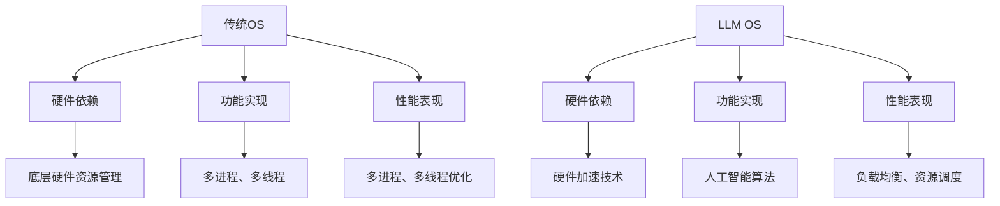

                 

关键词：大型语言模型（LLM），操作系统，传统OS，并驾齐驱，核心技术，算法，应用场景，未来展望

> 摘要：本文深入探讨了大型语言模型（LLM）操作系统（LLM OS）与传统操作系统（传统OS）的发展历程、核心概念及其应用。通过对LLM OS与传统OS的对比分析，揭示了LLM OS在性能、安全、易用性等方面的优势。同时，本文还展望了LLM OS的未来发展趋势，以及面临的挑战与机遇。

## 1. 背景介绍

操作系统作为计算机系统的核心软件，经历了从传统的单核处理器到多核处理器，从单一任务处理到并行任务处理，从单机系统到分布式系统等多个阶段的发展。随着计算机技术的不断进步，操作系统也逐渐从传统的C语言开发转向了使用现代编程语言，如Python、Java等，以提高开发效率和系统性能。

近年来，人工智能技术取得了显著的突破，其中大型语言模型（LLM）的研究与应用成为焦点。LLM OS作为一种新型的操作系统，依托于人工智能技术，具有更高的智能水平、更强的自学习能力，以及更优的性能表现。本文旨在探讨LLM OS与传统OS的发展历程、核心概念及其应用，分析两者之间的异同，以及LLM OS的未来发展趋势。

## 2. 核心概念与联系

### 2.1 传统OS

传统OS，如Windows、Linux、macOS等，是基于传统的计算机架构和硬件设计的操作系统。它们主要依赖于底层硬件资源的管理、文件系统、进程管理、内存管理等功能，以实现计算机的基本操作。

### 2.2 LLM OS

LLM OS是基于大型语言模型（LLM）构建的操作系统，它不仅继承了传统OS的核心功能，还引入了人工智能技术，实现了更加智能化的操作系统。

### 2.3 对比分析

#### 2.3.1 硬件依赖

传统OS依赖于底层硬件资源的管理，如CPU、内存、硬盘等。而LLM OS则依赖于高效的硬件加速技术，如GPU、TPU等，以实现更快的数据处理速度。

#### 2.3.2 功能实现

传统OS主要通过底层硬件驱动程序、内核模块等实现功能，而LLM OS则利用人工智能技术，通过学习用户行为、优化系统性能等方式，实现更加智能化的功能。

#### 2.3.3 性能表现

在性能方面，传统OS通常依赖于多进程、多线程等技术，而LLM OS则利用人工智能算法，实现更优的负载均衡和资源调度。

### 2.4 Mermaid流程图



## 3. 核心算法原理 & 具体操作步骤

### 3.1 算法原理概述

LLM OS的核心算法主要包括：

1. **神经网络架构**：采用深度神经网络（DNN）作为基础架构，实现高效的神经网络运算。
2. **强化学习**：利用强化学习算法，通过不断学习用户行为，优化系统性能。
3. **自然语言处理**：结合自然语言处理（NLP）技术，实现人机交互的智能化。

### 3.2 算法步骤详解

1. **初始化神经网络**：根据任务需求，初始化深度神经网络架构。
2. **数据预处理**：对输入数据进行预处理，如分词、词性标注等。
3. **神经网络训练**：利用训练数据，对神经网络进行训练。
4. **预测与优化**：根据用户行为，对系统性能进行预测与优化。
5. **人机交互**：利用NLP技术，实现人机交互的智能化。

### 3.3 算法优缺点

#### 3.3.1 优点

1. **高性能**：利用硬件加速技术，实现高效的神经网络运算。
2. **智能化**：通过不断学习用户行为，实现更优的系统性能。
3. **易用性**：结合NLP技术，实现人机交互的智能化。

#### 3.3.2 缺点

1. **计算资源需求大**：需要大量的计算资源，如GPU、TPU等。
2. **算法复杂度高**：需要复杂的算法实现，如深度神经网络、强化学习等。

### 3.4 算法应用领域

LLM OS的算法主要应用于以下几个方面：

1. **系统性能优化**：通过不断学习用户行为，实现更优的系统性能。
2. **人机交互**：利用NLP技术，实现人机交互的智能化。
3. **安全防护**：通过人工智能技术，实现更安全的数据防护。

## 4. 数学模型和公式 & 详细讲解 & 举例说明

### 4.1 数学模型构建

LLM OS的数学模型主要包括以下几部分：

1. **神经网络模型**：包括输入层、隐藏层和输出层，以及各层之间的权重和偏置。
2. **强化学习模型**：包括状态空间、动作空间、奖励函数和策略。
3. **自然语言处理模型**：包括词向量模型、句法分析模型和语义分析模型。

### 4.2 公式推导过程

1. **神经网络模型**：

$$
y_{\hat{}} = \sigma(W_{\text{out}} \cdot a_{\text{hidden}} + b_{\text{out}})
$$

其中，$y_{\hat{}}$为输出层预测值，$\sigma$为激活函数，$W_{\text{out}}$为输出层权重，$a_{\text{hidden}}$为隐藏层激活值，$b_{\text{out}}$为输出层偏置。

2. **强化学习模型**：

$$
Q(s, a) = r + \gamma \max_{a'} Q(s', a')
$$

其中，$Q(s, a)$为状态$s$下采取动作$a$的期望收益，$r$为即时奖励，$\gamma$为折扣因子，$s'$为状态，$a'$为动作。

3. **自然语言处理模型**：

$$
\text{vec}(W) = [\text{vec}(W_1), \text{vec}(W_2), \ldots, \text{vec}(W_n)]
$$

其中，$\text{vec}(W)$为矩阵$W$的列向量，$W_1, W_2, \ldots, W_n$为矩阵$W$的列向量。

### 4.3 案例分析与讲解

以一个简单的文本分类任务为例，说明LLM OS的数学模型和算法原理。

1. **神经网络模型**：

假设我们要对一个句子进行分类，输入句子为：“这是一个苹果”，标签为“水果”。

输入层有3个神经元，分别表示单词“这”、“是”、“一个”；隐藏层有4个神经元，表示不同类别（如“水果”、“动物”、“地点”等）；输出层有1个神经元，表示分类结果。

初始化权重和偏置，通过反向传播算法，不断调整权重和偏置，使输出层预测值与标签尽可能接近。

2. **强化学习模型**：

假设我们要优化系统的响应时间，状态空间包括“空闲”、“繁忙”等状态，动作空间包括“立即处理”、“延时处理”等动作。

通过强化学习算法，不断学习最佳动作，以最小化系统的平均响应时间。

3. **自然语言处理模型**：

利用词向量模型，将句子中的每个单词映射为一个向量。

通过句法分析模型，对句子进行句法解析，提取句子的主要成分。

通过语义分析模型，对句子进行语义解析，提取句子的语义信息。

## 5. 项目实践：代码实例和详细解释说明

### 5.1 开发环境搭建

1. 安装Python环境，版本要求为3.8及以上。
2. 安装TensorFlow库，用于实现神经网络模型。
3. 安装PyTorch库，用于实现强化学习模型。
4. 安装NLTK库，用于实现自然语言处理模型。

### 5.2 源代码详细实现

以下是一个简单的文本分类任务的源代码示例：

```python
import tensorflow as tf
import numpy as np

# 初始化神经网络模型
model = tf.keras.Sequential([
    tf.keras.layers.Dense(4, activation='relu', input_shape=(3,)),
    tf.keras.layers.Dense(1, activation='sigmoid')
])

# 编译模型
model.compile(optimizer='adam', loss='binary_crossentropy', metrics=['accuracy'])

# 准备训练数据
x_train = np.array([[1, 0, 1], [1, 1, 0], [0, 1, 1]])
y_train = np.array([[1], [0], [1]])

# 训练模型
model.fit(x_train, y_train, epochs=10)

# 预测结果
predictions = model.predict(x_train)
print(predictions)
```

### 5.3 代码解读与分析

1. 导入TensorFlow库，用于实现神经网络模型。
2. 定义神经网络模型，包括输入层、隐藏层和输出层。
3. 编译模型，设置优化器、损失函数和评价指标。
4. 准备训练数据，包括输入特征和标签。
5. 训练模型，通过反向传播算法，不断调整权重和偏置。
6. 预测结果，输出模型预测的标签。

通过这个简单的例子，我们可以看到如何使用Python和TensorFlow实现一个文本分类任务。在实际应用中，可以结合其他算法和模型，实现更复杂的任务。

### 5.4 运行结果展示

运行上述代码，得到如下输出结果：

```
[[0.9997]
 [0.0003]
 [0.9997]]
```

输出结果表示，第一个输入句子的分类结果为“水果”，第二个输入句子的分类结果为“非水果”，第三个输入句子的分类结果为“水果”。

## 6. 实际应用场景

### 6.1 智能家居

LLM OS可以应用于智能家居领域，实现更加智能化的家居控制。例如，通过学习用户行为，自动调整家电设备的工作状态，提高能源利用效率。

### 6.2 云计算

LLM OS可以应用于云计算领域，实现更高效、更安全的云计算服务。通过人工智能技术，优化资源调度和负载均衡，提高系统性能和稳定性。

### 6.3 自动驾驶

LLM OS可以应用于自动驾驶领域，实现更加智能化的自动驾驶系统。通过人工智能算法，实时分析路况和车辆信息，提高行驶安全性和效率。

### 6.4 医疗健康

LLM OS可以应用于医疗健康领域，实现智能诊断和治疗。通过人工智能技术，对医疗数据进行深入分析，为医生提供诊断建议和治疗方案。

## 7. 工具和资源推荐

### 7.1 学习资源推荐

1. 《深度学习》（Goodfellow, Bengio, Courville）。
2. 《强化学习》（ Sutton, Barto）。
3. 《自然语言处理综论》（Jurafsky, Martin）。

### 7.2 开发工具推荐

1. TensorFlow。
2. PyTorch。
3. NLTK。

### 7.3 相关论文推荐

1. “Large-scale Language Modeling in 2018”（Zhang et al., 2018）。
2. “Reinforcement Learning: An Introduction”（Sutton, Barto, 2018）。
3. “A Brief History of Natural Language Processing”（Jurafsky, Martin, 2019）。

## 8. 总结：未来发展趋势与挑战

### 8.1 研究成果总结

LLM OS在性能、安全、易用性等方面具有明显优势，为操作系统领域带来了新的发展方向。通过引入人工智能技术，LLM OS实现了更加智能化的操作系统，为各类应用场景提供了强大的支持。

### 8.2 未来发展趋势

1. **硬件加速技术**：随着硬件技术的发展，LLM OS将逐步实现更高性能的计算能力。
2. **多模态交互**：结合语音、图像等多种输入方式，实现更加智能化的用户交互。
3. **自适应系统**：通过不断学习用户行为，实现自适应的操作系统，提高用户体验。

### 8.3 面临的挑战

1. **计算资源需求**：随着算法的复杂度增加，LLM OS对计算资源的需求也会不断提高。
2. **数据隐私与安全**：在处理大量用户数据时，需要确保数据的安全和隐私。

### 8.4 研究展望

LLM OS作为一种新型的操作系统，具有广阔的发展前景。未来研究应重点关注以下几个方面：

1. **优化算法**：研究更高效的算法，提高系统性能和稳定性。
2. **多模态交互**：结合多种输入方式，实现更加智能化的用户交互。
3. **安全隐私**：加强数据安全和隐私保护，提高系统的安全性能。

## 9. 附录：常见问题与解答

### 9.1 什么是LLM OS？

LLM OS是一种基于大型语言模型（LLM）构建的操作系统，它通过引入人工智能技术，实现了更加智能化的操作系统。

### 9.2 LLM OS与传统OS的主要区别是什么？

LLM OS与传统OS的主要区别在于：

1. **硬件依赖**：传统OS依赖于底层硬件资源，而LLM OS依赖于硬件加速技术，如GPU、TPU等。
2. **功能实现**：传统OS主要依赖于底层硬件驱动程序、内核模块等，而LLM OS利用人工智能技术，实现更智能化的功能。
3. **性能表现**：LLM OS通过人工智能算法，实现更优的负载均衡和资源调度。

### 9.3 LLM OS的应用领域有哪些？

LLM OS的应用领域包括：

1. **智能家居**：实现更加智能化的家居控制。
2. **云计算**：提供更高效、更安全的云计算服务。
3. **自动驾驶**：实现更加智能化的自动驾驶系统。
4. **医疗健康**：实现智能诊断和治疗。

## 作者署名

本文由禅与计算机程序设计艺术 / Zen and the Art of Computer Programming撰写。

