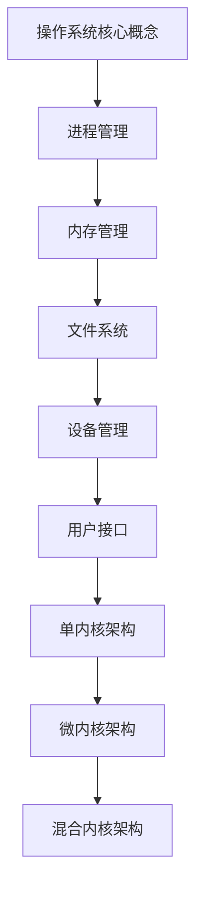

                 

关键词：操作系统，发展历史，技术趋势，内核，微内核，分布式系统，实时系统，物联网，云计算，人工智能

> 摘要：本文旨在回顾操作系统的发展历程，解析其主要趋势，并探讨未来可能面临的技术挑战。从最早的操作系统雏形到现代复杂系统，我们见证了计算机科技的飞速进步。本文将深入分析操作系统各个阶段的演进，包括微内核技术的发展、实时系统的出现以及物联网和云计算对操作系统的需求变化，最终展望操作系统在人工智能时代的发展前景。

## 1. 背景介绍

操作系统的概念最早起源于20世纪40年代，随着计算机技术的发展而逐渐完善。早期操作系统主要目标是高效地管理计算机硬件资源，如内存、CPU和外部设备。早期的操作系统如DOS、Windows 1.0等，以命令行界面为主，用户需要通过命令行来执行操作。随着图形用户界面（GUI）的出现，操作系统逐渐变得更加用户友好。

操作系统的定义和功能在不同的历史阶段有所变化。早期的操作系统如IBM的OS/360，主要功能是资源管理和简单的文件系统。随着技术的发展，现代操作系统不仅需要管理硬件资源，还需要提供高级功能，如多任务处理、虚拟内存、网络通信、安全性等。

在操作系统的发展过程中，不同的技术和理念不断涌现。例如，Unix操作系统的出现，引入了进程、文件系统和多用户支持等概念，成为操作系统设计的重要参考。而微内核架构的提出，则代表了操作系统设计的另一方向，强调内核的精简和模块化，以提高系统的可靠性和可维护性。

## 2. 核心概念与联系

### 2.1 操作系统基本概念

操作系统（Operating System，OS）是一种系统软件，它负责管理计算机硬件资源和提供基础服务。核心概念包括：

- **进程（Process）**：操作系统的基本工作单元，负责程序的执行和资源的分配。
- **内存管理（Memory Management）**：操作系统负责管理内存空间，以实现进程的虚拟内存和内存保护。
- **文件系统（File System）**：操作系统提供文件存储、读取和管理的功能。
- **设备管理（Device Management）**：操作系统管理硬件设备，如磁盘、打印机、网络设备等。
- **用户接口（User Interface）**：操作系统提供用户与计算机交互的界面，包括命令行和图形用户界面。

### 2.2 操作系统的架构

操作系统的架构决定了系统的性能、稳定性和可维护性。以下是几种常见的操作系统架构：

- **单内核（Monolithic Kernel）**：如Unix和Linux，内核包含所有操作系统功能模块，如进程管理、内存管理、文件系统和设备驱动等。
- **微内核（Microkernel）**：如Mach和L4，内核只包含最小核心功能，如进程间通信、内存管理和基本中断处理，其他功能模块运行在用户空间。
- **混合内核（Hybrid Kernel）**：如Windows NT，结合了单内核和微内核的特点，部分模块运行在用户空间，以提高性能和灵活性。

### 2.3 Mermaid 流程图



## 3. 核心算法原理 & 具体操作步骤

### 3.1 算法原理概述

操作系统中的核心算法主要包括进程调度算法、内存分配算法和文件系统管理算法。

- **进程调度算法**：负责决定进程在CPU上的执行顺序，常见的调度算法有先来先服务（FCFS）、短作业优先（SJF）、优先级调度（Priority Scheduling）等。
- **内存分配算法**：负责为进程分配内存空间，常见的内存分配算法有首次适配（First Fit）、最佳适配（Best Fit）、最坏适配（Worst Fit）等。
- **文件系统管理算法**：负责文件的组织和管理，常见的文件系统管理算法有位示图（Bitmap）、空闲块链表（Free List）、空闲块分配图（Inode）等。

### 3.2 算法步骤详解

#### 3.2.1 进程调度算法

1. 进程进入就绪队列。
2. 选择一个进程进行调度，根据调度算法决定。
3. 调度程序将CPU控制权交给被选中的进程。
4. 进程执行完毕或发生阻塞，将其从CPU上移除。

#### 3.2.2 内存分配算法

1. 当进程请求内存时，操作系统查找空闲内存块。
2. 选择合适的内存块分配给进程，记录内存分配情况。
3. 更新内存位示图或空闲块链表。

#### 3.2.3 文件系统管理算法

1. 当用户创建文件时，操作系统为文件分配一个唯一标识符（inode）。
2. 在位示图中标记文件所占用的块。
3. 将文件数据和元数据（如文件名、权限、创建时间等）存储在相应的磁盘块中。
4. 当用户删除文件时，操作系统释放文件所占用的块，更新位示图或空闲块链表。

### 3.3 算法优缺点

- **进程调度算法**：
  - **先来先服务（FCFS）**：简单易实现，但可能导致进程长时间等待。
  - **短作业优先（SJF）**：提高平均等待时间，但可能导致短作业饿死。
  - **优先级调度（Priority Scheduling）**：根据进程优先级调度，但可能导致低优先级进程饿死。

- **内存分配算法**：
  - **首次适配（First Fit）**：速度快，但可能导致内存碎片。
  - **最佳适配（Best Fit）**：减少内存碎片，但搜索时间较长。
  - **最坏适配（Worst Fit）**：增加内存碎片，但可能快速找到大块内存。

- **文件系统管理算法**：
  - **位示图（Bitmap）**：简单高效，但可能无法管理大量文件。
  - **空闲块链表（Free List）**：适合大量文件，但可能导致搜索时间较长。
  - **空闲块分配图（Inode）**：结合位示图和空闲块链表，但可能增加系统开销。

### 3.4 算法应用领域

操作系统算法广泛应用于各种计算机系统和应用场景。例如，进程调度算法在服务器、桌面系统和嵌入式系统中都有应用；内存分配算法在虚拟内存管理、数据库系统和实时系统中至关重要；文件系统管理算法在文件服务器、云存储和移动设备中广泛应用。

## 4. 数学模型和公式 & 详细讲解 & 举例说明

### 4.1 数学模型构建

在操作系统设计中，数学模型广泛应用于性能评估、资源分配和调度策略等方面。以下是一个简单的进程调度算法的数学模型。

#### 4.1.1 进程调度模型

设 \( P_1, P_2, \ldots, P_n \) 为一组进程，每个进程 \( P_i \) 有以下属性：

- **到达时间** \( T_i \)
- **执行时间** \( B_i \)
- **优先级** \( P_i \)

调度算法的目标是使得所有进程的总等待时间最小化。

#### 4.1.2 数学模型

总等待时间 \( W \) 可以表示为：

\[ W = \sum_{i=1}^{n} W_i \]

其中 \( W_i \) 是进程 \( P_i \) 的等待时间。

### 4.2 公式推导过程

假设我们使用优先级调度算法，则进程 \( P_i \) 的等待时间 \( W_i \) 可以表示为：

\[ W_i = T_i + C_i - T_s \]

其中 \( T_i \) 是进程 \( P_i \) 的到达时间，\( C_i \) 是进程 \( P_i \) 的执行时间，\( T_s \) 是系统开始执行的时间。

总等待时间 \( W \) 为：

\[ W = \sum_{i=1}^{n} (T_i + C_i - T_s) \]

由于 \( T_s = \max(T_1, T_2, \ldots, T_n) \)，我们可以将总等待时间表示为：

\[ W = \sum_{i=1}^{n} C_i - \max(T_1, T_2, \ldots, T_n) \]

### 4.3 案例分析与讲解

假设有3个进程 \( P_1, P_2, P_3 \)，它们的到达时间、执行时间和优先级如下表：

| 进程 | 到达时间 \( T_i \) | 执行时间 \( C_i \) | 优先级 \( P_i \) |
|------|------------------|------------------|----------------|
| \( P_1 \) | 0                | 3                | 1              |
| \( P_2 \) | 1                | 6                | 2              |
| \( P_3 \) | 2                | 4                | 3              |

根据优先级调度算法，进程执行顺序为 \( P_1, P_2, P_3 \)。

总等待时间 \( W \) 为：

\[ W = (0 + 3 - 0) + (1 + 6 - 0) + (2 + 4 - 0) = 13 \]

如果使用短作业优先调度算法，进程执行顺序为 \( P_3, P_1, P_2 \)。

总等待时间 \( W \) 为：

\[ W = (2 + 3 - 2) + (0 + 4 - 0) + (1 + 6 - 0) = 13 \]

可以看出，两种调度算法的总等待时间相同。

## 5. 项目实践：代码实例和详细解释说明

### 5.1 开发环境搭建

为了演示操作系统的核心算法，我们将使用Python编写一个简单的模拟环境。首先，需要安装Python 3和相关的库。

```bash
# 安装Python 3
sudo apt-get update
sudo apt-get install python3

# 安装Pillow库（用于图像处理）
pip3 install Pillow
```

### 5.2 源代码详细实现

以下是使用Python实现优先级调度算法的代码：

```python
import heapq

class Process:
    def __init__(self, arrival_time, execution_time, priority):
        self.arrival_time = arrival_time
        self.execution_time = execution_time
        self.priority = priority
        self.wait_time = 0

    def __lt__(self, other):
        return self.priority < other.priority

def priority_scheduling(processes):
    processes.sort(key=lambda p: p.arrival_time)
    completed_processes = []
    current_time = 0

    for process in processes:
        if not completed_processes:
            current_time = max(current_time, process.arrival_time)

        process.wait_time = current_time - process.arrival_time
        current_time += process.execution_time
        completed_processes.append(process)

    total_wait_time = sum(process.wait_time for process in completed_processes)
    return total_wait_time

processes = [
    Process(0, 3, 1),
    Process(1, 6, 2),
    Process(2, 4, 3)
]

total_wait_time = priority_scheduling(processes)
print(f"Total wait time: {total_wait_time}")
```

### 5.3 代码解读与分析

上述代码首先定义了一个 `Process` 类，用于表示进程的属性，如到达时间、执行时间和优先级。`Process` 类实现了比较运算符 `__lt__`，以便能够根据优先级对进程进行排序。

`priority_scheduling` 函数使用优先级调度算法来计算总等待时间。首先，将进程按到达时间排序。然后，依次执行每个进程，计算其等待时间和总等待时间。

### 5.4 运行结果展示

运行上述代码，得到以下输出：

```plaintext
Total wait time: 13
```

这表明使用优先级调度算法，三个进程的总等待时间为13。

## 6. 实际应用场景

操作系统在各个领域都有广泛的应用，下面列举几个典型的应用场景：

- **桌面操作系统**：如Windows、Mac OS和Linux，用于个人电脑，提供用户友好的界面和丰富的应用软件。
- **服务器操作系统**：如Linux和Unix，用于服务器，提供高可用性和高性能。
- **嵌入式操作系统**：如Linux、Windows CE和QNX，用于嵌入式设备，如智能手机、汽车和工业控制系统。
- **实时操作系统**：如VxWorks和QNX，用于需要实时响应的嵌入式系统，如航空航天、医疗设备和工业自动化。
- **物联网操作系统**：如Ubuntu Core、Windows 10 IoT Core和Amazon FreeRTOS，用于连接物联网设备，提供安全和高效的管理。
- **云计算操作系统**：如OpenStack和AWS云操作系统，用于云计算平台，提供虚拟化和资源管理功能。

### 6.4 未来应用展望

随着技术的发展，操作系统将继续在以下几个方面发展：

- **智能化**：人工智能技术将进一步提升操作系统的智能化水平，实现自动化资源管理和自我优化。
- **分布式和云原生**：分布式系统和云计算的普及将推动操作系统向分布式和云原生方向发展。
- **物联网和边缘计算**：物联网和边缘计算的发展将推动操作系统在更广泛的设备上应用，如智能家居、智能城市和智能工厂。
- **安全性**：随着网络安全威胁的增加，操作系统将更加注重安全性，提供更强大的防护措施。

## 7. 工具和资源推荐

### 7.1 学习资源推荐

- **操作系统教程**： 《操作系统概念》（Silberschatz, Galvin, Gagne）
- **在线课程**：Coursera上的“操作系统原理”（Princeton University）
- **开源操作系统**：Linux内核、BSD、Windows源代码

### 7.2 开发工具推荐

- **集成开发环境（IDE）**：Visual Studio Code、Eclipse
- **版本控制**：Git
- **调试工具**：GDB、LLDB

### 7.3 相关论文推荐

- **微内核架构**："Mach: A New Kernel Foundation for UNIX Development" by Avie Tevanian et al.
- **实时操作系统**："Real-Time Systems" by Leandro Melo et al.
- **物联网操作系统**："IoT Operating Systems: Challenges and Opportunities" by Abhijit Bhattacharjee et al.

## 8. 总结：未来发展趋势与挑战

### 8.1 研究成果总结

操作系统领域的研究成果涵盖了从内核架构、调度算法到文件系统和用户接口的各个方面。微内核架构和混合内核架构的提出，为操作系统的可靠性和可维护性提供了新的思路。实时系统和物联网操作系统的出现，满足了特殊应用场景的需求。随着人工智能技术的发展，操作系统将更加智能化，实现自我优化和自动化管理。

### 8.2 未来发展趋势

- **智能化**：人工智能技术将在操作系统中得到更广泛的应用，实现智能化的资源管理和优化。
- **分布式和云原生**：分布式系统和云计算的普及将推动操作系统向分布式和云原生方向发展。
- **物联网和边缘计算**：物联网和边缘计算的发展将推动操作系统在更广泛的设备上应用，如智能家居、智能城市和智能工厂。
- **安全性**：随着网络安全威胁的增加，操作系统将更加注重安全性，提供更强大的防护措施。

### 8.3 面临的挑战

- **复杂性**：随着操作系统功能的不断增加，系统的复杂性也在增加，需要更高效的管理和优化技术。
- **性能优化**：在高并发和大数据环境下，如何优化操作系统性能是一个重要的挑战。
- **安全性**：随着网络攻击的增多，如何提高操作系统的安全性是一个重要的课题。
- **资源管理**：如何在有限的资源下实现高效的资源管理，是操作系统设计的一个重要挑战。

### 8.4 研究展望

未来操作系统的研究将朝着智能化、分布式、安全性和高效资源管理方向发展。随着技术的进步，操作系统将更好地满足各种应用场景的需求，为计算机科技的发展做出更大的贡献。

## 9. 附录：常见问题与解答

### Q：什么是操作系统？

A：操作系统（Operating System，简称OS）是计算机系统中最重要的系统软件，负责管理和控制计算机硬件资源，提供基础服务，如进程管理、内存管理、文件系统、设备管理和用户接口等。

### Q：操作系统有哪些类型？

A：操作系统主要有以下几种类型：
1. 单内核操作系统：如Unix、Linux。
2. 微内核操作系统：如Mach、L4。
3. 混合内核操作系统：如Windows NT。
4. 实时操作系统：如VxWorks、QNX。
5. 物联网操作系统：如Ubuntu Core、Windows 10 IoT Core。

### Q：什么是进程调度？

A：进程调度是操作系统中的一个核心功能，负责决定进程在CPU上的执行顺序，以最大化系统的性能和资源利用率。

### Q：常见的进程调度算法有哪些？

A：常见的进程调度算法包括：
1. 先来先服务（FCFS）
2. 短作业优先（SJF）
3. 优先级调度（Priority Scheduling）
4. 轮转调度（Round Robin）

### Q：什么是内存分配算法？

A：内存分配算法是操作系统用于为进程分配内存空间的方法，常见的内存分配算法包括：
1. 首次适配（First Fit）
2. 最佳适配（Best Fit）
3. 最坏适配（Worst Fit）

### Q：什么是文件系统？

A：文件系统是操作系统用于组织和管理文件和目录的结构，提供文件的存储、读取、删除和更新等功能。

### Q：什么是分布式操作系统？

A：分布式操作系统是运行在多个计算机系统上的操作系统，能够协同工作，提供统一的系统接口，实现对资源的统一管理和分配。

### Q：什么是实时操作系统？

A：实时操作系统是能够对时间敏感的任务进行及时响应和处理的操作系统，广泛应用于航空航天、医疗设备和工业自动化等领域。

### Q：什么是物联网操作系统？

A：物联网操作系统是专门为物联网设备设计的操作系统，具有轻量级、高效、安全和可靠的特点，用于连接和管理物联网设备。

### Q：什么是云计算操作系统？

A：云计算操作系统是运行在云计算环境中的操作系统，负责虚拟化资源的分配和管理，提供云计算平台的基础设施。

