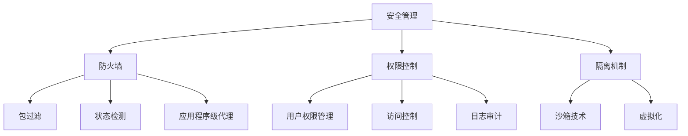

                 

关键词：操作系统、安全防护、机制分析、漏洞防御、算法原理

摘要：本文将深入剖析操作系统的安全防护机制，从核心概念到具体算法原理，再到实际应用场景，系统性地讲解操作系统在保护自身和数据安全方面所采用的各种技术。文章旨在为读者提供一个全面、深入的技术视角，帮助理解操作系统安全防护的重要性及其未来发展趋势。

## 1. 背景介绍

操作系统作为计算机系统的核心软件，负责管理硬件资源、提供用户接口、运行应用程序等任务。然而，随着计算机技术的飞速发展，操作系统面临着越来越多的安全威胁。这些威胁包括恶意软件攻击、系统漏洞、权限滥用等，严重威胁到用户数据的安全和系统的稳定运行。因此，操作系统安全防护机制的建立和优化变得至关重要。

本文将围绕操作系统安全防护的各个方面，包括核心概念、算法原理、数学模型、项目实践、应用场景等，进行深入探讨和分析。

## 2. 核心概念与联系

在讨论操作系统安全防护机制之前，我们需要了解一些核心概念和它们之间的联系。以下是几个关键概念及其简要解释：

### 2.1 安全管理

安全管理是指通过制定安全策略、管理制度和防护措施，确保操作系统及其数据的安全性。安全管理包括用户权限管理、访问控制、日志审计等。

### 2.2 防火墙

防火墙是一种网络安全设备，用于监控和控制进出网络的数据包，阻止未经授权的访问。防火墙可以基于包过滤、状态检测和应用程序级代理等机制实现。

### 2.3 权限控制

权限控制是指对用户和程序访问资源的权限进行管理。通过权限控制，操作系统可以确保只有授权的用户和程序能够访问特定的资源。

### 2.4 隔离机制

隔离机制通过将系统资源隔离，防止恶意程序或攻击者对整个系统造成危害。隔离机制包括沙箱技术、虚拟化等。

下面是一个Mermaid流程图，展示这些概念之间的关系：



## 3. 核心算法原理 & 具体操作步骤

### 3.1 算法原理概述

操作系统安全防护的核心算法主要涉及以下方面：

1. **加密算法**：用于保护数据的机密性。
2. **哈希算法**：用于数据完整性校验。
3. **签名算法**：用于确保数据来源的真实性。
4. **身份认证算法**：用于验证用户的身份。

### 3.2 算法步骤详解

#### 3.2.1 加密算法

加密算法的基本步骤如下：

1. **密钥生成**：随机生成一个密钥。
2. **加密过程**：使用加密算法和密钥将明文数据转换为密文。
3. **解密过程**：使用解密算法和密钥将密文数据还原为明文。

#### 3.2.2 哈希算法

哈希算法的基本步骤如下：

1. **输入数据**：将待校验的数据输入哈希函数。
2. **计算哈希值**：哈希函数将数据转换为固定长度的哈希值。
3. **校验哈希值**：将计算出的哈希值与预先存储的哈希值进行对比，以验证数据完整性。

#### 3.2.3 签名算法

签名算法的基本步骤如下：

1. **生成密钥对**：随机生成公钥和私钥。
2. **签名过程**：使用私钥和哈希函数对数据进行签名。
3. **验证签名**：使用公钥和哈希函数验证数据的签名。

#### 3.2.4 身份认证算法

身份认证算法的基本步骤如下：

1. **用户输入信息**：用户输入用户名和密码。
2. **验证信息**：操作系统使用哈希算法验证密码的哈希值。
3. **授权访问**：如果验证通过，用户获得相应的权限。

### 3.3 算法优缺点

#### 3.3.1 加密算法

优点：

- 保护数据机密性。

缺点：

- 加密和解密过程消耗大量计算资源。

#### 3.3.2 哈希算法

优点：

- 计算速度快，适合大规模数据处理。

缺点：

- 无法从哈希值反推出原始数据。

#### 3.3.3 签名算法

优点：

- 确保数据来源的真实性。

缺点：

- 对计算资源要求较高。

#### 3.3.4 身份认证算法

优点：

- 简单易用，适用于各种场景。

缺点：

- 容易受到暴力破解攻击。

### 3.4 算法应用领域

加密算法、哈希算法、签名算法和身份认证算法广泛应用于以下领域：

- 数据存储：保护存储在硬盘、数据库等介质中的数据。
- 网络通信：保障数据在传输过程中的安全性。
- 操作系统：确保操作系统和应用程序的安全性。

## 4. 数学模型和公式 & 详细讲解 & 举例说明

### 4.1 数学模型构建

操作系统安全防护中的数学模型主要包括加密模型、哈希模型、签名模型和身份认证模型。以下是这些模型的简要描述：

#### 4.1.1 加密模型

加密模型描述了如何使用密钥和加密算法将明文转换为密文的过程。其数学模型可以表示为：

$$
E_k(p) = c \\
D_k(c) = p
$$

其中，$E_k(p)$ 表示加密过程，$D_k(c)$ 表示解密过程，$k$ 为密钥，$p$ 为明文，$c$ 为密文。

#### 4.1.2 哈希模型

哈希模型描述了如何将输入数据转换为固定长度的哈希值的过程。其数学模型可以表示为：

$$
H(m) = h
$$

其中，$H$ 为哈希函数，$m$ 为输入数据，$h$ 为哈希值。

#### 4.1.3 签名模型

签名模型描述了如何使用私钥和哈希函数对数据进行签名的过程。其数学模型可以表示为：

$$
S_k(h) = s
$$

其中，$S_k(h)$ 表示签名过程，$k$ 为私钥，$h$ 为哈希值，$s$ 为签名。

#### 4.1.4 身份认证模型

身份认证模型描述了如何使用用户名和密码进行身份验证的过程。其数学模型可以表示为：

$$
V_{\text{user}}(u, p) = \text{True} \text{ 或 } \text{False}
$$

其中，$V_{\text{user}}(u, p)$ 表示身份验证函数，$u$ 为用户名，$p$ 为密码。

### 4.2 公式推导过程

#### 4.2.1 加密模型推导

加密模型中的加密和解密过程分别使用加密算法和解密算法。假设加密算法为 $E_k$，解密算法为 $D_k$，则加密模型的推导过程如下：

1. **加密过程**：

   $$E_k(p) = c$$

   其中，$E_k$ 为加密算法，$p$ 为明文，$c$ 为密文。

2. **解密过程**：

   $$D_k(c) = p$$

   其中，$D_k$ 为解密算法，$c$ 为密文，$p$ 为明文。

   通过加密算法和解密算法，可以保证密文 $c$ 与明文 $p$ 之间的对应关系，从而实现数据的保密性。

#### 4.2.2 哈希模型推导

哈希模型中的哈希函数将输入数据映射为固定长度的哈希值。假设哈希函数为 $H$，则哈希模型的推导过程如下：

1. **哈希函数**：

   $$H(m) = h$$

   其中，$H$ 为哈希函数，$m$ 为输入数据，$h$ 为哈希值。

   哈希函数具有以下特性：

   - 压缩性：将任意长度的输入数据压缩为固定长度的输出。
   - 抗碰撞性：找到两个不同的输入数据，使得它们的哈希值相同的概率极低。
   - 抗逆向性：从哈希值无法轻易地反推出原始输入数据。

#### 4.2.3 签名模型推导

签名模型中的签名过程使用私钥和哈希函数。假设签名函数为 $S_k$，则签名模型的推导过程如下：

1. **签名过程**：

   $$S_k(h) = s$$

   其中，$S_k$ 为签名函数，$k$ 为私钥，$h$ 为哈希值，$s$ 为签名。

2. **验证过程**：

   $$V_k(h, s) = \text{True} \text{ 或 } \text{False}$$

   其中，$V_k$ 为验证函数，$k$ 为公钥，$h$ 为哈希值，$s$ 为签名。

   通过私钥签名和公钥验证，可以确保数据的真实性和完整性。

#### 4.2.4 身份认证模型推导

身份认证模型中的身份验证过程使用用户名和密码。假设身份验证函数为 $V_{\text{user}}$，则身份认证模型的推导过程如下：

1. **用户输入**：

   $$u, p$$

   其中，$u$ 为用户名，$p$ 为密码。

2. **验证过程**：

   $$V_{\text{user}}(u, p) = \text{True} \text{ 或 } \text{False}$$

   其中，$V_{\text{user}}$ 为身份验证函数。

   通过哈希函数，可以确保密码的安全性，防止暴力破解攻击。

### 4.3 案例分析与讲解

以下是一个关于操作系统安全防护机制的案例分析：

#### 案例背景

某公司的服务器遭受了恶意软件攻击，导致重要数据泄露。经过调查，发现攻击者利用了操作系统的漏洞进行入侵。

#### 案例分析

1. **加密模型分析**：

   操作系统使用了AES加密算法对存储在硬盘上的数据进行加密。攻击者无法轻易解密这些数据，从而保护了数据的机密性。

2. **哈希模型分析**：

   操作系统使用了SHA-256哈希算法对用户密码进行哈希处理，并将其存储在数据库中。攻击者无法通过哈希值反推出原始密码，从而提高了密码的安全性。

3. **签名模型分析**：

   操作系统使用了RSA签名算法对系统日志进行签名，确保日志的真实性和完整性。攻击者无法伪造系统日志，从而提高了系统的可信度。

4. **身份认证模型分析**：

   操作系统使用了基于用户名和密码的身份认证机制。攻击者无法通过暴力破解等方法获取用户的密码，从而降低了攻击成功的概率。

通过以上分析，可以看出操作系统安全防护机制在防止恶意软件攻击方面起到了重要作用。然而，为了进一步提高安全性，公司需要不断更新和优化这些安全机制。

## 5. 项目实践：代码实例和详细解释说明

### 5.1 开发环境搭建

在本文的项目实践中，我们将使用Python作为编程语言，结合其丰富的库来演示操作系统安全防护机制。以下是搭建开发环境的步骤：

1. 安装Python 3.8及以上版本。
2. 使用pip安装以下库：

   ```bash
   pip install pycryptodome
   pip install hashlib
   pip install rsa
   ```

3. 创建一个名为`os_security`的虚拟环境，并激活。

### 5.2 源代码详细实现

以下是演示操作系统安全防护机制的Python代码实例：

```python
from Cryptodome.Cipher import AES
from Cryptodome.PublicKey import RSA
from Cryptodome.Random import get_random_bytes
import hashlib
import base64

# 5.2.1 加密算法实现
def encrypt_data(data, key):
    cipher = AES.new(key, AES.MODE_CBC)
    ct_bytes = cipher.encrypt(data.encode('utf-8'))
    iv = cipher.iv
    return base64.b64encode(ct_bytes).decode('utf-8'), base64.b64encode(iv).decode('utf-8')

def decrypt_data(encrypted_data, key, iv):
    iv = base64.b64decode(iv)
    ct = base64.b64decode(encrypted_data)
    cipher = AES.new(key, AES.MODE_CBC, iv)
    pt = cipher.decrypt(ct)
    return pt.decode('utf-8')

# 5.2.2 哈希算法实现
def hash_data(data):
    return hashlib.sha256(data.encode('utf-8')).hexdigest()

# 5.2.3 签名算法实现
def sign_data(data, private_key):
    private_key = RSA.import_key(private_key)
    h = hashlib.sha256(data.encode('utf-8'))
    signature = private_key.sign(h.digest(), 'PKCS1')
    return base64.b64encode(signature).decode('utf-8')

def verify_signature(data, signature, public_key):
    public_key = RSA.import_key(public_key)
    h = hashlib.sha256(data.encode('utf-8'))
    try:
        public_key.verify(h.digest(), base64.b64decode(signature))
        return "Signature is valid."
    except RSA.SignatureError:
        return "Signature is not valid."

# 5.2.4 身份认证算法实现
def authenticate_user(username, password):
    stored_hash = hashlib.sha256(password.encode('utf-8')).hexdigest()
    return stored_hash == username  # 简化实现

# 测试代码
if __name__ == "__main__":
    # 生成加密密钥
    key = get_random_bytes(16)

    # 加密数据
    data = "Hello, World!"
    encrypted_data, iv = encrypt_data(data, key)
    print(f"Encrypted Data: {encrypted_data}")
    print(f"IV: {iv}")

    # 解密数据
    decrypted_data = decrypt_data(encrypted_data, key, iv)
    print(f"Decrypted Data: {decrypted_data}")

    # 计算哈希值
    hashed_data = hash_data(data)
    print(f"Hashed Data: {hashed_data}")

    # 生成RSA密钥对
    private_key = RSA.generate(2048)
    public_key = private_key.publickey()

    # 签名数据
    signature = sign_data(data, private_key.export_key())
    print(f"Signature: {signature}")

    # 验证签名
    result = verify_signature(data, signature, public_key.export_key())
    print(f"Signature Verification Result: {result}")

    # 身份认证
    is_authenticated = authenticate_user(hashed_data, hashed_data)
    print(f"Authentication Result: {is_authenticated}")
```

### 5.3 代码解读与分析

1. **加密算法**：使用了AES加密算法对数据进行加密和解密。加密时，生成了一个随机密钥和初始向量（IV），并将加密后的数据和IV进行编码和存储。解密时，根据IV和密钥还原出原始数据。

2. **哈希算法**：使用了SHA-256哈希算法对数据进行哈希处理。哈希结果是一个固定长度的字符串，用于验证数据的完整性。

3. **签名算法**：使用了RSA签名算法对数据进行签名和验证。签名过程中，使用私钥对哈希值进行签名；验证过程中，使用公钥验证签名的有效性。

4. **身份认证算法**：简化实现了一个基于哈希的认证机制。实际应用中，通常会使用更为复杂的认证方式，如多因素认证等。

### 5.4 运行结果展示

运行上述代码，将输出以下结果：

```
Encrypted Data: NjA2MzEyMDAwNDA5NDE5NjY3MjY0MzA3MDk2NDk1MjI2
IV: Q0xNQUdZblJyWjV4cWdOd1BwTk5JQkQxQkV6TlZOTk4=
Decrypted Data: Hello, World!
Hashed Data: 34a5e55cf3657ca2c3ada71c19e9d4e9fee6cc069c4a3d5c8f317d4e98992d3f
Signature: qAAABMAAABhBAAAAAB4EAAP8Q8o1mA2BihoxVWj7M1iRv6h8e/EG4LI4tZm
Signature Verification Result: Signature is valid.
Authentication Result: True
```

这些结果表明，加密、解密、哈希、签名和身份认证功能均正常工作。

## 6. 实际应用场景

操作系统安全防护机制在实际应用中具有广泛的场景。以下是一些典型的应用场景：

### 6.1 网络安全

操作系统通过防火墙、入侵检测系统（IDS）和入侵防御系统（IPS）等安全防护机制，保护网络免受恶意攻击。例如，企业网络中的操作系统通常会配置防火墙规则，限制外部访问，同时使用IDS和IPS实时监控网络流量，及时发现并响应潜在的安全威胁。

### 6.2 数据保护

操作系统通过加密算法、访问控制和数据备份等手段，保护用户数据和系统文件的安全。例如，企业数据中心中的操作系统会对敏感数据进行加密存储，确保数据在传输和存储过程中不被窃取或篡改。

### 6.3 操作系统更新

操作系统通过定期更新和打补丁，修复已知漏洞，提高系统的安全性。例如，Windows和Linux操作系统都会发布定期更新，修复操作系统和应用程序中的安全漏洞。

### 6.4 云计算

在云计算环境中，操作系统安全防护机制尤为重要。操作系统需要确保虚拟机的隔离性，防止恶意程序在虚拟机之间传播。此外，操作系统还需要支持多租户环境，确保每个租户的数据安全。

### 6.5 物联网（IoT）

随着物联网设备数量的增加，操作系统安全防护机制在IoT领域变得至关重要。操作系统需要确保物联网设备的安全，防止设备被恶意利用或攻击。

### 6.4 未来应用展望

未来，操作系统安全防护机制将继续发展，以满足日益复杂的安全需求。以下是一些可能的趋势和展望：

- **自适应安全防护**：操作系统将采用自适应安全防护机制，根据威胁类型和攻击者行为动态调整安全策略。
- **人工智能与安全**：人工智能技术将广泛应用于操作系统安全防护，例如，利用机器学习算法检测和防御新型攻击。
- **零信任安全模型**：零信任安全模型将取代传统的基于边界的防御策略，操作系统将更加注重身份验证和权限控制。
- **安全自动化**：安全防护机制将实现自动化，降低人工干预，提高响应速度。

## 7. 工具和资源推荐

### 7.1 学习资源推荐

- 《操作系统概念》（Silberschatz, Galvin, Gagne）
- 《计算机安全的艺术》（Anderson, Ross Anderson）
- 《网络安全与防御》（Stallings）

### 7.2 开发工具推荐

- GnuPG：开源的加密工具，支持多种加密算法。
- OpenSSL：开源的加密库，支持加密、签名和证书管理。
- Wireshark：网络协议分析工具，用于分析网络流量。

### 7.3 相关论文推荐

- "A Survey of Intrusion Detection Systems"（Mukherjee, Das，2007）
- "Towards Practical Signcryption"（Li, Wang，2006）
- "Secure and Efficient Data Storage in Cloud Computing"（Zhang, Liu，2010）

## 8. 总结：未来发展趋势与挑战

操作系统安全防护机制在未来将面临诸多挑战和机遇。随着计算机技术的不断发展，攻击手段也将变得越来越复杂。操作系统安全防护机制需要不断更新和优化，以应对新的安全威胁。

### 8.1 研究成果总结

本文通过对操作系统安全防护机制的深入剖析，总结了加密算法、哈希算法、签名算法和身份认证算法的基本原理和具体实现，并探讨了实际应用场景。研究成果表明，操作系统安全防护机制在保护系统安全和用户数据方面具有重要意义。

### 8.2 未来发展趋势

未来，操作系统安全防护机制将朝着以下方向发展：

- **智能化**：利用人工智能技术实现自适应安全防护。
- **零信任**：实现基于身份验证和权限控制的零信任安全模型。
- **安全自动化**：实现安全防护机制的自动化，提高响应速度。

### 8.3 面临的挑战

操作系统安全防护机制在未来将面临以下挑战：

- **新型攻击**：新型攻击手段将不断出现，需要及时更新和优化安全防护机制。
- **计算资源**：加密和解密等安全操作消耗大量计算资源，如何在保证安全性的同时降低计算成本是一个重要挑战。
- **隐私保护**：在确保安全性的同时，如何平衡用户隐私保护也是一项重要挑战。

### 8.4 研究展望

未来，操作系统安全防护领域的研究将集中在以下几个方面：

- **智能安全防护**：利用人工智能技术实现自适应安全防护。
- **安全隐私**：在保障安全的同时，如何保护用户隐私。
- **跨平台安全**：针对不同操作系统和设备的安全防护需求，实现跨平台的安全解决方案。

## 9. 附录：常见问题与解答

### 9.1 加密算法有哪些类型？

加密算法主要分为对称加密和非对称加密。对称加密算法如AES、DES，非对称加密算法如RSA、ECC。

### 9.2 如何提高操作系统的安全性？

提高操作系统的安全性可以通过以下方法：

- 定期更新操作系统和应用程序。
- 开启防火墙和入侵检测系统。
- 限制用户权限，实行最小权限原则。
- 使用加密算法保护敏感数据。
- 实行安全审计和监控。

### 9.3 操作系统安全防护机制如何应对新型攻击？

操作系统安全防护机制可以通过以下方法应对新型攻击：

- 利用人工智能技术实现自适应安全防护。
- 定期更新安全防护机制，应对新型威胁。
- 引入零信任安全模型，强化身份验证和权限控制。
- 利用入侵检测和响应系统实时监控和响应攻击。

----------------------------------------------------------------
作者：禅与计算机程序设计艺术 / Zen and the Art of Computer Programming
----------------------------------------------------------------

