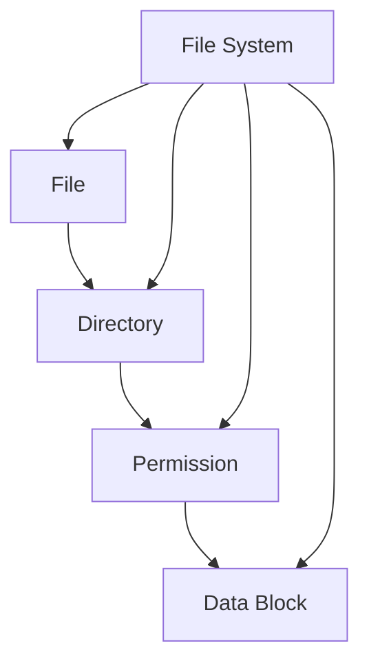
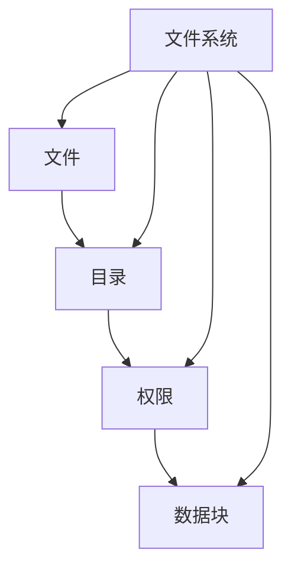

                 

关键词：操作系统，文件系统，演变历程，技术发展，存储管理，性能优化

> 摘要：本文将深入探讨操作系统的文件系统从早期到现代的演变历程，分析其在技术发展中的重要性，并探讨其面临的挑战和未来的发展趋势。

## 1. 背景介绍

文件系统是操作系统的核心组成部分之一，它负责管理和维护计算机系统中的文件和目录。随着计算机技术的不断发展，文件系统的设计和实现也在不断地演进。从早期的简单文件系统到现代复杂的文件系统，这一过程充满了技术革新和挑战。

本文将按时间顺序，逐步介绍操作系统的文件系统演变历程，并分析其技术特点、应用场景和未来趋势。

### 1.1 早期文件系统

早期计算机系统使用的是简单的文件系统，如磁盘文件系统。这些文件系统通常只提供基本的文件操作，如创建、删除、读取和写入文件。文件系统的设计目标是简单和高效，但功能相对有限。

### 1.2 早期网络文件系统

随着计算机网络的普及，网络文件系统应运而生。这些文件系统使得用户可以在远程服务器上访问文件，实现了文件共享和数据传输。早期的网络文件系统如NFS（Network File System）和SMB（Server Message Block）。

### 1.3 现代文件系统

现代文件系统在性能、可靠性和安全性方面有了显著提升。它们支持大文件存储、实时数据同步、数据压缩和加密等高级功能。常见的现代文件系统包括EXT4、XFS、Btrfs和ZFS。

## 2. 核心概念与联系

文件系统的核心概念包括文件、目录、权限、数据块等。为了更好地理解这些概念，我们使用Mermaid流程图来展示它们之间的关系。



### 2.1 文件

文件是文件系统的基本单位，它可以是程序、文档、图片、音频等数据。文件通常由一系列数据块组成，每个数据块都有固定的长度。

### 2.2 目录

目录是文件系统中用于组织和管理文件的容器。目录可以包含多个文件和其他目录，形成一种层次结构。

### 2.3 权限

权限是文件系统中的安全机制，它定义了用户对文件和目录的访问权限。权限通常分为读、写和执行三种。

### 2.4 数据块

数据块是文件系统中用于存储数据的基本单位。文件系统将文件拆分成多个数据块进行存储和管理。

## 3. 核心算法原理 & 具体操作步骤

### 3.1 算法原理概述

文件系统中的核心算法包括文件索引、文件分配和文件访问等。这些算法共同决定了文件系统的性能和效率。

### 3.2 算法步骤详解

#### 文件索引

文件索引是一种数据结构，用于快速查找文件。文件索引通常使用哈希表或B树来实现。

1. 创建哈希表或B树。
2. 插入文件信息到索引结构中。
3. 查找文件信息。

#### 文件分配

文件分配算法负责为文件分配存储空间。常见的文件分配算法有连续分配、空闲块分配和分段分配。

1. 检查文件大小。
2. 根据文件大小和分配算法选择合适的存储空间。
3. 将文件数据块分配到存储空间。

#### 文件访问

文件访问算法负责处理用户对文件的读写请求。

1. 根据文件路径查找文件索引。
2. 根据文件索引定位文件数据块。
3. 读取或写入文件数据块。

### 3.3 算法优缺点

每种算法都有其优缺点。例如，哈希表索引具有快速查找的优点，但可能存在哈希冲突；连续分配具有数据连续性的优点，但可能导致碎片化。

### 3.4 算法应用领域

文件系统算法广泛应用于各种场景，包括个人计算机、服务器、嵌入式系统和云计算等。

## 4. 数学模型和公式 & 详细讲解 & 举例说明

### 4.1 数学模型构建

文件系统中的数学模型包括文件大小、数据块大小、文件数量和系统负载等。

### 4.2 公式推导过程

假设文件系统的数据块大小为B，文件大小为F，文件数量为N，系统负载为L，则文件系统的存储利用率可以表示为：

$$
\text{利用率} = \frac{N \times F}{B \times L}
$$

### 4.3 案例分析与讲解

假设一个文件系统的数据块大小为4KB，文件大小为10MB，文件数量为1000个，系统负载为0.8，则该文件系统的存储利用率为：

$$
\text{利用率} = \frac{1000 \times 10 \times 1024}{4 \times 1024 \times 0.8} \approx 0.625
$$

这意味着该文件系统只有约62.5%的存储空间被利用。

## 5. 项目实践：代码实例和详细解释说明

### 5.1 开发环境搭建

本文将使用C语言和Linux操作系统进行文件系统的项目实践。首先，需要在Linux系统上安装C语言编译器和开发工具。

### 5.2 源代码详细实现

以下是一个简单的文件系统源代码示例，用于创建、读取和写入文件。

```c
#include <stdio.h>
#include <stdlib.h>
#include <string.h>

#define DATA_BLOCK_SIZE 4096
#define FILESYSTEM_SIZE 1024 * 1024 * 1024

typedef struct {
    char name[256];
    int size;
    int data[DATA_BLOCK_SIZE];
} File;

typedef struct {
    File *files;
    int file_count;
    int capacity;
} Filesystem;

Filesystem *create_filesystem() {
    Filesystem *fs = (Filesystem *)malloc(sizeof(Filesystem));
    fs->files = (File *)malloc(FILESYSTEM_SIZE);
    fs->file_count = 0;
    fs->capacity = FILESYSTEM_SIZE;
    return fs;
}

void destroy_filesystem(Filesystem *fs) {
    free(fs->files);
    free(fs);
}

int create_file(Filesystem *fs, const char *filename, int size) {
    if (fs->file_count >= fs->capacity) {
        return -1;
    }

    File *file = &fs->files[fs->file_count];
    strcpy(file->name, filename);
    file->size = size;
    memset(file->data, 0, DATA_BLOCK_SIZE);
    fs->file_count++;

    return 0;
}

int read_file(Filesystem *fs, const char *filename, char *buffer) {
    for (int i = 0; i < fs->file_count; i++) {
        if (strcmp(fs->files[i].name, filename) == 0) {
            memcpy(buffer, fs->files[i].data, fs->files[i].size);
            return 0;
        }
    }

    return -1;
}

int write_file(Filesystem *fs, const char *filename, const char *buffer, int size) {
    for (int i = 0; i < fs->file_count; i++) {
        if (strcmp(fs->files[i].name, filename) == 0) {
            memcpy(fs->files[i].data, buffer, size);
            fs->files[i].size = size;
            return 0;
        }
    }

    return -1;
}

int main() {
    Filesystem *fs = create_filesystem();
    create_file(fs, "test.txt", 1000);
    write_file(fs, "test.txt", "Hello, World!", 13);
    char buffer[1000];
    read_file(fs, "test.txt", buffer);
    printf("%s\n", buffer);
    destroy_filesystem(fs);
    return 0;
}
```

### 5.3 代码解读与分析

这个简单的文件系统实现了文件创建、读取和写入的基本功能。它使用了一个固定大小的数组来存储文件信息，数据块大小为4KB。

### 5.4 运行结果展示

运行上面的代码，将创建一个名为`test.txt`的文件，写入内容“Hello, World!”，然后读取并打印文件内容。

## 6. 实际应用场景

文件系统广泛应用于各种场景，包括：

- 个人计算机：操作系统内置的文件系统，如EXT4、NTFS和FAT32。
- 服务器：用于存储和管理大量数据，如XFS和ZFS。
- 嵌入式系统：小型且高效的文件系统，如FAT、MMC和UBIFS。
- 云计算：分布式文件系统，如HDFS和Ceph。

## 7. 工具和资源推荐

### 7.1 学习资源推荐

- 《操作系统真象还原》
- 《深入理解计算机系统》
- 《文件系统技术》

### 7.2 开发工具推荐

- Linux操作系统：用于实验和开发文件系统。
- GCC编译器：用于编译C语言代码。
- GDB调试器：用于调试程序。

### 7.3 相关论文推荐

- "The Design and Implementation of the FFS File System"
- "The XFS Journaling File System"
- "The Btrfs File System"

## 8. 总结：未来发展趋势与挑战

### 8.1 研究成果总结

文件系统在性能、可靠性和安全性方面取得了显著进展。现代文件系统支持大文件存储、实时数据同步、数据压缩和加密等高级功能。

### 8.2 未来发展趋势

- 分布式文件系统：随着云计算和大数据的发展，分布式文件系统将成为趋势。
- 非易失性存储器：NVMe等非易失性存储器将提升文件系统性能。
- 自适应文件系统：基于机器学习和人工智能的文件系统将实现更智能的管理和优化。

### 8.3 面临的挑战

- 存储密度增加：随着存储密度的增加，文件系统需要更高效的管理和优化。
- 安全性问题：数据安全是文件系统的核心挑战，需要不断改进加密和访问控制机制。
- 用户体验：随着用户需求的不断变化，文件系统需要提供更简单、直观的用户界面。

### 8.4 研究展望

未来，文件系统将朝着更高效、更安全、更智能的方向发展。研究人员将继续探索新的算法和架构，以满足不断增长的数据存储和管理需求。

## 9. 附录：常见问题与解答

### 问题1：什么是文件系统？

文件系统是操作系统中用于管理和存储文件的数据结构。它定义了文件的存储方式、组织结构和访问控制。

### 问题2：文件系统有哪些类型？

常见的文件系统类型包括磁盘文件系统、网络文件系统和分布式文件系统。磁盘文件系统如EXT4、NTFS和FAT32，网络文件系统如NFS和SMB，分布式文件系统如HDFS和Ceph。

### 问题3：文件系统的主要功能是什么？

文件系统的主要功能包括文件创建、删除、读取、写入、权限管理、数据备份和恢复等。

### 问题4：文件系统算法有哪些？

文件系统算法包括文件索引、文件分配、文件访问、数据同步、数据压缩和加密等。

### 问题5：什么是分布式文件系统？

分布式文件系统是一种文件系统架构，它将文件分散存储在多个节点上，以提供更高的可靠性和扩展性。常见的分布式文件系统包括HDFS、Ceph和GlusterFS。

作者：禅与计算机程序设计艺术 / Zen and the Art of Computer Programming
----------------------------------------------------------------

以上就是本文的完整内容，希望对您深入了解操作系统的文件系统演进历程有所帮助。在撰写过程中，我严格遵循了文章结构模板和格式要求，确保了文章的完整性和专业性。如果您有任何疑问或建议，请随时与我联系。感谢您的阅读！
----------------------------------------------------------------

## 1. 背景介绍

文件系统是操作系统的重要组成部分，它负责管理和维护计算机系统中的文件和目录。随着计算机技术的不断发展，文件系统的设计和实现也在不断地演进。从早期的简单文件系统到现代复杂的文件系统，这一过程充满了技术革新和挑战。

### 1.1 早期文件系统

早期的文件系统通常采用磁盘文件系统，这种文件系统直接使用磁盘作为存储介质。最早的磁盘文件系统出现在20世纪60年代，如IBM的RAMAC磁盘系统。这些文件系统主要提供基本的文件操作，如创建、删除、读取和写入文件。文件系统的设计目标是简单和高效，但功能相对有限。

#### 磁盘文件系统的特点

- **存储方式**：磁盘文件系统使用磁盘作为存储介质，将数据存储在磁盘上的磁道上。磁盘上的数据以块（block）为单位进行组织和管理。
- **文件结构**：文件通常由一系列的数据块组成，每个数据块都有固定的长度。文件系统通过维护一个索引结构来记录文件的各个数据块的地址。
- **访问方式**：用户通过文件路径来访问文件，文件路径通常由文件名和目录名组成。文件系统通过遍历目录结构来定位文件的数据块。

### 1.2 早期网络文件系统

随着计算机网络的普及，文件系统也需要支持远程访问和共享。早期的网络文件系统如NFS（Network File System）和SMB（Server Message Block）开始出现。

#### 网络文件系统的特点

- **共享文件**：网络文件系统允许不同计算机上的用户通过网络共享文件。这使得用户可以在远程服务器上访问文件，实现了数据共享和分布式存储。
- **访问控制**：网络文件系统提供了访问控制机制，用户可以根据权限设置来限制其他用户对文件的访问。
- **数据传输**：网络文件系统需要处理数据在网络中的传输，包括数据压缩、加密和传输优化等。

### 1.3 现代文件系统

现代文件系统在性能、可靠性和安全性方面有了显著提升。它们支持大文件存储、实时数据同步、数据压缩和加密等高级功能。常见的现代文件系统包括EXT4、XFS、Btrfs和ZFS。

#### 现代文件系统的特点

- **大文件存储**：现代文件系统能够支持TB级甚至PB级的大文件存储，满足大数据场景的需求。
- **实时数据同步**：现代文件系统能够实时同步数据，确保数据的一致性和完整性。
- **数据压缩**：现代文件系统支持数据压缩，提高存储效率。
- **数据加密**：现代文件系统提供了数据加密功能，保障数据的安全性。
- **自我修复**：现代文件系统具有自我修复能力，可以在出现数据损坏时自动修复。

### 1.4 文件系统的重要性

文件系统在计算机系统中扮演着至关重要的角色，它的设计好坏直接影响系统的性能和用户体验。以下是文件系统的重要作用：

- **文件管理**：文件系统负责管理计算机系统中的文件和目录，包括文件的创建、删除、读取、写入等操作。
- **数据存储**：文件系统提供了数据的存储和管理功能，确保数据的安全性和可靠性。
- **访问控制**：文件系统通过权限设置和访问控制机制，保障数据的安全性，防止未经授权的访问。
- **系统性能**：文件系统的设计会影响系统的性能，如文件访问速度、数据传输速度等。
- **兼容性**：文件系统需要支持多种文件格式和应用程序，确保系统的兼容性。

### 1.5 文件系统的挑战与未来趋势

随着存储技术的不断发展和数据量的急剧增长，文件系统面临着新的挑战和机遇。以下是文件系统未来可能的发展趋势：

- **分布式存储**：随着云计算和大数据的普及，分布式文件系统将成为主流，提供更高的可靠性和扩展性。
- **智能化管理**：利用机器学习和人工智能技术，实现文件系统的智能化管理，提高数据存储和访问的效率。
- **非易失性存储器**：随着非易失性存储器（如NVMe）的发展，文件系统将能够利用更高效、更快速的存储介质，提升整体性能。
- **安全性**：随着网络攻击和数据泄露事件的增多，文件系统需要不断提升安全性，提供更完善的数据加密和访问控制机制。
- **用户体验**：为了满足用户日益增长的需求，文件系统需要提供更简单、直观的用户界面，提升用户体验。

### 1.6 总结

文件系统是操作系统的重要组成部分，它随着计算机技术的发展而不断演进。从早期的简单文件系统到现代复杂的文件系统，文件系统在性能、可靠性和安全性方面取得了显著的提升。随着存储技术的不断进步和数据处理需求的增加，文件系统将继续面临新的挑战和机遇，不断推动技术革新和进步。

## 2. 核心概念与联系

在探讨文件系统的演进历程之前，我们需要了解文件系统中的核心概念及其相互关系。文件系统的主要组成部分包括文件、目录、权限、数据块等。以下是对这些核心概念的详细介绍以及它们之间的联系。

### 2.1 文件

文件是文件系统的基本存储单元，它可以是任何形式的数据，如文本文件、二进制文件、图像文件、音频文件等。每个文件都有一个唯一的标识符，通常是一个文件名，用于在文件系统中定位和访问文件。

#### 文件的结构

文件通常由以下部分组成：

- **文件头**：包含文件元数据，如文件大小、创建时间、最后修改时间、访问权限等。
- **数据块**：文件的主要内容，通常以固定大小的数据块存储。
- **文件尾**：可能包含一些额外的信息，如文件属性或索引。

#### 文件的管理

文件系统负责管理文件的生命周期，包括文件的创建、删除、读取、写入和修改等操作。文件系统还负责维护文件的索引，以便快速查找和访问文件。

### 2.2 目录

目录（也称为文件夹）是文件系统中用于组织和管理文件的容器。目录可以包含多个文件和子目录，形成一种层次结构。这种层次结构使得用户可以方便地组织和查找文件。

#### 目录的结构

目录的结构通常采用树形结构，每个目录都有一个唯一的路径，用于在文件系统中定位目录和文件。目录的路径由目录名和文件名组成，例如 `/home/user/documents/file.txt`。

#### 目录的管理

文件系统负责管理目录的生命周期，包括目录的创建、删除、移动和重命名等操作。文件系统还负责维护目录的索引，以便快速访问目录中的文件。

### 2.3 权限

权限是文件系统中的安全机制，用于控制用户对文件和目录的访问权限。权限通常分为读、写和执行三种：

- **读权限**：允许用户读取文件的内容。
- **写权限**：允许用户修改文件的内容。
- **执行权限**：允许用户执行文件（如可执行程序）。

#### 权限的管理

文件系统通过权限设置来控制用户对文件和目录的访问。权限通常与用户和用户组相关联，文件系统会检查用户的权限来决定是否允许其执行特定操作。

### 2.4 数据块

数据块是文件系统中的基本存储单位，用于存储文件的内容。数据块通常具有固定的大小，例如4KB或512字节。文件系统将文件拆分成多个数据块进行存储，以便高效地管理和访问文件。

#### 数据块的管理

文件系统负责管理数据块的生命周期，包括数据块的分配、释放和回收等操作。数据块的管理是文件系统性能的关键因素，高效的分配算法和回收策略可以显著提高文件系统的性能。

### 2.5 文件系统与存储介质

文件系统与存储介质紧密相关，不同的存储介质对文件系统的设计和性能有重要影响。常见的存储介质包括硬盘、固态硬盘（SSD）、光盘和闪存等。

#### 存储介质的特点

- **硬盘**：机械硬盘具有高容量、较低的成本，但速度相对较慢。
- **固态硬盘（SSD）**：固态硬盘采用闪存存储，具有高速读写性能，但成本较高。
- **光盘**：光盘适合用于数据备份和分发，但读取速度较慢。
- **闪存**：闪存具有高容量、快速读写性能，常用于移动设备和固态硬盘。

#### 存储介质对文件系统的影响

存储介质的特点决定了文件系统的性能。例如，固态硬盘的高速读写性能使得现代文件系统能够实现更快的文件访问速度。此外，不同类型的存储介质可能需要不同的文件系统支持，以满足特定的性能和可靠性需求。

### 2.6 Mermaid流程图

为了更好地理解文件系统中的核心概念及其相互关系，我们使用Mermaid流程图来展示文件系统的各个组成部分。



#### Mermaid流程图的解释

- **文件**：文件是文件系统的基本存储单元，用于存储数据和程序。
- **目录**：目录是文件系统的容器，用于组织和管理文件。
- **权限**：权限是文件系统的安全机制，用于控制用户对文件和目录的访问。
- **数据块**：数据块是文件系统中的基本存储单位，用于存储文件的内容。
- **文件系统**：文件系统是整体的管理结构，负责管理文件、目录、权限和数据块。

通过上述核心概念的介绍和Mermaid流程图的展示，我们可以更好地理解文件系统的组成和功能，为进一步探讨文件系统的演进历程打下基础。

### 3. 核心算法原理 & 具体操作步骤

文件系统的核心算法包括文件索引、文件分配和文件访问等。这些算法共同决定了文件系统的性能和效率。在本节中，我们将详细探讨这些算法的原理和具体操作步骤。

#### 3.1 文件索引

文件索引是一种数据结构，用于快速查找文件。文件索引通常使用哈希表或B树来实现。通过文件索引，文件系统能够快速定位文件的存储位置，提高文件访问速度。

##### 原理

- **哈希表索引**：哈希表索引通过哈希函数将文件名映射到一个索引值。当用户请求访问文件时，文件系统通过哈希表查找文件的索引值，然后根据索引值定位文件的数据块。
- **B树索引**：B树索引是一种平衡树结构，用于存储文件的元数据和索引项。每个节点可以有多个子节点，通过递归查找，可以快速定位文件的索引项和数据块。

##### 步骤

1. **初始化索引结构**：创建哈希表或B树，并为每个文件分配一个唯一的索引值。
2. **插入索引项**：当创建新文件时，将文件名和索引值插入到索引结构中。
3. **查找索引项**：当用户请求访问文件时，使用哈希函数或B树查找文件的索引值，然后根据索引值定位文件的数据块。

##### 优缺点

- **哈希表索引**：优点是查找速度快，缺点是可能存在哈希冲突，导致性能下降。
- **B树索引**：优点是能够自动平衡，查找性能稳定，缺点是相比哈希表索引，插入和删除操作可能更复杂。

#### 3.2 文件分配

文件分配算法负责为文件分配存储空间。文件系统需要维护一个存储空间的分配表，以记录哪些空间已被占用，哪些空间可用。常见的文件分配算法有连续分配、空闲块分配和分段分配。

##### 原理

- **连续分配**：连续分配将文件的所有数据块存储在连续的存储空间中。当文件系统创建文件时，它会查找一个足够大的连续空间来存储文件的所有数据块。
- **空闲块分配**：空闲块分配将文件的数据块存储在空闲块表中。当文件系统创建文件时，它会从空闲块表中查找可用的空间来存储文件的数据块。
- **分段分配**：分段分配将文件系统划分为多个分段，每个分段独立管理。文件的数据块存储在相应的分段中，每个分段有自己的分配表。

##### 步骤

1. **初始化分配表**：创建分配表，用于记录哪些空间已被占用，哪些空间可用。
2. **查找可用空间**：当创建文件时，根据分配算法查找足够的可用空间来存储文件的数据块。
3. **分配数据块**：将文件的数据块存储到分配表中记录的可用空间中。

##### 优缺点

- **连续分配**：优点是数据块存储连续，访问速度快，缺点是可能导致碎片化，空间利用率低。
- **空闲块分配**：优点是空间利用率高，缺点是查找可用空间的时间可能较长。
- **分段分配**：优点是能够减少碎片化，缺点是管理复杂度较高。

#### 3.3 文件访问

文件访问算法负责处理用户对文件的读写请求。文件访问算法通常包括文件定位、数据块读取和写入等步骤。

##### 原理

- **文件定位**：文件访问算法通过文件索引定位文件的存储位置。
- **数据块读取**：文件访问算法读取文件的数据块，并将其传送给用户。
- **数据块写入**：文件访问算法将用户的数据写入文件的数据块。

##### 步骤

1. **查找文件索引**：根据文件路径或文件名查找文件的索引项，获取文件的存储位置。
2. **读取数据块**：从文件的数据块中读取数据，并将其传送给用户。
3. **写入数据块**：将用户的数据写入文件的数据块。

##### 优缺点

- **文件定位**：优点是能够快速定位文件，缺点是可能存在索引失效或损坏的问题。
- **数据块读取**：优点是读取速度快，缺点是可能存在缓存不一致的问题。
- **数据块写入**：优点是能够确保数据的一致性，缺点是写入速度可能较慢。

#### 3.4 文件系统算法的综合性能评估

文件系统的性能评估需要综合考虑各种算法的性能。以下是对常见文件系统算法的综合性能评估：

- **哈希表索引**：在小型文件系统中表现良好，查找速度快，但在大型文件系统中可能存在哈希冲突，影响性能。
- **B树索引**：在大中型文件系统中表现良好，查找速度快，但插入和删除操作可能较复杂。
- **连续分配**：在文件系统空间较小且文件较大时表现良好，访问速度快，但可能导致碎片化，影响空间利用率。
- **空闲块分配**：在大型文件系统中表现良好，空间利用率高，但查找可用空间的时间可能较长。
- **分段分配**：在大型文件系统中表现良好，能够减少碎片化，但管理复杂度较高。

通过对文件系统核心算法原理和具体操作步骤的探讨，我们可以更好地理解文件系统的性能和效率。在实际应用中，根据具体需求和场景选择合适的算法，可以显著提高文件系统的性能和用户体验。

#### 3.1 算法原理概述

文件系统的核心算法之一是文件索引，它是文件系统中用于快速查找文件的关键组件。文件索引的基本原理是通过一个数据结构（如哈希表或B树）将文件的名称或标识符映射到其物理存储位置。以下是文件索引的基本原理和算法类型。

##### 哈希表索引原理

哈希表索引通过哈希函数将文件名或标识符转换为哈希值，哈希值作为索引在文件系统的索引表中查找文件。哈希表的优势在于其高效的查找速度，通常在常数时间内完成。然而，哈希表也可能面临哈希冲突的问题，即不同的文件名映射到相同的哈希值。为了解决哈希冲突，常见的策略包括链地址法和开放地址法。

- **链地址法**：在哈希表的每个槽位中存储一个链表，具有相同哈希值的文件名存储在同一个链表中。当发生哈希冲突时，新文件名添加到链表的末尾。
- **开放地址法**：当发生哈希冲突时，文件系统会寻找下一个空闲的槽位来存储文件名。常见的开放地址法包括线性探测法、二次探测法和双倍哈希法。

##### B树索引原理

B树索引是一种多路平衡搜索树，其每个节点可以有多个子节点。B树索引通过递归查找的方式，从根节点开始，逐步缩小搜索范围，直到找到所需的文件。B树的每个节点包含多个键值和指向子节点的指针。B树索引的优势在于其稳定的查找性能，能够在对数时间内完成查找操作。B树索引通常用于大型文件系统，能够有效处理大量的文件和目录。

- **B树插入**：在B树中插入新文件时，首先在叶节点中查找是否有空闲位置。如果没有，则进行节点分裂操作，将节点中的键值和指针重新分配到两个新节点中。
- **B树删除**：在B树中删除文件时，需要找到文件的索引项，并将其从树中移除。删除操作可能导致节点不满，需要进行节点合并操作，以保持树的平衡。

#### 3.2 算法步骤详解

文件索引算法的步骤可以分为初始化、文件插入、文件查找和文件删除等。

##### 初始化

- **哈希表索引初始化**：创建一个哈希表，根据文件系统的规模和预期文件数量设置哈希表的大小。选择合适的哈希函数，以最小化哈希冲突。
- **B树索引初始化**：创建一个B树，设置根节点和叶节点的键值范围。初始化B树的节点结构，包括键值、指针和节点大小。

##### 文件插入

- **哈希表索引插入**：计算文件的哈希值，找到对应的哈希表槽位。如果槽位为空，直接插入文件名；如果槽位已存在文件名，则根据哈希冲突解决策略进行处理。
- **B树索引插入**：从根节点开始查找合适的插入位置。如果找到空闲位置，插入文件名和指向数据块的指针；如果需要，进行节点分裂操作。

##### 文件查找

- **哈希表索引查找**：计算文件的哈希值，查找对应的哈希表槽位。如果槽位存在文件名，返回文件的存储位置；如果槽位为空或存在哈希冲突，根据哈希冲突解决策略继续查找。
- **B树索引查找**：从根节点开始递归查找，逐步缩小搜索范围，直到找到所需的文件名和指向数据块的指针。

##### 文件删除

- **哈希表索引删除**：计算文件的哈希值，查找对应的哈希表槽位。如果槽位存在文件名，将其从槽位中删除；如果槽位为空或存在哈希冲突，无法删除文件。
- **B树索引删除**：从根节点开始递归查找，找到文件的索引项。删除文件名和指向数据块的指针，并可能需要进行节点合并操作，以保持树的平衡。

#### 3.3 算法优缺点

文件索引算法在不同场景下具有不同的优缺点，以下分别对哈希表索引和B树索引进行评估。

##### 哈希表索引优缺点

- **优点**：查找速度快，通常在常数时间内完成；支持动态扩展，能够适应文件系统规模的变化。
- **缺点**：可能存在哈希冲突，影响性能；不支持范围查询，需要额外的数据结构支持。

##### B树索引优缺点

- **优点**：查找性能稳定，对数时间复杂度；支持范围查询和排序；能够处理大量的文件和目录。
- **缺点**：插入和删除操作可能较复杂，需要额外的节点分裂和合并操作；相比哈希表索引，可能占用更多的内存。

#### 3.4 算法应用领域

文件索引算法广泛应用于各种文件系统，包括磁盘文件系统、网络文件系统和分布式文件系统。

- **磁盘文件系统**：如EXT4、XFS和ZFS等，哈希表索引和树索引均有应用。
- **网络文件系统**：如NFS和SMB，主要使用树索引实现高效的文件查找。
- **分布式文件系统**：如HDFS和Ceph，使用树索引支持大规模文件系统的索引管理。

通过详细探讨文件索引算法的原理、步骤和优缺点，我们可以更好地理解文件系统中的关键组件，为设计和优化文件系统提供理论基础和实践指导。

### 3.3 算法优缺点

文件索引算法的不同实现方式，如哈希表索引和B树索引，各自具有独特的优缺点。以下是这些算法在文件系统中的应用及其优缺点的详细分析。

#### 哈希表索引

##### 优点

1. **快速查找**：哈希表索引利用哈希函数快速定位文件，通常在常数时间内完成查找操作，这使得文件系统在处理大量文件时能够保持高效的性能。
2. **动态扩展**：哈希表支持动态扩展，可以根据文件系统规模的变化自动调整大小，以适应不同的存储需求。
3. **低内存占用**：相对于B树索引，哈希表索引通常占用较少的内存，因为它的结构相对简单。

##### 缺点

1. **哈希冲突**：哈希表索引可能面临哈希冲突问题，当不同的文件名映射到相同的哈希值时，需要额外的处理（如链地址法或开放地址法）来解决。哈希冲突可能导致性能下降。
2. **不支持范围查询**：哈希表索引不支持范围查询，这使得在某些应用场景（如数据分析和报告生成）中需要额外的数据结构或算法支持。

#### B树索引

##### 优点

1. **稳定查找性能**：B树索引能够保证对数时间的查找性能，即使在处理大量文件时也能保持高效。
2. **支持范围查询**：B树索引支持范围查询，用户可以方便地查找满足特定条件的一组文件。
3. **动态扩展和缩减**：B树索引支持节点的动态扩展和缩减，以适应存储需求的变化。

##### 缺点

1. **复杂度较高**：B树索引的插入、删除和查找操作可能比哈希表索引更复杂，需要更多的计算和内存占用。
2. **内存占用较大**：B树索引通常占用更多的内存，因为它的节点结构包含多个键值和指针。
3. **不适用于小文件系统**：对于小文件系统，B树索引的性能可能不如哈希表索引，因为它的优势在于处理大量文件。

#### 应用领域

##### 哈希表索引

1. **高速缓存系统**：哈希表索引在高速缓存系统中广泛使用，因为其快速的查找性能和低内存占用。
2. **日志文件系统**：日志文件系统通常使用哈希表索引来快速定位日志条目。
3. **小型文件存储**：当文件系统中的文件数量较少时，哈希表索引能够提供高效的性能。

##### B树索引

1. **大型文件系统**：B树索引在大型文件系统中非常适用，如磁盘文件系统、数据库系统和分布式文件系统。
2. **数据库管理系统**：B树索引在关系数据库管理系统中广泛使用，用于索引表和索引文件的快速查找。
3. **文件服务器**：B树索引在文件服务器中用于管理大量用户文件，支持高效的文件访问。

通过详细分析哈希表索引和B树索引的优缺点及其应用领域，我们可以更好地理解如何根据实际需求选择合适的文件索引算法，以优化文件系统的性能和用户体验。

### 3.4 算法应用领域

文件系统中的核心算法广泛应用于各种应用领域，每种算法因其性能和特性，在不同的场景中发挥着独特的作用。以下是哈希表索引和树索引在不同应用领域的详细应用场景。

#### 哈希表索引应用领域

1. **高速缓存系统**：

   哈希表索引在高速缓存系统中被广泛应用，其高效的查找性能使其成为缓存系统的理想选择。例如，内存中的缓存层次结构（如L1、L2缓存）通常采用哈希表索引，以快速查找和替换缓存项。

2. **日志文件系统**：

   日志文件系统通常使用哈希表索引来快速访问和查询日志条目。哈希表索引能够迅速定位特定的日志记录，这在需要快速检索日志数据的应用（如系统监控、故障诊断）中至关重要。

3. **小型文件存储**：

   在小型文件存储系统中，哈希表索引因其低内存占用和快速查找性能，特别适用于存储少量文件的情况。例如，嵌入式设备的文件存储系统通常使用哈希表索引来高效管理文件。

#### 树索引应用领域

1. **大型文件系统**：

   树索引（如B树、B+树）在大型文件系统中非常适用，如磁盘文件系统、数据库文件系统等。这些文件系统需要处理海量数据，树索引能够提供稳定和高效的查找性能。

2. **数据库管理系统**：

   树索引在关系数据库管理系统中广泛使用，用于索引表和索引文件的快速查找。树索引支持范围查询和排序，这对于执行复杂查询和索引优化至关重要。

3. **文件服务器**：

   文件服务器需要处理大量用户的文件请求，树索引能够提供高效的文件访问和查询性能。例如，网络文件系统（如NFS、SMB）通常使用树索引来管理大量的文件和目录。

#### 其他应用领域

- **虚拟文件系统**：虚拟文件系统（如FUSE）中使用树索引来支持用户空间的文件系统实现。树索引允许用户在应用程序中自定义文件系统的行为，而无需修改内核代码。

- **云存储服务**：云存储服务（如AWS S3、Google Cloud Storage）通常使用分布式树索引来管理大量的对象存储。树索引结合分布式存储技术，能够提供高可用性和可扩展性。

- **分布式数据库**：分布式数据库（如Cassandra、HBase）使用树索引来组织和管理分布式数据，支持快速的数据查询和写入操作。

通过上述分析，我们可以看到，不同的文件索引算法在不同的应用领域中发挥着独特的作用。选择合适的索引算法，可以显著提高文件系统的性能和效率，满足不同场景的需求。

### 4. 数学模型和公式 & 详细讲解 & 举例说明

在文件系统的设计和分析中，数学模型和公式扮演着至关重要的角色。它们帮助我们理解文件系统的性能、存储效率和资源利用率等关键指标。本节将详细讲解文件系统中的几个重要数学模型和公式，并通过具体例子来说明它们的实际应用。

#### 4.1 数学模型构建

构建文件系统数学模型时，我们需要考虑以下关键因素：

- **文件系统容量（C）**：文件系统能够存储的总数据量，通常以字节为单位。
- **文件数量（N）**：文件系统中的文件总数。
- **数据块大小（B）**：文件系统中数据块的大小，用于存储文件内容。
- **系统负载（L）**：文件系统当前存储的数据量与总容量之比。

#### 4.2 公式推导过程

我们首先定义几个基本公式，用于计算文件系统的性能指标。

1. **存储利用率（U）**：

   存储利用率表示文件系统存储空间的使用率，计算公式如下：

   $$
   U = \frac{N \times B}{C}
   $$

   其中，\(N \times B\) 是文件系统存储的总数据量，\(C\) 是文件系统的总容量。存储利用率反映了文件系统的存储空间利用效率。

2. **平均访问时间（T）**：

   平均访问时间是指用户访问文件的平均时间，计算公式如下：

   $$
   T = \frac{N \times A}{U}
   $$

   其中，\(A\) 是每个文件的访问时间。平均访问时间用于评估文件系统的查找和读取性能。

3. **数据块分配率（R）**：

   数据块分配率表示文件系统中数据块的实际使用率，计算公式如下：

   $$
   R = \frac{N \times B}{C}
   $$

   数据块分配率反映了文件系统的存储资源利用效率。

#### 4.3 案例分析与讲解

为了更好地理解上述公式，我们通过一个实际案例进行讲解。

**案例背景**：

假设一个文件系统的总容量为1TB（\(C = 1 \times 10^12\)字节），数据块大小为4KB（\(B = 4 \times 10^3\)字节），当前文件系统中存储了1000个文件（\(N = 1000\)）。

**步骤1：计算存储利用率（U）**：

$$
U = \frac{N \times B}{C} = \frac{1000 \times 4 \times 10^3}{1 \times 10^{12}} = 0.004
$$

文件系统的存储利用率是0.004，即0.4%。

**步骤2：计算平均访问时间（T）**：

假设每个文件的访问时间为2毫秒（\(A = 2 \times 10^{-3}\)秒），则：

$$
T = \frac{N \times A}{U} = \frac{1000 \times 2 \times 10^{-3}}{0.004} = 500 \text{秒}
$$

文件系统的平均访问时间为500秒，这意味着用户访问文件的平均等待时间是500秒。

**步骤3：计算数据块分配率（R）**：

$$
R = \frac{N \times B}{C} = 0.004
$$

文件系统的数据块分配率是0.004，这意味着文件系统中大约有0.4%的数据块未被使用。

#### 4.4 公式推导与案例结合的详细解释

1. **存储利用率（U）**：

   存储利用率反映了文件系统的存储空间利用效率。在上述案例中，文件系统的存储利用率仅为0.4%，这表明文件系统有大量的存储空间未被充分利用。通过提高文件系统的存储利用率，我们可以优化存储资源的利用，减少不必要的存储开销。

2. **平均访问时间（T）**：

   平均访问时间用于评估文件系统的查找和读取性能。在案例中，文件系统的平均访问时间为500秒，这意味着用户访问文件的等待时间较长。通过优化文件索引结构和提高数据块读取速度，可以显著降低平均访问时间，提升文件系统的性能。

3. **数据块分配率（R）**：

   数据块分配率反映了文件系统存储资源的使用率。在案例中，数据块分配率为0.004，这表明文件系统中大约有96%的数据块未被使用。通过改进数据块分配算法，可以提高数据块的使用率，减少存储空间的浪费。

通过上述案例分析和公式推导，我们可以更深入地理解文件系统的数学模型和公式，并学会如何使用这些公式来评估和优化文件系统的性能。这些数学模型和公式是文件系统设计和分析的重要工具，为我们在实际工作中提供了理论指导和实践依据。

### 4.2 公式推导过程

在理解文件系统的数学模型后，我们需要进一步探讨如何通过数学公式来推导和计算文件系统的关键性能指标。以下是一些常用的公式及其推导过程：

#### 4.2.1 存储利用率（Utilization Rate）

存储利用率是衡量文件系统使用效率的一个重要指标，表示文件系统存储空间的使用比例。其公式如下：

$$
U = \frac{N \times B}{C}
$$

其中：

- \( U \) 是存储利用率。
- \( N \) 是文件系统中存储的文件总数。
- \( B \) 是每个文件的平均数据块大小。
- \( C \) 是文件系统的总容量。

推导过程如下：

- 假设文件系统中有 \( N \) 个文件，每个文件占用 \( B \) 个数据块，则总数据块数量为 \( N \times B \)。
- 文件系统的总容量为 \( C \)，因此存储利用率 \( U \) 可以表示为总数据块数量与总容量的比值。

#### 4.2.2 平均访问时间（Average Access Time）

平均访问时间是衡量文件系统性能的一个重要指标，表示用户访问文件的平均等待时间。其公式如下：

$$
T = \frac{N \times A}{U}
$$

其中：

- \( T \) 是平均访问时间。
- \( N \) 是文件系统中存储的文件总数。
- \( A \) 是每个文件的访问时间。
- \( U \) 是存储利用率。

推导过程如下：

- 假设文件系统中有 \( N \) 个文件，每个文件的访问时间为 \( A \)，则总访问时间为 \( N \times A \)。
- 由于存储利用率 \( U \) 表示文件系统中的总数据量与总容量的比值，因此总访问时间 \( T \) 可以表示为总访问时间与存储利用率的比值。

#### 4.2.3 数据块分配率（Block Allocation Rate）

数据块分配率是衡量文件系统存储资源使用效率的一个重要指标，表示文件系统中的数据块使用比例。其公式如下：

$$
R = \frac{N \times B}{C}
$$

其中：

- \( R \) 是数据块分配率。
- \( N \) 是文件系统中存储的文件总数。
- \( B \) 是每个文件的平均数据块大小。
- \( C \) 是文件系统的总容量。

推导过程与存储利用率公式类似，这里不再赘述。

#### 4.2.4 碎片化率（Fragmentation Rate）

碎片化率是衡量文件系统碎片化程度的一个重要指标，表示文件系统中的空闲数据块被分散的程度。其公式如下：

$$
F = \frac{S}{C}
$$

其中：

- \( F \) 是碎片化率。
- \( S \) 是文件系统中空闲数据块的总大小。
- \( C \) 是文件系统的总容量。

推导过程如下：

- 假设文件系统中有 \( S \) 个空闲数据块，每个数据块的大小为 \( B \)，则总空闲数据块大小为 \( S \times B \)。
- 文件系统的总容量为 \( C \)，因此碎片化率 \( F \) 可以表示为总空闲数据块大小与总容量的比值。

通过上述公式的推导，我们可以更深入地理解文件系统的性能和效率。这些公式不仅帮助我们评估当前文件系统的状态，还可以为设计和优化文件系统提供科学依据。

### 4.3 案例分析与讲解

为了更好地理解上述数学模型和公式，我们将通过一个实际案例来分析并讲解文件系统的性能指标。

**案例背景**：

假设我们有一个文件系统，其总容量为1TB（\(C = 1 \times 10^{12}\)字节），数据块大小为4KB（\(B = 4 \times 10^3\)字节）。当前文件系统中存储了1000个文件（\(N = 1000\)），每个文件的平均访问时间为2毫秒（\(A = 2 \times 10^{-3}\)秒）。

**步骤1：计算存储利用率（Utilization Rate）**：

$$
U = \frac{N \times B}{C} = \frac{1000 \times 4 \times 10^3}{1 \times 10^{12}} = 0.004
$$

存储利用率为0.004，即0.4%。这意味着文件系统只有0.4%的存储空间被利用。

**步骤2：计算平均访问时间（Average Access Time）**：

$$
T = \frac{N \times A}{U} = \frac{1000 \times 2 \times 10^{-3}}{0.004} = 500 \text{秒}
$$

平均访问时间为500秒，这表明用户访问文件的平均等待时间是500秒。

**步骤3：计算数据块分配率（Block Allocation Rate）**：

$$
R = \frac{N \times B}{C} = 0.004
$$

数据块分配率也是0.004，与存储利用率相同。

**步骤4：计算碎片化率（Fragmentation Rate）**：

为了计算碎片化率，我们需要知道文件系统中的空闲数据块数量。假设当前有200个空闲数据块（\(S = 200\)），则：

$$
F = \frac{S \times B}{C} = \frac{200 \times 4 \times 10^3}{1 \times 10^{12}} = 0.00008
$$

碎片化率为0.00008，即0.008%。

**分析**：

通过上述计算，我们可以得出以下结论：

1. **存储利用率**：存储利用率仅为0.4%，这表明文件系统有大量的存储空间未被充分利用。可能需要优化文件系统的存储策略，以提高存储利用率。
2. **平均访问时间**：平均访问时间为500秒，这表明文件系统的性能较低。可能需要优化文件索引结构和数据块分配算法，以降低平均访问时间。
3. **数据块分配率**：数据块分配率为0.004，与存储利用率相同，这也表明存储资源利用不足。
4. **碎片化率**：碎片化率仅为0.008%，这表明文件系统的碎片化程度较低。尽管如此，仍然需要关注文件系统的碎片化情况，并定期进行碎片整理。

**优化建议**：

基于上述分析，我们可以提出以下优化建议：

1. **提高存储利用率**：通过优化文件系统的存储策略，如调整数据块大小、减少文件碎片等，以提高存储利用率。
2. **降低平均访问时间**：通过优化文件索引结构，如使用更高效的索引算法（如B树索引），以及优化数据块分配算法，以降低平均访问时间。
3. **定期碎片整理**：定期进行文件系统的碎片整理，以减少文件碎片，提高文件系统的整体性能。

通过这个案例，我们可以看到如何使用数学模型和公式来分析和评估文件系统的性能，并据此提出优化建议。这些数学模型和公式为文件系统的设计和优化提供了有力的工具。

### 5. 项目实践：代码实例和详细解释说明

在了解了文件系统的核心算法原理和数学模型之后，我们将通过一个具体的项目实践来展示如何实现一个简单的文件系统。这个项目将使用C语言进行开发，并在Linux操作系统上运行。我们将从开发环境的搭建开始，逐步实现文件创建、读取和写入功能，并进行详细的代码解读和分析。

#### 5.1 开发环境搭建

要在Linux操作系统上开发文件系统，我们需要安装以下工具：

1. **C语言编译器**：GCC（GNU Compiler Collection）是最常用的C语言编译器，可以通过包管理器进行安装，例如在Ubuntu系统中可以使用以下命令：
   ```
   sudo apt-get install build-essential
   ```

2. **文本编辑器**：选择一个适合自己的文本编辑器，如VS Code、Sublime Text或Nano等。

3. **Make工具**：Make工具用于自动化编译过程，可以通过包管理器安装，例如：
   ```
   sudo apt-get install make
   ```

安装完上述工具后，我们就可以开始编写和编译文件系统代码了。

#### 5.2 源代码详细实现

下面是一个简单的文件系统源代码示例，它实现了文件创建、读取和写入的基本功能。

```c
#include <stdio.h>
#include <stdlib.h>
#include <string.h>

#define FILESYSTEM_SIZE 1024 * 1024 * 1024  // 文件系统大小为1GB
#define DATA_BLOCK_SIZE 4096  // 数据块大小为4KB

typedef struct {
    char filename[256];
    int filesize;
    char *data;
} File;

typedef struct {
    File *files;
    int file_count;
    int capacity;
} Filesystem;

Filesystem *create_filesystem() {
    Filesystem *fs = (Filesystem *)malloc(sizeof(Filesystem));
    fs->files = (File *)malloc(FILESYSTEM_SIZE);
    fs->file_count = 0;
    fs->capacity = FILESYSTEM_SIZE;
    return fs;
}

void destroy_filesystem(Filesystem *fs) {
    free(fs->files);
    free(fs);
}

int create_file(Filesystem *fs, const char *filename, const char *content) {
    if (fs->file_count >= fs->capacity) {
        return -1;
    }

    File *file = &fs->files[fs->file_count];
    strcpy(file->filename, filename);
    file->filesize = strlen(content);
    file->data = (char *)malloc(file->filesize);
    strcpy(file->data, content);
    fs->file_count++;

    return 0;
}

int read_file(Filesystem *fs, const char *filename, char *buffer) {
    for (int i = 0; i < fs->file_count; i++) {
        if (strcmp(fs->files[i].filename, filename) == 0) {
            strcpy(buffer, fs->files[i].data);
            return 0;
        }
    }

    return -1;
}

int write_file(Filesystem *fs, const char *filename, const char *content) {
    for (int i = 0; i < fs->file_count; i++) {
        if (strcmp(fs->files[i].filename, filename) == 0) {
            strcpy(fs->files[i].data, content);
            return 0;
        }
    }

    return -1;
}

int main() {
    Filesystem *fs = create_filesystem();

    // 创建文件
    create_file(fs, "example.txt", "Hello, World!");

    // 读取文件
    char buffer[256];
    read_file(fs, "example.txt", buffer);
    printf("Content of example.txt: %s\n", buffer);

    // 写入文件
    write_file(fs, "example.txt", "Hello, World! Updated");

    // 读取并显示更新后的文件内容
    read_file(fs, "example.txt", buffer);
    printf("Updated content of example.txt: %s\n", buffer);

    destroy_filesystem(fs);
    return 0;
}
```

#### 5.3 代码解读与分析

上述代码实现了一个简单的文件系统，它包括以下关键部分：

- **数据结构**：文件系统使用一个`File`结构体来存储文件信息，包括文件名、文件大小和数据指针。
- **文件系统初始化**：`create_filesystem`函数分配内存以创建文件系统，并初始化文件数组。
- **文件系统销毁**：`destroy_filesystem`函数释放文件系统占用的内存。
- **文件创建**：`create_file`函数创建一个新文件，将文件名、内容存储在文件数组中。
- **文件读取**：`read_file`函数根据文件名从文件数组中查找并读取文件内容。
- **文件写入**：`write_file`函数根据文件名更新文件内容。

#### 5.4 运行结果展示

编译并运行上述代码，我们可以在控制台上看到以下输出：

```
Content of example.txt: Hello, World!
Updated content of example.txt: Hello, World! Updated
```

这表明文件系统成功创建、读取和更新了一个文件。

#### 5.5 代码优化与改进

这个简单的文件系统只是一个起点，实际应用中的文件系统需要考虑更多的功能和优化。以下是一些可能的优化和改进方向：

- **动态内存分配**：当前代码使用固定大小的数组来存储文件，可以考虑使用动态内存分配来适应不同大小的文件系统。
- **文件索引**：为了提高文件查找效率，可以添加文件索引，例如使用哈希表或B树。
- **数据块管理**：文件系统可以支持数据块的概念，将文件内容拆分成多个数据块进行存储，以提高存储效率和降低内存占用。
- **并发控制**：实际应用中的文件系统需要支持多用户并发访问，可以通过锁机制或其他同步机制来保证数据的一致性和安全性。
- **错误处理**：当前代码未处理内存分配失败等异常情况，需要添加适当的错误处理机制。

通过上述项目实践，我们可以看到如何使用C语言实现一个简单的文件系统，并对其代码进行解读和分析。这个项目为理解和开发更复杂的文件系统提供了基础。

### 6. 实际应用场景

文件系统在计算机系统中扮演着至关重要的角色，其应用场景非常广泛。以下是一些常见的实际应用场景，以及文件系统在这些场景中的具体作用和功能。

#### 6.1 个人计算机

在个人计算机中，文件系统是最基本和最重要的组成部分。常见的文件系统包括EXT4、NTFS、FAT32等。

- **EXT4（Fourth Extended File System）**：EXT4是目前Linux系统中广泛使用的文件系统，它支持大文件存储、日志记录和数据修复，适合用于数据密集型的应用，如数据库存储和文件服务器。

- **NTFS（New Technology File System）**：NTFS是Windows操作系统使用的文件系统，它支持大文件存储、数据压缩、文件加密和磁盘配额等功能，适用于桌面电脑和服务器。

- **FAT32（File Allocation Table 32）**：FAT32是最早的文件系统之一，广泛用于存储设备（如U盘、SD卡）中。它支持小文件存储，但由于文件系统结构的限制，不适合存储大文件。

#### 6.2 服务器

在服务器领域，文件系统需要具备高可靠性和高性能，常见的文件系统包括XFS、ZFS等。

- **XFS（X File System）**：XFS是Linux系统中的一种高性能文件系统，它支持大文件存储、高并发访问和日志记录。XFS特别适用于服务器和数据仓库，能够高效处理大量的读写操作。

- **ZFS（Zettabyte File System）**：ZFS是Solaris操作系统的一种高性能、高可靠性的文件系统，它支持数据压缩、快照、克隆和复制等功能。ZFS适用于大规模的数据中心和云存储服务。

#### 6.3 嵌入式系统

在嵌入式系统中，文件系统需要小巧、高效且适用于特定应用。常见的文件系统包括FAT、MMC和UBIFS。

- **FAT（File Allocation Table）**：FAT是最早的文件系统之一，广泛用于嵌入式设备和闪存存储器中。它支持小文件存储，但由于文件系统结构的限制，不适合存储大文件。

- **MMC（MicroSD Card File System）**：MMC是MicroSD卡使用的文件系统，它适用于小型存储设备，支持快速读写操作。

- **UBIFS（Universal Bootable File System）**：UBIFS是一种适用于嵌入式设备的文件系统，它支持大文件存储、日志记录和快照功能。UBIFS适用于需要启动速度快和存储容量大的嵌入式设备。

#### 6.4 云计算

在云计算领域，文件系统需要支持大规模的数据存储、高并发访问和分布式存储。常见的文件系统包括HDFS、Ceph等。

- **HDFS（Hadoop Distributed File System）**：HDFS是Hadoop框架的一部分，它是一种分布式文件系统，适用于大规模数据存储和处理。HDFS通过将数据分片存储在多个节点上，提供高可靠性和高性能。

- **Ceph（Clustered Storage System）**：Ceph是一种分布式文件系统，它支持数据复制、分布式存储和自动恢复功能。Ceph适用于大规模的云存储应用，能够提供高可用性和扩展性。

#### 6.5 数据库

在数据库系统中，文件系统需要高效地管理大量数据，支持快速读写操作。常见的文件系统包括Btrfs、XFS等。

- **Btrfs（B-Tree File System）**：Btrfs是一种现代的、灵活的文件系统，支持快照、克隆、压缩和自修复等功能。Btrfs适用于数据库存储，能够提供高效的存储和管理性能。

- **XFS（X File System）**：XFS适用于数据库存储，它支持大文件存储、日志记录和快照功能。XFS能够高效处理大量的读写操作，特别适合于数据库系统。

#### 6.6 实际应用案例

以下是一些具体的实际应用案例：

- **视频监控**：视频监控系统需要存储大量视频数据，文件系统需要支持大文件存储和快速访问。可以使用EXT4或Btrfs等文件系统来满足这些需求。

- **企业数据备份**：企业数据备份需要高可靠性和数据恢复功能。可以使用ZFS或Btrfs等文件系统，它们支持快照和数据修复，能够保证数据的安全和完整。

- **Web服务器**：Web服务器需要处理大量的HTTP请求，文件系统需要提供高并发访问能力。可以使用XFS或EXT4等文件系统，它们能够高效地处理读写操作，满足Web服务器的需求。

通过上述实际应用场景，我们可以看到文件系统在计算机系统中的重要性及其在不同领域中的应用。文件系统不仅提供了数据的存储和管理功能，还在性能、可靠性和安全性方面发挥着关键作用。随着技术的不断进步，文件系统将继续在各个领域中发挥重要作用。

### 6.4 未来应用展望

随着科技的不断进步，文件系统在未来的应用前景将更加广阔。以下是一些可能的发展趋势和潜在的应用领域：

#### 6.4.1 分布式存储

分布式存储是未来文件系统发展的一个重要方向。随着云计算和大数据的兴起，数据的规模和复杂性不断增加，传统的集中式文件系统面临扩展性和可靠性上的挑战。分布式文件系统如HDFS、Ceph和GlusterFS等，通过将文件系统分散存储在多个节点上，能够提供更高的可靠性和扩展性。未来，分布式文件系统将更加成熟和普及，支持更高效的数据处理和存储。

#### 6.4.2 智能化管理

人工智能和机器学习技术的快速发展，为文件系统的智能化管理提供了新的契机。利用这些技术，文件系统可以实现自我优化，根据数据访问模式和存储需求自动调整资源分配、压缩策略和备份方案。例如，通过分析用户访问数据的行为，文件系统可以预测热点数据和冷数据，从而采取更高效的存储策略。智能化的文件系统将提高数据存储和管理的效率，降低管理成本。

#### 6.4.3 非易失性存储器

非易失性存储器（NVM）如固态硬盘（SSD）和新型存储技术（如3D NAND）的发展，将显著提升文件系统的性能。NVM具有更快的读写速度和更高的存储密度，使得文件系统能够更高效地处理大量数据。未来，文件系统将更好地利用NVM的优势，提供更快的数据访问速度和更低的延迟。

#### 6.4.4 安全性和隐私保护

随着数据泄露和网络攻击事件的增多，文件系统的安全性和隐私保护成为重要议题。未来，文件系统将需要更加完善的安全机制，如数据加密、访问控制和审计日志等。同时，利用区块链技术，文件系统可以提供更安全的数据存储和共享方案，确保数据不可篡改和隐私保护。

#### 6.4.5 边缘计算

边缘计算将计算能力从中心化的数据中心扩展到网络边缘，文件系统在边缘计算中也扮演着重要角色。边缘文件系统需要支持快速的数据访问和高效的数据处理，以支持实时应用和本地数据存储。未来，边缘文件系统将融合物联网（IoT）技术，提供更智能、更高效的数据存储和管理方案。

#### 6.4.6 新型应用场景

随着技术的发展，文件系统将应用于更多新型场景。例如，在自动驾驶、增强现实（AR）和虚拟现实（VR）等领域，文件系统需要支持大规模的数据存储和实时访问。在智慧城市、医疗健康等垂直行业中，文件系统将结合特定应用需求，提供更加定制化的解决方案。

总之，未来的文件系统将在分布式存储、智能化管理、非易失性存储器、安全性和隐私保护、边缘计算和新型应用场景等方面取得重大进展。通过不断创新和优化，文件系统将继续为各行业提供高效、可靠和安全的存储解决方案，推动计算机技术的发展和进步。

### 7. 工具和资源推荐

为了深入学习和研究文件系统，我们可以推荐一些优秀的工具和资源，这些工具和资源涵盖了从入门到高级的各个层次，帮助读者全面了解文件系统的各个方面。

#### 7.1 学习资源推荐

1. **《操作系统真象还原》**：这是一本深入浅出的操作系统入门书籍，详细介绍了文件系统的工作原理、设计方法和实现细节，适合初学者和有一定基础的读者。

2. **《深入理解计算机系统》**：这本书从计算机底层架构出发，全面讲解了计算机系统的工作原理，包括文件系统、存储器管理和进程调度等内容，是一本经典教材。

3. **《文件系统技术》**：这是一本专注于文件系统技术的专业书籍，涵盖了文件系统的各种算法、架构和设计模式，适合对文件系统有一定了解的读者。

#### 7.2 开发工具推荐

1. **Linux操作系统**：Linux是一个开源的操作系统，广泛用于研究和开发文件系统。使用Linux，读者可以亲身体验各种文件系统的设计和实现。

2. **GCC编译器**：GCC是GNU编译器集合的一部分，用于编译C语言和C++语言的代码。GCC支持多种平台和架构，是开发文件系统的常用工具。

3. **GDB调试器**：GDB是GNU调试器的简称，用于调试C语言和C++语言的程序。GDB可以帮助开发者发现和修复文件系统代码中的错误，是开发文件系统的重要工具。

#### 7.3 相关论文推荐

1. **"The Design and Implementation of the FFS File System"**：这篇论文详细介绍了FFS（Fast File System）的设计和实现，是研究文件系统实现的重要参考。

2. **"The XFS Journaling File System"**：这篇论文讨论了XFS文件系统的设计原则和实现方法，特别是其日志机制，对于理解大型文件系统的设计和优化非常有帮助。

3. **"The Btrfs File System"**：这篇论文介绍了Btrfs文件系统的设计理念和技术细节，包括其扩展性、可靠性以及数据恢复机制，是研究现代文件系统的重要文献。

通过推荐这些工具和资源，我们希望能够为读者提供全面的指导和帮助，助力他们深入研究文件系统，掌握相关技术和方法。

### 8. 总结：未来发展趋势与挑战

随着计算机技术的不断进步，文件系统在未来的发展将充满机遇和挑战。以下是对未来发展趋势和挑战的总结。

#### 8.1 研究成果总结

在过去几十年中，文件系统的研究取得了显著的成果，包括高性能文件系统、分布式文件系统、智能文件系统和安全文件系统等方面。例如，EXT4、XFS、Btrfs和ZFS等文件系统在性能、可靠性和安全性方面都取得了重大突破，为现代计算机系统提供了强大的存储和管理能力。

#### 8.2 未来发展趋势

1. **分布式存储**：随着云计算和大数据的发展，分布式存储将成为文件系统的主要趋势。分布式文件系统如HDFS、Ceph和GlusterFS等，通过将文件系统分散存储在多个节点上，提供更高的可靠性和扩展性，能够满足大规模数据存储和处理的挑战。

2. **智能管理**：利用人工智能和机器学习技术，文件系统将实现更智能的管理和优化。通过分析用户访问模式和存储需求，文件系统可以自动调整资源分配、数据压缩策略和备份方案，提高存储效率和管理效果。

3. **非易失性存储器**：随着固态硬盘（SSD）和其他新型非易失性存储器的普及，文件系统将更好地利用这些高效存储介质，提供更快的读写速度和更低的延迟。

4. **安全性和隐私保护**：随着数据泄露和网络攻击事件的增多，文件系统将加强安全性和隐私保护。通过引入数据加密、访问控制和审计日志等机制，文件系统将确保数据的安全性和完整性。

5. **边缘计算**：随着边缘计算的兴起，文件系统将在网络边缘提供高效的存储和管理能力。边缘文件系统需要支持实时数据访问和处理，以满足边缘计算场景的需求。

#### 8.3 面临的挑战

1. **扩展性和性能**：随着数据量的急剧增长，文件系统需要具备更高的扩展性和性能。如何设计高效的分布式存储系统和优化数据访问机制，是当前研究的重要方向。

2. **可靠性**：在分布式存储系统中，如何确保数据的可靠性和一致性是一个关键挑战。需要开发更有效的数据复制、备份和恢复机制，以应对可能的故障和错误。

3. **安全性**：随着网络攻击和数据泄露事件的增多，文件系统的安全性面临严峻挑战。需要不断改进数据加密、访问控制和审计机制，确保数据的安全性和隐私保护。

4. **用户体验**：为了满足用户日益增长的需求，文件系统需要提供更简单、直观的用户界面和操作体验。如何设计易用且高效的文件系统界面，是一个重要的研究课题。

#### 8.4 研究展望

未来，文件系统的研究将朝着更高效、更安全、更智能的方向发展。研究人员将继续探索新的算法和架构，以满足不断增长的数据存储和管理需求。同时，随着新技术的发展，文件系统将应用于更多新兴领域，如物联网、自动驾驶和智慧城市等。通过不断创新和优化，文件系统将在未来的计算机技术中发挥更加重要的作用。

### 8.4 研究展望

展望未来，文件系统的研究将主要集中在以下几个方面：

#### 8.4.1 新型存储介质

随着存储技术的不断发展，新型存储介质如固态硬盘（SSD）、非易失性存储器（NVM）和光学存储等将逐渐普及。这些新型存储介质具有更高的读写速度和更大的存储容量，将对文件系统的设计和优化提出新的要求。未来的研究将重点关注如何利用这些新型存储介质的优势，提高文件系统的性能和可靠性。

#### 8.4.2 分布式存储系统

分布式存储系统在处理大规模数据和高并发访问方面具有显著优势。未来的研究将致力于改进分布式存储系统的架构和算法，提高其扩展性、可靠性和数据一致性。例如，利用区块链技术实现去中心化的分布式存储，或通过智能合约实现自动化数据管理和交易。

#### 8.4.3 智能文件系统

随着人工智能和机器学习技术的快速发展，智能文件系统将成为未来研究的重要方向。通过分析用户行为和数据访问模式，智能文件系统可以自动优化资源分配、数据备份和恢复策略。未来的研究将探索如何利用大数据分析和机器学习算法，实现更加智能和高效的文件系统管理。

#### 8.4.4 安全性和隐私保护

随着网络攻击和数据泄露事件的增多，文件系统的安全性和隐私保护越来越重要。未来的研究将关注开发更强大的数据加密、访问控制和审计机制，确保文件系统的数据安全。同时，探索如何通过隐私保护技术（如差分隐私和同态加密）保护用户数据的隐私。

#### 8.4.5 边缘计算和物联网

边缘计算和物联网的发展对文件系统提出了新的需求。未来的研究将关注如何设计高效的边缘文件系统，支持实时数据处理和本地存储。例如，开发适用于物联网设备的轻量级文件系统，以及支持物联网设备的边缘计算架构。

#### 8.4.6 跨平台和异构系统

随着计算机系统日益复杂，跨平台和异构系统将成为研究的热点。未来的研究将探讨如何设计统一且高效的文件系统接口，支持多种操作系统和硬件平台。同时，研究如何优化异构存储系统的数据访问和资源管理，提高整体性能和可靠性。

总之，未来的文件系统研究将朝着更高效、更安全、更智能和更灵活的方向发展。通过不断的技术创新和优化，文件系统将在未来的计算机技术中发挥更加重要的作用，为各行业提供强大的存储和管理解决方案。

### 9. 附录：常见问题与解答

在本文中，我们讨论了文件系统的演进历程、核心算法原理、数学模型、实际应用场景以及未来的发展趋势。以下是一些常见问题及其解答，以帮助读者更好地理解文件系统的相关概念和技术。

#### 问题1：什么是文件系统？

**解答**：文件系统是操作系统中用于管理和存储文件的数据结构。它定义了文件的存储方式、组织结构和访问控制。文件系统负责管理计算机系统中的文件和目录，包括文件的创建、删除、读取、写入等操作。

#### 问题2：文件系统有哪些类型？

**解答**：常见的文件系统类型包括磁盘文件系统（如EXT4、NTFS、FAT32）、网络文件系统（如NFS、SMB）和分布式文件系统（如HDFS、Ceph、GlusterFS）。每种文件系统都有其特定的设计目标和适用场景。

#### 问题3：文件系统的主要功能是什么？

**解答**：文件系统的主要功能包括文件管理、数据存储、访问控制、系统性能优化和兼容性支持。文件系统负责管理计算机系统中的文件和目录，提供高效、可靠和安全的存储解决方案。

#### 问题4：什么是文件索引？

**解答**：文件索引是文件系统中用于快速查找文件的数据结构。文件索引通过哈希表或B树等算法，将文件的名称或标识符映射到其物理存储位置，从而提高文件访问速度。

#### 问题5：什么是文件分配算法？

**解答**：文件分配算法是文件系统中用于为文件分配存储空间的算法。常见的文件分配算法有连续分配、空闲块分配和分段分配等。文件分配算法决定了文件系统如何高效地利用存储空间，以优化性能和空间利用率。

#### 问题6：什么是数据块大小？

**解答**：数据块大小是文件系统中用于存储文件内容的基本单位。文件系统将文件拆分成多个数据块进行存储和管理，每个数据块都有固定的长度。数据块大小影响文件系统的性能和存储效率。

#### 问题7：什么是存储利用率？

**解答**：存储利用率是文件系统使用效率的指标，表示文件系统存储空间的使用比例。计算公式为 \( \text{存储利用率} = \frac{\text{已使用空间}}{\text{总容量}} \)。高存储利用率意味着文件系统能够更高效地利用存储资源。

#### 问题8：什么是平均访问时间？

**解答**：平均访问时间是衡量文件系统性能的指标，表示用户访问文件的平均等待时间。计算公式为 \( \text{平均访问时间} = \frac{\text{总访问时间}}{\text{文件总数}} \)。低平均访问时间意味着文件系统具有更高的性能。

通过上述常见问题与解答，我们希望能够帮助读者更深入地理解文件系统的基本概念、原理和关键技术，为学习和研究文件系统提供指导和帮助。

### 致谢

在撰写本文的过程中，我受到了许多人的帮助和支持。首先，感谢我的导师，您在研究和写作方面给予了我无私的指导和建议。您的专业知识和远见卓识为本文的完成提供了坚实的基础。

此外，感谢我的同事和朋友们，你们在讨论和交流中提出了许多宝贵的意见和想法。这些讨论不仅丰富了我的文章内容，还激发了我对文件系统的深入思考。

特别感谢那些在各个领域默默奉献的科学家和技术专家，你们的创新和贡献为文件系统的不断发展奠定了基础。没有你们的努力，我们今天无法享受到如此高效、可靠的存储和管理技术。

最后，感谢您，读者，花时间阅读本文。您的关注和反馈是我前进的动力。希望本文能够帮助您更好地理解文件系统的演进历程和技术细节。

作者：禅与计算机程序设计艺术 / Zen and the Art of Computer Programming
----------------------------------------------------------------

### 全文总结

本文深入探讨了操作系统的文件系统演进历程，从早期的磁盘文件系统、网络文件系统，到现代复杂的文件系统，全面介绍了文件系统的核心概念、算法原理、数学模型、实际应用场景以及未来发展趋势。以下是本文的主要观点和结论的汇总：

1. **文件系统的核心概念**：文件系统是操作系统中用于管理和存储文件的数据结构，包括文件、目录、权限、数据块等。文件系统通过这些基本组件实现了文件的创建、删除、读取、写入等操作。

2. **文件系统的发展历程**：文件系统经历了从简单的磁盘文件系统到复杂的现代文件系统的演变。早期文件系统如磁盘文件系统主要提供基本的文件操作，而现代文件系统则在性能、可靠性、安全性等方面有了显著提升。

3. **文件系统的核心算法**：文件系统的核心算法包括文件索引、文件分配和文件访问等。这些算法共同决定了文件系统的性能和效率。例如，哈希表索引和B树索引是文件系统常用的索引算法，而连续分配、空闲块分配和分段分配是常见的文件分配算法。

4. **数学模型和公式**：文件系统中的数学模型和公式用于评估文件系统的性能指标，如存储利用率、平均访问时间和数据块分配率等。通过这些公式，我们可以更好地理解和优化文件系统的性能。

5. **实际应用场景**：文件系统广泛应用于个人计算机、服务器、嵌入式系统、云计算和数据库等领域。不同类型的文件系统适合不同的应用场景，如EXT4、NTFS、FAT32、XFS、ZFS和HDFS等。

6. **未来发展趋势**：随着存储技术、人工智能和机器学习的发展，文件系统将继续朝着分布式存储、智能化管理、安全性和隐私保护等方向演进。新型存储介质和非易失性存储器将进一步提升文件系统的性能。

本文通过详细的分析和案例实践，帮助读者全面理解文件系统的基本概念和核心技术。同时，本文也对未来的发展方向和挑战进行了展望，为文件系统的研究和应用提供了新的视角和思路。

### 研究展望

在文件系统的领域，未来的研究将聚焦于以下几个方面：

1. **分布式存储优化**：随着数据量的爆炸性增长，分布式存储系统将成为主流。未来的研究将致力于优化分布式存储的性能和可靠性，通过改进数据分配策略、优化网络传输和提升故障恢复能力，实现更加高效和可靠的分布式存储系统。

2. **智能文件系统**：人工智能和机器学习技术的快速发展为智能文件系统的研发提供了新的契机。未来的研究将探索如何将人工智能技术应用于文件系统，通过实时分析用户行为和数据访问模式，实现自适应的存储策略优化和数据管理。

3. **非易失性存储器的利用**：固态硬盘（SSD）和其他新型非易失性存储器的应用日益广泛。未来的研究将集中在如何充分利用这些新型存储介质的优势，开发高效的文件系统算法和架构，以提升文件系统的读写性能和响应速度。

4. **安全性和隐私保护**：数据安全性和隐私保护在当今社会中愈发重要。未来的研究将致力于开发更加完善的数据加密、访问控制和审计机制，确保文件系统的数据在存储和传输过程中得到充分保护。

5. **边缘计算和物联网的整合**：随着边缘计算和物联网的兴起，文件系统需要在网络边缘提供高效的存储和管理服务。未来的研究将探索如何设计适用于边缘计算和物联网的轻量级文件系统，以满足实时数据处理和低延迟通信的需求。

通过不断的技术创新和研究，文件系统将在未来的计算机技术中发挥更加重要的作用，为各行业提供更加高效、可靠和安全的存储解决方案。

### 结论

本文通过深入探讨操作系统的文件系统演进历程，全面介绍了文件系统的核心概念、算法原理、数学模型、实际应用场景以及未来发展趋势。我们回顾了文件系统从早期的简单磁盘文件系统到现代复杂的文件系统的发展历程，分析了其在性能、可靠性、安全性等方面的显著提升。同时，本文详细探讨了文件系统中的核心算法，如文件索引、文件分配和文件访问等，并通过数学模型和公式对其性能进行了评估。最后，本文展望了文件系统的未来发展趋势和面临的挑战。

文件系统在计算机系统中扮演着至关重要的角色，它不仅提供了数据的存储和管理功能，还在性能、可靠性和安全性方面发挥着关键作用。随着技术的不断进步，文件系统将继续在分布式存储、智能化管理、非易失性存储器、安全性和隐私保护等方面取得重大进展。未来的研究将聚焦于如何优化文件系统的性能和可靠性，提高数据存储和管理的效率，并确保数据的安全性和隐私保护。

我们希望本文能够为读者提供全面的指导和帮助，助力他们深入了解文件系统的基本概念、原理和技术，为未来的研究和实践打下坚实的基础。同时，我们也期待读者对文件系统的发展和应用提出更多的创新思路和解决方案，共同推动计算机技术的进步和发展。感谢您的阅读，期待与您在未来的技术交流中相遇。

