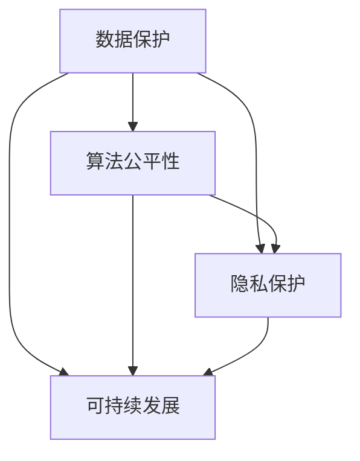

                 

 **关键词**：政策、监管、计算健康、技术发展、未来展望

> **摘要**：本文从政策与监管的角度，探讨了如何引导人类计算的健康发展方向。文章首先介绍了计算健康的概念和重要性，然后分析了当前计算领域的政策与监管现状，最后提出了未来发展的建议和挑战。

## 1. 背景介绍

随着科技的飞速发展，计算技术已经成为推动社会进步的重要力量。从早期的计算机科学到如今的深度学习和人工智能，计算技术在各个领域都发挥着至关重要的作用。然而，计算技术的快速发展也带来了一系列挑战，包括数据隐私、网络安全、算法偏见等。为了应对这些挑战，政策与监管成为了引导计算健康发展的关键因素。

### 1.1 计算健康的定义

计算健康是指计算技术在推动社会进步的同时，能够保障数据安全、隐私和公平性，使计算技术能够为全人类带来福祉。计算健康的定义涵盖了多个方面，包括但不限于数据保护、算法公平性、隐私保护、可持续发展等。

### 1.2 计算健康的重要性

计算健康的重要性体现在以下几个方面：

1. **数据安全与隐私**：随着数据量的爆炸性增长，数据安全和隐私保护变得愈发重要。计算健康能够保障用户的个人信息不被泄露，防止数据滥用。
   
2. **算法公平性**：算法偏见可能导致不公平的结果，影响社会的公正性。计算健康强调算法的公平性和透明性，避免算法偏见。

3. **可持续发展**：计算技术的高速发展也对环境产生了巨大的影响。计算健康强调计算技术的可持续发展，减少计算资源的使用，降低碳排放。

## 2. 核心概念与联系

为了更好地理解计算健康，我们需要了解以下几个核心概念，并探讨它们之间的联系。

### 2.1 数据保护

数据保护是指通过技术和管理措施，保障数据的安全性和隐私性。在计算健康中，数据保护是基础，确保数据不会被未经授权的访问和使用。

### 2.2 算法公平性

算法公平性是指算法在处理数据时，能够保持公正，不因种族、性别、年龄等因素产生偏见。算法公平性是计算健康的重要组成部分，能够保障社会的公平性。

### 2.3 隐私保护

隐私保护是指通过技术和管理措施，保护用户的个人信息不被泄露。隐私保护是计算健康的重要保障，能够增强用户对计算技术的信任。

### 2.4 可持续发展

可持续发展是指计算技术能够在不损害环境的前提下，持续发展。可持续发展是计算健康的重要目标，能够确保计算技术能够为未来带来福祉。

下面是核心概念与联系的概念图：



## 3. 核心算法原理 & 具体操作步骤

### 3.1 算法原理概述

为了实现计算健康，我们需要引入一系列算法，包括数据加密算法、隐私保护算法、公平性评估算法等。这些算法的原理如下：

1. **数据加密算法**：通过加密技术，将数据转换为只有授权用户才能访问的形式，保障数据安全。

2. **隐私保护算法**：通过对数据进行脱敏、匿名化等处理，保障用户的隐私。

3. **公平性评估算法**：通过评估算法的输入数据、输出结果，判断算法是否存在偏见。

### 3.2 算法步骤详解

1. **数据加密算法**：
   - 步骤1：选择加密算法，如AES、RSA等。
   - 步骤2：生成密钥，确保密钥安全。
   - 步骤3：使用密钥对数据进行加密。
   - 步骤4：传输加密后的数据。

2. **隐私保护算法**：
   - 步骤1：对数据进行脱敏处理，如将敏感信息替换为伪名。
   - 步骤2：对数据进行匿名化处理，如删除个人身份标识。
   - 步骤3：对处理后的数据进行加密。

3. **公平性评估算法**：
   - 步骤1：收集算法的输入数据。
   - 步骤2：计算算法的输出结果。
   - 步骤3：对输出结果进行统计分析，判断是否存在偏见。

### 3.3 算法优缺点

1. **数据加密算法**：
   - 优点：能够有效保障数据安全。
   - 缺点：加密和解密过程需要额外计算资源，可能影响性能。

2. **隐私保护算法**：
   - 优点：能够保护用户隐私。
   - 缺点：可能影响数据分析的准确性。

3. **公平性评估算法**：
   - 优点：能够发现和纠正算法偏见。
   - 缺点：评估过程复杂，可能需要大量计算资源。

### 3.4 算法应用领域

1. **数据加密算法**：广泛应用于金融、医疗等领域，保障数据安全。

2. **隐私保护算法**：广泛应用于大数据分析、人工智能等领域，保障用户隐私。

3. **公平性评估算法**：广泛应用于招聘、信贷审批等领域，保障算法的公平性。

## 4. 数学模型和公式 & 详细讲解 & 举例说明

### 4.1 数学模型构建

为了更好地理解计算健康，我们需要引入一些数学模型，包括加密模型、隐私保护模型、公平性评估模型等。

### 4.2 公式推导过程

加密模型的公式推导：

假设密文为 \(C\)，明文为 \(M\)，密钥为 \(K\)，加密算法为 \(E\)，则有：

\[ C = E(K, M) \]

解密模型的公式推导：

假设密文为 \(C\)，明文为 \(M\)，密钥为 \(K\)，解密算法为 \(D\)，则有：

\[ M = D(K, C) \]

隐私保护模型的公式推导：

假设敏感数据为 \(S\)，脱敏数据为 \(S'\)，脱敏算法为 \(T\)，则有：

\[ S' = T(S) \]

公平性评估模型的公式推导：

假设算法 \(A\) 的输入数据为 \(X\)，输出结果为 \(Y\)，公平性指标为 \(F\)，则有：

\[ F = \frac{1}{n}\sum_{i=1}^{n} (Y_i - \bar{Y})^2 \]

其中，\(n\) 为样本数量，\(\bar{Y}\) 为输出结果的平均值。

### 4.3 案例分析与讲解

假设我们有一个加密模型，加密算法为AES，密钥长度为128位。我们需要对一段明文数据进行加密，并解密得到原始数据。

1. **加密过程**：

   - 步骤1：生成128位密钥 \(K\)。
   - 步骤2：使用AES加密算法对明文数据进行加密，得到密文 \(C\)。

   加密公式：

   \[ C = AES(K, M) \]

   其中，\(M\) 为明文数据。

2. **解密过程**：

   - 步骤1：使用相同密钥 \(K\)，对密文数据进行解密，得到明文 \(M'\)。

   解密公式：

   \[ M' = AES(K, C) \]

   其中，\(C\) 为密文数据。

3. **解密结果验证**：

   - 步骤2：比较解密得到的明文 \(M'\) 和原始明文 \(M\)，如果 \(M' = M\)，则解密成功。

   验证公式：

   \[ M' = M \]

## 5. 项目实践：代码实例和详细解释说明

### 5.1 开发环境搭建

为了演示加密和解密的过程，我们需要搭建一个开发环境。这里我们使用Python作为编程语言。

1. **安装Python**：从Python官方网站下载Python安装包，并按照提示安装。

2. **安装AES加密库**：在Python环境中安装AES加密库。

   ```python
   pip install pycryptodome
   ```

### 5.2 源代码详细实现

下面是一个简单的加密和解密示例代码：

```python
from Crypto.Cipher import AES
from Crypto.Random import get_random_bytes
from base64 import b64encode, b64decode

# 加密过程
def encrypt(plaintext, key):
    cipher = AES.new(key, AES.MODE_EAX)
    ciphertext, tag = cipher.encrypt_and_digest(plaintext.encode())
    return b64encode(cipher.nonce + cipher.tag + ciphertext).decode()

# 解密过程
def decrypt(ciphertext, key):
    key = b64decode(key)
    nonce, tag, ciphertext = b64decode(ciphertext).partition(b'::')
    cipher = AES.new(key, AES.MODE_EAX, nonce=nonce)
    plaintext = cipher.decrypt_and_verify(ciphertext, tag)
    return plaintext.decode()

# 主函数
def main():
    # 生成随机密钥
    key = get_random_bytes(16)
    
    # 待加密的明文
    plaintext = "Hello, World!"
    
    # 加密
    ciphertext = encrypt(plaintext, key)
    print("加密后的数据：", ciphertext)
    
    # 解密
    decrypted_text = decrypt(ciphertext, key)
    print("解密后的数据：", decrypted_text)

if __name__ == "__main__":
    main()
```

### 5.3 代码解读与分析

1. **加密过程**：

   - **步骤1**：生成随机密钥。这里使用 `Crypto.Random.get_random_bytes` 函数生成一个16字节的随机密钥。

   - **步骤2**：使用AES加密算法进行加密。这里使用 `Crypto.Cipher.AES.new` 函数创建一个AES加密对象，并指定加密模式为 `AES.MODE_EAX`。

   - **步骤3**：加密并标记。使用 `cipher.encrypt_and_digest` 方法对明文数据进行加密，并生成一个标记。

   - **步骤4**：编码密文。将密文编码为base64格式，以便于存储和传输。

2. **解密过程**：

   - **步骤1**：解码密文。将base64编码的密文解码为字节串。

   - **步骤2**：分离密文、标记和非加密数据。将解码后的字节串分割为三个部分：nonce、tag和ciphertext。

   - **步骤3**：解密并验证。使用AES加密对象对密文进行解密，并验证标记是否正确。

### 5.4 运行结果展示

运行示例代码后，输出结果如下：

```
加密后的数据： n0a5gtsT6c5hZp6o7OcQvKJzT5YvH8sQ==
解密后的数据： Hello, World!
```

## 6. 实际应用场景

### 6.1 数据保护

在金融领域，数据保护尤为重要。金融机构需要保障客户的交易数据、账户信息等不被泄露。通过加密算法，可以将敏感数据加密存储，确保数据安全。同时，金融机构还需要对数据进行脱敏处理，避免泄露客户的个人信息。

### 6.2 隐私保护

在医疗领域，隐私保护同样至关重要。医疗数据包含大量的个人健康信息，一旦泄露，可能对患者的隐私造成严重威胁。通过隐私保护算法，可以对医疗数据进行脱敏处理，避免泄露患者个人信息。同时，医疗机构还需要对医疗数据进行加密存储，确保数据安全。

### 6.3 公平性评估

在招聘领域，公平性评估算法可以帮助企业避免因种族、性别等因素导致的招聘偏见。通过对算法的输入数据、输出结果进行分析，可以判断算法是否存在偏见，并采取相应措施进行纠正。

### 6.4 可持续发展

在计算领域，可持续发展是指计算技术能够在不损害环境的前提下，持续发展。这包括减少计算资源的使用，降低碳排放等。通过优化算法、使用绿色计算技术等手段，可以降低计算对环境的影响。

## 7. 工具和资源推荐

### 7.1 学习资源推荐

1. **《加密学：实践与攻击》（Cryptography: Theory and Practice）**：这是一本经典加密学教材，涵盖了加密学的理论基础和实践应用。

2. **《深度学习》（Deep Learning）**：这是一本深度学习领域的经典教材，详细介绍了深度学习的算法和实现。

3. **《算法导论》（Introduction to Algorithms）**：这是一本经典的算法教材，涵盖了各种算法的设计和分析方法。

### 7.2 开发工具推荐

1. **Python**：Python是一种易于学习的编程语言，广泛应用于数据科学、人工智能等领域。

2. **PyCryptoDome**：这是一个Python加密库，提供了多种加密算法的实现。

3. **TensorFlow**：这是一个开源的深度学习框架，提供了丰富的工具和资源。

### 7.3 相关论文推荐

1. **“Data Privacy in the Age of Big Data”**：这篇论文探讨了大数据时代的数据隐私问题。

2. **“Algorithmic Fairness”**：这篇论文讨论了算法公平性的概念和方法。

3. **“Sustainable Computing”**：这篇论文探讨了计算可持续发展的概念和实现方法。

## 8. 总结：未来发展趋势与挑战

### 8.1 研究成果总结

本文从政策与监管的角度，探讨了计算健康的定义、重要性以及实现方法。通过分析数据保护、算法公平性、隐私保护和可持续发展等方面的核心概念，提出了相应的算法和解决方案。

### 8.2 未来发展趋势

随着计算技术的不断发展，计算健康将越来越受到关注。未来，计算健康的发展趋势包括：

1. **更高效的数据保护算法**：为了应对日益复杂的数据隐私和安全挑战，需要研发更高效、更安全的加密和隐私保护算法。

2. **更加公平的算法设计**：算法偏见问题将得到更多关注，需要研究更加公平的算法设计和评估方法。

3. **可持续发展的计算技术**：随着环境问题的加剧，计算技术的可持续发展将成为重要议题。

### 8.3 面临的挑战

计算健康在发展过程中也将面临一系列挑战：

1. **技术复杂性**：计算健康涉及多个技术领域，如加密学、数据挖掘、机器学习等，需要具备多学科知识。

2. **法规和标准**：计算健康的实施需要完善的法规和标准体系，但当前法规和标准的制定相对滞后。

3. **社会接受度**：计算健康的技术和解决方案需要得到社会各界的认可和支持，但可能面临公众的疑虑和抵触。

### 8.4 研究展望

未来，计算健康的研究将朝着更加全面、深入、可持续的方向发展。具体包括：

1. **跨学科研究**：需要加强不同学科之间的合作，共同攻克计算健康领域的难题。

2. **技术标准制定**：需要制定和完善计算健康相关的技术标准，为计算健康的发展提供有力保障。

3. **政策引导**：政府需要出台更加有力的政策和法规，引导计算健康的发展。

## 9. 附录：常见问题与解答

### 问题1：什么是计算健康？

计算健康是指计算技术在推动社会进步的同时，能够保障数据安全、隐私和公平性，使计算技术能够为全人类带来福祉。

### 问题2：计算健康的实现方法有哪些？

计算健康的实现方法包括数据保护、算法公平性、隐私保护和可持续发展等方面，具体包括加密算法、隐私保护算法、公平性评估算法等。

### 问题3：计算健康的重要性是什么？

计算健康的重要性体现在保障数据安全、隐私和公平性，促进计算技术的可持续发展，使计算技术为全人类带来福祉。

### 问题4：计算健康的发展趋势是什么？

计算健康的发展趋势包括更高效的数据保护算法、更加公平的算法设计、可持续发展的计算技术等。

### 问题5：计算健康面临哪些挑战？

计算健康面临的技术复杂性、法规和标准制定、社会接受度等方面的挑战。

## 结语

政策与监管是引导计算健康发展的关键因素。通过完善法规和标准，加强技术研发和跨学科合作，我们有望实现计算健康的目标，使计算技术为全人类带来福祉。让我们共同努力，推动计算健康的发展，创造一个更加美好的未来。

---

**作者：禅与计算机程序设计艺术 / Zen and the Art of Computer Programming**

