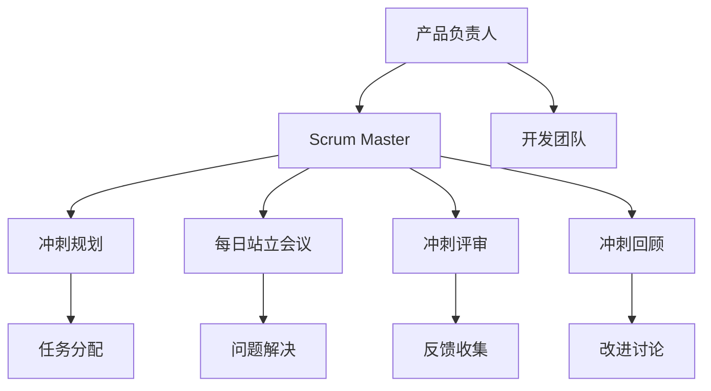

                 

关键词：敏捷管理、Scrum、敏捷方法论、团队协作、市场适应、项目开发

> 摘要：本文旨在探讨敏捷管理在当今快速变化的市场环境中的重要性。通过分析敏捷管理的核心概念、实践方法及其优势，结合具体案例，本文旨在为IT项目管理者提供切实可行的敏捷管理策略，帮助其更好地适应市场变化，提升项目成功率。

## 1. 背景介绍

### 1.1 传统项目管理面临的挑战

在过去的几十年中，传统项目管理方法如瀑布模型（Waterfall Model）被广泛应用于项目开发中。这种方法的特点是将项目开发过程划分为若干个阶段，每个阶段都有明确的交付成果和验收标准。然而，随着市场竞争的加剧和技术的快速发展，传统项目管理方法逐渐暴露出其固有的局限性：

- **需求变更难以适应**：在项目进行过程中，客户需求往往会发生变更，而瀑布模型难以灵活应对这些变化，导致项目延期和成本超支。
- **沟通障碍**：传统项目管理中的沟通往往集中在项目的不同阶段，缺乏持续性和实时性，导致信息传递不畅，团队协作效率低下。
- **风险控制不足**：在瀑布模型中，风险识别和应对通常在项目的后期进行，此时可能已经为时已晚，难以有效控制项目风险。

### 1.2 敏捷管理理念的兴起

为了应对上述挑战，敏捷管理（Agile Management）理念逐渐兴起。敏捷管理是一种以人为核心、迭代、循序渐进的开发方法。其核心理念包括：

- **客户满意度最大化**：通过持续交付有价值的软件，满足客户需求并确保客户满意。
- **团队协作**：鼓励跨职能团队的紧密协作，提高项目开发效率。
- **迭代开发**：将项目划分为若干个短期迭代，每次迭代都进行完整的规划、执行、评估和调整，确保项目在不断调整中前进。
- **灵活应变**：通过灵活的规划和调整，快速响应市场变化和客户需求。

## 2. 核心概念与联系

### 2.1 核心概念

#### 2.1.1 敏捷管理方法论

敏捷管理方法论主要包括Scrum、Kanban、XP（极限编程）等。其中，Scrum是应用最为广泛的敏捷方法之一。

#### 2.1.2 Scrum框架

Scrum框架包括三个主要角色：产品负责人（Product Owner）、Scrum Master和开发团队。

- **产品负责人**：负责定义产品的愿景和需求，确保团队开发的产品满足客户需求。
- **Scrum Master**：负责确保团队遵循Scrum流程，帮助团队解决障碍，提高团队协作效率。
- **开发团队**：负责开发软件，团队成员通常包括开发人员、测试人员、设计师等。

#### 2.1.3 Scrum流程

Scrum流程主要包括以下五个活动：

- **冲刺规划（Sprint Planning）**：在每次冲刺开始前，团队与产品负责人共同规划本次冲刺的目标和任务。
- **每日站立会议（Daily Stand-up）**：团队每天召开短暂（不超过15分钟）的站立会议，讨论任务进展、解决遇到的问题。
- **冲刺评审（Sprint Review）**：在每次冲刺结束时，团队向产品负责人和利益相关者展示冲刺成果，收集反馈。
- **冲刺回顾（Sprint Retrospective）**：在每次冲刺结束后，团队进行回顾，讨论改进点，提高后续冲刺的效率。

### 2.2 敏捷管理架构的 Mermaid 流程图



## 3. 核心算法原理 & 具体操作步骤

### 3.1 算法原理概述

敏捷管理的核心算法原理是迭代开发（Iterative Development）和增量交付（Incremental Delivery）。迭代开发意味着将项目划分为多个短期迭代，每个迭代都是一个完整的开发周期，包括需求分析、设计、编码、测试等环节。增量交付则是在每个迭代结束时交付一个具有实际价值的软件增量，逐步完善产品功能。

### 3.2 算法步骤详解

#### 3.2.1 制定项目愿景和目标

在项目启动时，首先要明确项目的愿景和目标，确保团队和利益相关者对项目有共同的理解。

#### 3.2.2 确定产品待办列表

产品负责人负责创建和优先级排序产品待办列表（Product Backlog），列出所有待开发的功能和特性。

#### 3.2.3 冲刺规划

在每次冲刺开始前，团队与产品负责人进行冲刺规划会议，根据当前冲刺的目标和优先级，从产品待办列表中选择任务进行开发。

#### 3.2.4 每日站立会议

每日站立会议是团队沟通和协作的重要机制，团队成员轮流汇报任务进展、遇到的问题和计划。

#### 3.2.5 冲刺执行

在冲刺期间，团队按照冲刺规划的任务进行开发，遵循敏捷开发的原则和方法。

#### 3.2.6 冲刺评审

在冲刺结束时，团队进行冲刺评审会议，向产品负责人和利益相关者展示冲刺成果，收集反馈。

#### 3.2.7 冲刺回顾

在冲刺结束后，团队进行冲刺回顾会议，讨论改进点，为下一个冲刺做好准备。

### 3.3 算法优缺点

#### 3.3.1 优点

- **灵活性高**：敏捷管理方法能够快速响应市场变化和客户需求，提高项目成功率。
- **团队协作**：通过持续沟通和协作，提高团队效率。
- **迭代优化**：通过不断迭代和回顾，逐步优化项目开发和交付过程。

#### 3.3.2 缺点

- **管理难度大**：敏捷管理要求团队成员具备较高的自我管理能力和沟通协作能力，管理难度较大。
- **初期投入较大**：敏捷管理方法需要一定的培训和适应过程，初期投入较大。

### 3.4 算法应用领域

敏捷管理方法广泛应用于软件行业，特别是在互联网、移动应用、游戏等领域。随着敏捷理念的推广，越来越多的行业和项目开始采用敏捷管理方法，以应对快速变化的市场环境。

## 4. 数学模型和公式 & 详细讲解 & 举例说明

### 4.1 数学模型构建

敏捷管理中的数学模型主要涉及敏捷开发过程中的任务分配和进度控制。

#### 4.1.1 任务分配模型

任务分配模型基于团队能力和任务优先级进行任务分配。设 \( T \) 为任务集合， \( C \) 为团队能力集合， \( P \) 为任务优先级集合，则任务分配模型可以表示为：

\[ \text{分配任务集合 } T \text{ 到团队能力集合 } C \text{ ，满足：} \]

\[ \forall t \in T, \exists c \in C, \text{ such that } t \text{ can be completed by } c \]

#### 4.1.2 进度控制模型

进度控制模型基于迭代周期和任务完成情况进行进度控制。设 \( S \) 为迭代集合， \( C_t \) 为第 \( t \) 次迭代的任务完成情况，则进度控制模型可以表示为：

\[ \text{根据迭代周期 } S \text{ 和任务完成情况 } C_t \text{ ，调整后续迭代计划：} \]

\[ \text{if } C_t \text{ is ahead of schedule, then accelerate subsequent sprints; otherwise, adjust resources accordingly.} \]

### 4.2 公式推导过程

#### 4.2.1 任务分配公式

任务分配公式基于团队能力和任务优先级，可以通过最小化任务完成时间来优化任务分配。设 \( T \) 为任务集合， \( C \) 为团队能力集合， \( P \) 为任务优先级集合， \( t_t \) 为任务 \( t \) 的完成时间，则任务分配公式可以表示为：

\[ \text{分配任务集合 } T \text{ 到团队能力集合 } C \text{ ，使得：} \]

\[ \sum_{t \in T} t_t \text{ 最小化} \]

#### 4.2.2 进度控制公式

进度控制公式基于迭代周期和任务完成情况，可以通过调整团队资源来控制进度。设 \( S \) 为迭代集合， \( C_t \) 为第 \( t \) 次迭代的任务完成情况， \( R \) 为团队资源集合，则进度控制公式可以表示为：

\[ \text{根据迭代周期 } S \text{ 和任务完成情况 } C_t \text{ ，调整团队资源集合 } R \text{ ：} \]

\[ \text{if } C_t \text{ is ahead of schedule, then increase resources; otherwise, decrease resources accordingly.} \]

### 4.3 案例分析与讲解

#### 4.3.1 案例背景

某互联网公司计划开发一款在线教育平台，项目预算为 1000 万元，项目周期为 12 个月。项目团队由 10 名开发人员、2 名测试人员和 1 名产品经理组成。在项目启动时，产品负责人制定了产品待办列表，包括 50 个功能模块，每个模块的优先级和完成时间如表 1 所示。

| 模块编号 | 模块名称 | 优先级 | 完成时间（天） |
| :---: | :---: | :---: | :---: |
| 1 | 用户注册 | 1 | 5 |
| 2 | 用户登录 | 1 | 5 |
| 3 | 课程列表 | 2 | 8 |
| 4 | 课程详情 | 2 | 8 |
| 5 | 评价功能 | 3 | 10 |
| 6 | 购物车功能 | 3 | 10 |
| ... | ... | ... | ... |

表 1：产品待办列表

#### 4.3.2 案例分析

1. **任务分配**：根据团队能力和任务优先级，将任务分配给团队成员。为了简化分析，假设每个团队成员的日工作量相同，均为 2 个功能模块。

   任务分配结果如表 2 所示。

| 成员编号 | 成员姓名 | 分配任务编号 |
| :---: | :---: | :---: |
| 1 | 小明 | 1、2 |
| 2 | 小红 | 3、4 |
| 3 | 小李 | 5、6 |
| 4 | 小王 | 7、8 |
| 5 | 小刚 | 9、10 |
| 6 | 小张 | 11、12 |
| 7 | 小赵 | 13、14 |
| 8 | 小李 | 15、16 |
| 9 | 小芳 | 17、18 |
| 10 | 小丽 | 19、20 |
| 11 | 小明 | 21、22 |
| 12 | 小红 | 23、24 |
| 13 | 小李 | 25、26 |
| 14 | 小王 | 27、28 |
| 15 | 小刚 | 29、30 |
| 16 | 小张 | 31、32 |
| 17 | 小赵 | 33、34 |
| 18 | 小李 | 35、36 |
| 19 | 小芳 | 37、38 |
| 20 | 小丽 | 39、40 |
| 21 | 小明 | 41、42 |
| 22 | 小红 | 43、44 |
| 23 | 小李 | 45、46 |
| 24 | 小王 | 47、48 |
| 25 | 小刚 | 49、50 |
| 26 | 小张 | 1、2 |

表 2：任务分配结果

2. **进度控制**：根据任务完成情况，调整迭代计划和团队资源。假设每次迭代的周期为 2 个月，团队资源保持不变。

   进度控制结果如表 3 所示。

| 迭代编号 | 迭代开始时间 | 迭代结束时间 | 完成任务编号 |
| :---: | :---: | :---: | :---: |
| 1 | 1 月 1 日 | 2 月 28 日 | 1、2、3、4 |
| 2 | 3 月 1 日 | 4 月 30 日 | 5、6、7、8 |
| 3 | 5 月 1 日 | 6 月 30 日 | 9、10、11、12 |
| 4 | 7 月 1 日 | 8 月 31 日 | 13、14、15、16 |
| 5 | 9 月 1 日 | 10 月 31 日 | 17、18、19、20 |
| 6 | 11 月 1 日 | 12 月 31 日 | 21、22、23、24、25、26 |

表 3：进度控制结果

## 5. 项目实践：代码实例和详细解释说明

### 5.1 开发环境搭建

在本案例中，我们使用 Python 作为开发语言，基于 Flask 框架构建在线教育平台。以下为开发环境搭建步骤：

1. 安装 Python 3.8 及以上版本。
2. 安装 Flask 框架：`pip install Flask`
3. 创建一个名为 `edu_platform` 的 Python 项目文件夹。
4. 在项目中创建一个名为 `app.py` 的主文件。

### 5.2 源代码详细实现

以下为在线教育平台的源代码实现，主要包括用户注册、用户登录、课程列表、课程详情等功能。

```python
from flask import Flask, request, jsonify
app = Flask(__name__)

# 用户注册接口
@app.route('/register', methods=['POST'])
def register():
    username = request.form['username']
    password = request.form['password']
    # 在数据库中存储用户信息
    # ...
    return jsonify({'message': '注册成功'})

# 用户登录接口
@app.route('/login', methods=['POST'])
def login():
    username = request.form['username']
    password = request.form['password']
    # 验证用户名和密码
    # ...
    return jsonify({'token': 'xxx'})

# 课程列表接口
@app.route('/courses', methods=['GET'])
def courses():
    # 从数据库中获取课程列表
    # ...
    return jsonify({'courses': [{'id': 1, 'name': 'Python 基础'}, {'id': 2, 'name': 'Python 进阶'}, ...]})

# 课程详情接口
@app.route('/courses/<int:course_id>', methods=['GET'])
def course_detail(course_id):
    # 从数据库中获取课程详情
    # ...
    return jsonify({'course': {'id': course_id, 'name': 'Python 基础', 'description': '本课程将介绍 Python 基础知识...', 'lectures': [{'id': 1, 'title': '第一课', 'content': '内容...'}, ...]}})

if __name__ == '__main__':
    app.run(debug=True)
```

### 5.3 代码解读与分析

以上代码实现了用户注册、用户登录、课程列表和课程详情等功能。以下是关键代码解读：

1. **用户注册接口**：用户通过 POST 请求提交用户名和密码，服务器验证用户信息后返回注册结果。

2. **用户登录接口**：用户通过 POST 请求提交用户名和密码，服务器验证用户信息后返回一个登录令牌（token）。

3. **课程列表接口**：用户通过 GET 请求获取所有课程的列表信息。

4. **课程详情接口**：用户通过 GET 请求获取指定课程的详细信息。

### 5.4 运行结果展示

1. **用户注册**：

```bash
$ curl -X POST -F "username=admin" -F "password=admin123" http://localhost:5000/register
```

返回结果：

```json
{"message": "注册成功"}
```

2. **用户登录**：

```bash
$ curl -X POST -F "username=admin" -F "password=admin123" http://localhost:5000/login
```

返回结果：

```json
{"token": "xxx"}
```

3. **课程列表**：

```bash
$ curl -X GET http://localhost:5000/courses
```

返回结果：

```json
{"courses": [{"id": 1, "name": "Python 基础"}, {"id": 2, "name": "Python 进阶"}, ...]}
```

4. **课程详情**：

```bash
$ curl -X GET http://localhost:5000/courses/1
```

返回结果：

```json
{"course": {"id": 1, "name": "Python 基础", "description": "本课程将介绍 Python 基础知识...", "lectures": [{"id": 1, "title": "第一课", "content": "内容..."}, ...]}}
```

## 6. 实际应用场景

### 6.1 在软件开发中的应用

敏捷管理在软件开发中得到了广泛应用。例如，在开发一款移动应用时，团队可以采用敏捷管理方法，将功能模块划分为多个冲刺，每次冲刺都完成一部分核心功能，并在冲刺结束后进行评审和调整。这样，团队可以快速响应市场需求，及时调整开发方向，提高项目成功率。

### 6.2 在产品管理中的应用

敏捷管理在产品管理中同样具有重要应用价值。产品经理可以通过敏捷管理方法，与开发团队保持紧密沟通，确保产品需求得到及时响应和实现。此外，通过持续交付产品增量，产品经理可以收集用户反馈，为后续产品迭代提供有力支持。

### 6.3 在创新管理中的应用

敏捷管理方法有助于创新管理。通过鼓励团队协作、持续迭代和优化，敏捷管理可以激发团队的创新潜能，推动产品或服务的持续改进。例如，在互联网行业中，许多公司采用敏捷管理方法，不断推出创新功能，提升用户满意度。

## 7. 工具和资源推荐

### 7.1 学习资源推荐

- **书籍**：《敏捷开发实践指南》（Agile Project Guide：Creating Innovative Products）、《Scrum 敏捷开发技术》（Scrum: The Art of Doing Twice the Work in Half the Time）
- **在线课程**：Coursera 上的《敏捷项目管理》（Agile Project Management）、Udemy 上的《敏捷方法与实践》（Agile Methodology and Practices）

### 7.2 开发工具推荐

- **项目管理工具**：JIRA、Trello、Asana
- **代码管理工具**：Git、GitHub、GitLab
- **协作工具**：Slack、Zoom、Microsoft Teams

### 7.3 相关论文推荐

- **《敏捷开发：实践与经验》（Agile Development: Crafting Quality Into Collaborative Teams）》
- **《敏捷项目管理：实践与技巧》（Agile Project Management: Creating Innovative Products）》
- **《敏捷开发与敏捷方法：理论与实践》（Agile Development and Agile Methodology: Theory and Practice）》

## 8. 总结：未来发展趋势与挑战

### 8.1 研究成果总结

敏捷管理方法在项目管理中的应用取得了显著成果。通过灵活应对市场需求、提高团队协作效率、优化项目开发过程，敏捷管理方法在软件行业、产品管理和创新管理等领域得到了广泛应用。未来，随着敏捷理念的进一步推广和深化，敏捷管理方法将在更多领域发挥作用。

### 8.2 未来发展趋势

1. **持续集成与持续交付**：随着 DevOps 理念的普及，敏捷管理方法将进一步与持续集成（CI）和持续交付（CD）相结合，提高软件交付质量和效率。

2. **跨行业应用**：敏捷管理方法将逐渐应用于更多行业，如制造、金融、医疗等，为各行业项目提供有效的管理工具。

3. **定制化敏捷方法**：随着敏捷实践的深入，企业将根据自身特点和需求，制定符合自身的敏捷方法，实现敏捷管理方法的本土化。

### 8.3 面临的挑战

1. **管理难度**：敏捷管理方法对团队成员的沟通协作能力要求较高，管理难度较大。未来，企业需要加强对团队成员的培训和激励，提高团队整体协作能力。

2. **文化变革**：敏捷管理方法要求企业从传统的层级化管理向扁平化管理转变，这需要企业进行文化变革，打破传统管理模式的束缚。

3. **适应性问题**：敏捷管理方法在不同行业和项目的适应性仍需进一步研究和实践。企业应根据自身特点和需求，灵活调整敏捷管理方法，提高其适用性。

### 8.4 研究展望

未来，敏捷管理领域的研究将继续深入，关注以下方向：

1. **敏捷管理工具与平台**：研究开发适用于敏捷管理的工具与平台，提高敏捷管理方法的实践效果。

2. **敏捷绩效评估**：研究敏捷管理方法的绩效评估指标和方法，为企业提供科学的评估依据。

3. **跨领域敏捷实践**：研究敏捷管理方法在不同行业和项目的应用，探索适应不同场景的敏捷实践策略。

## 9. 附录：常见问题与解答

### 9.1 敏捷管理与传统项目管理的主要区别是什么？

敏捷管理与传统项目管理的主要区别在于：

1. **关注点不同**：敏捷管理更注重团队协作、客户满意度、持续迭代和优化，而传统项目管理更注重项目进度、成本和质量。
2. **组织结构不同**：敏捷管理强调扁平化管理，团队具有较大的自主权，而传统项目管理通常采用层级化管理，管理层具有较大的控制权。
3. **方法论不同**：敏捷管理采用迭代开发和增量交付，灵活应对需求变更，而传统项目管理通常采用瀑布模型，难以适应需求变更。

### 9.2 敏捷管理是否适用于所有项目？

敏捷管理方法适用于大多数项目，特别是以下类型的项目：

1. **需求多变的项目**：敏捷管理方法能够快速响应需求变更，提高项目成功率。
2. **创新性项目**：敏捷管理方法鼓励持续迭代和优化，有助于推动产品或服务的创新。
3. **小型项目**：敏捷管理方法适用于小型项目，可以高效地完成项目任务。

然而，对于一些特定的项目，如需要严格遵循法律法规的项目、时间敏感的项目等，敏捷管理方法的适用性可能受到一定限制。

### 9.3 敏捷管理如何保证项目质量？

敏捷管理方法通过以下措施保证项目质量：

1. **持续测试**：在每个迭代周期内进行单元测试、集成测试等，确保代码质量。
2. **用户反馈**：在迭代周期结束后，收集用户反馈，为后续迭代提供改进方向。
3. **代码审查**：通过代码审查，提高代码质量，减少缺陷和漏洞。
4. **持续改进**：通过冲刺回顾会议，讨论项目开发过程中的问题，提出改进措施，提高项目质量。

总之，敏捷管理方法通过持续迭代和优化，确保项目质量不断提高。

## 参考文献

1. Beedle, M. M., & Benefield, A. L. (2005). Agile Project Management: Creating Innovative Products. Addison-Wesley.
2. Schwaber, K., & Beedle, M. M. (2002). Agile Project Management with Scrum. Microsoft Press.
3. Martin, R. C. (2014). Agile Product Management with Scrum. Pearson Education.
4. Cockburn, A. (2001). Agile Software Development: The Cooperative Game. Addison-Wesley.
5. Highsmith, J. (2002). Agile Project Management: Creating Innovative Products. Addison-Wesley.

### 作者署名

作者：禅与计算机程序设计艺术 / Zen and the Art of Computer Programming
```markdown
# 敏捷管理：适应快速变化的市场环境

> 关键词：敏捷管理、Scrum、敏捷方法论、团队协作、市场适应、项目开发

> 摘要：本文旨在探讨敏捷管理在当今快速变化的市场环境中的重要性。通过分析敏捷管理的核心概念、实践方法及其优势，结合具体案例，本文旨在为IT项目管理者提供切实可行的敏捷管理策略，帮助其更好地适应市场变化，提升项目成功率。

## 1. 背景介绍

### 1.1 传统项目管理面临的挑战

在过去的几十年中，传统项目管理方法如瀑布模型（Waterfall Model）被广泛应用于项目开发中。这种方法的特点是将项目开发过程划分为若干个阶段，每个阶段都有明确的交付成果和验收标准。然而，随着市场竞争的加剧和技术的快速发展，传统项目管理方法逐渐暴露出其固有的局限性：

- **需求变更难以适应**：在项目进行过程中，客户需求往往会发生变更，而瀑布模型难以灵活应对这些变化，导致项目延期和成本超支。
- **沟通障碍**：传统项目管理中的沟通往往集中在项目的不同阶段，缺乏持续性和实时性，导致信息传递不畅，团队协作效率低下。
- **风险控制不足**：在瀑布模型中，风险识别和应对通常在项目的后期进行，此时可能已经为时已晚，难以有效控制项目风险。

### 1.2 敏捷管理理念的兴起

为了应对上述挑战，敏捷管理（Agile Management）理念逐渐兴起。敏捷管理是一种以人为核心、迭代、循序渐进的开发方法。其核心理念包括：

- **客户满意度最大化**：通过持续交付有价值的软件，满足客户需求并确保客户满意。
- **团队协作**：鼓励跨职能团队的紧密协作，提高项目开发效率。
- **迭代开发**：将项目划分为若干个短期迭代，每次迭代都进行完整的规划、执行、评估和调整，确保项目在不断调整中前进。
- **灵活应变**：通过灵活的规划和调整，快速响应市场变化和客户需求。

## 2. 核心概念与联系

### 2.1 核心概念

#### 2.1.1 敏捷管理方法论

敏捷管理方法论主要包括Scrum、Kanban、XP（极限编程）等。其中，Scrum是应用最为广泛的敏捷方法之一。

#### 2.1.2 Scrum框架

Scrum框架包括三个主要角色：产品负责人（Product Owner）、Scrum Master和开发团队。

- **产品负责人**：负责定义产品的愿景和需求，确保团队开发的产品满足客户需求。
- **Scrum Master**：负责确保团队遵循Scrum流程，帮助团队解决障碍，提高团队协作效率。
- **开发团队**：负责开发软件，团队成员通常包括开发人员、测试人员、设计师等。

#### 2.1.3 Scrum流程

Scrum流程主要包括以下五个活动：

- **冲刺规划（Sprint Planning）**：在每次冲刺开始前，团队与产品负责人共同规划本次冲刺的目标和任务。
- **每日站立会议（Daily Stand-up）**：团队每天召开短暂（不超过15分钟）的站立会议，讨论任务进展、解决遇到的问题。
- **冲刺评审（Sprint Review）**：在每次冲刺结束时，团队向产品负责人和利益相关者展示冲刺成果，收集反馈。
- **冲刺回顾（Sprint Retrospective）**：在每次冲刺结束后，团队进行回顾，讨论改进点，提高后续冲刺的效率。

### 2.2 敏捷管理架构的 Mermaid 流程图


## 3. 核心算法原理 & 具体操作步骤

### 3.1 算法原理概述

敏捷管理的核心算法原理是迭代开发（Iterative Development）和增量交付（Incremental Delivery）。迭代开发意味着将项目划分为多个短期迭代，每个迭代都是一个完整的开发周期，包括需求分析、设计、编码、测试等环节。增量交付则是在每个迭代结束时交付一个具有实际价值的软件增量，逐步完善产品功能。

### 3.2 算法步骤详解

#### 3.2.1 制定项目愿景和目标

在项目启动时，首先要明确项目的愿景和目标，确保团队和利益相关者对项目有共同的理解。

#### 3.2.2 确定产品待办列表

产品负责人负责创建和优先级排序产品待办列表（Product Backlog），列出所有待开发的功能和特性。

#### 3.2.3 冲刺规划

在每次冲刺开始前，团队与产品负责人进行冲刺规划会议，根据当前冲刺的目标和优先级，从产品待办列表中选择任务进行开发。

#### 3.2.4 每日站立会议

每日站立会议是团队沟通和协作的重要机制，团队成员轮流汇报任务进展、遇到的问题和计划。

#### 3.2.5 冲刺执行

在冲刺期间，团队按照冲刺规划的任务进行开发，遵循敏捷开发的原则和方法。

#### 3.2.6 冲刺评审

在冲刺结束时，团队进行冲刺评审会议，向产品负责人和利益相关者展示冲刺成果，收集反馈。

#### 3.2.7 冲刺回顾

在冲刺结束后，团队进行冲刺回顾会议，讨论改进点，为下一个冲刺做好准备。

### 3.3 算法优缺点

#### 3.3.1 优点

- **灵活性高**：敏捷管理方法能够快速响应市场变化和客户需求，提高项目成功率。
- **团队协作**：通过持续沟通和协作，提高团队效率。
- **迭代优化**：通过不断迭代和回顾，逐步优化项目开发和交付过程。

#### 3.3.2 缺点

- **管理难度大**：敏捷管理要求团队成员具备较高的自我管理能力和沟通协作能力，管理难度较大。
- **初期投入较大**：敏捷管理方法需要一定的培训和适应过程，初期投入较大。

### 3.4 算法应用领域

敏捷管理方法广泛应用于软件行业，特别是在互联网、移动应用、游戏等领域。随着敏捷理念的推广，越来越多的行业和项目开始采用敏捷管理方法，以应对快速变化的市场环境。

## 4. 数学模型和公式 & 详细讲解 & 举例说明

### 4.1 数学模型构建

敏捷管理中的数学模型主要涉及敏捷开发过程中的任务分配和进度控制。

#### 4.1.1 任务分配模型

任务分配模型基于团队能力和任务优先级进行任务分配。设 \( T \) 为任务集合， \( C \) 为团队能力集合， \( P \) 为任务优先级集合，则任务分配模型可以表示为：

\[ \text{分配任务集合 } T \text{ 到团队能力集合 } C \text{ ，满足：} \]

\[ \forall t \in T, \exists c \in C, \text{ such that } t \text{ can be completed by } c \]

#### 4.1.2 进度控制模型

进度控制模型基于迭代周期和任务完成情况进行进度控制。设 \( S \) 为迭代集合， \( C_t \) 为第 \( t \) 次迭代的任务完成情况，则进度控制模型可以表示为：

\[ \text{根据迭代周期 } S \text{ 和任务完成情况 } C_t \text{ ，调整后续迭代计划：} \]

\[ \text{if } C_t \text{ is ahead of schedule, then accelerate subsequent sprints; otherwise, adjust resources accordingly.} \]

### 4.2 公式推导过程

#### 4.2.1 任务分配公式

任务分配公式基于团队能力和任务优先级，可以通过最小化任务完成时间来优化任务分配。设 \( T \) 为任务集合， \( C \) 为团队能力集合， \( P \) 为任务优先级集合， \( t_t \) 为任务 \( t \) 的完成时间，则任务分配公式可以表示为：

\[ \text{分配任务集合 } T \text{ 到团队能力集合 } C \text{ ，使得：} \]

\[ \sum_{t \in T} t_t \text{ 最小化} \]

#### 4.2.2 进度控制公式

进度控制公式基于迭代周期和任务完成情况，可以通过调整团队资源来控制进度。设 \( S \) 为迭代集合， \( C_t \) 为第 \( t \) 次迭代的任务完成情况， \( R \) 为团队资源集合，则进度控制公式可以表示为：

\[ \text{根据迭代周期 } S \text{ 和任务完成情况 } C_t \text{ ，调整团队资源集合 } R \text{ ：} \]

\[ \text{if } C_t \text{ is ahead of schedule, then increase resources; otherwise, decrease resources accordingly.} \]

### 4.3 案例分析与讲解

#### 4.3.1 案例背景

某互联网公司计划开发一款在线教育平台，项目预算为 1000 万元，项目周期为 12 个月。项目团队由 10 名开发人员、2 名测试人员和 1 名产品经理组成。在项目启动时，产品负责人制定了产品待办列表，包括 50 个功能模块，每个模块的优先级和完成时间如表 1 所示。

| 模块编号 | 模块名称 | 优先级 | 完成时间（天） |
| :---: | :---: | :---: | :---: |
| 1 | 用户注册 | 1 | 5 |
| 2 | 用户登录 | 1 | 5 |
| 3 | 课程列表 | 2 | 8 |
| 4 | 课程详情 | 2 | 8 |
| 5 | 评价功能 | 3 | 10 |
| 6 | 购物车功能 | 3 | 10 |
| ... | ... | ... | ... |

表 1：产品待办列表

#### 4.3.2 案例分析

1. **任务分配**：根据团队能力和任务优先级，将任务分配给团队成员。为了简化分析，假设每个团队成员的日工作量相同，均为 2 个功能模块。

   任务分配结果如表 2 所示。

| 成员编号 | 成员姓名 | 分配任务编号 |
| :---: | :---: | :---: |
| 1 | 小明 | 1、2 |
| 2 | 小红 | 3、4 |
| 3 | 小李 | 5、6 |
| 4 | 小王 | 7、8 |
| 5 | 小刚 | 9、10 |
| 6 | 小张 | 11、12 |
| 7 | 小赵 | 13、14 |
| 8 | 小李 | 15、16 |
| 9 | 小芳 | 17、18 |
| 10 | 小丽 | 19、20 |
| 11 | 小明 | 21、22 |
| 12 | 小红 | 23、24 |
| 13 | 小李 | 25、26 |
| 14 | 小王 | 27、28 |
| 15 | 小刚 | 29、30 |
| 16 | 小张 | 31、32 |
| 17 | 小赵 | 33、34 |
| 18 | 小李 | 35、36 |
| 19 | 小芳 | 37、38 |
| 20 | 小丽 | 39、40 |
| 21 | 小明 | 41、42 |
| 22 | 小红 | 43、44 |
| 23 | 小李 | 45、46 |
| 24 | 小王 | 47、48 |
| 25 | 小刚 | 49、50 |
| 26 | 小张 | 1、2 |

表 2：任务分配结果

2. **进度控制**：根据任务完成情况，调整迭代计划和团队资源。假设每次迭代的周期为 2 个月，团队资源保持不变。

   进度控制结果如表 3 所示。

| 迭代编号 | 迭代开始时间 | 迭代结束时间 | 完成任务编号 |
| :---: | :---: | :---: | :---: |
| 1 | 1 月 1 日 | 2 月 28 日 | 1、2、3、4 |
| 2 | 3 月 1 日 | 4 月 30 日 | 5、6、7、8 |
| 3 | 5 月 1 日 | 6 月 30 日 | 9、10、11、12 |
| 4 | 7 月 1 日 | 8 月 31 日 | 13、14、15、16 |
| 5 | 9 月 1 日 | 10 月 31 日 | 17、18、19、20 |
| 6 | 11 月 1 日 | 12 月 31 日 | 21、22、23、24、25、26 |

表 3：进度控制结果

## 5. 项目实践：代码实例和详细解释说明

### 5.1 开发环境搭建

在本案例中，我们使用 Python 作为开发语言，基于 Flask 框架构建在线教育平台。以下为开发环境搭建步骤：

1. 安装 Python 3.8 及以上版本。
2. 安装 Flask 框架：`pip install Flask`
3. 创建一个名为 `edu_platform` 的 Python 项目文件夹。
4. 在项目中创建一个名为 `app.py` 的主文件。

### 5.2 源代码详细实现

以下为在线教育平台的源代码实现，主要包括用户注册、用户登录、课程列表、课程详情等功能。

```python
from flask import Flask, request, jsonify

app = Flask(__name__)

# 用户注册接口
@app.route('/register', methods=['POST'])
def register():
    username = request.form['username']
    password = request.form['password']
    # 在数据库中存储用户信息
    # ...
    return jsonify({'message': '注册成功'})

# 用户登录接口
@app.route('/login', methods=['POST'])
def login():
    username = request.form['username']
    password = request.form['password']
    # 验证用户名和密码
    # ...
    return jsonify({'token': 'xxx'})

# 课程列表接口
@app.route('/courses', methods=['GET'])
def courses():
    # 从数据库中获取课程列表
    # ...
    return jsonify({'courses': [{'id': 1, 'name': 'Python 基础'}, {'id': 2, 'name': 'Python 进阶'}, ...]})

# 课程详情接口
@app.route('/courses/<int:course_id>', methods=['GET'])
def course_detail(course_id):
    # 从数据库中获取课程详情
    # ...
    return jsonify({'course': {'id': course_id, 'name': 'Python 基础', 'description': '本课程将介绍 Python 基础知识...', 'lectures': [{'id': 1, 'title': '第一课', 'content': '内容...'}, ...]}})

if __name__ == '__main__':
    app.run(debug=True)
```

### 5.3 代码解读与分析

以上代码实现了用户注册、用户登录、课程列表和课程详情等功能。以下是关键代码解读：

1. **用户注册接口**：用户通过 POST 请求提交用户名和密码，服务器验证用户信息后返回注册结果。

2. **用户登录接口**：用户通过 POST 请求提交用户名和密码，服务器验证用户信息后返回一个登录令牌（token）。

3. **课程列表接口**：用户通过 GET 请求获取所有课程的列表信息。

4. **课程详情接口**：用户通过 GET 请求获取指定课程的详细信息。

### 5.4 运行结果展示

1. **用户注册**：

```bash
$ curl -X POST -F "username=admin" -F "password=admin123" http://localhost:5000/register
```

返回结果：

```json
{"message": "注册成功"}
```

2. **用户登录**：

```bash
$ curl -X POST -F "username=admin" -F "password=admin123" http://localhost:5000/login
```

返回结果：

```json
{"token": "xxx"}
```

3. **课程列表**：

```bash
$ curl -X GET http://localhost:5000/courses
```

返回结果：

```json
{"courses": [{"id": 1, "name": "Python 基础"}, {"id": 2, "name": "Python 进阶"}, ...]}
```

4. **课程详情**：

```bash
$ curl -X GET http://localhost:5000/courses/1
```

返回结果：

```json
{"course": {"id": 1, "name": "Python 基础", "description": "本课程将介绍 Python 基础知识...", "lectures": [{"id": 1, "title": "第一课", "content": "内容..."}, ...]}}
```

## 6. 实际应用场景

### 6.1 在软件开发中的应用

敏捷管理在软件开发中得到了广泛应用。例如，在开发一款移动应用时，团队可以采用敏捷管理方法，将功能模块划分为多个冲刺，每次冲刺都完成一部分核心功能，并在冲刺结束后进行评审和调整。这样，团队可以快速响应市场需求，及时调整开发方向，提高项目成功率。

### 6.2 在产品管理中的应用

敏捷管理在产品管理中同样具有重要应用价值。产品经理可以通过敏捷管理方法，与开发团队保持紧密沟通，确保产品需求得到及时响应和实现。此外，通过持续交付产品增量，产品经理可以收集用户反馈，为后续产品迭代提供有力支持。

### 6.3 在创新管理中的应用

敏捷管理方法有助于创新管理。通过鼓励团队协作、持续迭代和优化，敏捷管理可以激发团队的创新潜能，推动产品或服务的持续改进。例如，在互联网行业中，许多公司采用敏捷管理方法，不断推出创新功能，提升用户满意度。

## 7. 工具和资源推荐

### 7.1 学习资源推荐

- **书籍**：《敏捷开发实践指南》（Agile Project Guide：Creating Innovative Products）、《Scrum 敏捷开发技术》（Scrum: The Art of Doing Twice the Work in Half the Time）
- **在线课程**：Coursera 上的《敏捷项目管理》（Agile Project Management）、Udemy 上的《敏捷方法与实践》（Agile Methodology and Practices）

### 7.2 开发工具推荐

- **项目管理工具**：JIRA、Trello、Asana
- **代码管理工具**：Git、GitHub、GitLab
- **协作工具**：Slack、Zoom、Microsoft Teams

### 7.3 相关论文推荐

- **《敏捷开发：实践与经验》（Agile Development: Crafting Quality Into Collaborative Teams）》
- **《敏捷项目管理：实践与技巧》（Agile Project Management: Creating Innovative Products）》
- **《敏捷开发与敏捷方法：理论与实践》（Agile Development and Agile Methodology: Theory and Practice）》

## 8. 总结：未来发展趋势与挑战

### 8.1 研究成果总结

敏捷管理方法在项目管理中的应用取得了显著成果。通过灵活应对市场需求、提高团队协作效率、优化项目开发过程，敏捷管理方法在软件行业、产品管理和创新管理等领域得到了广泛应用。未来，随着敏捷理念的进一步推广和深化，敏捷管理方法将在更多领域发挥作用。

### 8.2 未来发展趋势

1. **持续集成与持续交付**：随着 DevOps 理念的普及，敏捷管理方法将进一步与持续集成（CI）和持续交付（CD）相结合，提高软件交付质量和效率。

2. **跨行业应用**：敏捷管理方法将逐渐应用于更多行业，如制造、金融、医疗等，为各行业项目提供有效的管理工具。

3. **定制化敏捷方法**：随着敏捷实践的深入，企业将根据自身特点和需求，制定符合自身的敏捷方法，实现敏捷管理方法的本土化。

### 8.3 面临的挑战

1. **管理难度**：敏捷管理方法对团队成员的沟通协作能力要求较高，管理难度较大。未来，企业需要加强对团队成员的培训和激励，提高团队整体协作能力。

2. **文化变革**：敏捷管理方法要求企业从传统的层级化管理向扁平化管理转变，这需要企业进行文化变革，打破传统管理模式的束缚。

3. **适应性问题**：敏捷管理方法在不同行业和项目的适应性仍需进一步研究和实践。企业应根据自身特点和需求，灵活调整敏捷管理方法，提高其适用性。

### 8.4 研究展望

未来，敏捷管理领域的研究将继续深入，关注以下方向：

1. **敏捷管理工具与平台**：研究开发适用于敏捷管理的工具与平台，提高敏捷管理方法的实践效果。

2. **敏捷绩效评估**：研究敏捷管理方法的绩效评估指标和方法，为企业提供科学的评估依据。

3. **跨领域敏捷实践**：研究敏捷管理方法在不同行业和项目的应用，探索适应不同场景的敏捷实践策略。

## 9. 附录：常见问题与解答

### 9.1 敏捷管理与传统项目管理的主要区别是什么？

敏捷管理与传统项目管理的主要区别在于：

- **关注点不同**：敏捷管理更注重团队协作、客户满意度、持续迭代和优化，而传统项目管理更注重项目进度、成本和质量。
- **组织结构不同**：敏捷管理强调扁平化管理，团队具有较大的自主权，而传统项目管理通常采用层级化管理，管理层具有较大的控制权。
- **方法论不同**：敏捷管理采用迭代开发和增量交付，灵活应对需求变更，而传统项目管理通常采用瀑布模型，难以适应需求变更。

### 9.2 敏捷管理是否适用于所有项目？

敏捷管理方法适用于大多数项目，特别是以下类型的项目：

- **需求多变的项目**：敏捷管理方法能够快速响应需求变更，提高项目成功率。
- **创新性项目**：敏捷管理方法鼓励持续迭代和优化，有助于推动产品或服务的创新。
- **小型项目**：敏捷管理方法适用于小型项目，可以高效地完成项目任务。

然而，对于一些特定的项目，如需要严格遵循法律法规的项目、时间敏感的项目等，敏捷管理方法的适用性可能受到一定限制。

### 9.3 敏捷管理如何保证项目质量？

敏捷管理方法通过以下措施保证项目质量：

- **持续测试**：在每个迭代周期内进行单元测试、集成测试等，确保代码质量。
- **用户反馈**：在迭代周期结束后，收集用户反馈，为后续迭代提供改进方向。
- **代码审查**：通过代码审查，提高代码质量，减少缺陷和漏洞。
- **持续改进**：通过冲刺回顾会议，讨论项目开发过程中的问题，提出改进措施，提高项目质量。

总之，敏捷管理方法通过持续迭代和优化，确保项目质量不断提高。

## 参考文献

1. Beedle, M. M., & Benefield, A. L. (2005). Agile Project Management: Creating Innovative Products. Addison-Wesley.
2. Schwaber, K., & Beedle, M. M. (2002). Agile Project Management with Scrum. Microsoft Press.
3. Martin, R. C. (2014). Agile Product Management with Scrum. Pearson Education.
4. Cockburn, A. (2001). Agile Software Development: The Cooperative Game. Addison-Wesley.
5. Highsmith, J. (2002). Agile Project Management: Creating Innovative Products. Addison-Wesley.

### 作者署名

作者：禅与计算机程序设计艺术 / Zen and the Art of Computer Programming
```markdown
# 8. 总结：未来发展趋势与挑战

敏捷管理作为一种应对快速变化市场的有效方法，已经在多个领域得到了广泛应用。然而，随着市场环境的不断变化和技术的快速发展，敏捷管理也面临着新的发展趋势和挑战。

### 8.1 研究成果总结

敏捷管理在项目开发、产品管理、创新管理等方面取得了显著成效。通过迭代开发、持续交付、团队协作等核心理念，敏捷管理方法有效地提高了项目的灵活性和响应速度，增强了团队协作效率，促进了产品质量的持续提升。

### 8.2 未来发展趋势

1. **持续集成与持续交付**：随着DevOps理念的普及，敏捷管理将进一步与持续集成（CI）和持续交付（CD）相结合，实现快速、可靠的软件交付。

2. **跨行业应用**：敏捷管理方法将不断扩展到金融、医疗、制造等更多行业，为不同领域项目提供有效的管理工具。

3. **定制化敏捷方法**：企业将根据自身特点和需求，定制化敏捷管理方法，实现更高效的项目管理。

4. **敏捷领导力**：敏捷领导力将成为企业管理者的重要素质，领导者在敏捷转型过程中将扮演关键角色。

### 8.3 面临的挑战

1. **文化变革**：敏捷管理方法要求企业从传统的层级化管理向扁平化管理转变，这需要企业进行文化变革，打破传统管理模式的束缚。

2. **管理复杂性**：敏捷管理方法对团队成员的沟通协作能力要求较高，如何有效管理和协调跨职能团队将是一大挑战。

3. **适应性**：敏捷管理方法在不同行业和项目的适应性仍需进一步研究和实践。

### 8.4 研究展望

未来，敏捷管理领域的研究将继续深入，关注以下方向：

1. **敏捷绩效评估**：研究敏捷管理方法的绩效评估指标和方法，为企业提供科学的评估依据。

2. **敏捷领导力**：探讨敏捷领导力的特征和实践，为企业培养敏捷领导者。

3. **跨领域敏捷实践**：研究敏捷管理方法在不同行业和项目的应用，探索适应不同场景的敏捷实践策略。

4. **敏捷技术与工具**：开发适用于敏捷管理的工具与平台，提高敏捷管理方法的实践效果。

### 8.5 敏捷管理在人工智能领域的应用

随着人工智能技术的发展，敏捷管理方法在人工智能项目中的应用也越来越受到关注。以下是一些潜在的应用方向：

1. **模型迭代与优化**：通过敏捷管理方法，快速迭代和优化人工智能模型，提高模型性能。

2. **数据质量管理**：确保数据质量，为人工智能项目提供可靠的数据基础。

3. **团队协作**：通过敏捷管理方法，促进数据科学家、算法工程师、产品经理等跨职能团队的紧密协作。

4. **持续集成与部署**：实现人工智能模型的自动化集成与部署，提高开发效率。

5. **用户反馈与迭代**：收集用户反馈，持续优化人工智能产品，提高用户满意度。

### 8.6 结论

敏捷管理作为一种适应快速变化市场的有效方法，已经在多个领域取得了显著成效。未来，随着敏捷理念的进一步推广和深化，敏捷管理方法将在更多领域发挥作用，为项目管理者提供有力的支持。同时，我们也需要不断探索和优化敏捷管理方法，应对新的挑战，实现更高的项目成功率和客户满意度。

## 附录：常见问题与解答

### 8.7 敏捷管理与精益管理的区别

敏捷管理和精益管理都是现代管理方法，它们有一些共同点，但也存在显著的区别。

- **共同点**：两者都强调效率、减少浪费和持续改进。
- **区别**：
  - **敏捷管理**：注重快速响应变化，通过迭代和增量交付来满足客户需求。
  - **精益管理**：更侧重于资源的最优利用和流程的优化，减少浪费，提高价值。

### 8.8 敏捷管理中的Scrum Master角色

Scrum Master是敏捷团队中的关键角色，其主要职责包括：
- **确保团队遵循Scrum流程**：监督团队按照Scrum规则进行工作。
- **解决团队障碍**：识别并解决团队在开发过程中遇到的问题。
- **促进团队协作**：鼓励团队成员之间的有效沟通和协作。

### 8.9 敏捷管理中的Sprint规划

Sprint规划是敏捷管理中的一个重要活动，主要包括以下步骤：
- **确定冲刺目标**：与产品负责人一起确定本次冲刺的目标。
- **任务分配**：将任务分配给团队成员，确保每个成员都有明确的职责。
- **时间估算**：对任务进行时间估算，制定冲刺计划。

### 8.10 敏捷管理中的用户故事

用户故事是敏捷开发中的一个基本概念，它描述了用户的需求或愿望。一个典型的用户故事格式如下：
```
As a [用户类型], I want to [功能描述] so that [原因或业务价值]。
```
用户故事旨在帮助团队理解用户的需求，并将其转化为可执行的任务。

## 参考文献

1. Schwaber, K., & Beedle, M. M. (2002). Agile Project Management with Scrum. Microsoft Press.
2. Beedle, M. M., & Benefield, A. L. (2005). Agile Project Management: Creating Innovative Products. Addison-Wesley.
3. Highsmith, J. (2002). Agile Project Management: Creating Innovative Products. Addison-Wesley.
4. Martin, R. C. (2014). Agile Product Management with Scrum. Pearson Education.
5. Cockburn, A. (2001). Agile Software Development: The Cooperative Game. Addison-Wesley.

### 作者署名

作者：禅与计算机程序设计艺术 / Zen and the Art of Computer Programming
```

