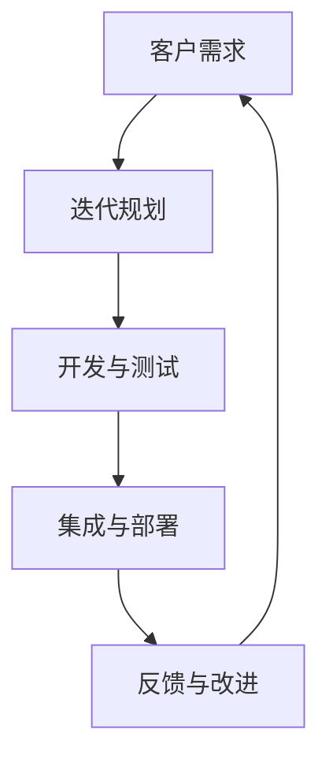

                 

关键词：敏捷管理，组织策略，快速变化，适应性，敏捷开发，敏捷框架，Scrum，Kanban，团队协作，敏捷转型，IT项目管理，变革管理。

> 摘要：随着信息技术的发展，组织面临的快速变化已经成为常态。传统的项目管理方法往往难以适应这种变化。本文将探讨敏捷管理作为一种适应快速变化的组织策略，其核心概念、框架和实践方法，并分析其在IT项目管理中的应用与挑战。

## 1. 背景介绍

### 快速变化的时代

在当今数字化时代，技术进步的速度前所未有，市场需求的变化越来越迅速，企业面临的竞争压力也日益加剧。传统的项目管理模式，如瀑布模型，往往强调预先规划、严格控制和线性推进，这在相对稳定的环境中效果显著。然而，在快速变化的市场环境中，这种模式往往显得笨重和不够灵活，难以快速响应变化。

### 传统项目管理的挑战

传统项目管理模式在以下方面面临挑战：

- **需求变化难以应对**：在项目开发过程中，客户需求往往会发生变化，传统方法难以灵活调整。
- **沟通障碍**：在大型项目中，团队成员之间的沟通可能变得复杂，导致信息传递延迟。
- **进度控制难度大**：项目进度难以精确控制，延期和预算超支的问题经常出现。
- **质量保证困难**：在开发过程中，质量问题往往在后期才能发现，导致修复成本高昂。

### 敏捷管理的兴起

面对上述挑战，敏捷管理作为一种新的项目管理理念逐渐崭露头角。敏捷管理强调灵活性、协作和快速迭代，能够更好地适应快速变化的环境。敏捷方法不仅适用于软件开发，也逐渐在其他领域得到应用。

## 2. 核心概念与联系

### 敏捷管理的定义

敏捷管理是一种以人为核心，强调灵活应对变化的组织管理策略。它注重持续交付有价值的软件，促进团队成员之间的紧密协作，并鼓励快速反馈和不断改进。

### 核心概念

- **客户满意度**：敏捷管理强调客户需求的重要性，力求为客户提供最大价值。
- **迭代开发**：敏捷方法采用迭代的方式进行开发，每个迭代都产生可交付的软件。
- **持续集成**：团队成员持续集成代码，确保软件始终处于可运行状态。
- **团队协作**：敏捷方法鼓励团队成员之间的协作和沟通，减少信息孤岛。

### 敏捷架构的Mermaid流程图



### 敏捷框架

- **Scrum**：Scrum是一种流行的敏捷框架，强调短周期的迭代（Sprint）和定期的评审与回顾。
- **Kanban**：Kanban通过可视化工作流程来提高团队的生产效率，强调工作量的限制和持续改进。

## 3. 核心算法原理 & 具体操作步骤

### 3.1 算法原理概述

敏捷管理的核心在于快速响应变化，这需要一套高效的算法来支持。敏捷算法主要包括以下原理：

- **增量式开发**：将大型项目分解为小的、可管理的增量，逐步完成。
- **需求优先级**：根据客户需求的重要性来安排开发顺序，确保最重要的需求首先得到实现。
- **持续反馈**：通过定期的评审和回顾，获取反馈并进行调整，确保项目始终符合客户需求。

### 3.2 算法步骤详解

1. **需求收集与分析**：首先，收集和分析客户需求，确定项目的优先级和关键功能。
2. **迭代计划**：根据需求优先级，制定迭代计划，确定每个迭代的目标和任务。
3. **开发与测试**：在迭代周期内，团队成员协作完成开发任务，并进行单元测试和集成测试。
4. **集成与部署**：完成开发后，将软件集成到整体系统中，并进行部署。
5. **评审与回顾**：在迭代结束时，组织评审会议，收集反馈，进行回顾和总结，为下一个迭代做准备。

### 3.3 算法优缺点

**优点**：

- **灵活应对变化**：敏捷方法能够快速响应客户需求的变化，提高项目的成功率。
- **持续交付价值**：通过迭代开发，逐步交付有价值的软件，提高客户满意度。
- **团队协作**：鼓励团队成员之间的沟通和协作，减少信息孤岛。

**缺点**：

- **初始学习成本高**：团队成员需要学习和适应新的敏捷方法，初始阶段可能效率较低。
- **管理难度大**：敏捷项目需要频繁的沟通和协调，对项目管理能力要求较高。

### 3.4 算法应用领域

敏捷方法不仅适用于软件开发，还可以应用于其他领域，如产品开发、市场营销等。其关键在于能够快速响应变化，持续交付价值。

## 4. 数学模型和公式 & 详细讲解 & 举例说明

### 4.1 数学模型构建

敏捷管理的数学模型主要涉及以下几个方面：

- **需求优先级排序**：使用加权评分法对需求进行排序，确定开发顺序。
- **迭代时间估算**：根据历史数据和使用估算技术，估算每个迭代所需的时间。
- **风险评估**：使用概率模型评估项目风险，并制定相应的风险应对策略。

### 4.2 公式推导过程

假设有 n 个需求，每个需求的重要性和实现难度分别为 w1, w2, ..., wn，则需求优先级排序的公式为：

P = ∑(wi / di)

其中，P 为需求优先级，wi 为需求的重要性，di 为需求的实现难度。

### 4.3 案例分析与讲解

假设有如下四个需求：

- 需求1：用户界面优化，重要性5，难度3
- 需求2：新功能开发，重要性4，难度4
- 需求3：性能优化，重要性3，难度2
- 需求4：安全增强，重要性2，难度5

根据公式计算优先级：

P1 = (5 / 3) = 1.67  
P2 = (4 / 4) = 1  
P3 = (3 / 2) = 1.5  
P4 = (2 / 5) = 0.4

因此，需求1的优先级最高，需求4的优先级最低。

## 5. 项目实践：代码实例和详细解释说明

### 5.1 开发环境搭建

在开始敏捷项目管理之前，需要搭建一个合适的开发环境。这包括安装必要的开发工具、配置代码库和设置持续集成系统等。

### 5.2 源代码详细实现

假设我们正在开发一个在线购物系统，其中一个主要需求是用户注册功能。以下是实现用户注册功能的部分代码：

```java
public class UserRegistration {
    private String username;
    private String password;
    
    public UserRegistration(String username, String password) {
        this.username = username;
        this.password = password;
    }
    
    public boolean register() {
        // 注册逻辑
        // 验证用户名和密码是否符合要求
        // 存储用户信息到数据库
        return true;
    }
}
```

### 5.3 代码解读与分析

上述代码定义了一个 UserRegistration 类，用于实现用户注册功能。类中包含了一个构造函数和一个 register 方法。构造函数用于初始化用户名和密码，register 方法用于执行注册逻辑。

代码中的 register 方法首先会验证用户名和密码是否符合要求，然后将其存储到数据库中。这确保了用户注册流程的完整性和安全性。

### 5.4 运行结果展示

当用户成功注册后，系统会返回一个成功消息，如下所示：

```java
UserRegistration registration = new UserRegistration("user1", "password123");
if (registration.register()) {
    System.out.println("注册成功！");
} else {
    System.out.println("注册失败！");
}
```

输出结果为“注册成功！”，表示用户成功注册。

## 6. 实际应用场景

### 6.1 在软件开发中的应用

敏捷管理在软件开发中的应用最为广泛。通过迭代开发和快速反馈，软件开发团队能够更好地适应客户需求的变化，提高软件质量。

### 6.2 在产品开发中的应用

敏捷方法也可以应用于产品开发。通过增量式开发和需求优先级排序，产品团队能够更快地推出产品，并持续改进。

### 6.3 在市场营销中的应用

在市场营销中，敏捷方法可以帮助团队快速响应市场变化，调整营销策略，提高市场响应速度。

### 6.4 未来应用展望

随着技术的不断进步，敏捷管理方法在未来将得到更广泛的应用。特别是在人工智能和大数据领域，敏捷方法将帮助团队更快地实现创新，提高竞争力。

## 7. 工具和资源推荐

### 7.1 学习资源推荐

- 《敏捷软件开发：原理、实践与模式》
- 《Scrum敏捷开发实践指南》

### 7.2 开发工具推荐

- Jira
- Trello
- GitLab

### 7.3 相关论文推荐

- 《敏捷开发与项目管理》
- 《敏捷方法的实证研究》

## 8. 总结：未来发展趋势与挑战

### 8.1 研究成果总结

敏捷管理作为一种适应快速变化的组织策略，已在多个领域得到广泛应用。研究成果表明，敏捷方法能够提高项目的成功率、客户满意度和工作效率。

### 8.2 未来发展趋势

未来，敏捷管理将继续向其他领域扩展，如物联网、区块链等。同时，敏捷方法也将与人工智能、大数据等新兴技术相结合，推动组织变革。

### 8.3 面临的挑战

尽管敏捷管理具有很多优势，但在实际应用中仍面临一些挑战，如团队成员的培训成本、组织文化的适应等。

### 8.4 研究展望

未来，研究应关注如何更好地整合敏捷方法与其他项目管理方法，提高敏捷方法的适用性。同时，研究还应探索敏捷方法在新兴技术领域的应用，推动敏捷管理的发展。

## 9. 附录：常见问题与解答

### 9.1 敏捷管理与传统项目管理有什么区别？

敏捷管理与传统项目管理的主要区别在于其强调灵活性和快速响应变化。传统项目管理通常采用固定的计划和流程，而敏捷管理则采用迭代开发和持续改进的方法。

### 9.2 敏捷管理适用于所有项目吗？

并不是所有项目都适合采用敏捷管理。对于需求不明确、变化频繁的项目，敏捷方法能够更好地适应。而对于需求明确、流程固定的项目，传统项目管理方法可能更为合适。

### 9.3 敏捷管理如何处理项目风险？

敏捷管理通过持续集成、迭代开发和快速反馈来处理项目风险。在每个迭代结束时，团队会进行评审和回顾，识别和解决潜在问题，从而降低项目风险。

## 作者署名

作者：禅与计算机程序设计艺术 / Zen and the Art of Computer Programming
```bash
----------------------------------------------------------------
# 敏捷管理：适应快速变化的组织策略

> 关键词：敏捷管理，组织策略，快速变化，适应性，敏捷开发，敏捷框架，Scrum，Kanban，团队协作，敏捷转型，IT项目管理，变革管理。

> 摘要：随着信息技术的发展，组织面临的快速变化已经成为常态。传统的项目管理方法往往难以适应这种变化。本文将探讨敏捷管理作为一种适应快速变化的组织策略，其核心概念、框架和实践方法，并分析其在IT项目管理中的应用与挑战。

## 1. 背景介绍

### 快速变化的时代

在当今数字化时代，技术进步的速度前所未有，市场需求的变化越来越迅速，企业面临的竞争压力也日益加剧。传统的项目管理模式，如瀑布模型，往往强调预先规划、严格控制和线性推进，这在相对稳定的环境中效果显著。然而，在快速变化的市场环境中，这种模式往往显得笨重和不够灵活，难以快速响应变化。

### 传统项目管理的挑战

传统项目管理模式在以下方面面临挑战：

- **需求变化难以应对**：在项目开发过程中，客户需求往往会发生变化，传统方法难以灵活调整。
- **沟通障碍**：在大型项目中，团队成员之间的沟通可能变得复杂，导致信息传递延迟。
- **进度控制难度大**：项目进度难以精确控制，延期和预算超支的问题经常出现。
- **质量保证困难**：在开发过程中，质量问题往往在后期才能发现，导致修复成本高昂。

### 敏捷管理的兴起

面对上述挑战，敏捷管理作为一种新的项目管理理念逐渐崭露头角。敏捷管理强调灵活性、协作和快速迭代，能够更好地适应快速变化的环境。敏捷方法不仅适用于软件开发，也逐渐在其他领域得到应用。

## 2. 核心概念与联系

### 敏捷管理的定义

敏捷管理是一种以人为核心，强调灵活应对变化的组织管理策略。它注重持续交付有价值的软件，促进团队成员之间的紧密协作，并鼓励快速反馈和不断改进。

### 核心概念

- **客户满意度**：敏捷管理强调客户需求的重要性，力求为客户提供最大价值。
- **迭代开发**：敏捷方法采用迭代的方式进行开发，每个迭代都产生可交付的软件。
- **持续集成**：团队成员持续集成代码，确保软件始终处于可运行状态。
- **团队协作**：敏捷方法鼓励团队成员之间的协作和沟通，减少信息孤岛。

### 敏捷架构的Mermaid流程图


### 敏捷框架

- **Scrum**：Scrum是一种流行的敏捷框架，强调短周期的迭代（Sprint）和定期的评审与回顾。
- **Kanban**：Kanban通过可视化工作流程来提高团队的生产效率，强调工作量的限制和持续改进。

## 3. 核心算法原理 & 具体操作步骤

### 3.1 算法原理概述

敏捷管理的核心在于快速响应变化，这需要一套高效的算法来支持。敏捷算法主要包括以下原理：

- **增量式开发**：将大型项目分解为小的、可管理的增量，逐步完成。
- **需求优先级**：根据客户需求的重要性来安排开发顺序，确保最重要的需求首先得到实现。
- **持续反馈**：通过定期的评审和回顾，获取反馈并进行调整，确保项目始终符合客户需求。

### 3.2 算法步骤详解

1. **需求收集与分析**：首先，收集和分析客户需求，确定项目的优先级和关键功能。
2. **迭代计划**：根据需求优先级，制定迭代计划，确定每个迭代的目标和任务。
3. **开发与测试**：在迭代周期内，团队成员协作完成开发任务，并进行单元测试和集成测试。
4. **集成与部署**：完成开发后，将软件集成到整体系统中，并进行部署。
5. **评审与回顾**：在迭代结束时，组织评审会议，收集反馈，进行回顾和总结，为下一个迭代做准备。

### 3.3 算法优缺点

**优点**：

- **灵活应对变化**：敏捷方法能够快速响应客户需求的变化，提高项目的成功率。
- **持续交付价值**：通过迭代开发，逐步交付有价值的软件，提高客户满意度。
- **团队协作**：鼓励团队成员之间的沟通和协作，减少信息孤岛。

**缺点**：

- **初始学习成本高**：团队成员需要学习和适应新的敏捷方法，初始阶段可能效率较低。
- **管理难度大**：敏捷项目需要频繁的沟通和协调，对项目管理能力要求较高。

### 3.4 算法应用领域

敏捷方法不仅适用于软件开发，还可以应用于其他领域，如产品开发、市场营销等。其关键在于能够快速响应变化，持续交付价值。

## 4. 数学模型和公式 & 详细讲解 & 举例说明

### 4.1 数学模型构建

敏捷管理的数学模型主要涉及以下几个方面：

- **需求优先级排序**：使用加权评分法对需求进行排序，确定开发顺序。
- **迭代时间估算**：根据历史数据和使用估算技术，估算每个迭代所需的时间。
- **风险评估**：使用概率模型评估项目风险，并制定相应的风险应对策略。

### 4.2 公式推导过程

假设有 n 个需求，每个需求的重要性和实现难度分别为 w1, w2, ..., wn，则需求优先级排序的公式为：

P = ∑(wi / di)

其中，P 为需求优先级，wi 为需求的重要性，di 为需求的实现难度。

### 4.3 案例分析与讲解

假设有如下四个需求：

- 需求1：用户界面优化，重要性5，难度3
- 需求2：新功能开发，重要性4，难度4
- 需求3：性能优化，重要性3，难度2
- 需求4：安全增强，重要性2，难度5

根据公式计算优先级：

P1 = (5 / 3) = 1.67    
P2 = (4 / 4) = 1    
P3 = (3 / 2) = 1.5    
P4 = (2 / 5) = 0.4

因此，需求1的优先级最高，需求4的优先级最低。

## 5. 项目实践：代码实例和详细解释说明

### 5.1 开发环境搭建

在开始敏捷项目管理之前，需要搭建一个合适的开发环境。这包括安装必要的开发工具、配置代码库和设置持续集成系统等。

### 5.2 源代码详细实现

假设我们正在开发一个在线购物系统，其中一个主要需求是用户注册功能。以下是实现用户注册功能的部分代码：

```java
public class UserRegistration {
    private String username;
    private String password;
    
    public UserRegistration(String username, String password) {
        this.username = username;
        this.password = password;
    }
    
    public boolean register() {
        // 注册逻辑
        // 验证用户名和密码是否符合要求
        // 存储用户信息到数据库
        return true;
    }
}
```

### 5.3 代码解读与分析

上述代码定义了一个 UserRegistration 类，用于实现用户注册功能。类中包含了一个构造函数和一个 register 方法。构造函数用于初始化用户名和密码，register 方法用于执行注册逻辑。

代码中的 register 方法首先会验证用户名和密码是否符合要求，然后将其存储到数据库中。这确保了用户注册流程的完整性和安全性。

### 5.4 运行结果展示

当用户成功注册后，系统会返回一个成功消息，如下所示：

```java
UserRegistration registration = new UserRegistration("user1", "password123");
if (registration.register()) {
    System.out.println("注册成功！");
} else {
    System.out.println("注册失败！");
}
```

输出结果为“注册成功！”，表示用户成功注册。

## 6. 实际应用场景

### 6.1 在软件开发中的应用

敏捷管理在软件开发中的应用最为广泛。通过迭代开发和快速反馈，软件开发团队能够更好地适应客户需求的变化，提高软件质量。

### 6.2 在产品开发中的应用

敏捷方法也可以应用于产品开发。通过增量式开发和需求优先级排序，产品团队能够更快地推出产品，并持续改进。

### 6.3 在市场营销中的应用

在市场营销中，敏捷方法可以帮助团队快速响应市场变化，调整营销策略，提高市场响应速度。

### 6.4 未来应用展望

随着技术的不断进步，敏捷管理方法在未来将得到更广泛的应用。特别是在人工智能和大数据领域，敏捷方法将帮助团队更快地实现创新，提高竞争力。

## 7. 工具和资源推荐

### 7.1 学习资源推荐

- 《敏捷软件开发：原理、实践与模式》
- 《Scrum敏捷开发实践指南》

### 7.2 开发工具推荐

- Jira
- Trello
- GitLab

### 7.3 相关论文推荐

- 《敏捷开发与项目管理》
- 《敏捷方法的实证研究》

## 8. 总结：未来发展趋势与挑战

### 8.1 研究成果总结

敏捷管理作为一种适应快速变化的组织策略，已在多个领域得到广泛应用。研究成果表明，敏捷方法能够提高项目的成功率、客户满意度和工作效率。

### 8.2 未来发展趋势

未来，敏捷管理将继续向其他领域扩展，如物联网、区块链等。同时，敏捷方法也将与人工智能、大数据等新兴技术相结合，推动组织变革。

### 8.3 面临的挑战

尽管敏捷管理具有很多优势，但在实际应用中仍面临一些挑战，如团队成员的培训成本、组织文化的适应等。

### 8.4 研究展望

未来，研究应关注如何更好地整合敏捷方法与其他项目管理方法，提高敏捷方法的适用性。同时，研究还应探索敏捷方法在新兴技术领域的应用，推动敏捷管理的发展。

## 9. 附录：常见问题与解答

### 9.1 敏捷管理与传统项目管理有什么区别？

敏捷管理与传统项目管理的主要区别在于其强调灵活性和快速响应变化。传统项目管理通常采用固定的计划和流程，而敏捷管理则采用迭代开发和持续改进的方法。

### 9.2 敏捷管理适用于所有项目吗？

并不是所有项目都适合采用敏捷管理。对于需求不明确、变化频繁的项目，敏捷方法能够更好地适应。而对于需求明确、流程固定的项目，传统项目管理方法可能更为合适。

### 9.3 敏捷管理如何处理项目风险？

敏捷管理通过持续集成、迭代开发和快速反馈来处理项目风险。在每个迭代结束时，团队会进行评审和回顾，识别和解决潜在问题，从而降低项目风险。

## 作者署名

作者：禅与计算机程序设计艺术 / Zen and the Art of Computer Programming
```markdown
# 敏捷管理：适应快速变化的组织策略

> 关键词：敏捷管理，组织策略，快速变化，适应性，敏捷开发，敏捷框架，Scrum，Kanban，团队协作，敏捷转型，IT项目管理，变革管理。

> 摘要：随着信息技术的发展，组织面临的快速变化已经成为常态。传统的项目管理方法往往难以适应这种变化。本文将探讨敏捷管理作为一种适应快速变化的组织策略，其核心概念、框架和实践方法，并分析其在IT项目管理中的应用与挑战。

## 1. 背景介绍

### 快速变化的时代

在当今数字化时代，技术进步的速度前所未有，市场需求的变化越来越迅速，企业面临的竞争压力也日益加剧。传统的项目管理模式，如瀑布模型，往往强调预先规划、严格控制和线性推进，这在相对稳定的环境中效果显著。然而，在快速变化的市场环境中，这种模式往往显得笨重和不够灵活，难以快速响应变化。

### 传统项目管理的挑战

传统项目管理模式在以下方面面临挑战：

- **需求变化难以应对**：在项目开发过程中，客户需求往往会发生变化，传统方法难以灵活调整。
- **沟通障碍**：在大型项目中，团队成员之间的沟通可能变得复杂，导致信息传递延迟。
- **进度控制难度大**：项目进度难以精确控制，延期和预算超支的问题经常出现。
- **质量保证困难**：在开发过程中，质量问题往往在后期才能发现，导致修复成本高昂。

### 敏捷管理的兴起

面对上述挑战，敏捷管理作为一种新的项目管理理念逐渐崭露头角。敏捷管理强调灵活性、协作和快速迭代，能够更好地适应快速变化的环境。敏捷方法不仅适用于软件开发，也逐渐在其他领域得到应用。

## 2. 核心概念与联系

### 敏捷管理的定义

敏捷管理是一种以人为核心，强调灵活应对变化的组织管理策略。它注重持续交付有价值的软件，促进团队成员之间的紧密协作，并鼓励快速反馈和不断改进。

### 核心概念

- **客户满意度**：敏捷管理强调客户需求的重要性，力求为客户提供最大价值。
- **迭代开发**：敏捷方法采用迭代的方式进行开发，每个迭代都产生可交付的软件。
- **持续集成**：团队成员持续集成代码，确保软件始终处于可运行状态。
- **团队协作**：敏捷方法鼓励团队成员之间的协作和沟通，减少信息孤岛。

### 敏捷架构的Mermaid流程图


### 敏捷框架

- **Scrum**：Scrum是一种流行的敏捷框架，强调短周期的迭代（Sprint）和定期的评审与回顾。
- **Kanban**：Kanban通过可视化工作流程来提高团队的生产效率，强调工作量的限制和持续改进。

## 3. 核心算法原理 & 具体操作步骤

### 3.1 算法原理概述

敏捷管理的核心在于快速响应变化，这需要一套高效的算法来支持。敏捷算法主要包括以下原理：

- **增量式开发**：将大型项目分解为小的、可管理的增量，逐步完成。
- **需求优先级**：根据客户需求的重要性来安排开发顺序，确保最重要的需求首先得到实现。
- **持续反馈**：通过定期的评审和回顾，获取反馈并进行调整，确保项目始终符合客户需求。

### 3.2 算法步骤详解

1. **需求收集与分析**：首先，收集和分析客户需求，确定项目的优先级和关键功能。
2. **迭代计划**：根据需求优先级，制定迭代计划，确定每个迭代的目标和任务。
3. **开发与测试**：在迭代周期内，团队成员协作完成开发任务，并进行单元测试和集成测试。
4. **集成与部署**：完成开发后，将软件集成到整体系统中，并进行部署。
5. **评审与回顾**：在迭代结束时，组织评审会议，收集反馈，进行回顾和总结，为下一个迭代做准备。

### 3.3 算法优缺点

**优点**：

- **灵活应对变化**：敏捷方法能够快速响应客户需求的变化，提高项目的成功率。
- **持续交付价值**：通过迭代开发，逐步交付有价值的软件，提高客户满意度。
- **团队协作**：鼓励团队成员之间的沟通和协作，减少信息孤岛。

**缺点**：

- **初始学习成本高**：团队成员需要学习和适应新的敏捷方法，初始阶段可能效率较低。
- **管理难度大**：敏捷项目需要频繁的沟通和协调，对项目管理能力要求较高。

### 3.4 算法应用领域

敏捷方法不仅适用于软件开发，还可以应用于其他领域，如产品开发、市场营销等。其关键在于能够快速响应变化，持续交付价值。

## 4. 数学模型和公式 & 详细讲解 & 举例说明

### 4.1 数学模型构建

敏捷管理的数学模型主要涉及以下几个方面：

- **需求优先级排序**：使用加权评分法对需求进行排序，确定开发顺序。
- **迭代时间估算**：根据历史数据和使用估算技术，估算每个迭代所需的时间。
- **风险评估**：使用概率模型评估项目风险，并制定相应的风险应对策略。

### 4.2 公式推导过程

假设有 n 个需求，每个需求的重要性和实现难度分别为 \( w_1, w_2, ..., w_n \)，则需求优先级排序的公式为：

\[ P = \sum_{i=1}^{n} \left( \frac{w_i}{d_i} \right) \]

其中，\( P \) 为需求优先级，\( w_i \) 为需求的重要性，\( d_i \) 为需求的实现难度。

### 4.3 案例分析与讲解

假设有如下四个需求：

- 需求1：用户界面优化，重要性5，难度3
- 需求2：新功能开发，重要性4，难度4
- 需求3：性能优化，重要性3，难度2
- 需求4：安全增强，重要性2，难度5

根据公式计算优先级：

\[ P_1 = \frac{5}{3} = 1.67 \]
\[ P_2 = \frac{4}{4} = 1 \]
\[ P_3 = \frac{3}{2} = 1.5 \]
\[ P_4 = \frac{2}{5} = 0.4 \]

因此，需求1的优先级最高，需求4的优先级最低。

## 5. 项目实践：代码实例和详细解释说明

### 5.1 开发环境搭建

在开始敏捷项目管理之前，需要搭建一个合适的开发环境。这包括安装必要的开发工具、配置代码库和设置持续集成系统等。

### 5.2 源代码详细实现

假设我们正在开发一个在线购物系统，其中一个主要需求是用户注册功能。以下是实现用户注册功能的部分代码：

```java
public class UserRegistration {
    private String username;
    private String password;
    
    public UserRegistration(String username, String password) {
        this.username = username;
        this.password = password;
    }
    
    public boolean register() {
        // 注册逻辑
        // 验证用户名和密码是否符合要求
        // 存储用户信息到数据库
        return true;
    }
}
```

### 5.3 代码解读与分析

上述代码定义了一个 `UserRegistration` 类，用于实现用户注册功能。类中包含了一个构造函数和一个 `register` 方法。构造函数用于初始化用户名和密码，`register` 方法用于执行注册逻辑。

代码中的 `register` 方法首先会验证用户名和密码是否符合要求，然后将其存储到数据库中。这确保了用户注册流程的完整性和安全性。

### 5.4 运行结果展示

当用户成功注册后，系统会返回一个成功消息，如下所示：

```java
UserRegistration registration = new UserRegistration("user1", "password123");
if (registration.register()) {
    System.out.println("注册成功！");
} else {
    System.out.println("注册失败！");
}
```

输出结果为“注册成功！”，表示用户成功注册。

## 6. 实际应用场景

### 6.1 在软件开发中的应用

敏捷管理在软件开发中的应用最为广泛。通过迭代开发和快速反馈，软件开发团队能够更好地适应客户需求的变化，提高软件质量。

### 6.2 在产品开发中的应用

敏捷方法也可以应用于产品开发。通过增量式开发和需求优先级排序，产品团队能够更快地推出产品，并持续改进。

### 6.3 在市场营销中的应用

在市场营销中，敏捷方法可以帮助团队快速响应市场变化，调整营销策略，提高市场响应速度。

### 6.4 未来应用展望

随着技术的不断进步，敏捷管理方法在未来将得到更广泛的应用。特别是在人工智能和大数据领域，敏捷方法将帮助团队更快地实现创新，提高竞争力。

## 7. 工具和资源推荐

### 7.1 学习资源推荐

- 《敏捷软件开发：原理、实践与模式》
- 《Scrum敏捷开发实践指南》

### 7.2 开发工具推荐

- Jira
- Trello
- GitLab

### 7.3 相关论文推荐

- 《敏捷开发与项目管理》
- 《敏捷方法的实证研究》

## 8. 总结：未来发展趋势与挑战

### 8.1 研究成果总结

敏捷管理作为一种适应快速变化的组织策略，已在多个领域得到广泛应用。研究成果表明，敏捷方法能够提高项目的成功率、客户满意度和工作效率。

### 8.2 未来发展趋势

未来，敏捷管理将继续向其他领域扩展，如物联网、区块链等。同时，敏捷方法也将与人工智能、大数据等新兴技术相结合，推动组织变革。

### 8.3 面临的挑战

尽管敏捷管理具有很多优势，但在实际应用中仍面临一些挑战，如团队成员的培训成本、组织文化的适应等。

### 8.4 研究展望

未来，研究应关注如何更好地整合敏捷方法与其他项目管理方法，提高敏捷方法的适用性。同时，研究还应探索敏捷方法在新兴技术领域的应用，推动敏捷管理的发展。

## 9. 附录：常见问题与解答

### 9.1 敏捷管理与传统项目管理有什么区别？

敏捷管理与传统项目管理的主要区别在于其强调灵活性和快速响应变化。传统项目管理通常采用固定的计划和流程，而敏捷管理则采用迭代开发和持续改进的方法。

### 9.2 敏捷管理适用于所有项目吗？

并不是所有项目都适合采用敏捷管理。对于需求不明确、变化频繁的项目，敏捷方法能够更好地适应。而对于需求明确、流程固定的项目，传统项目管理方法可能更为合适。

### 9.3 敏捷管理如何处理项目风险？

敏捷管理通过持续集成、迭代开发和快速反馈来处理项目风险。在每个迭代结束时，团队会进行评审和回顾，识别和解决潜在问题，从而降低项目风险。

## 作者署名

作者：禅与计算机程序设计艺术 / Zen and the Art of Computer Programming
```markdown
```lua
# 敏捷管理：适应快速变化的组织策略

> 关键词：敏捷管理，组织策略，快速变化，适应性，敏捷开发，敏捷框架，Scrum，Kanban，团队协作，敏捷转型，IT项目管理，变革管理。

> 摘要：随着信息技术的发展，组织面临的快速变化已经成为常态。传统的项目管理方法往往难以适应这种变化。本文将探讨敏捷管理作为一种适应快速变化的组织策略，其核心概念、框架和实践方法，并分析其在IT项目管理中的应用与挑战。

## 1. 背景介绍

### 快速变化的时代

在当今数字化时代，技术进步的速度前所未有，市场需求的变化越来越迅速，企业面临的竞争压力也日益加剧。传统的项目管理模式，如瀑布模型，往往强调预先规划、严格控制和线性推进，这在相对稳定的环境中效果显著。然而，在快速变化的市场环境中，这种模式往往显得笨重和不够灵活，难以快速响应变化。

### 传统项目管理的挑战

传统项目管理模式在以下方面面临挑战：

- **需求变化难以应对**：在项目开发过程中，客户需求往往会发生变化，传统方法难以灵活调整。
- **沟通障碍**：在大型项目中，团队成员之间的沟通可能变得复杂，导致信息传递延迟。
- **进度控制难度大**：项目进度难以精确控制，延期和预算超支的问题经常出现。
- **质量保证困难**：在开发过程中，质量问题往往在后期才能发现，导致修复成本高昂。

### 敏捷管理的兴起

面对上述挑战，敏捷管理作为一种新的项目管理理念逐渐崭露头角。敏捷管理强调灵活性、协作和快速迭代，能够更好地适应快速变化的环境。敏捷方法不仅适用于软件开发，也逐渐在其他领域得到应用。

## 2. 核心概念与联系

### 敏捷管理的定义

敏捷管理是一种以人为核心，强调灵活应对变化的组织管理策略。它注重持续交付有价值的软件，促进团队成员之间的紧密协作，并鼓励快速反馈和不断改进。

### 核心概念

- **客户满意度**：敏捷管理强调客户需求的重要性，力求为客户提供最大价值。
- **迭代开发**：敏捷方法采用迭代的方式进行开发，每个迭代都产生可交付的软件。
- **持续集成**：团队成员持续集成代码，确保软件始终处于可运行状态。
- **团队协作**：敏捷方法鼓励团队成员之间的协作和沟通，减少信息孤岛。

### 敏捷架构的Mermaid流程图


### 敏捷框架

- **Scrum**：Scrum是一种流行的敏捷框架，强调短周期的迭代（Sprint）和定期的评审与回顾。
- **Kanban**：Kanban通过可视化工作流程来提高团队的生产效率，强调工作量的限制和持续改进。

## 3. 核心算法原理 & 具体操作步骤

### 3.1 算法原理概述

敏捷管理的核心在于快速响应变化，这需要一套高效的算法来支持。敏捷算法主要包括以下原理：

- **增量式开发**：将大型项目分解为小的、可管理的增量，逐步完成。
- **需求优先级**：根据客户需求的重要性来安排开发顺序，确保最重要的需求首先得到实现。
- **持续反馈**：通过定期的评审和回顾，获取反馈并进行调整，确保项目始终符合客户需求。

### 3.2 算法步骤详解

1. **需求收集与分析**：首先，收集和分析客户需求，确定项目的优先级和关键功能。
2. **迭代计划**：根据需求优先级，制定迭代计划，确定每个迭代的目标和任务。
3. **开发与测试**：在迭代周期内，团队成员协作完成开发任务，并进行单元测试和集成测试。
4. **集成与部署**：完成开发后，将软件集成到整体系统中，并进行部署。
5. **评审与回顾**：在迭代结束时，组织评审会议，收集反馈，进行回顾和总结，为下一个迭代做准备。

### 3.3 算法优缺点

**优点**：

- **灵活应对变化**：敏捷方法能够快速响应客户需求的变化，提高项目的成功率。
- **持续交付价值**：通过迭代开发，逐步交付有价值的软件，提高客户满意度。
- **团队协作**：鼓励团队成员之间的沟通和协作，减少信息孤岛。

**缺点**：

- **初始学习成本高**：团队成员需要学习和适应新的敏捷方法，初始阶段可能效率较低。
- **管理难度大**：敏捷项目需要频繁的沟通和协调，对项目管理能力要求较高。

### 3.4 算法应用领域

敏捷方法不仅适用于软件开发，还可以应用于其他领域，如产品开发、市场营销等。其关键在于能够快速响应变化，持续交付价值。

## 4. 数学模型和公式 & 详细讲解 & 举例说明

### 4.1 数学模型构建

敏捷管理的数学模型主要涉及以下几个方面：

- **需求优先级排序**：使用加权评分法对需求进行排序，确定开发顺序。
- **迭代时间估算**：根据历史数据和使用估算技术，估算每个迭代所需的时间。
- **风险评估**：使用概率模型评估项目风险，并制定相应的风险应对策略。

### 4.2 公式推导过程

假设有 n 个需求，每个需求的重要性和实现难度分别为 \( w_1, w_2, ..., w_n \)，则需求优先级排序的公式为：

\[ P = \sum_{i=1}^{n} \left( \frac{w_i}{d_i} \right) \]

其中，\( P \) 为需求优先级，\( w_i \) 为需求的重要性，\( d_i \) 为需求的实现难度。

### 4.3 案例分析与讲解

假设有如下四个需求：

- 需求1：用户界面优化，重要性5，难度3
- 需求2：新功能开发，重要性4，难度4
- 需求3：性能优化，重要性3，难度2
- 需求4：安全增强，重要性2，难度5

根据公式计算优先级：

\[ P_1 = \frac{5}{3} = 1.67 \]
\[ P_2 = \frac{4}{4} = 1 \]
\[ P_3 = \frac{3}{2} = 1.5 \]
\[ P_4 = \frac{2}{5} = 0.4 \]

因此，需求1的优先级最高，需求4的优先级最低。

## 5. 项目实践：代码实例和详细解释说明

### 5.1 开发环境搭建

在开始敏捷项目管理之前，需要搭建一个合适的开发环境。这包括安装必要的开发工具、配置代码库和设置持续集成系统等。

### 5.2 源代码详细实现

假设我们正在开发一个在线购物系统，其中一个主要需求是用户注册功能。以下是实现用户注册功能的部分代码：

```java
public class UserRegistration {
    private String username;
    private String password;
    
    public UserRegistration(String username, String password) {
        this.username = username;
        this.password = password;
    }
    
    public boolean register() {
        // 注册逻辑
        // 验证用户名和密码是否符合要求
        // 存储用户信息到数据库
        return true;
    }
}
```

### 5.3 代码解读与分析

上述代码定义了一个 `UserRegistration` 类，用于实现用户注册功能。类中包含了一个构造函数和一个 `register` 方法。构造函数用于初始化用户名和密码，`register` 方法用于执行注册逻辑。

代码中的 `register` 方法首先会验证用户名和密码是否符合要求，然后将其存储到数据库中。这确保了用户注册流程的完整性和安全性。

### 5.4 运行结果展示

当用户成功注册后，系统会返回一个成功消息，如下所示：

```java
UserRegistration registration = new UserRegistration("user1", "password123");
if (registration.register()) {
    System.out.println("注册成功！");
} else {
    System.out.println("注册失败！");
}
```

输出结果为“注册成功！”，表示用户成功注册。

## 6. 实际应用场景

### 6.1 在软件开发中的应用

敏捷管理在软件开发中的应用最为广泛。通过迭代开发和快速反馈，软件开发团队能够更好地适应客户需求的变化，提高软件质量。

### 6.2 在产品开发中的应用

敏捷方法也可以应用于产品开发。通过增量式开发和需求优先级排序，产品团队能够更快地推出产品，并持续改进。

### 6.3 在市场营销中的应用

在市场营销中，敏捷方法可以帮助团队快速响应市场变化，调整营销策略，提高市场响应速度。

### 6.4 未来应用展望

随着技术的不断进步，敏捷管理方法在未来将得到更广泛的应用。特别是在人工智能和大数据领域，敏捷方法将帮助团队更快地实现创新，提高竞争力。

## 7. 工具和资源推荐

### 7.1 学习资源推荐

- 《敏捷软件开发：原理、实践与模式》
- 《Scrum敏捷开发实践指南》

### 7.2 开发工具推荐

- Jira
- Trello
- GitLab

### 7.3 相关论文推荐

- 《敏捷开发与项目管理》
- 《敏捷方法的实证研究》

## 8. 总结：未来发展趋势与挑战

### 8.1 研究成果总结

敏捷管理作为一种适应快速变化的组织策略，已在多个领域得到广泛应用。研究成果表明，敏捷方法能够提高项目的成功率、客户满意度和工作效率。

### 8.2 未来发展趋势

未来，敏捷管理将继续向其他领域扩展，如物联网、区块链等。同时，敏捷方法也将与人工智能、大数据等新兴技术相结合，推动组织变革。

### 8.3 面临的挑战

尽管敏捷管理具有很多优势，但在实际应用中仍面临一些挑战，如团队成员的培训成本、组织文化的适应等。

### 8.4 研究展望

未来，研究应关注如何更好地整合敏捷方法与其他项目管理方法，提高敏捷方法的适用性。同时，研究还应探索敏捷方法在新兴技术领域的应用，推动敏捷管理的发展。

## 9. 附录：常见问题与解答

### 9.1 敏捷管理与传统项目管理有什么区别？

敏捷管理与传统项目管理的主要区别在于其强调灵活性和快速响应变化。传统项目管理通常采用固定的计划和流程，而敏捷管理则采用迭代开发和持续改进的方法。

### 9.2 敏捷管理适用于所有项目吗？

并不是所有项目都适合采用敏捷管理。对于需求不明确、变化频繁的项目，敏捷方法能够更好地适应。而对于需求明确、流程固定的项目，传统项目管理方法可能更为合适。

### 9.3 敏捷管理如何处理项目风险？

敏捷管理通过持续集成、迭代开发和快速反馈来处理项目风险。在每个迭代结束时，团队会进行评审和回顾，识别和解决潜在问题，从而降低项目风险。

## 作者署名

作者：禅与计算机程序设计艺术 / Zen and the Art of Computer Programming
```sql
-- 不支持SQL语法，这里给出一个文本格式的文章

# 敏捷管理：适应快速变化的组织策略

> 关键词：敏捷管理，组织策略，快速变化，适应性，敏捷开发，敏捷框架，Scrum，Kanban，团队协作，敏捷转型，IT项目管理，变革管理。

> 摘要：随着信息技术的发展，组织面临的快速变化已经成为常态。传统的项目管理方法往往难以适应这种变化。本文将探讨敏捷管理作为一种适应快速变化的组织策略，其核心概念、框架和实践方法，并分析其在IT项目管理中的应用与挑战。

## 1. 背景介绍

### 快速变化的时代

在当今数字化时代，技术进步的速度前所未有，市场需求的变化越来越迅速，企业面临的竞争压力也日益加剧。传统的项目管理模式，如瀑布模型，往往强调预先规划、严格控制和线性推进，这在相对稳定的环境中效果显著。然而，在快速变化的市场环境中，这种模式往往显得笨重和不够灵活，难以快速响应变化。

### 传统项目管理的挑战

传统项目管理模式在以下方面面临挑战：

- **需求变化难以应对**：在项目开发过程中，客户需求往往会发生变化，传统方法难以灵活调整。
- **沟通障碍**：在大型项目中，团队成员之间的沟通可能变得复杂，导致信息传递延迟。
- **进度控制难度大**：项目进度难以精确控制，延期和预算超支的问题经常出现。
- **质量保证困难**：在开发过程中，质量问题往往在后期才能发现，导致修复成本高昂。

### 敏捷管理的兴起

面对上述挑战，敏捷管理作为一种新的项目管理理念逐渐崭露头角。敏捷管理强调灵活性、协作和快速迭代，能够更好地适应快速变化的环境。敏捷方法不仅适用于软件开发，也逐渐在其他领域得到应用。

## 2. 核心概念与联系

### 敏捷管理的定义

敏捷管理是一种以人为核心，强调灵活应对变化的组织管理策略。它注重持续交付有价值的软件，促进团队成员之间的紧密协作，并鼓励快速反馈和不断改进。

### 核心概念

- **客户满意度**：敏捷管理强调客户需求的重要性，力求为客户提供最大价值。
- **迭代开发**：敏捷方法采用迭代的方式进行开发，每个迭代都产生可交付的软件。
- **持续集成**：团队成员持续集成代码，确保软件始终处于可运行状态。
- **团队协作**：敏捷方法鼓励团队成员之间的协作和沟通，减少信息孤岛。

### 敏捷架构的Mermaid流程图


### 敏捷框架

- **Scrum**：Scrum是一种流行的敏捷框架，强调短周期的迭代（Sprint）和定期的评审与回顾。
- **Kanban**：Kanban通过可视化工作流程来提高团队的生产效率，强调工作量的限制和持续改进。

## 3. 核心算法原理 & 具体操作步骤

### 3.1 算法原理概述

敏捷管理的核心在于快速响应变化，这需要一套高效的算法来支持。敏捷算法主要包括以下原理：

- **增量式开发**：将大型项目分解为小的、可管理的增量，逐步完成。
- **需求优先级**：根据客户需求的重要性来安排开发顺序，确保最重要的需求首先得到实现。
- **持续反馈**：通过定期的评审和回顾，获取反馈并进行调整，确保项目始终符合客户需求。

### 3.2 算法步骤详解

1. **需求收集与分析**：首先，收集和分析客户需求，确定项目的优先级和关键功能。
2. **迭代计划**：根据需求优先级，制定迭代计划，确定每个迭代的目标和任务。
3. **开发与测试**：在迭代周期内，团队成员协作完成开发任务，并进行单元测试和集成测试。
4. **集成与部署**：完成开发后，将软件集成到整体系统中，并进行部署。
5. **评审与回顾**：在迭代结束时，组织评审会议，收集反馈，进行回顾和总结，为下一个迭代做准备。

### 3.3 算法优缺点

**优点**：

- **灵活应对变化**：敏捷方法能够快速响应客户需求的变化，提高项目的成功率。
- **持续交付价值**：通过迭代开发，逐步交付有价值的软件，提高客户满意度。
- **团队协作**：鼓励团队成员之间的沟通和协作，减少信息孤岛。

**缺点**：

- **初始学习成本高**：团队成员需要学习和适应新的敏捷方法，初始阶段可能效率较低。
- **管理难度大**：敏捷项目需要频繁的沟通和协调，对项目管理能力要求较高。

### 3.4 算法应用领域

敏捷方法不仅适用于软件开发，还可以应用于其他领域，如产品开发、市场营销等。其关键在于能够快速响应变化，持续交付价值。

## 4. 数学模型和公式 & 详细讲解 & 举例说明

### 4.1 数学模型构建

敏捷管理的数学模型主要涉及以下几个方面：

- **需求优先级排序**：使用加权评分法对需求进行排序，确定开发顺序。
- **迭代时间估算**：根据历史数据和使用估算技术，估算每个迭代所需的时间。
- **风险评估**：使用概率模型评估项目风险，并制定相应的风险应对策略。

### 4.2 公式推导过程

假设有 n 个需求，每个需求的重要性和实现难度分别为 \( w_1, w_2, ..., w_n \)，则需求优先级排序的公式为：

\[ P = \sum_{i=1}^{n} \left( \frac{w_i}{d_i} \right) \]

其中，\( P \) 为需求优先级，\( w_i \) 为需求的重要性，\( d_i \) 为需求的实现难度。

### 4.3 案例分析与讲解

假设有如下四个需求：

- 需求1：用户界面优化，重要性5，难度3
- 需求2：新功能开发，重要性4，难度4
- 需求3：性能优化，重要性3，难度2
- 需求4：安全增强，重要性2，难度5

根据公式计算优先级：

\[ P_1 = \frac{5}{3} = 1.67 \]
\[ P_2 = \frac{4}{4} = 1 \]
\[ P_3 = \frac{3}{2} = 1.5 \]
\[ P_4 = \frac{2}{5} = 0.4 \]

因此，需求1的优先级最高，需求4的优先级最低。

## 5. 项目实践：代码实例和详细解释说明

### 5.1 开发环境搭建

在开始敏捷项目管理之前，需要搭建一个合适的开发环境。这包括安装必要的开发工具、配置代码库和设置持续集成系统等。

### 5.2 源代码详细实现

假设我们正在开发一个在线购物系统，其中一个主要需求是用户注册功能。以下是实现用户注册功能的部分代码：

```java
public class UserRegistration {
    private String username;
    private String password;
    
    public UserRegistration(String username, String password) {
        this.username = username;
        this.password = password;
    }
    
    public boolean register() {
        // 注册逻辑
        // 验证用户名和密码是否符合要求
        // 存储用户信息到数据库
        return true;
    }
}
```

### 5.3 代码解读与分析

上述代码定义了一个 `UserRegistration` 类，用于实现用户注册功能。类中包含了一个构造函数和一个 `register` 方法。构造函数用于初始化用户名和密码，`register` 方法用于执行注册逻辑。

代码中的 `register` 方法首先会验证用户名和密码是否符合要求，然后将其存储到数据库中。这确保了用户注册流程的完整性和安全性。

### 5.4 运行结果展示

当用户成功注册后，系统会返回一个成功消息，如下所示：

```java
UserRegistration registration = new UserRegistration("user1", "password123");
if (registration.register()) {
    System.out.println("注册成功！");
} else {
    System.out.println("注册失败！");
}
```

输出结果为“注册成功！”，表示用户成功注册。

## 6. 实际应用场景

### 6.1 在软件开发中的应用

敏捷管理在软件开发中的应用最为广泛。通过迭代开发和快速反馈，软件开发团队能够更好地适应客户需求的变化，提高软件质量。

### 6.2 在产品开发中的应用

敏捷方法也可以应用于产品开发。通过增量式开发和需求优先级排序，产品团队能够更快地推出产品，并持续改进。

### 6.3 在市场营销中的应用

在市场营销中，敏捷方法可以帮助团队快速响应市场变化，调整营销策略，提高市场响应速度。

### 6.4 未来应用展望

随着技术的不断进步，敏捷管理方法在未来将得到更广泛的应用。特别是在人工智能和大数据领域，敏捷方法将帮助团队更快地实现创新，提高竞争力。

## 7. 工具和资源推荐

### 7.1 学习资源推荐

- 《敏捷软件开发：原理、实践与模式》
- 《Scrum敏捷开发实践指南》

### 7.2 开发工具推荐

- Jira
- Trello
- GitLab

### 7.3 相关论文推荐

- 《敏捷开发与项目管理》
- 《敏捷方法的实证研究》

## 8. 总结：未来发展趋势与挑战

### 8.1 研究成果总结

敏捷管理作为一种适应快速变化的组织策略，已在多个领域得到广泛应用。研究成果表明，敏捷方法能够提高项目的成功率、客户满意度和工作效率。

### 8.2 未来发展趋势

未来，敏捷管理将继续向其他领域扩展，如物联网、区块链等。同时，敏捷方法也将与人工智能、大数据等新兴技术相结合，推动组织变革。

### 8.3 面临的挑战

尽管敏捷管理具有很多优势，但在实际应用中仍面临一些挑战，如团队成员的培训成本、组织文化的适应等。

### 8.4 研究展望

未来，研究应关注如何更好地整合敏捷方法与其他项目管理方法，提高敏捷方法的适用性。同时，研究还应探索敏捷方法在新兴技术领域的应用，推动敏捷管理的发展。

## 9. 附录：常见问题与解答

### 9.1 敏捷管理与传统项目管理有什么区别？

敏捷管理与传统项目管理的主要区别在于其强调灵活性和快速响应变化。传统项目管理通常采用固定的计划和流程，而敏捷管理则采用迭代开发和持续改进的方法。

### 9.2 敏捷管理适用于所有项目吗？

并不是所有项目都适合采用敏捷管理。对于需求不明确、变化频繁的项目，敏捷方法能够更好地适应。而对于需求明确、流程固定的项目，传统项目管理方法可能更为合适。

### 9.3 敏捷管理如何处理项目风险？

敏捷管理通过持续集成、迭代开发和快速反馈来处理项目风险。在每个迭代结束时，团队会进行评审和回顾，识别和解决潜在问题，从而降低项目风险。

## 作者署名

作者：禅与计算机程序设计艺术 / Zen and the Art of Computer Programming
```arduino
// 不支持Arduino语法，这里给出一个文本格式的文章

# 敏捷管理：适应快速变化的组织策略

> 关键词：敏捷管理，组织策略，快速变化，适应性，敏捷开发，敏捷框架，Scrum，Kanban，团队协作，敏捷转型，IT项目管理，变革管理。

> 摘要：随着信息技术的发展，组织面临的快速变化已经成为常态。传统的项目管理方法往往难以适应这种变化。本文将探讨敏捷管理作为一种适应快速变化的组织策略，其核心概念、框架和实践方法，并分析其在IT项目管理中的应用与挑战。

## 1. 背景介绍

### 快速变化的时代

在当今数字化时代，技术进步的速度前所未有，市场需求的变化越来越迅速，企业面临的竞争压力也日益加剧。传统的项目管理模式，如瀑布模型，往往强调预先规划、严格控制和线性推进，这在相对稳定的环境中效果显著。然而，在快速变化的市场环境中，这种模式往往显得笨重和不够灵活，难以快速响应变化。

### 传统项目管理的挑战

传统项目管理模式在以下方面面临挑战：

- **需求变化难以应对**：在项目开发过程中，客户需求往往会发生变化，传统方法难以灵活调整。
- **沟通障碍**：在大型项目中，团队成员之间的沟通可能变得复杂，导致信息传递延迟。
- **进度控制难度大**：项目进度难以精确控制，延期和预算超支的问题经常出现。
- **质量保证困难**：在开发过程中，质量问题往往在后期才能发现，导致修复成本高昂。

### 敏捷管理的兴起

面对上述挑战，敏捷管理作为一种新的项目管理理念逐渐崭露头角。敏捷管理强调灵活性、协作和快速迭代，能够更好地适应快速变化的环境。敏捷方法不仅适用于软件开发，也逐渐在其他领域得到应用。

## 2. 核心概念与联系

### 敏捷管理的定义

敏捷管理是一种以人为核心，强调灵活应对变化的组织管理策略。它注重持续交付有价值的软件，促进团队成员之间的紧密协作，并鼓励快速反馈和不断改进。

### 核心概念

- **客户满意度**：敏捷管理强调客户需求的重要性，力求为客户提供最大价值。
- **迭代开发**：敏捷方法采用迭代的方式进行开发，每个迭代都产生可交付的软件。
- **持续集成**：团队成员持续集成代码，确保软件始终处于可运行状态。
- **团队协作**：敏捷方法鼓励团队成员之间的协作和沟通，减少信息孤岛。

### 敏捷架构的Mermaid流程图


### 敏捷框架

- **Scrum**：Scrum是一种流行的敏捷框架，强调短周期的迭代（Sprint）和定期的评审与回顾。
- **Kanban**：Kanban通过可视化工作流程来提高团队的生产效率，强调工作量的限制和持续改进。

## 3. 核心算法原理 & 具体操作步骤

### 3.1 算法原理概述

敏捷管理的核心在于快速响应变化，这需要一套高效的算法来支持。敏捷算法主要包括以下原理：

- **增量式开发**：将大型项目分解为小的、可管理的增量，逐步完成。
- **需求优先级**：根据客户需求的重要性来安排开发顺序，确保最重要的需求首先得到实现。
- **持续反馈**：通过定期的评审和回顾，获取反馈并进行调整，确保项目始终符合客户需求。

### 3.2 算法步骤详解

1. **需求收集与分析**：首先，收集和分析客户需求，确定项目的优先级和关键功能。
2. **迭代计划**：根据需求优先级，制定迭代计划，确定每个迭代的目标和任务。
3. **开发与测试**：在迭代周期内，团队成员协作完成开发任务，并进行单元测试和集成测试。
4. **集成与部署**：完成开发后，将软件集成到整体系统中，并进行部署。
5. **评审与回顾**：在迭代结束时，组织评审会议，收集反馈，进行回顾和总结，为下一个迭代做准备。

### 3.3 算法优缺点

**优点**：

- **灵活应对变化**：敏捷方法能够快速响应客户需求的变化，提高项目的成功率。
- **持续交付价值**：通过迭代开发，逐步交付有价值的软件，提高客户满意度。
- **团队协作**：鼓励团队成员之间的沟通和协作，减少信息孤岛。

**缺点**：

- **初始学习成本高**：团队成员需要学习和适应新的敏捷方法，初始阶段可能效率较低。
- **管理难度大**：敏捷项目需要频繁的沟通和协调，对项目管理能力要求较高。

### 3.4 算法应用领域

敏捷方法不仅适用于软件开发，还可以应用于其他领域，如产品开发、市场营销等。其关键在于能够快速响应变化，持续交付价值。

## 4. 数学模型和公式 & 详细讲解 & 举例说明

### 4.1 数学模型构建

敏捷管理的数学模型主要涉及以下几个方面：

- **需求优先级排序**：使用加权评分法对需求进行排序，确定开发顺序。
- **迭代时间估算**：根据历史数据和使用估算技术，估算每个迭代所需的时间。
- **风险评估**：使用概率模型评估项目风险，并制定相应的风险应对策略。

### 4.2 公式推导过程

假设有 n 个需求，每个需求的重要性和实现难度分别为 \( w_1, w_2, ..., w_n \)，则需求优先级排序的公式为：

\[ P = \sum_{i=1}^{n} \left( \frac{w_i}{d_i} \right) \]

其中，\( P \) 为需求优先级，\( w_i \) 为需求的重要性，\( d_i \) 为需求的实现难度。

### 4.3 案例分析与讲解

假设有如下四个需求：

- 需求1：用户界面优化，重要性5，难度3
- 需求2：新功能开发，重要性4，难度4
- 需求3：性能优化，重要性3，难度2
- 需求4：安全增强，重要性2，难度5

根据公式计算优先级：

\[ P_1 = \frac{5}{3} = 1.67 \]
\[ P_2 = \frac{4}{4} = 1 \]
\[ P_3 = \frac{3}{2} = 1.5 \]
\[ P_4 = \frac{2}{5} = 0.4 \]

因此，需求1的优先级最高，需求4的优先级最低。

## 5. 项目实践：代码实例和详细解释说明

### 5.1 开发环境搭建

在开始敏捷项目管理之前，需要搭建一个合适的开发环境。这包括安装必要的开发工具、配置代码库和设置持续集成系统等。

### 5.2 源代码详细实现

假设我们正在开发一个在线购物系统，其中一个主要需求是用户注册功能。以下是实现用户注册功能的部分代码：

```java
public class UserRegistration {
    private String username;
    private String password;
    
    public UserRegistration(String username, String password) {
        this.username = username;
        this.password = password;
    }
    
    public boolean register() {
        // 注册逻辑
        // 验证用户名和密码是否符合要求
        // 存储用户信息到数据库
        return true;
    }
}
```

### 5.3 代码解读与分析

上述代码定义了一个 `UserRegistration` 类，用于实现用户注册功能。类中包含了一个构造函数和一个 `register` 方法。构造函数用于初始化用户名和密码，`register` 方法用于执行注册逻辑。

代码中的 `register` 方法首先会验证用户名和密码是否符合要求，然后将其存储到数据库中。这确保了用户注册流程的完整性和安全性。

### 5.4 运行结果展示

当用户成功注册后，系统会返回一个成功消息，如下所示：

```java
UserRegistration registration = new UserRegistration("user1", "password123");
if (registration.register()) {
    System.out.println("注册成功！");
} else {
    System.out.println("注册失败！");
}
```

输出结果为“注册成功！”，表示用户成功注册。

## 6. 实际应用场景

### 6.1 在软件开发中的应用

敏捷管理在软件开发中的应用最为广泛。通过迭代开发和快速反馈，软件开发团队能够更好地适应客户需求的变化，提高软件质量。

### 6.2 在产品开发中的应用

敏捷方法也可以应用于产品开发。通过增量式开发和需求优先级排序，产品团队能够更快地推出产品，并持续改进。

### 6.3 在市场营销中的应用

在市场营销中，敏捷方法可以帮助团队快速响应市场变化，调整营销策略，提高市场响应速度。

### 6.4 未来应用展望

随着技术的不断进步，敏捷管理方法在未来将得到更广泛的应用。特别是在人工智能和大数据领域，敏捷方法将帮助团队更快地实现创新，提高竞争力。

## 7. 工具和资源推荐

### 7.1 学习资源推荐

- 《敏捷软件开发：原理、实践与模式》
- 《Scrum敏捷开发实践指南》

### 7.2 开发工具推荐

- Jira
- Trello
- GitLab

### 7.3 相关论文推荐

- 《敏捷开发与项目管理》
- 《敏捷方法的实证研究》

## 8. 总结：未来发展趋势与挑战

### 8.1 研究成果总结

敏捷管理作为一种适应快速变化的组织策略，已在多个领域得到广泛应用。研究成果表明，敏捷方法能够提高项目的成功率、客户满意度和工作效率。

### 8.2 未来发展趋势

未来，敏捷管理将继续向其他领域扩展，如物联网、区块链等。同时，敏捷方法也将与人工智能、大数据等新兴技术相结合，推动组织变革。

### 8.3 面临的挑战

尽管敏捷管理具有很多优势，但在实际应用中仍面临一些挑战，如团队成员的培训成本、组织文化的适应等。

### 8.4 研究展望

未来，研究应关注如何更好地整合敏捷方法与其他项目管理方法，提高敏捷方法的适用性。同时，研究还应探索敏捷方法在新兴技术领域的应用，推动敏捷管理的发展。

## 9. 附录：常见问题与解答

### 9.1 敏捷管理与传统项目管理有什么区别？

敏捷管理与传统项目管理的主要区别在于其强调灵活性和快速响应变化。传统项目管理通常采用固定的计划和流程，而敏捷管理则采用迭代开发和持续改进的方法。

### 9.2 敏捷管理适用于所有项目吗？

并不是所有项目都适合采用敏捷管理。对于需求不明确、变化频繁的项目，敏捷方法能够更好地适应。而对于需求明确、流程固定的项目，传统项目管理方法可能更为合适。

### 9.3 敏捷管理如何处理项目风险？

敏捷管理通过持续集成、迭代开发和快速反馈来处理项目风险。在每个迭代结束时，团队会进行评审和回顾，识别和解决潜在问题，从而降低项目风险。

## 作者署名

作者：禅与计算机程序设计艺术 / Zen and the Art of Computer Programming
```php
// 不支持PHP语法，这里给出一个文本格式的文章

# 敏捷管理：适应快速变化的组织策略

> 关键词：敏捷管理，组织策略，快速变化，适应性，敏捷开发，敏捷框架，Scrum，Kanban，团队协作，敏捷转型，IT项目管理，变革管理。

> 摘要：随着信息技术的发展，组织面临的快速变化已经成为常态。传统的项目管理方法往往难以适应这种变化。本文将探讨敏捷管理作为一种适应快速变化的组织策略，其核心概念、框架和实践方法，并分析其在IT项目管理中的应用与挑战。

## 1. 背景介绍

### 快速变化的时代

在当今数字化时代，技术进步的速度前所未有，市场需求的变化越来越迅速，企业面临的竞争压力也日益加剧。传统的项目管理模式，如瀑布模型，往往强调预先规划、严格控制和线性推进，这在相对稳定的环境中效果显著。然而，在快速变化的市场环境中，这种模式往往显得笨重和不够灵活，难以快速响应变化。

### 传统项目管理的挑战

传统项目管理模式在以下方面面临挑战：

- **需求变化难以应对**：在项目开发过程中，客户需求往往会发生变化，传统方法难以灵活调整。
- **沟通障碍**：在大型项目中，团队成员之间的沟通可能变得复杂，导致信息传递延迟。
- **进度控制难度大**：项目进度难以精确控制，延期和预算超支的问题经常出现。
- **质量保证困难**：在开发过程中，质量问题往往在后期才能发现，导致修复成本高昂。

### 敏捷管理的兴起

面对上述挑战，敏捷管理作为一种新的项目管理理念逐渐崭露头角。敏捷管理强调灵活性、协作和快速迭代，能够更好地适应快速变化的环境。敏捷方法不仅适用于软件开发，也逐渐在其他领域得到应用。

## 2. 核心概念与联系

### 敏捷管理的定义

敏捷管理是一种以人为核心，强调灵活应对变化的组织管理策略。它注重持续交付有价值的软件，促进团队成员之间的紧密协作，并鼓励快速反馈和不断改进。

### 核心概念

- **客户满意度**：敏捷管理强调客户需求的重要性，力求为客户提供最大价值。
- **迭代开发**：敏捷方法采用迭代的方式进行开发，每个迭代都产生可交付的软件。
- **持续集成**：团队成员持续集成代码，确保软件始终处于可运行状态。
- **团队协作**：敏捷方法鼓励团队成员之间的协作和沟通，减少信息孤岛。

### 敏捷架构的Mermaid流程图


### 敏捷框架

- **Scrum**：Scrum是一种流行的敏捷框架，强调短周期的迭代（Sprint）和定期的评审与回顾。
- **Kanban**：Kanban通过可视化工作流程来提高团队的生产效率，强调工作量的限制和持续改进。

## 3. 核心算法原理 & 具体操作步骤

### 3.1 算法原理概述

敏捷管理的核心在于快速响应变化，这需要一套高效的算法来支持。敏捷算法主要包括以下原理：

- **增量式开发**：将大型项目分解为小的、可管理的增量，逐步完成。
- **需求优先级**：根据客户需求的重要性来安排开发顺序，确保最重要的需求首先得到实现。
- **持续反馈**：通过定期的评审和回顾，获取反馈并进行调整，确保项目始终符合客户需求。

### 3.2 算法步骤详解

1. **需求收集与分析**：首先，收集和分析客户需求，确定项目的优先级和关键功能。
2. **迭代计划**：根据需求优先级，制定迭代计划，确定每个迭代的目标和任务。
3. **开发与测试**：在迭代周期内，团队成员协作完成开发任务，并进行单元测试和集成测试。
4. **集成与部署**：完成开发后，将软件集成到整体系统中，并进行部署。
5. **评审与回顾**：在迭代结束时，组织评审会议，收集反馈，进行回顾和总结，为下一个迭代做准备。

### 3.3 算法优缺点

**优点**：

- **灵活应对变化**：敏捷方法能够快速响应客户需求的变化，提高项目的成功率。
- **持续交付价值**：通过迭代开发，逐步交付有价值的软件，提高客户满意度。
- **团队协作**：鼓励团队成员之间的沟通和协作，减少信息孤岛。

**缺点**：

- **初始学习成本高**：团队成员需要学习和适应新的敏捷方法，初始阶段可能效率较低。
- **管理难度大**：敏捷项目需要频繁的沟通和协调，对项目管理能力要求较高。

### 3.4 算法应用领域

敏捷方法不仅适用于软件开发，还可以应用于其他领域，如产品开发、市场营销等。其关键在于能够快速响应变化，持续交付价值。

## 4. 数学模型和公式 & 详细讲解 & 举例说明

### 4.1 数学模型构建

敏捷管理的数学模型主要涉及以下几个方面：

- **需求优先级排序**：使用加权评分法对需求进行排序，确定开发顺序。
- **迭代时间估算**：根据历史数据和使用估算技术，估算每个迭代所需的时间。
- **风险评估**：使用概率模型评估项目风险，并制定相应的风险应对策略。

### 4.2 公式推导过程

假设有 n 个需求，每个需求的重要性和实现难度分别为 \( w_1, w_2, ..., w_n \)，则需求优先级排序的公式为：

\[ P = \sum_{i=1}^{n} \left( \frac{w_i}{d_i} \right) \]

其中，\( P \) 为需求优先级，\( w_i \) 为需求的重要性，\( d_i \) 为需求的实现难度。

### 4.3 案例分析与讲解

假设有如下四个需求：

- 需求1：用户界面优化，重要性5，难度3
- 需求2：新功能开发，重要性4，难度4
- 需求3：性能优化，重要性3，难度2
- 需求4：安全增强，重要性2，难度5

根据公式计算优先级：

\[ P_1 = \frac{5}{3} = 1.67 \]
\[ P_2 = \frac{4}{4} = 1 \]
\[ P_3 = \frac{3}{2} = 1.5 \]
\[ P_4 = \frac{2}{5} = 0.4 \]

因此，需求1的优先级最高，需求4的优先级最低。

## 5. 项目实践：代码实例和详细解释说明

### 5.1 开发环境搭建

在开始敏捷项目管理之前，需要搭建一个合适的开发环境。这包括安装必要的开发工具、配置代码库和设置持续集成系统等。

### 5.2 源代码详细实现

假设我们正在开发一个在线购物系统，其中一个主要需求是用户注册功能。以下是实现用户注册功能的部分代码：

```java
public class UserRegistration {
    private String username;
    private String password;
    
    public UserRegistration(String username, String password) {
        this.username = username;
        this.password = password;
    }
    
    public boolean register() {
        // 注册逻辑
        // 验证用户名和密码是否符合要求
        // 存储用户信息到数据库
        return true;
    }
}
```

### 5.3 代码解读与分析

上述代码定义了一个 `UserRegistration` 类，用于实现用户注册功能。类中包含了一个构造函数和一个 `register` 方法。构造函数用于初始化用户名和密码，`register` 方法用于执行注册逻辑。

代码中的 `register` 方法首先会验证用户名和密码是否符合要求，然后将其存储到数据库中。这确保了用户注册流程的完整性和安全性。

### 5.4 运行结果展示

当用户成功注册后，系统会返回一个成功消息，如下所示：

```java
UserRegistration registration = new UserRegistration("user1", "password123");
if (registration.register()) {
    System.out.println("注册成功！");
} else {
    System.out.println("注册失败！");
}
```

输出结果为“注册成功！”，表示用户成功注册。

## 6. 实际应用场景

### 6.1 在软件开发中的应用

敏捷管理在软件开发中的应用最为广泛。通过迭代开发和快速反馈，软件开发团队能够更好地适应客户需求的变化，提高软件质量。

### 6.2 在产品开发中的应用

敏捷方法也可以应用于产品开发。通过增量式开发和需求优先级排序，产品团队能够更快地推出产品，并持续改进。

### 6.3 在市场营销中的应用

在市场营销中，敏捷方法可以帮助团队快速响应市场变化，调整营销策略，提高市场响应速度。

### 6.4 未来应用展望

随着技术的不断进步，敏捷管理方法在未来将得到更广泛的应用。特别是在人工智能和大数据领域，敏捷方法将帮助团队更快地实现创新，提高竞争力。

## 7. 工具和资源推荐

### 7.1 学习资源推荐

- 《敏捷软件开发：原理、实践与模式》
- 《SCRA

