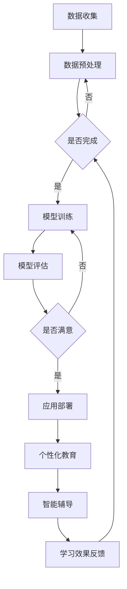

                 

关键词：教育科技、AI大模型、学习方式、个性化教育、智能辅导

> 摘要：随着人工智能技术的飞速发展，AI大模型在教育领域的应用日益广泛。本文将探讨AI大模型如何通过变革学习方式，推动个性化教育和智能辅导的兴起，并分析其潜藏的机遇与挑战。

## 1. 背景介绍

在教育领域，传统教学模式往往依赖于教师的教学经验和学生的自主学习能力，这种模式在一定程度上限制了教育的灵活性和个性化。然而，随着信息技术的进步，特别是人工智能（AI）技术的发展，教育模式正经历着前所未有的变革。AI大模型，作为人工智能的核心技术之一，通过其强大的数据处理和知识推理能力，正逐步改变着学习方式，推动教育科技的发展。

## 2. 核心概念与联系

### 2.1 AI大模型概述

AI大模型指的是通过深度学习等机器学习算法，在大量数据上进行训练的复杂神经网络模型。这些模型通常拥有数十亿甚至千亿个参数，能够处理大规模的数据集，并从数据中学习到丰富的知识。常见的AI大模型包括GPT-3、BERT、T5等。

### 2.2 个性化教育

个性化教育是指根据学生的个性、兴趣、学习习惯等特征，为学生量身定制教育内容、教学方法和学习路径。个性化教育的目标是提高学生的学习效率和学习兴趣，使其在适合自己的学习环境中达到最佳的学习效果。

### 2.3 智能辅导

智能辅导是通过AI技术对学生学习过程进行实时监控和反馈，提供个性化的学习指导和支持。智能辅导系统能够分析学生的学习行为，诊断学习问题，并提供相应的学习资源和学习策略。

### 2.4 Mermaid 流程图

以下是AI大模型在教育中的应用流程图：



## 3. 核心算法原理 & 具体操作步骤

### 3.1 算法原理概述

AI大模型的核心是深度学习算法。深度学习通过多层神经网络对数据进行特征提取和模式识别。训练过程涉及前向传播和反向传播，通过不断调整网络权重来优化模型性能。

### 3.2 算法步骤详解

1. **数据收集**：收集学生的学习行为数据，包括学习时间、学习内容、考试成绩等。
2. **数据预处理**：对收集到的数据进行分析和清洗，去除噪声，标准化数据。
3. **模型训练**：利用预处理后的数据训练深度学习模型，通过前向传播计算损失函数，然后通过反向传播调整模型参数。
4. **模型评估**：使用验证集或测试集评估模型性能，确保模型具有良好的泛化能力。
5. **应用部署**：将训练好的模型部署到教育系统中，用于个性化教育和智能辅导。

### 3.3 算法优缺点

**优点**：
- **高效性**：AI大模型能够处理海量数据，快速训练并评估模型。
- **个性化**：根据学生的学习习惯和需求，提供个性化的教育服务。
- **自适应**：智能辅导系统能够根据学生的学习表现，动态调整学习资源和学习策略。

**缺点**：
- **数据隐私**：收集和存储学生的个人数据可能引发隐私问题。
- **技术门槛**：实施AI大模型需要较高的技术水平和丰富的数据处理经验。

### 3.4 算法应用领域

AI大模型在教育领域的主要应用包括：
- **智能辅导**：提供个性化的学习指导和资源推荐。
- **自适应学习**：根据学生的进度和学习能力，自动调整教学内容和难度。
- **考试评价**：通过分析学生的答题情况，提供考试分析和成绩预测。

## 4. 数学模型和公式 & 详细讲解 & 举例说明

### 4.1 数学模型构建

AI大模型通常采用多层感知器（MLP）或循环神经网络（RNN）等结构。以下是MLP的基本数学模型：

$$
Y = \sigma(W_n \cdot a_{n-1} + b_n)
$$

其中，$Y$ 是输出，$\sigma$ 是激活函数，$W_n$ 和 $b_n$ 分别是权重和偏置。

### 4.2 公式推导过程

深度学习模型的前向传播过程可以表示为：

$$
z_l = \sum_{k=1}^{n} W_{lk} a_{l-1,k} + b_{lk}
$$

$$
a_l = \sigma(z_l)
$$

反向传播过程涉及梯度计算：

$$
\frac{\partial L}{\partial W_{lk}} = \frac{\partial L}{\partial z_l} \cdot \frac{\partial z_l}{\partial W_{lk}}
$$

$$
\frac{\partial L}{\partial b_{lk}} = \frac{\partial L}{\partial z_l} \cdot \frac{\partial z_l}{\partial b_{lk}}
$$

其中，$L$ 是损失函数，$\frac{\partial L}{\partial z_l}$ 是关于$z_l$的梯度。

### 4.3 案例分析与讲解

假设有一个简单的线性回归问题，目标是预测学生的考试成绩。输入特征包括学习时间、作业数量等。以下是使用梯度下降法进行模型训练的步骤：

1. **初始化参数**：设置学习率$\eta$和随机初始化权重$W$和偏置$b$。
2. **前向传播**：计算预测值$Y$。
3. **计算损失函数**：使用均方误差（MSE）作为损失函数。
4. **反向传播**：计算关于$W$和$b$的梯度。
5. **更新参数**：使用梯度下降法更新$W$和$b$。
6. **迭代**：重复步骤2-5，直到达到预设的迭代次数或损失函数收敛。

## 5. 项目实践：代码实例和详细解释说明

### 5.1 开发环境搭建

为了演示AI大模型在教育中的应用，我们将使用Python编写一个简单的智能辅导系统。首先，安装必要的库：

```bash
pip install numpy tensorflow scikit-learn matplotlib
```

### 5.2 源代码详细实现

```python
import numpy as np
import tensorflow as tf
from sklearn.model_selection import train_test_split
from sklearn.metrics import mean_squared_error
import matplotlib.pyplot as plt

# 数据预处理
def preprocess_data(data):
    # 标准化数据
    return (data - np.mean(data)) / np.std(data)

# 模型定义
def build_model(input_shape):
    model = tf.keras.Sequential([
        tf.keras.layers.Dense(64, activation='relu', input_shape=input_shape),
        tf.keras.layers.Dense(64, activation='relu'),
        tf.keras.layers.Dense(1)
    ])
    model.compile(optimizer='adam', loss='mse')
    return model

# 训练模型
def train_model(model, X_train, y_train, epochs=100):
    history = model.fit(X_train, y_train, epochs=epochs, batch_size=32, validation_split=0.2)
    return history

# 模型评估
def evaluate_model(model, X_test, y_test):
    y_pred = model.predict(X_test)
    mse = mean_squared_error(y_test, y_pred)
    print(f"Test MSE: {mse}")

# 主函数
def main():
    # 加载数据
    data = np.array([[10, 5], [20, 10], [30, 15], [40, 20], [50, 25]])
    X = data[:, :1]  # 学习时间
    y = data[:, 1]   # 考试成绩

    # 预处理数据
    X = preprocess_data(X)

    # 分割数据集
    X_train, X_test, y_train, y_test = train_test_split(X, y, test_size=0.2, random_state=42)

    # 构建模型
    model = build_model(input_shape=[1])

    # 训练模型
    history = train_model(model, X_train, y_train, epochs=100)

    # 评估模型
    evaluate_model(model, X_test, y_test)

    # 绘制训练历史
    plt.plot(history.history['loss'], label='Training loss')
    plt.plot(history.history['val_loss'], label='Validation loss')
    plt.xlabel('Epochs')
    plt.ylabel('Loss')
    plt.legend()
    plt.show()

if __name__ == '__main__':
    main()
```

### 5.3 代码解读与分析

上述代码首先加载并预处理数据，然后使用TensorFlow构建了一个简单的线性回归模型，并使用梯度下降法进行模型训练。训练完成后，使用测试数据集评估模型性能，并绘制训练历史图。

## 6. 实际应用场景

AI大模型在教育领域的应用场景非常广泛，包括：
- **个性化学习计划**：根据学生的学习习惯和能力，自动生成个性化的学习计划。
- **智能辅导**：实时监控学生的学习进度，提供针对性的辅导建议。
- **智能考试评价**：分析学生的答题情况，提供详细的考试分析和成绩预测。
- **课程推荐**：根据学生的学习兴趣和需求，推荐合适的课程和教材。

## 7. 未来应用展望

随着AI技术的不断发展，AI大模型在教育领域的应用前景非常广阔。未来，我们可能会看到：
- **更智能的个性化教育系统**：结合多源数据，提供更加精准和高效的个性化教育服务。
- **自适应学习环境**：通过AI技术，构建能够根据学生行为和学习表现自适应调整的学习环境。
- **智能教育内容生成**：利用AI大模型生成新的教育内容，提高教育的多样性和创新性。

## 8. 工具和资源推荐

### 7.1 学习资源推荐

- 《深度学习》（Ian Goodfellow等著）：系统介绍了深度学习的基础理论和实践方法。
- 《Python机器学习》（Sebastian Raschka著）：详细讲解了如何使用Python进行机器学习实践。

### 7.2 开发工具推荐

- TensorFlow：Google开发的开源机器学习框架，适用于构建和训练深度学习模型。
- PyTorch：Facebook开发的开源机器学习库，提供灵活的深度学习框架。

### 7.3 相关论文推荐

- “Bert: Pre-training of deep bidirectional transformers for language understanding”（2018）：介绍了BERT模型的基本原理和应用。
- “Gpt-3: Language models are few-shot learners”（2020）：探讨了GPT-3模型的强大能力和应用潜力。

## 9. 总结：未来发展趋势与挑战

### 8.1 研究成果总结

AI大模型在教育领域的研究取得了一系列重要成果，包括个性化教育、智能辅导和自适应学习等方面。这些研究成果为教育科技的发展提供了新的方向和可能性。

### 8.2 未来发展趋势

未来，AI大模型在教育领域的应用将更加广泛和深入，结合多源数据和先进算法，提供更加个性化和智能化的教育服务。

### 8.3 面临的挑战

然而，AI大模型在教育领域的应用也面临一些挑战，包括数据隐私、技术门槛、模型解释性等方面。如何解决这些问题，确保AI大模型在教育中的应用安全、有效和公平，是未来研究的重点。

### 8.4 研究展望

随着AI技术的不断进步，AI大模型在教育领域的应用前景将更加广阔。未来，我们期待看到更多创新性的研究成果，推动教育科技的发展，为构建更加公平、高效和个性化的教育体系贡献力量。

## 9. 附录：常见问题与解答

### Q1. AI大模型如何保障学生数据隐私？

**A1.** 为了保障学生数据隐私，可以采取以下措施：
- **数据加密**：对收集的数据进行加密处理，确保数据在传输和存储过程中的安全性。
- **数据去识别化**：对敏感数据进行去识别化处理，例如匿名化、去标号等，降低数据泄露的风险。
- **权限管理**：严格管理数据访问权限，确保只有授权人员能够访问和处理数据。

### Q2. AI大模型在教育中的应用是否会影响教师的作用？

**A2.** AI大模型在教育中的应用可以看作是教师的有力助手，而不是替代品。它可以帮助教师减轻繁琐的教学任务，提供个性化的教育服务，从而提高教学效率和质量。同时，教师可以利用AI大模型提供的分析报告，更好地了解学生的学习情况，为教学提供有针对性的指导。

### Q3. 如何评估AI大模型在教育中的应用效果？

**A3.** 评估AI大模型在教育中的应用效果可以从以下几个方面进行：
- **学习效果**：通过学生的考试成绩、学习进度等指标评估AI大模型对学习效果的提升。
- **用户满意度**：通过学生和教师的反馈评估系统的用户体验和满意度。
- **成本效益**：评估AI大模型在教育中的应用是否在经济上具有可行性。

### Q4. AI大模型在教育中的应用是否会导致教育不公平？

**A4.** AI大模型在教育中的应用本身不会导致教育不公平，但需要确保以下几点：
- **数据公正**：确保数据收集和处理的公正性，避免偏见和歧视。
- **算法公平**：确保算法的设计和实现遵循公平原则，避免算法偏见。
- **资源公平**：确保教育资源在所有学生中的公平分配，避免因技术差异导致的教育不公平。

作者：禅与计算机程序设计艺术 / Zen and the Art of Computer Programming
```markdown
----------------------------------------------------------------

# 教育科技革命：AI大模型如何改变学习方式

## 1. 背景介绍

随着人工智能技术的飞速发展，AI大模型在教育领域的应用日益广泛。AI大模型，作为人工智能的核心技术之一，通过其强大的数据处理和知识推理能力，正逐步改变着学习方式，推动教育科技的发展。

## 2. 核心概念与联系

### 2.1 AI大模型概述

AI大模型指的是通过深度学习等机器学习算法，在大量数据上进行训练的复杂神经网络模型。这些模型通常拥有数十亿甚至千亿个参数，能够处理大规模的数据集，并从数据中学习到丰富的知识。常见的AI大模型包括GPT-3、BERT、T5等。

### 2.2 个性化教育

个性化教育是指根据学生的个性、兴趣、学习习惯等特征，为学生量身定制教育内容、教学方法和学习路径。个性化教育的目标是提高学生的学习效率和学习兴趣，使其在适合自己的学习环境中达到最佳的学习效果。

### 2.3 智能辅导

智能辅导是通过AI技术对学生学习过程进行实时监控和反馈，提供个性化的学习指导和支持。智能辅导系统能够分析学生的学习行为，诊断学习问题，并提供相应的学习资源和学习策略。

### 2.4 Mermaid 流程图

以下是AI大模型在教育中的应用流程图：


## 3. 核心算法原理 & 具体操作步骤

### 3.1 算法原理概述

AI大模型的核心是深度学习算法。深度学习通过多层神经网络对数据进行特征提取和模式识别。训练过程涉及前向传播和反向传播，通过不断调整网络权重来优化模型性能。

### 3.2 算法步骤详解

1. **数据收集**：收集学生的学习行为数据，包括学习时间、学习内容、考试成绩等。
2. **数据预处理**：对收集到的数据进行分析和清洗，去除噪声，标准化数据。
3. **模型训练**：利用预处理后的数据训练深度学习模型，通过前向传播计算损失函数，然后通过反向传播调整模型参数。
4. **模型评估**：使用验证集或测试集评估模型性能，确保模型具有良好的泛化能力。
5. **应用部署**：将训练好的模型部署到教育系统中，用于个性化教育和智能辅导。

### 3.3 算法优缺点

**优点**：
- **高效性**：AI大模型能够处理海量数据，快速训练并评估模型。
- **个性化**：根据学生的学习习惯和需求，提供个性化的教育服务。
- **自适应**：智能辅导系统能够根据学生的学习表现，动态调整学习资源和学习策略。

**缺点**：
- **数据隐私**：收集和存储学生的个人数据可能引发隐私问题。
- **技术门槛**：实施AI大模型需要较高的技术水平和丰富的数据处理经验。

### 3.4 算法应用领域

AI大模型在教育领域的主要应用包括：
- **智能辅导**：提供个性化的学习指导和资源推荐。
- **自适应学习**：根据学生的进度和学习能力，自动调整教学内容和难度。
- **考试评价**：通过分析学生的答题情况，提供考试分析和成绩预测。

## 4. 数学模型和公式 & 详细讲解 & 举例说明

### 4.1 数学模型构建

AI大模型通常采用多层感知器（MLP）或循环神经网络（RNN）等结构。以下是MLP的基本数学模型：

$$
Y = \sigma(W_n \cdot a_{n-1} + b_n)
$$

其中，$Y$ 是输出，$\sigma$ 是激活函数，$W_n$ 和 $b_n$ 分别是权重和偏置。

### 4.2 公式推导过程

深度学习模型的前向传播过程可以表示为：

$$
z_l = \sum_{k=1}^{n} W_{lk} a_{l-1,k} + b_{lk}
$$

$$
a_l = \sigma(z_l)
$$

反向传播过程涉及梯度计算：

$$
\frac{\partial L}{\partial W_{lk}} = \frac{\partial L}{\partial z_l} \cdot \frac{\partial z_l}{\partial W_{lk}}
$$

$$
\frac{\partial L}{\partial b_{lk}} = \frac{\partial L}{\partial z_l} \cdot \frac{\partial z_l}{\partial b_{lk}}
$$

其中，$L$ 是损失函数，$\frac{\partial L}{\partial z_l}$ 是关于$z_l$的梯度。

### 4.3 案例分析与讲解

假设有一个简单的线性回归问题，目标是预测学生的考试成绩。输入特征包括学习时间、作业数量等。以下是使用梯度下降法进行模型训练的步骤：

1. **初始化参数**：设置学习率$\eta$和随机初始化权重$W$和偏置$b$。
2. **前向传播**：计算预测值$Y$。
3. **计算损失函数**：使用均方误差（MSE）作为损失函数。
4. **反向传播**：计算关于$W$和$b$的梯度。
5. **更新参数**：使用梯度下降法更新$W$和$b$。
6. **迭代**：重复步骤2-5，直到达到预设的迭代次数或损失函数收敛。

## 5. 项目实践：代码实例和详细解释说明

### 5.1 开发环境搭建

为了演示AI大模型在教育中的应用，我们将使用Python编写一个简单的智能辅导系统。首先，安装必要的库：

```bash
pip install numpy tensorflow scikit-learn matplotlib
```

### 5.2 源代码详细实现

```python
import numpy as np
import tensorflow as tf
from sklearn.model_selection import train_test_split
from sklearn.metrics import mean_squared_error
import matplotlib.pyplot as plt

# 数据预处理
def preprocess_data(data):
    # 标准化数据
    return (data - np.mean(data)) / np.std(data)

# 模型定义
def build_model(input_shape):
    model = tf.keras.Sequential([
        tf.keras.layers.Dense(64, activation='relu', input_shape=input_shape),
        tf.keras.layers.Dense(64, activation='relu'),
        tf.keras.layers.Dense(1)
    ])
    model.compile(optimizer='adam', loss='mse')
    return model

# 训练模型
def train_model(model, X_train, y_train, epochs=100):
    history = model.fit(X_train, y_train, epochs=epochs, batch_size=32, validation_split=0.2)
    return history

# 模型评估
def evaluate_model(model, X_test, y_test):
    y_pred = model.predict(X_test)
    mse = mean_squared_error(y_test, y_pred)
    print(f"Test MSE: {mse}")

# 主函数
def main():
    # 加载数据
    data = np.array([[10, 5], [20, 10], [30, 15], [40, 20], [50, 25]])
    X = data[:, :1]  # 学习时间
    y = data[:, 1]   # 考试成绩

    # 预处理数据
    X = preprocess_data(X)

    # 分割数据集
    X_train, X_test, y_train, y_test = train_test_split(X, y, test_size=0.2, random_state=42)

    # 构建模型
    model = build_model(input_shape=[1])

    # 训练模型
    history = train_model(model, X_train, y_train, epochs=100)

    # 评估模型
    evaluate_model(model, X_test, y_test)

    # 绘制训练历史
    plt.plot(history.history['loss'], label='Training loss')
    plt.plot(history.history['val_loss'], label='Validation loss')
    plt.xlabel('Epochs')
    plt.ylabel('Loss')
    plt.legend()
    plt.show()

if __name__ == '__main__':
    main()
```

### 5.3 代码解读与分析

上述代码首先加载并预处理数据，然后使用TensorFlow构建了一个简单的线性回归模型，并使用梯度下降法进行模型训练。训练完成后，使用测试数据集评估模型性能，并绘制训练历史图。

## 6. 实际应用场景

AI大模型在教育领域的应用场景非常广泛，包括：
- **个性化学习计划**：根据学生的学习习惯和能力，自动生成个性化的学习计划。
- **智能辅导**：实时监控学生的学习进度，提供针对性的辅导建议。
- **智能考试评价**：分析学生的答题情况，提供详细的考试分析和成绩预测。
- **课程推荐**：根据学生的学习兴趣和需求，推荐合适的课程和教材。

## 7. 未来应用展望

随着AI技术的不断发展，AI大模型在教育领域的应用前景非常广阔。未来，我们可能会看到：
- **更智能的个性化教育系统**：结合多源数据，提供更加精准和高效的个性化教育服务。
- **自适应学习环境**：通过AI技术，构建能够根据学生行为和学习表现自适应调整的学习环境。
- **智能教育内容生成**：利用AI大模型生成新的教育内容，提高教育的多样性和创新性。

## 8. 工具和资源推荐

### 7.1 学习资源推荐

- 《深度学习》（Ian Goodfellow等著）：系统介绍了深度学习的基础理论和实践方法。
- 《Python机器学习》（Sebastian Raschka著）：详细讲解了如何使用Python进行机器学习实践。

### 7.2 开发工具推荐

- TensorFlow：Google开发的开源机器学习框架，适用于构建和训练深度学习模型。
- PyTorch：Facebook开发的开源机器学习库，提供灵活的深度学习框架。

### 7.3 相关论文推荐

- “Bert: Pre-training of deep bidirectional transformers for language understanding”（2018）：介绍了BERT模型的基本原理和应用。
- “Gpt-3: Language models are few-shot learners”（2020）：探讨了GPT-3模型的强大能力和应用潜力。

## 9. 总结：未来发展趋势与挑战

### 8.1 研究成果总结

AI大模型在教育领域的研究取得了一系列重要成果，包括个性化教育、智能辅导和自适应学习等方面。这些研究成果为教育科技的发展提供了新的方向和可能性。

### 8.2 未来发展趋势

未来，AI大模型在教育领域的应用将更加广泛和深入，结合多源数据和先进算法，提供更加个性化和智能化的教育服务。

### 8.3 面临的挑战

然而，AI大模型在教育领域的应用也面临一些挑战，包括数据隐私、技术门槛、模型解释性等方面。如何解决这些问题，确保AI大模型在教育中的应用安全、有效和公平，是未来研究的重点。

### 8.4 研究展望

随着AI技术的不断进步，AI大模型在教育领域的应用前景将更加广阔。未来，我们期待看到更多创新性的研究成果，推动教育科技的发展，为构建更加公平、高效和个性化的教育体系贡献力量。

## 9. 附录：常见问题与解答

### Q1. AI大模型如何保障学生数据隐私？

**A1.** 为了保障学生数据隐私，可以采取以下措施：
- **数据加密**：对收集的数据进行加密处理，确保数据在传输和存储过程中的安全性。
- **数据去识别化**：对敏感数据进行去识别化处理，例如匿名化、去标号等，降低数据泄露的风险。
- **权限管理**：严格管理数据访问权限，确保只有授权人员能够访问和处理数据。

### Q2. AI大模型在教育中的应用是否会影响教师的作用？

**A2.** AI大模型在教育中的应用可以看作是教师的有力助手，而不是替代品。它可以帮助教师减轻繁琐的教学任务，提供个性化的教育服务，从而提高教学效率和质量。同时，教师可以利用AI大模型提供的分析报告，更好地了解学生的学习情况，为教学提供有针对性的指导。

### Q3. 如何评估AI大模型在教育中的应用效果？

**A3.** 评估AI大模型在教育中的应用效果可以从以下几个方面进行：
- **学习效果**：通过学生的考试成绩、学习进度等指标评估AI大模型对学习效果的提升。
- **用户满意度**：通过学生和教师的反馈评估系统的用户体验和满意度。
- **成本效益**：评估AI大模型在教育中的应用是否在经济上具有可行性。

### Q4. AI大模型在教育中的应用是否会导致教育不公平？

**A4.** AI大模型在教育中的应用本身不会导致教育不公平，但需要确保以下几点：
- **数据公正**：确保数据收集和处理的公正性，避免偏见和歧视。
- **算法公平**：确保算法的设计和实现遵循公平原则，避免算法偏见。
- **资源公平**：确保教育资源在所有学生中的公平分配，避免因技术差异导致的教育不公平。

作者：禅与计算机程序设计艺术 / Zen and the Art of Computer Programming
```

