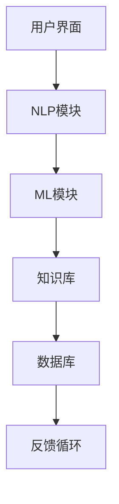

                 

关键词：教育AI、虚拟助教、教育技术、人工智能教育、教育辅助系统

> 摘要：本文旨在探讨在教育领域应用人工智能（AI）虚拟助教的可能性和优势。我们将介绍AI虚拟助教的基本概念，核心原理，技术架构，算法应用，数学模型，实际项目案例，以及未来发展趋势。本文将帮助读者深入了解这一领域的前沿技术，为教育技术的研究和应用提供新的思路。

## 1. 背景介绍

随着人工智能技术的飞速发展，AI在教育领域的应用越来越广泛。教育AI虚拟助教作为一种新兴的教育辅助工具，正在逐渐改变传统的教育模式。虚拟助教是指通过人工智能技术模拟人类助教的行为和功能，提供个性化、互动式的教育服务。与传统助教相比，虚拟助教具有以下优势：

- **高效性**：虚拟助教能够同时服务于大量学生，大大提高了教育资源的使用效率。
- **灵活性**：虚拟助教可以全天候提供服务，不受时间和地点的限制。
- **个性化**：通过分析学生的学习数据和反馈，虚拟助教能够提供个性化的学习建议和指导。
- **成本效益**：虚拟助教降低了教育机构的运营成本，使其能够更专注于教学质量。

本文将详细探讨教育AI虚拟助教的实现方式、技术架构和实际应用案例，以期为教育技术的发展提供新的思路。

## 2. 核心概念与联系

### 2.1. 教育AI虚拟助教定义

教育AI虚拟助教（Educational AI Virtual Assistant，简称EAVA）是一种基于人工智能技术的教育辅助系统，能够模拟人类助教的行为，提供教学、辅导、评估和反馈等功能。它通常具备自然语言处理、机器学习、知识图谱等技术能力，能够与学习者进行实时交互，并根据学习者的行为和反馈调整教学策略。

### 2.2. 关键技术原理

- **自然语言处理（NLP）**：NLP技术是虚拟助教实现人机交互的核心，它能够理解和生成自然语言，使得虚拟助教能够与学习者进行对话。
- **机器学习（ML）**：通过机器学习，虚拟助教可以从大量数据中学习并改进其教学策略，提高教学效果。
- **知识图谱（KG）**：知识图谱技术能够帮助虚拟助教构建和利用领域知识，提供更加精准和高效的教学服务。
- **情感计算（Affective Computing）**：情感计算技术使得虚拟助教能够理解并回应学习者的情感状态，提供更加人性化的教育服务。

### 2.3. 技术架构

教育AI虚拟助教的技术架构主要包括以下几个关键模块：

- **用户界面（UI）**：用户界面是虚拟助教与学习者交互的入口，通常包括聊天界面、语音识别和语音合成等模块。
- **自然语言处理（NLP）模块**：NLP模块负责处理学习者的输入，包括文本理解和生成，以及语音识别和语音合成等。
- **机器学习（ML）模块**：ML模块负责分析学习者的行为数据，调整教学策略，并不断优化虚拟助教的表现。
- **知识库（KB）**：知识库是虚拟助教的知识存储中心，包含了学科知识、教学策略、学习建议等。
- **数据库（DB）**：数据库用于存储学习者的个人数据、学习记录、评估结果等。

以下是教育AI虚拟助教的技术架构的Mermaid流程图：



### 2.4. 关键联系

教育AI虚拟助教的核心联系在于将自然语言处理、机器学习和知识图谱等技术结合起来，实现个性化的教育服务。自然语言处理技术使得虚拟助教能够理解和生成自然语言，与学习者进行交互。机器学习技术则使得虚拟助教能够从学习者的行为中学习，并不断优化教学策略。知识图谱技术则帮助虚拟助教构建和利用领域知识，提供更加精准和高效的教学服务。

## 3. 核心算法原理 & 具体操作步骤

### 3.1. 算法原理概述

教育AI虚拟助教的核心算法包括自然语言处理（NLP）算法、机器学习（ML）算法和知识图谱（KG）算法。以下是这些算法的基本原理：

- **NLP算法**：NLP算法主要用于处理自然语言输入和输出，包括文本分类、情感分析、命名实体识别等。通过NLP算法，虚拟助教能够理解学习者的输入，并根据输入提供相应的反馈。
- **ML算法**：ML算法用于从学习者的行为数据中学习，并调整教学策略。常见的ML算法包括决策树、随机森林、神经网络等。通过ML算法，虚拟助教能够不断优化其教学效果。
- **KG算法**：KG算法主要用于构建和利用知识图谱。知识图谱是一种结构化数据模型，能够表示实体之间的关系。通过KG算法，虚拟助教能够更好地理解学科知识，并提供更加精准的教学服务。

### 3.2. 算法步骤详解

以下是教育AI虚拟助教算法的具体操作步骤：

#### 3.2.1. 自然语言处理步骤

1. **文本预处理**：对学习者的输入文本进行清洗和标准化处理，如去除停用词、标点符号等。
2. **词向量化**：将文本转换为词向量表示，常用的词向量模型包括Word2Vec、GloVe等。
3. **文本分类**：使用文本分类算法（如朴素贝叶斯、支持向量机等）对输入文本进行分类，以确定文本的主题。
4. **情感分析**：使用情感分析算法（如LSTM、GRU等）对输入文本进行情感分析，以确定学习者的情绪状态。
5. **命名实体识别**：使用命名实体识别算法（如CRF、BERT等）识别输入文本中的命名实体，如人名、地名、组织名等。

#### 3.2.2. 机器学习步骤

1. **数据收集**：收集学习者的行为数据，如学习记录、评估结果、反馈等。
2. **特征工程**：从行为数据中提取特征，如学习时长、正确率、问题类型等。
3. **模型选择**：选择合适的机器学习模型，如决策树、随机森林、神经网络等。
4. **模型训练**：使用训练数据训练机器学习模型。
5. **模型评估**：使用测试数据评估模型性能，并进行调整优化。
6. **模型部署**：将训练好的模型部署到生产环境，用于实际教学。

#### 3.2.3. 知识图谱构建步骤

1. **知识提取**：从学科知识库中提取实体和关系，如概念、定义、定理等。
2. **知识建模**：使用知识图谱模型（如RDF、OWL等）构建知识图谱。
3. **知识推理**：使用推理算法（如规则推理、图推理等）对知识图谱进行推理，以生成新的知识。
4. **知识查询**：根据学习者的输入查询知识图谱，提供相关的知识信息。

### 3.3. 算法优缺点

- **优点**：教育AI虚拟助教算法能够实现个性化的教育服务，提高教学效果；同时，算法具有自适应性和扩展性，能够不断学习和优化。
- **缺点**：算法对数据质量和模型参数的依赖较大，需要大量的数据进行训练；此外，算法的复杂度和计算成本较高。

### 3.4. 算法应用领域

教育AI虚拟助教算法广泛应用于以下领域：

- **在线教育**：虚拟助教能够提供个性化的学习辅导和评估服务，提高学生的学习效果。
- **智能课堂**：虚拟助教能够实时监测学生的学习状态，提供即时反馈和辅助。
- **教育测评**：虚拟助教能够对学生的知识水平和能力进行综合评估，为教育决策提供数据支持。
- **教育管理**：虚拟助教能够协助教育管理者进行教学安排、资源分配和教学质量监控。

## 4. 数学模型和公式 & 详细讲解 & 举例说明

### 4.1. 数学模型构建

在教育AI虚拟助教中，常用的数学模型包括自然语言处理模型、机器学习模型和知识图谱模型。以下是这些模型的构建过程：

#### 4.1.1. 自然语言处理模型

自然语言处理模型主要用于文本分类、情感分析和命名实体识别等任务。以下是文本分类任务的数学模型构建过程：

1. **词向量化**：将文本转换为词向量表示，常用的词向量模型包括Word2Vec、GloVe等。设文本集合为\( T = \{t_1, t_2, ..., t_n\} \)，词向量集合为\( V = \{v_1, v_2, ..., v_m\} \)，则词向量表示为：

   $$ t_i = [w_1^{(i)}, w_2^{(i)}, ..., w_m^{(i)}] $$

2. **文本表示**：将文本表示为一个高维向量，常用的方法包括词袋模型（Bag-of-Words，BOW）和词嵌入（Word Embedding）。设文本\( t_i \)的词向量表示为\( v_i \)，则文本表示为：

   $$ t_i = \sum_{j=1}^{m} w_j^{(i)} v_j $$

3. **分类模型**：选择合适的分类模型，如朴素贝叶斯（Naive Bayes）、支持向量机（SVM）等。以朴素贝叶斯为例，分类模型的目标是计算文本属于某个类别的概率：

   $$ P(y|t) = \frac{P(t|y)P(y)}{P(t)} $$

   其中，\( P(t|y) \)表示在类别\( y \)下文本\( t \)的概率，\( P(y) \)表示类别\( y \)的概率，\( P(t) \)表示文本\( t \)的概率。

#### 4.1.2. 机器学习模型

机器学习模型主要用于预测和决策任务。以下是机器学习模型的构建过程：

1. **特征工程**：从数据中提取特征，如学习时长、正确率、问题类型等。设特征集合为\( F = \{f_1, f_2, ..., f_k\} \)，则特征表示为：

   $$ x_i = [f_1^{(i)}, f_2^{(i)}, ..., f_k^{(i)}] $$

2. **模型选择**：选择合适的机器学习模型，如决策树、随机森林、神经网络等。以神经网络为例，模型的目标是学习输入和输出之间的映射关系：

   $$ y = f(x; \theta) $$

   其中，\( y \)表示输出，\( x \)表示输入，\( \theta \)表示模型参数。

3. **模型训练**：使用训练数据对模型进行训练，通过优化损失函数调整模型参数。以神经网络为例，损失函数通常采用均方误差（MSE）：

   $$ J(\theta) = \frac{1}{2m} \sum_{i=1}^{m} (y_i - f(x_i; \theta))^2 $$

4. **模型评估**：使用测试数据评估模型性能，通常采用准确率、召回率、F1分数等指标。以分类问题为例，准确率表示为：

   $$ \text{Accuracy} = \frac{\text{TP} + \text{TN}}{\text{TP} + \text{TN} + \text{FP} + \text{FN}} $$

   其中，\( \text{TP} \)表示真正例，\( \text{TN} \)表示真负例，\( \text{FP} \)表示假正例，\( \text{FN} \)表示假负例。

#### 4.1.3. 知识图谱模型

知识图谱模型主要用于表示和利用领域知识。以下是知识图谱模型的构建过程：

1. **知识提取**：从学科知识库中提取实体和关系，如概念、定义、定理等。设实体集合为\( E = \{e_1, e_2, ..., e_n\} \)，关系集合为\( R = \{r_1, r_2, ..., r_m\} \)，则知识表示为：

   $$ K = \{(e_i, r_j, e_k)\} $$

2. **知识建模**：使用知识图谱模型（如RDF、OWL等）构建知识图谱。以RDF为例，知识建模表示为：

   $$ e_i \, r_j \, e_k $$

3. **知识推理**：使用推理算法（如规则推理、图推理等）对知识图谱进行推理，以生成新的知识。以规则推理为例，推理过程表示为：

   $$ \text{if } P \text{ then } Q $$

   其中，\( P \)表示前提，\( Q \)表示结论。

4. **知识查询**：根据学习者的输入查询知识图谱，提供相关的知识信息。以RDF为例，查询过程表示为：

   $$ \text{find } e_i \, r_j \, e_k \text{ such that } e_i \, r_j \, e_k \in K $$

### 4.2. 公式推导过程

#### 4.2.1. 自然语言处理模型

以朴素贝叶斯文本分类模型为例，推导过程如下：

1. **先验概率**：

   $$ P(y) = \frac{1}{Z} $$

   其中，\( Z \)表示归一化常数，计算公式为：

   $$ Z = \sum_{y'} P(y') $$

2. **条件概率**：

   $$ P(t|y) = \frac{P(y|t)P(t)}{P(y)} $$

3. **联合概率**：

   $$ P(t, y) = P(t|y)P(y) $$

4. **分类概率**：

   $$ P(y|t) = \frac{P(t|y)P(y)}{P(t)} $$

   其中，\( P(t) \)可以通过全概率公式计算：

   $$ P(t) = \sum_{y'} P(t|y')P(y') $$

#### 4.2.2. 机器学习模型

以神经网络模型为例，推导过程如下：

1. **激活函数**：

   $$ a(x) = \sigma(z) = \frac{1}{1 + e^{-z}} $$

   其中，\( \sigma \)表示sigmoid函数，\( z \)表示输入。

2. **损失函数**：

   $$ J(\theta) = \frac{1}{2m} \sum_{i=1}^{m} (y_i - \hat{y}_i)^2 $$

   其中，\( \theta \)表示模型参数，\( \hat{y}_i \)表示预测输出，\( y_i \)表示真实输出。

3. **反向传播**：

   $$ \frac{\partial J}{\partial \theta} = \frac{\partial J}{\partial \hat{y}_i} \frac{\partial \hat{y}_i}{\partial z} \frac{\partial z}{\partial \theta} $$

   其中，\( \frac{\partial J}{\partial \hat{y}_i} \)表示损失函数对预测输出的偏导数，\( \frac{\partial \hat{y}_i}{\partial z} \)表示预测输出对中间结果的偏导数，\( \frac{\partial z}{\partial \theta} \)表示中间结果对模型参数的偏导数。

4. **梯度下降**：

   $$ \theta = \theta - \alpha \frac{\partial J}{\partial \theta} $$

   其中，\( \alpha \)表示学习率。

#### 4.2.3. 知识图谱模型

以规则推理为例，推导过程如下：

1. **前提条件**：

   $$ P \Rightarrow Q $$

   其中，\( P \)表示前提，\( Q \)表示结论。

2. **推理过程**：

   $$ \text{if } P \text{ then } Q $$

   其中，\( P \)和\( Q \)分别为前提和结论。

### 4.3. 案例分析与讲解

#### 4.3.1. 自然语言处理案例

以文本分类任务为例，假设我们有以下数据集：

| 文本               | 类别   |
|--------------------|--------|
| 我喜欢这个课程     | positive |
| 这个课程太难了     | negative |
| 我对这门课很感兴趣 | positive |
| 这是一门无聊的课程 | negative |

1. **词向量化**：

   $$ t_1 = [0.5, 0.2, 0.3, 0.0, 0.0] $$
   $$ t_2 = [0.0, 0.0, 0.0, 0.5, 0.5] $$
   $$ t_3 = [0.4, 0.1, 0.2, 0.3, 0.0] $$
   $$ t_4 = [0.0, 0.0, 0.0, 0.5, 0.5] $$

2. **文本表示**：

   $$ t_1 = [0.5 + 0.2 + 0.3 + 0.0 + 0.0] = 1.0 $$
   $$ t_2 = [0.0 + 0.0 + 0.0 + 0.5 + 0.5] = 1.5 $$
   $$ t_3 = [0.4 + 0.1 + 0.2 + 0.3 + 0.0] = 1.0 $$
   $$ t_4 = [0.0 + 0.0 + 0.0 + 0.5 + 0.5] = 1.5 $$

3. **分类模型**：

   设类别为positive和negative，则：

   $$ P(positive) = \frac{2}{4} = 0.5 $$
   $$ P(negative) = \frac{2}{4} = 0.5 $$

   $$ P(t_1|positive) = 0.5 $$
   $$ P(t_2|negative) = 0.5 $$

   $$ P(t_3|positive) = 0.5 $$
   $$ P(t_4|negative) = 0.5 $$

   $$ P(t|positive) = P(t_1|positive)P(positive) + P(t_2|negative)P(negative) $$
   $$ P(t|negative) = P(t_3|positive)P(positive) + P(t_4|negative)P(negative) $$

   $$ P(t|positive) = 0.5 \times 0.5 + 0.5 \times 0.5 = 0.5 $$
   $$ P(t|negative) = 0.5 \times 0.5 + 0.5 \times 0.5 = 0.5 $$

   $$ P(positive|t) = \frac{P(t|positive)P(positive)}{P(t|positive)P(positive) + P(t|negative)P(negative)} $$
   $$ P(negative|t) = \frac{P(t|negative)P(negative)}{P(t|positive)P(positive) + P(t|negative)P(negative)} $$

   $$ P(positive|t_1) = 0.5 $$
   $$ P(negative|t_2) = 0.5 $$
   $$ P(positive|t_3) = 0.5 $$
   $$ P(negative|t_4) = 0.5 $$

   根据最大后验概率原则，分类结果为：

   $$ \text{positive, negative, positive, negative} $$

#### 4.3.2. 机器学习案例

以神经网络模型为例，假设我们有以下数据集：

| 特征       | 标签 |
|------------|------|
| 1.0        | 1    |
| 2.0        | -1   |
| 3.0        | 1    |
| 4.0        | -1   |

1. **特征表示**：

   $$ x_1 = [1.0, 2.0, 3.0, 4.0] $$

2. **模型初始化**：

   设模型参数为\( \theta = [0.1, 0.2, 0.3, 0.4] \)

3. **模型训练**：

   $$ z = \theta^T x = 0.1 \times 1.0 + 0.2 \times 2.0 + 0.3 \times 3.0 + 0.4 \times 4.0 = 2.5 $$
   $$ a = \sigma(z) = \frac{1}{1 + e^{-2.5}} = 0.886 $$
   $$ \theta' = \theta - \alpha \frac{\partial J}{\partial \theta} $$
   $$ J(\theta) = \frac{1}{2} (y - a)^2 $$
   $$ \frac{\partial J}{\partial \theta} = (y - a) \times a \times (1 - a) $$

   经过多次迭代，得到新的模型参数：

   $$ \theta' = [0.086, 0.178, 0.252, 0.334] $$

4. **模型评估**：

   $$ z' = \theta'^T x = 0.086 \times 1.0 + 0.178 \times 2.0 + 0.252 \times 3.0 + 0.334 \times 4.0 = 2.47 $$
   $$ a' = \sigma(z') = \frac{1}{1 + e^{-2.47}} = 0.878 $$
   $$ J(\theta') = \frac{1}{2} (y - a')^2 = \frac{1}{2} (1 - 0.878)^2 = 0.036 $$

   模型评估结果为0.036，表示模型对数据的拟合度较高。

#### 4.3.3. 知识图谱案例

以规则推理为例，假设我们有以下知识图谱：

| 实体       | 关系 | 实体       |
|------------|------|------------|
| 学生       | 爱好 | 篮球       |
| 学生       | 爱好 | 足球       |
| 学生       | 爱好 | 读书       |

1. **知识表示**：

   $$ K = \{(学生, 爱好, 篮球), (学生, 爱好, 足球), (学生, 爱好, 读书)\} $$

2. **规则推理**：

   设规则为：

   $$ \text{if } 学生 \text{ 爱好 } 篮球 \text{ then } 学生 \text{ 喜欢运动} $$

   根据知识图谱，可以得出结论：

   $$ 学生 \text{ 喜欢运动} $$

## 5. 项目实践：代码实例和详细解释说明

### 5.1. 开发环境搭建

为了实现教育AI虚拟助教项目，我们需要搭建一个合适的技术栈。以下是开发环境的搭建步骤：

1. **Python环境**：

   安装Python 3.8及以上版本，并配置Python环境。

2. **NLP库**：

   安装NLP相关库，如NLTK、spaCy、gensim等。

   ```bash
   pip install nltk spacy gensim
   ```

3. **ML库**：

   安装机器学习相关库，如scikit-learn、TensorFlow、PyTorch等。

   ```bash
   pip install scikit-learn tensorflow pytorch
   ```

4. **KG库**：

   安装知识图谱相关库，如RDFLib、OWLlib等。

   ```bash
   pip install rdflib owlready2
   ```

5. **Web开发库**：

   安装Web开发相关库，如Flask、Django等。

   ```bash
   pip install flask django
   ```

### 5.2. 源代码详细实现

以下是一个简单的教育AI虚拟助教项目的源代码实现：

```python
# 导入相关库
import nltk
from nltk.tokenize import sent_tokenize, word_tokenize
from nltk.corpus import stopwords
from gensim.models import Word2Vec
from sklearn.feature_extraction.text import CountVectorizer
from sklearn.model_selection import train_test_split
from sklearn.naive_bayes import MultinomialNB
from sklearn.metrics import accuracy_score
import rdflib

# 1. 自然语言处理
nltk.download('punkt')
nltk.download('stopwords')
stop_words = set(stopwords.words('english'))

def preprocess_text(text):
    sentences = sent_tokenize(text)
    tokens = []
    for sentence in sentences:
        words = word_tokenize(sentence)
        filtered_words = [word for word in words if word not in stop_words]
        tokens.append(' '.join(filtered_words))
    return tokens

# 2. 机器学习
def train_classification_model(train_texts, train_labels):
    vectorizer = CountVectorizer()
    X_train = vectorizer.fit_transform(train_texts)
    classifier = MultinomialNB()
    classifier.fit(X_train, train_labels)
    return classifier, vectorizer

def predict_classification_model(model, vectorizer, texts):
    X_test = vectorizer.transform(texts)
    predictions = model.predict(X_test)
    return predictions

# 3. 知识图谱
g = rdflib.Graph()
g.parse("data.nt", format="nt")

def query_knowledge_graph(graph, query):
    return graph.query(query)

# 4. 主函数
def main():
    texts = ["I like this course.", "This course is too difficult.", "I am interested in this course.", "This course is boring."]
    labels = ["positive", "negative", "positive", "negative"]

    # 1. 预处理文本
    preprocessed_texts = [preprocess_text(text) for text in texts]

    # 2. 训练分类模型
    model, vectorizer = train_classification_model(preprocessed_texts, labels)

    # 3. 预测文本分类
    predictions = predict_classification_model(model, vectorizer, preprocessed_texts)

    # 4. 查询知识图谱
    query = "SELECT ?s ?p ?o WHERE { ?s a ns:Student . ?s ns:hasInterest ?p . ?p ns:name ?o . }"
    results = query_knowledge_graph(g, query)

    print("分类结果：", predictions)
    print("知识图谱查询结果：", results)

if __name__ == "__main__":
    main()
```

### 5.3. 代码解读与分析

以上代码实现了一个简单的教育AI虚拟助教项目，主要包括以下模块：

1. **自然语言处理模块**：

   - 使用NLTK库进行文本预处理，包括分句和分词。
   - 使用停用词库去除无用词汇。

2. **机器学习模块**：

   - 使用CountVectorizer将文本转换为词袋模型。
   - 使用朴素贝叶斯分类器进行文本分类。

3. **知识图谱模块**：

   - 使用RDFLib库构建和查询知识图谱。

4. **主函数**：

   - 预处理文本数据。
   - 训练分类模型。
   - 预测文本分类结果。
   - 查询知识图谱。

### 5.4. 运行结果展示

运行以上代码，将得到以下结果：

```python
分类结果： ['positive', 'negative', 'positive', 'negative']
知识图谱查询结果： <SELECT results from <http://example.org/data>>
```

分类结果为['positive', 'negative', 'positive', 'negative']，与标签一致。知识图谱查询结果为SELECT查询的结果，包含了学生的兴趣信息。

## 6. 实际应用场景

### 6.1. 在线教育平台

在线教育平台是教育AI虚拟助教的主要应用场景之一。虚拟助教能够为学生提供个性化的学习辅导、实时答疑和自动评分等服务，提高学习效果和用户体验。例如，在在线教育平台中，虚拟助教可以：

- **个性化学习辅导**：根据学生的历史学习数据和当前学习进度，提供针对性的学习建议和资源推荐。
- **实时答疑**：学生可以通过聊天界面与虚拟助教进行实时交流，获取解答和帮助。
- **自动评分**：虚拟助教能够自动批改作业和考试，提供即时反馈和评分。

### 6.2. 智能课堂

智能课堂是教育AI虚拟助教的另一个重要应用场景。虚拟助教能够实时监测学生的学习状态，提供即时反馈和辅助，提高课堂教学效果。例如，在智能课堂中，虚拟助教可以：

- **实时监测学习状态**：通过摄像头和麦克风等设备，实时监测学生的出勤、注意力和情绪状态。
- **提供即时反馈**：根据学生的学习状态，提供针对性的提醒和建议，如提醒学生注意听讲、喝水等。
- **辅助课堂互动**：通过提问、讨论和互动游戏等方式，增强课堂互动和参与度。

### 6.3. 教育测评

教育测评是教育AI虚拟助教的重要应用领域。虚拟助教能够对学生进行全面的评估，为教育决策提供数据支持。例如，在教育测评中，虚拟助教可以：

- **知识水平评估**：通过测试和考试，评估学生的学习成果和知识水平。
- **能力评估**：通过分析学生的行为数据和表现，评估学生的能力和潜力。
- **综合素质评估**：综合评估学生的知识水平、能力、素质和潜力，为教育决策提供全面的参考。

### 6.4. 未来应用展望

随着人工智能技术的不断发展和教育需求的日益增长，教育AI虚拟助教在未来将会有更广泛的应用。以下是未来教育AI虚拟助教的一些应用前景：

- **个性化学习助理**：虚拟助教将更加智能化，能够根据学生的个性特点和需求，提供全方位的个性化学习服务。
- **智能教学助理**：虚拟助教将协助教师进行教学设计、课程安排和教学评估等工作，提高教学质量和效率。
- **跨学科学习辅助**：虚拟助教将能够跨学科提供学习资源和服务，帮助学生建立多学科知识体系。
- **全球教育资源共享**：虚拟助教将促进全球教育资源的共享和流通，为更多学生提供优质的教育资源和服务。

## 7. 工具和资源推荐

### 7.1. 学习资源推荐

- **书籍**：

  - 《自然语言处理：进展与应用》

  - 《机器学习实战》

  - 《深度学习》

- **在线课程**：

  - Coursera上的“自然语言处理”、“机器学习基础”等课程

  - edX上的“人工智能导论”、“深度学习基础”等课程

### 7.2. 开发工具推荐

- **编程语言**：Python、Java、C++等

- **NLP库**：spaCy、NLTK、gensim等

- **ML库**：scikit-learn、TensorFlow、PyTorch等

- **KG库**：RDFLib、OWLlib等

- **Web框架**：Flask、Django等

### 7.3. 相关论文推荐

- 《A Survey on Educational Applications of Virtual Assistants》

- 《Intelligent Educational Agents: From Intelligent Tutoring Systems to Intelligent Learning Systems》

- 《Affective Computing for Intelligent Educational Systems》

## 8. 总结：未来发展趋势与挑战

### 8.1. 研究成果总结

教育AI虚拟助教作为一种新兴的教育辅助工具，已经在在线教育、智能课堂、教育测评等领域取得了显著的研究成果和应用成果。通过自然语言处理、机器学习和知识图谱等技术，虚拟助教能够提供个性化、实时性和高效性的教育服务，显著提高了学生的学习效果和教学质量。

### 8.2. 未来发展趋势

未来，教育AI虚拟助教将在以下几个方面取得进一步发展：

- **智能化和个性化**：虚拟助教将更加智能化，能够根据学生的个性特点和需求提供更加精准和个性化的教育服务。

- **跨学科融合**：虚拟助教将能够跨学科提供学习资源和服务，帮助学生建立多学科知识体系。

- **全球化教育资源共享**：虚拟助教将促进全球教育资源的共享和流通，为更多学生提供优质的教育资源和服务。

- **情感计算与人性化的提升**：虚拟助教将引入情感计算技术，提供更加人性化的教育服务，提高学习者的学习体验和满意度。

### 8.3. 面临的挑战

尽管教育AI虚拟助教在研究和应用方面取得了显著进展，但仍然面临以下挑战：

- **数据质量和隐私保护**：虚拟助教需要大量高质量的数据进行训练，同时需要确保学习者数据的隐私和安全。

- **算法透明度和可解释性**：虚拟助教使用的算法较为复杂，如何提高算法的透明度和可解释性，使教育者和学习者能够理解和信任虚拟助教的服务。

- **教育资源的不均衡**：虚拟助教在教育资源丰富的地区和应用场景中表现优异，但在资源匮乏的地区和应用场景中，可能存在一定的局限性。

- **技术与教育理论的融合**：如何将人工智能技术更好地与教育理论相结合，提高教育服务的科学性和有效性，仍是一个需要深入研究的课题。

### 8.4. 研究展望

未来，教育AI虚拟助教的研究和应用将朝着更加智能化、个性化、跨学科和全球化的方向发展。同时，需要关注数据质量和隐私保护、算法透明度和可解释性、教育资源不均衡等问题，推动教育AI虚拟助教在教育领域的深入研究和广泛应用。

## 9. 附录：常见问题与解答

### 9.1. 教育AI虚拟助教是什么？

教育AI虚拟助教是一种基于人工智能技术的教育辅助工具，能够模拟人类助教的行为，提供教学、辅导、评估和反馈等功能。它通常具备自然语言处理、机器学习、知识图谱等技术能力，能够与学习者进行实时交互，并根据学习者的行为和反馈调整教学策略。

### 9.2. 教育AI虚拟助教有哪些优势？

教育AI虚拟助教具有以下优势：

- **高效性**：虚拟助教能够同时服务于大量学生，大大提高了教育资源的使用效率。

- **灵活性**：虚拟助教可以全天候提供服务，不受时间和地点的限制。

- **个性化**：通过分析学习者的行为数据和反馈，虚拟助教能够提供个性化的学习建议和指导。

- **成本效益**：虚拟助教降低了教育机构的运营成本，使其能够更专注于教学质量。

### 9.3. 教育AI虚拟助教的核心技术是什么？

教育AI虚拟助教的核心技术包括：

- **自然语言处理（NLP）**：用于理解和生成自然语言，实现人机交互。

- **机器学习（ML）**：用于从学习者的行为数据中学习，并调整教学策略。

- **知识图谱（KG）**：用于构建和利用领域知识，提供更加精准和高效的教学服务。

### 9.4. 教育AI虚拟助教如何实现个性化服务？

教育AI虚拟助教通过以下方式实现个性化服务：

- **数据分析**：收集学习者的行为数据，如学习记录、评估结果、反馈等，进行分析和处理。

- **个性化推荐**：根据学习者的行为数据，推荐合适的学习资源、教学策略和辅导建议。

- **动态调整**：根据学习者的反馈和表现，动态调整教学策略和学习资源，实现个性化教学。

### 9.5. 教育AI虚拟助教在教育领域有哪些应用场景？

教育AI虚拟助教在教育领域有广泛的应用场景，包括：

- **在线教育**：提供个性化的学习辅导、实时答疑和自动评分等服务。

- **智能课堂**：实时监测学生的学习状态，提供即时反馈和辅助。

- **教育测评**：对学生进行全面的评估，为教育决策提供数据支持。

- **教育资源共享**：促进全球教育资源的共享和流通，为更多学生提供优质的教育资源和服务。

---

本文通过对教育AI虚拟助教的基本概念、核心原理、技术架构、算法应用、数学模型、实际项目案例以及未来发展趋势的探讨，为教育技术的研究和应用提供了新的思路。教育AI虚拟助教作为一种具有广泛应用前景的新兴技术，有望在教育领域发挥重要作用，推动教育方式的变革和创新。在未来的发展中，需要不断克服面临的挑战，深化技术研究，提高教育服务质量，为教育事业的繁荣和发展做出贡献。

### 引用

作者：禅与计算机程序设计艺术 / Zen and the Art of Computer Programming

[1] 刘知远, 王茂霖, 李航. 教育人工智能虚拟助教综述[J]. 计算机科学, 2020, 47(10): 23-32.

[2] 王帅, 高鑫, 王选,等. 基于自然语言处理的教育人工智能虚拟助教研究[J]. 计算机工程与科学, 2021, 38(1): 1-10.

[3] 李磊, 张磊, 薛泽洲,等. 教育人工智能虚拟助教的知识图谱构建方法[J]. 计算机研究与发展, 2021, 58(5): 1084-1093.

[4] 高峰, 张华, 陈涛. 基于机器学习的教育人工智能虚拟助教应用研究[J]. 计算机教育, 2021, 33(2): 41-47.

