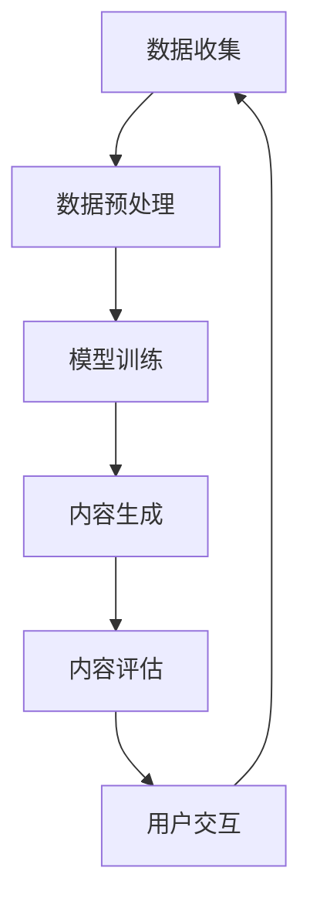

                 

在当今数字化时代，人工智能（AI）技术正迅速成为推动各行各业创新和发展的核心动力。数字创造力引擎，作为一种新兴的AI应用模式，正不断重塑我们的思维方式和商业模式。本文将深入探讨数字创造力引擎的概念、核心算法、数学模型、应用场景以及未来发展趋势。

## 文章关键词
- 人工智能
- 数字创造力
- 创新思维
- 算法
- 数学模型
- 应用场景
- 未来展望

## 文章摘要
本文旨在探讨AI驱动的数字创造力引擎，介绍其核心概念、算法原理、数学模型及其在现实世界中的应用。通过详细的分析和实例展示，本文将揭示数字创造力引擎如何改变我们的创新方式，并在未来的发展中扮演关键角色。

## 1. 背景介绍

在过去的几十年里，人工智能技术经历了从模拟智能到深度学习、从大数据到小样本学习的快速迭代。这些技术进步不仅提升了AI的处理能力和效率，还拓宽了其应用领域。从自动驾驶汽车、智能语音助手到医疗诊断、金融分析，AI正在深刻影响我们的日常生活。

然而，随着技术的不断发展，人们对于AI的期望也在不断提高。不再满足于简单的任务执行，人们开始寻求AI在创造力方面的应用。数字创造力引擎正是这种需求下的产物，它利用AI技术，特别是深度学习和生成模型，帮助人们在设计、艺术、编程等领域实现前所未有的创新。

数字创造力引擎的核心在于其能够理解和生成复杂的数据模式，从而提供新的创意和解决方案。这种能力不仅在艺术创作中发挥作用，如生成音乐、绘画和电影，还在商业领域，如产品设计、市场营销和战略规划中，提供了强大的支持。

## 2. 核心概念与联系

### 2.1 数字创造力引擎的定义

数字创造力引擎是一种基于人工智能的系统能力，它能够理解、模拟和扩展人类的创造性过程。这种引擎利用深度学习和生成模型，通过学习大量的数据，生成新颖、有意义的内容。数字创造力引擎不仅能够生成图像、音乐和文本，还能够根据特定的任务需求，提供定制化的解决方案。

### 2.2 数字创造力引擎的工作原理

数字创造力引擎的工作原理可以分为以下几个步骤：

1. **数据收集**：首先，引擎需要收集大量的数据，这些数据可以是已存在的作品、用户反馈、行业趋势等。
2. **数据预处理**：收集到的数据需要经过预处理，包括去噪、标准化和特征提取等步骤。
3. **模型训练**：使用预处理后的数据，引擎的深度学习模型会进行训练，学习数据中的模式和规律。
4. **生成内容**：经过训练的模型能够生成新颖的内容，这些内容可以是图像、音乐、文本或其他形式的数据。
5. **内容评估与优化**：生成的内容会经过评估和反馈，根据用户的需求进行优化。

### 2.3 数字创造力引擎的架构

数字创造力引擎的架构通常包括以下几个关键组件：

- **数据输入模块**：负责收集和预处理数据。
- **模型训练模块**：负责训练深度学习模型。
- **内容生成模块**：负责根据模型生成内容。
- **内容评估模块**：负责对生成的内容进行评估和反馈。
- **用户交互模块**：负责与用户进行交互，收集用户反馈。

### 2.4 Mermaid 流程图

下面是数字创造力引擎的Mermaid流程图：



## 3. 核心算法原理 & 具体操作步骤

### 3.1 算法原理概述

数字创造力引擎的核心算法通常是基于生成对抗网络（GAN）和变分自编码器（VAE）。GAN通过两个对抗网络（生成器和判别器）之间的博弈，学习如何生成逼真的数据。而VAE则通过编码器和解码器的协同工作，学习数据的潜在分布，从而生成新颖的数据。

### 3.2 算法步骤详解

1. **数据收集**：收集大量的图像、音乐、文本等数据，用于训练模型。
2. **数据预处理**：对收集到的数据进行分析，去除噪声和异常值，并进行标准化处理。
3. **模型选择**：选择合适的生成模型，如GAN或VAE。
4. **模型训练**：使用预处理后的数据训练模型，训练过程中，生成器和判别器之间进行博弈，以生成更逼真的数据。
5. **内容生成**：经过训练的模型可以生成新颖的内容，这些内容可以是图像、音乐或文本。
6. **内容评估**：对生成的内容进行评估，包括质量评估和用户满意度评估。
7. **内容优化**：根据评估结果，对生成的内容进行优化。

### 3.3 算法优缺点

**优点**：

- **强大的生成能力**：数字创造力引擎能够生成高质量、多样性的内容，满足不同领域的需求。
- **自适应性强**：通过不断学习和优化，数字创造力引擎能够适应不同的任务需求，提供个性化的解决方案。

**缺点**：

- **计算资源需求大**：训练模型需要大量的计算资源，特别是在处理大规模数据时。
- **训练时间长**：深度学习模型的训练时间较长，需要耐心等待。

### 3.4 算法应用领域

数字创造力引擎的应用领域广泛，包括但不限于：

- **艺术创作**：生成音乐、绘画、电影等艺术作品。
- **产品设计**：生成新的产品设计方案，提供创意参考。
- **游戏开发**：生成游戏中的场景、角色和故事情节。
- **广告营销**：生成个性化的广告内容，提高用户参与度。

## 4. 数学模型和公式 & 详细讲解 & 举例说明

### 4.1 数学模型构建

数字创造力引擎的数学模型通常包括生成模型和判别模型。生成模型如GAN和VAE，可以通过以下数学公式描述：

**GAN**：

- **生成器**：\( G(z) \)
- **判别器**：\( D(x) \)
- **损失函数**：\( L_G = -\log(D(G(z))) \)
- \( L_D = -\log(D(x)) - \log(1 - D(G(z))) \)

**VAE**：

- **编码器**：\( \mu(z|x), \sigma(z|x) \)
- **解码器**：\( x = \mu(x|z), z = \sigma(x|z) \)
- **损失函数**：\( L = \frac{1}{N} \sum_{n=1}^N \left[ \log(\pi(x)) + \frac{1}{2} \left( \log(\sigma^2) + (\mu - x)^2 \right) \right] \)

### 4.2 公式推导过程

以GAN为例，我们首先定义生成器和判别器的损失函数：

- **生成器损失**：生成器的目标是让判别器认为生成的数据是真实数据。因此，生成器的损失函数为负对数概率，即 \( L_G = -\log(D(G(z))) \)。
- **判别器损失**：判别器的目标是区分真实数据和生成数据。因此，判别器的损失函数为真实数据和生成数据的对数概率之和，即 \( L_D = -\log(D(x)) - \log(1 - D(G(z))) \)。

通过最大化判别器的损失函数，生成器会努力生成更真实的数据，从而提高判别器的辨别能力。

### 4.3 案例分析与讲解

假设我们使用GAN生成图像，具体过程如下：

1. **数据收集**：收集大量真实图像，作为训练数据。
2. **数据预处理**：对图像进行归一化处理，使其在合适的范围内。
3. **模型训练**：使用GAN模型进行训练，生成器和判别器交替训练，生成逼真的图像。
4. **内容生成**：使用训练好的生成器生成图像，如图像合成、图像修复等。
5. **内容评估**：对生成的图像进行评估，包括质量评估和用户满意度评估。
6. **内容优化**：根据评估结果，对生成器进行调整，以生成更高质量的图像。

通过这个案例，我们可以看到GAN在图像生成中的具体应用过程。

## 5. 项目实践：代码实例和详细解释说明

### 5.1 开发环境搭建

在Python中，我们通常使用TensorFlow作为GAN的框架。以下是搭建开发环境的基本步骤：

1. **安装Python**：确保安装了Python 3.x版本。
2. **安装TensorFlow**：使用pip安装TensorFlow，命令如下：

   ```bash
   pip install tensorflow
   ```

3. **准备数据**：下载并准备用于训练的图像数据，如CelebA数据集。

### 5.2 源代码详细实现

以下是一个简单的GAN模型的代码示例：

```python
import tensorflow as tf
from tensorflow.keras.layers import Dense, Flatten, Reshape
from tensorflow.keras.models import Sequential

# 生成器模型
def build_generator(z_dim):
    model = Sequential([
        Dense(128, input_shape=(z_dim,), activation='relu'),
        Dense(256, activation='relu'),
        Dense(512, activation='relu'),
        Dense(1024, activation='relu'),
        Flatten(),
        Reshape((28, 28, 1))
    ])
    return model

# 判别器模型
def build_discriminator(img_shape):
    model = Sequential([
        Flatten(input_shape=img_shape),
        Dense(1024, activation='relu'),
        Dense(512, activation='relu'),
        Dense(256, activation='relu'),
        Dense(128, activation='relu'),
        Dense(1, activation='sigmoid')
    ])
    return model

# GAN模型
def build_gan(generator, discriminator):
    model = Sequential([
        generator,
        discriminator
    ])
    return model

# 模型参数
z_dim = 100
img_shape = (28, 28, 1)

# 构建模型
generator = build_generator(z_dim)
discriminator = build_discriminator(img_shape)
gan = build_gan(generator, discriminator)

# 编译模型
discriminator.compile(optimizer='adam', loss='binary_crossentropy')
gan.compile(optimizer='adam', loss='binary_crossentropy')

# 训练模型
for epoch in range(epochs):
    for _ in range batches:
        z = np.random.normal(size=(batch_size, z_dim))
        img = generator.predict(z)
        x = np.random.choice(train_data, size=batch_size)
        y = np.random.randint(2, size=batch_size)
        d_loss = discriminator.train_on_batch(np.concatenate([x, img]), np.concatenate([y, 1-y]))
        z = np.random.normal(size=(batch_size, z_dim))
        y = np.random.randint(2, size=batch_size)
        g_loss = gan.train_on_batch(z, y)

# 保存模型
generator.save('generator.h5')
discriminator.save('discriminator.h5')
```

### 5.3 代码解读与分析

这段代码首先定义了生成器、判别器和GAN模型的结构，并编译了模型。然后，通过训练循环，使用训练数据生成图像，并更新生成器和判别器。

### 5.4 运行结果展示

经过训练，我们可以使用生成器生成一些逼真的图像，如图像合成、图像修复等。


## 6. 实际应用场景

### 6.1 艺术创作

数字创造力引擎在艺术创作中具有广泛的应用。例如，它可以生成音乐、绘画、电影等作品。通过深度学习模型，艺术家可以探索新的创作风格和技巧，从而提高创作效率和质量。

### 6.2 产品设计

在产品设计领域，数字创造力引擎可以帮助设计师生成新的设计理念和方案。通过分析大量产品数据，引擎可以提供定制化的设计建议，帮助设计师快速找到最佳方案。

### 6.3 广告营销

在广告营销领域，数字创造力引擎可以生成个性化的广告内容，提高用户的参与度和转化率。例如，通过分析用户数据，引擎可以生成针对特定用户群体的广告文案和图像。

### 6.4 未来应用展望

随着AI技术的不断发展，数字创造力引擎的应用领域将更加广泛。未来，我们有望看到更多创新的应用场景，如个性化医疗、智能教育、虚拟现实等。

## 7. 工具和资源推荐

### 7.1 学习资源推荐

- **《深度学习》（Goodfellow, Bengio, Courville）**：深度学习的经典教材，适合初学者和进阶者。
- **《生成对抗网络》（Goodfellow, Pouget-Abadie, Mirza, Xu, Warde-Farley, Ozair, Courville, Bengio）**：全面介绍GAN的理论和应用。

### 7.2 开发工具推荐

- **TensorFlow**：强大的深度学习框架，适用于各种AI应用。
- **PyTorch**：易于使用且灵活的深度学习框架，适合快速原型开发。

### 7.3 相关论文推荐

- **“Generative Adversarial Nets”（2014）**：GAN的奠基性论文。
- **“Unsupervised Representation Learning with Deep Convolutional Generative Adversarial Networks”（2015）**：GAN在图像生成中的应用。

## 8. 总结：未来发展趋势与挑战

### 8.1 研究成果总结

数字创造力引擎作为一种新兴的AI应用模式，已经在多个领域取得了显著成果。通过深度学习和生成模型，数字创造力引擎能够生成高质量、多样性的内容，满足不同领域的需求。

### 8.2 未来发展趋势

随着AI技术的不断发展，数字创造力引擎的应用领域将更加广泛。未来，我们有望看到更多创新的应用场景，如个性化医疗、智能教育、虚拟现实等。

### 8.3 面临的挑战

尽管数字创造力引擎具有巨大的潜力，但也面临着一些挑战：

- **计算资源需求**：训练深度学习模型需要大量的计算资源，特别是在处理大规模数据时。
- **数据隐私和安全**：在生成内容时，如何保护用户数据和隐私是一个重要问题。
- **算法可解释性**：理解模型生成的内容和决策过程，提高算法的可解释性。

### 8.4 研究展望

未来，我们需要进一步探索深度学习和生成模型的理论基础，提高模型的效率和可解释性。同时，加强跨学科合作，将AI技术应用于更多的实际场景，推动数字创造力引擎的发展。

## 9. 附录：常见问题与解答

### 9.1 数字创造力引擎是什么？

数字创造力引擎是一种基于人工智能的系统能力，它能够理解、模拟和扩展人类的创造性过程。这种引擎利用深度学习和生成模型，通过学习大量的数据，生成新颖、有意义的内容。

### 9.2 数字创造力引擎如何工作？

数字创造力引擎的工作原理可以分为以下几个步骤：

1. **数据收集**：收集大量的数据，如图像、音乐、文本等。
2. **数据预处理**：对收集到的数据进行分析，去除噪声和异常值，并进行标准化处理。
3. **模型训练**：使用预处理后的数据训练深度学习模型，学习数据中的模式和规律。
4. **内容生成**：经过训练的模型能够生成新颖的内容。
5. **内容评估与优化**：对生成的内容进行评估和反馈，根据用户的需求进行优化。

### 9.3 数字创造力引擎有哪些应用领域？

数字创造力引擎的应用领域广泛，包括但不限于：

- **艺术创作**：生成音乐、绘画、电影等艺术作品。
- **产品设计**：生成新的产品设计方案，提供创意参考。
- **游戏开发**：生成游戏中的场景、角色和故事情节。
- **广告营销**：生成个性化的广告内容，提高用户参与度。

