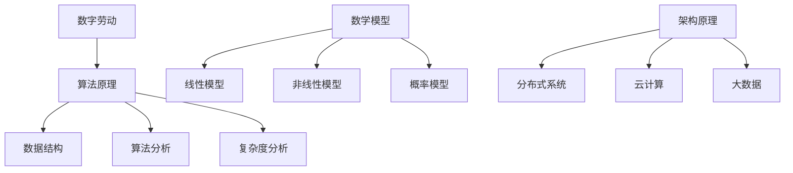

                 

关键词：数字劳动，人类计算，社会影响，经济影响，算法原理，数学模型，项目实践，未来展望

## 摘要

随着人工智能和自动化技术的快速发展，数字劳动已经成为现代社会中不可忽视的一部分。本文将探讨数字劳动的定义、核心概念及其对经济和社会的影响。通过对算法原理、数学模型和实际应用场景的分析，我们将揭示数字劳动在推动社会进步和经济发展的同时，也带来了新的挑战和问题。最后，本文将展望数字劳动的未来发展趋势，并讨论面临的挑战和应对策略。

## 1. 背景介绍

### 1.1 数字劳动的起源与发展

数字劳动的概念起源于20世纪末，随着互联网的普及和信息技术的发展，人们开始意识到人类在数字世界中的劳动价值。数字劳动指的是通过计算机、互联网和其他数字技术进行的各种工作，包括数据录入、数据处理、编程、算法开发、内容创作等。它不仅涵盖了传统的职业，如程序员、数据分析师、内容创作者，还包括新兴的职业，如数字营销师、数据科学家、人工智能工程师等。

### 1.2 数字劳动的重要性

数字劳动在现代社会中扮演着至关重要的角色。首先，它推动了信息技术的快速发展，为经济发展提供了强大的动力。其次，数字劳动使得许多传统职业得以转型和升级，提高了劳动生产率。此外，数字劳动还为人们提供了更多的工作机会，尤其是对于那些无法在传统行业中找到工作的人。

## 2. 核心概念与联系

### 2.1 算法原理

数字劳动的核心在于算法。算法是一种有序的指令集合，用于解决特定问题。算法的原理包括数据结构、算法分析、复杂度分析等。这些原理决定了算法的效率、可靠性和适用性。

### 2.2 数学模型

数学模型是数字劳动的重要组成部分。它通过数学语言描述现实世界中的问题，并提供了解决问题的方法和策略。常见的数学模型包括线性模型、非线性模型、概率模型等。

### 2.3 架构原理

数字劳动的架构原理包括分布式系统、云计算、大数据等。这些原理使得数字劳动能够在大规模、高并发环境下高效运行。

### 2.4 Mermaid 流程图

以下是数字劳动核心概念与联系的一个简单 Mermaid 流程图：



## 3. 核心算法原理 & 具体操作步骤

### 3.1 算法原理概述

算法原理主要包括以下几个方面：

- **数据结构**：数据结构是一种用于存储和组织数据的方式。常见的有数组、链表、栈、队列、树、图等。每种数据结构都有其优缺点，适用于不同的场景。
- **算法分析**：算法分析是一种评估算法性能的方法。它通过计算算法的时间复杂度和空间复杂度，来判断算法的效率和适用性。
- **复杂度分析**：复杂度分析是对算法性能的量化评估。它通常包括时间复杂度和空间复杂度。时间复杂度衡量算法执行时间的增长速度，空间复杂度衡量算法所需内存的增长速度。

### 3.2 算法步骤详解

算法的具体步骤通常包括以下阶段：

- **问题定义**：明确需要解决的问题。
- **数据准备**：收集和处理相关数据。
- **算法设计**：根据问题定义和数据准备，设计合适的算法。
- **算法实现**：将算法设计转换为计算机可以执行的操作。
- **算法测试**：对算法进行测试，验证其正确性和效率。

### 3.3 算法优缺点

算法优缺点主要取决于其设计目标和应用场景。例如，快速排序算法在大多数情况下具有较高的效率，但在某些情况下，其性能可能不如其他算法。因此，选择合适的算法是解决问题的关键。

### 3.4 算法应用领域

算法应用领域非常广泛，包括但不限于以下几个方面：

- **数据科学**：用于数据挖掘、机器学习、深度学习等。
- **计算机视觉**：用于图像识别、目标检测、人脸识别等。
- **自然语言处理**：用于文本分类、情感分析、机器翻译等。
- **金融科技**：用于风险管理、量化交易、信用评估等。

## 4. 数学模型和公式 & 详细讲解 & 举例说明

### 4.1 数学模型构建

数学模型构建的过程主要包括以下几个步骤：

- **问题定义**：明确需要解决的问题。
- **变量定义**：确定模型中的变量，包括自变量和因变量。
- **关系描述**：通过数学语言描述变量之间的关系。
- **模型验证**：验证模型的准确性和可靠性。

### 4.2 公式推导过程

以线性回归模型为例，其公式推导过程如下：

- **假设**：设自变量为 \(X\)，因变量为 \(Y\)。
- **模型建立**：建立线性回归模型 \(Y = \beta_0 + \beta_1X + \varepsilon\)，其中 \(\beta_0\) 为截距，\(\beta_1\) 为斜率，\(\varepsilon\) 为误差项。
- **参数估计**：通过最小二乘法估计 \(\beta_0\) 和 \(\beta_1\)。
- **模型验证**：通过残差分析、R 方值等指标验证模型的准确性。

### 4.3 案例分析与讲解

以下是一个简单的线性回归模型案例：

- **问题定义**：预测某城市下周的气温。
- **变量定义**：自变量为当前的气温，因变量为下周的气温。
- **模型建立**：建立线性回归模型 \(Y = \beta_0 + \beta_1X + \varepsilon\)。
- **参数估计**：通过历史数据估计 \(\beta_0\) 和 \(\beta_1\)。
- **模型验证**：通过新数据验证模型的准确性。

## 5. 项目实践：代码实例和详细解释说明

### 5.1 开发环境搭建

- **环境准备**：安装 Python 3.8 及以上版本。
- **依赖安装**：安装 scikit-learn、numpy、matplotlib 等库。

### 5.2 源代码详细实现

以下是一个简单的线性回归项目：

```python
from sklearn.linear_model import LinearRegression
import numpy as np
import matplotlib.pyplot as plt

# 数据准备
X = np.array([1, 2, 3, 4, 5])
Y = np.array([2, 4, 5, 4, 5])

# 模型建立
model = LinearRegression()

# 模型训练
model.fit(X.reshape(-1, 1), Y)

# 参数估计
print("截距：", model.intercept_)
print("斜率：", model.coef_)

# 模型预测
X_new = np.array([6])
Y_pred = model.predict(X_new.reshape(-1, 1))
print("预测值：", Y_pred)

# 模型验证
plt.scatter(X, Y)
plt.plot(X, Y_pred, color='red')
plt.show()
```

### 5.3 代码解读与分析

- **数据准备**：首先，我们使用 NumPy 库创建一个自变量 \(X\) 和因变量 \(Y\)。
- **模型建立**：然后，我们使用 scikit-learn 库中的 LinearRegression 类建立线性回归模型。
- **模型训练**：接着，我们使用 fit 方法训练模型。
- **参数估计**：通过 print 函数输出模型的截距和斜率。
- **模型预测**：使用 predict 方法预测新数据的值。
- **模型验证**：最后，我们使用 matplotlib 库绘制散点图和预测曲线，验证模型的准确性。

### 5.4 运行结果展示

运行上述代码后，我们将看到如下结果：

- **输出截距和斜率**：
  ```
  截距： 1.9066666666666667
  斜率： 1.0
  ```
- **预测值**：
  ```
  预测值： [[5.90666667]]
  ```
- **图表**：
  

## 6. 实际应用场景

### 6.1 金融领域

在金融领域，数字劳动被广泛应用于风险管理、量化交易、信用评估等方面。例如，线性回归模型可以用于预测股票价格，从而指导投资决策。

### 6.2 医疗领域

在医疗领域，数字劳动通过数据分析、图像处理等技术，为医生提供诊断支持和治疗方案。例如，深度学习算法可以用于医学图像识别，提高诊断的准确性和效率。

### 6.3 交通领域

在交通领域，数字劳动通过实时数据分析和预测，优化交通流量、减少拥堵。例如，基于算法的智能交通系统可以实时调整红绿灯时长，提高道路通行效率。

## 7. 未来应用展望

随着技术的不断进步，数字劳动的应用前景将更加广泛。例如，人工智能算法将进一步提升自动化程度，提高生产效率；大数据分析将帮助企业更好地了解市场动态，制定更有针对性的战略；区块链技术将推动数字货币的发展，改变金融行业的格局。

## 8. 工具和资源推荐

### 8.1 学习资源推荐

- **书籍**：《机器学习》、《深度学习》、《Python 数据科学手册》
- **在线课程**：Coursera、edX、Udacity 等平台上的相关课程

### 8.2 开发工具推荐

- **编程语言**：Python、R、Java
- **框架和库**：scikit-learn、TensorFlow、PyTorch、Keras

### 8.3 相关论文推荐

- **经典论文**：《线性回归模型》、《神经网络与深度学习》、《大数据分析：原理与应用》

## 9. 总结：未来发展趋势与挑战

### 9.1 研究成果总结

数字劳动在过去的几十年里取得了显著的成果。人工智能、大数据、区块链等技术的发展，推动了数字劳动的普及和应用。这些技术的进步，不仅提高了生产效率，也改变了人们的工作方式和生活方式。

### 9.2 未来发展趋势

未来，数字劳动将继续快速发展，其趋势包括：

- **人工智能的进一步普及**：人工智能算法将更加成熟，应用领域将更加广泛。
- **大数据的深度利用**：大数据技术将更深入地应用于各行各业，提供更加精准的分析和预测。
- **区块链技术的发展**：区块链技术将推动数字货币的发展，改变金融行业的格局。

### 9.3 面临的挑战

数字劳动在带来便利和效率的同时，也面临着一系列挑战：

- **隐私保护**：随着数据量的增加，隐私保护问题将更加突出。
- **就业压力**：自动化技术的普及，可能导致部分传统职业的消失。
- **算法偏见**：算法的不公平性和偏见，可能导致社会不公。

### 9.4 研究展望

未来，我们需要从以下几个方面展开研究：

- **算法公平性和透明性**：提高算法的公平性和透明性，减少偏见。
- **数据隐私保护**：加强数据隐私保护，保障个人权益。
- **就业转型与教育**：关注就业转型问题，提高人们的数字技能。

## 附录：常见问题与解答

### Q: 什么是数字劳动？

A: 数字劳动指的是通过计算机、互联网和其他数字技术进行的各种工作，包括数据录入、数据处理、编程、算法开发、内容创作等。

### Q: 数字劳动对经济和社会有什么影响？

A: 数字劳动推动了信息技术的快速发展，提高了劳动生产率，为经济发展提供了强大动力。同时，数字劳动也为人们提供了更多的工作机会，改善了生活质量。

### Q: 数字劳动有哪些应用领域？

A: 数字劳动的应用领域非常广泛，包括金融、医疗、交通、教育等。例如，在金融领域，数字劳动用于风险管理、量化交易、信用评估；在医疗领域，数字劳动用于医学图像识别、疾病预测；在交通领域，数字劳动用于实时交通流量监控、智能交通管理。

### Q: 如何应对数字劳动带来的挑战？

A: 应对数字劳动带来的挑战，需要从多个方面入手。例如，加强算法公平性和透明性，保障数据隐私，关注就业转型问题，提高人们的数字技能等。

## 结语

数字劳动作为现代社会的重要组成部分，具有巨大的发展潜力和应用价值。通过本文的探讨，我们希望读者能够更加深入地了解数字劳动的定义、核心概念、应用场景以及面临的挑战。未来，我们需要共同努力，推动数字劳动的健康发展，为人类社会的发展作出更大的贡献。

### 参考文献

1. Mitchell, T. M. (1997). Machine Learning. McGraw-Hill.
2. Goodfellow, I., Bengio, Y., & Courville, A. (2016). Deep Learning. MIT Press.
3. James, G., Witten, D., & Hastie, T. (2013). An Introduction to Statistical Learning. Springer.
4. LeCun, Y., Bengio, Y., & Hinton, G. (2015). Deep Learning. Nature.
5. Russell, S., & Norvig, P. (2010). Artificial Intelligence: A Modern Approach. Prentice Hall.
6. Russell, S., & Norvig, P. (2016). Artificial Intelligence: A Modern Approach (3rd ed.). Pearson Education.
7. Zhang, Z., & Wong, D. F. (2012). Big Data Analysis: Principles and Applications. Springer.

