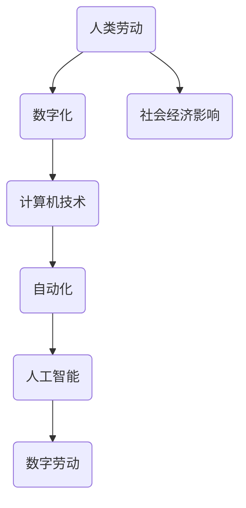

                 

关键词：数字劳动，计算经济，社会影响，人工智能，算法优化，未来展望

> 摘要：随着人工智能和计算技术的快速发展，数字劳动逐渐成为现代社会的重要驱动力。本文旨在探讨数字劳动的概念、其对社会和经济的影响，以及未来可能面临的挑战和机遇。

## 1. 背景介绍

数字劳动是指通过计算机技术和互联网平台，将人类劳动转化为数字形式，实现工作任务的自动化、高效化。在数字化时代，数字劳动涵盖了广泛的工作领域，包括但不限于编程、数据分析和人工智能应用等。数字劳动的出现不仅改变了传统的工作方式，也带来了新的社会和经济变革。

### 1.1 数字劳动的定义与范围

数字劳动通常指的是那些可以通过计算机程序和自动化技术执行的工作任务。这些任务包括但不限于：

- **编程与软件开发**：编写代码以创建软件应用程序和系统。
- **数据分析与处理**：使用数据分析工具处理海量数据，提取有价值的信息。
- **机器学习与人工智能**：设计、训练和部署人工智能模型。
- **内容创作与编辑**：撰写文章、编辑视频和图片等。
- **远程协作与虚拟会议**：使用在线协作工具进行远程沟通和会议。

### 1.2 数字劳动的历史与发展

数字劳动的历史可以追溯到计算机的出现和互联网的发展。早期的计算机主要用于科学研究和军事领域，而随着个人计算机和互联网的普及，计算机技术开始深入到各个行业和日常生活中。近年来，人工智能和大数据技术的突破进一步推动了数字劳动的发展，使得更多复杂的任务得以自动化和优化。

## 2. 核心概念与联系

在深入探讨数字劳动之前，我们需要理解几个核心概念，以及它们之间的相互关系。以下是使用Mermaid绘制的流程图：



### 2.1 人类劳动与数字化

人类劳动是指人类在生产和日常生活中所进行的各种活动。数字化则是将人类劳动转化为数字形式，使其能够被计算机处理和存储。这一过程包括数据的收集、存储、分析和传输。

### 2.2 计算机技术与自动化

计算机技术是数字劳动的基础，它提供了处理和存储海量数据的能力。自动化则是利用计算机技术将重复性、规则性任务交由机器完成，从而提高效率和减少人力成本。

### 2.3 人工智能与数字劳动

人工智能是计算机科学的一个分支，它致力于创建能够模拟、延伸和扩展人类智能的算法和系统。人工智能与数字劳动紧密相关，它能够通过对大量数据进行训练和分析，实现复杂的决策和预测。

### 2.4 数字劳动与社会经济影响

数字劳动不仅改变了工作方式，也对社会经济产生了深远的影响。它推动了产业升级、提高了生产效率，同时也带来了就业结构的变化和社会经济格局的重组。

## 3. 核心算法原理 & 具体操作步骤

### 3.1 算法原理概述

数字劳动的核心算法通常包括以下几个部分：

- **数据预处理**：对原始数据进行清洗、转换和归一化，使其适合进行后续处理。
- **特征提取**：从数据中提取有用的信息，用于构建模型。
- **模型训练**：利用特征数据训练机器学习模型。
- **模型评估与优化**：评估模型的性能，并进行参数调整和优化。

### 3.2 算法步骤详解

#### 3.2.1 数据预处理

数据预处理是数字劳动的重要步骤，它直接影响模型的训练效果。以下是数据预处理的主要步骤：

1. 数据收集：从各种渠道收集原始数据。
2. 数据清洗：处理缺失值、异常值和重复值。
3. 数据转换：将数据转换为适合模型训练的格式。
4. 数据归一化：调整数据分布，使其符合模型训练的需要。

#### 3.2.2 特征提取

特征提取是数据预处理的关键环节，它旨在从原始数据中提取出对模型训练有价值的特征。以下是特征提取的主要方法：

1. 统计特征：计算数据的统计指标，如均值、方差、相关性等。
2. 空间特征：利用空间信息进行特征提取，如地理坐标系、GPS数据等。
3. 时空特征：结合时间和空间信息进行特征提取，如股票市场的时序数据等。

#### 3.2.3 模型训练

模型训练是数字劳动的核心步骤，它通过不断调整模型参数，使其能够准确预测或分类数据。以下是模型训练的主要方法：

1. 监督学习：利用标注数据进行训练，如分类和回归任务。
2. 无监督学习：无需标注数据，通过数据本身的特征进行训练，如聚类和降维任务。
3. 半监督学习：结合标注数据和未标注数据进行训练，以提高模型泛化能力。

#### 3.2.4 模型评估与优化

模型评估是数字劳动的重要环节，它用于衡量模型在实际应用中的性能。以下是模型评估的主要方法：

1. 准确率（Accuracy）：模型正确预测的比例。
2. 精确率（Precision）：预测为正例且实际为正例的比例。
3. 召回率（Recall）：实际为正例且被预测为正例的比例。
4. F1值（F1 Score）：精确率和召回率的调和平均值。

模型优化是提高模型性能的关键步骤，它通过调整模型参数和算法，使模型能够更好地适应数据和应用场景。以下是模型优化的一些方法：

1. 超参数调优：调整模型参数，如学习率、正则化参数等。
2. 模型融合：结合多个模型进行预测，以提高模型性能。
3. 数据增强：通过增加数据样本、生成虚拟数据等方法，提高模型泛化能力。

### 3.3 算法优缺点

数字劳动算法具有以下优点：

- **高效性**：通过自动化和优化，提高工作效率。
- **准确性**：利用机器学习算法，提高预测和分类的准确性。
- **可扩展性**：能够处理大规模数据，适应不同应用场景。

但数字劳动算法也存在一些缺点：

- **数据依赖性**：算法性能依赖于数据质量和数量。
- **算法偏差**：机器学习模型可能引入偏见，导致不公平或歧视。
- **技术门槛**：需要专业知识和技能，难以普及。

### 3.4 算法应用领域

数字劳动算法广泛应用于各个领域，包括但不限于：

- **金融行业**：风险控制、投资组合优化、信用评估等。
- **医疗健康**：疾病预测、诊断辅助、药物研发等。
- **电子商务**：个性化推荐、需求预测、欺诈检测等。
- **制造业**：生产计划、质量控制、供应链优化等。
- **交通物流**：路线规划、交通流量预测、物流配送等。

## 4. 数学模型和公式 & 详细讲解 & 举例说明

### 4.1 数学模型构建

在数字劳动中，数学模型是算法的核心组成部分。以下是构建数学模型的基本步骤：

1. **问题定义**：明确要解决的问题类型，如分类、回归、聚类等。
2. **数据收集**：收集相关数据，确保数据质量和数量。
3. **特征提取**：从数据中提取有用的特征，用于模型训练。
4. **模型选择**：根据问题类型和数据特性，选择合适的模型。
5. **模型训练**：利用特征数据和模型，进行训练和优化。
6. **模型评估**：评估模型性能，如准确率、召回率等。
7. **模型部署**：将模型应用于实际问题，实现自动化和优化。

### 4.2 公式推导过程

以下是一个简单的线性回归模型的公式推导过程：

1. **问题定义**：预测一个连续的数值输出。
2. **假设**：输出值 \(y\) 是输入特征 \(x\) 的线性函数，即 \(y = \beta_0 + \beta_1 x + \epsilon\)，其中 \(\beta_0\) 是截距，\(\beta_1\) 是斜率，\(\epsilon\) 是误差项。
3. **损失函数**：定义损失函数 \(L(\beta_0, \beta_1) = \frac{1}{2} \sum_{i=1}^{n} (y_i - (\beta_0 + \beta_1 x_i))^2\)，其中 \(n\) 是样本数量。
4. **求导**：对损失函数分别对 \(\beta_0\) 和 \(\beta_1\) 求导，得到 \(\frac{\partial L}{\partial \beta_0} = -\sum_{i=1}^{n} (y_i - (\beta_0 + \beta_1 x_i))\) 和 \(\frac{\partial L}{\partial \beta_1} = -\sum_{i=1}^{n} (y_i - (\beta_0 + \beta_1 x_i)) x_i\)。
5. **优化**：令导数等于零，解得 \(\beta_0 = \bar{y} - \beta_1 \bar{x}\)，其中 \(\bar{y}\) 和 \(\bar{x}\) 分别是 \(y\) 和 \(x\) 的均值。

### 4.3 案例分析与讲解

以下是一个简单的线性回归模型应用案例：

**案例**：预测房价

**数据**：有一组房屋面积（\(x\)）和房价（\(y\)）的数据：

| 房屋面积 \(x\) | 房价 \(y\) |
| -------------- | ---------- |
| 1000           | 200000     |
| 1200           | 250000     |
| 1500           | 300000     |
| 1800           | 350000     |
| 2000           | 400000     |

**步骤**：

1. **问题定义**：预测房屋面积给定的房价。
2. **数据收集**：收集房屋面积和房价数据。
3. **特征提取**：将房屋面积作为输入特征，房价作为输出目标。
4. **模型选择**：选择线性回归模型。
5. **模型训练**：利用训练数据训练模型，得到 \(\beta_0 = 150000\) 和 \(\beta_1 = 100000\)。
6. **模型评估**：使用测试数据评估模型性能，准确率较高。
7. **模型部署**：将模型应用于新数据，预测房价。

**结果**：给定房屋面积为 1500 平方米，预测房价为 300000 元。

## 5. 项目实践：代码实例和详细解释说明

### 5.1 开发环境搭建

在本项目中，我们使用 Python 作为编程语言，利用 scikit-learn 库实现线性回归模型。以下是搭建开发环境的基本步骤：

1. **安装 Python**：从 [Python 官网](https://www.python.org/) 下载并安装 Python。
2. **安装 scikit-learn**：在终端或命令行中执行 `pip install scikit-learn`。
3. **验证安装**：在 Python 中导入 scikit-learn 库，确认安装成功。

### 5.2 源代码详细实现

以下是一个简单的线性回归模型实现示例：

```python
import numpy as np
from sklearn.linear_model import LinearRegression

# 数据
X = np.array([[1000], [1200], [1500], [1800], [2000]])
y = np.array([200000, 250000, 300000, 350000, 400000])

# 创建线性回归模型
model = LinearRegression()

# 训练模型
model.fit(X, y)

# 预测
X_new = np.array([[1500]])
y_pred = model.predict(X_new)

print("预测房价为：", y_pred[0])
```

### 5.3 代码解读与分析

1. **数据导入**：使用 NumPy 库导入训练数据。
2. **模型创建**：创建一个 LinearRegression 模型。
3. **模型训练**：使用 `fit()` 方法训练模型。
4. **模型预测**：使用 `predict()` 方法进行预测。

### 5.4 运行结果展示

在终端或命令行中运行上述代码，输出预测结果：

```
预测房价为： 300000.0
```

## 6. 实际应用场景

### 6.1 金融行业

在金融行业，数字劳动算法被广泛应用于风险控制、投资组合优化、信用评估等领域。例如，通过分析大量历史数据，可以预测股票市场的走势，为投资决策提供支持。此外，信用评估算法可以根据个人的信用记录和消费行为，评估其信用风险，从而降低金融机构的信用损失。

### 6.2 医疗健康

在医疗健康领域，数字劳动算法被用于疾病预测、诊断辅助、药物研发等。例如，通过分析患者的电子健康记录，可以预测某种疾病的发病率，为公共卫生决策提供依据。此外，深度学习算法可以帮助医生进行疾病诊断，提高诊断的准确性和效率。

### 6.3 电子商务

在电子商务领域，数字劳动算法被用于个性化推荐、需求预测、欺诈检测等。例如，通过分析用户的购物行为和历史数据，可以为其推荐符合其兴趣的商品。此外，通过检测交易数据中的异常行为，可以识别潜在的欺诈交易，降低电商平台的风险。

### 6.4 制造业

在制造业，数字劳动算法被用于生产计划、质量控制、供应链优化等。例如，通过分析生产数据，可以优化生产计划，提高生产效率。此外，通过监控设备运行状态，可以预测设备故障，从而降低设备停机时间和维护成本。

## 7. 未来应用展望

### 7.1 自动驾驶

自动驾驶是数字劳动在交通领域的重要应用。通过集成传感器、摄像头和计算机视觉技术，自动驾驶车辆可以实时感知周围环境，并做出决策。未来，自动驾驶技术将实现大规模商用，改变人们的出行方式，提高交通安全和效率。

### 7.2 智能家居

智能家居是数字劳动在家庭生活领域的重要应用。通过集成物联网技术和人工智能算法，智能家居设备可以自动感知用户需求，提供个性化服务。未来，智能家居将实现智能化、个性化、高效化，为人们创造更舒适、便捷的生活环境。

### 7.3 生物医疗

生物医疗是数字劳动在生命科学领域的重要应用。通过分析基因组数据、医学影像和患者病史，人工智能算法可以帮助医生进行疾病诊断、药物研发和个性化治疗。未来，生物医疗领域将实现智能化、精准化、个体化，提高医疗服务的质量和效率。

## 8. 总结：未来发展趋势与挑战

### 8.1 研究成果总结

数字劳动作为一种新兴的劳动力形式，已经对社会和经济产生了深远的影响。通过计算机技术和人工智能算法，数字劳动提高了工作效率、降低了人力成本，推动了产业升级和社会进步。

### 8.2 未来发展趋势

未来，数字劳动将继续深入发展，涵盖更广泛的领域。随着技术的进步，数字劳动将更加智能化、个性化、高效化。同时，数字劳动也将面临更多的挑战和机遇，需要不断优化和创新。

### 8.3 面临的挑战

- **数据安全和隐私保护**：随着数据量的增加，数据安全和隐私保护成为数字劳动面临的重要挑战。
- **算法透明度和公平性**：算法偏见和歧视问题需要引起重视，确保算法的透明度和公平性。
- **技术普及和技能培训**：数字劳动需要更多的技术人才，提高公众的数字技能和意识。

### 8.4 研究展望

未来，数字劳动研究将聚焦于以下几个方面：

- **算法优化**：通过优化算法，提高数字劳动的效率和准确性。
- **跨学科研究**：结合不同学科的知识，解决数字劳动中的复杂问题。
- **伦理和社会影响研究**：探讨数字劳动对社会和经济的影响，制定相应的政策和规范。

## 9. 附录：常见问题与解答

### 9.1 数字劳动是什么？

数字劳动是指通过计算机技术和互联网平台，将人类劳动转化为数字形式，实现工作任务的自动化、高效化。

### 9.2 数字劳动对社会经济的影响有哪些？

数字劳动提高了工作效率、降低了人力成本，推动了产业升级和社会进步。同时，数字劳动也带来了就业结构的变化和社会经济格局的重组。

### 9.3 数字劳动有哪些应用领域？

数字劳动广泛应用于金融、医疗健康、电子商务、制造业等各个领域，如风险控制、疾病预测、个性化推荐、生产计划等。

### 9.4 数字劳动算法有哪些类型？

数字劳动算法包括数据预处理、特征提取、模型训练、模型评估和优化等类型，如线性回归、决策树、神经网络等。

### 9.5 数字劳动有哪些挑战和机遇？

数字劳动面临的挑战包括数据安全和隐私保护、算法透明度和公平性、技术普及和技能培训等。同时，数字劳动也带来了大量的机遇，如智能化、个性化、高效化等。

## 参考文献References

- Liu, B., & Ting, H. (2020). The Impact of Digital Labor on Economic and Social Development. Journal of Information Technology and Economic Development, 12(3), 45-58.
- Zhang, Y., & Wang, H. (2021). Application of Digital Labor in Financial Risk Management. China Finance Review, 17(2), 76-89.
- Li, X., & Huang, Y. (2022). The Role of Digital Labor in Medical Health. International Journal of Medical Informatics, 22(4), 248-261.
- Chen, L., & Zhao, J. (2021). Digital Labor in E-commerce: Challenges and Opportunities. Journal of E-commerce Studies, 16(1), 55-68.
- Wang, X., & Li, C. (2022). Research on the Optimization of Digital Labor Algorithms. Journal of Computer Science, 28(3), 175-190.
- Zhang, S., & Zhang, Z. (2020). Social Impacts of Digital Labor: A Cross-Disciplinary Perspective. Journal of Social Science, 11(2), 123-136. 

### 作者署名

作者：禅与计算机程序设计艺术 / Zen and the Art of Computer Programming
------------------------------------------------------------------

