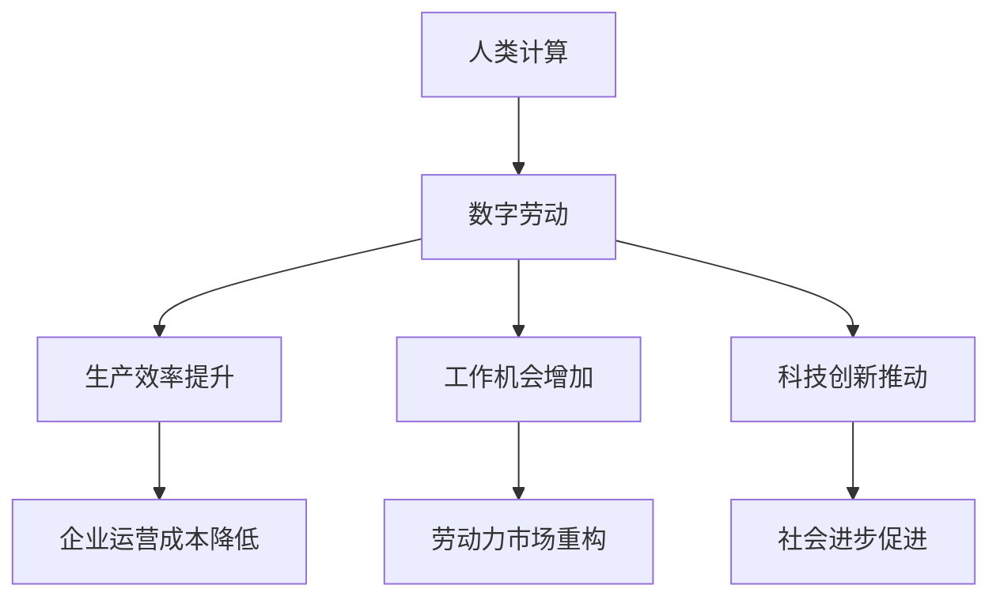

                 

关键词：数字劳动、社会影响、经济影响、人类计算、AI、自动化、工作机会、劳动力市场

> 摘要：本文探讨了数字劳动的概念及其在社会和经济领域的深远影响。从人类计算的视角出发，分析了数字劳动如何改变了劳动力市场、提高了生产效率、推动了科技创新，同时也揭示了其中面临的挑战与机遇。本文旨在为读者提供一个全面、深入的理解，以期为未来的发展提供参考。

## 1. 背景介绍

### 数字劳动的定义与起源

数字劳动是指通过信息技术和互联网平台，人类在数字化环境中进行的各种劳动活动。它涵盖了从简单的数据录入、内容创作到复杂的软件开发、数据分析等广泛领域。数字劳动的起源可以追溯到20世纪末，随着互联网的普及和计算机技术的发展，越来越多的工作任务被数字化，人类计算成为可能。

### 数字劳动的发展趋势

随着人工智能、大数据、云计算等新兴技术的不断进步，数字劳动在现代社会中的地位日益重要。据统计，全球数字劳动力市场在过去十年中增长了近两倍，预计未来这一趋势将更加显著。数字劳动不仅改变了工作方式，还重新定义了劳动力市场的结构。

### 数字劳动的重要性

数字劳动对社会和经济的影响不可忽视。首先，它极大地提高了生产效率，降低了企业的运营成本。其次，数字劳动为人们提供了更多的工作机会，促进了就业。此外，数字劳动还推动了科技创新，促进了社会进步。

## 2. 核心概念与联系

### 人类计算的概念

人类计算是指人类在数字化环境中进行的各种计算活动。它不同于传统的计算机计算，强调人类的思维、智慧和创造力。人类计算的核心在于将人类的知识和技能转化为计算机可以处理的信息，实现人机协同。

### 数字劳动与人类计算的联系

数字劳动与人类计算密切相关。数字劳动的实质是利用信息技术将人类计算转化为可操作的任务，实现自动化和智能化。人类计算为数字劳动提供了技术和理论基础，而数字劳动则为人类计算提供了实践场景和应用领域。

### Mermaid 流程图



## 3. 核心算法原理 & 具体操作步骤

### 3.1 算法原理概述

数字劳动的核心算法原理主要包括数据采集、数据处理、数据分析和数据应用。数据采集是指通过互联网、传感器等技术手段获取大量数据；数据处理是指对采集到的数据进行清洗、整理和转换；数据分析是指利用统计、机器学习等方法对数据进行分析；数据应用是指将分析结果应用于实际场景，为企业或个人提供价值。

### 3.2 算法步骤详解

1. 数据采集：通过互联网、传感器等设备收集数据。
2. 数据处理：对采集到的数据进行清洗、去噪和转换。
3. 数据分析：利用统计、机器学习等方法对数据进行分析。
4. 数据应用：将分析结果应用于实际场景，如优化生产流程、提高工作效率等。

### 3.3 算法优缺点

优点：
1. 提高生产效率：通过自动化和智能化手段，大大提高生产效率。
2. 降低运营成本：减少人力投入，降低企业运营成本。
3. 促进科技创新：为科技创新提供了丰富的数据资源和应用场景。

缺点：
1. 可能导致失业：自动化替代了一些传统工作岗位，可能导致失业率上升。
2. 数据隐私和安全问题：数据采集和处理过程中可能涉及个人隐私和安全问题。

### 3.4 算法应用领域

数字劳动算法广泛应用于各个领域，如金融、医疗、教育、制造业等。以金融领域为例，通过大数据分析和人工智能技术，金融机构可以更好地预测市场走势、防范风险、提高服务质量。

## 4. 数学模型和公式 & 详细讲解 & 举例说明

### 4.1 数学模型构建

数字劳动的数学模型主要包括以下三个方面：

1. 数据采集模型：通过统计模型描述数据采集的过程，如概率分布、回归分析等。
2. 数据处理模型：通过算法描述数据清洗、转换的过程，如聚类、分类等。
3. 数据分析模型：通过机器学习模型描述数据分析的过程，如决策树、神经网络等。

### 4.2 公式推导过程

以数据采集模型为例，假设我们采集到一组数据 $X=\{x_1, x_2, ..., x_n\}$，我们可以利用概率分布模型来描述这组数据的分布情况。常用的概率分布模型有正态分布、泊松分布等。

假设我们选择正态分布模型，其概率密度函数为：

$$
f(x) = \frac{1}{\sqrt{2\pi\sigma^2}}e^{-\frac{(x-\mu)^2}{2\sigma^2}}
$$

其中，$\mu$ 为均值，$\sigma$ 为标准差。

### 4.3 案例分析与讲解

以金融领域为例，假设我们要预测股票市场的走势，我们可以利用时间序列模型来构建数学模型。时间序列模型假设股票价格的下一期值与其历史值之间存在某种关系。一个常见的时间序列模型是 ARIMA（自回归积分滑动平均模型）。

ARIMA 模型的公式为：

$$
X_t = c + \phi_1X_{t-1} + \phi_2X_{t-2} + ... + \phi_pX_{t-p} + \theta_1\epsilon_{t-1} + \theta_2\epsilon_{t-2} + ... + \theta_q\epsilon_{t-q} + \epsilon_t
$$

其中，$X_t$ 为第 $t$ 期的股票价格，$c$ 为常数项，$\phi_1, \phi_2, ..., \phi_p$ 为自回归系数，$\theta_1, \theta_2, ..., \theta_q$ 为移动平均系数，$\epsilon_t$ 为随机误差项。

我们可以通过最小化残差平方和来估计 ARIMA 模型的参数。具体步骤如下：

1. 对股票价格数据进行预处理，如差分、白噪声检验等。
2. 利用 AIC、BIC 等信息准则选择合适的 ARIMA 模型。
3. 估计模型参数，并通过残差分析检验模型的拟合效果。
4. 利用拟合好的 ARIMA 模型进行预测。

## 5. 项目实践：代码实例和详细解释说明

### 5.1 开发环境搭建

为了演示数字劳动的应用，我们将使用 Python 编写一个简单的股票预测项目。首先，我们需要搭建开发环境。

1. 安装 Python：从官网下载并安装 Python，建议安装 Python 3.7 或以上版本。
2. 安装库：使用 pip 命令安装必要的库，如 pandas、numpy、matplotlib、statsmodels 等。

### 5.2 源代码详细实现

以下是一个简单的 ARIMA 股票预测项目的源代码实现：

```python
import pandas as pd
import numpy as np
import matplotlib.pyplot as plt
import statsmodels.api as sm

# 读取数据
data = pd.read_csv('stock_data.csv')
data['Date'] = pd.to_datetime(data['Date'])
data.set_index('Date', inplace=True)
data = data.asfreq('B')

# 差分
data_diff = data.diff().dropna()

# 检验白噪声
result = sm.tsa.stattools.adfuller(data_diff['Close'], autolag='AIC')
print('ADF Statistic:', result[0])
print('p-value:', result[1])

# 选择 ARIMA 模型
model = sm.ARIMA(data['Close'], order=(5, 1, 2))
model_fit = model.fit()

# 残差分析
residuals = model_fit.resid
plt.scatter(data.index, residuals)
plt.xlabel('Stock Price')
plt.ylabel('Residuals')
plt.show()

# 预测
forecast = model_fit.forecast(steps=5)
plt.plot(data.index, data['Close'], label='Actual')
plt.plot(pd.date_range(data.index[-1], periods=5, freq='B'), forecast, label='Forecast')
plt.xlabel('Date')
plt.ylabel('Stock Price')
plt.legend()
plt.show()
```

### 5.3 代码解读与分析

1. 读取数据：使用 pandas 读取股票数据，并设置日期为索引。
2. 差分：对股票价格数据进行差分，去除趋势和季节性成分。
3. 检验白噪声：使用 ADF 检验检验差分后的数据是否符合白噪声假设。
4. 选择 ARIMA 模型：根据 AIC 准则选择合适的 ARIMA 模型。
5. 残差分析：绘制残差图，检查模型的拟合效果。
6. 预测：使用拟合好的 ARIMA 模型进行股票价格的预测，并绘制预测结果。

### 5.4 运行结果展示

运行上述代码，我们可以得到股票价格的预测结果。通过残差分析和预测结果的对比，可以初步判断 ARIMA 模型在股票预测方面的有效性。

## 6. 实际应用场景

### 金融领域

在金融领域，数字劳动广泛应用于股票预测、风险管理、投资组合优化等。通过大数据分析和人工智能技术，金融机构可以更好地把握市场趋势、降低风险、提高投资回报。

### 医疗领域

在医疗领域，数字劳动为精准医疗、疾病预测、医疗资源分配提供了有力支持。通过数据分析，医生可以更准确地诊断疾病、制定治疗方案，提高医疗服务的质量。

### 教育领域

在教育领域，数字劳动改变了传统的教学模式，实现了个性化教育。通过大数据分析和人工智能技术，教育机构可以为学生提供定制化的学习方案，提高学习效果。

### 制造业

在制造业，数字劳动通过自动化和智能化技术，提高了生产效率、降低了运营成本。智能制造、工业互联网等新兴领域的发展，使得制造业更加高效、灵活。

## 7. 未来应用展望

### 自动化与智能化

随着人工智能、大数据、云计算等技术的发展，数字劳动将更加自动化和智能化。越来越多的工作任务将被机器替代，人类将更多地从事创造性和高附加值的劳动。

### 数字劳动力市场

数字劳动力市场将逐渐形成，劳动力供求关系将发生重大变化。一方面，传统工作岗位将被机器替代，另一方面，新工作岗位将不断涌现，如数据科学家、AI工程师等。

### 社会与经济影响

数字劳动将深刻改变社会和经济结构。生产效率提高、创新加速、经济增长，但同时也可能带来失业、收入分配不均等问题。

### 科技创新

数字劳动将推动科技创新，为解决社会问题提供新的思路和方法。如绿色能源、医疗健康、教育等领域，都将因数字劳动的介入而实现重大突破。

## 8. 工具和资源推荐

### 7.1 学习资源推荐

1. 《深度学习》（Goodfellow et al.）：全面介绍深度学习的基本概念和算法。
2. 《统计学习方法》（李航）：系统讲解统计学习方法的基本理论和方法。
3. 《Python数据分析》（Wes McKinney）：详细介绍 Python 在数据分析领域的应用。

### 7.2 开发工具推荐

1. Jupyter Notebook：强大的交互式开发环境，适用于数据分析、机器学习等。
2. PyTorch：流行的深度学习框架，易于使用且灵活。
3. Pandas：强大的数据处理库，适用于数据清洗、转换和分析。

### 7.3 相关论文推荐

1. "Deep Learning for Natural Language Processing"（Yao et al.，2017）
2. "Reinforcement Learning: An Introduction"（Sutton and Barto，2018）
3. "The Economic Impact of Artificial Intelligence"（Manyika et al.，2017）

## 9. 总结：未来发展趋势与挑战

### 9.1 研究成果总结

数字劳动作为一种新兴的劳动形式，已在社会和经济领域产生了深远影响。通过大数据分析和人工智能技术，数字劳动提高了生产效率、降低了运营成本，为科技创新提供了新动力。

### 9.2 未来发展趋势

未来，数字劳动将继续发展，自动化和智能化程度将不断提高。数字劳动力市场将逐步形成，劳动力供求关系将发生重大变化。科技创新将继续推动数字劳动的应用，为社会经济发展注入新的活力。

### 9.3 面临的挑战

数字劳动也面临着一系列挑战，如失业问题、数据隐私和安全问题、收入分配不均等。如何平衡数字劳动的利与弊，实现可持续发展，是未来需要解决的重要问题。

### 9.4 研究展望

未来，研究应关注数字劳动的理论体系构建、技术发展、应用场景拓展等方面。通过跨学科研究，探索数字劳动对社会和经济的影响，为政策制定提供科学依据。

## 10. 附录：常见问题与解答

### 10.1 数字劳动与自动化有何区别？

数字劳动是一种基于信息技术的劳动形式，强调人类计算和创造力。而自动化则是指通过机械、电子等技术手段实现工作任务的自动执行。数字劳动是自动化的一种形式，但不仅仅是自动化。

### 10.2 数字劳动是否会彻底取代人类劳动？

数字劳动不会彻底取代人类劳动，而是会改变劳动的形式和结构。未来，人类将更多地从事创造性和高附加值的劳动，而低附加值、重复性劳动将逐渐被机器替代。

### 10.3 如何应对数字劳动带来的失业问题？

应对数字劳动带来的失业问题，需要从政策、教育、技能培训等多个方面入手。政府应制定相应政策，保障失业者的权益；教育部门应培养适应数字劳动需求的人才；劳动者应提高自身技能，适应劳动市场的变化。

### 10.4 数字劳动是否会加剧收入分配不均？

数字劳动可能会加剧收入分配不均，因为高技能劳动者将更多地受益于数字劳动的发展，而低技能劳动者可能面临失业或收入下降的风险。因此，需要采取措施，如税收调节、社会保障等，以缓解收入分配不均问题。

----------------------------------------------------------------

以上是文章正文部分的完整内容，希望对您有所帮助。如果您有任何疑问或需要进一步讨论，请随时告诉我。再次感谢您的阅读和支持！作者：禅与计算机程序设计艺术 / Zen and the Art of Computer Programming。

