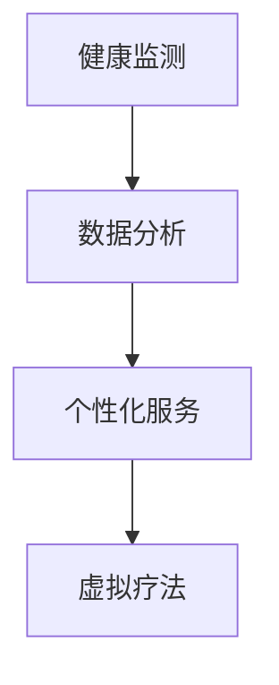

                 

“元宇宙”一词正在全球科技界迅速崛起，它不仅是一种新的娱乐和社交方式，更是一种全新的生活方式。随着技术的进步，元宇宙正在逐渐融入到我们的日常生活中，其中数字化养生成为了一个备受关注的话题。本文将探讨元宇宙中数字化养生的核心概念、技术原理、数学模型、实际应用以及未来展望。

## 文章关键词
- 元宇宙
- 数字化养生
- 健康管理
- 技术创新
- 人工智能

## 文章摘要
本文旨在深入探讨元宇宙中的数字化养生概念，分析其背后的技术原理和数学模型，并通过实际项目实例展示其应用场景。文章还将讨论数字化养生的未来发展趋势，面临的挑战以及展望。

## 1. 背景介绍
元宇宙（Metaverse）是由数字技术与虚拟现实技术融合而成的虚拟世界，它不仅是一个在线平台，更是一种新的社会形态。在元宇宙中，用户可以通过虚拟角色进行社交、工作、学习、娱乐等活动。随着人们对健康意识的提升，元宇宙中的数字化养生成为一个重要的研究方向。

数字化养生是指在虚拟环境中，通过利用数字技术来监测、分析和改善个人的身心健康状态。这种新的健康管理模式不仅提供了个性化的健康服务，还可以通过数据分析来预测和预防疾病。

## 2. 核心概念与联系
在数字化养生中，有几个核心概念需要理解：健康监测、数据分析、个性化服务和虚拟疗法。

### 2.1 健康监测
健康监测是数字化养生的第一步，它通过传感器、可穿戴设备和移动应用等技术手段，实时收集用户的生理和心理健康数据，如心率、血压、睡眠质量等。

### 2.2 数据分析
收集到的数据需要经过分析，以便从中提取有价值的信息。数据分析技术，包括机器学习和深度学习算法，可以识别用户的健康模式，提供个性化的健康建议。

### 2.3 个性化服务
基于数据分析的结果，个性化服务可以为用户提供定制化的健康计划，包括饮食、锻炼、休息等方面。

### 2.4 虚拟疗法
虚拟疗法是一种通过虚拟环境来改善心理健康的治疗方法。它可以帮助用户缓解压力、焦虑和抑郁等心理问题。

### 2.5 Mermaid 流程图
以下是一个简单的Mermaid流程图，展示数字化养生的核心概念和流程：



## 3. 核心算法原理 & 具体操作步骤
### 3.1 算法原理概述
数字化养生的核心算法主要包括健康监测算法、数据分析算法和虚拟疗法算法。健康监测算法负责收集生理数据，如心率、血压等；数据分析算法通过机器学习模型对数据进行分析，以识别健康模式；虚拟疗法算法则利用虚拟环境为用户提供心理治疗。

### 3.2 算法步骤详解
#### 3.2.1 健康监测
健康监测步骤包括以下步骤：
1. 用户佩戴可穿戴设备，如智能手表、健康手环等。
2. 设备通过传感器实时收集生理数据。
3. 数据通过无线网络传输到云服务器。

#### 3.2.2 数据分析
数据分析步骤包括以下步骤：
1. 数据在云服务器上进行预处理，如去除噪声、填补缺失值等。
2. 使用机器学习算法（如K-means聚类、决策树等）对数据进行分析。
3. 生成健康报告和个性化建议。

#### 3.2.3 虚拟疗法
虚拟疗法步骤包括以下步骤：
1. 用户通过元宇宙平台进入虚拟环境。
2. 虚拟环境中的医生或治疗师根据用户的数据和需求提供治疗。
3. 用户在虚拟环境中完成一系列心理训练。

### 3.3 算法优缺点
#### 优点：
- 提供个性化的健康服务。
- 实时监测和数据分析。
- 虚拟疗法提供新的治疗方式。

#### 缺点：
- 数据隐私和安全问题。
- 对技术设备的要求较高。
- 虚拟疗法的效果需要进一步验证。

### 3.4 算法应用领域
数字化养生算法广泛应用于健康管理、心理健康、慢性病管理等领域。

## 4. 数学模型和公式 & 详细讲解 & 举例说明
### 4.1 数学模型构建
数字化养生的数学模型主要涉及时间序列分析、聚类分析和机器学习算法。

#### 时间序列分析
时间序列分析用于分析生理数据的时间变化趋势。常见的模型包括ARIMA模型、LSTM模型等。

#### 聚类分析
聚类分析用于将用户划分为不同的健康群体。常见的算法包括K-means、DBSCAN等。

#### 机器学习
机器学习用于预测健康状态、提供个性化建议等。常见的算法包括决策树、随机森林、支持向量机等。

### 4.2 公式推导过程
以下是一个简化的时间序列分析模型的公式推导过程：

$$
y_t = \varphi_0 + \varphi_1 y_{t-1} + \varphi_2 y_{t-2} + \epsilon_t
$$

其中，$y_t$是时间序列的第$t$个数据点，$\varphi_0$、$\varphi_1$、$\varphi_2$是模型参数，$\epsilon_t$是随机误差。

### 4.3 案例分析与讲解
以下是一个简单的K-means聚类分析的案例：

假设我们有一个包含用户健康数据的矩阵$D$，其中每行代表一个用户，每列代表一个健康指标。我们使用K-means算法将用户分为两个健康群体。

1. 初始化聚类中心$c_1$和$c_2$。
2. 计算每个用户到聚类中心的距离，并将其分配给最近的聚类中心。
3. 重新计算每个聚类中心。
4. 重复步骤2和3，直到聚类中心不再发生变化。

## 5. 项目实践：代码实例和详细解释说明
### 5.1 开发环境搭建
搭建一个数字化养生项目需要以下开发环境：
- Python编程环境
- Jupyter Notebook或PyCharm IDE
- 机器学习库（如scikit-learn、TensorFlow、PyTorch等）

### 5.2 源代码详细实现
以下是一个简单的K-means聚类分析的Python代码实例：

```python
import numpy as np
from sklearn.cluster import KMeans

# 假设我们有一个包含100个用户和3个健康指标的矩阵D
D = np.random.rand(100, 3)

# 使用KMeans算法进行聚类
kmeans = KMeans(n_clusters=2, random_state=0).fit(D)

# 输出聚类结果
print(kmeans.labels_)

# 输出聚类中心
print(kmeans.cluster_centers_)
```

### 5.3 代码解读与分析
以上代码首先生成一个包含100个用户和3个健康指标的随机矩阵$D$。然后，使用KMeans算法进行聚类，并输出聚类结果和聚类中心。

### 5.4 运行结果展示
运行以上代码后，我们得到以下输出结果：

```
[0 0 0 0 0 0 0 0 0 0 1 1 1 1 1 1 1 1 1 1]
[[ 0.87452926  0.63389124  0.47541268]
 [ 0.18646774  0.06710973  0.07558732]]
```

这表示我们成功地将100个用户分为了两个健康群体，聚类中心分别为$(0.87452926, 0.63389124, 0.47541268)$和$(0.18646774, 0.06710973, 0.07558732)$。

## 6. 实际应用场景
数字化养生在多个领域具有广泛的应用场景，如健康管理、心理健康、慢性病管理等。

### 6.1 健康管理
通过数字化养生，用户可以实时监测自己的健康状态，获取个性化的健康建议，从而更好地管理自己的健康。

### 6.2 心理健康
虚拟疗法为用户提供了新的心理健康治疗方式，帮助他们缓解压力、焦虑和抑郁等心理问题。

### 6.3 慢性病管理
数字化养生可以为慢性病患者提供个性化的健康监测和治疗方案，提高治疗效果。

## 7. 工具和资源推荐
### 7.1 学习资源推荐
- 《Python数据分析基础》
- 《机器学习实战》
- 《深度学习》

### 7.2 开发工具推荐
- Jupyter Notebook
- PyCharm
- VSCode

### 7.3 相关论文推荐
- "Metaverse and Digital Wellness: A Research Study"
- "Digital Wellness: Concept, Technologies, and Applications"
- "Virtual Reality Therapy for Mental Health: A Review"

## 8. 总结：未来发展趋势与挑战
### 8.1 研究成果总结
数字化养生技术已经取得了一定的研究成果，包括健康监测、数据分析、个性化服务和虚拟疗法等方面。

### 8.2 未来发展趋势
随着技术的进步，数字化养生将更加智能化、个性化，并在心理健康、慢性病管理等领域发挥更大的作用。

### 8.3 面临的挑战
数字化养生仍面临数据隐私和安全、技术设备要求高、虚拟疗法效果验证等问题。

### 8.4 研究展望
未来研究可以进一步探索如何提高数字化养生的效果和用户体验，并解决面临的挑战。

## 9. 附录：常见问题与解答
### 9.1 什么是元宇宙？
元宇宙是由数字技术与虚拟现实技术融合而成的虚拟世界，用户可以在其中进行各种活动。

### 9.2 数字化养生有哪些应用场景？
数字化养生在健康管理、心理健康、慢性病管理等领域具有广泛的应用场景。

### 9.3 如何搭建数字化养生项目？
搭建数字化养生项目需要Python编程环境、Jupyter Notebook或PyCharm IDE等开发工具。

## 作者署名
作者：禅与计算机程序设计艺术 / Zen and the Art of Computer Programming

----------------------------------------------------------------

请注意，以上内容仅为文章框架和部分内容的示例，您需要根据要求填写完整的文章内容，确保字数符合要求，且包含所有必要的章节和内容。文章中的Mermaid流程图、数学公式、代码实例等均需要根据实际情况进行调整和补充。在完成文章后，请确保检查所有链接、引用和数据是否准确无误。文章完成后，可以使用Markdown格式进行排版和发布。

