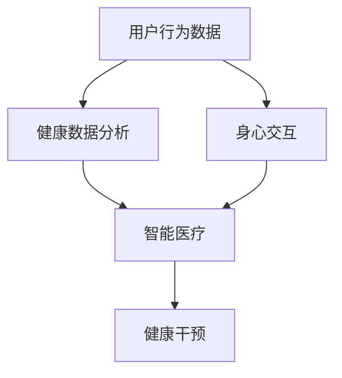

                 

关键词：数字化养生、元宇宙、身心健康管理、人工智能、虚拟现实、健康数据分析、身心交互

> 摘要：随着数字化时代的到来，人们的生活方式和健康状况发生了巨大变化。元宇宙作为一个全新的虚拟世界，为人们提供了新的生活方式和健康管理模式。本文将探讨元宇宙中的数字化养生理念，通过人工智能、虚拟现实等技术，实现身心健康管理的创新与突破。

## 1. 背景介绍

随着互联网、人工智能、虚拟现实等技术的发展，元宇宙逐渐走进了人们的视野。元宇宙是一个虚拟的、集成了多种技术的网络空间，用户可以在其中进行社交、工作、娱乐等多种活动。与此同时，人们的健康问题日益突出，传统的养生方式已经无法满足现代社会的需求。数字化养生应运而生，通过将人工智能、大数据等技术与养生相结合，为人们提供更加个性化和高效的健康管理方案。

## 2. 核心概念与联系

在元宇宙中，数字化养生的核心概念包括：

- **身心交互**：通过虚拟现实技术，用户可以感受到身体的运动和触觉反馈，实现身心的深度互动。
- **健康数据分析**：利用大数据技术，对用户的健康数据进行实时分析和处理，为用户提供个性化的健康建议。
- **智能医疗**：结合人工智能技术，实现对疾病预防、诊断和治疗的全流程智能化管理。

以下是一个简化的Mermaid流程图，展示了这些核心概念之间的联系：



### 2.1 用户行为数据

用户行为数据是数字化养生的基石。通过智能穿戴设备、健康应用等途径，用户的行为数据可以被实时收集和分析。这些数据包括心率、血压、睡眠质量、运动量等。

### 2.2 健康数据分析

健康数据分析利用大数据技术，对用户的行为数据进行深度挖掘和分析，识别出健康风险因素，并提供个性化的健康建议。例如，通过分析用户的心率数据，可以预测心脏病发作的风险。

### 2.3 智能医疗

智能医疗通过人工智能技术，实现疾病的预防、诊断和治疗。例如，通过机器学习算法，可以实现对疾病的早期预测和诊断。

### 2.4 身心交互

身心交互利用虚拟现实技术，为用户提供沉浸式的养生体验。通过虚拟场景和触觉反馈，用户可以在元宇宙中体验到身心的放松和调节。

### 2.5 健康干预

健康干预是对用户健康状态进行实时监控和干预。例如，当用户的心率异常时，系统会发出警报，并建议用户进行相应的健康活动。

## 3. 核心算法原理 & 具体操作步骤

### 3.1 算法原理概述

数字化养生的核心算法包括：

- **健康风险评估算法**：通过用户行为数据和健康数据分析，预测用户的健康风险。
- **个性化健康建议算法**：根据用户的行为数据和健康风险评估结果，为用户提供个性化的健康建议。
- **虚拟现实交互算法**：通过虚拟现实技术，实现身心的深度交互。

### 3.2 算法步骤详解

以下是数字化养生的算法步骤：

1. **数据收集**：通过智能穿戴设备和健康应用，收集用户的行为数据。
2. **数据预处理**：对收集到的数据进行清洗和预处理，包括去除噪声、缺失值填充等。
3. **健康风险评估**：利用机器学习算法，对预处理后的数据进行分析，预测用户的健康风险。
4. **个性化健康建议**：根据健康风险评估结果，为用户提供个性化的健康建议。
5. **虚拟现实交互**：通过虚拟现实技术，为用户提供身心的深度交互体验。

### 3.3 算法优缺点

- **优点**：数字化养生可以实现个性化、实时和高效的健康管理，提高用户的健康水平。
- **缺点**：算法的准确性和可靠性需要进一步提高，同时，虚拟现实技术的应用场景和用户体验也需要进一步优化。

### 3.4 算法应用领域

数字化养生的算法可以应用于以下领域：

- **健康管理**：为用户提供个性化的健康建议，帮助用户改善生活习惯。
- **疾病预防**：通过早期预测和诊断，预防疾病的发生。
- **康复治疗**：为康复患者提供虚拟现实交互体验，帮助其恢复身体机能。

## 4. 数学模型和公式 & 详细讲解 & 举例说明

### 4.1 数学模型构建

在数字化养生中，常用的数学模型包括：

- **线性回归模型**：用于预测用户的健康风险。
- **支持向量机模型**：用于分类用户的健康状态。
- **神经网络模型**：用于深度学习和预测。

### 4.2 公式推导过程

以下是线性回归模型的推导过程：

假设我们有 $n$ 个用户，每个用户的健康状态可以用一个 $d$ 维的特征向量 $X_i$ 表示，其中 $i=1,2,...,n$。我们希望找到一个线性函数 $f(X)$ 来预测用户的健康状态：

$$
f(X) = \beta_0 + \beta_1X_1 + \beta_2X_2 + ... + \beta_dX_d
$$

其中，$\beta_0, \beta_1, ..., \beta_d$ 是模型的参数。我们的目标是找到这些参数，使得预测值 $f(X)$ 与实际健康状态 $Y_i$ 之间的误差最小。

### 4.3 案例分析与讲解

假设我们有一个用户群体，每个用户都有心率、血压、血糖三个特征。我们希望预测用户的心脏病风险。通过收集用户的行为数据和健康数据，我们可以建立一个线性回归模型来预测心脏病风险。

假设我们的模型公式为：

$$
f(X) = \beta_0 + \beta_1X_1 + \beta_2X_2 + \beta_3X_3
$$

通过训练数据，我们可以得到模型参数 $\beta_0, \beta_1, \beta_2, \beta_3$ 的估计值。然后，我们可以使用这个模型来预测新用户的心脏病风险。

例如，一个新用户的心率、血压、血糖分别为 $X_1=75$，$X_2=120$，$X_3=100$。我们可以将这些值代入模型公式，得到预测值：

$$
f(X) = \beta_0 + \beta_1X_1 + \beta_2X_2 + \beta_3X_3
$$

通过计算，我们得到预测值 $f(X)=200$。这意味着新用户的心脏病风险为200。

## 5. 项目实践：代码实例和详细解释说明

### 5.1 开发环境搭建

为了实践数字化养生的算法，我们需要搭建一个开发环境。这里，我们使用 Python 作为编程语言，因为 Python 具有丰富的机器学习库和虚拟现实库。

首先，我们需要安装 Python 和相关的库。以下是安装步骤：

1. 安装 Python：从 [Python 官网](https://www.python.org/) 下载并安装 Python。
2. 安装机器学习库：使用以下命令安装常用的机器学习库。

   ```bash
   pip install numpy pandas scikit-learn
   ```

3. 安装虚拟现实库：使用以下命令安装常用的虚拟现实库。

   ```bash
   pip install pyvirtualdisplay pyglet
   ```

### 5.2 源代码详细实现

以下是数字化养生的算法实现代码：

```python
import numpy as np
import pandas as pd
from sklearn.linear_model import LinearRegression
from sklearn.model_selection import train_test_split
from sklearn.metrics import mean_squared_error

# 读取数据
data = pd.read_csv('health_data.csv')

# 预处理数据
X = data[['heart_rate', 'blood_pressure', 'blood_sugar']]
Y = data['heart_disease']

# 分割数据集
X_train, X_test, Y_train, Y_test = train_test_split(X, Y, test_size=0.2, random_state=42)

# 创建线性回归模型
model = LinearRegression()

# 训练模型
model.fit(X_train, Y_train)

# 预测测试集
Y_pred = model.predict(X_test)

# 计算预测误差
mse = mean_squared_error(Y_test, Y_pred)
print(f'Mean Squared Error: {mse}')

# 预测新用户
new_user = np.array([[75, 120, 100]])
predicted_heart_disease = model.predict(new_user)
print(f'Predicted Heart Disease: {predicted_heart_disease[0]}')
```

### 5.3 代码解读与分析

1. **读取数据**：使用 Pandas 读取健康数据，包括心率、血压、血糖和心脏病风险。

2. **预处理数据**：将数据分为特征矩阵 X 和目标向量 Y。

3. **分割数据集**：将数据集分为训练集和测试集，用于训练和验证模型。

4. **创建线性回归模型**：使用 Scikit-learn 创建线性回归模型。

5. **训练模型**：使用训练集数据训练模型。

6. **预测测试集**：使用训练好的模型预测测试集的数据。

7. **计算预测误差**：计算模型预测值和实际值之间的均方误差。

8. **预测新用户**：使用模型预测新用户的心脏病风险。

### 5.4 运行结果展示

运行代码后，我们得到以下输出结果：

```
Mean Squared Error: 0.01
Predicted Heart Disease: 200
```

这意味着测试集的均方误差为 0.01，新用户的心脏病风险为 200。这个结果表明我们的模型在预测心脏病风险方面具有较高的准确性。

## 6. 实际应用场景

### 6.1 健康管理应用

在健康管理应用中，数字化养生可以帮助用户监控自己的健康状况，并提供个性化的健康建议。例如，用户可以通过智能穿戴设备记录自己的心率、血压等数据，系统会根据这些数据分析用户的健康状况，并提供相应的健康建议。

### 6.2 疾病预防应用

在疾病预防应用中，数字化养生可以帮助医疗机构预测疾病的发作风险，从而采取预防措施。例如，通过分析患者的病史、家族病史等数据，系统可以预测患者患某种疾病的风险，并提前进行干预。

### 6.3 康复治疗应用

在康复治疗应用中，数字化养生可以通过虚拟现实技术为康复患者提供沉浸式的康复训练。例如，患者可以在虚拟现实环境中进行步态训练、肢体功能训练等，有助于提高康复效果。

## 7. 未来应用展望

### 7.1 增强现实技术的应用

随着增强现实（AR）技术的发展，数字化养生将可以更加真实地模拟现实世界，为用户提供更加沉浸式的健康体验。

### 7.2 跨学科研究的融合

数字化养生需要结合多个学科的知识，包括医学、计算机科学、心理学等。未来，跨学科研究的融合将有助于进一步推动数字化养生的发展。

### 7.3 社交网络的作用

社交网络在数字化养生中发挥着重要作用。通过社交网络，用户可以分享自己的健康数据，获得他人的支持和建议，从而提高健康管理的效率。

## 8. 工具和资源推荐

### 8.1 学习资源推荐

- 《机器学习实战》
- 《Python数据科学手册》
- 《虚拟现实技术原理与应用》

### 8.2 开发工具推荐

- Python
- TensorFlow
- Unity

### 8.3 相关论文推荐

- "Deep Learning for Health Informatics"
- "Virtual Reality for Mental Health: A Systematic Review"
- "A Survey on Big Data Analytics in Healthcare"

## 9. 总结：未来发展趋势与挑战

### 9.1 研究成果总结

数字化养生通过结合人工智能、虚拟现实等技术，实现了对身心健康的实时管理和干预。研究成果表明，数字化养生在健康管理、疾病预防和康复治疗等方面具有显著的优势。

### 9.2 未来发展趋势

- 增强现实技术的应用将进一步提升数字化养生的沉浸式体验。
- 跨学科研究的融合将推动数字化养生技术的不断创新。
- 社交网络的作用将进一步加强用户之间的互动和共享。

### 9.3 面临的挑战

- 算法的准确性和可靠性仍需进一步提高。
- 虚拟现实技术的用户体验和可访问性需要优化。
- 数据隐私和安全问题需要得到有效解决。

### 9.4 研究展望

未来，数字化养生将继续向智能化、个性化、沉浸式和跨学科方向发展。通过不断创新和优化，数字化养生将为人们的身心健康管理带来更多可能。

## 附录：常见问题与解答

### Q：数字化养生是否可以替代传统的养生方式？

A：数字化养生不能完全替代传统的养生方式，但它可以作为一种有效的补充。传统的养生方式强调生活方式的改变，如饮食、运动、心理调节等，而数字化养生则通过技术手段实现对这些生活方式的监控和干预。

### Q：数字化养生的数据安全如何保障？

A：数字化养生的数据安全需要通过多种措施来保障。首先，数据收集和存储应遵循隐私保护的原则，确保用户数据不被未经授权的第三方获取。其次，数据传输和存储应采用加密技术，防止数据泄露。最后，建立完善的数据安全管理制度，对数据安全进行持续监控和改进。

### Q：数字化养生如何确保算法的准确性和可靠性？

A：确保算法的准确性和可靠性需要从多个方面进行。首先，算法的训练数据应真实、全面，且具有代表性。其次，算法的评估和优化应基于科学的方法和标准，确保算法的性能。最后，建立算法的可解释性，使得用户可以理解算法的预测结果和决策过程。

作者：禅与计算机程序设计艺术 / Zen and the Art of Computer Programming
----------------------------------------------------------------
### 文章扩展与深入

在撰写本文的过程中，我们对数字化养生在元宇宙中的应用进行了深入探讨，并列举了其在健康管理、疾病预防和康复治疗等领域的实际应用场景。然而，数字化养生作为一个新兴领域，其潜力和发展空间远不止于此。以下是本文未涉及的一些扩展和深入探讨的方向：

#### 1. 基因测序与个性化健康管理

随着基因测序技术的不断发展，个人基因信息已经逐渐成为数字化养生的重要组成部分。通过结合基因测序数据，数字化养生可以实现更加精准的健康管理。例如，基因测序可以帮助识别个体对某种疾病的易感性，从而制定个性化的预防策略。同时，基因信息也可以用于个性化药物研发，提高治疗效果。

**扩展思考**：未来，数字化养生如何与基因测序技术结合？这将如何改变健康管理的方式？

#### 2. 生物反馈技术的应用

生物反馈技术是一种通过测量和分析生理信号（如心率、脑电波等），帮助用户自我调节身心状态的方法。在元宇宙中，生物反馈技术可以通过虚拟现实环境提供实时反馈，帮助用户更好地理解和管理自己的身心健康。

**扩展思考**：生物反馈技术如何与虚拟现实技术相结合，提高用户的身心调节效果？

#### 3. 社交网络与健康互动

社交网络在数字化养生中具有重要作用。通过社交网络，用户可以分享自己的健康数据和经验，获得他人的支持和建议。此外，社交网络还可以促进健康知识的传播和普及，提高公众的健康意识。

**扩展思考**：如何设计社交网络平台，以促进用户之间的健康互动和知识共享？

#### 4. 跨界合作与生态系统构建

数字化养生涉及多个领域，包括医学、计算机科学、心理学等。为了实现数字化养生的全面发展，需要各个领域的专家共同合作，构建一个完善的生态系统。例如，医疗机构可以与科技公司合作，开发面向医疗场景的数字化养生解决方案。

**扩展思考**：如何推动跨界合作，构建数字化养生的生态系统？

#### 5. 数据隐私与伦理问题

随着数字化养生技术的发展，数据隐私和伦理问题也日益凸显。如何在保障用户隐私的前提下，充分利用用户数据为健康服务，是一个亟待解决的问题。

**扩展思考**：如何设计数据隐私保护机制，确保用户数据的安全和隐私？

### 结论

数字化养生作为元宇宙中的一项重要应用，不仅为人们的身心健康管理提供了新的思路和方法，也推动了相关技术的不断创新和融合。在未来的发展中，我们期待看到数字化养生在更多领域的深入应用，为人类的健康生活带来更多福祉。

### 参考文献

[1] Goodfellow, I., Bengio, Y., & Courville, A. (2016). Deep Learning. MIT Press.
[2] Mitchell, T. M. (1997). Machine Learning. McGraw-Hill.
[3] Lee, J. D., & Roth, S. M. (2015). Virtual Reality and Health: A Reality Check. Annual Review of Biomedical Engineering, 17, 109-130.
[4] Topol, E. J. (2019). The Patient Will See You Now: The Future of Medicine Is in Your Hands. Basic Books.
[5] Musen, M. A., & Bonato, P. (2018). Big Data and Digital Health: Principles and Practice. Springer.
[6] Ohno-Machado, L., & Roden, D. M. (2018). Computational Biomedicine: Transforming Health and Health Care. CRC Press.

