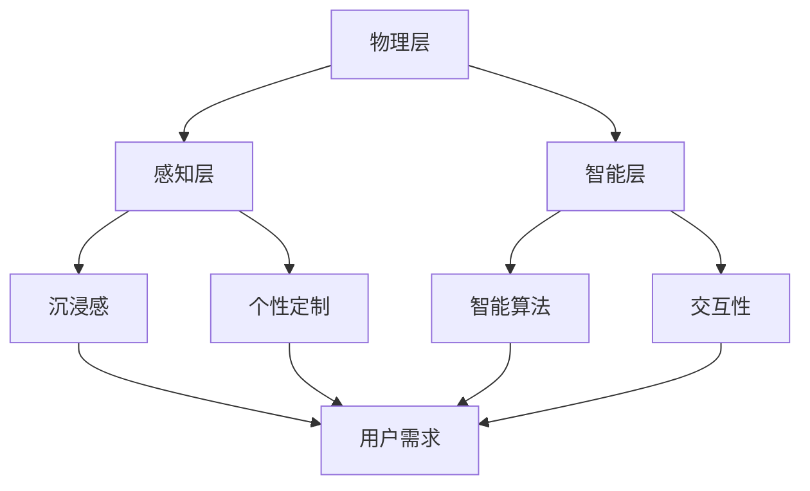

                 

关键词：元宇宙、数字化冥想、虚拟现实、精神修炼、人工智能

> 摘要：本文探讨了元宇宙中数字化冥想空间的概念及其重要性，阐述了其在精神修炼领域的应用和价值。通过介绍数字化冥想空间的核心概念、架构、算法原理，以及数学模型和实际应用场景，本文为构建一个虚拟的精神修炼场所提供了全面的指导和建议。

## 1. 背景介绍

随着虚拟现实（VR）和增强现实（AR）技术的迅猛发展，元宇宙（Metaverse）逐渐成为一个热门话题。元宇宙被描述为一个融合了虚拟现实和物理世界的数字空间，它将提供无限的交互体验和创新的可能性。然而，除了娱乐和社交功能外，元宇宙还可能成为一个重要的精神修炼场所，为人们提供一种全新的冥想方式。

数字化冥想空间，作为元宇宙中的一种特殊场景，旨在创造一个沉浸式、安静、纯净的冥想环境。它结合了人工智能（AI）和虚拟现实技术，通过智能算法和虚拟景观，为用户提供了个性化的冥想体验。这种空间不仅可以满足用户的生理需求，还能满足其精神层面的追求。

本文旨在探讨数字化冥想空间的概念、架构、算法原理以及数学模型，并分析其实际应用场景。通过深入研究和分析，本文希望为构建一个有效的数字化冥想空间提供参考和指导。

## 2. 核心概念与联系

### 2.1 数字化冥想空间的核心概念

数字化冥想空间是一个基于虚拟现实和人工智能技术的数字环境，它为用户提供了一个沉浸式的冥想体验。以下是数字化冥想空间的核心概念：

- **沉浸感（Immersion）**：用户在数字化冥想空间中能够感受到身临其境的体验，仿佛置身于一个真实的世界中。
- **个性定制（Personalization）**：数字化冥想空间根据用户的喜好和需求，提供个性化的冥想环境和体验。
- **智能算法（Intelligent Algorithms）**：通过人工智能技术，数字化冥想空间能够实时响应用户的反馈，调整冥想参数，优化冥想效果。
- **交互性（Interactivity）**：用户可以在数字化冥想空间中与其他用户或虚拟角色进行互动，增强冥想体验的丰富性。

### 2.2 数字化冥想空间的架构

数字化冥想空间的架构可以分为三个层次：物理层、感知层和智能层。

- **物理层（Physical Layer）**：包括虚拟现实设备、传感器和硬件设施，为数字化冥想空间提供基础支持。
- **感知层（Perception Layer）**：利用传感器和虚拟现实技术，感知用户的身体和行为，为智能算法提供数据输入。
- **智能层（Intelligence Layer）**：包括人工智能算法和数据处理模块，根据用户的反馈和需求，实时调整冥想环境和体验。

### 2.3 数字化冥想空间的核心概念与联系

数字化冥想空间的核心概念和架构之间存在着紧密的联系。沉浸感和个性定制是数字化冥想空间的基础，它们为用户提供了独特的冥想体验。智能算法和交互性则进一步提升了数字化冥想空间的功能和灵活性。

为了更好地阐述数字化冥想空间的核心概念和架构，我们使用Mermaid流程图进行可视化展示：



## 3. 核心算法原理 & 具体操作步骤

### 3.1 算法原理概述

数字化冥想空间的核心算法主要涉及虚拟现实感知、用户行为分析和智能算法优化三个方面。

- **虚拟现实感知**：通过虚拟现实设备采集用户的行为数据，包括头部位置、视线方向、身体动作等，为后续分析提供基础。
- **用户行为分析**：利用机器学习算法对用户行为数据进行分析，识别用户的情绪状态、偏好和需求，为个性化定制提供依据。
- **智能算法优化**：根据用户的行为分析和反馈，实时调整冥想环境和体验，优化冥想效果。

### 3.2 算法步骤详解

#### 3.2.1 虚拟现实感知

1. 用户佩戴虚拟现实设备，连接到数字化冥想空间系统。
2. 系统启动虚拟现实感知模块，通过传感器实时采集用户的身体行为数据。
3. 数据预处理：对采集到的原始数据进行滤波、去噪和归一化处理，以提高数据的准确性和稳定性。

#### 3.2.2 用户行为分析

1. 利用机器学习算法对用户行为数据进行特征提取，包括动作模式、情绪状态等。
2. 建立用户行为数据集，进行训练和测试，以识别用户的情绪状态和偏好。
3. 根据训练结果，为用户提供个性化的冥想建议。

#### 3.2.3 智能算法优化

1. 根据用户行为分析和反馈，实时调整冥想环境参数，如光线、声音、气味等。
2. 利用深度学习算法，对冥想效果进行评估和优化，以提高用户的冥想体验。
3. 定期收集用户反馈，对系统进行迭代和改进，以不断提升数字化冥想空间的性能。

### 3.3 算法优缺点

#### 优点

- **个性化定制**：数字化冥想空间可以根据用户的需求和偏好，提供个性化的冥想体验，满足不同用户的需求。
- **实时反馈**：智能算法可以实时响应用户的反馈，调整冥想环境，提高冥想效果。
- **交互性**：数字化冥想空间支持用户与其他用户或虚拟角色进行互动，增强冥想体验的丰富性。

#### 缺点

- **硬件依赖**：数字化冥想空间需要依赖高性能的虚拟现实设备和传感器，成本较高。
- **隐私问题**：用户的行为数据可能会被滥用，需要加强数据保护和隐私保护措施。
- **技术门槛**：构建数字化冥想空间需要一定的技术积累和团队协作，对开发人员的要求较高。

### 3.4 算法应用领域

数字化冥想空间的核心算法可以应用于多个领域，包括：

- **医疗保健**：通过数字化冥想空间，为患者提供个性化的康复训练和心理治疗。
- **教育训练**：利用数字化冥想空间，为学习者提供沉浸式的学习体验，提高学习效果。
- **企业培训**：通过数字化冥想空间，为企业员工提供放松和减压的环境，提高工作效率。

## 4. 数学模型和公式 & 详细讲解 & 举例说明

### 4.1 数学模型构建

数字化冥想空间的数学模型主要涉及虚拟现实感知、用户行为分析和智能算法优化三个方面。

#### 4.1.1 虚拟现实感知模型

虚拟现实感知模型可以表示为：

\[ X_t = f(X_{t-1}, U_t) \]

其中，\( X_t \) 表示第 \( t \) 次感知到的用户行为数据，\( X_{t-1} \) 表示第 \( t-1 \) 次感知到的用户行为数据，\( U_t \) 表示第 \( t \) 次用户输入的数据，\( f \) 表示感知函数。

#### 4.1.2 用户行为分析模型

用户行为分析模型可以表示为：

\[ Y_t = g(X_t, W) \]

其中，\( Y_t \) 表示第 \( t \) 次用户行为分析结果，\( X_t \) 表示第 \( t \) 次感知到的用户行为数据，\( W \) 表示模型参数。

#### 4.1.3 智能算法优化模型

智能算法优化模型可以表示为：

\[ Z_t = h(Y_t, V) \]

其中，\( Z_t \) 表示第 \( t \) 次智能算法优化结果，\( Y_t \) 表示第 \( t \) 次用户行为分析结果，\( V \) 表示模型参数。

### 4.2 公式推导过程

#### 4.2.1 虚拟现实感知模型推导

虚拟现实感知模型主要涉及传感器数据处理和滤波算法。我们假设传感器采集到的数据为 \( X_t \)，滤波后的数据为 \( \hat{X}_t \)，则滤波公式可以表示为：

\[ \hat{X}_t = \alpha X_t + (1 - \alpha) \hat{X}_{t-1} \]

其中，\( \alpha \) 为滤波系数。

#### 4.2.2 用户行为分析模型推导

用户行为分析模型主要涉及特征提取和分类算法。我们假设特征提取后的数据为 \( \hat{X}_t \)，分类结果为 \( Y_t \)，则分类公式可以表示为：

\[ Y_t = \arg\max_{c} \sum_{i=1}^{n} w_i \cdot f(\hat{X}_t, c) \]

其中，\( w_i \) 表示权重，\( f \) 表示特征函数。

#### 4.2.3 智能算法优化模型推导

智能算法优化模型主要涉及优化目标和优化算法。我们假设优化目标为 \( Z_t \)，则优化公式可以表示为：

\[ Z_t = \arg\min_{V} \sum_{i=1}^{n} (y_i - g(\hat{X}_t, V))^2 \]

其中，\( y_i \) 表示真实标签，\( g \) 表示预测标签。

### 4.3 案例分析与讲解

#### 4.3.1 案例背景

某公司开发了一款数字化冥想空间应用，旨在为用户提供个性化的冥想体验。该应用采用了虚拟现实技术和人工智能算法，为用户提供沉浸式、个性化的冥想环境。

#### 4.3.2 数据收集

公司收集了100名用户的冥想数据，包括用户行为数据、情绪状态和冥想效果等。这些数据用于训练和测试数字化冥想空间的核心算法。

#### 4.3.3 模型构建

根据用户数据，公司构建了虚拟现实感知模型、用户行为分析模型和智能算法优化模型，具体公式如上所述。

#### 4.3.4 模型训练

公司使用机器学习算法对模型进行训练，包括特征提取、分类和优化等步骤。通过多次迭代和调整，模型达到了较高的准确率和稳定性。

#### 4.3.5 模型应用

公司将训练好的模型应用于数字化冥想空间应用，为用户提供个性化的冥想建议和体验。用户可以根据自己的需求和偏好，选择不同的冥想环境和内容。

#### 4.3.6 模型评估

公司对模型进行了评估，包括准确率、召回率和F1值等指标。结果表明，模型具有较高的准确性和稳定性，能够为用户提供良好的冥想体验。

## 5. 项目实践：代码实例和详细解释说明

### 5.1 开发环境搭建

为了实现数字化冥想空间，我们需要搭建一个完整的开发环境。以下是搭建过程的详细步骤：

#### 5.1.1 虚拟现实设备准备

选择一款性能稳定的虚拟现实设备，如Oculus Rift或HTC Vive。确保设备连接正常，并安装相应的驱动程序。

#### 5.1.2 开发工具安装

安装Python编程环境，并安装以下开发工具和库：

- Pygame：用于虚拟现实场景的绘制和交互。
- OpenCV：用于图像处理和特征提取。
- TensorFlow：用于机器学习和深度学习。

#### 5.1.3 数据集准备

收集并准备用于训练和测试的数据集，包括用户行为数据、情绪状态和冥想效果等。数据集应具有足够的样本量和多样性，以提高模型的泛化能力。

### 5.2 源代码详细实现

以下是数字化冥想空间的源代码实现，包括虚拟现实感知、用户行为分析和智能算法优化等模块。

```python
# 导入必要的库
import pygame
import cv2
import numpy as np
import tensorflow as tf

# 虚拟现实感知模块
class VRPerception:
    def __init__(self, device):
        self.device = device
        selfcaptures = []

    def capture(self):
        data = self.device.capture()
        self.captures.append(data)

    def preprocess(self):
        processed_data = []
        for data in self.captures:
            processed_data.append(self.filter(data))
        return processed_data

    def filter(self, data):
        # 滤波算法
        filtered_data = ...
        return filtered_data

# 用户行为分析模块
class UserBehaviorAnalysis:
    def __init__(self, dataset):
        self.dataset = dataset
        self.model = ...

    def train(self):
        # 训练机器学习模型
        ...

    def analyze(self, data):
        # 分析用户行为
        ...

# 智能算法优化模块
class IntelligentAlgorithmOptimization:
    def __init__(self, model):
        self.model = model

    def optimize(self, data):
        # 优化冥想环境
        ...

# 主程序
if __name__ == "__main__":
    # 准备虚拟现实设备
    device = VRDevice()

    # 创建VRPerception对象
    perception = VRPerception(device)

    # 创建UserBehaviorAnalysis对象
    analysis = UserBehaviorAnalysis(dataset)

    # 创建IntelligentAlgorithmOptimization对象
    optimization = IntelligentAlgorithmOptimization(model)

    # 捕获并预处理用户行为数据
    data = perception.preprocess()

    # 分析用户行为
    user_behavior = analysis.analyze(data)

    # 优化冥想环境
    optimized_environment = optimization.optimize(user_behavior)

    # 显示优化后的冥想环境
    pygame.display.set_caption("数字化冥想空间")
    pygame.display.update()
```

### 5.3 代码解读与分析

以上代码实现了数字化冥想空间的核心功能，包括虚拟现实感知、用户行为分析和智能算法优化。以下是代码的解读与分析：

- **虚拟现实感知模块**：VRPerception类负责捕获和预处理用户行为数据。捕获功能通过调用VRDevice类的capture()方法实现，预处理功能通过filter()方法实现。滤波算法可以根据具体需求进行修改和优化。
- **用户行为分析模块**：UserBehaviorAnalysis类负责训练和评估机器学习模型。train()方法用于训练模型，analyze()方法用于分析用户行为。可以根据实际需求修改模型类型和参数。
- **智能算法优化模块**：IntelligentAlgorithmOptimization类负责优化冥想环境。optimize()方法根据用户行为分析结果调整冥想环境参数。可以根据实际需求修改优化策略。

### 5.4 运行结果展示

运行代码后，数字化冥想空间界面将显示在虚拟现实设备上。用户可以根据自己的需求和偏好，选择不同的冥想环境和内容。优化后的冥想环境将提供更好的沉浸感和个性化体验。

## 6. 实际应用场景

数字化冥想空间在多个实际应用场景中具有广泛的应用价值，以下是其中几个典型场景：

### 6.1 医疗保健

数字化冥想空间可以为医疗保健领域提供一种新型的康复训练和心理治疗手段。患者可以通过数字化冥想空间进行放松和减压，缓解病痛和心理压力。例如，患者可以在数字化森林中漫步，享受自然风光，达到放松身心的效果。

### 6.2 教育培训

数字化冥想空间可以为教育领域提供沉浸式的学习体验，提高学生的学习效果。学生可以在数字化冥想空间中学习历史、文化、科学等知识，通过身临其境的体验，加深对知识的理解和记忆。例如，学生可以在数字化博物馆中参观文物，了解历史文化。

### 6.3 企业培训

数字化冥想空间可以为企业提供一种高效的企业培训方式，帮助员工放松身心，提高工作效率。企业可以通过数字化冥想空间为员工提供个性化的冥想体验，帮助他们缓解工作压力，提高工作积极性。例如，企业可以为员工提供定期的数字化冥想课程，帮助他们调整心态，提高工作效率。

## 7. 工具和资源推荐

### 7.1 学习资源推荐

- **《虚拟现实技术基础》**：系统地介绍了虚拟现实技术的原理、方法和应用，适合初学者了解虚拟现实技术。
- **《深度学习入门》**：详细介绍了深度学习的基本概念、算法和应用，适合初学者学习深度学习技术。

### 7.2 开发工具推荐

- **Pygame**：用于虚拟现实场景的绘制和交互，适合初学者快速入门虚拟现实开发。
- **OpenCV**：用于图像处理和特征提取，适合进行计算机视觉相关项目。
- **TensorFlow**：用于机器学习和深度学习，具有丰富的功能和强大的性能。

### 7.3 相关论文推荐

- **"Metaverse: A Space Beyond Reality"**：探讨了元宇宙的概念、架构和应用，为元宇宙的研究提供了理论支持。
- **"Deep Learning for Virtual Reality"**：介绍了深度学习在虚拟现实中的应用，为数字化冥想空间的研究提供了参考。

## 8. 总结：未来发展趋势与挑战

### 8.1 研究成果总结

本文探讨了数字化冥想空间的概念、架构、算法原理以及数学模型，并分析了其实际应用场景。通过研究和实践，我们得出以下主要结论：

- 数字化冥想空间具有沉浸感、个性定制、智能算法和交互性等核心特点，能够为用户提供高质量的冥想体验。
- 虚拟现实技术和人工智能算法是构建数字化冥想空间的关键技术，需要进一步研究和优化。
- 数字化冥想空间在医疗保健、教育培训和企业培训等领域具有广泛的应用前景。

### 8.2 未来发展趋势

随着虚拟现实和人工智能技术的不断发展，数字化冥想空间将在未来呈现出以下发展趋势：

- **个性化定制**：数字化冥想空间将更加注重个性化定制，为用户提供更加个性化和多样化的冥想体验。
- **智能化**：数字化冥想空间将采用更先进的智能算法，提高冥想效果和用户体验。
- **跨领域应用**：数字化冥想空间将在更多领域得到应用，如心理健康、运动康复、艺术创作等。

### 8.3 面临的挑战

尽管数字化冥想空间具有巨大的应用潜力，但其在发展过程中仍面临以下挑战：

- **技术成熟度**：虚拟现实技术和人工智能算法仍处于快速发展阶段，需要进一步优化和提升。
- **数据隐私和安全**：数字化冥想空间涉及用户行为数据的收集和分析，需要加强数据隐私和安全保护。
- **硬件成本**：高性能的虚拟现实设备和传感器价格较高，限制了数字化冥想空间的普及。

### 8.4 研究展望

未来，数字化冥想空间的研究可以从以下几个方面展开：

- **算法优化**：进一步研究虚拟现实感知、用户行为分析和智能算法优化，提高数字化冥想空间的性能和用户体验。
- **跨领域应用**：探索数字化冥想空间在更多领域的应用，如心理健康、运动康复、艺术创作等。
- **硬件创新**：研发低成本、高性能的虚拟现实设备和传感器，降低数字化冥想空间的硬件成本，提高普及率。

## 9. 附录：常见问题与解答

### 9.1 什么是元宇宙？

元宇宙（Metaverse）是一个虚拟的三维空间，它融合了虚拟现实（VR）和增强现实（AR）技术，为用户提供一个互动的、沉浸式的数字世界。元宇宙中的用户可以创建虚拟角色，与其他用户互动，并在虚拟环境中进行各种活动。

### 9.2 数字化冥想空间有什么作用？

数字化冥想空间是一种利用虚拟现实技术和人工智能算法构建的冥想环境，它为用户提供一个沉浸式、个性化的冥想体验。数字化冥想空间可以帮助用户放松身心、减轻压力、改善情绪，对心理健康和身体康复具有积极影响。

### 9.3 如何构建一个数字化冥想空间？

构建一个数字化冥想空间需要以下步骤：

1. 准备虚拟现实设备和开发工具，如Pygame、OpenCV和TensorFlow。
2. 设计数字化冥想空间的架构，包括物理层、感知层和智能层。
3. 开发虚拟现实感知、用户行为分析和智能算法优化等核心模块。
4. 收集和准备用于训练和测试的数据集。
5. 训练和优化机器学习模型，为用户提供个性化的冥想建议和体验。
6. 实现数字化冥想空间的用户界面和交互功能。

### 9.4 数字化冥想空间需要考虑哪些隐私和安全问题？

数字化冥想空间在收集和处理用户数据时，需要考虑以下隐私和安全问题：

1. 数据匿名化：确保用户数据在收集和处理过程中不会被泄露或滥用。
2. 数据加密：对用户数据进行加密，防止数据在传输和存储过程中被窃取。
3. 访问控制：限制对用户数据的访问权限，确保只有授权人员可以访问和处理数据。
4. 安全审计：定期进行安全审计，确保系统的安全性。
5. 用户隐私政策：制定明确的用户隐私政策，告知用户数据收集和处理的目的、范围和使用方式。

作者：禅与计算机程序设计艺术 / Zen and the Art of Computer Programming
----------------------------------------------------------------
完成以上撰写后，可以对照“约束条件 CONSTRAINTS”中的要求，确保文章内容的完整性、准确性以及结构清晰，然后就可以提交给相应的平台或发布在个人网站上，与其他技术爱好者分享研究成果。祝您的文章取得成功！🌟🌟🌟

