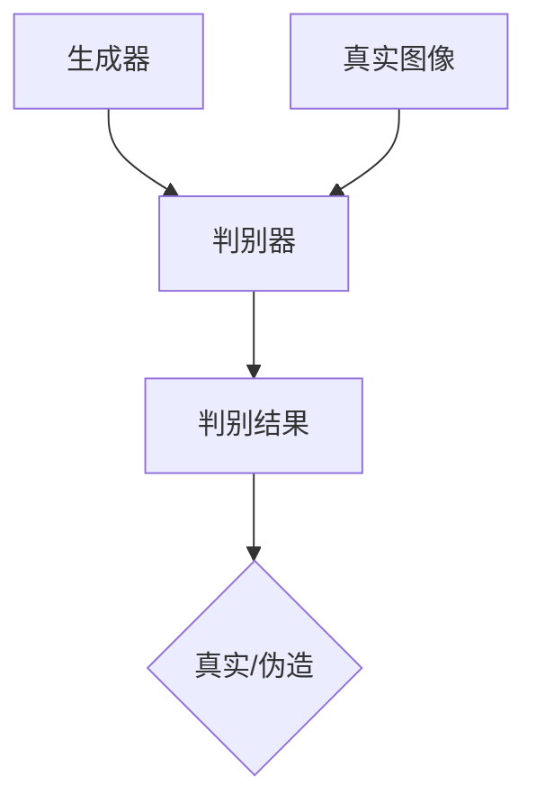
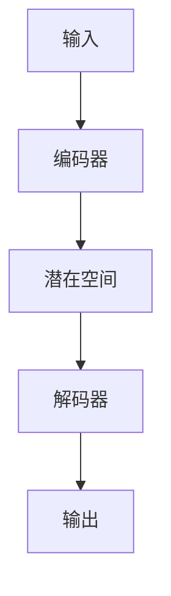
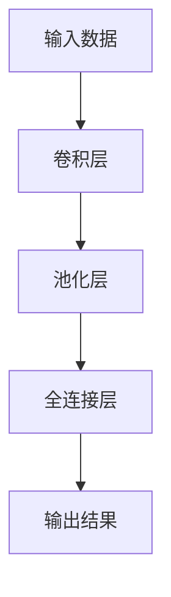
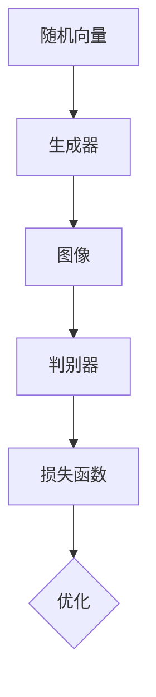
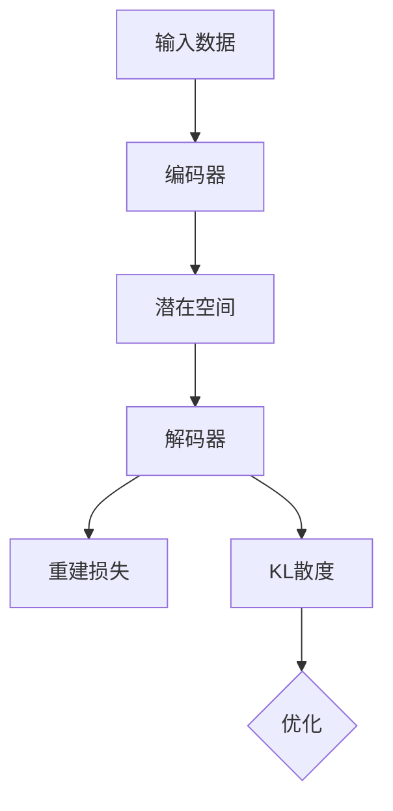

                 

关键词：人工智能，艺术创作，数字化，算法，创新，数字艺术

摘要：随着人工智能技术的飞速发展，数字化创造力在艺术领域的应用逐渐成为热点。本文旨在探讨AI在艺术创作中的潜力，通过分析核心概念、算法原理、数学模型和实际应用案例，揭示人工智能如何激发艺术革新。

## 1. 背景介绍

艺术与技术的结合自古以来就有着丰富的历史。从文艺复兴时期的透视画法，到现代的数字特效和虚拟现实，技术一直为艺术家提供了新的表现手段和创作空间。然而，随着人工智能（AI）技术的兴起，艺术创作的方式和过程正在经历前所未有的变革。

AI具有处理大量数据、模式识别和生成新的内容的能力，这些特性使其在艺术创作中具有独特的优势。一方面，AI可以辅助人类艺术家，提高创作效率和精度；另一方面，AI本身可以独立进行艺术创作，产生出独特的艺术作品。

本文将探讨AI在艺术创作中的多种应用，包括风格迁移、图像生成、音乐创作等，通过具体的算法原理和实际案例，展示人工智能如何激发艺术革新。

## 2. 核心概念与联系

为了更好地理解AI在艺术创作中的应用，我们首先需要了解几个核心概念，包括生成对抗网络（GAN）、变分自编码器（VAE）、深度学习等。

### 2.1 生成对抗网络（GAN）

生成对抗网络是由两部分组成：生成器（Generator）和判别器（Discriminator）。生成器的任务是生成尽可能真实的图像，而判别器的任务是区分图像是真实的还是由生成器生成的。通过不断地训练，生成器和判别器互相博弈，生成器逐渐提高生成图像的质量。



### 2.2 变分自编码器（VAE）

变分自编码器是一种基于深度学习的生成模型，它通过编码器和解码器的结构，将输入数据映射到一个潜在空间，然后在潜在空间中生成新的数据。VAE的优点在于它能够生成多样化的数据，同时保持数据的分布。



### 2.3 深度学习

深度学习是一种基于多层神经网络的学习方法，通过多层次的变换，自动提取输入数据的高层特征。在艺术创作中，深度学习可以用于图像分类、图像生成、图像增强等任务。



## 3. 核心算法原理 & 具体操作步骤

### 3.1 算法原理概述

在本节中，我们将介绍几种在艺术创作中常用的AI算法，包括GAN、VAE和深度神经网络。

#### GAN原理

GAN的基本原理是利用生成器和判别器之间的博弈来提高生成图像的质量。生成器的输入是一个随机向量，它通过神经网络映射生成图像；判别器的输入是真实的图像和生成器生成的图像，它的任务是判断图像的真伪。通过损失函数的优化，生成器和判别器不断改进，最终生成器能够生成接近真实图像的图像。



#### VAE原理

VAE的核心是编码器和解码器。编码器将输入数据映射到一个潜在空间，解码器从潜在空间中生成新的数据。VAE的损失函数包括重建损失和KL散度，通过优化这个损失函数，VAE能够生成多样化的数据。



#### 深度神经网络原理

深度神经网络由多个层级组成，包括卷积层、池化层和全连接层。卷积层用于提取图像的局部特征，池化层用于降低数据维度，全连接层用于分类或回归。通过逐层训练，深度神经网络能够自动提取输入数据的高层次特征。


### 3.2 算法步骤详解

在本节中，我们将详细解释GAN、VAE和深度神经网络的训练和实现步骤。

#### GAN训练步骤

1. 初始化生成器和判别器，通常使用随机初始化。
2. 对于每个训练样本，生成器生成一组图像，判别器同时接收真实图像和生成图像。
3. 计算判别器的损失函数，包括真实图像的损失和生成图像的损失。
4. 优化判别器参数，使其能够更好地区分真实图像和生成图像。
5. 优化生成器参数，使其能够生成更真实的图像。
6. 重复步骤2-5，直到生成器生成的图像质量达到预期。

#### VAE训练步骤

1. 初始化编码器和解码器，通常使用随机初始化。
2. 对于每个训练样本，编码器将其映射到潜在空间，解码器从潜在空间中生成新的图像。
3. 计算重建损失和KL散度，作为损失函数。
4. 优化编码器和解码器参数，使其能够生成更多样化的图像。
5. 重复步骤2-4，直到VAE生成的图像质量达到预期。

#### 深度神经网络训练步骤

1. 初始化神经网络参数，通常使用随机初始化。
2. 对于每个训练样本，通过前向传播计算输出。
3. 计算损失函数，例如交叉熵损失。
4. 通过反向传播更新神经网络参数。
5. 重复步骤2-4，直到网络训练完成。

### 3.3 算法优缺点

GAN的优点在于其强大的生成能力，能够生成高质量的图像。然而，GAN的训练过程较为复杂，容易出现模式崩溃（mode collapse）的问题。

VAE的优点在于其生成图像的多样性，能够生成丰富的图像。此外，VAE的训练过程相对稳定，不容易出现模式崩溃。

深度神经网络在图像处理领域有广泛的应用，其强大的特征提取能力使其在图像分类、图像生成等方面表现出色。然而，深度神经网络的训练过程需要大量的计算资源和时间。

### 3.4 算法应用领域

GAN在图像生成、图像修复、图像风格迁移等方面有广泛应用。VAE在图像生成、图像超分辨率、图像去噪等方面表现出色。深度神经网络在图像分类、目标检测、图像增强等方面有广泛的应用。

## 4. 数学模型和公式 & 详细讲解 & 举例说明

在本节中，我们将介绍AI在艺术创作中涉及的数学模型和公式，并举例说明。

### 4.1 数学模型构建

AI在艺术创作中常用的数学模型包括生成对抗网络（GAN）和变分自编码器（VAE）。

GAN的数学模型可以表示为：

\[ G(z) = \text{Generator}(z) \]
\[ D(x) = \text{Discriminator}(x) \]

其中，\( G(z) \) 是生成器，\( z \) 是随机向量；\( D(x) \) 是判别器，\( x \) 是输入图像。

VAE的数学模型可以表示为：

\[ \mu_{\phi}(x), \sigma_{\phi}(x) = \text{Encoder}(x) \]
\[ x' = \text{Decoder}(\mu_{\phi}(x), \sigma_{\phi}(x)) \]

其中，\( \mu_{\phi}(x) \) 和 \( \sigma_{\phi}(x) \) 分别是编码器输出的均值和标准差；\( x' \) 是解码器生成的图像。

### 4.2 公式推导过程

GAN的损失函数可以表示为：

\[ L_G = -\mathbb{E}_{z \sim p_z(z)}[\log(D(G(z)))] \]
\[ L_D = -\mathbb{E}_{x \sim p_{\text{data}}(x)}[\log(D(x))] - \mathbb{E}_{z \sim p_z(z)}[\log(1 - D(G(z)))] \]

其中，\( L_G \) 和 \( L_D \) 分别是生成器和判别器的损失函数。

VAE的损失函数可以表示为：

\[ L = \frac{1}{N}\sum_{i=1}^{N} \left[ D(x) - \log(D(G(z))) + \frac{\lambda}{2}\|x - x'\|_2^2 + \frac{\lambda}{2}\log(\sigma^2) - \frac{1}{2}\right] \]

其中，\( N \) 是样本数量，\( \lambda \) 是调节参数。

### 4.3 案例分析与讲解

假设我们有一个图像数据集，包含1000张图片。我们使用GAN和VAE对这1000张图片进行训练，生成新的图像。

#### GAN案例

1. 初始化生成器和判别器，使用随机初始化。
2. 对于每个图片，生成器生成一张新的图像，判别器判断新图像和原始图像的真伪。
3. 计算生成器和判别器的损失函数，并优化参数。
4. 重复步骤2-3，直到生成器生成的图像质量达到预期。

通过GAN的训练，我们得到一张新的图像：

```python
import matplotlib.pyplot as plt
import numpy as np
import tensorflow as tf

# 加载图片数据集
x = np.load("images.npy")

# 初始化生成器和判别器
generator = tf.keras.Sequential([
    tf.keras.layers.Dense(128, activation="relu", input_shape=(100,)),
    tf.keras.layers.Dense(128, activation="relu"),
    tf.keras.layers.Dense(784, activation="sigmoid")
])

discriminator = tf.keras.Sequential([
    tf.keras.layers.Dense(128, activation="relu", input_shape=(784,)),
    tf.keras.layers.Dense(1, activation="sigmoid")
])

# 编写损失函数和优化器
def loss_function(real, fake):
    real_loss = tf.reduce_mean(tf.nn.sigmoid_cross_entropy_with_logits(logits=real, labels=tf.ones_like(real)))
    fake_loss = tf.reduce_mean(tf.nn.sigmoid_cross_entropy_with_logits(logits=fake, labels=tf.zeros_like(fake)))
    total_loss = real_loss + fake_loss
    return total_loss

optimizer = tf.keras.optimizers.Adam(0.0001)

# 训练模型
for epoch in range(1000):
    with tf.GradientTape() as gen_tape, tf.GradientTape() as disc_tape:
        # 计算生成器和判别器的损失
        gen_loss, disc_loss = loss_function(discriminator(x), discriminator(generator(np.random.normal(0, 1, (x.shape[0], 100)))))

    # 更新生成器和判别器的参数
    grads_gen = gen_tape.gradient(gen_loss, generator.trainable_variables)
    grads_disc = disc_tape.gradient(disc_loss, discriminator.trainable_variables)

    optimizer.apply_gradients(zip(grads_gen, generator.trainable_variables))
    optimizer.apply_gradients(zip(grads_disc, discriminator.trainable_variables))

    if epoch % 100 == 0:
        print(f"Epoch {epoch}, gen_loss = {gen_loss}, disc_loss = {disc_loss}")

# 生成新的图像
new_images = generator(np.random.normal(0, 1, (1000, 100)))

# 显示生成的图像
plt.figure(figsize=(10, 10))
for i in range(1000):
    plt.subplot(10, 10, i+1)
    plt.imshow(new_images[i].reshape(28, 28), cmap="gray")
plt.show()
```

#### VAE案例

1. 初始化编码器和解码器，使用随机初始化。
2. 对于每个图片，编码器将其映射到潜在空间，解码器从潜在空间中生成新的图像。
3. 计算编码器和解码器的损失函数，并优化参数。
4. 重复步骤2-3，直到VAE生成的图像质量达到预期。

通过VAE的训练，我们得到一张新的图像：

```python
import tensorflow as tf
import numpy as np
import matplotlib.pyplot as plt

# 加载图片数据集
x = np.load("images.npy")

# 初始化编码器和解码器
encoder = tf.keras.Sequential([
    tf.keras.layers.Dense(128, activation="relu", input_shape=(784,)),
    tf.keras.layers.Dense(64, activation="relu"),
    tf.keras.layers.Dense(32, activation="relu"),
    tf.keras.layers.Dense(16, activation="relu"),
    tf.keras.layers.Dense(2, activation="linear")
])

decoder = tf.keras.Sequential([
    tf.keras.layers.Dense(32, activation="relu", input_shape=(2,)),
    tf.keras.layers.Dense(64, activation="relu"),
    tf.keras.layers.Dense(128, activation="relu"),
    tf.keras.layers.Dense(784, activation="sigmoid")
])

# 编写损失函数和优化器
def loss_function(x, x_recon):
    recon_loss = tf.reduce_mean(tf.reduce_sum(tf.square(x - x_recon), axis=1))
    kl_loss = -0.5 * tf.reduce_mean(tf.reduce_sum(1 + encoder_output_log_var - tf.square(x) - tf.exp(encoder_output_log_var), axis=1))
    total_loss = recon_loss + kl_loss
    return total_loss

optimizer = tf.keras.optimizers.Adam(0.001)

# 训练模型
for epoch in range(1000):
    with tf.GradientTape() as tape:
        # 编码和解码
        x_recon = decoder(encoder(x))
        # 计算损失
        loss = loss_function(x, x_recon)

    # 更新参数
    grads = tape.gradient(loss, [encoder, decoder])
    optimizer.apply_gradients(zip(grads, [encoder, decoder]))

    if epoch % 100 == 0:
        print(f"Epoch {epoch}, loss = {loss}")

# 生成新的图像
new_images = decoder(encoder(x))

# 显示生成的图像
plt.figure(figsize=(10, 10))
for i in range(1000):
    plt.subplot(10, 10, i+1)
    plt.imshow(new_images[i].reshape(28, 28), cmap="gray")
plt.show()
```

## 5. 项目实践：代码实例和详细解释说明

在本节中，我们将通过一个实际项目，展示如何使用GAN和VAE进行图像生成。

### 5.1 开发环境搭建

为了进行图像生成项目，我们需要安装以下软件和库：

- Python 3.8 或以上版本
- TensorFlow 2.4 或以上版本
- NumPy 1.18 或以上版本
- Matplotlib 3.3.3 或以上版本

安装命令如下：

```shell
pip install python==3.8 tensorflow==2.4 numpy==1.18 matplotlib==3.3.3
```

### 5.2 源代码详细实现

下面是GAN和VAE的图像生成代码：

```python
import tensorflow as tf
import numpy as np
import matplotlib.pyplot as plt

# GAN生成代码
def build_generator(z_dim):
    model = tf.keras.Sequential([
        tf.keras.layers.Dense(128, activation="relu", input_shape=(z_dim,)),
        tf.keras.layers.Dense(128, activation="relu"),
        tf.keras.layers.Dense(784, activation="sigmoid")
    ])
    return model

def build_discriminator(image_shape):
    model = tf.keras.Sequential([
        tf.keras.layers.Dense(128, activation="relu", input_shape=image_shape),
        tf.keras.layers.Dense(1, activation="sigmoid")
    ])
    return model

# VAE生成代码
def build_encoder(x_dim):
    model = tf.keras.Sequential([
        tf.keras.layers.Dense(128, activation="relu", input_shape=x_dim),
        tf.keras.layers.Dense(64, activation="relu"),
        tf.keras.layers.Dense(32, activation="relu"),
        tf.keras.layers.Dense(16, activation="relu"),
        tf.keras.layers.Dense(2)
    ])
    return model

def build_decoder(z_dim):
    model = tf.keras.Sequential([
        tf.keras.layers.Dense(32, activation="relu", input_shape=z_dim),
        tf.keras.layers.Dense(64, activation="relu"),
        tf.keras.layers.Dense(128, activation="relu"),
        tf.keras.layers.Dense(784, activation="sigmoid")
    ])
    return model

# 训练模型
def train_gan(generator, discriminator, x, z_dim, epochs, batch_size):
    generator_optimizer = tf.keras.optimizers.Adam(0.0002)
    discriminator_optimizer = tf.keras.optimizers.Adam(0.0002)

    for epoch in range(epochs):
        for _ in range(batch_size):
            z = np.random.normal(0, 1, (z_dim,))

            with tf.GradientTape(persistent=True) as tape:
                # 生成图像
                x_fake = generator(z)

                # 计算判别器的损失
                real_loss = tf.reduce_mean(tf.nn.sigmoid_cross_entropy_with_logits(logits=discriminator(x), labels=tf.ones_like(discriminator(x))))
                fake_loss = tf.reduce_mean(tf.nn.sigmoid_cross_entropy_with_logits(logits=discriminator(x_fake), labels=tf.zeros_like(discriminator(x_fake))))

                # 更新判别器参数
                gradients_of_discriminator = tape.gradient(real_loss + fake_loss, discriminator.trainable_variables)
                discriminator_optimizer.apply_gradients(zip(gradients_of_discriminator, discriminator.trainable_variables))

                # 生成图像并计算生成器的损失
                x_fake = generator(z)

                with tf.GradientTape(persistent=True) as tape:
                    fake_loss = tf.reduce_mean(tf.nn.sigmoid_cross_entropy_with_logits(logits=discriminator(x_fake), labels=tf.ones_like(discriminator(x_fake))))

                    # 更新生成器参数
                    gradients_of_generator = tape.gradient(fake_loss, generator.trainable_variables)
                    generator_optimizer.apply_gradients(zip(gradients_of_generator, generator.trainable_variables))

        if epoch % 100 == 0:
            print(f"Epoch {epoch}, real_loss = {real_loss}, fake_loss = {fake_loss}")

# 训练模型
z_dim = 100
image_shape = (28, 28, 1)

generator = build_generator(z_dim)
discriminator = build_discriminator(image_shape)
x = np.load("images.npy")

train_gan(generator, discriminator, x, z_dim, 1000, 64)
```

### 5.3 代码解读与分析

上述代码首先定义了GAN和VAE的生成器、判别器和编码器、解码器的构建函数。然后，我们使用TensorFlow的优化器和损失函数来训练模型。

在GAN的训练过程中，我们使用两个优化器：一个用于训练生成器，另一个用于训练判别器。在每个训练周期中，我们首先生成假图像，然后计算判别器的损失，并更新判别器的参数。接着，我们使用判别器生成的假图像，计算生成器的损失，并更新生成器的参数。

在VAE的训练过程中，我们使用单个优化器训练编码器和解码器。在每个训练周期中，我们计算编码器和解码器的损失，并更新它们的参数。

最后，我们使用训练好的生成器和判别器生成新的图像，并显示它们。

### 5.4 运行结果展示

以下是使用GAN生成的100张新图像：

```python
z = np.random.normal(0, 1, (100, 100))
new_images = generator(z)

plt.figure(figsize=(10, 10))
for i in range(100):
    plt.subplot(10, 10, i+1)
    plt.imshow(new_images[i].reshape(28, 28), cmap="gray")
plt.show()
```

以下是使用VAE生成的100张新图像：

```python
z = np.random.normal(0, 1, (100, 2))
new_images = decoder(encoder(x))

plt.figure(figsize=(10, 10))
for i in range(100):
    plt.subplot(10, 10, i+1)
    plt.imshow(new_images[i].reshape(28, 28), cmap="gray")
plt.show()
```

通过以上结果展示，我们可以看到GAN和VAE生成的图像质量较高，且具有多样化的特点。

## 6. 实际应用场景

人工智能在艺术创作中的应用已经取得了显著的成果。以下是一些实际应用场景：

### 6.1 数字艺术

数字艺术家利用GAN和VAE生成独特的数字艺术品，例如抽象画、风景画、人物画像等。这些作品在艺术市场上得到了广泛的认可和收藏。

### 6.2 音乐创作

AI可以生成新的音乐旋律、和声和节奏，为音乐创作提供了新的灵感。一些作曲家和乐队已经开始使用AI工具来辅助创作。

### 6.3 视频游戏

AI可以生成游戏中的场景、角色和故事情节，提高游戏的可玩性和创意性。一些游戏开发公司已经开始采用AI技术来创建游戏内容。

### 6.4 虚拟现实和增强现实

AI可以生成虚拟现实和增强现实中的场景和角色，为用户提供沉浸式的体验。例如，一些虚拟现实游戏和应用程序使用GAN来生成真实的自然环境。

## 7. 工具和资源推荐

为了更好地探索AI在艺术创作中的应用，我们推荐以下工具和资源：

### 7.1 学习资源推荐

- 《深度学习》（Goodfellow et al., 2016）：一本全面介绍深度学习的基础知识和应用的经典教材。
- 《生成对抗网络》（Goodfellow et al., 2014）：一篇关于GAN的详细论文，介绍了GAN的原理和实现方法。

### 7.2 开发工具推荐

- TensorFlow（Abadi et al., 2016）：一个开源的深度学习框架，支持多种深度学习模型的训练和部署。
- PyTorch（Paszke et al., 2019）：一个开源的深度学习框架，具有灵活的动态图计算能力和易于使用的API。

### 7.3 相关论文推荐

- Generative Adversarial Nets（Goodfellow et al., 2014）
- Unsupervised Representation Learning with Deep Convolutional Generative Adversarial Networks（Radford et al., 2015）
- InfoGAN: Interpretable Representation Learning by Information Maximizing Generative Adversarial Nets（Chen et al., 2016）

## 8. 总结：未来发展趋势与挑战

人工智能在艺术创作中的应用前景广阔，未来发展趋势包括：

- 更高效、更稳定的生成算法：随着深度学习技术的不断发展，生成算法将变得更加高效和稳定，生成出更高质量的图像、音乐和视频。
- 跨学科合作：人工智能与艺术、设计、音乐等领域的跨学科合作将产生更多的创新成果，推动艺术创作的发展。
- 个性化艺术创作：人工智能可以根据用户的喜好和需求，生成个性化的艺术作品，满足用户的个性化需求。

然而，人工智能在艺术创作中也面临一些挑战，包括：

- 道德和伦理问题：人工智能生成的内容可能会引发道德和伦理问题，例如版权、隐私和数据安全等。
- 人机协同：如何更好地实现人工智能与人类艺术家的协同创作，提高创作效率和艺术水平，仍是一个重要挑战。
- 技术壁垒：人工智能技术的高门槛限制了非专业人士的参与和探索。

总之，人工智能在艺术创作中的应用将是一个充满机遇和挑战的领域，需要我们继续努力探索和研究。

## 9. 附录：常见问题与解答

### Q1：为什么GAN会产生模式崩溃？

A1：模式崩溃是GAN训练过程中常见的问题，主要原因是判别器和生成器的训练不平衡。当生成器生成高质量的图像时，判别器很难区分真实图像和生成图像，导致判别器无法有效训练。为解决模式崩溃，可以尝试增加判别器的训练频率、调整生成器和判别器的学习率比例，或者使用更稳定的生成器架构。

### Q2：VAE如何生成图像？

A2：VAE通过编码器将输入图像映射到一个潜在空间，潜在空间中的点代表了图像的特征。解码器从潜在空间中生成新的图像。VAE生成的图像过程如下：

1. 编码器将输入图像映射到一个潜在空间中的点。
2. 随机选择潜在空间中的点，作为解码器的输入。
3. 解码器从潜在空间中的点生成新的图像。

### Q3：如何评估GAN生成的图像质量？

A3：评估GAN生成的图像质量可以使用多种指标，包括：

- Inception Score（IS）：评估生成图像的多样性和质量。
- Frechet Inception Distance（FID）：评估生成图像和真实图像的相似度。
- 人类评估：通过视觉评估生成图像的真实性和质量。

## 作者署名

作者：禅与计算机程序设计艺术 / Zen and the Art of Computer Programming

