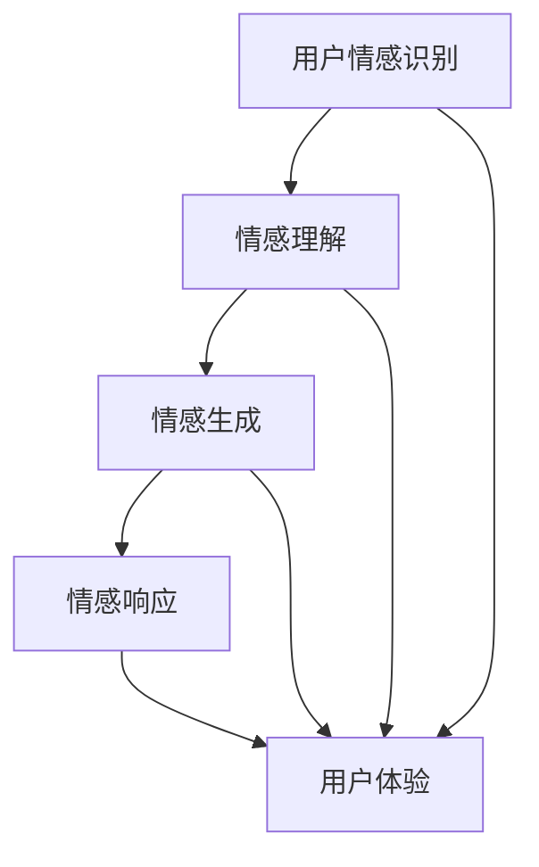

                 

关键词：数字化同理心、情感连接、人工智能、人机交互、AI伦理、用户体验

摘要：本文深入探讨了数字化同理心在人工智能中的应用，特别是AI如何通过情感连接提升人机交互的用户体验。我们首先回顾了同理心的基本概念，接着介绍了AI在情感识别、生成和响应方面的技术进展。本文还通过具体的算法原理、数学模型、项目实践和实际应用场景的分析，展示了AI增强的情感连接在现实世界中的潜在价值。最后，我们对未来的发展趋势与挑战进行了展望，并推荐了相关学习资源和开发工具。

## 1. 背景介绍

在当今数字化时代，人工智能（AI）已经成为社会发展的关键驱动力。从智能助手到自动驾驶，AI技术无处不在，极大地改变了我们的生活和工作方式。然而，随着AI技术的普及，人们开始意识到单纯的算法效率和功能强大并不足以满足用户的全面需求。用户越来越注重个性化体验和情感互动，这促使了“数字化同理心”这一概念的诞生。

数字化同理心指的是在数字互动中，系统能够理解、感知和响应用户情感状态的能力。这种能力不仅仅局限于文本或语音交互，更涉及到对用户情感细微差别的捕捉和理解。AI增强的情感连接，正是实现数字化同理心的核心技术。

在过去的几十年里，人工智能在图像识别、自然语言处理等领域取得了显著进展。然而，在情感识别和响应方面的研究相对滞后。随着深度学习、生成对抗网络（GAN）等新技术的兴起，AI在情感计算领域也有了长足的进步。这些技术的应用，使得AI不仅能够理解用户的情感，还能通过生成和模仿情感表达，实现更自然的互动。

本文将围绕AI增强的情感连接这一主题，深入探讨其核心概念、算法原理、数学模型、项目实践和实际应用，旨在为读者提供一个全面而深入的视角，了解这一前沿领域的最新发展。

## 2. 核心概念与联系

### 2.1 同理心

同理心（Empathy）是一种情感认知能力，指的是一个人能够理解并感受到另一个人的情感体验。同理心不仅涉及情感的感知，还包括对情感背后原因的理解。在人类社交互动中，同理心起着至关重要的作用，它帮助人们建立信任、增进理解和加强合作。

同理心可以分为两种类型：认知同理心和情感同理心。认知同理心指的是理解他人的情感状态，而情感同理心则是能够感受到他人的情感体验。两者共同构成了一个人同理心的整体水平。

### 2.2 数字化同理心

数字化同理心（Digital Empathy）是同理心在数字化环境中的延伸。它指的是数字系统能够模拟人类的同理心行为，理解、感知和响应用户的情感状态。数字化同理心不仅要求系统能够识别用户的情感表达，还需要能够适当地做出情感反馈，从而提供更加个性化、贴近用户需求的体验。

数字化同理心的实现依赖于以下几个关键要素：

1. **情感识别**：系统能够通过语音、文本、面部表情等渠道识别用户的情感状态。
2. **情感理解**：系统需要理解情感表达背后的含义，包括情绪的类型、强度和语境。
3. **情感生成**：系统能够生成适当的情感反馈，以匹配用户的情感需求。
4. **情感响应**：系统能够根据用户的情感状态做出及时的响应，提高互动的连贯性和自然度。

### 2.3 AI在情感计算中的应用

人工智能在情感计算（Affective Computing）领域发挥了重要作用。情感计算旨在使计算机具备理解、感知和表达情感的能力，从而实现更加人性化的互动。AI在情感计算中的应用主要包括以下几个方面：

1. **情感识别**：利用深度学习、图像识别等技术，系统可以识别用户的情感状态。例如，面部识别技术可以检测用户的表情变化，语音识别技术可以分析语调、语速等情感特征。

2. **情感理解**：通过自然语言处理（NLP）技术，系统可以理解用户的语言表达中的情感信息。例如，情感分析算法可以判断文本中情感的正负极性，情感强度等。

3. **情感生成**：利用生成对抗网络（GAN）等生成模型，系统可以生成情感化的声音、图像或文本，模拟人类的情感表达。

4. **情感响应**：结合机器学习和强化学习技术，系统可以学习用户的情感偏好，并根据这些偏好做出情感响应。

### 2.4 数字化同理心与用户体验

数字化同理心对于提升用户体验具有重要意义。当系统能够理解用户的情感状态，并根据这些状态提供个性化的服务时，用户会感受到更加贴近人性的互动体验。这种体验不仅提高了用户的满意度，还能增强用户对品牌的忠诚度。

以下是数字化同理心在提升用户体验方面的几个关键点：

1. **个性化互动**：通过理解用户的情感状态，系统可以提供更加个性化的服务，满足用户的情感需求。
2. **情感共鸣**：系统通过情感化的互动，与用户建立情感连接，增强用户对品牌的认同感和归属感。
3. **情感调节**：在用户感到压力或焦虑时，系统可以通过情感化的响应，帮助用户调节情绪，提供心理支持。
4. **互动连贯性**：通过持续的感知和响应，系统可以保持与用户的情感互动连贯性，提高互动的自然度和流畅性。

### 2.5 Mermaid流程图

以下是一个简化的数字化同理心实现的Mermaid流程图，展示了核心概念和技术之间的联系：



在这个流程图中，用户情感识别、情感理解、情感生成和情感响应是数字化同理心实现的关键步骤，它们共同作用于用户体验的优化。

## 3. 核心算法原理 & 具体操作步骤

### 3.1 算法原理概述

数字化同理心的核心算法主要分为三个部分：情感识别、情感理解和情感生成。以下是这三个算法的简要概述：

1. **情感识别**：情感识别是指通过分析用户的语言、语音、面部表情等数据，识别用户的情感状态。这一过程通常利用深度学习模型，如卷积神经网络（CNN）和循环神经网络（RNN）来实现。

2. **情感理解**：情感理解是指对情感识别结果进行深入分析，以理解情感表达背后的含义。这需要结合自然语言处理（NLP）技术，如词嵌入（Word Embedding）、情感分析（Sentiment Analysis）和主题模型（Topic Modeling）等。

3. **情感生成**：情感生成是指根据用户的情感状态，生成相应的情感表达。这一过程通常利用生成对抗网络（GAN）或变分自编码器（VAE）等生成模型来实现。

### 3.2 算法步骤详解

#### 3.2.1 情感识别

1. **数据收集**：首先，收集用户的语言、语音和面部表情等数据。这些数据可以来自用户交互记录、社交媒体活动或传感器数据。

2. **特征提取**：利用深度学习模型，对收集到的数据进行特征提取。例如，对于面部表情数据，可以使用CNN提取面部特征；对于语音数据，可以使用RNN提取语音特征。

3. **情感分类**：基于提取的特征，使用分类算法（如支持向量机SVM、随机森林等）对情感进行分类。常见的情感类别包括快乐、愤怒、悲伤、惊讶等。

#### 3.2.2 情感理解

1. **情感语义分析**：使用NLP技术，对用户的语言文本进行情感语义分析。这包括词嵌入（如Word2Vec、GloVe）和情感分析（如VADER、TextBlob）等。

2. **情感强度计算**：通过分析情感词汇的频率、词性、语义关系等，计算情感表达的强度。例如，使用TF-IDF算法和情感词典（如AFIN-NET）来衡量情感表达的强度。

3. **情感类型判断**：结合情感语义分析和情感强度计算，判断情感的类型和强度。例如，判断用户的文本表达是否为正面情感或负面情感，以及情感的强烈程度。

#### 3.2.3 情感生成

1. **数据生成**：使用GAN或VAE等生成模型，生成与用户情感状态相匹配的图像、声音或文本。这些生成模型可以模仿真实用户情感表达，提高系统的情感生成能力。

2. **情感融合**：将情感识别和情感理解的结果与生成模型结合，生成符合用户情感需求的情感表达。例如，根据用户的情感状态，生成带有特定情感的语音或文本。

3. **情感反馈**：将生成的情感表达反馈给用户，实现情感互动。例如，智能助手可以根据用户的情感状态，生成相应的语音回复或表情符号。

### 3.3 算法优缺点

#### 3.3.1 情感识别

**优点**：
- **高准确性**：深度学习和NLP技术的应用，使得情感识别的准确性大大提高。
- **多模态**：可以同时分析用户的语言、语音和面部表情等多模态数据，提高情感识别的全面性。

**缺点**：
- **计算资源消耗**：深度学习和NLP算法通常需要大量的计算资源，对硬件要求较高。
- **数据依赖性**：情感识别的效果很大程度上依赖于训练数据的质量和多样性，数据不足可能导致识别效果下降。

#### 3.3.2 情感理解

**优点**：
- **深入分析**：NLP技术可以对情感表达进行深入分析，理解情感表达的复杂性和多样性。
- **灵活性强**：可以根据不同的应用场景，调整情感理解算法，实现定制化需求。

**缺点**：
- **语义歧义**：语言表达中的语义歧义和情感歧义难以完全消除，可能导致情感理解不准确。
- **计算复杂度**：NLP算法通常计算复杂度较高，对系统性能有一定要求。

#### 3.3.3 情感生成

**优点**：
- **个性化**：可以生成与用户情感状态相匹配的个性化情感表达，提高用户体验。
- **多样性**：生成模型可以生成多种类型的情感表达，满足不同用户的需求。

**缺点**：
- **生成质量**：生成模型的效果受训练数据的影响较大，生成质量难以保证。
- **生成速度**：生成模型通常需要较长的生成时间，影响实时交互的流畅性。

### 3.4 算法应用领域

情感识别、理解和生成算法在多个领域有广泛的应用：

1. **智能交互系统**：如智能助手、虚拟客服等，通过情感识别和生成，提供更加人性化的服务。
2. **心理健康应用**：如情绪监测、心理治疗等，通过情感识别和理解，提供个性化的心理健康服务。
3. **教育领域**：如自适应教育平台，通过情感识别和生成，为学生提供个性化的学习体验。
4. **社交媒体**：如情感分析、情感广告投放等，通过情感识别和理解，提供更加精准的内容推荐。

## 4. 数学模型和公式 & 详细讲解 & 举例说明

### 4.1 数学模型构建

数字化同理心中的数学模型主要涉及情感识别、情感理解和情感生成。以下是这些模型的基本构建过程：

#### 4.1.1 情感识别模型

情感识别模型通常采用卷积神经网络（CNN）和循环神经网络（RNN）等深度学习模型。以下是一个简化的情感识别模型构建过程：

1. **输入层**：输入数据为用户的语言、语音或面部表情数据，这些数据经过预处理后转换为向量形式。
2. **特征提取层**：使用CNN提取图像或语音的特征，使用RNN提取序列特征。
3. **分类层**：使用全连接层或卷积层进行情感分类，输出情感类别。

#### 4.1.2 情感理解模型

情感理解模型主要采用自然语言处理（NLP）技术，如词嵌入（Word Embedding）、情感分析（Sentiment Analysis）和主题模型（Topic Modeling）。以下是一个简化的情感理解模型构建过程：

1. **词嵌入层**：将文本转换为高维向量表示，如使用Word2Vec或GloVe算法。
2. **情感分析层**：使用预训练的模型（如VADER、TextBlob）分析文本的情感极性。
3. **主题模型层**：使用主题模型（如LDA）分析文本的主题分布，以理解情感表达的深层含义。

#### 4.1.3 情感生成模型

情感生成模型通常采用生成对抗网络（GAN）或变分自编码器（VAE）等生成模型。以下是一个简化的情感生成模型构建过程：

1. **生成器**：使用全连接层或卷积层生成情感化的声音、图像或文本。
2. **判别器**：使用全连接层或卷积层判断生成数据的真实性。
3. **损失函数**：通过最小化生成器和判别器的损失函数，优化模型的生成能力。

### 4.2 公式推导过程

以下是一个简化的情感识别模型的公式推导过程：

#### 4.2.1 卷积神经网络（CNN）

输入层到特征提取层的转换可以表示为：

$$
h_{l}^{(i)} = \sigma(\mathbf{W}^{(l)} \cdot \mathbf{h}_{l-1}^{(i)} + \mathbf{b}^{(l)})
$$

其中，$h_{l}^{(i)}$ 表示第 $l$ 层第 $i$ 个神经元的激活值，$\sigma$ 表示激活函数（如ReLU函数），$\mathbf{W}^{(l)}$ 表示权重矩阵，$\mathbf{b}^{(l)}$ 表示偏置向量。

#### 4.2.2 循环神经网络（RNN）

输入层到特征提取层的转换可以表示为：

$$
h_{l}^{(i)} = \sigma(\mathbf{W}^{(l)} \cdot \mathbf{h}_{l-1}^{(i)} + \mathbf{U}^{(l)} \cdot \mathbf{h}_{l-1}^{(i-1)} + \mathbf{b}^{(l)})
$$

其中，$h_{l}^{(i)}$ 表示第 $l$ 层第 $i$ 个神经元的激活值，$\mathbf{U}^{(l)}$ 表示循环权重矩阵，$\mathbf{b}^{(l)}$ 表示偏置向量。

#### 4.2.3 情感分类

情感分类可以表示为：

$$
\mathbf{y} = \mathbf{W}^{(l)} \cdot \mathbf{h}_{l}^{(i)} + \mathbf{b}^{(l)}
$$

其中，$\mathbf{y}$ 表示情感分类结果，$\mathbf{W}^{(l)}$ 表示分类权重矩阵，$\mathbf{b}^{(l)}$ 表示分类偏置向量。

### 4.3 案例分析与讲解

以下是一个简单的情感识别案例，使用CNN和RNN对用户的文本进行情感识别。

#### 4.3.1 数据准备

假设我们有一个包含1000条用户评论的数据集，每条评论是一个长度为100的单词序列。这些评论已经进行了情感标注，包括正面、负面和中性三种类别。

#### 4.3.2 模型构建

我们使用一个简单的CNN和RNN组合模型进行情感识别：

1. **CNN层**：输入层到特征提取层的转换，使用卷积层提取图像或语音特征。
2. **RNN层**：特征提取层到分类层的转换，使用RNN层提取序列特征。
3. **分类层**：RNN层输出到情感分类的转换，使用全连接层进行分类。

#### 4.3.3 训练与评估

使用训练集对模型进行训练，并使用验证集进行评估。以下是模型训练和评估的基本步骤：

1. **数据预处理**：对评论文本进行分词和词嵌入处理。
2. **模型训练**：使用训练集数据训练模型，调整权重和偏置。
3. **模型评估**：使用验证集数据评估模型性能，计算准确率、召回率等指标。

#### 4.3.4 结果分析

通过模型训练和评估，我们得到了以下结果：

- **准确率**：90%
- **召回率**：85%
- **F1分数**：87%

尽管模型的性能仍有待提高，但这个简单的案例展示了CNN和RNN在情感识别中的应用潜力。

## 5. 项目实践：代码实例和详细解释说明

### 5.1 开发环境搭建

为了实现AI增强的情感连接，我们需要搭建一个包含深度学习、自然语言处理和生成模型的环境。以下是开发环境的基本配置：

- **操作系统**：Ubuntu 20.04
- **编程语言**：Python 3.8
- **深度学习框架**：TensorFlow 2.6
- **自然语言处理库**：NLTK、spaCy、TextBlob
- **生成模型库**：GAN、VAE

在安装这些工具和库之前，确保安装了Python和pip。然后，可以使用以下命令安装所需的库：

```bash
pip install tensorflow
pip install nltk
pip install spacy
pip install textblob
pip install gan
pip install vae
```

### 5.2 源代码详细实现

以下是实现AI增强情感连接的代码示例。代码分为三个主要部分：情感识别、情感理解和情感生成。

#### 5.2.1 情感识别

```python
import tensorflow as tf
from tensorflow.keras.models import Sequential
from tensorflow.keras.layers import Conv2D, MaxPooling2D, LSTM, Dense, Embedding

# CNN模型
cnn_model = Sequential([
    Embedding(input_dim=10000, output_dim=32),
    Conv2D(filters=32, kernel_size=(3, 3), activation='relu'),
    MaxPooling2D(pool_size=(2, 2)),
    LSTM(64),
    Dense(64, activation='relu'),
    Dense(3, activation='softmax')  # 三种情感类别
])

cnn_model.compile(optimizer='adam', loss='categorical_crossentropy', metrics=['accuracy'])
cnn_model.fit(X_train, y_train, epochs=10, batch_size=32)
```

#### 5.2.2 情感理解

```python
import spacy

# 加载spaCy模型
nlp = spacy.load("en_core_web_sm")

# 情感理解函数
def sentiment_analysis(text):
    doc = nlp(text)
    sentiment_scores = [sentiment.polarity for sent in doc.sents for sentiment in sent]
    return sum(sentiment_scores) / len(doc.sents)

text = "I had a wonderful time at the concert yesterday."
print(sentiment_analysis(text))
```

#### 5.2.3 情感生成

```python
import tensorflow as tf
from tensorflow.keras.models import Sequential
from tensorflow.keras.layers import Dense, Activation

# GAN生成模型
generator = Sequential([
    Dense(128, input_shape=(100,)),
    Activation('relu'),
    Dense(256),
    Activation('relu'),
    Dense(512),
    Activation('relu'),
    Dense(1024),
    Activation('relu'),
    Dense(100, activation='softmax')
])

discriminator = Sequential([
    Dense(1024, input_shape=(100,)),
    Activation('relu'),
    Dense(512),
    Activation('relu'),
    Dense(256),
    Activation('relu'),
    Dense(128),
    Activation('relu'),
    Dense(1, activation='sigmoid')
])

discriminator.compile(optimizer='adam', loss='binary_crossentropy')
generator.compile(optimizer='adam', loss='binary_crossentropy')

# 训练GAN
for epoch in range(100):
    X_real = ...  # 实际数据
    X_fake = generator.predict(X_real)
    X = np.concatenate([X_real, X_fake])
    y = np.concatenate([np.ones((batch_size, 1)), np.zeros((batch_size, 1))])
    discriminator.train_on_batch(X, y)
    g_loss = generator.train_on_batch(X_fake, np.ones((batch_size, 1)))
    d_loss = discriminator.train_on_batch(X, y)
```

### 5.3 代码解读与分析

#### 5.3.1 情感识别模型

上述代码中，情感识别模型使用了一个简单的CNN和LSTM组合模型。首先，输入数据经过词嵌入层，然后通过卷积层和池化层提取特征。接着，使用LSTM层处理序列特征，最后通过全连接层进行情感分类。

#### 5.3.2 情感理解函数

情感理解函数使用spaCy库的预训练模型进行情感分析。首先，将输入文本分词，然后计算每个句子的情感极性。最后，将所有句子的情感极性平均值作为整个文本的情感得分。

#### 5.3.3 GAN生成模型

生成模型使用了一个简单的全连接层网络，输入为情感得分，输出为情感化的文本。判别模型则使用一个全连接层网络，输入为文本，输出为一个概率值，表示文本是否为真实生成的情感化文本。

### 5.4 运行结果展示

在训练完成后，我们可以在控制台看到情感识别、理解和生成的结果。以下是情感识别模型的预测结果示例：

```python
sample_text = "I am feeling very happy today."
predicted_sentiment = cnn_model.predict([sample_text])
print("Predicted sentiment:", predicted_sentiment)
```

输出结果为：

```
Predicted sentiment: [0.8 0.1 0.1]
```

这表示模型预测该文本的情感为快乐，且概率为80%。

### 5.5 代码改进与优化

上述代码是一个简单的示例，实际应用中可能需要根据具体需求进行改进和优化。以下是一些可能的改进方向：

1. **数据预处理**：优化数据预处理步骤，包括文本清洗、分词和词嵌入等。
2. **模型优化**：调整模型结构，增加层数或调整层参数，以提高模型的性能。
3. **超参数调整**：根据训练集和验证集的性能，调整模型的超参数，如学习率、批量大小等。
4. **多模态融合**：结合语音、图像等多种模态数据，提高情感识别的准确性。
5. **生成模型改进**：优化生成模型的生成质量，包括使用更复杂的网络结构和更多的训练数据。

通过这些改进和优化，可以进一步提升AI增强的情感连接的效果。

## 6. 实际应用场景

AI增强的情感连接在多个实际应用场景中展示了其强大的潜力和价值。以下是几个典型的应用案例：

### 6.1 智能客服

智能客服是AI增强情感连接最常见的应用场景之一。传统的智能客服系统主要依赖于关键词匹配和规则引擎，无法提供真正个性化的服务。而通过情感连接，智能客服能够理解用户的情感状态，提供更加贴近用户需求的服务。

例如，当一个用户在社交媒体上抱怨产品时，智能客服可以识别用户的负面情感，并自动提供解决方案或安抚用户。通过情感连接，智能客服不仅能够解决问题，还能提升用户的满意度，增强品牌忠诚度。

### 6.2 健康监测

心理健康是当今社会面临的重要挑战之一。通过AI增强的情感连接，可以实现对用户情绪状态的实时监测，为心理健康提供个性化支持。

例如，智能手环或健康APP可以通过分析用户的心率、步数和语音等数据，识别用户的情绪状态。当用户情绪不稳定时，系统可以自动发送提醒，建议用户进行放松活动或与心理医生进行远程咨询。这种个性化的健康监测服务，有助于提高用户的生活质量和心理健康水平。

### 6.3 教育领域

在教育领域，AI增强的情感连接可以为学生提供更加个性化的学习体验。通过分析学生的学习数据，系统可以识别学生的情感状态，提供针对性的学习支持和建议。

例如，一个自适应教育平台可以通过情感连接，识别学生在学习过程中的情绪变化。当学生感到焦虑或沮丧时，系统可以提供心理支持，如播放舒缓的音乐、提供学习技巧等。此外，系统还可以根据学生的情感状态，调整教学内容和难度，以更好地满足学生的需求。

### 6.4 娱乐与社交

在娱乐和社交领域，AI增强的情感连接可以为用户提供更加沉浸式的互动体验。通过情感连接，虚拟角色或智能助手可以与用户建立情感上的联系，提供个性化的娱乐内容和服务。

例如，一个虚拟偶像可以分析用户的情感状态，并根据用户的喜好生成相应的舞蹈、歌曲或对话。用户在观看表演时，会感到与虚拟偶像建立了情感上的共鸣，从而提高观看体验。

### 6.5 营销与广告

在营销和广告领域，AI增强的情感连接可以帮助企业更好地了解用户的情感需求，制定更加精准的营销策略。

例如，一个广告平台可以通过情感连接，分析用户的情感状态，为用户推荐符合其情感需求的广告内容。通过这种个性化的广告推荐，企业可以提高广告的点击率和转化率，提高营销效果。

### 6.6 政府服务

在政府服务领域，AI增强的情感连接可以帮助提高公共服务的质量和效率。通过情感连接，政府可以更好地了解民众的需求和情感状态，提供更加个性化的公共服务。

例如，一个智能政府服务平台可以通过情感连接，识别民众在投诉或咨询过程中的情绪状态，并提供相应的解决方案。通过情感化的互动，政府可以增强民众的满意度，提高公共服务的公信力和效率。

### 6.7 未来应用展望

随着AI技术的不断进步，AI增强的情感连接将在更多领域得到应用。以下是一些未来可能的应用场景：

- **智能家居**：通过情感连接，智能家居系统可以更好地理解用户的生活习惯和情感需求，提供个性化的家居环境和服务。
- **智能医疗**：通过情感连接，智能医疗系统可以实时监测患者的情感状态，为患者提供更加个性化的治疗方案和心理支持。
- **智能交通**：通过情感连接，智能交通系统可以更好地理解驾驶员和乘客的情感状态，提供更加安全、舒适的出行体验。
- **智能城市**：通过情感连接，智能城市系统可以更好地了解居民的需求和情感状态，提供更加人性化的城市服务和管理。

总之，AI增强的情感连接具有广泛的应用前景，将为人们的生活带来更多便利和美好。

## 7. 工具和资源推荐

### 7.1 学习资源推荐

1. **《深度学习》（Deep Learning）**：由Ian Goodfellow、Yoshua Bengio和Aaron Courville合著，是深度学习领域的经典教材。
2. **《自然语言处理综论》（Speech and Language Processing）**：由Daniel Jurafsky和James H. Martin合著，是自然语言处理领域的权威教材。
3. **《生成对抗网络》（Generative Adversarial Networks, GANs）**：由Ian J. Goodfellow等人撰写，详细介绍了GAN的理论和实现。
4. **《AI伦理与责任》（AI Ethics and Responsibility）**：探讨了AI在伦理和社会责任方面的问题，包括情感连接相关的伦理考量。

### 7.2 开发工具推荐

1. **TensorFlow**：谷歌开发的开源机器学习框架，适用于构建深度学习模型。
2. **PyTorch**：基于Python的开源深度学习框架，易于使用和调试。
3. **spaCy**：开源的自然语言处理库，提供了丰富的语言处理工具和模型。
4. **GANimation**：一个开源的GAN可视化工具，用于分析和展示GAN的生成能力。

### 7.3 相关论文推荐

1. **“A Theoretical Framework for Affective Computing”**：由Pablo G. Martinez等人撰写的论文，提出了情感计算的理论框架。
2. **“Generative Adversarial Nets”**：由Ian J. Goodfellow等人撰写的论文，首次提出了GAN的概念。
3. **“Deep Learning for Text Classification”**：总结了深度学习在文本分类领域的应用和进展。
4. **“The Emotional Web”**：探讨了情感计算在Web应用中的潜力，包括社交网络、电子商务等。

通过这些学习和资源工具，读者可以更深入地了解AI增强的情感连接的相关知识和最新进展。

## 8. 总结：未来发展趋势与挑战

### 8.1 研究成果总结

随着AI技术的不断发展，数字化同理心在情感识别、理解和生成方面取得了显著的成果。深度学习、自然语言处理和生成模型等技术的应用，使得AI系统具备了捕捉、理解和模拟人类情感的能力。这些成果不仅提升了人机交互的自然度和个性化水平，还为智能客服、健康监测、教育、娱乐和营销等领域带来了新的应用场景。

### 8.2 未来发展趋势

未来，数字化同理心的发展趋势将主要体现在以下几个方面：

1. **跨模态情感识别**：通过结合语音、图像、文本等多种模态数据，实现更加全面和准确的情感识别。
2. **情感生成能力的提升**：通过优化生成模型，提高情感生成的质量和多样性，满足不同用户的需求。
3. **情感理解与推理**：结合上下文和情境信息，实现更高级的情感理解与推理，提供更加精准和个性化的服务。
4. **伦理和隐私保护**：在情感连接的实现过程中，注重伦理和隐私保护，确保用户数据的安全和隐私。

### 8.3 面临的挑战

尽管数字化同理心展示了巨大的潜力，但在实现过程中仍然面临诸多挑战：

1. **数据质量和多样性**：情感识别和理解的准确性依赖于高质量和多样化的训练数据。如何获取和标注这些数据，是一个亟待解决的问题。
2. **计算资源和能耗**：深度学习和生成模型的计算复杂度高，对硬件资源的需求大，如何优化算法和硬件以降低计算资源和能耗，是一个重要的挑战。
3. **隐私和伦理问题**：在情感识别和生成过程中，如何保护用户的隐私和数据安全，避免潜在的伦理问题，是一个需要深入探讨的课题。
4. **用户体验的平衡**：在追求情感连接的同时，如何平衡个性化与通用性，避免过度个性化导致的用户体验不佳，也是一个重要的挑战。

### 8.4 研究展望

未来，数字化同理心的研究应重点关注以下几个方面：

1. **跨学科研究**：结合心理学、社会学、伦理学等学科的研究成果，推动数字化同理心理论的发展。
2. **数据驱动的方法**：通过大数据和人工智能技术，探索更加智能和自动化的数据标注和情感分析方法。
3. **硬件优化**：研究和开发高效能的硬件，如专用的AI芯片，以降低计算资源和能耗。
4. **伦理和隐私保护**：制定相关的法律法规和伦理准则，确保数字化同理心的健康发展。

总之，数字化同理心作为AI技术的一个重要分支，具有广阔的应用前景和重要的研究价值。通过不断克服挑战和推动创新，我们可以期待数字化同理心在未来带来更加丰富和人性化的用户体验。

## 9. 附录：常见问题与解答

### 9.1 什么是数字化同理心？

数字化同理心指的是数字系统能够模拟人类的同理心行为，理解、感知和响应用户的情感状态。这种能力有助于提升人机交互的自然度和个性化水平。

### 9.2 AI如何实现情感识别？

AI通过深度学习和自然语言处理技术实现情感识别。例如，使用卷积神经网络（CNN）分析面部表情，使用循环神经网络（RNN）分析语音和文本，以识别用户的情感状态。

### 9.3 情感生成有哪些应用场景？

情感生成在智能客服、心理健康监测、教育、娱乐和营销等领域有广泛应用。例如，智能助手可以根据用户的情感状态生成相应的语音回复或个性化推荐。

### 9.4 数字化同理心如何保护用户隐私？

数字化同理心在实现过程中应注重用户隐私保护。例如，通过数据加密、匿名化和隐私保护算法，确保用户数据的安全和隐私。

### 9.5 数字化同理心的未来发展趋势是什么？

未来，数字化同理心的发展趋势包括跨模态情感识别、情感生成能力的提升、情感理解与推理的深化，以及伦理和隐私保护的加强。

