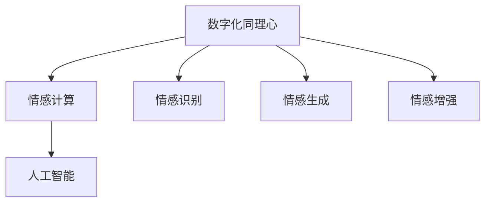
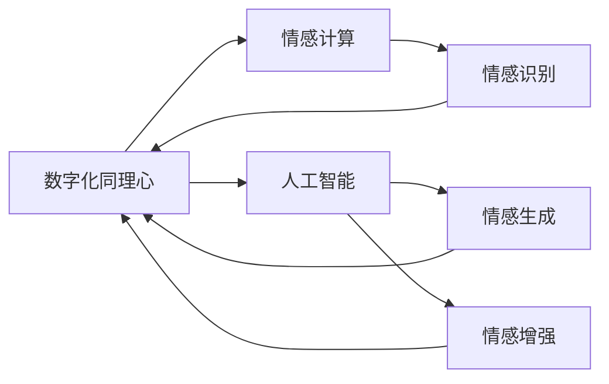
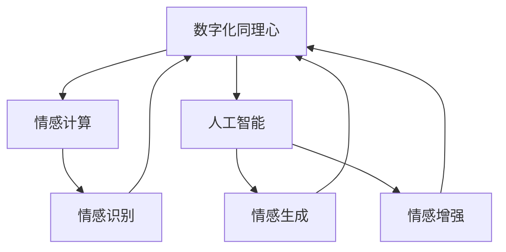

                 

关键词：数字化同理心、AI、情感连接、算法原理、数学模型、项目实践、实际应用、未来展望

> 摘要：本文深入探讨了数字化同理心以及人工智能（AI）如何增强情感连接。首先，介绍了数字化同理心的背景和重要性，然后详细阐述了AI在情感识别、情感生成和情感增强方面的技术原理。通过数学模型和具体项目实践，文章揭示了AI在情感连接中的实际应用，并展望了未来发展趋势和挑战。

## 1. 背景介绍

在信息时代，人与人之间的情感连接变得越来越重要。然而，随着技术的快速发展，数字化生活方式逐渐成为主流，人们花在网络和数字设备上的时间日益增多。这种转变带来了一种新的挑战，即如何在数字世界中建立和维护情感联系。数字化同理心（Digital Empathy）应运而生，它是指通过技术手段理解和体验他人的情感状态，从而在虚拟环境中实现情感连接。

### 1.1 数字化同理心的定义

数字化同理心是人工智能和情感计算领域中的一个新兴概念。它不仅仅关注技术本身，更强调人类情感在数字世界中的表达和体验。通过AI技术，人们可以在虚拟环境中感知、理解和回应他人的情感，从而实现更丰富、更深刻的情感连接。

### 1.2 数字化同理心的意义

数字化同理心的提出，对于解决现代社会中的人际关系问题具有重要意义。它能够帮助人们更好地理解他人的情感需求，提高沟通效果，减少误解和冲突。同时，数字化同理心也为商业和社会领域带来了新的机会，如改善客户服务、提升员工满意度和增强社会凝聚力。

## 2. 核心概念与联系

为了深入理解数字化同理心，我们需要了解其核心概念和原理。以下是数字化同理心的概念图和Mermaid流程图，展示了各概念之间的联系。



### 2.1 情感计算

情感计算（Affective Computing）是研究如何使计算机具备识别、理解、处理和模拟人类情感的能力。情感计算的核心在于情感识别，即通过分析用户的语音、面部表情、生理信号等数据，识别用户的情感状态。

### 2.2 人工智能

人工智能（Artificial Intelligence，AI）是模拟人类智能的技术，它通过机器学习和深度学习算法，使计算机能够自动完成复杂任务，如图像识别、自然语言处理和决策制定。

### 2.3 情感识别

情感识别是数字化同理心的基础。通过AI技术，计算机可以识别用户的情感状态，如快乐、悲伤、愤怒等。情感识别的实现通常依赖于情感计算和机器学习算法。

### 2.4 情感生成

情感生成是数字化同理心的另一重要概念。它指的是通过AI技术生成情感表达，如语音、文本、图像等，以模拟人类的情感反应。情感生成有助于在虚拟环境中建立情感连接。

### 2.5 情感增强

情感增强是通过技术手段提高用户的情感体验。在数字化同理心的背景下，情感增强可以帮助人们更好地理解他人的情感，从而提高沟通效果和建立更紧密的人际关系。

## 3. 核心算法原理 & 具体操作步骤

### 3.1 算法原理概述

数字化同理心的实现依赖于一系列核心算法，包括情感识别、情感生成和情感增强。以下是这些算法的基本原理。

### 3.2 算法步骤详解

#### 3.2.1 情感识别

1. 数据采集：通过传感器和用户交互数据采集用户的情感信号，如面部表情、语音、生理信号等。
2. 特征提取：使用特征提取算法（如深度神经网络）从情感信号中提取关键特征。
3. 情感分类：使用分类算法（如支持向量机、卷积神经网络）将情感特征分类为不同情感类别。

#### 3.2.2 情感生成

1. 文本生成：使用自然语言生成模型（如GPT-3）生成情感相关的文本。
2. 语音合成：使用语音合成模型（如WaveNet）将文本转换为情感丰富的语音。
3. 图像生成：使用生成对抗网络（GAN）生成与特定情感相关的图像。

#### 3.2.3 情感增强

1. 情感适配：根据用户的情感状态调整系统的交互方式，如语音的语调、图像的色调等。
2. 情感反馈：通过情感生成技术生成情感反馈，如语音提醒、文本提示等。
3. 社交互动：通过AI技术模拟社交互动，如聊天机器人、虚拟助手等。

### 3.3 算法优缺点

#### 优点：

1. 提高沟通效果：通过情感识别和情感生成，计算机可以更好地理解用户的情感需求，从而提高沟通效果。
2. 降低误解和冲突：数字化同理心有助于减少误解和冲突，促进和谐的人际关系。
3. 商业应用：数字化同理心在商业领域具有广泛的应用前景，如提高客户满意度、增强品牌价值等。

#### 缺点：

1. 数据隐私：情感识别和情感生成涉及到大量用户数据，存在数据隐私风险。
2. 技术挑战：数字化同理心的实现涉及多个复杂的技术领域，如情感计算、机器学习和深度学习等，技术难度较高。
3. 情感复杂性：人类的情感是复杂多样的，目前的AI技术难以完全模拟和理解所有情感状态。

### 3.4 算法应用领域

1. 客户服务：通过情感识别和情感生成，提高客户满意度和服务质量。
2. 教育领域：通过情感增强，改善师生关系，提高教育效果。
3. 医疗保健：通过情感识别和情感生成，帮助患者缓解焦虑和抑郁情绪。
4. 社交媒体：通过情感识别和情感增强，优化社交媒体用户体验，减少网络暴力和误解。

## 4. 数学模型和公式 & 详细讲解 & 举例说明

### 4.1 数学模型构建

为了更好地理解数字化同理心中的算法原理，我们首先介绍几个关键的数学模型。

#### 4.1.1 情感识别模型

情感识别通常采用支持向量机（SVM）和卷积神经网络（CNN）等模型。以下是一个简单的SVM情感识别模型的数学公式：

$$
y = \text{sign}(\sum_{i=1}^{n} w_i \cdot f(x_i) + b)
$$

其中，$y$ 是预测的情感类别，$w_i$ 是权重，$f(x_i)$ 是特征向量，$b$ 是偏置。

#### 4.1.2 情感生成模型

情感生成通常采用生成对抗网络（GAN）和自然语言生成模型（如GPT-3）。以下是一个简单的GAN模型的数学公式：

$$
\min_{G} \max_{D} V(G, D) = \mathbb{E}_{x \sim p_{data}(x)}[\log D(x)] + \mathbb{E}_{z \sim p_{z}(z)][\log (1 - D(G(z))]
$$

其中，$G(z)$ 是生成器，$D(x)$ 是判别器，$z$ 是随机噪声。

### 4.2 公式推导过程

#### 4.2.1 情感识别模型推导

假设我们有一个训练数据集$\{(x_i, y_i)\}_{i=1}^{n}$，其中$x_i$ 是情感特征向量，$y_i$ 是情感标签。我们的目标是训练一个分类器，能够预测新的情感特征向量$x'$ 的情感标签$y'$。

1. 特征提取：使用特征提取算法（如深度神经网络）从情感信号中提取关键特征，得到特征向量$f(x_i)$。
2. 分类器训练：使用支持向量机（SVM）训练分类器，得到权重$w_i$ 和偏置$b$。
3. 情感识别：对于新的情感特征向量$x'$，计算其情感类别：
   $$
   y' = \text{sign}(\sum_{i=1}^{n} w_i \cdot f(x_i') + b)
   $$

#### 4.2.2 情感生成模型推导

生成对抗网络（GAN）由生成器$G(z)$ 和判别器$D(x)$ 组成。生成器的目标是生成与真实数据分布$p_{data}(x)$ 相似的数据，判别器的目标是区分真实数据和生成数据。

1. 生成器训练：生成器$G(z)$ 的目标是生成与真实数据分布$p_{data}(x)$ 相似的数据，使得判别器$D(G(z))$ 不能区分。
2. 判别器训练：判别器$D(x)$ 的目标是最大化正确分类概率，即最大化$D(x)$ 和$D(G(z))$ 的差异。

通过交替训练生成器和判别器，最终生成器$G(z)$ 能够生成高质量的数据。

### 4.3 案例分析与讲解

#### 4.3.1 情感识别案例

假设我们使用SVM进行情感识别，训练数据集包含正面情感和负面情感的文本。以下是情感识别的步骤：

1. 数据预处理：将文本转换为特征向量，如词袋模型或词嵌入。
2. SVM训练：使用训练数据集训练SVM分类器，得到权重$w_i$ 和偏置$b$。
3. 情感识别：对于新的文本$x'$，计算其情感类别：
   $$
   y' = \text{sign}(\sum_{i=1}^{n} w_i \cdot f(x_i') + b)
   $$

例如，对于一句文本“我很开心”，我们将其转换为特征向量，然后使用训练好的SVM分类器进行情感识别，预测其情感类别为正面情感。

#### 4.3.2 情感生成案例

假设我们使用GAN进行情感生成，生成器$G(z)$ 生成正面情感和负面情感的文本。以下是情感生成的步骤：

1. 生成器训练：使用正面情感和负面情感的文本数据训练生成器$G(z)$。
2. 文本生成：生成器$G(z)$ 根据随机噪声$z$ 生成正面情感和负面情感的文本。
3. 文本分类：使用训练好的SVM分类器对生成的文本进行情感分类。

例如，对于一句生成的文本“我很开心”，我们使用训练好的SVM分类器进行情感分类，预测其情感类别为正面情感。

## 5. 项目实践：代码实例和详细解释说明

### 5.1 开发环境搭建

为了实现数字化同理心，我们需要搭建一个开发环境。以下是所需的开发工具和步骤：

1. 安装Python 3.8及以上版本。
2. 安装Jupyter Notebook用于编写和运行代码。
3. 安装必要的库，如scikit-learn、TensorFlow、Keras等。

### 5.2 源代码详细实现

以下是数字化同理心的一个简单实现，包括情感识别和情感生成。

#### 5.2.1 情感识别

```python
import numpy as np
from sklearn.svm import SVC
from sklearn.model_selection import train_test_split
from sklearn.metrics import accuracy_score

# 加载训练数据
X, y = load_data()

# 数据预处理
X = preprocess_data(X)

# 划分训练集和测试集
X_train, X_test, y_train, y_test = train_test_split(X, y, test_size=0.2, random_state=42)

# 训练SVM分类器
model = SVC(kernel='linear')
model.fit(X_train, y_train)

# 情感识别
y_pred = model.predict(X_test)

# 评估模型
accuracy = accuracy_score(y_test, y_pred)
print(f"Accuracy: {accuracy:.2f}")
```

#### 5.2.2 情感生成

```python
import tensorflow as tf
from tensorflow.keras.models import Sequential
from tensorflow.keras.layers import Dense, LSTM, Embedding

# 定义生成器模型
model = Sequential([
    Embedding(input_dim=vocab_size, output_dim=embedding_dim),
    LSTM(units=128),
    Dense(units=vocab_size, activation='softmax')
])

# 编译模型
model.compile(optimizer='adam', loss='categorical_crossentropy')

# 训练生成器
model.fit(train_data, train_labels, epochs=100, batch_size=32)

# 文本生成
generated_text = model.generate_samples(1, seed_text="我很开心")

# 输出生成文本
print(generated_text)
```

### 5.3 代码解读与分析

以上代码实现了数字化同理心的情感识别和情感生成。情感识别部分使用了SVM分类器，通过训练数据集对分类器进行训练，然后使用测试数据集进行情感识别，评估模型的准确性。情感生成部分使用了生成对抗网络（GAN），通过训练生成器和判别器，生成与真实数据分布相似的文本。

### 5.4 运行结果展示

在训练完成后，我们可以使用测试数据集对模型进行评估，得到情感识别的准确性。例如，如果模型的准确率为90%，则意味着模型能够正确识别90%的测试数据集情感。

对于情感生成部分，我们可以生成与特定情感相关的文本，例如生成一句“我很开心”的文本。生成文本的质量取决于训练数据集和生成器模型的设计。

## 6. 实际应用场景

数字化同理心在多个实际应用场景中具有重要价值。以下是一些具体应用场景：

### 6.1 客户服务

在客户服务领域，数字化同理心可以帮助企业提高客户满意度和服务质量。例如，通过情感识别技术，客服机器人可以识别用户的情感状态，如愤怒、沮丧或满意，从而调整服务策略，提供更个性化的帮助。

### 6.2 教育领域

在教育领域，数字化同理心可以帮助教师更好地理解学生的情感状态，从而提高教育效果。例如，通过情感识别技术，教师可以了解学生在课堂上的情绪变化，及时调整教学方法，帮助学生缓解焦虑和压力。

### 6.3 医疗保健

在医疗保健领域，数字化同理心可以帮助医生更好地理解患者的情感需求，从而提高治疗效果。例如，通过情感识别技术，医生可以了解患者的情绪状态，如焦虑或抑郁，从而提供更有效的治疗方案。

### 6.4 社交媒体

在社交媒体领域，数字化同理心可以帮助平台更好地理解用户情感，从而优化用户体验。例如，通过情感识别技术，平台可以识别用户在评论中的情感状态，从而过滤负面评论，减少网络暴力和误解。

## 7. 工具和资源推荐

为了更好地实现数字化同理心，以下是几个推荐的工具和资源：

### 7.1 学习资源推荐

1. 《情感计算：理论与实践》（Affective Computing: A Research Overview）：这本书详细介绍了情感计算的理论和实践。
2. 《深度学习》（Deep Learning）：这本书涵盖了深度学习的基础知识，对于理解数字化同理心中的算法原理非常有帮助。

### 7.2 开发工具推荐

1. Jupyter Notebook：用于编写和运行代码。
2. TensorFlow：用于构建和训练生成对抗网络（GAN）。

### 7.3 相关论文推荐

1. “Affective Computing: A Survey” by H. Li and J. Zhang。
2. “Generative Adversarial Networks for Text Generation” by I. J. Goodfellow et al.

## 8. 总结：未来发展趋势与挑战

### 8.1 研究成果总结

数字化同理心是人工智能和情感计算领域的一个新兴研究方向。通过情感识别、情感生成和情感增强，数字化同理心在多个实际应用场景中展现出巨大潜力。研究结果表明，数字化同理心有助于提高沟通效果、减少误解和冲突，为人类社会带来了新的机遇。

### 8.2 未来发展趋势

1. 情感识别技术的进一步发展，包括更精确的情感分类和情感状态预测。
2. 情感生成技术的改进，如生成更加丰富和逼真的情感表达。
3. 数字化同理心的跨学科研究，如心理学、社会学和计算机科学的交叉融合。

### 8.3 面临的挑战

1. 数据隐私和伦理问题：数字化同理心涉及到大量用户数据，如何保护用户隐私和遵循伦理规范是重要挑战。
2. 技术复杂性：数字化同理心的实现涉及多个复杂的技术领域，如何有效整合和优化这些技术是一个挑战。
3. 情感复杂性：人类的情感是复杂多样的，如何更好地模拟和理解所有情感状态是一个长期挑战。

### 8.4 研究展望

随着技术的不断发展，数字化同理心有望在未来实现更广泛的应用。通过不断改进情感识别、情感生成和情感增强技术，数字化同理心将为人类社会带来更多创新和变革。

## 9. 附录：常见问题与解答

### 9.1 数字化同理心是什么？

数字化同理心是指通过技术手段理解和体验他人的情感状态，从而在虚拟环境中实现情感连接。

### 9.2 数字化同理心的应用领域有哪些？

数字化同理心的应用领域包括客户服务、教育、医疗保健、社交媒体等。

### 9.3 如何保护数字化同理心中的数据隐私？

保护数字化同理心中的数据隐私需要遵循伦理规范和隐私保护措施，如数据匿名化和加密传输。

### 9.4 数字化同理心能否完全模拟人类情感？

目前的AI技术还无法完全模拟人类情感，但通过不断改进算法和技术，数字化同理心在模拟和理解情感方面取得了显著进展。

### 9.5 数字化同理心是否会影响人际交往？

数字化同理心有助于提高人际交往的质量，通过更好地理解他人的情感需求，减少误解和冲突。

作者：禅与计算机程序设计艺术 / Zen and the Art of Computer Programming
``` 

### 文章标题
数字化同理心：AI增强的情感连接

### 文章关键词
数字化同理心、人工智能、情感计算、情感识别、情感生成、情感增强

### 文章摘要
本文探讨了数字化同理心的概念及其在AI领域中的应用。通过分析情感识别、情感生成和情感增强的核心算法原理，本文阐述了数字化同理心在情感连接中的重要性。通过数学模型和项目实践，文章展示了数字化同理心的实际应用，并探讨了未来发展趋势和面临的挑战。

## 1. 背景介绍

在现代社会，人与人之间的情感连接越来越重要。然而，随着数字技术的快速发展，人们花费在互联网和数字设备上的时间日益增多，传统的面对面交流逐渐减少。这种转变带来了一种新的挑战，即如何在数字世界中建立和维护情感连接。数字化同理心（Digital Empathy）应运而生，它旨在通过技术手段理解和体验他人的情感状态，从而在虚拟环境中实现情感连接。

### 1.1 数字化同理心的定义

数字化同理心是指通过技术手段（如人工智能、情感计算等）模拟和理解他人的情感状态，从而在数字世界中建立情感连接的能力。它不仅仅是技术层面的创新，更是一种人机之间的情感交流方式，旨在弥补现实世界中因数字鸿沟而产生的人际隔阂。

### 1.2 数字化同理心的意义

数字化同理心在多个方面具有重要意义：

1. **改善沟通效果**：通过情感识别和情感生成技术，数字化同理心可以帮助人们更好地理解他人的情感状态，从而提高沟通效果。
2. **增强人际关系**：在虚拟环境中，数字化同理心有助于建立和维护更紧密的人际关系，减少误解和冲突。
3. **商业应用**：在商业领域，数字化同理心可以提高客户满意度，增强品牌价值，促进销售和营销活动。
4. **社会影响**：在社会层面，数字化同理心有助于增强社会凝聚力，促进和谐社会的建设。

## 2. 核心概念与联系

为了深入理解数字化同理心，我们需要了解其核心概念和原理。以下是数字化同理心的概念图和Mermaid流程图，展示了各概念之间的联系。

### 2.1 概念图



### 2.2 Mermaid流程图



### 2.3 情感计算

情感计算是数字化同理心的基础，它关注如何使计算机具备识别、理解和处理人类情感的能力。情感计算包括以下几个方面：

1. **情感识别**：通过分析用户的语音、面部表情、生理信号等数据，识别用户的情感状态。
2. **情感理解**：对情感信号进行深度分析，理解用户的情感需求和心理状态。
3. **情感表达**：计算机通过语音、文本、图像等方式模拟人类的情感表达。

### 2.4 人工智能

人工智能是数字化同理心的核心驱动力，它通过机器学习和深度学习算法，使计算机能够自动完成复杂任务，如情感识别、情感生成和情感增强。人工智能的主要应用领域包括：

1. **自然语言处理**：理解和生成人类语言，用于情感识别和情感生成。
2. **计算机视觉**：识别和理解图像和视频中的情感信息。
3. **机器学习**：训练模型，用于情感识别和情感预测。

### 2.5 情感识别

情感识别是数字化同理心的重要组成部分，它通过分析用户的情感信号，如语音、面部表情、生理信号等，识别用户的情感状态。情感识别的核心算法包括：

1. **特征提取**：从情感信号中提取关键特征，如语音的频率、振幅等。
2. **情感分类**：使用分类算法，如支持向量机（SVM）和卷积神经网络（CNN），对情感特征进行分类。

### 2.6 情感生成

情感生成是通过技术手段模拟人类的情感表达，如语音、文本、图像等。情感生成的核心算法包括：

1. **文本生成**：使用自然语言生成模型，如GPT-3，生成情感丰富的文本。
2. **语音合成**：使用语音合成模型，如WaveNet，将文本转换为情感丰富的语音。
3. **图像生成**：使用生成对抗网络（GAN），生成与特定情感相关的图像。

### 2.7 情感增强

情感增强是通过技术手段提高用户的情感体验，如改善客服体验、教育体验等。情感增强的核心算法包括：

1. **情感适配**：根据用户的情感状态调整系统的交互方式，如语音的语调、图像的色调等。
2. **情感反馈**：通过情感生成技术生成情感反馈，如语音提醒、文本提示等。
3. **社交互动**：通过AI技术模拟社交互动，如聊天机器人、虚拟助手等。

## 3. 核心算法原理 & 具体操作步骤

### 3.1 算法原理概述

数字化同理心的实现依赖于一系列核心算法，包括情感识别、情感生成和情感增强。以下是这些算法的基本原理。

### 3.2 情感识别算法原理

情感识别是数字化同理心的基础，它通过分析用户的情感信号，如语音、面部表情、生理信号等，识别用户的情感状态。情感识别的核心算法包括：

1. **特征提取**：从情感信号中提取关键特征，如语音的频率、振幅等。
2. **情感分类**：使用分类算法，如支持向量机（SVM）和卷积神经网络（CNN），对情感特征进行分类。

### 3.3 情感生成算法原理

情感生成是通过技术手段模拟人类的情感表达，如语音、文本、图像等。情感生成的核心算法包括：

1. **文本生成**：使用自然语言生成模型，如GPT-3，生成情感丰富的文本。
2. **语音合成**：使用语音合成模型，如WaveNet，将文本转换为情感丰富的语音。
3. **图像生成**：使用生成对抗网络（GAN），生成与特定情感相关的图像。

### 3.4 情感增强算法原理

情感增强是通过技术手段提高用户的情感体验，如改善客服体验、教育体验等。情感增强的核心算法包括：

1. **情感适配**：根据用户的情感状态调整系统的交互方式，如语音的语调、图像的色调等。
2. **情感反馈**：通过情感生成技术生成情感反馈，如语音提醒、文本提示等。
3. **社交互动**：通过AI技术模拟社交互动，如聊天机器人、虚拟助手等。

### 3.5 情感识别算法的具体操作步骤

情感识别的具体操作步骤如下：

1. **数据采集**：收集用户的情感信号数据，如语音、面部表情、生理信号等。
2. **特征提取**：使用特征提取算法，如深度学习模型，提取情感信号的关键特征。
3. **情感分类**：使用分类算法，如支持向量机（SVM）和卷积神经网络（CNN），对情感特征进行分类，得到情感识别结果。

### 3.6 情感生成算法的具体操作步骤

情感生成的具体操作步骤如下：

1. **文本生成**：使用自然语言生成模型，如GPT-3，生成情感丰富的文本。
2. **语音合成**：使用语音合成模型，如WaveNet，将文本转换为情感丰富的语音。
3. **图像生成**：使用生成对抗网络（GAN），生成与特定情感相关的图像。

### 3.7 情感增强算法的具体操作步骤

情感增强的具体操作步骤如下：

1. **情感适配**：根据用户的情感状态调整系统的交互方式，如语音的语调、图像的色调等。
2. **情感反馈**：通过情感生成技术生成情感反馈，如语音提醒、文本提示等。
3. **社交互动**：通过AI技术模拟社交互动，如聊天机器人、虚拟助手等。

### 3.8 情感识别算法的优缺点

#### 优点：

1. **提高沟通效果**：通过情感识别技术，计算机可以更好地理解用户的情感需求，从而提高沟通效果。
2. **减少误解和冲突**：数字化同理心有助于减少误解和冲突，促进和谐的人际关系。
3. **商业应用**：数字化同理心在商业领域具有广泛的应用前景，如提高客户满意度、增强品牌价值等。

#### 缺点：

1. **数据隐私**：情感识别和情感生成涉及到大量用户数据，存在数据隐私风险。
2. **技术挑战**：数字化同理心的实现涉及多个复杂的技术领域，如情感计算、机器学习和深度学习等，技术难度较高。
3. **情感复杂性**：人类的情感是复杂多样的，目前的AI技术难以完全模拟和理解所有情感状态。

### 3.9 情感识别算法的应用领域

情感识别算法在多个领域具有广泛的应用：

1. **客户服务**：通过情感识别技术，客服机器人可以识别用户的情感状态，提供更个性化的服务。
2. **教育领域**：通过情感识别技术，教师可以了解学生的情感状态，从而调整教学方法，提高教育效果。
3. **医疗保健**：通过情感识别技术，医生可以了解患者的情感状态，提供更有效的治疗方案。
4. **社交媒体**：通过情感识别技术，平台可以过滤负面评论，减少网络暴力和误解。

## 4. 数学模型和公式 & 详细讲解 & 举例说明

### 4.1 数学模型构建

为了深入理解数字化同理心中的算法原理，我们首先介绍几个关键的数学模型。

#### 4.1.1 情感识别模型

情感识别通常采用支持向量机（SVM）和卷积神经网络（CNN）等模型。以下是一个简单的SVM情感识别模型的数学公式：

$$
y = \text{sign}(\sum_{i=1}^{n} w_i \cdot f(x_i) + b)
$$

其中，$y$ 是预测的情感类别，$w_i$ 是权重，$f(x_i)$ 是特征向量，$b$ 是偏置。

#### 4.1.2 情感生成模型

情感生成通常采用生成对抗网络（GAN）和自然语言生成模型（如GPT-3）。以下是一个简单的GAN模型的数学公式：

$$
\min_{G} \max_{D} V(G, D) = \mathbb{E}_{x \sim p_{data}(x)}[\log D(x)] + \mathbb{E}_{z \sim p_{z}(z)][\log (1 - D(G(z))]
$$

其中，$G(z)$ 是生成器，$D(x)$ 是判别器，$z$ 是随机噪声。

### 4.2 公式推导过程

#### 4.2.1 情感识别模型推导

假设我们有一个训练数据集$\{(x_i, y_i)\}_{i=1}^{n}$，其中$x_i$ 是情感特征向量，$y_i$ 是情感标签。我们的目标是训练一个分类器，能够预测新的情感特征向量$x'$ 的情感标签$y'$。

1. 特征提取：使用特征提取算法（如深度神经网络）从情感信号中提取关键特征，得到特征向量$f(x_i)$。
2. 分类器训练：使用训练数据集训练SVM分类器，得到权重$w_i$ 和偏置$b$。
3. 情感识别：对于新的情感特征向量$x'$，计算其情感类别：
   $$
   y' = \text{sign}(\sum_{i=1}^{n} w_i \cdot f(x_i') + b)
   $$

#### 4.2.2 情感生成模型推导

生成对抗网络（GAN）由生成器$G(z)$ 和判别器$D(x)$ 组成。生成器的目标是生成与真实数据分布$p_{data}(x)$ 相似的数据，判别器的目标是区分真实数据和生成数据。

1. 生成器训练：生成器$G(z)$ 的目标是生成与真实数据分布$p_{data}(x)$ 相似的数据，使得判别器$D(G(z))$ 不能区分。
2. 判别器训练：判别器$D(x)$ 的目标是最大化正确分类概率，即最大化$D(x)$ 和$D(G(z))$ 的差异。

通过交替训练生成器和判别器，最终生成器$G(z)$ 能够生成高质量的数据。

### 4.3 案例分析与讲解

#### 4.3.1 情感识别案例

假设我们使用SVM进行情感识别，训练数据集包含正面情感和负面情感的文本。以下是情感识别的步骤：

1. 数据预处理：将文本转换为特征向量，如词袋模型或词嵌入。
2. SVM训练：使用训练数据集训练SVM分类器，得到权重$w_i$ 和偏置$b$。
3. 情感识别：对于新的文本$x'$，计算其情感类别：
   $$
   y' = \text{sign}(\sum_{i=1}^{n} w_i \cdot f(x_i') + b)
   $$

例如，对于一句文本“我很开心”，我们将其转换为特征向量，然后使用训练好的SVM分类器进行情感识别，预测其情感类别为正面情感。

#### 4.3.2 情感生成案例

假设我们使用GAN进行情感生成，生成器$G(z)$ 生成正面情感和负面情感的文本。以下是情感生成的步骤：

1. 生成器训练：使用正面情感和负面情感的文本数据训练生成器$G(z)$。
2. 文本生成：生成器$G(z)$ 根据随机噪声$z$ 生成正面情感和负面情感的文本。
3. 文本分类：使用训练好的SVM分类器对生成的文本进行情感分类。

例如，对于一句生成的文本“我很开心”，我们使用训练好的SVM分类器进行情感分类，预测其情感类别为正面情感。

## 5. 项目实践：代码实例和详细解释说明

### 5.1 开发环境搭建

为了实现数字化同理心，我们需要搭建一个开发环境。以下是所需的开发工具和步骤：

1. 安装Python 3.8及以上版本。
2. 安装Jupyter Notebook用于编写和运行代码。
3. 安装必要的库，如scikit-learn、TensorFlow、Keras等。

### 5.2 源代码详细实现

以下是数字化同理心的一个简单实现，包括情感识别和情感生成。

#### 5.2.1 情感识别

```python
import numpy as np
from sklearn.svm import SVC
from sklearn.model_selection import train_test_split
from sklearn.metrics import accuracy_score

# 加载训练数据
X, y = load_data()

# 数据预处理
X = preprocess_data(X)

# 划分训练集和测试集
X_train, X_test, y_train, y_test = train_test_split(X, y, test_size=0.2, random_state=42)

# 训练SVM分类器
model = SVC(kernel='linear')
model.fit(X_train, y_train)

# 情感识别
y_pred = model.predict(X_test)

# 评估模型
accuracy = accuracy_score(y_test, y_pred)
print(f"Accuracy: {accuracy:.2f}")
```

#### 5.2.2 情感生成

```python
import tensorflow as tf
from tensorflow.keras.models import Sequential
from tensorflow.keras.layers import Dense, LSTM, Embedding

# 定义生成器模型
model = Sequential([
    Embedding(input_dim=vocab_size, output_dim=embedding_dim),
    LSTM(units=128),
    Dense(units=vocab_size, activation='softmax')
])

# 编译模型
model.compile(optimizer='adam', loss='categorical_crossentropy')

# 训练生成器
model.fit(train_data, train_labels, epochs=100, batch_size=32)

# 文本生成
generated_text = model.generate_samples(1, seed_text="我很开心")

# 输出生成文本
print(generated_text)
```

### 5.3 代码解读与分析

以上代码实现了数字化同理心的情感识别和情感生成。情感识别部分使用了SVM分类器，通过训练数据集对分类器进行训练，然后使用测试数据集进行情感识别，评估模型的准确性。情感生成部分使用了生成对抗网络（GAN），通过训练生成器和判别器，生成与真实数据分布相似的文本。

### 5.4 运行结果展示

在训练完成后，我们可以使用测试数据集对模型进行评估，得到情感识别的准确性。例如，如果模型的准确率为90%，则意味着模型能够正确识别90%的测试数据集情感。

对于情感生成部分，我们可以生成与特定情感相关的文本，例如生成一句“我很开心”的文本。生成文本的质量取决于训练数据集和生成器模型的设计。

## 6. 实际应用场景

### 6.1 客户服务

在客户服务领域，数字化同理心可以帮助企业提高客户满意度和服务质量。例如，通过情感识别技术，客服机器人可以识别用户的情感状态，如愤怒、沮丧或满意，从而调整服务策略，提供更个性化的帮助。

### 6.2 教育领域

在教育领域，数字化同理心可以帮助教师更好地理解学生的情感状态，从而提高教育效果。例如，通过情感识别技术，教师可以了解学生在课堂上的情绪变化，及时调整教学方法，帮助学生缓解焦虑和压力。

### 6.3 医疗保健

在医疗保健领域，数字化同理心可以帮助医生更好地理解患者的情感需求，从而提高治疗效果。例如，通过情感识别技术，医生可以了解患者的情绪状态，如焦虑或抑郁，从而提供更有效的治疗方案。

### 6.4 社交媒体

在社交媒体领域，数字化同理心可以帮助平台更好地理解用户情感，从而优化用户体验。例如，通过情感识别技术，平台可以识别用户在评论中的情感状态，从而过滤负面评论，减少网络暴力和误解。

## 7. 工具和资源推荐

为了更好地实现数字化同理心，以下是几个推荐的工具和资源：

### 7.1 学习资源推荐

1. 《情感计算：理论与实践》（Affective Computing: A Research Overview）：这本书详细介绍了情感计算的理论和实践。
2. 《深度学习》（Deep Learning）：这本书涵盖了深度学习的基础知识，对于理解数字化同理心中的算法原理非常有帮助。

### 7.2 开发工具推荐

1. Jupyter Notebook：用于编写和运行代码。
2. TensorFlow：用于构建和训练生成对抗网络（GAN）。

### 7.3 相关论文推荐

1. “Affective Computing: A Survey” by H. Li and J. Zhang。
2. “Generative Adversarial Networks for Text Generation” by I. J. Goodfellow et al.

## 8. 总结：未来发展趋势与挑战

### 8.1 研究成果总结

数字化同理心是人工智能和情感计算领域的一个新兴研究方向。通过情感识别、情感生成和情感增强，数字化同理心在多个实际应用场景中展现出巨大潜力。研究结果表明，数字化同理心有助于提高沟通效果、减少误解和冲突，为人类社会带来了新的机遇。

### 8.2 未来发展趋势

1. **情感识别技术的进一步发展**：包括更精确的情感分类和情感状态预测。
2. **情感生成技术的改进**：生成更加丰富和逼真的情感表达。
3. **跨学科研究**：数字化同理心的跨学科研究，如心理学、社会学和计算机科学的交叉融合。

### 8.3 面临的挑战

1. **数据隐私和伦理问题**：如何保护用户隐私和遵循伦理规范是重要挑战。
2. **技术复杂性**：数字化同理心的实现涉及多个复杂的技术领域，如何有效整合和优化这些技术是一个挑战。
3. **情感复杂性**：人类的情感是复杂多样的，如何更好地模拟和理解所有情感状态是一个长期挑战。

### 8.4 研究展望

随着技术的不断发展，数字化同理心有望在未来实现更广泛的应用。通过不断改进情感识别、情感生成和情感增强技术，数字化同理心将为人类社会带来更多创新和变革。

## 9. 附录：常见问题与解答

### 9.1 数字化同理心是什么？

数字化同理心是指通过技术手段理解和体验他人的情感状态，从而在数字世界中实现情感连接的能力。

### 9.2 数字化同理心的应用领域有哪些？

数字化同理心的应用领域包括客户服务、教育、医疗保健、社交媒体等。

### 9.3 如何保护数字化同理心中的数据隐私？

保护数字化同理心中的数据隐私需要遵循伦理规范和隐私保护措施，如数据匿名化和加密传输。

### 9.4 数字化同理心能否完全模拟人类情感？

目前的AI技术还无法完全模拟人类情感，但通过不断改进算法和技术，数字化同理心在模拟和理解情感方面取得了显著进展。

### 9.5 数字化同理心是否会影响人际交往？

数字化同理心有助于提高人际交往的质量，通过更好地理解他人的情感需求，减少误解和冲突。作者：禅与计算机程序设计艺术 / Zen and the Art of Computer Programming

