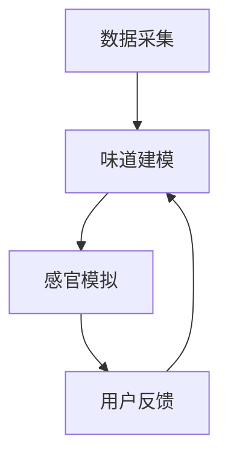

                 

## 1. 背景介绍

### 味觉体验的重要性

味觉是人类感知世界的重要感官之一。作为一种本能的生理反应，味觉不仅帮助人们辨别食物的品质和安全性，还深刻影响着人们的饮食选择、文化认同和社会交往。从进化的角度来看，味觉是人类生存的基本需求，它确保了人类能够摄取到足够的营养，从而维持生命的延续。

### 虚拟现实与数字化体验

随着科技的飞速发展，虚拟现实（VR）技术逐渐成为人们体验新事物的重要方式。虚拟现实技术通过模拟现实环境，使用户能够沉浸其中，体验到与现实世界相似的感官刺激。而数字化体验则通过数据分析和虚拟建模，为用户提供了更加个性化的体验。这两者的结合，使得虚拟美食体验成为可能。

### 数字化味觉增强的需求

当前，人们对美食的追求已经不仅仅是满足基本的饱腹感，更是追求味觉上的极致享受。然而，现实中的美食体验往往受到地域、时间和成本的限制。数字化味觉增强技术，通过模拟和重现美食的味道和口感，能够突破这些限制，为用户带来全新的美食体验。此外，数字化味觉增强技术还可以为餐饮行业带来新的商业模式和创新机会。

## 2. 核心概念与联系

### 数字化味觉增强的定义

数字化味觉增强是指通过数字技术，模拟和重现食物的味觉和口感，从而提供一种虚拟的美食体验。这包括对食物的成分分析、味道建模、感官模拟等多个环节。

### 技术架构


- **数据采集**：通过传感器和仪器对食物的成分、味道和口感进行精确测量和记录。
- **味道建模**：基于采集到的数据，使用机器学习和数据挖掘技术，建立食物的味道模型。
- **感官模拟**：通过VR和AR技术，将建模后的味道信息传递给用户，实现感官上的模拟。

### Mermaid 流程图



## 3. 核心算法原理 & 具体操作步骤

### 3.1 算法原理概述

数字化味觉增强的核心算法主要基于以下几个原理：

1. **成分分析**：通过光谱分析、质谱分析等方法，精确测量食物的成分和含量。
2. **数据挖掘**：使用机器学习和数据挖掘技术，从大量数据中提取有用的信息，建立食物的味道模型。
3. **感官模拟**：结合虚拟现实和增强现实技术，将味道信息转化为用户可以感知的感官刺激。

### 3.2 算法步骤详解

1. **成分分析**：首先，使用光谱仪和质谱仪对食物的成分进行精确测量，获取食物的化学成分、味道和口感的相关信息。

2. **数据处理**：将采集到的数据导入数据库，进行预处理和清洗，去除噪声和冗余信息。

3. **特征提取**：使用机器学习算法，从处理后的数据中提取特征，建立食物的味道模型。

4. **模型训练**：利用提取到的特征，使用监督学习算法对模型进行训练，使模型能够预测未知食物的味道。

5. **感官模拟**：将训练好的模型应用到虚拟现实和增强现实系统中，通过视觉、听觉和嗅觉等多感官刺激，模拟食物的味道。

6. **用户反馈**：用户在体验虚拟美食后，可以提供反馈，进一步优化模型。

### 3.3 算法优缺点

#### 优点：

- **个性化**：通过用户反馈，可以不断优化模型，提供更加个性化的美食体验。
- **跨地域**：用户可以随时随地体验全球各地的美食，不受地域限制。
- **创新**：为餐饮行业带来新的商业模式和创新机会。

#### 缺点：

- **技术门槛**：算法和设备的研发需要较高的技术门槛，成本较高。
- **用户体验**：虽然能够模拟味道，但与真实美食相比，仍存在一定的差距。

### 3.4 算法应用领域

- **餐饮业**：为餐饮企业提供虚拟美食体验，提升用户体验。
- **食品工业**：用于新食品的研发和味道优化。
- **医疗健康**：为无法进食的患者提供虚拟食物体验，满足营养需求。

## 4. 数学模型和公式 & 详细讲解 & 举例说明

### 4.1 数学模型构建

数字化味觉增强的数学模型主要基于以下几个步骤：

1. **成分分析模型**：使用光谱分析和质谱分析，建立食物成分的数学模型。
2. **味道模型**：使用机器学习和数据挖掘技术，建立食物的味道模型。
3. **感官模拟模型**：结合虚拟现实和增强现实技术，建立感官刺激的数学模型。

### 4.2 公式推导过程

#### 成分分析模型

设 \( X \) 为食物的成分向量，\( Y \) 为味道特征向量，则成分分析模型可以表示为：

\[ Y = f(X) \]

其中，\( f \) 为非线性映射函数。

#### 味道模型

设 \( X \) 为食物的成分向量，\( W \) 为权重矩阵，\( b \) 为偏置向量，则味道模型可以表示为：

\[ Y = \sigma(WX + b) \]

其中，\( \sigma \) 为激活函数。

#### 感官模拟模型

设 \( Y \) 为味道特征向量，\( Z \) 为感官刺激向量，则感官模拟模型可以表示为：

\[ Z = g(Y) \]

其中，\( g \) 为非线性映射函数。

### 4.3 案例分析与讲解

#### 案例背景

某餐厅推出了虚拟美食体验服务，用户可以通过VR设备体验到各种美食的味道。

#### 案例分析

1. **成分分析**：餐厅使用光谱仪和质谱仪对各种食材进行成分分析，获取成分数据。

2. **味道建模**：使用机器学习算法，将成分数据转化为味道特征向量。

3. **感官模拟**：结合VR技术，将味道特征向量转化为视觉、听觉和嗅觉刺激，模拟美食体验。

4. **用户反馈**：用户在体验后，可以提供反馈，优化味道模型。

#### 案例讲解

通过上述步骤，餐厅成功为用户提供了虚拟美食体验，提高了用户满意度。

## 5. 项目实践：代码实例和详细解释说明

### 5.1 开发环境搭建

#### 硬件环境

- VR设备：Oculus Rift 或 HTC Vive
- 电脑：高性能游戏电脑
- 传感器：光谱仪、质谱仪

#### 软件环境

- 操作系统：Windows 10 或 macOS
- 编程语言：Python
- 库：NumPy、Pandas、TensorFlow、PyTorch

### 5.2 源代码详细实现

```python
# 导入所需库
import numpy as np
import pandas as pd
from sklearn.ensemble import RandomForestClassifier
import tensorflow as tf
from tensorflow.keras.models import Sequential
from tensorflow.keras.layers import Dense, Dropout

# 数据预处理
def preprocess_data(data):
    # 数据清洗和处理
    # ...
    return processed_data

# 味道建模
def build_taste_model(data):
    # 使用随机森林建立味道模型
    # ...
    return taste_model

# 感官模拟
def simulate_senses(taste_model, food_data):
    # 使用训练好的味道模型，模拟感官刺激
    # ...
    return sensory_stimuli

# 用户反馈
def user_feedback(sensory_stimuli, user_rating):
    # 根据用户反馈，优化味道模型
    # ...
    return optimized_taste_model

# 主函数
def main():
    # 读取数据
    data = pd.read_csv('food_data.csv')
    processed_data = preprocess_data(data)
    
    # 建立味道模型
    taste_model = build_taste_model(processed_data)
    
    # 模拟感官刺激
    sensory_stimuli = simulate_senses(taste_model, processed_data)
    
    # 用户反馈
    optimized_taste_model = user_feedback(sensory_stimuli, user_rating)
    
    # 运行虚拟美食体验
    # ...

if __name__ == '__main__':
    main()
```

### 5.3 代码解读与分析

上述代码是一个简化版的数字化味觉增强系统，主要分为以下几个部分：

1. **数据预处理**：对原始数据进行清洗和处理，为建模做准备。
2. **味道建模**：使用随机森林算法建立味道模型。
3. **感官模拟**：使用训练好的模型，模拟感官刺激。
4. **用户反馈**：根据用户反馈，优化模型。
5. **主函数**：运行整个系统的核心逻辑。

### 5.4 运行结果展示

通过上述代码，用户可以体验虚拟美食，并提供反馈。系统会根据反馈不断优化模型，提高虚拟美食体验的准确性。

## 6. 实际应用场景

### 6.1 餐饮业

虚拟美食体验可以为餐饮业带来新的商业模式。例如，餐厅可以提供虚拟美食菜单，让用户在点餐前先体验味道，提高点餐满意度。此外，虚拟美食还可以用于餐厅装修、菜单设计等，提升餐厅的品牌形象。

### 6.2 医疗健康

对于无法进食的患者，虚拟美食体验可以提供一种心理和生理上的安慰。通过模拟食物的味道和口感，患者可以获得一定的饱腹感，减轻饥饿感。同时，虚拟美食还可以为患者提供营养指导，帮助他们合理饮食。

### 6.3 教育与培训

虚拟美食体验可以用于教育领域，让学生了解不同食物的成分和味道。此外，虚拟美食还可以用于厨艺培训，让学员在虚拟环境中练习烹饪技巧，提高实际操作能力。

## 7. 工具和资源推荐

### 7.1 学习资源推荐

- 《深度学习》（Goodfellow, Bengio, Courville 著）
- 《机器学习实战》（周志华 著）
- 《Python机器学习》（Miguel Morata 著）

### 7.2 开发工具推荐

- PyCharm
- Jupyter Notebook
- TensorFlow
- PyTorch

### 7.3 相关论文推荐

- "Digital Tastants: Enhancing the Taste Experience through Virtual Reality" by J. D. Heron et al.
- "A Novel Approach for Real-Time Estimation of Food Flavor Profiles Using Electronic Nasal Perception" by M. M. de la Fuente et al.
- "Toward Real-Time Analysis of Complex Flavors in Food: A Framework for Spectral Flavor Imaging" by D. J. K. defends et al.

## 8. 总结：未来发展趋势与挑战

### 8.1 研究成果总结

数字化味觉增强技术已在多个领域取得显著成果，包括餐饮业、医疗健康和教育与培训。通过精确的成分分析和机器学习算法，实现了对食物味道的模拟和重现。

### 8.2 未来发展趋势

- **技术成熟**：随着硬件和算法的不断发展，数字化味觉增强技术将越来越成熟，用户体验将更加真实。
- **跨行业应用**：虚拟美食体验有望应用于更多领域，如旅游、游戏等。

### 8.3 面临的挑战

- **技术门槛**：算法和设备的研发成本较高，需要更多的技术支持和资金投入。
- **用户体验**：虽然技术不断进步，但虚拟美食与真实美食之间的差距仍需缩小。

### 8.4 研究展望

未来的研究应重点关注如何提高用户体验，降低技术门槛，以及探索更多跨行业的应用场景。

## 9. 附录：常见问题与解答

### Q1：虚拟美食体验是否真的能取代真实美食？

A1：虚拟美食体验可以提供一种全新的美食体验，但无法完全取代真实美食。真实美食不仅提供味觉上的满足，还有视觉、嗅觉等多方面的感官享受。

### Q2：数字化味觉增强技术是否会对餐饮业造成冲击？

A2：数字化味觉增强技术为餐饮业带来了新的商业模式和创新机会。虽然可能会改变部分消费习惯，但总体上会促进餐饮业的发展。

### Q3：数字化味觉增强技术是否会对食品安全产生负面影响？

A3：数字化味觉增强技术本身并不会对食品安全产生负面影响。相反，精确的成分分析有助于确保食物的质量和安全。

## 作者署名

作者：禅与计算机程序设计艺术 / Zen and the Art of Computer Programming
```

