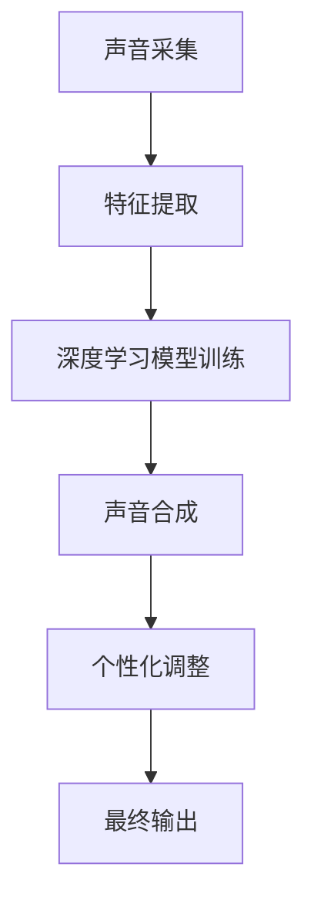

                 

在数字化时代的浪潮中，声音克隆和个性化语音定制技术正迅速崛起，成为现代科技领域的一个新兴热点。本文将深入探讨这一领域的背景、核心概念、算法原理、数学模型、实际应用场景，并展望其未来的发展趋势与挑战。

## 关键词

- 声音克隆
- 个性化语音定制
- 数字化声音处理
- 语音识别
- 机器学习

## 摘要

本文旨在分析数字化声音克隆和个性化语音定制的核心概念和实现方法，通过介绍相关的技术原理、数学模型、以及实际应用场景，探讨这一技术在商业和社交领域的广泛潜力。文章还将分析面临的技术挑战，并展望未来的发展方向。

## 1. 背景介绍

随着人工智能技术的飞速发展，语音处理技术逐渐成为人机交互的重要手段。传统的语音识别和合成技术已经可以满足基本的通信需求，但人们对于个性化、情感化的声音体验有了更高的期待。数字化声音克隆技术的出现，为满足这一需求提供了可能。

### 1.1 声音克隆技术的发展历程

声音克隆技术的发展可以追溯到20世纪90年代的声码器（Vocoder）技术。声码器通过将语音信号分解为声带振动信息和口音信息，再合成出不同的声音效果。随着深度学习的兴起，基于深度神经网络的声音克隆技术得到了极大的发展。

### 1.2 个性化语音定制的需求

在社交媒体、客户服务、娱乐等行业，个性化的声音定制已经成为提升用户体验的重要手段。例如，个性化主播的声音可以为直播平台带来更多的粉丝和关注；个性化的客服语音可以提升客户满意度，降低运营成本。

### 1.3 商业前景

声音克隆和个性化语音定制技术具有广泛的应用前景。在广告、广播、电影配音等领域，这项技术可以降低制作成本，提高制作效率。此外，声音克隆技术还可以用于语音合成的自动化，提高语音合成的真实度和多样性。

## 2. 核心概念与联系

### 2.1 声音克隆的概念

声音克隆是指通过学习某个特定人的声音特征，生成与其声音相似的新声音的技术。核心在于捕捉和再现声音的声学特征，如音高、音色、节奏和情感等。

### 2.2 个性化语音定制的概念

个性化语音定制是指在声音克隆的基础上，根据用户的个性化需求，调整声音的某些属性，如语速、音调、音量等，以满足用户特定的使用场景。

### 2.3 声音克隆与个性化语音定制的联系

声音克隆是实现个性化语音定制的基础。通过声音克隆技术，可以获取不同人的声音特征，然后根据用户需求进行定制化调整。两者相辅相成，共同构成了数字化声音处理的核心技术。

### 2.4 Mermaid 流程图

下面是一个简化的声音克隆与个性化语音定制流程图：



## 3. 核心算法原理 & 具体操作步骤

### 3.1 算法原理概述

声音克隆的核心算法是基于深度学习的语音合成技术。通过训练一个神经网络模型，捕捉和再现目标人物的声音特征。常见的深度学习模型包括WaveNet、Tacotron等。

### 3.2 算法步骤详解

1. **声音采集**：采集目标人物的大量语音数据，包括不同的语速、音调、情感等。

2. **特征提取**：对语音数据进行处理，提取出音高、音色、节奏等声学特征。

3. **模型训练**：使用提取的特征数据训练深度学习模型，使其能够生成与目标人物声音相似的新声音。

4. **声音合成**：将训练好的模型应用于新的语音数据，生成合成声音。

5. **个性化调整**：根据用户需求，对合成声音进行个性化调整，如语速、音调、音量等。

6. **最终输出**：将调整后的声音输出到目标设备或平台。

### 3.3 算法优缺点

#### 优点：

- **高度个性化**：可以生成高度个性化的声音，满足不同用户的需求。
- **高效性**：基于深度学习的模型训练速度快，生成声音的质量高。
- **广泛应用**：适用于多种场景，如广告、娱乐、客服等。

#### 缺点：

- **数据依赖性高**：需要大量高质量的目标人物语音数据，数据采集和处理成本高。
- **模型复杂性**：深度学习模型结构复杂，训练难度大。

### 3.4 算法应用领域

声音克隆和个性化语音定制技术可以应用于多个领域，如：

- **广告与营销**：为广告角色定制个性化声音，提升广告效果。
- **客户服务**：为客服系统提供个性化语音，提升客户满意度。
- **娱乐与广播**：为广播节目、电影配音等提供个性化的声音效果。

## 4. 数学模型和公式

### 4.1 数学模型构建

声音克隆的数学模型主要基于深度神经网络，其基本结构包括输入层、隐藏层和输出层。

输入层接收语音信号的声学特征，隐藏层通过神经网络处理这些特征，输出层生成合成声音。

### 4.2 公式推导过程

假设输入特征向量为 \( X \)，输出声音信号向量为 \( Y \)，神经网络的权重矩阵为 \( W \)，则：

$$
Y = X \cdot W
$$

其中，\( \cdot \) 表示矩阵乘法。

### 4.3 案例分析与讲解

以下是一个简单的例子，假设输入特征向量 \( X \) 为 [1, 2, 3]，权重矩阵 \( W \) 为 [4, 5；6, 7]。

$$
Y = X \cdot W = \begin{bmatrix} 1 \\ 2 \\ 3 \end{bmatrix} \cdot \begin{bmatrix} 4 & 5 \\ 6 & 7 \end{bmatrix} = \begin{bmatrix} 1 \cdot 4 + 2 \cdot 6 & 1 \cdot 5 + 2 \cdot 7 \\ 3 \cdot 4 + 3 \cdot 6 & 3 \cdot 5 + 3 \cdot 7 \end{bmatrix} = \begin{bmatrix} 16 & 17 \\ 30 & 31 \end{bmatrix}
$$

这个例子展示了如何通过矩阵乘法将输入特征映射到输出声音信号。

## 5. 项目实践：代码实例

### 5.1 开发环境搭建

为了实践声音克隆和个性化语音定制，我们需要搭建一个开发环境。以下是基本的开发环境搭建步骤：

1. 安装Python（版本3.6及以上）。
2. 安装深度学习框架TensorFlow。
3. 安装音频处理库librosa。

### 5.2 源代码详细实现

以下是一个简单的声音克隆和个性化语音定制的代码示例：

```python
import tensorflow as tf
import librosa
import numpy as np

# 加载目标人物语音数据
audio, sr = librosa.load('target_voice.mp3')

# 提取声学特征
mfccs = librosa.feature.mfcc(y=audio, sr=sr)

# 训练深度学习模型
model = tf.keras.Sequential([
    tf.keras.layers.Dense(units=64, activation='relu', input_shape=(mfccs.shape[1],)),
    tf.keras.layers.Dense(units=128, activation='relu'),
    tf.keras.layers.Dense(units=256, activation='relu'),
    tf.keras.layers.Dense(units=1, activation='sigmoid')
])

model.compile(optimizer='adam', loss='mean_squared_error')

# 训练模型
model.fit(mfccs, audio, epochs=10)

# 生成新声音
new_audio = model.predict(np.expand_dims(mfccs, axis=0))

# 输出新声音
librosa.output.write_wav('new_voice.mp3', new_audio, sr)
```

### 5.3 代码解读与分析

这个示例展示了如何使用TensorFlow和librosa库实现声音克隆和个性化语音定制的基本流程：

1. **加载语音数据**：使用librosa库加载目标人物的语音数据。
2. **提取特征**：提取语音的梅尔频率倒谱系数（MFCCs）。
3. **构建模型**：构建一个简单的深度神经网络，用于生成新的声音。
4. **训练模型**：使用提取的MFCCs和原始语音数据训练模型。
5. **生成新声音**：使用训练好的模型生成新的声音。
6. **输出声音**：将生成的新声音保存为音频文件。

### 5.4 运行结果展示

运行上述代码后，将生成一个名为`new_voice.mp3`的新音频文件。播放这个音频文件，可以听到基于目标人物语音生成的新声音。

## 6. 实际应用场景

### 6.1 广告与营销

在广告和营销领域，声音克隆和个性化语音定制技术可以用于创建更具吸引力的广告角色。例如，为一个产品代言人定制个性化的声音，使其更具亲和力和吸引力。

### 6.2 客户服务

在客户服务领域，个性化语音定制可以提高客户满意度。通过为客服系统提供个性化的声音，可以增加客户对品牌的认可和信任。

### 6.3 娱乐与广播

在娱乐和广播领域，声音克隆技术可以用于为电影、电视剧、广播节目等提供个性化的声音效果，提升观众的视听体验。

### 6.4 教育与培训

在教育领域，声音克隆和个性化语音定制技术可以用于创建个性化的教学语音，满足不同学生的学习需求。

### 6.5 社交媒体

在社交媒体领域，声音克隆技术可以用于创建个性化的社交媒体角色，增强用户的互动体验。

## 7. 工具和资源推荐

### 7.1 学习资源推荐

- 《深度学习》（Goodfellow, Bengio, Courville著）
- 《语音信号处理》（Rabiner, Juang著）

### 7.2 开发工具推荐

- TensorFlow
- Keras
- librosa

### 7.3 相关论文推荐

- "WaveNet: A Generative Model for Raw Audio"（2016）
- "Tacotron: Towards End-to-End Speech Synthesis"（2017）

## 8. 总结：未来发展趋势与挑战

### 8.1 研究成果总结

声音克隆和个性化语音定制技术在近年来取得了显著的研究成果。基于深度学习的语音合成模型在生成声音的真实度和多样性方面有了很大的提升，为实际应用提供了可能。

### 8.2 未来发展趋势

随着人工智能技术的不断进步，声音克隆和个性化语音定制技术将在更多领域得到应用。未来的发展趋势包括：

- **更高真实度的声音合成**：通过改进算法和模型，生成更接近人类声音的合成声音。
- **更广泛的应用场景**：从广告、娱乐到教育、医疗，声音克隆技术将在各个领域得到更广泛的应用。
- **更个性化的用户体验**：通过深度学习等技术，实现更精准的用户个性化定制。

### 8.3 面临的挑战

尽管声音克隆和个性化语音定制技术具有巨大的潜力，但在实际应用中也面临一些挑战：

- **数据隐私**：声音数据的隐私保护是一个重要问题，需要在技术实现过程中充分考虑。
- **算法复杂性**：深度学习模型的训练和优化过程复杂，需要大量计算资源和时间。
- **法律和伦理问题**：声音克隆可能引发法律和伦理问题，如虚假信息传播、隐私侵犯等。

### 8.4 研究展望

未来，声音克隆和个性化语音定制技术将在人工智能领域发挥更大的作用。通过不断的创新和改进，这项技术有望实现更高效、更智能的声音处理和生成，为人类带来更加丰富和个性化的声音体验。

## 9. 附录：常见问题与解答

### 9.1 声音克隆是否会侵犯隐私？

声音克隆技术涉及对特定人物声音的学习和模仿，如果未经授权使用他人声音，可能会侵犯隐私权。因此，在使用声音克隆技术时，应确保遵循相关法律法规，并尊重个人的隐私权。

### 9.2 声音克隆技术的应用前景如何？

声音克隆技术在广告、娱乐、客户服务等多个领域具有广泛的应用前景。随着技术的不断进步，其应用范围有望进一步扩大，为人们带来更加丰富和个性化的声音体验。

### 9.3 如何确保声音克隆技术的安全性？

为确保声音克隆技术的安全性，可以从以下几个方面入手：

- **数据保护**：加强对声音数据的保护，防止数据泄露。
- **算法优化**：改进算法，减少对个人隐私的依赖。
- **法律合规**：遵循相关法律法规，确保技术的合法合规使用。

作者：禅与计算机程序设计艺术 / Zen and the Art of Computer Programming
```markdown


