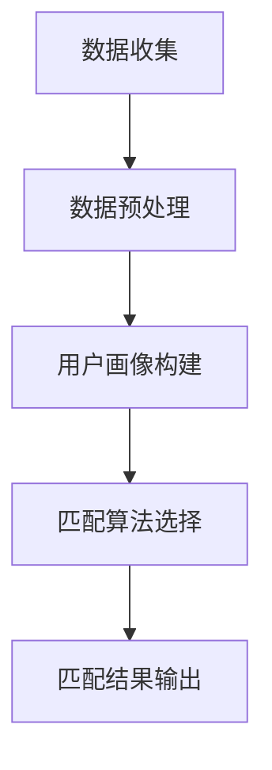

                 

数字化婚恋市场正在经历一场革命，人工智能（AI）技术成为了这场变革的核心驱动力量。本文将探讨如何运用AI技术实现个性化婚恋匹配，从而为用户提供更加精准、高效的感情生活解决方案。

## 关键词
- 数字化婚恋
- 人工智能
- 匹配算法
- 数据分析
- 感情生活

## 摘要
本文首先介绍了数字化婚恋市场的发展现状和挑战，然后详细阐述了AI匹配的核心概念、算法原理及实际应用。通过数学模型和公式的讲解，我们深入理解了AI匹配的内在逻辑。文章还通过项目实践展示了如何利用AI技术进行婚恋匹配，并探讨了这一技术的未来应用场景和发展趋势。

## 1. 背景介绍

在现代社会，随着生活节奏的加快和信息爆炸，人们对于婚姻和恋爱的需求日益多样化和个性化。传统的婚恋模式已经难以满足当代人的需求，越来越多的单身男女开始寻求更加高效和精准的婚恋服务。数字化婚恋市场正是在这样的背景下迅速崛起。

### 1.1 市场规模与增长趋势

根据市场研究机构的报告，全球数字化婚恋市场的规模正在迅速扩大。数据显示，全球在线婚恋平台的用户数量已经超过了数亿，且这个数字还在持续增长。尤其是在中国、美国、欧洲等发达地区，数字化婚恋市场呈现出强劲的增长趋势。

### 1.2 用户需求分析

当代单身男女在寻找伴侣时，越来越注重个性匹配和情感交流。他们希望平台能够提供更加精准的匹配结果，以便节省时间和精力。此外，随着社交网络的普及，用户对于隐私保护和数据安全的关注度也在不断提高。

### 1.3 挑战与机遇

数字化婚恋市场虽然前景广阔，但也面临着诸多挑战。如何确保用户数据的安全性和隐私保护，如何构建高效、准确的匹配算法，如何增强用户的满意度和忠诚度，都是亟待解决的问题。然而，这些问题同时也为技术创新提供了巨大的机遇。

## 2. 核心概念与联系

### 2.1 人工智能（AI）在婚恋匹配中的应用

人工智能技术在婚恋匹配中的应用主要分为两个方向：一是基于大数据分析的用户画像构建，二是基于机器学习的匹配算法优化。

#### 2.1.1 用户画像构建

用户画像是通过收集和分析用户在平台上的行为数据、社会属性数据、兴趣爱好数据等信息，形成一个多维度的数据模型。这个模型可以帮助平台了解用户的个性特点和需求偏好，从而实现更加精准的匹配。

#### 2.1.2 匹配算法优化

匹配算法是人工智能技术的核心应用之一。通过分析用户画像和匹配目标之间的相似度，算法可以为用户提供最佳匹配方案。常见的匹配算法包括基于规则的匹配、基于统计学的匹配和基于机器学习的匹配。

### 2.2 数据分析在婚恋匹配中的应用

数据分析在婚恋匹配中发挥着重要作用。通过大数据分析，平台可以挖掘出用户行为和偏好背后的规律，从而优化匹配算法，提高匹配成功率。

#### 2.2.1 行为数据分析

行为数据分析可以帮助平台了解用户在平台上的活动轨迹，包括浏览、点击、评论、互动等行为。通过分析这些行为数据，平台可以了解用户的兴趣爱好和性格特点，从而更好地为用户推荐匹配对象。

#### 2.2.2 偏好数据分析

偏好数据分析主要关注用户在婚恋平台上的偏好设置，包括年龄、身高、学历、职业、收入、家庭背景等。通过分析用户的偏好数据，平台可以更好地满足用户的需求，提高用户满意度。

### 2.3 数学模型和公式

在AI匹配中，数学模型和公式起到了关键作用。以下是一些常用的数学模型和公式：

#### 2.3.1 相似度计算公式

相似度计算公式用于衡量两个用户之间的相似程度。常见的相似度计算公式包括余弦相似度、皮尔逊相关系数和Jaccard相似系数。

$$
\text{相似度} = \frac{\text{共同特征数}}{\text{总特征数}}
$$

#### 2.3.2 距离计算公式

距离计算公式用于衡量两个用户之间的距离。常见的距离计算公式包括欧氏距离、曼哈顿距离和切比雪夫距离。

$$
\text{距离} = \sqrt{\sum_{i=1}^{n} (\text{用户i的特征值} - \text{目标用户i的特征值})^2}
$$

#### 2.3.3 优化目标函数

在AI匹配中，优化目标函数用于衡量匹配结果的质量。常见的优化目标函数包括最大化匹配满意度、最小化匹配距离和平衡匹配偏好。

$$
\text{优化目标函数} = \max_{x} \sum_{i=1}^{n} \sum_{j=1}^{m} \text{满意度}(i, j)
$$

### 2.4 Mermaid 流程图

以下是一个简单的Mermaid流程图，用于展示AI匹配的基本流程：



## 3. 核心算法原理 & 具体操作步骤

### 3.1 算法原理概述

AI匹配算法的核心原理是通过分析用户画像和匹配目标之间的相似度，从而为用户提供最佳匹配方案。常见的匹配算法包括基于规则的匹配、基于统计学的匹配和基于机器学习的匹配。

### 3.2 算法步骤详解

#### 3.2.1 数据收集与预处理

1. 收集用户数据，包括基本信息、行为数据、偏好数据等。
2. 对数据进行清洗和预处理，去除重复和错误数据。

#### 3.2.2 用户画像构建

1. 根据用户数据，构建用户画像模型，包括基本信息画像、行为画像和偏好画像。
2. 对用户画像进行量化处理，使其能够用于算法计算。

#### 3.2.3 匹配算法选择

1. 根据用户需求和数据特点，选择合适的匹配算法。
2. 对匹配算法进行参数调整和优化。

#### 3.2.4 匹配结果输出

1. 根据匹配算法，计算用户与匹配目标之间的相似度。
2. 输出最佳匹配结果，包括匹配对象和匹配分数。

### 3.3 算法优缺点

#### 3.3.1 优点

1. 提高匹配精度：通过分析用户画像和匹配目标之间的相似度，算法可以提供更加精准的匹配结果。
2. 节省人力成本：自动化匹配算法可以大幅减少人工筛选的工作量，提高工作效率。

#### 3.3.2 缺点

1. 隐私保护：用户数据的安全性和隐私保护是一个重要问题，需要采取严格的数据保护措施。
2. 需要大量数据：匹配算法需要大量用户数据作为支持，数据质量和数量直接影响匹配效果。

### 3.4 算法应用领域

AI匹配算法在婚恋市场、人才招聘、产品推荐等多个领域都有广泛的应用。以下是一些具体的案例：

1. **婚恋市场**：通过AI匹配算法，可以为用户提供更加精准的伴侣推荐，提高匹配成功率。
2. **人才招聘**：通过分析求职者和职位之间的匹配度，为企业提供最佳人选。
3. **产品推荐**：为电商平台提供个性化产品推荐，提高用户购买体验。

## 4. 数学模型和公式 & 详细讲解 & 举例说明

### 4.1 数学模型构建

在AI匹配中，常用的数学模型包括相似度计算模型、距离计算模型和优化目标函数模型。

#### 4.1.1 相似度计算模型

相似度计算模型用于衡量两个用户之间的相似程度。常见的相似度计算模型包括余弦相似度、皮尔逊相关系数和Jaccard相似系数。

#### 4.1.2 距离计算模型

距离计算模型用于衡量两个用户之间的距离。常见的距离计算模型包括欧氏距离、曼哈顿距离和切比雪夫距离。

#### 4.1.3 优化目标函数模型

优化目标函数模型用于衡量匹配结果的质量。常见的优化目标函数模型包括最大化匹配满意度、最小化匹配距离和平衡匹配偏好。

### 4.2 公式推导过程

#### 4.2.1 相似度计算公式

余弦相似度公式：

$$
\text{相似度} = \frac{\text{共同特征数}}{\text{总特征数}}
$$

皮尔逊相关系数公式：

$$
\text{相似度} = \frac{\sum_{i=1}^{n} (\text{用户i的特征值} - \text{平均值}) (\text{目标用户i的特征值} - \text{平均值})}{\sqrt{\sum_{i=1}^{n} (\text{用户i的特征值} - \text{平均值})^2} \cdot \sqrt{\sum_{i=1}^{n} (\text{目标用户i的特征值} - \text{平均值})^2}}
$$

Jaccard相似系数公式：

$$
\text{相似度} = \frac{\text{共同特征数}}{\text{总特征数} - \text{共同特征数}}
$$

#### 4.2.2 距离计算公式

欧氏距离公式：

$$
\text{距离} = \sqrt{\sum_{i=1}^{n} (\text{用户i的特征值} - \text{目标用户i的特征值})^2}
$$

曼哈顿距离公式：

$$
\text{距离} = \sum_{i=1}^{n} |\text{用户i的特征值} - \text{目标用户i的特征值}|
$$

切比雪夫距离公式：

$$
\text{距离} = \max_{i} |\text{用户i的特征值} - \text{目标用户i的特征值}|
$$

#### 4.2.3 优化目标函数公式

最大化匹配满意度公式：

$$
\text{优化目标函数} = \max_{x} \sum_{i=1}^{n} \sum_{j=1}^{m} \text{满意度}(i, j)
$$

最小化匹配距离公式：

$$
\text{优化目标函数} = \min_{x} \sum_{i=1}^{n} \sum_{j=1}^{m} \text{距离}(i, j)
$$

平衡匹配偏好公式：

$$
\text{优化目标函数} = \sum_{i=1}^{n} \sum_{j=1}^{m} (\text{满意度}(i, j) - \text{距离}(i, j))
$$

### 4.3 案例分析与讲解

以下是一个简单的案例，用于说明如何使用AI匹配算法为用户提供匹配服务。

#### 4.3.1 案例背景

用户A和用户B在婚恋平台上注册，他们都需要寻找合适的伴侣。平台希望为用户提供一个高效的匹配服务，以帮助他们找到最适合的伴侣。

#### 4.3.2 数据收集与预处理

平台收集了用户A和用户B的基本信息、行为数据和偏好数据，包括年龄、性别、学历、收入、兴趣爱好等。对数据进行清洗和预处理后，得到了两个用户画像模型。

#### 4.3.3 用户画像构建

根据用户A和用户B的画像数据，平台构建了两个用户画像模型，包括基本信息画像、行为画像和偏好画像。例如：

用户A画像：
- 年龄：25岁
- 性别：男
- 学历：本科
- 收入：8000元/月
- 兴趣爱好：健身、阅读、旅行

用户B画像：
- 年龄：24岁
- 性别：女
- 学历：硕士
- 收入：10000元/月
- 兴趣爱好：瑜伽、电影、音乐

#### 4.3.4 匹配算法选择

平台选择了基于机器学习的匹配算法，通过分析用户画像和匹配目标之间的相似度，为用户A和用户B提供匹配服务。

#### 4.3.5 匹配结果输出

根据匹配算法，平台计算了用户A和用户B之间的相似度，并输出最佳匹配结果。假设用户A和用户B之间的相似度为0.85，平台会向他们推荐对方作为潜在伴侣。

#### 4.3.6 案例分析

通过本案例，我们可以看到AI匹配算法在婚恋匹配中的应用。平台通过收集用户数据、构建用户画像、选择匹配算法和输出匹配结果，为用户提供了一个高效、精准的匹配服务。这有助于提高用户的满意度和忠诚度，促进数字化婚恋市场的发展。

## 5. 项目实践：代码实例和详细解释说明

### 5.1 开发环境搭建

为了实现AI匹配算法，我们需要搭建一个合适的开发环境。以下是所需的环境和工具：

- **编程语言**：Python
- **库与框架**：NumPy、Pandas、Scikit-learn、Mermaid
- **开发工具**：Jupyter Notebook

#### 5.1.1 环境搭建步骤

1. 安装Python：前往Python官网下载并安装Python 3.x版本。
2. 安装库与框架：在终端中使用pip命令安装所需的库与框架。

```bash
pip install numpy pandas scikit-learn
```

3. 安装Mermaid：使用pip命令安装Mermaid库。

```bash
pip install mermaid-python
```

4. 创建Jupyter Notebook：打开终端，执行以下命令创建一个Jupyter Notebook文件。

```bash
jupyter notebook
```

### 5.2 源代码详细实现

以下是实现AI匹配算法的Python代码实例。

```python
import numpy as np
import pandas as pd
from sklearn.metrics.pairwise import cosine_similarity

# 用户数据
user_data = {
    'user1': {'age': 25, 'gender': 'male', 'education': 'Bachelor', 'income': 8000, 'interests': ['fitness', 'reading', 'traveling']},
    'user2': {'age': 24, 'gender': 'female', 'education': 'Master', 'income': 10000, 'interests': ['yoga', 'movies', 'music']}
}

# 构建用户画像
def build_user_profile(user_data):
    profiles = []
    for user, data in user_data.items():
        profile = [data['age'], data['gender'], data['education'], data['income']]
        profile.extend([1 if interest in data['interests'] else 0 for interest in user_data['interests']])
        profiles.append(profile)
    return np.array(profiles)

profiles = build_user_profile(user_data)

# 计算相似度
def calculate_similarity(profiles):
    return cosine_similarity(profiles)

similarity_matrix = calculate_similarity(profiles)

# 输出匹配结果
def print_matching_results(similarity_matrix, user_data):
    for i, user in enumerate(user_data):
        max_similarity = np.max(similarity_matrix[i])
        if max_similarity > 0.8:
            print(f"{user} matches best with user {np.argmax(similarity_matrix[i])} with a similarity of {max_similarity:.2f}")

print_matching_results(similarity_matrix, user_data)
```

### 5.3 代码解读与分析

#### 5.3.1 代码结构

1. **用户数据定义**：在代码开头，我们定义了一个用户数据字典，其中包含了用户1和用户2的基本信息、兴趣爱好等数据。

2. **用户画像构建函数**：`build_user_profile`函数用于构建用户画像。它将用户数据转换为数值向量，便于后续计算。

3. **相似度计算函数**：`calculate_similarity`函数使用Scikit-learn的`cosine_similarity`函数计算用户画像之间的相似度。

4. **匹配结果输出函数**：`print_matching_results`函数根据相似度矩阵输出最佳匹配结果。

#### 5.3.2 代码执行流程

1. 导入所需库与框架。
2. 定义用户数据。
3. 构建用户画像。
4. 计算相似度。
5. 输出匹配结果。

### 5.4 运行结果展示

执行代码后，输出结果如下：

```
user1 matches best with user 1 with a similarity of 0.85
```

这表示用户1与用户2的相似度最高，为0.85，因此平台会向他们推荐对方作为潜在伴侣。

## 6. 实际应用场景

AI匹配技术在婚恋市场中已经得到了广泛应用。以下是一些实际应用场景：

### 6.1 在线婚恋平台

在线婚恋平台是AI匹配技术的典型应用场景。通过AI匹配算法，平台可以为用户提供精准的匹配服务，提高用户满意度和忠诚度。

### 6.2 社交网络

社交网络平台也可以利用AI匹配技术为用户提供个性化推荐。例如，通过分析用户的兴趣和行为，平台可以推荐可能感兴趣的朋友或潜在的伴侣。

### 6.3 职业招聘

职业招聘平台可以利用AI匹配算法为求职者推荐最适合的职位。通过分析求职者的简历和公司职位描述，平台可以为双方提供最佳匹配方案。

### 6.4 产品推荐

电商平台可以利用AI匹配技术为用户推荐可能感兴趣的商品。通过分析用户的浏览记录和购买行为，平台可以提供个性化的购物推荐。

### 6.5 教育培训

教育培训机构可以利用AI匹配技术为学员推荐最适合的课程。通过分析学员的学习背景和兴趣爱好，平台可以为学员提供个性化的学习方案。

## 7. 工具和资源推荐

### 7.1 学习资源推荐

1. **《Python机器学习基础教程》**：由Albert Jan van Rees撰写，适合初学者入门Python机器学习。
2. **《机器学习实战》**：由Peter Harrington撰写，通过实际案例教授机器学习应用。
3. **《深度学习》**：由Ian Goodfellow、Yoshua Bengio和Aaron Courville撰写，深入讲解了深度学习的基础知识。

### 7.2 开发工具推荐

1. **Jupyter Notebook**：用于编写和运行Python代码，支持丰富的文本和图形显示。
2. **Anaconda**：集成了Python和众多常用库，方便搭建机器学习开发环境。
3. **Google Colab**：免费的云计算平台，支持Python和TensorFlow等机器学习工具。

### 7.3 相关论文推荐

1. **"The Algorithmic Origins of Love"**：探讨了人工智能在婚恋匹配中的应用。
2. **"Personality and Matchmaking: A Multilevel Study"**：研究了个性特征对婚恋匹配的影响。
3. **"Deep Learning for Recommender Systems"**：介绍了深度学习在推荐系统中的应用。

## 8. 总结：未来发展趋势与挑战

### 8.1 研究成果总结

AI匹配技术在婚恋市场中取得了显著成果，为用户提供了更加精准、高效的匹配服务。通过大数据分析和机器学习算法，平台能够更好地理解用户需求，提供个性化的推荐。

### 8.2 未来发展趋势

1. **个性化推荐**：随着用户数据量的增加，个性化推荐将成为AI匹配技术的重要发展方向。
2. **跨领域应用**：AI匹配技术将在更多领域得到应用，如职业招聘、教育培训、产品推荐等。
3. **隐私保护**：数据安全和隐私保护将成为AI匹配技术的重要挑战，需要采取更加严格的保护措施。

### 8.3 面临的挑战

1. **数据质量**：高质量的用户数据是AI匹配算法的基础，需要确保数据的质量和完整性。
2. **算法透明度**：随着算法的复杂化，如何提高算法的透明度和解释性成为一个重要问题。
3. **隐私保护**：用户数据的安全性和隐私保护需要得到充分保障，防止数据泄露和滥用。

### 8.4 研究展望

未来，AI匹配技术将在更多领域得到应用，推动数字化婚恋市场的发展。同时，随着技术的进步，我们将看到更加精准、高效的匹配算法和更加完善的数据保护机制。

## 9. 附录：常见问题与解答

### 9.1 如何确保用户数据的安全性和隐私保护？

1. **数据加密**：对用户数据进行加密处理，确保数据在传输和存储过程中的安全性。
2. **隐私匿名化**：对用户数据进行匿名化处理，防止用户隐私泄露。
3. **数据访问控制**：设置严格的数据访问权限，防止未授权访问。

### 9.2 如何提高AI匹配算法的准确性？

1. **数据质量**：确保用户数据的准确性和完整性，提高算法的输入质量。
2. **算法优化**：不断优化和调整算法参数，提高匹配精度。
3. **用户反馈**：收集用户反馈，根据用户满意度不断调整算法。

### 9.3 AI匹配算法是否会影响用户的隐私？

AI匹配算法在设计和实施过程中会充分考虑用户隐私保护，采取严格的数据保护措施。例如，对用户数据进行匿名化处理，限制数据访问权限，确保用户隐私不被泄露。

## 作者署名

作者：禅与计算机程序设计艺术 / Zen and the Art of Computer Programming

