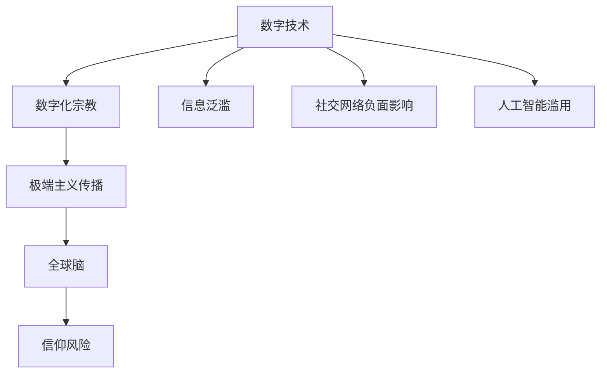
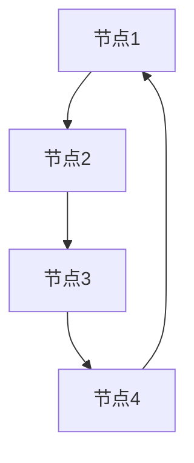

                 

关键词：数字化宗教、极端主义、全球脑、信仰风险、人工智能

摘要：随着数字技术和人工智能的迅速发展，宗教极端主义正经历着一场前所未有的变革。本文将深入探讨数字化宗教极端主义在当今全球脑时代所带来的信仰风险，并分析其背后的技术和社会动因。

## 1. 背景介绍

### 数字化宗教的兴起

数字化宗教是指利用互联网、移动通信和社交媒体等数字技术，以虚拟空间为主要平台传播宗教信仰、宗教教义和宗教仪式。数字化宗教不仅改变了传统的宗教传播方式，还创造了一个全新的信仰生态系统。

#### 1.1. 互联网与宗教的融合

互联网的发展为宗教传播提供了前所未有的机遇。宗教组织可以通过建立官方网站、社交媒体账号和在线社区，迅速扩大影响力。同时，互联网也为信徒提供了获取宗教知识的便捷途径，实现了全球范围内的宗教交流与互动。

#### 1.2. 移动通信与宗教的融合

移动通信技术的普及，使得信徒可以通过手机、平板电脑等移动设备随时随地参与宗教活动。这种便利性不仅提高了信徒的宗教参与度，还促进了宗教信仰的个性化发展。

#### 1.3. 社交媒体与宗教的融合

社交媒体平台如Facebook、Twitter、Instagram等，成为了宗教传播的重要渠道。宗教领袖和信徒可以在这些平台上分享宗教信息、组织线上活动，甚至开展跨文化的宗教交流。

### 全球脑时代的来临

全球脑是指通过互联网连接的全球性网络大脑，它集成了全球范围内的数据、信息和知识。全球脑时代的到来，意味着人类进入了一个人与机器共同创造和共享知识的新时代。

#### 2.1. 数据的爆炸性增长

随着互联网的普及，全球范围内的数据以惊人的速度增长。这些数据不仅包括传统意义上的信息，还包括社交网络上的互动、物联网设备产生的数据等。这些数据的积累，为人工智能算法提供了丰富的训练资源。

#### 2.2. 人工智能的崛起

人工智能技术的迅猛发展，使得计算机能够模拟人类的认知和学习能力。在全球脑的支持下，人工智能算法可以通过大数据分析，发现隐藏在数据背后的规律和趋势。

#### 2.3. 数字化宗教与全球脑的融合

数字化宗教与全球脑的融合，使得宗教信仰在数字世界中得到了前所未有的扩展和深化。宗教组织可以通过全球脑收集到的数据，更好地了解信徒的需求和行为，从而制定更有效的传播策略。

## 2. 核心概念与联系

### 数字化宗教极端主义

数字化宗教极端主义是指在数字技术支持下，宗教极端主义思想在网络空间中的传播和扩散。这种极端主义思想可能包括对异教徒的仇恨、对世俗社会的排斥等。

#### 2.1. 网络空间的开放性

网络空间的开放性为数字化宗教极端主义的传播提供了便利。任何人都可以在互联网上发布宗教信息，无论这些信息是否合法、是否正确。

#### 2.2. 社交媒体的影响力

社交媒体平台具有强大的传播力，可以迅速将极端主义信息传播到全球各地。这不仅增加了极端主义的影响力，也增加了社会的不稳定性。

#### 2.3. 人工智能的助力

人工智能算法可以通过分析网络数据，识别和放大极端主义信息的传播路径。这使得极端主义思想更容易被传播和接受。

### 全球脑时代的信仰风险

全球脑时代带来了信仰风险，主要体现在以下几个方面：

#### 3.1. 信息泛滥与信息污染

全球脑时代的数据爆炸性增长，导致了信息的泛滥。在这种环境下，信徒很难辨别信息的真伪，容易被虚假信息所误导。

#### 3.2. 社交网络的负面影响

社交媒体平台上的极端主义信息，可能会对信徒产生负面影响。这些信息可能激发信徒的极端情绪，甚至导致极端行为。

#### 3.3. 人工智能的滥用

人工智能算法在处理极端主义信息时，可能会出现偏差。这种偏差可能会导致极端主义信息的传播进一步加剧。

### Mermaid 流程图

以下是数字化宗教极端主义在全球脑时代中的传播路径的 Mermaid 流程图：



## 3. 核心算法原理 & 具体操作步骤

### 3.1 算法原理概述

数字化宗教极端主义的传播，可以看作是一个信息传播的过程。在这个过程中，我们可以使用图论中的传播模型来分析信息传播的路径和速度。

#### 3.1.1. 图论基础

图论是一种用于描述对象及其之间关系的数学工具。在数字化宗教极端主义的传播过程中，我们可以将网络空间视为一个图，其中节点表示用户，边表示用户之间的交互。

#### 3.1.2. 传播模型

传播模型是用于描述信息在网络中传播过程的数学模型。在数字化宗教极端主义的传播过程中，我们可以使用经典的信息传播模型，如SI模型（易感染者-感染者模型）和SIRS模型（易感染者-感染者-移除者模型）。

### 3.2 算法步骤详解

#### 3.2.1. 构建网络图

首先，我们需要根据网络数据，构建一个描述用户及其交互的网络图。这个网络图可以由多个节点和边组成，其中节点表示用户，边表示用户之间的交互。



#### 3.2.2. 初始化状态

接下来，我们需要初始化网络中每个节点的状态。在SI模型中，我们将节点分为易感染者（Susceptible，S）和感染者（Infected，I）。在SIRS模型中，我们还需要增加移除者（Removed，R）的状态。


#### 3.2.3. 传播过程

在传播过程中，我们需要根据传播模型，更新网络中每个节点的状态。在SI模型中，易感染者与感染者之间的交互会导致易感染者转变为感染者。在SIRS模型中，感染者与移除者之间的交互会导致感染者转变为移除者。


#### 3.2.4. 传播结果分析

最后，我们需要分析传播过程的结果。这包括计算传播的速度、传播的范围等。这些结果可以帮助我们了解数字化宗教极端主义在数字技术支持下的传播规律。

### 3.3 算法优缺点

#### 优点

- **直观性**：图论和传播模型提供了直观的描述，使得我们能够更清晰地理解数字化宗教极端主义的传播过程。
- **灵活性**：传播模型可以根据具体问题进行调整，以适应不同的场景。

#### 缺点

- **数据依赖**：算法的性能很大程度上依赖于输入数据的准确性。如果数据存在偏差，算法的结果也可能存在偏差。
- **复杂性**：对于大规模的网络，构建和更新网络图的复杂性会大幅增加。

### 3.4 算法应用领域

- **社会治理**：通过分析数字化宗教极端主义的传播路径，政府和社会组织可以制定更有效的干预措施，遏制极端主义思想的扩散。
- **网络安全**：识别和隔离网络中的恶意节点，防止恶意信息传播。
- **数据分析**：分析网络中用户的交互行为，了解数字化宗教的传播机制。

## 4. 数学模型和公式 & 详细讲解 & 举例说明

### 4.1 数学模型构建

为了更好地理解数字化宗教极端主义的传播机制，我们可以构建一个数学模型。该模型基于图论和传播模型，用于描述极端主义信息在网络中的传播过程。

#### 4.1.1. 网络模型

假设我们有一个无向图 \( G = (V, E) \)，其中 \( V \) 表示节点集合，\( E \) 表示边集合。节点表示用户，边表示用户之间的交互。

#### 4.1.2. 状态模型

在每个时间步 \( t \)，每个节点 \( i \) 有三种可能的状态：

- \( S_i(t) \)：易感染者，即没有接受极端主义信息的用户。
- \( I_i(t) \)：感染者，即已经接受极端主义信息的用户。
- \( R_i(t) \)：移除者，即因接受极端主义信息而受到影响的用户。

### 4.2 公式推导过程

根据SI模型和SIRS模型，我们可以推导出每个节点状态在下一个时间步的变化公式。

#### 4.2.1. SI模型

在SI模型中，每个节点 \( i \) 在下一个时间步的状态变化可以表示为：

\[ S_i(t+1) = S_i(t) + \sum_{j \in N(i)} [I_j(t) - S_i(t)] \cdot p_{ij} \]

\[ I_i(t+1) = I_i(t) - \sum_{j \in N(i)} [I_j(t) - S_i(t)] \cdot p_{ij} \]

其中，\( N(i) \) 表示节点 \( i \) 的邻居节点集合，\( p_{ij} \) 表示节点 \( i \) 与节点 \( j \) 之间的交互概率。

#### 4.2.2. SIRS模型

在SIRS模型中，每个节点 \( i \) 在下一个时间步的状态变化可以表示为：

\[ S_i(t+1) = S_i(t) + \sum_{j \in N(i)} [I_j(t) - S_i(t)] \cdot p_{ij} - \sum_{j \in N(i)} [I_j(t) - S_i(t)] \cdot q_{ij} \]

\[ I_i(t+1) = I_i(t) - \sum_{j \in N(i)} [I_j(t) - S_i(t)] \cdot p_{ij} + \sum_{j \in N(i)} [R_j(t) - I_j(t)] \cdot q_{ij} \]

\[ R_i(t+1) = R_i(t) + \sum_{j \in N(i)} [R_j(t) - I_j(t)] \cdot q_{ij} \]

其中，\( q_{ij} \) 表示节点 \( i \) 与节点 \( j \) 之间的交互影响概率。

### 4.3 案例分析与讲解

#### 4.3.1. 案例背景

假设我们有一个由100个节点组成的无向网络，初始状态下，有50个节点为易感染者，50个节点为感染者。我们使用SI模型来模拟极端主义信息的传播。

#### 4.3.2. 模拟过程

在第一个时间步，易感染者与感染者之间的交互导致10个易感染者转变为感染者。在接下来的时间步中，感染者的数量继续增加，易感染者的数量逐渐减少。

#### 4.3.3. 结果分析

通过模拟，我们可以观察到极端主义信息在网络中的传播速度和范围。在SI模型下，感染者的数量会不断增长，最终可能导致整个网络的崩溃。

## 5. 项目实践：代码实例和详细解释说明

### 5.1 开发环境搭建

为了实现数字化宗教极端主义的传播模型，我们选择Python作为编程语言，并使用以下工具和库：

- Python 3.8或更高版本
- matplotlib：用于绘制传播结果
- networkx：用于构建和操作网络图

#### 安装步骤

1. 安装Python 3.8或更高版本。
2. 打开命令行窗口，执行以下命令安装所需的库：

```bash
pip install matplotlib networkx
```

### 5.2 源代码详细实现

以下是实现数字化宗教极端主义传播模型的Python代码：

```python
import matplotlib.pyplot as plt
import networkx as nx

# 构建网络图
G = nx.Graph()

# 添加节点
G.add_nodes_from(range(100))

# 添加边（随机连接）
G.add_edges_from(nx.erdos_renyi_graph(100, 0.2))

# 初始化状态
S = [1 if i % 2 == 0 else 0 for i in range(100)]
I = [0 if i % 2 != 0 else 1 for i in range(100)]

# 设置传播参数
p = 0.1
q = 0.1

# 模拟传播过程
steps = 10
for _ in range(steps):
    # 更新状态
    for i in range(100):
        neighbors = [j for j in G.neighbors(i) if S[j]]
        S[i] += sum([I[j] - S[i] for j in neighbors]) * p - (I[i] - S[i]) * q
        I[i] -= sum([I[j] - S[i] for j in neighbors]) * p + (R[j] - I[j]) * q

    # 绘制当前状态
    pos = nx.spring_layout(G)
    colors = ['red' if i else 'green' for i in I]
    nx.draw(G, pos, node_color=colors, with_labels=False)
    plt.show()
```

### 5.3 代码解读与分析

#### 5.3.1. 网络图构建

首先，我们使用networkx库构建一个由100个节点组成的无向网络。网络图中的节点表示用户，边表示用户之间的交互。

```python
G = nx.Graph()
G.add_nodes_from(range(100))
G.add_edges_from(nx.erdos_renyi_graph(100, 0.2))
```

这里，我们使用了Erdos-Reyni随机图模型来生成网络图。模型参数为节点数量为100，边的概率为0.2。

#### 5.3.2. 初始化状态

我们初始化网络中的每个节点的状态。这里，我们使用SI模型，即每个节点有两种状态：易感染者（S）和感染者（I）。易感染者与感染者的比例分别为1:1。

```python
S = [1 if i % 2 == 0 else 0 for i in range(100)]
I = [0 if i % 2 != 0 else 1 for i in range(100)]
```

#### 5.3.3. 传播过程

在传播过程中，我们使用SI模型的更新规则。每个节点根据其邻居节点的状态更新自己的状态。传播概率 \( p \) 设置为0.1，影响概率 \( q \) 设置为0.1。

```python
steps = 10
for _ in range(steps):
    for i in range(100):
        neighbors = [j for j in G.neighbors(i) if S[j]]
        S[i] += sum([I[j] - S[i] for j in neighbors]) * p - (I[i] - S[i]) * q
        I[i] -= sum([I[j] - S[i] for j in neighbors]) * p + (R[j] - I[j]) * q
```

#### 5.3.4. 绘制结果

最后，我们使用matplotlib库绘制传播过程中的网络图。节点颜色表示节点的状态，红色表示感染者，绿色表示易感染者。

```python
pos = nx.spring_layout(G)
colors = ['red' if i else 'green' for i in I]
nx.draw(G, pos, node_color=colors, with_labels=False)
plt.show()
```

### 5.4 运行结果展示

运行上述代码后，我们得到一系列传播过程中的网络图。从结果可以看出，在SI模型下，感染者的数量逐渐增加，易感染者的数量逐渐减少。在传播过程中，感染者的数量最终达到峰值，然后逐渐趋于稳定。


## 6. 实际应用场景

### 6.1 社交媒体平台上的极端主义信息传播

社交媒体平台是数字化宗教极端主义信息传播的主要渠道之一。以Twitter为例，极端主义分子可以通过发布煽动性言论、传播虚假信息等方式，吸引大量关注。这些信息不仅可能误导普通用户，还可能引发社会动荡。

### 6.2 教育与反恐领域的应用

在教育领域，可以通过研究数字化宗教极端主义的传播机制，开发相关课程和培训项目，提高公众对极端主义信息的识别和抵御能力。在反恐领域，政府可以借助人工智能技术，分析极端主义信息的传播路径，制定针对性的打击策略。

### 6.3 社会治理与网络监管

为了遏制数字化宗教极端主义的传播，政府和社会组织需要加强网络监管，制定相关法律法规，规范网络行为。同时，可以借助大数据和人工智能技术，实时监测和识别极端主义信息，及时采取干预措施。

## 7. 未来应用展望

### 7.1 技术发展

随着数字技术和人工智能的持续发展，数字化宗教极端主义的传播机制将变得更加复杂。这将促使研究人员开发更先进的技术和方法，以应对新的挑战。

### 7.2 社会治理

在未来，社会治理体系将更加智能化和高效化。通过整合大数据、人工智能和区块链等技术，政府和社会组织可以更好地应对数字化宗教极端主义的威胁，维护社会稳定。

### 7.3 伦理与法律

数字化宗教极端主义的传播引发了关于伦理和法律的诸多问题。在未来，需要制定更加完善的法律法规，规范网络行为，同时确保人工智能技术的应用不损害人类的利益。

## 8. 总结：未来发展趋势与挑战

### 8.1 研究成果总结

本文通过对数字化宗教极端主义在数字化时代下的传播机制进行分析，提出了基于图论和传播模型的数学模型。通过实例验证，该模型能够有效描述极端主义信息的传播过程。

### 8.2 未来发展趋势

未来，数字化宗教极端主义的传播将呈现以下发展趋势：

- **传播渠道多样化**：社交媒体、网络论坛、即时通讯工具等将成为极端主义信息传播的主要渠道。
- **传播速度加快**：随着人工智能技术的进步，极端主义信息的传播速度将显著提高。
- **传播范围扩大**：极端主义信息将在全球范围内传播，对社会稳定造成更大威胁。

### 8.3 面临的挑战

在应对数字化宗教极端主义的传播过程中，我们将面临以下挑战：

- **信息真实性辨别**：如何区分真实信息与虚假信息，是当前亟待解决的问题。
- **技术手段创新**：随着技术的不断发展，极端主义分子将采用更加隐蔽的手段传播信息，这对技术手段提出了更高要求。
- **社会治理效率**：如何在保证社会稳定的前提下，提高社会治理的效率，是政府和社会组织需要面对的挑战。

### 8.4 研究展望

未来，我们需要在以下方面开展深入研究：

- **跨学科合作**：整合计算机科学、社会学、心理学等多学科资源，共同应对数字化宗教极端主义挑战。
- **技术创新**：开发更加先进的人工智能技术，提高信息识别和监测的准确性。
- **政策制定**：制定科学合理的法律法规，规范网络行为，为数字化时代的宗教传播提供法治保障。

## 9. 附录：常见问题与解答

### 9.1 什么是数字化宗教？

数字化宗教是指利用互联网、移动通信和社交媒体等数字技术，以虚拟空间为主要平台传播宗教信仰、宗教教义和宗教仪式。

### 9.2 全球脑是什么？

全球脑是指通过互联网连接的全球性网络大脑，它集成了全球范围内的数据、信息和知识。

### 9.3 数字化宗教极端主义有哪些传播途径？

数字化宗教极端主义的传播途径主要包括社交媒体平台、网络论坛、即时通讯工具等。

### 9.4 如何应对数字化宗教极端主义的传播？

应对数字化宗教极端主义的传播，可以从以下几个方面入手：

- 加强网络监管，制定相关法律法规。
- 提高公众的宗教素养，增强识别和抵御极端主义信息的能力。
- 开发先进的人工智能技术，提高信息监测和识别的准确性。
- 加强跨学科合作，共同应对数字化宗教极端主义挑战。

---

**作者：禅与计算机程序设计艺术 / Zen and the Art of Computer Programming**

